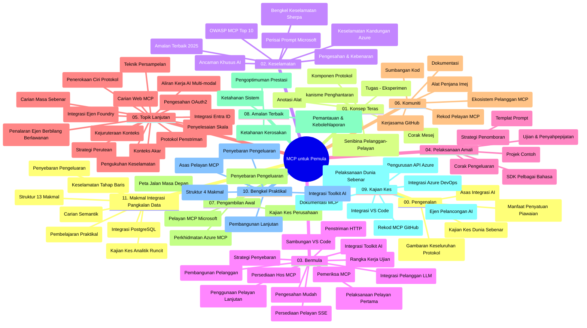

# Protokol Konteks Model (MCP) untuk Pemula - Panduan Kajian

Panduan kajian ini memberikan gambaran mengenai struktur repositori dan kandungan bagi kurikulum "Protokol Konteks Model (MCP) untuk Pemula". Gunakan panduan ini untuk menavigasi repositori dengan berkesan dan memanfaatkan sumber daya yang tersedia.

## Gambaran Keseluruhan Repositori

Protokol Konteks Model (MCP) adalah kerangka kerja standard untuk interaksi antara model AI dan aplikasi klien. Pada mulanya dibuat oleh Anthropic, MCP kini dikendalikan oleh komuniti MCP yang lebih luas melalui organisasi rasmi GitHub. Repositori ini menyediakan kurikulum komprehensif dengan contoh kod praktikal dalam C#, Java, JavaScript, Python, dan TypeScript, direka untuk pembangun AI, arkitek sistem, dan jurutera perisian.

## Peta Kurikulum Visual

## Struktur Repositori

Repositori ini disusun dalam sebelas bahagian utama, setiap satu menumpukan pada aspek berbeza MCP:

1. **Pengenalan (00-Introduction/)**
   - Gambaran keseluruhan Protokol Konteks Model
   - Mengapa penyeragaman penting dalam saluran AI
   - Kes penggunaan praktikal dan manfaatnya

2. **Konsep Teras (01-CoreConcepts/)**
   - Seni bina klien-pelayan
   - Komponen utama protokol
   - Corak penghantaran mesej dalam MCP

3. **Keselamatan (02-Security/)**
   - Ancaman keselamatan dalam sistem berasaskan MCP
   - Amalan terbaik untuk mengamankan pelaksanaan
   - Strategi pengesahan dan kebenaran
   - **Dokumentasi Keselamatan Menyeluruh**:
     - Amalan Terbaik Keselamatan MCP 2025
     - Panduan Pelaksanaan Keselamatan Kandungan Azure
     - Kawalan dan Teknik Keselamatan MCP
     - Rujukan Pantas Amalan Terbaik MCP
   - **Topik Keselamatan Utama**:
     - Serangan suntikan prompt dan pencemaran alat
     - Pembajakan sesi dan masalah wakil yang keliru
     - Kelemahan laluan token
     - Kebenaran berlebihan dan kawalan akses
     - Keselamatan rantaian bekalan untuk komponen AI
     - Integrasi Microsoft Prompt Shields

4. **Memulakan (03-GettingStarted/)**
   - Penyediaan dan konfigurasi persekitaran
   - Mewujudkan pelayan dan klien MCP asas
   - Integrasi dengan aplikasi sedia ada
   - Termasuk bahagian untuk:
     - Pelaksanaan pelayan pertama
     - Pembangunan klien
     - Integrasi klien LLM
     - Integrasi VS Code
     - Pelayan Server-Sent Events (SSE)
     - Penggunaan pelayan lanjutan
     - Penstriman HTTP
     - Integrasi AI Toolkit
     - Strategi ujian
     - Garis panduan pengeluaran

5. **Pelaksanaan Praktikal (04-PracticalImplementation/)**
   - Menggunakan SDK dalam pelbagai bahasa pengaturcaraan
   - Teknik penyahpepijatan, pengujian, dan pengesahan
   - Membina templat prompt dan aliran kerja yang boleh digunakan semula
   - Projek contoh dengan contoh pelaksanaan

6. **Topik Lanjutan (05-AdvancedTopics/)**
   - Teknik kejuruteraan konteks
   - Integrasi agen Foundry
   - Aliran kerja AI pelbagai mod
   - Demonstrasi pengesahan OAuth2
   - Keupayaan carian masa nyata
   - Penstriman masa nyata
   - Pelaksanaan konteks akar
   - Strategi penghalaan
   - Teknik pensampelan
   - Pendekatan skala
   - Pertimbangan keselamatan
   - Integrasi keselamatan Entra ID
   - Integrasi carian web
   - Penalaran multi-agen bertentangan (corak perdebatan)

7. **Sumbangan Komuniti (06-CommunityContributions/)**
   - Cara menyumbang kod dan dokumentasi
   - Bekerjasama melalui GitHub
   - Penambahbaikan dan maklum balas yang dipacu komuniti
   - Menggunakan pelbagai klien MCP (Claude Desktop, Cline, VSCode)
   - Bekerja dengan pelayan MCP popular termasuk penjanaan imej

8. **Pengajaran dari Penerapan Awal (07-LessonsfromEarlyAdoption/)**
   - Pelaksanaan dunia sebenar dan kisah kejayaan
   - Membangun dan mengeluarkan penyelesaian berasaskan MCP
   - Tren dan peta hala tuju masa depan
   - **Panduan Pelayan MCP Microsoft**: Panduan komprehensif untuk 10 pelayan MCP Microsoft sedia produksi termasuk:
     - Pelayan MCP Microsoft Learn Docs
     - Pelayan MCP Azure (15+ penyambung khusus)
     - Pelayan MCP GitHub
     - Pelayan MCP Azure DevOps
     - Pelayan MCP MarkItDown
     - Pelayan MCP SQL Server
     - Pelayan MCP Playwright
     - Pelayan MCP Dev Box
     - Pelayan MCP Azure AI Foundry
     - Pelayan MCP Microsoft 365 Agents Toolkit

9. **Amalan Terbaik (08-BestPractices/)**
   - Penalaan prestasi dan pengoptimuman
   - Rekabentuk sistem MCP tahan ralat
   - Strategi ujian dan ketahanan

10. **Kajian Kes (09-CaseStudy/)**
    - **Tujuh kajian kes menyeluruh** yang menunjukkan kepelbagaian MCP merentasi pelbagai senario:
    - **Ejen Pelancongan AI Azure**: Orkestrasi multi-agen dengan Azure OpenAI dan Carian AI
    - **Integrasi Azure DevOps**: Automasi proses aliran kerja dengan kemas kini data YouTube
    - **Pengambilan Dokumentasi Masa Nyata**: Klien konsol Python dengan penstriman HTTP
    - **Penjana Pelan Kajian Interaktif**: Aplikasi web Chainlit dengan AI perbualan
    - **Dokumentasi Dalam Editor**: Integrasi VS Code dengan aliran kerja GitHub Copilot
    - **Pengurusan API Azure**: Integrasi API perusahaan dengan penciptaan pelayan MCP
    - **Daftar MCP GitHub**: Pembangunan ekosistem dan platform integrasi agen
    - Contoh pelaksanaan merangkumi integrasi perusahaan, produktiviti pembangun, dan pembangunan ekosistem

11. **Bengkel Praktikal (10-StreamliningAIWorkflowsBuildingAnMCPServerWithAIToolkit/)**
    - Bengkel praktikal komprehensif menggabungkan MCP dengan AI Toolkit
    - Membangun aplikasi pintar menghubungkan model AI dengan alat dunia sebenar
    - Modul praktikal meliputi asas, pembangunan pelayan khusus, dan strategi pengeluaran
    - **Struktur Makmal**:
      - Makmal 1: Asas Pelayan MCP
      - Makmal 2: Pembangunan Pelayan MCP Lanjutan
      - Makmal 3: Integrasi AI Toolkit
      - Makmal 4: Pengeluaran dan Skala
    - Pendekatan pembelajaran berasaskan makmal dengan arahan langkah demi langkah

12. **Makmal Integrasi Pangkalan Data Pelayan MCP (11-MCPServerHandsOnLabs/)**
    - **Laluan pembelajaran 13 makmal komprehensif** untuk membina pelayan MCP sedia produksi dengan integrasi PostgreSQL
    - **Pelaksanaan analitik runcit dunia sebenar** menggunakan kes penggunaan Zava Retail
    - **Corak gred perusahaan** termasuk Keselamatan Tahap Baris (RLS), carian semantik, dan akses data pelbagai penyewa
    - **Struktur Makmal Lengkap**:
      - **Makmal 00-03: Asas** - Pengenalan, Seni Bina, Keselamatan, Penyediaan Persekitaran
      - **Makmal 04-06: Membangun Pelayan MCP** - Reka Bentuk Pangkalan Data, Pelaksanaan Pelayan MCP, Pembangunan Alat
      - **Makmal 07-09: Ciri Lanjutan** - Carian Semantik, Ujian & Penyahpepijatan, Integrasi VS Code
      - **Makmal 10-12: Pengeluaran & Amalan Terbaik** - Pengeluaran, Pemantauan, Pengoptimuman
    - **Teknologi Diliputi**: Kerangka FastMCP, PostgreSQL, Azure OpenAI, Azure Container Apps, Application Insights
    - **Hasil Pembelajaran**: Pelayan MCP sedia produksi, corak integrasi pangkalan data, analitik berkuasa AI, keselamatan perusahaan

## Sumber Tambahan

Repositori ini merangkumi sumber sokongan:

- **Folder Imej**: Mengandungi rajah dan ilustrasi yang digunakan sepanjang kurikulum
- **Terjemahan**: Sokongan pelbagai bahasa dengan terjemahan automatik dokumentasi
- **Sumber MCP Rasmi**:
  - [Dokumentasi MCP](https://modelcontextprotocol.io/)
  - [Spesifikasi MCP](https://spec.modelcontextprotocol.io/)
  - [Repositori GitHub MCP](https://github.com/modelcontextprotocol)

## Cara Menggunakan Repositori Ini

1. **Pembelajaran Bersusun**: Ikuti bab secara berurutan (00 hingga 11) untuk pengalaman pembelajaran berstruktur.
2. **Fokus Bahasa Tertentu**: Jika berminat dengan bahasa pengaturcaraan tertentu, terokai direktori contoh untuk pelaksanaan dalam bahasa pilihan anda.
3. **Pelaksanaan Praktikal**: Mulakan dengan bahagian "Memulakan" untuk menyediakan persekitaran dan membina pelayan serta klien MCP pertama anda.
4. **Penerokaan Lanjutan**: Setelah selesa dengan asas, terokai topik lanjutan untuk memperluas pengetahuan.
5. **Penglibatan Komuniti**: Sertai komuniti MCP melalui perbincangan GitHub dan saluran Discord untuk berhubung dengan pakar dan pembangun lain.

## Klien dan Alat MCP

Kurikulum merangkumi pelbagai klien dan alat MCP:

1. **Klien Rasmi**:
   - Visual Studio Code
   - MCP dalam Visual Studio Code
   - Claude Desktop
   - Claude dalam VSCode
   - Claude API

2. **Klien Komuniti**:
   - Cline (berasaskan terminal)
   - Cursor (penyunting kod)
   - ChatMCP
   - Windsurf

3. **Alat Pengurusan MCP**:
   - MCP CLI
   - MCP Manager
   - MCP Linker
   - MCP Router

## Pelayan MCP Popular

Repositori ini memperkenalkan pelbagai pelayan MCP, termasuk:

1. **Pelayan MCP Microsoft Rasmi**:
   - Pelayan MCP Microsoft Learn Docs
   - Pelayan MCP Azure (15+ penyambung khusus)
   - Pelayan MCP GitHub
   - Pelayan MCP Azure DevOps
   - Pelayan MCP MarkItDown
   - Pelayan MCP SQL Server
   - Pelayan MCP Playwright
   - Pelayan MCP Dev Box
   - Pelayan MCP Azure AI Foundry
   - Pelayan MCP Microsoft 365 Agents Toolkit

2. **Pelayan Rujukan Rasmi**:
   - Sistem Fail
   - Fetch
   - Memori
   - Pemikiran Berurutan

3. **Penjanaan Imej**:
   - Azure OpenAI DALL-E 3
   - Stable Diffusion WebUI
   - Replicate

4. **Alat Pembangunan**:
   - Git MCP
   - Kawalan Terminal
   - Pembantu Kod

5. **Pelayan Khusus**:
   - Salesforce
   - Microsoft Teams
   - Jira & Confluence

## Menyumbang

Repositori ini mengalu-alukan sumbangan daripada komuniti. Lihat bahagian Sumbangan Komuniti untuk panduan bagaimana menyumbang dengan berkesan kepada ekosistem MCP.

----

*Panduan kajian ini terakhir dikemas kini pada 5 Februari 2026, mencerminkan Spesifikasi MCP terkini 2025-11-25 dan memberikan gambaran repositori setakat tarikh tersebut. Kandungan repositori mungkin dikemas kini selepas tarikh ini.*

---

<!-- CO-OP TRANSLATOR DISCLAIMER START -->
**Penafian**:  
Dokumen ini telah diterjemahkan menggunakan perkhidmatan terjemahan AI [Co-op Translator](https://github.com/Azure/co-op-translator). Walaupun kami berusaha untuk ketepatan, sila ambil maklum bahawa terjemahan automatik mungkin mengandungi kesilapan atau ketidaktepatan. Dokumen asal dalam bahasa asalnya hendaklah dianggap sebagai sumber yang sahih. Untuk maklumat penting, terjemahan manusia profesional adalah disyorkan. Kami tidak bertanggungjawab atas sebarang salah faham atau salah tafsir yang timbul daripada penggunaan terjemahan ini.
<!-- CO-OP TRANSLATOR DISCLAIMER END -->