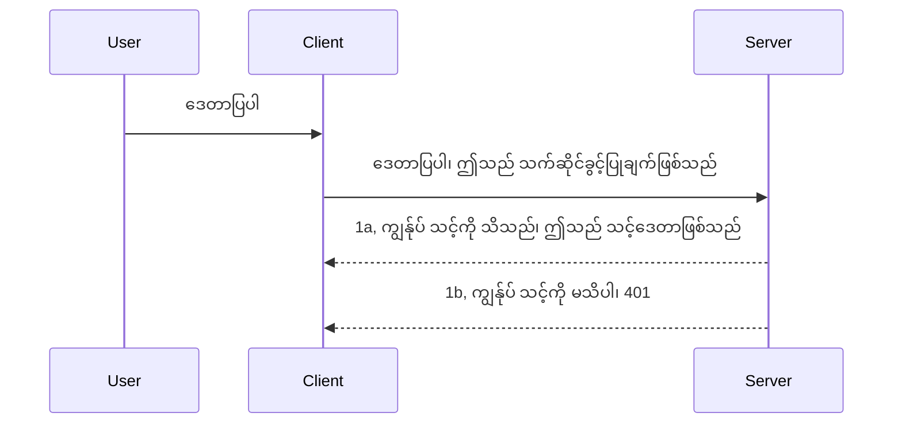

# ရိုးရှင်းသော အတည်ပြုခြင်း

MCP SDK များသည် OAuth 2.1 ကိုအသုံးပြုရန် ထောက်ခံသည့်အပြင် ၎င်းသည် auth server, resource server, credential များတင်ပြခြင်း၊ code ရယူခြင်း၊ code ကို bearer token အဖြစ် လဲလှယ်ခြင်းမှ စ၍ သင်၏ resource data ကို နောက်ဆုံးတွင် ရရှိနိုင်မည့် အဆင့်မြင့်လုပ်ငန်းစဉ်တစ်ခုဖြစ်ပါသည်။ OAuth ကို မသုံးဖူးသူများအတွက်၊ ၎င်းကို တကယ်အသုံးချရန်အတွက် အခြေခံအဆင့် auth နဲ့ စပြီး လုံခြုံရေး ပိုမိုပြည့်စုံလာအောင် တည်ဆောက်သွားဖို့ ကောင်းသော အကြံဉာဏ်ဖြစ်ပါသည်။ ဒီအတွက် ဤအခန်းထဲမှာ မိမိကို ပိုမိုခိုင်မာတဲ့ auth များသို့ တိုးတက်လာစေဖို့ ရည်ရွယ်ထားပါတယ်။

## Auth, ဘာကို ညွှန်းလိုတာလဲ?

Auth ဆိုတာ authentication နဲ့ authorization ကို အတိုကောက်ဖြစ်ပါတယ်။ အကြောင်းအရင်းကတော့ ကျွန်တော်တို့လုပ်ဖို့လိုတာ ၂ ခုရှိပါတယ်-

- **Authentication** ဆိုတာ သက်သေပြုခွင့်ပေးခြင်း ဖြစ်ပြီး၊ လူတစ်ယောက်ကို မိမိအိမ်ထဲ ဝင်ခွင့်ပေးမလား၊ ၎င်းမှာ မိမိ MCP Server ရဲ့ features တွေနေရာ resource server နှင့် သွယ်ဝိုက်ခွင့်ရှိပါသလား စစ်ဆေးလေ့လာမှုဖြစ်ပါတယ်။
- **Authorization** ဆိုတာ အသုံးပြုသူတစ်ယောက်က မေးမြန်းလာတဲ့ အထူး resource များအားလုံး (ဥပမာ မှာအော်ဒါများ သို့မဟုတ် ပစ္စည်းများ) ကို ဝင်ရောက်ခွင့်ရှိသလား၊ ဆလောတယ် ဖတ်ရှုခွင့်သာ ရှိပြီး ဖျက်ပစ်ခွင့်မရှိသေး‌ပါက စစ်ဆေးခြင်းဖြစ်ပါတယ်။

## Credentials: စနစ်အား ကျွန်ုပ်တို့ ဘယ်သူဆိုတာ ပြောပြခြင်း

အများအားဖြင့် ဝဘ် ဖန်တီးသူများသည် server ကို credential တစ်ခု (လျှို့ဝှက်ချက်တစ်ခု) ပေးပို့၍ အောက်သို့ ဝင်ခွင့် ရှိသလား ဆိုတာကို စဉ်းစားကြသည်။ ယင်း credential သည် username နဲ့ password ကို base64 encode လုပ်ထားသို့မဟုတ် အသုံးပြုသူ တစ်ဦးကို ထူးခြားစွာ သတ်မှတ်ပေးသော API key တစ်ခုဖြစ်တတ်သည်။

ဒေတာကို "Authorization" ဟုပေါ်တင်ပေးသော header မှတဆင့် ပို့ပေးရသည်။

```json
{ "Authorization": "secret123" }
```

ဒါက အများအားဖြင့် basic authentication လို့ ခေါ်ကြပါတယ်။ စနစ်၏ အပြင်အဆင် အကျဉ်းချုပ်မှာ:


အခုတော့ အဆင့်စဉ်တွေအရ ဒီဖွဲ့စည်းမှု कैसे လုပ်မလဲဆိုတာနားလည်ပြီ၊ ၎င်းကို ဘယ်လို ဆောင်ရွက်မလဲ? များသော ဝဘ် ဆာဗာများတွင် middleware လို့ ခေါ်တဲ့ အခြားအပိုင်းကိုအသုံးပြုပါတယ်၊ ၎င်းက request တစ်ခုကို စစ်ဆေးနိုင်ပြီး credential မှန်ကန်ပါက ဖွင့်ပေးနိုင်သည်။ credential မမှန်ပါက auth error  တွေ့ရ။ ဒီလို ဆောင်ရွက်နည်း ကျွန်တော်တို့ကြည့်ရအောင်-

**Python**

```python
class AuthMiddleware(BaseHTTPMiddleware):
    async def dispatch(self, request, call_next):

        has_header = request.headers.get("Authorization")
        if not has_header:
            print("-> Missing Authorization header!")
            return Response(status_code=401, content="Unauthorized")

        if not valid_token(has_header):
            print("-> Invalid token!")
            return Response(status_code=403, content="Forbidden")

        print("Valid token, proceeding...")
       
        response = await call_next(request)
        # ဖောက်သည်ခေါင်းစီးများကို ထည့်သွင်းရန် သို့မဟုတ် တုံ့ပြန်ချက်တွင် တစ်စိတ်တစ်ပိုင်း ပြောင်းလဲရန်
        return response


starlette_app.add_middleware(CustomHeaderMiddleware)
```

ဒီမှာ:

- `AuthMiddleware` ဆိုတဲ့ middleware တစ်ခု တည်ဆောက်ပြီး `dispatch` method ကို web server က အော်ခဲ့တယ်။
- Middleware ကို web server မှာ ထည့်ထားသည်။

    ```python
    starlette_app.add_middleware(AuthMiddleware)
    ```

- Authorization header ရှိ/မရှိ စစ်ဆေး ဂရုပြုသည့် validation logic ရေးသားထားသည်။

    ```python
    has_header = request.headers.get("Authorization")
    if not has_header:
        print("-> Missing Authorization header!")
        return Response(status_code=401, content="Unauthorized")

    if not valid_token(has_header):
        print("-> Invalid token!")
        return Response(status_code=403, content="Forbidden")
    ```

    secret ရှိပြီး မှန်ကန်လျှင် `call_next` ကိုခေါ်သုံးပြီး request ရဲ့ response ကို ပေးပို့သည်။

    ```python
    response = await call_next(request)
    # အဖြေတစ်ခုတွင်မည်သည့်ဖောက်သည်ခေါင်းစဉ်များကိုမဆိုထည့်သွင်းရန် သို့မဟုတ် ပြောင်းလဲရန်
    return response
    ```

စနစ်အရ မည်သည့် web request မဆို server ထံသို့ရောက်လာလျှင် middleware ကို အော်တာ လုပ်သည်။ နောက်ကွယ်တွင် လိုအပ်သလို pass လုပ်ရန် ခွင့်ပြုခြင်း သို့မဟုတ် မခွင့်ပြုနိုင်ကြောင်း error တစ်ခု ပြန်ပေးပါသည်။

**TypeScript**

ဒီမှာ Express framework အားလုံးကို အသုံးပြုပြီး middleware တစ်ခု ဖန်တီးကြည့်မယ်။ MCP Server အထိ request မတိုင်မီ request ကိုစစ်ဆေးမယ်။ ယခုကော့ဒ်မှာ:

```typescript
function isValid(secret) {
    return secret === "secret123";
}

app.use((req, res, next) => {
    // ၁။ ခွင့်ပြုချက် ခေါင်းစဉ် ရှိပါသလား?
    if(!req.headers["Authorization"]) {
        res.status(401).send('Unauthorized');
    }
    
    let token = req.headers["Authorization"];

    // ၂။ တရားဝင်မှုကို စစ်ဆေးပါ။
    if(!isValid(token)) {
        res.status(403).send('Forbidden');
    }

   
    console.log('Middleware executed');
    // ၃။ မိမိတောင်းဆိုမှုအား တောင်းဆိုမှု လမ်းကြောင်း၏ နောက်တစ်အဆင့်သို့ ဖြတ်သန်းသည်။
    next();
});
```

ဒီ code မှာ

1. Authorization header ရှိ/မရှိစစ်ဆေးပြီး မရှိပါက 401 error ပေးပို့သည်။
2. credential/token မှန်ကန်မှုကို စစ်ဆေးပြီး မမှန်ပါက 403 error ပေးပို့သည်။
3. အဆင့်တင် request ကို ကြိုက်ရာနေရာဆီ သွားပြီး အသေးစိတ် resource ကို ပြန်ပေးပို့သည်။

## လေ့ကျင့်ခန်း: Authentication ကို လက်တွေ့ဆောင်ရွက်ခြင်း

ကျွန်ုပ်တို့၏ အသိပညာများကို အသုံးချ၍ လက်တွေ့ ဆောင်ရွက်ကြရအောင်။ အကြံအစည်းမှာ:

Server

- Web server နှင့် MCP instance တည်ဆောက်ပါ။
- Server အတွက် middleware တစ်ခု ဆောင်ရွက်ပါ။

Client

- Credential ပါသော header ဖြင့် web request ပို့ပါ။

### -1- Web server နှင့် MCP instance တည်ဆောက်ခြင်း

ပထမအဆင့်မှာ web server instance နှင့် MCP Server ကို ဖန်တီးရပါမယ်။

**Python**

MCP server instance တစ်ခု ဖန်တီးပြီး, starlette web app တစ်ခု ဖန်တီးကာ uvicorn ဖြင့် host လုပ်ပါမည်။

```python
# MCP ဆာဗာ ဖန်တီးနေသည်

app = FastMCP(
    name="MCP Resource Server",
    instructions="Resource Server that validates tokens via Authorization Server introspection",
    host=settings["host"],
    port=settings["port"],
    debug=True
)

# starlette ဝက်ဘ်အက်ပ် ဖန်တီးနေသည်
starlette_app = app.streamable_http_app()

# uvicorn ဖြင့် အက်ပ်ဆာဗ် ပြုလုပ်နေသည်
async def run(starlette_app):
    import uvicorn
    config = uvicorn.Config(
            starlette_app,
            host=app.settings.host,
            port=app.settings.port,
            log_level=app.settings.log_level.lower(),
        )
    server = uvicorn.Server(config)
    await server.serve()

run(starlette_app)
```

ဒီ code မှာ-

- MCP Server ကို တည်ဆောက်ပါ။
- MCP Server ကနေ starlette web app ကို `app.streamable_http_app()` ဖြင့် ဖန်တီးသည်။
- uvicorn ဖြင့် web app ကို host လုပ်သည်။ `server.serve()`။

**TypeScript**

ဒီမှာ MCP Server instance တစ်ခု ဖန်တီးသည်။

```typescript
const server = new McpServer({
      name: "example-server",
      version: "1.0.0"
    });

    // ... ဆာဗာအရင်းအမြစ်များ၊ ကိရိယာများနှင့် ပြောကြားချက်များ ပြင်ဆင်ရန် ...
```

MCP Server ဖန်တီးခြင်းကို POST /mcp route ထဲမှာ ဆောင်ရွက်ရမယ်ဆိုတော့ အထက်က code ကို အောက်ပါအတိုင်း ရွှေ့လိုက်ကြရအောင်။

```typescript
import express from "express";
import { randomUUID } from "node:crypto";
import { McpServer } from "@modelcontextprotocol/sdk/server/mcp.js";
import { StreamableHTTPServerTransport } from "@modelcontextprotocol/sdk/server/streamableHttp.js";
import { isInitializeRequest } from "@modelcontextprotocol/sdk/types.js"

const app = express();
app.use(express.json());

// စက်တင် ID အလိုက် သယ်ယူပို့ဆောင်မှုများကို သိမ်းဆည်းရန် မြေပုံ
const transports: { [sessionId: string]: StreamableHTTPServerTransport } = {};

// client မှ server သို့ ဆက်သွယ်မှုများအတွက် POST တောင်းဆိုမှုများကို ကိုင်တွယ်ပါ
app.post('/mcp', async (req, res) => {
  // ရှိပြီးသား စက်တင် ID ရှိမရှိ စစ်ဆေးပါ
  const sessionId = req.headers['mcp-session-id'] as string | undefined;
  let transport: StreamableHTTPServerTransport;

  if (sessionId && transports[sessionId]) {
    // ရှိပြီးသား သယ်ယူပို့ဆောင်မှုကို ပြန်အသုံးပြုပါ
    transport = transports[sessionId];
  } else if (!sessionId && isInitializeRequest(req.body)) {
    // အသစ်စတင်ရယူခြင်း တောင်းဆိုချက်
    transport = new StreamableHTTPServerTransport({
      sessionIdGenerator: () => randomUUID(),
      onsessioninitialized: (sessionId) => {
        // စက်တင် ID အလိုက် သယ်ယူပို့ဆောင်မှုကို သိမ်းဆည်းပါ
        transports[sessionId] = transport;
      },
      // DNS ပြောင်းလဲခြင်းကာကွယ်မှုကို နောက်ပြန်ဆင်တင်မှုအတွက် မူရင်းအတိုင်း ဖျက်သိမ်းထားသည်။ သင့်ရဲ့ server ကို
      // ဒေသတွင်းတွင်လည်ပတ်နေပါက၊ အောက်ပါအတိုင်း သတ်မှတ်ပေးရန် သေချာပါစေ။
      // enableDnsRebindingProtection: true,
      // allowedHosts: ['127.0.0.1'],
    });

    // ပိတ်သိမ်းခြင်းအချိန်တွင် သယ်ယူပို့ဆောင်မှုကို သန့်ရှင်းပေးပါ
    transport.onclose = () => {
      if (transport.sessionId) {
        delete transports[transport.sessionId];
      }
    };
    const server = new McpServer({
      name: "example-server",
      version: "1.0.0"
    });

    // ... server ရဲ့ အရင်းအမြစ်များ၊ ကိရိယာများနှင့် အမိန့်များကို ပြင်ဆင်ပါ ...

    // MCP server နှင့်ချိတ်ဆက်ပါ
    await server.connect(transport);
  } else {
    // တောင်းဆိုမှုမမည့်
    res.status(400).json({
      jsonrpc: '2.0',
      error: {
        code: -32000,
        message: 'Bad Request: No valid session ID provided',
      },
      id: null,
    });
    return;
  }

  // တောင်းဆိုမှုကို ကိုင်တွယ်ပါ
  await transport.handleRequest(req, res, req.body);
});

// GET နှင့် DELETE တောင်းဆိုမှုများအတွက် ပြန်အသုံးပြုနိုင်သော ကိရိယာ
const handleSessionRequest = async (req: express.Request, res: express.Response) => {
  const sessionId = req.headers['mcp-session-id'] as string | undefined;
  if (!sessionId || !transports[sessionId]) {
    res.status(400).send('Invalid or missing session ID');
    return;
  }
  
  const transport = transports[sessionId];
  await transport.handleRequest(req, res);
};

// server မှ client သို့ ဂေါ်လိုက်မှုအသစ်များအတွက် SSE အသုံးပြု၍ GET တောင်းဆိုမှုများကို ကိုင်တွယ်ပါ
app.get('/mcp', handleSessionRequest);

// စက်တင် ကုန်ဆုံးသွားခြင်းအတွက် DELETE တောင်းဆိုမှုများကို ကိုင်တွယ်ပါ
app.delete('/mcp', handleSessionRequest);

app.listen(3000);
```

အခု MCP Server ဖန်တီးခြင်းက `app.post("/mcp")` အတွင်းသို့ရွှေ့ထားတာ မြင်ရပါတယ်။

Middleware အတွက် တာဝတဒ်နောက်တစ်ဆင့် သွားကြည့်ပါမယ်။

### -2- Server အတွက် middleware ကို ဆောင်ရွက်ခြင်း

Middleware ကို ဖန်တီးမယ်ဆိုရင် `Authorization` header ထဲက credential ကို ရှာဖွေရုံသာမက အတည်ပြုပါတယ်။ သင့်လျော်လျှင် request က လုပ်ဆောင်ရန် လိုအပ်သမျှရှိရာ သို့သွားပါမည် (ဥပမာ- tools များ စာရင်းပြုစုခြင်း၊ resource ဖတ်ခြင်း သို့မဟုတ် MCP သဖွယ် လုပ်ဆောင်ချက်များ)။

**Python**

Middleware ဖန်တီးချင်လျှင် `BaseHTTPMiddleware` မှ ၎င်း class ကို ဆက်ခံသင့်တယ်၊ ၂ ခုဆန်းကြယ်တဲ့ အပိုင်းရှိပါတယ်-

- request `request` , header အချက်အလက် ဖတ်ရှုပါတယ်။
- `call_next` callback ကို client က မိတ်ဆက်လာသည့် credential သာသနာ လက်ခံလျှင် ခေါ်ရမည်။

အစမှာ `Authorization` header မပါက ပြဿနာရှိပါက-

```python
has_header = request.headers.get("Authorization")

# ခေါင်းစဉ်မရှိပါ။ ၄၀၁ ဖြင့်မအောင်မြင်ပါ၊ မဟုတ်လျှင် ဆက်သွားပါ။
if not has_header:
    print("-> Missing Authorization header!")
    return Response(status_code=401, content="Unauthorized")
```

client authentication မအောင်မြင် ဟု 401 unauthorized error ပေးပို့သည်။

နောက်တစ်ဆင့် credential တင်ခဲ့သည်ဆို့လျှင် ဤကဲ့သို့ သက်ဆိုင်ရာ အတည်ပြုမှုစစ်ဆေးချက်များ။

```python
 if not valid_token(has_header):
    print("-> Invalid token!")
    return Response(status_code=403, content="Forbidden")
```

ဒီမှာ 403 forbidden error ပေးပို့သည်။ နောက်ဆုံးမကြည့်ချင်ပါက အောက်ပါ middleware code အား ကြည့်ပါ။

```python
class AuthMiddleware(BaseHTTPMiddleware):
    async def dispatch(self, request, call_next):

        has_header = request.headers.get("Authorization")
        if not has_header:
            print("-> Missing Authorization header!")
            return Response(status_code=401, content="Unauthorized")

        if not valid_token(has_header):
            print("-> Invalid token!")
            return Response(status_code=403, content="Forbidden")

        print("Valid token, proceeding...")
        print(f"-> Received {request.method} {request.url}")
        response = await call_next(request)
        response.headers['Custom'] = 'Example'
        return response

```

ကောင်းပါပြီ၊ `valid_token` function ကော? အောက်မှာ ပေးထားပါတယ်-

```python
# ထုတ်လုပ်မှုအတွက် မသုံးရပါ - တိုးတက်အောင်လုပ်ပါ !!
def valid_token(token: str) -> bool:
    # "Bearer " နာမည်အစ ကို ဖယ်ရှားပါ
    if token.startswith("Bearer "):
        token = token[7:]
        return token == "secret-token"
    return False
```

ဒီဟာ ပိုတိုးတက်သင့်ပါတယ်။

[!IMPORTANT] မှတ်ချက် - အဲ့ဒီလို ရေးထားသော code တွင် မည်သည့် လျှို့ဝှက်ချက်များကိုမျှ နေရာမထားသင့်ပါ။ ထိုဗလာနေရာတွင် ဒေတာရင်းမြစ် သို့မဟုတ် IDP (identity service provider) မှ ကောက်နုတ်ရောက်ရှိစေသင့်သည်။

**TypeScript**

Express ဖြင့် ဆောင်ရွက်ခြင်းမှာ `use` method ကို ခေါ်ပြီး middleware function များ ထည့်သွင်းသည်။

- request ရဲ့ `Authorization` property အပေါ်က credential စစ်ဆေး။
- အတည်ပြုသွားလျှင် request ကို ဆက်လုပ်ရန် ခွင့်ပြုအောင်လုပ်၊ မဟုတ်လျှင် မဖြတ်ခွင့်။

Authorization header မရှိပါက request ကို သွားခြင်းမဖြတ်ပစ်ပါ။

```typescript
if(!req.headers["authorization"]) {
    res.status(401).send('Unauthorized');
    return;
}
```

header မပါလျှင် 401 error ဒဏ်ရာခံရသည်။

နောက်တစ်ဆင့် credential မှန်/မမှန်စစ်ဆေးပြီး မမှန်က request မဖြတ်ပစ်ပါ။

```typescript
if(!isValid(token)) {
    res.status(403).send('Forbidden');
    return;
} 
```

403 error တောင်းခံလိုက်သည်။

အပြည့်အစုံ code ကတော့

```typescript
app.use((req, res, next) => {
    console.log('Request received:', req.method, req.url, req.headers);
    console.log('Headers:', req.headers["authorization"]);
    if(!req.headers["authorization"]) {
        res.status(401).send('Unauthorized');
        return;
    }
    
    let token = req.headers["authorization"];

    if(!isValid(token)) {
        res.status(403).send('Forbidden');
        return;
    }  

    console.log('Middleware executed');
    next();
});
```

client မှ တောင်းသည့် credential ကို စစ်ဆေးမည့် middleware ပါသော web server ဖြင့် စတင်ထားပြီ။ client ကို မကြည့်သေးတာလား?

### -3- Credential ပါသော header ဖြင့် web request ပို့ခြင်း

client မှ header ထဲက credential ဖြင့် မပို့ခဲ့ရင် မတိုင်သည်။ MCP client အသုံးပြုမယ်ဆိုတဲ့အတွက် ဘယ်လိုလုပ်ရမလဲ ကို သုံးသပ်ကြမယ်။

**Python**

client အတွက် credential ပါ header ထဲကို ဒီလိုပေးပါ။

```python
# တန်ဖိုးကို အခိုင်အမာသတ်မှတ် မထားပဲ အနည်းဆုံး ပတ်ဝန်းကျင် အပြောင်းအလဲ၊ သို့မဟုတ် ပိုမိုလုံခြုံသော သိမ်းဆည်းမှုတွင် ထားရှိပါ
token = "secret-token"

async with streamablehttp_client(
        url = f"http://localhost:{port}/mcp",
        headers = {"Authorization": f"Bearer {token}"}
    ) as (
        read_stream,
        write_stream,
        session_callback,
    ):
        async with ClientSession(
            read_stream,
            write_stream
        ) as session:
            await session.initialize()
      
            # TODO, သင့်လိုအပ်သော client အတွင်းလုပ်ဆောင်လိုသောအရာများ၊ ဥပမာကိရိယာများ စာရင်းပြုစုခြင်း၊ ကိရိယာများကို ခေါ်ဆိုခြင်း စသဖြင့်
```

`headers = {"Authorization": f"Bearer {token}"}` ဟု headers property ကို ဖြည့်ထားသည်။

**TypeScript**

၂ ဆင့်ဖြင့် ဖြေရှင်းနိုင်သည်-

1. configuration object ထဲ credential ထည့်သွင်း။
2. transport သို့ configuration object ပေးပို့။

```typescript

// ဒီလိုတိတိပဲ တန်ဖိုးကို ကိုးကားမယ့်အချိန်မှာသည်းခံမနေပါနဲ့။ နည်းနည်းလောက် environmental variable အနေနဲ့ထားပြီး dev mode မှာ dotenv လိုတစ်ခုကိုသုံးပါ။
let token = "secret123"

// client transport option object ကိုသတ်မှတ်ပါ
let options: StreamableHTTPClientTransportOptions = {
  sessionId: sessionId,
  requestInit: {
    headers: {
      "Authorization": "secret123"
    }
  }
};

// option object ကို transport ထဲသို့ပေးပို့ပါ
async function main() {
   const transport = new StreamableHTTPClientTransport(
      new URL(serverUrl),
      options
   );
```

ဒီမှာ `options` object ဖန်တီး ပြီး `requestInit` property အောက်မှ headers ထည့်ထားသည်ကို တွေ့ရသည်။

[!IMPORTANT] သတိပြုပါ။ ဒါက တိုးတက်မှုရှိစေရန် တစ်နေရာထက်ပိုသော စနစ် မပါဘဲ credential ကိုပေးပို့တာမှာ အန္တရာယ်ရှိသည်။ HTTPS မဖြစ်ရင် နည်းလမ်းကောင်းတစ်ခုမရှိဘူး။ credential ခိုးယူခံရနိုင်ခြင်းရှိသည်တော့ token ကို အလွယ်တကူ ပယ်ဖျက်နိုင်ဖို့ နောက်ထပ် စစ်ဆေးမှုများ လိုအပ်သည်။ သိပ်အမြဲတမ်း ဟာတာတွေ လုပ်နေ La, bot စတိုင်အပြုအမူအတွက် စောင့်ကြည့်မှုများလိုသည်။

ဒါပေမဲ့လည်း အလွန်ရိုးရှင်းသော APIs များအတွက် သင့်လျော်သည်။ သင့် API ကို အတည်ပြုမှု မရှိဘဲ မဆိုသူခေါ်ဆိုတာမလိုပါ။

ကျန်ခဲ့သမျှတို့ လုံခြုံရေးကို JSON Web Token (JWT) ပြုလုပ်ခြင်းဖြင့် တစ်ချိန်တည်း တိုးတက်စေကြပါစို့။

## JSON Web Tokens, JWT

အရင်းအကာ များရှင်းလင်းခြင်း-

JWT အသုံးပြုခြင်းမှ လိုလားသည့်တိုးတက်မှုပြုလုပ်မှုများ-

- **လုံခြုံရေးတိုးတက်မှုများ**။ Basic auth တွင် username နှင့် password ကို base64 encode ဘာသာပြန်၍ မကြာခဏ ပို့တတ်သည်။ JWT မှာ username နဲ့ password ကို ရရှိရန် token တစ်ခု ယူပြီး ထို token သက်တမ်းကာလရှိသည်။ ကျူးလွန်သည့် အခါ token ကုန်ပြီး သက်တမ်းဖြတ်သည်။ Roles, scopes နှင့် permissions အသုံးပြု၍ fine-grained access control လုပ်နိုင်သည်။
- **Stateless နဲ့ ပြန့်ပြားမှု**။ JWT များ လက်ရှိ user အချက်အလက်အားလုံးကို ပါးနောက်တိုင်း module ရှိမှုမလို၊ server-side session သိုလှောင်ရန် လိုမှုဖယ်ရှားသည်။ Token များကို နေရာတိုင်းတွင် အတည်ပြုနိုင်သည်။
- **Interoperability နဲ့ federation**။ JWT က Open ID Connect ၏ အလယ်ဗဟို ထားရှိမှုဖြစ်ပြီး Entra ID, Google Identity, Auth0 စသည့် ရှင်းလင်းသော identity provider များ အသုံးပြုသည်။ Single sign-on အပြင် ပို၍ ကောင်းမွန်သော အလုပ်လုပ်နိုင်မှုရှိသည်။
- **Module လုပ်ငန်းဆောင်တာ နှင့် Flexible ပညာရှိမှု**။ Azure API Management, NGINX စသည် API Gateways နှင့်လည်း အသုံးပြုနိုင်သည်။ သက်ဆိုင်ရာ authentication အခြေအနေများတွင် ဝန်ဆောင်မှုပေးချိန် server-to-service ဆက်သွယ်မှုများ၊ impersonation နှင့် delegation ကို စမ်းစစ်ရန် အတွက် လည်း သင့်တော်သည်။
- **စွမ်းဆောင်ရည် နှင့် Cache ထိရောက်မှု**။ JWT decode ပြီးနောက် cache ထားနိုင်သည်။ ဖြေရှင်းစရာ နည်းပါးဘဲဖြစ်၍ တင်ဆုံး Apps များတွင် throughput မြှင့်တင်ခြင်းနှင့် infrastructure ပေါ်ကျဆင်းမှု လျော့ချပေးသည်။
- **အဆင့်မြင့် Features များ**။ JWT သည် introspection (server ပေါ်တွင် တရားဝင်မှုစစ်ဆေးမှု) နှင့် revocation (token မမှန်အောင် ဖျက်ပစ်ခြင်း) ကို ပံ့ပိုးသည်။

အဲဒါမျိုးတွေ ရှိတဲ့အတွက် ကျွန်တော်တို့ရဲ့ လုပ်ငန်းစဉ်ကို ပို၍ တိုးတက်စေဖို့ ကြည့်ကြမယ်။

## Basic auth ကို JWT သို့ ပြောင်းလဲခြင်း

အဓိကပြောင်းလဲမှုများမှာ-

- **JWT token ဖန်တီးရေးကြံခြင်း** နှင့် client ကနေ server ထံ ပို့ရန် အဆင်သင့် ထားစေရန်။
- **JWT token အတည်ပြုခြင်း**၊ မှန်လျှင် client ၏ resource များ အပ်ပါမည်။
- **Token များ လုံခြုံစွာ သိမ်းဆည်းခြင်း**။
- **Route များ ကာကွယ်ခြင်း**။ MCP အင်ဂျင်နီယာ ဒေသတွင် route နှင့် အထူး MCP features များ ကာကွယ်ရန်။
- **Refresh token များ ပေါင်းထည့်ခြင်း**။ လျင်မြန် သက်တမ်းကုန် token များနဲ့ ရေရှည်အသက်ရှိ refresh token များထုတ်ပို့ခြင်း၊ refresh endpoint ဆောင်ရွက်ခြင်း နှင့် rotation နည်းလမ်းအသုံးပြုခြင်း။

### -1- JWT token ဖန်တီးခြင်း

ပထမစမ်းဆင်းရမှာ JWT token အစိတ်အပိုင်းများ-

- **header** ပြုပြင်မှုအသုံးပြုမှုနှင့် token အမျိုးအစား။
- **payload** claims တွေ ပါဝင်သည်။ sub (token ကို ကိုယ်စားပြုသူ user သို့ entity ဖြစ်သည်၊ ယေဘုယျအားဖြင့် user id ဖြစ်တတ်သည်)၊ exp (သက်တမ်းကုန်ရက်စွဲ), role (အခန်းကဏ္ဍ)
- **signature** လျှို့ဝှက်ချက် သို့မဟုတ် private key ဖြင့် ရိုက်နှိပ်ထားသည်။

Header, payload နှင့် encoded token ကို ဖန်တီးလိုအပ်သည်။

**Python**

```python

import jwt
import jwt
from jwt.exceptions import ExpiredSignatureError, InvalidTokenError
import datetime

# JWT ကိုလက်မှတ်ရေးထိုးရန် အသုံးပြုသော လျှို့ဝှက်သောသော့ချက်
secret_key = 'your-secret-key'

header = {
    "alg": "HS256",
    "typ": "JWT"
}

# အသုံးပြုသူအချက်အလက်များနှင့် ၎င်း၏ မူဝါဒများနှင့် သက်တမ်းကုန်ဆုံးချိန်
payload = {
    "sub": "1234567890",               # အကြောင်းအရာ (အသုံးပြုသူ ID)
    "name": "User Userson",                # စိတ်ကြိုက်မူဝါဒ
    "admin": True,                     # စိတ်ကြိုက်မူဝါဒ
    "iat": datetime.datetime.utcnow(),# ထုတ်ပေးချိန်
    "exp": datetime.datetime.utcnow() + datetime.timedelta(hours=1)  # သက်တမ်းကုန်ဆုံးချိန်
}

# ပုံသွင်း coded ဖြင့်သိမ်းဆည်းပါ။
encoded_jwt = jwt.encode(payload, secret_key, algorithm="HS256", headers=header)
```

အထက်မှာ:

- HS256 algorithm နှင့် JWT type အသုံးပြုပြီး header သတ်မှတ်ထားသည်။
- subject/user id, username, role, token ထုတ်ပေးသည့်အချိန် နှင့် သက်တမ်းကုန်ချိန်ပါရှိသော payload ကို ဖန်တီးထားပြီး အချိန်သတ်မှတ်မှုအတွက် ထည့်သွင်းထားသည်။

**TypeScript**

ယခုမှာ JWT token ဖန်တီးရန် အကူအညီဖြစ်မည့် dependency များလိုအပ်သည်။

Dependencies

```sh

npm install jsonwebtoken
npm install --save-dev @types/jsonwebtoken
```

အဲဒီအတိုင်း သင် header, payload ဖန်တီးပြီး encoded token ဖြစ်လာပါတယ်။

```typescript
import jwt from 'jsonwebtoken';

const secretKey = 'your-secret-key'; // ထုတ်လုပ်မှုတွင် env vars ကို အသုံးပြုပါ

// ပေးပို့မှုကို သတ်မှတ်ပါ
const payload = {
  sub: '1234567890',
  name: 'User usersson',
  admin: true,
  iat: Math.floor(Date.now() / 1000), // ထုတ်ပြန်ချိန်
  exp: Math.floor(Date.now() / 1000) + 60 * 60 // 1 နာရီအတွင်း သက်တမ်းကုန်သည်
};

// ခေါင်းစဉ်ကို သတ်မှတ်ပါ (ရွေးချယ်စရာ၊ jsonwebtoken သည် ပုံမှန် သတ်မှတ်ချက်များကို သတ်မှတ်ထားသည်)
const header = {
  alg: 'HS256',
  typ: 'JWT'
};

// တိုကင်ကို ဖန်တီးပါ
const token = jwt.sign(payload, secretKey, {
  algorithm: 'HS256',
  header: header
});

console.log('JWT:', token);
```

ဒီ token

HS256 ဖြင့် လက်မှတ်ထိုးထားသည်။
1 နာရီအထိ သက်တမ်းရှိသည်။
sub, name, admin, iat, exp စသည့် claims ပါရှိသည်။

### -2- Token အတည်ပြုခြင်း

Token ၏ တရားဝင်မှု စစ်ဆေးရန် server မှာ decode လုပ်ရမည်။ အမျိုးသန်းစစ်ဆေးရန် အများအပြားပါဝင်သည်၊ token ဖြစ်ပုံစံမှစပြီး ထို token မှ ဖော်ပြထားသော အသုံးပြုသူသည် စနစ်အတွင်းရှိမရှိ စစ်ဆေးရန်လည်း အကြံပြုသည်။

Token validate ပြုလုပ်ရန် decode လုပ်၍ ဖတ်ရှုနိုင်ရမည်။

**Python**

```python

# JWT ကို decode လုပ်ပြီး အတည်ပြုပါ
try:
    decoded = jwt.decode(token, secret_key, algorithms=["HS256"])
    print("✅ Token is valid.")
    print("Decoded claims:")
    for key, value in decoded.items():
        print(f"  {key}: {value}")
except ExpiredSignatureError:
    print("❌ Token has expired.")
except InvalidTokenError as e:
    print(f"❌ Invalid token: {e}")

```

ဒီ code မှာ `jwt.decode` ကို token၊ လျှို့ဝှက် key နှင့် algorithm ဖြင့်ခေါ်ယူသည်။ ဖျက်သိမ်းမှုဖြစ်မှုရှိပါက try-catch မှတဆင့် error handler ဦးစီးထားသည်။

**TypeScript**

`jwt.verify` က token ကို decode version ပြန်ပေးရမည်၊ မအောင်မြင်ပါက token ပြုလုပ်မှုမှား သို့မဟုတ် အသက်သာသော token မဟုတ်ကြောင်းဆိုလိုသည်။

```typescript

try {
  const decoded = jwt.verify(token, secretKey);
  console.log('Decoded Payload:', decoded);
} catch (err) {
  console.error('Token verification failed:', err);
}
```

မှတ်ချက်- ယခင်မှတ်ချက်တွင် ဖော်ပြသည့်အတိုင်း token တစ်ခု လက်တွဲရာ အသုံးပြုသူ ရှိ/မရှိ စစ်ဆေးရန် နှင့် အခွင့်အရေးများရှိ/မရှိ စစ်ဆေးရန် လုပ်ဆောင်သင့်သည်။

နောက်တစ်ခုမှာ Role-based access control (RBAC) ကို ကြည့်ရှုပါမယ်။
## အခန်းကဏ္ဍ အခြေခံအခန်းကဏ္ဍများအရ မဟာဗျူဟာအခြေခံလွှာအား ထည့်ရန်

အကြောင်းယူပုံကတော့ တစ်ခုချင်းစီ၏ အခန်းကဏ္ဍတွေမှာ ခွင့်ပြုချက်ကွာခြားချက်များရှိကြောင်း ဖေါ်ပြချင်တာဖြစ်ပါတယ်။ ဥပမာအားဖြင့် admin တစ်ဦးသည် အားလုံးကို လုပ်ဆောင်နိုင်ပြီး စံနမူနာအသုံးပြုသူက ဖတ်ရန်/ရေးရန်လုပ်နိုင်ပြီး ဧည့်သည်က ဖတ်ရန်သာလုပ်နိုင်ကြောင်း ယူဆပြီးဖြစ်ပါသည်။ ထို့ကြောင့်၊ အခွင့်ပြုချက်အဆင့်အတန်းတချို့ကတော့ -

- Admin.Write  
- User.Read  
- Guest.Read

middleware နှင့်အတူ ထိုကဲ့သို့သောထိန်းချုပ်မှုကို ဘယ်လိုအကောင်အထည်ဖော်မလဲ သှားကြည့်ကြရအောင်။ Middleware များကို route တစ်ခုချင်းစီအတွက်သာမက route များအားလုံးအတွက်လည်း ထည့်နိုင်ပါတယ်။

**Python**

```python
from starlette.middleware.base import BaseHTTPMiddleware
from starlette.responses import JSONResponse
import jwt

# ကုဒ်ထဲမှာ သော့ချက်ကို မထားသင့်ပါ၊ ဤသည်မှာ သရုပ်ပြရန်သာ ဖြစ်ပါသည်။ လုံခြုံသောနေရာမှ ဖတ်ပါ။
SECRET_KEY = "your-secret-key" # ဤကို env သတ်မှတ်ချက်အဖြစ် ထည့်ပါ။
REQUIRED_PERMISSION = "User.Read"

class JWTPermissionMiddleware(BaseHTTPMiddleware):
    async def dispatch(self, request, call_next):
        auth_header = request.headers.get("Authorization")
        if not auth_header or not auth_header.startswith("Bearer "):
            return JSONResponse({"error": "Missing or invalid Authorization header"}, status_code=401)

        token = auth_header.split(" ")[1]
        try:
            decoded = jwt.decode(token, SECRET_KEY, algorithms=["HS256"])
        except jwt.ExpiredSignatureError:
            return JSONResponse({"error": "Token expired"}, status_code=401)
        except jwt.InvalidTokenError:
            return JSONResponse({"error": "Invalid token"}, status_code=401)

        permissions = decoded.get("permissions", [])
        if REQUIRED_PERMISSION not in permissions:
            return JSONResponse({"error": "Permission denied"}, status_code=403)

        request.state.user = decoded
        return await call_next(request)


```
  
အောက်ပါအတိုင်း middleware ထည့်သွင်းလွယ်ကူတဲ့နည်းလမ်းအနည်းငယ်ရှိပါတယ်-  

```python

# Alt 1: starlette app တည်ဆောက်နေစဉ် middleware ထည့်ရန်
middleware = [
    Middleware(JWTPermissionMiddleware)
]

app = Starlette(routes=routes, middleware=middleware)

# Alt 2: starlette app ပြီးပြီးသား တည်ဆောက်ပြီးမှ middleware ထည့်ရန်
starlette_app.add_middleware(JWTPermissionMiddleware)

# Alt 3: လမ်းကြောင်းအလိုက် middleware ထည့်ရန်
routes = [
    Route(
        "/mcp",
        endpoint=..., # handler
        middleware=[Middleware(JWTPermissionMiddleware)]
    )
]
```
  
**TypeScript**

`app.use` ကို အသုံးပြု၍ မည်သည့် request မဆို မဖြစ်မနေ run လုပ်သော middleware ကို ထည့်နိုင်ပါတယ်။

```typescript
app.use((req, res, next) => {
    console.log('Request received:', req.method, req.url, req.headers);
    console.log('Headers:', req.headers["authorization"]);

    // 1. ခွင့်ပြုချက်အထိမ်းအမှတ်ကို ပို့ပြီးပြီလား စစ်ဆေးပါ

    if(!req.headers["authorization"]) {
        res.status(401).send('Unauthorized');
        return;
    }
    
    let token = req.headers["authorization"];

    // 2. တိုကင်သည် မှန်ကန်မှုရှိမရှိ စစ်ဆေးပါ
    if(!isValid(token)) {
        res.status(403).send('Forbidden');
        return;
    }  

    // 3. တိုကင် အသုံးပြုသူသည် ကျွန်ုပ်တို့စနစ်တွင်ရှိမရှိ စစ်ဆေးပါ
    if(!isExistingUser(token)) {
        res.status(403).send('Forbidden');
        console.log("User does not exist");
        return;
    }
    console.log("User exists");

    // 4. တိုကင်တွင် မှန်ကန်သောခွင့်ပြုချက်များ ရှိမရှိ အတည်ပြုပါ
    if(!hasScopes(token, ["User.Read"])){
        res.status(403).send('Forbidden - insufficient scopes');
    }

    console.log("User has required scopes");

    console.log('Middleware executed');
    next();
});

```
  
Middleware နဲ့ကျွန်တော်တို့လိုချင်တာတွေ ထည့်ခြင်းနှင့် ပြုလုပ်သင့်ရာများ၊ အဓိကမှာ -

1. authorization header ရှိ/မရှိ စစ်ဆေးခြင်း  
2. token မှန်ကန်မှု စစ်ဆေးခြင်း၊ ကျွန်တော်တို့ရေးထားတဲ့ `isValid` ဆိုတဲ့ method နဲ့ JWT token ၏ မူကြမ်းသေချာမှုနှင့် မှန်ကန်မှုကို စစ်ဆေးပါတယ်။  
3. အသုံးပြုသူဟာ ကျွန်တော်တို့ စနစ်အတွင်း ရှိ/မရှိ စစ်ဆေးသင့်ပါတယ်။

   ```typescript
    // DB ထဲရှိ အသုံးပြုသူများ
   const users = [
     "user1",
     "User usersson",
   ]

   function isExistingUser(token) {
     let decodedToken = verifyToken(token);

     // TODO, အသုံးပြုသူ DB ထဲတွင် ရှိမရှိ စစ်ဆေးရန်
     return users.includes(decodedToken?.name || "");
   }
   ```
  
အထက်တွင်လည်း စောင့်ကြည့်မှုအတွက် သာမန် `users` စာရင်းတစ်ခုကို ပြုလုပ်ထားသည်၊ အမှန် database ထဲမှာ ရှိသင့်ပါတယ်။

4. ထို့အပြင် token က အခွင့်ပြုချက်ถูกต้อง ရှိ/မရှိလည်း စစ်ဆေးသင့်ပါတယ်။

   ```typescript
   if(!hasScopes(token, ["User.Read"])){
        res.status(403).send('Forbidden - insufficient scopes');
   }
   ```
  
middleware ထဲက အပေါ်က code မှာ token မှာ User.Read permission ပါ/မပါ စစ်ဆေးပြီး မပါရင် 403 error ပေးပို့ပါတယ်။ အောက်မှာ `hasScopes` ဆိုတဲ့ helper method ပါပါတယ်။

   ```typescript
   function hasScopes(scope: string, requiredScopes: string[]) {
     let decodedToken = verifyToken(scope);
    return requiredScopes.every(scope => decodedToken?.scopes.includes(scope));
  }  
   ```

Have a think which additional checks you should be doing, but these are the absolute minimum of checks you should be doing.

Using Express as a web framework is a common choice. There are helpers library when you use JWT so you can write less code.

- `express-jwt`, helper library that provides a middleware that helps decode your token.
- `express-jwt-permissions`, this provides a middleware `guard` that helps check if a certain permission is on the token.

Here's what these libraries can look like when used:

```typescript
const express = require('express');
const jwt = require('express-jwt');
const guard = require('express-jwt-permissions')();

const app = express();
const secretKey = 'your-secret-key'; // put this in env variable

// Decode JWT and attach to req.user
app.use(jwt({ secret: secretKey, algorithms: ['HS256'] }));

// Check for User.Read permission
app.use(guard.check('User.Read'));

// multiple permissions
// app.use(guard.check(['User.Read', 'Admin.Access']));

app.get('/protected', (req, res) => {
  res.json({ message: `Welcome ${req.user.name}` });
});

// Error handler
app.use((err, req, res, next) => {
  if (err.code === 'permission_denied') {
    return res.status(403).send('Forbidden');
  }
  next(err);
});

```
  
အခုမြင်ရပြီ middleware ကို authentication နှင့် authorization နှစ်ခုလုံးအတွက် ဘယ်လိုအသုံးပြုနိုင်သလဲ၊ MCP အတွက်တော့ auth ကို ဘယ်လိုပြောင်းလဲသလဲ? သူ့အဖြေကို နောက်ပိုင်းအခန်းမှာရှာကြည့်ကြရအောင်။

### -3- MCP တွင် RBAC ထည့်ရန်

Middleware မှတဆင့် RBAC ထည့်ခြင်းကို ယခုပြောပြထားပေမယ့် MCP တွင် per MCP feature အလိုက် RBAC ထည့်ပေးရန် လွယ်ကူသောနည်းလမ်းမရှိပါ၊ ဒါကြောင့် ဘာလုပ်မလဲ? လုပ်ရန်ရှိတာကတော့ client က တစ်ခုချင်း tool ကိုခေါ်သုံးခွင့်ရှိမရှိ စစ်ဆေးဖို့ အောက်ပါအတိုင်း ကုဒ်ရေးသားမှသာဖြစ်ပါတယ်။

per feature RBAC ဆောင်ရွက်နိုင်ရေးအတွက် ရွေးချယ်စရာအချို့ကတော့ -

- license တွေအလိုက်၊ resource, prompt တစ်ခုချင်းစီအတွက် permission level ကို စစ်ဆေးသည့်ကုဒ်ထည့်ရန်။  

   **python**

   ```python
   @tool()
   def delete_product(id: int):
      try:
          check_permissions(role="Admin.Write", request)
      catch:
        pass # client သည် အတည်ပြုခွင့်မရရှိနိုင်သောကြောင့် အတည်ပြုခွင့် အမှားတင်ပါ။
   ```
   
   **typescript**

   ```typescript
   server.registerTool(
    "delete-product",
    {
      title: Delete a product",
      description: "Deletes a product",
      inputSchema: { id: z.number() }
    },
    async ({ id }) => {
      
      try {
        checkPermissions("Admin.Write", request);
        // လုပ်ရန်၊ id ကို productService နှင့် remote entry ဆီသို့ ပို့ရန်
      } catch(Exception e) {
        console.log("Authorization error, you're not allowed");  
      }

      return {
        content: [{ type: "text", text: `Deletected product with id ${id}` }]
      };
    }
   );
   ```


- ကြီးမားသော server နည်းလမ်းနှင့် request handler များကို အသုံးပြုပြီး စစ်ဆေးရမည့်နေရာများကို နည်းပါးစေခြင်း။

   **Python**

   ```python
   
   tool_permission = {
      "create_product": ["User.Write", "Admin.Write"],
      "delete_product": ["Admin.Write"]
   }

   def has_permission(user_permissions, required_permissions) -> bool:
      # user_permissions: အသုံးပြုသူတွင်ရှိသော ခွင့်ပြုချက်များစာရင်း
      # required_permissions: ကိရိယာအတွက်လိုအပ်သော ခွင့်ပြုချက်များစာရင်း
      return any(perm in user_permissions for perm in required_permissions)

   @server.call_tool()
   async def handle_call_tool(
     name: str, arguments: dict[str, str] | None
   ) -> list[types.TextContent]:
    # request.user.permissions သည် အသုံးပြုသူအတွက် ခွင့်ပြုချက်များစာရင်းဖြစ်သည်ဟု သတ်မှတ်ပါ
     user_permissions = request.user.permissions
     required_permissions = tool_permission.get(name, [])
     if not has_permission(user_permissions, required_permissions):
        # "သင်သည် {name} ကိရိယာကို ခေါ်ရန်ခွင့်မပြုပါ" ဟူသော အမှားပေါ်လွင်ခြင်း
        raise Exception(f"You don't have permission to call tool {name}")
     # ဆက်လက်လုပ်ဆောင်၍ ကိရိယာကိုခေါ်ပါ
     # ...
   ```   
   

   **TypeScript**

   ```typescript
   function hasPermission(userPermissions: string[], requiredPermissions: string[]): boolean {
       if (!Array.isArray(userPermissions) || !Array.isArray(requiredPermissions)) return false;
       // အသုံးပြုသူတွင်လိုအပ်သောခွင့်ပြုချက်တစ်ခုသို့မဟုတ် 그 이상ရှိပါက true ကိုပြန်ပေးပါ။
       
       return requiredPermissions.some(perm => userPermissions.includes(perm));
   }
  
   server.setRequestHandler(CallToolRequestSchema, async (request) => {
      const { params: { name } } = request;
  
      let permissions = request.user.permissions;
  
      if (!hasPermission(permissions, toolPermissions[name])) {
         return new Error(`You don't have permission to call ${name}`);
      }
  
      // ဆက်လက်လုပ်ဆောင်ပါ..
   });
   ```
  
   မှတ်ထားရန်။ middleware သည် decoded token ကို request ၏ user property တွင် သတ်မှတ်ပေးရမည်၊ ထို့ကြောင့် အထက်နမူနာကို ပိုမိုလွယ်ကူစေပါသည်။

### အနှစ်ချုပ်

ယခုအခါ RBAC ကို အထွေထွေပြုလုပ်နည်းနှင့် MCP အတွက် ဘယ်လိုထည့်သွင်းရမည်ဆိုတာ ဆွေးနွေးပြီးဖြစ်ပါပြီ၊ သင်တန်းသားများအနေဖြင့် စိတ်ဝင်စားမှုရှိစေရန် သင်တန်းအတွင်းတင်ထားသော concepts များကို ကိုယ်တိုင် security ကို အကောင်အထည်ဖော်ကြည့်ပါ။

## Assignment 1: mcp server နှင့် mcp client ကို basic authentication ဖြင့် တည်ဆောက်ခြင်း

ဒီနေရာမှာ သင်သင်ယူထားတဲ့ header မှတဆင့် credentials ပို့ပုံအကြောင်းကို လေ့လာသွားပါမယ်။

## Solution 1

[Solution 1](./code/basic/README.md)

## Assignment 2: Assignment 1 မှ Solution ကို JWT အသုံးပြုသည့် နည်းဖြင့် မြှင့်တင်ခြင်း

ပထမဆုံး Solution ကိုယူပြီး အခုတလောအချိန်ကို ယူပြီး တိုးတက်စေကြပါစို့။

Basic Auth အသုံးပြုခြင်းမပြုဘဲ JWT ကို အသုံးပြုမယ်။

## Solution 2

[Solution 2](./solution/jwt-solution/README.md)

## Challenge

"Add RBAC to MCP" ခြားနားချက်အတိုင်း tool တစ်ခုချင်းစီအတွက် RBAC ထည့်ပါ။

## အနှစ်ချုပ်

ဒီအခန်းက အကြောင်းမရှိဘဲ security ကနေ စတင်ပြီး basic security, JWT နဲ့ MCP တွင် ဘယ်လိုထည့်သွင်းရမယ်ဆိုတာ အနက်အဓိပ္ပါယ်နဲ့ ကျယ်ပြန့်စွာသိရှိဖို့ လေ့လာသွားနိုင်မှာပါ။

ကျွန်တော်တို့ custom JWTs များနဲ့ တည်ဆောက်ပေးထားပြီး၊ မကြာခင်အတိုင်း scalable ဖြစ်သွားတော့ standards-based identity model များသို့ ရွှေ့နိုင်နေပြီ ဖြစ်ပါတယ်။ Entra သို့မဟုတ် Keycloak စတဲ့ IdP ကို အသုံးပြုခြင်းဖြင့် သေချာစွာ token ထုတ်ပေးခြင်း၊ စစ်ဆေးခြင်းနှင့် အသက်တာကို စီမံခန့်ခွဲမှုအား ယုံကြည်ရသော ပလက်ဖောင်းတစ်ခုထံ လွှဲပေးနိုင်ပြီး၊ သင်တို့ကတော့ app logic နဲ့ user experience တွေအပေါ်ကိုသာ လေ့လာဆောင်ရွက်နိုင်ပါပြီ။

ဒီတွက် အပိုခန်း [Entra အကြောင်း](../../05-AdvancedTopics/mcp-security-entra/README.md) ရှိပါတယ်။

## နောက်တစ်ဆင့်

- နောက်တစ်ဆင့် - [MCP Hosts တွေကို စီစဉ်ခြင်း](../12-mcp-hosts/README.md)

---

<!-- CO-OP TRANSLATOR DISCLAIMER START -->
**အတည်မပြုချက်**:  
ဤစာရွက်စာတမ်းကို AI ဘာသာပြန်ကြားရေးဝန်ဆောင်မှု [Co-op Translator](https://github.com/Azure/co-op-translator) ဖြင့် ဘာသာပြန်ထားသည်။ မှန်ကန်မှုအတွက် ကြိုးစားကြပေမယ့် အလိုအလျောက် ဘာသာပြန်ချက်များတွင် အမှားများ သို့မဟုတ် မှားယွင်းချက်များ ပါဝင်နိုင်ကြောင်း သတိပြုပါရန် အဆိုပြုပါသည်။ မူလစာရွက်စာတမ်းကို မိမိဘာသာဖြင့် ရှင်းလင်းထားသော အတိုင်း မှန်ကန်သော အချက်အလက် ရင်းမြစ်အဖြစ် ယူဆသင့်ပါသည်။ အရေးကြီးသော သတင်းအချက်အလက်များအတွက် ကုသမှုအတိုင်ပင်ခံ လူ့ဘာသာပြန်ချက်ကို သုံးသင့်သည်။ ဤဘာသာပြန်ချက်ကို အသုံးပြုရာမှ ဖြစ်ပေါ်သည့် ဘာသာရပ်မတော် မမှန်ကန်မှုများ သို့မဟုတ် နားလည်မှားယွင်းမှုများအတွက် ကျွန်ုပ်တို့ တာဝန်မခံပါ။
<!-- CO-OP TRANSLATOR DISCLAIMER END -->