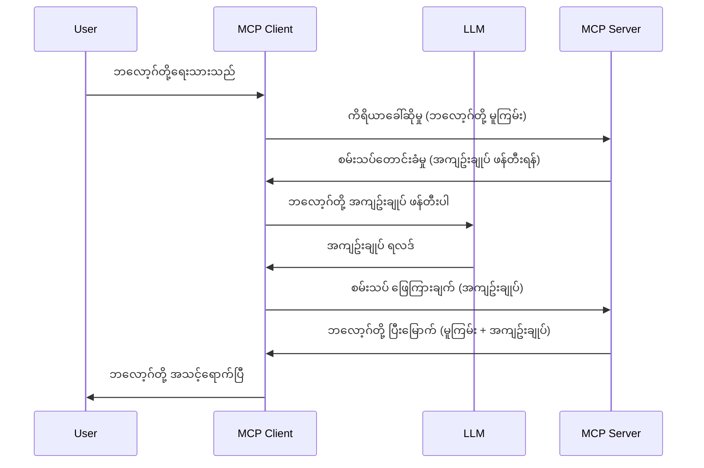

# Sampling - Client ကို delegate အားခွဲခြင်း

တခါတရံမှာ MCP Client နဲ့ MCP Server တို့ဆက်ဆံပြီး ပူးပေါင်းဆောင်ရွက်ရန် လိုအပ်တတ်ပါတယ်။ Server မှာ Client အပေါ်မှာတည်ရှိတဲ့ LLM ရဲ့ကူညီမှုလိုလားတဲ့အခြေအနေတစ်ခုရှိနိုင်ပါတယ်။ ဒီအခြေအနေအတွက် Sampling ကိုသုံးသင့်ပါတယ်။

Sampling ပါဝင်တဲ့ အသုံးချမှုများနဲ့ ဖြေရှင်းနည်းတစ်ခုကို ကြည့်ကြရအောင်။

## အနှစ်ချုပ်

ဒီသင်ခန်းစာမှာ Sampling ကို ဘယ်အချိန်၊ ဘယ်နေရာမှာသုံးမလဲ၊ Sampling ကိုဘယ်လို configureလုပ်မလဲ ဆိုတာကို ရှင်းပြပေးမှာပါ။

## သင်ယူရမည့် ရည်မှန်းချက်များ

ဒီအခန်းမှာ -

- Sampling ဆိုတာဘာလဲ၊ ဘယ်အချိန်သုံးမလဲဆိုတာရှင်းပြပါမည်။
- MCP မှာ Sampling ကိုဘယ်လို configureလုပ်မလဲ ပြသပါမည်။
- Sampling အသုံးပြုတဲ့ နမူနာတွေပြပေးပါမည်။

## Sampling ဆိုတာဘာလဲ၊ ဘာကြောင့်သုံးသင့်သလဲ?

Sampling သည် အဆင့်မြင့် feature တစ်ခုဖြစ်ပြီး အောက်ပါနည်းဖြင့် အလုပ်လုပ်ပါတယ်။


### Sampling လျှောက်လွှာ

အားလုံးကိုနိမိတ်ရရှိတဲ့ နမူနာအမြင်တစ်ခုဖြစ်ခဲ့ပြီဆိုရင်၊ Server မှ Client ကို ပြန်ပို့တဲ့ sampling လျှောက်လွှာကို ဆွေးနွေးကြပါစို့။ ဒီလိုလျှောက်လွှာသည် JSON-RPC ပုံစံဖြင့် ဒီလိုဖော်ပြနိုင်ပါတယ်။

```json
{
  "jsonrpc": "2.0",
  "id": 1,
  "method": "sampling/createMessage",
  "params": {
    "messages": [
      {
        "role": "user",
        "content": {
          "type": "text",
          "text": "Create a blog post summary of the following blog post: <BLOG POST>"
        }
      }
    ],
    "modelPreferences": {
      "hints": [
        {
          "name": "claude-3-sonnet"
        }
      ],
      "intelligencePriority": 0.8,
      "speedPriority": 0.5
    },
    "systemPrompt": "You are a helpful assistant.",
    "maxTokens": 100
  }
}
```

ဒီမှာသတိပြုဖို့နည်းနည်းရှိတယ် -

- Prompt, content -> text အောက်မှာရှိတာက LLM ကို ဘလော့ဂ်စာပေကို စုစည်းရေးထိန်းညှိဖို့ဉီးစားပေးတဲ့ instruction ဖြစ်ပါတယ်။

- **modelPreferences**. ဒီအပိုင်းကဆိုရင် သက်ဆိုင်ရာ(preferring) စိတ်ကြိုက်၊ LLM နဲ့ထိန်းညှိဖို့အကြံပြုချက်ဖြစ်ပါတယ်။ အသုံးပြုသူတွေကဒီအကြံပြုချက်တွေကို လိုက်နာစရာမလိုဘဲ ပြင်လဲနိုင်ပါတယ်။ ဒီအကြောင်းမှာတော့ မော်ဒယ်ရွေးချယ်ခြင်း၊ အမြန်နှုန်းနဲ့ ဉာဏ်ရည်ပိုင်းဆိုင်ရာ  ဦးစားပေးချက်တွေကို အကြံပြုထားပါတယ်။
- **systemPrompt**, သင့်ရဲ့ LLM ကို ကိုယ်ပိုင်သဘာဝနဲ့ လမ်းညွန်ချက်တွေပါဝင်တဲ့ သာမာန် စနစ် prompt ဖြစ်ပါတယ်။
- **maxTokens**, ဒီအကြောင်းအရာက ဒီအလုပ်အတွက် ဘယ်လောက် token အသုံးပြုဖို့အကြံပြုထားတယ်ဆိုတာပြောပါတယ်။

### Sampling တုံ့ပြန်ချက်

ဒီတုံ့ပြန်ချက်က MCP Client က MCP Server ကို ပြန်ပို့တာဖြစ်ပြီး Client က LLM ကို ခေါ်ဆိုပြီး ရရှိတဲ့အဖြေကို စုစည်းပြီး ဒီမက်ဆေ့ချ်ကို ဖန်တီးပေးတာဖြစ်ပါတယ်။ JSON-RPC ပုံစံဖြစ်နိုင်ပါတယ်။

```json
{
  "jsonrpc": "2.0",
  "id": 1,
  "result": {
    "role": "assistant",
    "content": {
      "type": "text",
      "text": "Here's your abstract <ABSTRACT>"
    },
    "model": "gpt-5",
    "stopReason": "endTurn"
  }
}
```

တုံ့ပြန်ချက်ဟာ ဘလော့ဂ်စာပေကို အနှစ်ချုပ်ပုံစံနဲ့ ပြန်ပေးထားတာက ထိုအတိုင်းပဲ ဖြစ်ပါတယ်။ ထို့အတူ အသုံးပြုမော်ဒယ်ကို "claude-3-sonnet" လို့မဟုတ်ပဲ "gpt-5" ကိုသုံးထားတာ သတိပြုပါ။ ဒါက အသုံးပြုသူတွေကြိုက်သလိုရွေးချယ်နိုင်ပြီး sampling လျှောက်လွှာက အကြံပြုချက်သာဖြစ်တယ်ဆိုတာကို သက်သေပြတာပါ။

အိုကေ၊ အခုမှာ ရှင်းပြတဲ့ စတင် လုပ်ဆောင်ချက်နဲ့ "ဘလော့ဂ်စာတည်ဆောက်မှု + အနှစ်ချုပ်" လို သင့်လျော်တဲ့ အလုပ်အတွက် sampling ကို ဘယ်လိုအလုပ်လုပ်စေမလဲ ဆိုတာကြည့်ကြရအောင်။

### မက်ဆေ့ချ် မတူညီမှုများ

Sampling မက်ဆေ့ချ်တွေက စာသားပဲ မဟုတ်ဘဲ ပုံတွေ၊ အသံတွေကိုလည်း ပြောပို့နိုင်ပါတယ်။ JSON-RPC ပုံစံက အောက်ပါအတိုင်း မတူနေပါသည်။

**စာသား**

```json
{
  "type": "text",
  "text": "The message content"
}
```

**ပုံအကြောင်းအရာ**

```json
{
  "type": "image",
  "data": "base64-encoded-image-data",
  "mimeType": "image/jpeg"
}
```

**အသံအကြောင်းအရာ**

```json
{
  "type": "audio",
  "data": "base64-encoded-audio-data",
  "mimeType": "audio/wav"
}
```

> NOTE: Sampling အကြောင်း အသေးစိတ်ကို ရယူဖို့ [အတိုင်ပင်ခံစာများ](https://modelcontextprotocol.io/specification/2025-06-18/client/sampling) ကို ကြည့်ရှုပါ။

## Client မှာ Sampling ကို ဘယ်လို Configuration လုပ်မလဲ

> Note: Server တစ်ခုတည်းသာ တည်ဆောက်နေသူများအတွက် ဒီနေရာမှာ မလုပ်တာမျိုး မလိုပါဘူး။

Client မှာ အောက်ပါ feature ကို ဒီလို specify လုပ်ပါ-

```json
{
  "capabilities": {
    "sampling": {}
  }
}
```

ပြီးရင် သင်ရွေးချယ်ထားတဲ့ Client က Server နဲ့ initialize တဲ့အခါ ဤ feature ကို ယူဆောင်လာပါလိမ့်မည်။

## Sampling ကို လုပ်ဆောင်မယ့် နမူနာ - ဘလော့ဂ်စာတစ်စောင် ဖန်တီးခြင်း

Sampling Server တည်ဆောက်မယ်ဆိုရင် အောက်ပါအဆင့်တွေ လုပ်ဆောင်ရပါမယ်-

1. Server ပေါ်မှာ tool တစ်ခု ဖန်တီးပါ။
1. ထို tool က sampling request တစ်ခု ဖန်တီးရမည်။
1. Tool က Client ရဲ့ sampling request ရဲ့ တုံ့ပြန်ချက်ကို စောင့်ဆိုင်းရမည်။
1. ထို့နောက် tool ရဲ့ ရလဒ်ကို ထုတ်ပေးရမည်။

အဆင့်ဆင့်ကို ကြည့်ကြရအောင် -

### -1- Tool ဖန်တီးခြင်း

**python**

```python
@mcp.tool()
async def create_blog(title: str, content: str, ctx: Context[ServerSession, None]) -> str:
    """Create a blog post and generate a summary"""

```

### -2- Sampling request ဖန်တီးခြင်း

သင့် tool ကို အောက်ပါ ကုဒ်နဲ့ တိုးချဲ့ပါ။

**python**

```python
post = BlogPost(
        id=len(posts) + 1,
        title=title,
        content=content,
        abstract=""
    )

prompt = f"Create an abstract of the following blog post: title: {title} and draft: {content} "

result = await ctx.session.create_message(
        messages=[
            SamplingMessage(
                role="user",
                content=TextContent(type="text", text=prompt),
            )
        ],
        max_tokens=100,
)

```

### -3- တုံ့ပြန်မှုကို စောင့်ဆိုင်းပြီး ပြန်လည်ဖော်ပြခြင်း

**python**

```python
post.abstract = result.content.text

posts.append(post)

# ထုတ်ကုန်အစုံကိုပြန်ပေးပါ
return json.dumps({
    "id": post.title,
    "abstract": post.abstract
})
```

### -4- အပြည့်အစုံကုဒ်

**python**

```python
from starlette.applications import Starlette
from starlette.routing import Mount, Host

from mcp.server.fastmcp import Context, FastMCP

from mcp.server.session import ServerSession
from mcp.types import SamplingMessage, TextContent

import json


from uuid import uuid4
from typing import List
from pydantic import BaseModel


mcp = FastMCP("Blog post generator")

# app = FastAPI()

posts = []

class BlogPost(BaseModel):
    id: int
    title: str
    content: str
    abstract: str

posts: List[BlogPost] = []

@mcp.tool()
async def create_blog(title: str, content: str, ctx: Context[ServerSession, None]) -> str:
    """Create a blog post and generate a summary"""

    post = BlogPost(
        id=len(posts) + 1,
        title=title,
        content=content,
        abstract=""
    )

    prompt = f"Create an abstract of the following blog post: title: {title} and draft: {content} "

    result = await ctx.session.create_message(
        messages=[
            SamplingMessage(
                role="user",
                content=TextContent(type="text", text=prompt),
            )
        ],
        max_tokens=100,
    )

    post.abstract = result.content.text

    posts.append(post)

    # အပြည့်အစုံဘလော့ဂ်စာတမ်းကို ပြန်ပေးပါ
    return json.dumps({
        "id": post.title,
        "abstract": post.abstract
    })

if __name__ == "__main__":
    print("Starting server...")
    # mcp.run()
    mcp.run(transport="streamable-http")

# app ကို အောက်ပါအတိုင်း ပြေးပါ: python server.py
```

### -5- Visual Studio Code မှာ စမ်းသပ်ခြင်း

Visual Studio Code မှာ စမ်းသပ်ဖို့အတွက် လုပ်ဆောင်ရန် -

1. Terminal မှာ server စတင်ပါ။
1. *mcp.json* ထဲထည့်ပြီး (စတင်ထားပြီးဖြစ်စေရန်) အောက်ပါနည်းဖြင့်-

   ```json
   "servers": {
      "blog-server": {
        "type": "http",
        "url": "http://localhost:8000/mcp"
      }
   }
   ```

1. Prompt တစ်ခု ရိုက်ထည့်ပါ -

   ```text
   create a blog post named "Where Python comes from", the content is "Python is actually named after Monty Python Flying Circus"
   ```

1. Sampling လုပ်ခြင်းကို ခွင့်ပြုပါ။ ဒီကို စမ်းသပ်တဲ့ ပထမဆုံးအကြိမ်မှာ ထပ်ဖြစ်လာတဲ့ မက်ဆေ့ချ်တစ်ခုကို လက်ခံရမည် ၊ ထို့နောက် သင့်Tool ကို ခေါ်ဆိုဖို့ မက်ဆေ့ချ်ပုံမှန်တွေတွေ့ရမယ်။

1. ရလဒ်တွေကို စစ်ဆေးပါ။ GitHub Copilot Chat မှာ အလန်းလေးလေးနဲ့ ပြထားပုံ၊ raw JSON တုံ့ပြန်မှုကိုလည်း ကြည့်နိုင်ပါသည်။

**Bonus**: Visual Studio Code က Sampling အတွက် ကောင်းမွန်စွာ ထောက်ပံ့ပေးပါတယ်။ ထည့်သွင်းထားတဲ့ Server ပေါ် Sampling ဝင်ခွင့်ကို ဒီလို configure လုပ်လိုက်ပါ-

1. Extension အပိုင်းကို သွားပါ။
1. "MCP SERVERS - INSTALLED" အတွင်းရှိ သင်ထည့်သွင်းထားတဲ့ Server အတွက် cog ပုံရာ ကို ရွေးပါ။
1. "Configure Model Access" ကို ရွေးပါ၊ ဒီနေရာမှာ Sampling လုပ်တဲ့အခါ GitHub Copilot သုံးခွင့်ရမယ့် မော်ဒယ်တွေကို ရွေးချယ်နိုင်ပါတယ်။ "Show Sampling requests" ကိုရွေးရင် မကြာသေးခင်အချိန် Sampling လုပ်ထားတဲ့ request များအားလုံးကို မြင်တွေ့နိုင်ပါသည်။

## Assignment

ဒီ assignment မှာ သင် အနည်းငယ်ကွဲပြားတဲ့ Sampling integration တစ်ခုတည်ဆောက်ပါမည်။ ထို sampling integration က ထုတ်ကုန် ဖော်ပြချက် ရေးဖို့ကူညီပါမည်။ သင့်အခြေအနေက -

**Scenario**: e-commerce ရဲ့ back office ဝန်ထမ်းတစ်ဦး က ထုတ်ကုန် ဖော်ပြချက်ရေးဖို့ အချိန်ရှုပ်တယ်။ ထို့ကြောင့် "create_product" ဆို tool ကို "title" နဲ့ "keywords" နဲ့ခေါ်ဆိုလို့ ပုစ္ဆာတစ်ခုရဲ့ "description" ကို Client ရဲ့ LLM ဖြင့် ပြည့်စုံအောင် ထူထောင်ပေးသင့်သည်။

TIP: အရင်သင်တန်းအခန်းမှာ သင်လေ့လာထားသမျှဖြင့် ဒီ Server နဲ့ tool ကို sampling request သုံးပြီး ဖန်တီးပါ။

## Solution

[Solution](./solution/README.md)

## အဓိက မှတ်ယူချက်များ

Sampling က Server က Client ကို LLM ကူညီမှုလိုအပ်တဲ့အချိန် အလုပ်ထမ်းအချို့အား delegate လုပ်ခွင့်ပြုတဲ့ အင်အားကြီး feature ဖြစ်ပါတယ်။

## နောက်ပြီးဘာလုပ်မလဲ

- [အခန်း ၄ - လက်တွေ့ဆောင်ရွက်မှု](../../04-PracticalImplementation/README.md)

---

<!-- CO-OP TRANSLATOR DISCLAIMER START -->
**ခြိမ်းခြောက်ချက်**:  
ဤစာရွက်စာတမ်းကို AI ဘာသာပြန်ခြင်းဝန်ဆောင်မှု [Co-op Translator](https://github.com/Azure/co-op-translator) အသုံးပြု၍ ဘာသာပြန်ထားပါသည်။ မှန်ကန်မှုအတွက် ကြိုးစားသော်လည်း စက်ရုပ်ဘာသာပြန်ချက်များတွင် အမှားများ သို့မဟုတ် မှားယွင်းမှုများ ရှိနိုင်သည်ကို ကျေးဇူးပြု၍ အသိပေးအပ်ပါသည်။ မူရင်းစာရွက်စာတမ်းကို မူလဘာသာဖြင့် အတည်ပြုရင်းကို ယုံကြည်စိတ်ချရသော အရင်းအမြစ်အဖြစ် ခြေရာခံသင့်ပါသည်။ အရေးကြီးသော သတင်းအချက်အလက်များအတွက် လူသားပညာရှင်များ၏ ဘာသာပြန်ခြင်း ကို အကြံပြုနေပါသည်။ ဤဘာသာပြန်ချက်ကို သုံးစွဲခြင်းကြောင့် ဖြစ်ပေါ်လာနိုင်သည့် ခွဲခြားမားယွင်းမှုများ သို့မဟုတ် မှားယွင်းနားလည်မှုများအတွက် ကျွန်ုပ်တို့ တာဝန်မယူနိုင်ပါ။
<!-- CO-OP TRANSLATOR DISCLAIMER END -->