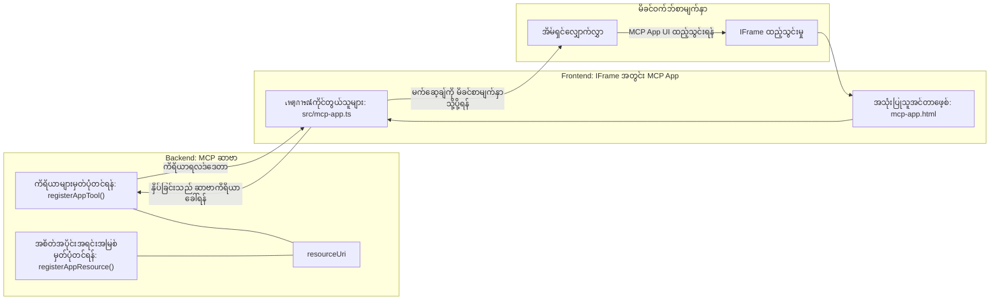

# MCP Apps

MCP Apps သည် MCP တွင် များသောအားဖြင့်အသစ်သော စံနမူနာတစ်ခုဖြစ်သည်။ အကြံဉာဏ်မှာ သင်က တူလ်ခေါ်ဆိုမှုမှ ဒေတာပြန်ပေးတဲ့အပြင်၊ ဒီသတင်းအချက်အလက်နဲ့ ဘယ်လိုဆက်ဆံမှုပြုရမယ်ဆိုတာကိုပါ ထောက်ပံ့ပေးရမယ်။ ဒါဆို tool ရလဒ်တွေအခု UI အချက်အလက်ပါ ပါနိုင်သည်။ ဒါပေမယ့် ဘာကြောင့်အဲလို သင့်အလုပ်တစ်ခုမှာလိုချင်သလဲဆိုတော့ မနက်ဖြန် မည်သို့လုပ်ကြမယ်ဆိုတာ သတိပြုပါ။ ယနေ့ သင်လုပ်ဆောင်နေတဲ့နည်းလမ်းကိုစဉ်းစားပါ။ သင်ဟာ MCP Server ရဲ့ရလဒ်တွေကို မတိုင်ခင် အမျိုးအစားတစ်ခု frontend ထည့်ထူမြဲ၍ အသုံးပြုနေတတ်သည်။ ဒါဟာ သင်ရေးပြီး ထိန်းသိမ်းရမယ့် code ဖြစ်ပါတယ်။ တခါတလေ အဲဒါလိုချင်တတ်ပေမယ့် တခါတလေတော့ ဒေတာမှစပြီး အသုံးပြုသူအဖြစ်ဆက်ဆံမှုပြုခြင်းအထိ ပါတဲ့ သင်္ကေတရဲ့ အပိုင်းလေးတစ်ခုကိုသာ သွင်းပေးလို့ရရင်ကောင်းမယ်။

## အထွေထွေ

ဒီသင်ခန်းစာက MCP Apps အကြောင်းအကျိုးအကျယ်တွေ၊ စတင်အသုံးပြုပြီး သင့်ရဲ့ ရှိပြီးသား Web Apps ထဲတွင် ဘယ်လိုပေါင်းစည်းရမယ်ဆိုတာကို လက်တွေ့ ညွှန်ပြပေးပါတယ်။ MCP Apps သည် MCP စံနမူနာအသစ်တစ်ခုဖြစ်သည်။

## သင်ယူရမည့် ရည်မှန်းချက်များ

ဒီသင်ခန်းစာ ပြီးဆုံးသောအခါ၊ သင်မှာ အောက်ပါများကို စွမ်းဆောင်နိုင်ပါလိမ့်မည်-

- MCP Apps ဆိုတာဘာလဲ ဆိုတာကိုရှင်းပြနိုင်သည်။
- MCP Apps ကို ဘယ်အချိန် အသုံးပြုရမလဲ ဆိုတာကို သိရှိနိုင်သည်။
- ကိုယ်ပိုင် MCP Apps များကို တည်ဆောက်၍ ပေါင်းစည်းနိုင်သည်။

## MCP Apps - ဘယ်လို အလုပ်လုပ်သလဲ

MCP Apps ရဲ့ အကြံဉာဏ်မှာ အဖြေဟာ ကိုယ်စားလှယ်တစ်ခုလို ဖော်ပြပေးသွားတာ ဖြစ်တယ်။ ဒီလိုကိုယ်စားလှယ်က ရုပ်ရှင်နှင့် အပြန်အလှန်ဆက်ဆံမှုရှိနိုင်သလို၊ ဥပမာ အချက်တစ်ချက်ကို နှိပ်ခြင်း၊ အသုံးပြုသူရဲ့ ထည့်သွင်းချက်နဲ့ အခြားလုပ်ဆောင်ချက်တွေ ပါဝင်နိုင်တယ်။ စတင်မှာ စက်ဝိုင်းဘက်မှ ယူပါ။ MCP Server နှင့် လုပ်ဆောင်လိုလျှင် MCP App ကိုတည်ဆောက်ရန် tool တစ်ခုနှင့် application resource တစ်ခုကို ဖန်တီးရမယ်။ ဒီနှစ်ပိုင်းက resourceUri နဲ့ ချိတ်ဆက်ထားကြသည်။

ဥပမာတစ်ခုကို ကြည့်ကြရအောင်။ ပါဝင်ပက်တာတွေကို မွမ်းမံကြည့်ပြီး မည်သော အပိုင်းမှာ ဘာလုပ်ဆောင်သလဲ ဆိုတာ ရှင်းပြပါမယ်-

```text
server.ts -- responsible for registering tools and the component as a UI component
src/
  mcp-app.ts -- wiring up event handlers
mcp-app.html -- the user interface
```

ဒီရုပ်ပုံက ကိုယ်စားလှယ်နဲ့ ၎င်း၏ လုပ်ဆောင်ချက်များ ဖန်တီးခြင်းဆိုင်ရာ အင်ဂျင်နီယာလုပ်ငန်းမျိုးအသုံးပြုမူကိုဖော်ပြသည်။


နောက်တကြိမ် Back-end နှင့် Front-end အတွက် တာဝန်ပေးထားချက်များကို ရှင်းပြကြည့်ပါမယ်။

### Backend

ဒီမှာ ကြိုးစားရမယ့် အရာနှစ်ခုရှိတယ်-

- ဆက်ဆံလိုတဲ့ tool တွေကို မှတ်ပုံတင်ခြင်း။
- ကိုယ်စားလှယ် တစ်ခုကို သတ်မှတ်ခြင်း။

**Tool မှတ်ပုံတင်ခြင်း**

```typescript
registerAppTool(
    server,
    "get-time",
    {
      title: "Get Time",
      description: "Returns the current server time.",
      inputSchema: {},
      _meta: { ui: { resourceUri } }, // ဤကိရိယာကို၎င်း၏ UI အရင်းအမြစ်နှင့် ဆက်သွယ်ထားသည်။
    },
    async () => {
      const time = new Date().toISOString();
      return { content: [{ type: "text", text: time }] };
    },
  );

```

ကနဦး code မှာ `get-time` ဆိုတဲ့ tool ကို ပြသထားပါတယ်။ အထွက်များမလိုဘဲ လက်ရှိအချိန်ကို ထုတ်ပေးတယ်။ အသုံးပြုသူရဲ့ ထည့်သွင်းချက် လိုအပ်ရင် `inputSchema` ကို သတ်မှတ်လို့ရတယ်။

**ကိုယ်စားလှယ် မှတ်ပုံတင်ခြင်း**

အဲ့ဒီဖိုင်တစ်ခုထဲမှာ ကိုယ်စားလှယ်ကိုလည်း မှတ်ပုံတင်ဖို့လိုပါတယ်-

```typescript
const resourceUri = "ui://get-time/mcp-app.html";

// UI အတွက် bundled HTML/JavaScript ကို ပြန်လည်ပေးသည့် resource ကို မှတ်ပုံတင်ပါ။
registerAppResource(
  server,
  resourceUri,
  resourceUri,
  { mimeType: RESOURCE_MIME_TYPE },
  async () => {
    const html = await fs.readFile(path.join(DIST_DIR, "mcp-app.html"), "utf-8");

    return {
    contents: [
        { uri: resourceUri, mimeType: RESOURCE_MIME_TYPE, text: html },
    ],
    };
  },
);
```

ကိုယ်စားလှယ်နဲ့ tool တွေကို ပေါင်းဆက်ဖို့ `resourceUri` ကို ထည့်သွင်းထားတာကို တွေ့ရတယ်။ အထူးသဖြင့် callback က UI ဖိုင်ကို load ပြီး ကိုယ်စားလှယ်က return လုပ်လို့ရတယ်။

### Component Frontend

Backend လိုပဲ အပိုင်းနှစ်ခုရှိပါတယ်-

- သန့်ရှင်းတဲ့ HTML ဖြင့်ရေးထားသည့် frontend။
- Event တွေကို တွယ်ဆွဲပြီး လုပ်ဆောင်ချက်တွေ ကစားနည်း၊ tool ခေါ်ခြင်း သို့မဟုတ် ဖခင်ပေါ်ဝင်းဒိုးကို message ပို့ခြင်း။

**အသုံးပြုသူ Interface**

UI ကို ကြည့်ကြရအောင်-

```html
<!-- mcp-app.html -->
<!DOCTYPE html>
<html lang="en">
  <head>
    <meta charset="UTF-8" />
    <title>Get Time App</title>
  </head>
  <body>
    <p>
      <strong>Server Time:</strong> <code id="server-time">Loading...</code>
    </p>
    <button id="get-time-btn">Get Server Time</button>
    <script type="module" src="/src/mcp-app.ts"></script>
  </body>
</html>
```

**Event အတပ်ဆင်ခြင်း**

နောက်ဆုံး အပိုင်းမှာ event တွေလိုအပ်သည့် UI အပိုင်းကို ရွေးပြီး ရှိလာသော event များကို ဘယ်လိုကျူးလွန်မယ်ဆိုတာ တွမ်ဆက်ခြင်း ဖြစ်တယ်-

```typescript
// mcp-app.ts

import { App } from "@modelcontextprotocol/ext-apps";

// အက္ခရာ ရေးဆွဲချက်ကို ရယူပါ
const serverTimeEl = document.getElementById("server-time")!;
const getTimeBtn = document.getElementById("get-time-btn")!;

// အပ်ပလီကေးရှင်း ဗားရှင်းကို ဖန်တီးပါ
const app = new App({ name: "Get Time App", version: "1.0.0" });

// ဆာဗာမှ ကိရိယာ ရလဒ်များကို ကိုင်တွယ်ပါ။ `app.connect()` မပြီးခင်မှာ သတ်မှတ်ပါ
// စတင်က ကိရိယာ ရလဒ် ကို မလွဲမှားအောင် ကာကွယ်ပေးသည်
app.ontoolresult = (result) => {
  const time = result.content?.find((c) => c.type === "text")?.text;
  serverTimeEl.textContent = time ?? "[ERROR]";
};

// ခလုတ် နှိပ်ခြင်း ကို တပ်ဆင်ပါ
getTimeBtn.addEventListener("click", async () => {
  // `app.callServerTool()` သည် UI ကို ဆာဗာမှ အချက်အလက် အသစ်တောင်းဆိုခွင့် ပေးသည်
  const result = await app.callServerTool({ name: "get-time", arguments: {} });
  const time = result.content?.find((c) => c.type === "text")?.text;
  serverTimeEl.textContent = time ?? "[ERROR]";
});

// ဟော့စ့်နှင့် ချိတ်ဆက်ပါ
app.connect();
```

အထက်မှာ တွေ့ရသလို DOM element တွေကို event handler တွေနဲ့ ဆက်သွယ်ထားတဲ့ သာမန္ code ဖြစ်တယ်။ `callServerTool` ကိုခေါ်တာဟာ backend မှာ tool တစ်ခုကို ခေါ်တာဖြစ်တယ်။

## အသုံးပြုသူ ထည့်သွင်းချက် များကို ကိန်းမည်

ယခုအထိ component တစ်ခုမှာ button ရှိပြီး နှိပ်ပါက tool တစ်ခုကို ခေါ်တာကိုတွေ့ချင်တယ်။ အခု input field တစ်ခု ထပ်ထည့်ပြီး argument တွေကို tool တစ်ခုသို့ ပို့လို့ ရမယ်ဆိုတာ ကြည့်ကြရအောင်။ FAQ လုပ်ဆောင်ချက်ကို တည်ဆောက်ပါမယ်။ အလုပ်လုပ်ပုံကတော့-

- button နဲ့ input element ရှိရမည်။ အသုံးပြုသူကစာလုံးတစ်လုံး၊ ဥပမာ "Shipping"ကို ရိုက်ထည့်ရန်။ ဒါဟာ backend မှာ FAQ ဒေတာမှာ ရှာဖွေမှုလုပ်တဲ့ tool တစ်ခုကို ခေါ်မယ်။
- FAQ ရှာဖွေမှုကို ထောက်ပံ့နိုင်တဲ့ tool တစ်ခု။

Backend မှ စတင် ပြင်ဆင်မှု ထည့်စရာလိုသည်-

```typescript
const faq: { [key: string]: string } = {
    "shipping": "Our standard shipping time is 3-5 business days.",
    "return policy": "You can return any item within 30 days of purchase.",
    "warranty": "All products come with a 1-year warranty covering manufacturing defects.",
  }

registerAppTool(
    server,
    "get-faq",
    {
      title: "Search FAQ",
      description: "Searches the FAQ for relevant answers.",
      inputSchema: zod.object({
        query: zod.string().default("shipping"),
      }),
      _meta: { ui: { resourceUri: faqResourceUri } }, // ဤကိရိယာကို ၎င်း၏ UI အရင်းအမြစ်နှင့် ချိတ်ဆက်သည်။
    },
    async ({ query }) => {
      const answer: string = faq[query.toLowerCase()] || "Sorry, I don't have an answer for that.";
      return { content: [{ type: "text", text: answer }] };
    },
  );
```

ဒီမှာ `inputSchema` ကို ဘယ်လို ဖြည့်ဆည်းပြီး `zod` schema ကို ဘယ်လိုပုံစံထားတယ်ဆိုတာ မြင်ရတယ်-

```typescript
inputSchema: zod.object({
  query: zod.string().default("shipping"),
})
```

အထက်မှာ `query` ဆိုတဲ့ input parameter ရှိပြီး optional ဖြစ်ပြီး default value "shipping" ဖြစ်တယ်ဆိုတာ သတ်မှတ်ထားတယ်။

အိုကေ၊ *mcp-app.html* ကို ကြည့်ပြီး UI ဘယ်လိုဖန်တီးရမယ်ဆိုတာ ကြည့်ပါမယ်-

```html
<div class="faq">
    <h1>FAQ response</h1>
    <p>FAQ Response: <code id="faq-response">Loading...</code></p>
    <input type="text" id="faq-query" placeholder="Enter FAQ query" />
    <button id="get-faq-btn">Get FAQ Response</button>
  </div>
```

ကောင်းပြီ၊ ဘယ် input element နဲ့ button တွေရှိနေပြီ။ မကြာခင် *mcp-app.ts* ကို သွားပြီး ဤ event များကို တွယ်ဆွဲပါမယ်-

```typescript
const getFaqBtn = document.getElementById("get-faq-btn")!;
const faqQueryInput = document.getElementById("faq-query") as HTMLInputElement;

getFaqBtn.addEventListener("click", async () => {
  const query = faqQueryInput.value;
  const result = await app.callServerTool({ name: "get-faq", arguments: { query } });
  const faq = result.content?.find((c) => c.type === "text")?.text;
  faqResponseEl.textContent = faq ?? "[ERROR]";
});
```

အထက်မှာ code မှာ-

- UI interaction elements ကို ရည်ညွှန်းထားတယ်။
- button နှိပ်ခြင်းကို ကိုင်တွယ်ပြီး input value ကို ဖတ်ပြီး `app.callServerTool()` ကို `name` နဲ့ `arguments` သို့ပို့တယ်၊ argument မှာ `query` ကို ဥပမာတစ်ခုအဖြစ် ပေးတယ်။

`callServerTool` ကို ခေါ်လိုက်တာနဲ့ ဘာဖြစ်သလဲဆိုတော့ ဖခင်ပေါ် ဝင်းဒိုးကို message တစ်ခုပို့ပြီး အဲ့ဒီ window မှာ MCP Server ကို ခေါ်တာဖြစ်တယ်။

### စမ်းမယ်

စမ်းကြည့်ရင် အောက်ပါအတိုင်းမြင်ရမယ်-


နောက် input "warranty" လိုရိုက်ပြီး စမ်းတဲ့အခါ-


ဒီ code ကို run မယ်ဆိုရင် [Code section](./code/README.md) ကို သွားကြည့်ပါ။

## Visual Studio Code မှ စမ်းသပ်ခြင်း

Visual Studio Code မှ MCP Apps ကို ကောင်းစွာ ထောက်ပံ့ သတင်းရှိပြီး MCP Apps စမ်းသပ်ရာမှာ အလွယ်တကူအသုံးချနိုင်သည်။ Visual Studio Code ကို အသုံးပြုရန် *mcp.json* မှာ server entry ထည့်ပါ-

```json
"my-mcp-server-7178eca7": {
    "url": "http://localhost:3001/mcp",
    "type": "http"
  }
```

ပြီးရင် server ကို စတင်ပါ၊ GitHub Copilot ထည့်သွင်းထားလျှင် Chat Window ကနေ MCP App နှင့် ဆက်သွယ်နိုင်ပါလိမ့်မယ်။

prompt တစ်ခုနဲ့ တိုက်ရိုက် ခေါ်နိုင်တာ၊ ဥပမာ "#get-faq" ကိုသုံးကြည့်ပါ-


Web browser မှ ပြေးထုတ်သလိုတူ UI ကို Visual Studio Code မှာလည်း ဒီလိုပဲ ပြပါမယ်-


## တာဝန်ပေးချက်

Rock paper scissor game တစ်ခုဖန်တီးပါ။ အောက်ပါအချက်များ ပါဝင်ရမည်-

UI:

- ရွေးချယ်စရာ drop down list
- ရွေးချယ်မှု တင်သွင်းဖို့ button
- ဘယ်သူ ဘာရွေးပြီး ဘယ်သူ အနိုင်ယူကြောင်း ပြတဲ့ label

Server:

- "choice" ဆိုတဲ့ input ရယူတတ်တဲ့ rock paper scissor tool ရှိရမည်။ ကွန်ပျူတာ ရွေးချယ်မှုကို ဖော်ပြပြီး အနိုင်ရသူကို သတ်မှတ်ပေးရမည်။

## ဖြေရှင်းချက်

[Solution](./assignment/README.md)

## အနှစ်ချုပ်

MCP Apps ဆိုတဲ့ paradigm အသစ်ကို သင်ယူခဲ့တယ်။ MCP Servers ကို မဟုတ်ဘဲ ဒေတာနဲ့ ဆက်စပ်ပြီး ဒေတာကို ဘယ်လို မြင်ကွင်းမှာဖြန့်ချိရမယ်ဆိုတာ သုံးသပ်ခွင့်ပြုပါတယ်။

နောက်ထပ်၊ MCP Apps များကို IFrame ထဲမှာ host လုပ်ပြီး MCP Servers နှင့် ဆက်သွယ်ရာမှာ ဖခင်ဝက်ဘ် app သို့ message ပို့နေရတယ်။ JavaScript, React စသည့် စာကြည့်တိုက်များက ဒီဆက်သွယ်မှုကို ပိုမိုလွယ်ကူစေပါတယ်။

## အဓိကအချက်များ

သင်သိရှိမှုမှာ-

- MCP Apps သည် ဒေတာနှင့် UI လုပ်ဆောင်ချက်များ နှစ်မျိုးစလုံး ပါဝင်သောလျှင် အသုံးဝင်နိုင်သော စံနမူနာအသစ်တစ်ခုဖြစ်သည်။
- ဒီ app များကို လုံခြုံရေးဆိုင်ရာအတွက် IFrame ထဲတွင် အသုံးပြုကြသည်။

## နောက်တစ်ဆင့်

- [Chapter 4](../../04-PracticalImplementation/README.md)

---

<!-- CO-OP TRANSLATOR DISCLAIMER START -->
**အကြံပြုချက်**  
ဤစာတမ်းကို AI ဘာသာပြန်ဝန်ဆောင်မှု [Co-op Translator](https://github.com/Azure/co-op-translator) ဖြင့် ဘာသာပြန်ထားပါသည်။ တိကျမှန်ကန်မှုအတွက် ကြိုးပမ်းပေမယ့်၊ အလိုအလျောက် ဘာသာပြန်မှုများတွင် အမှားများ သို့မဟုတ် မှားယွင်းချက်များ ပါဝင်နိုင်ကြောင်း သတိပြုပါရန်။ မူလစာတမ်းကို ၎င်း၏ မူရင်းဘာသာဖြင့်သာ အာဏာပိုင်အချက်အလက်အရင်းအမြစ်အဖြစ် ယူဆရပါမည်။ အရေးကြီးသော အချက်အလက်များအတွက် မူရင်းဘာသာပြန်သားလူသား များ၏ ရေးသားထားသော ဘာသာပြန်ချက်ကိုသာ အသုံးပြုရန် အကြံပြုပါသည်။ ဤဘာသာပြန်မှု အသုံးပြုမှုမှ အနားလွဲ နားလည်မှုများသို့မဟုတ် မှားယွင်းချက်များ ဖြစ်ပေါ်ပါက ကျနော်တို့ တာဝန်မရှိပါ။
<!-- CO-OP TRANSLATOR DISCLAIMER END -->