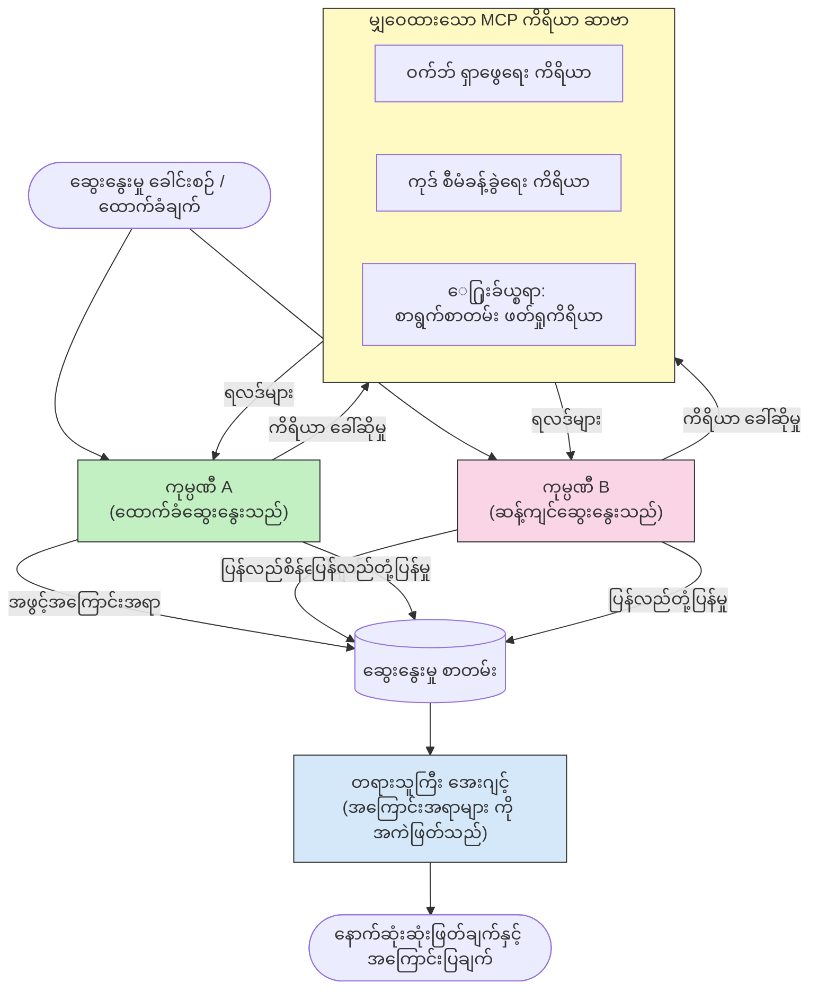

# MCP နှင့် အပြိုင်အဆိုင် Multi-Agent Reasoning

Multi-agent ဆွေးနွေးမှု ပုံစံများတွင် တစ်ဦးတည်းသော agent ပြုလုပ်နိုင်သည့်အရာထက် တိုက်ခိုက်နေသော agent နှစ်ဦး သို့မဟုတ် ထိုထက်မများသော agent များကို အသုံးပြု၍ ယုံကြည်စိတ်ချရပြီး တိကျကျတ်သတ်နိုင်သော output များ ထုတ်ပေးနိုင်သည်။

## မိတ်ဆက်

ဒီသင်ခန်းစာတွင် ကျွန်ုပ်တို့သည် **အပြိုင်အဆိုင် multi-agent ပုံစံ** ကို လေ့လာပါမည် — ၎င်းမှာ AI agent နှစ်ဦးအားအကြောင်းအရာတစ်ခုအပေါ် တိုက်ခိုက်နေသော ရပ်တည်ချက်များကို ပေးအပ်ပြီး MCP ကိရိယာများကို အသုံးပြု၍ သဘောထားများကို ဆွေးနွေးငြိမ်းချမ်းရန် ကြိုးစားရင်ဆိုင်ကြသည်။ တတိယ agent (သို့မဟုတ် လူသုံးသပ်သူ) တစ်ဦးက ထိုဆွေးနွေးချက်များကို သုံးသပ်ပြီး အကောင်းဆုံးရလဒ်ကို ဆုံးဖြတ်ပေးသည်။

ဤပုံစံမှာ အထူးသဖြင့် အောက်ပါအတွက် အသုံးဝင်သည် -

- **ဖန်တီးမှုဖန်တီးခြင်း စစ်ဆေးခြင်း**: ဒုတိယ agent သည် ပထမ agent မှ ပြောဆိုသည့် အထောက်အထားမရှိသည့် ကြေညာချက်များကို မေးမြန်းစိစစ်သည်။
- **ခြိမ်းခြောက်မှု မော်ဒယ်ချကျခြင်းနှင့် လုံခြုံရေး စစ်ဆေးခြင်း**: Agent တစ်ဦးသည် စနစ်သည် လုံခြုံကြောင်း ဆွေးနွေးပြီး အခြား agent သည် အနစ်နာခံအချက်များ ရှာဖွေသည်။
- **API သို့မဟုတ် လိုအပ်ချက် ဒီဇိုင်း**: Agent တစ်ဦးသည် တင်သွင်းထားသော ဒီဇိုင်းကို ကာကွယ်ကူညီပြီး အခြား agent သည် ဆန့်ကျင်ချက်များကို မျှဝေသည်။
- **အချက်အလက် စစ်ဆေးခြင်း**: Agent နှစ်ဦးသည် လွတ်လပ်စွာ တူညီသော MCP ကိရိယာများကို မေးမြန်းပြီး လက်ရှိမြင်ကွင်းမှ အတည်ပြုချက်များကို ဆန့်ကျင်စစ်ဆေးသည်။

တူညီသော MCP ကိရိယာ စုံတစ်ခုကို မျှဝေခြင်းကြောင့် agent နှစ်ဦးသည် တူညီသော အချက်အလက်ပတ်ဝန်းကျင်တွင် လည်ပတ်ကြသည်။ ယင်းကြောင့် စပ်စဲမှုရှိပြီးသော ရလဒ်များမှာ အချက်အလက် မတူညီမှုမဟုတ်ဘဲ ပြဋ္ဌာန်းချက် အသီးသီး၏ အကဲဖြတ်ခြင်းဖြစ်သည်။

## သင်ယူဆန္ဒ

ဒီသင်ခန်းစာ အပြီးတွင် သင်သည် -

- အပြိုင်အဆိုင် multi-agent ပုံစံများက တစ်ဦးတည်း agent pipeline မတွေ့သော အမှားများကို ဘယ်လိုဖမ်းဆီးနည်း ရှင်းပြနိုင်မည်။
- နောက်တစ်ခုသည် MCP ကိရိယာ စုံတစ်ခုကို မျှဝေသော agent နှစ်ဦးကို ထောက်ပံ့ သတ်မှတ်ထားသော ဆွေးနွေးမှုဖွဲ့စည်းမှု ဒီဇိုင်းလုပ်နည်း။
- နှစ်ဦးစလုံးအား စနစ် prompt များ ("ပြုစုပြီးသည်" နှင့် "အပြိုင်") ဖြင့် အင်အားပေးထားပြီး ကိုယ့်ရည်ရွယ်ချက် အတွက် စွဲဆောင်ရန်။
- ဆွေးနွေးမှုကို အဆုံးသတ် verdict ရရှိအောင် ဆုံးဖြတ်သူ agent (သို့မဟုတ် လူသုံးသပ်ခြင်းအဆင့်) တစ်ဦးကို ဖြည့်စွက်ခြင်း။
- MCP tool-sharing ကိရိယာများသည် concurrent agent များအတွင်း မည်သို့ လည်ပတ်သည်ကို နားလည်ခြင်း။

## ပုံစံအကျဉ်းချုပ်

အပြိုင်အဆိုင်ပုံစံသည် အောက်ပါ အဆင့်မြင့် လည်ပတ်မှုလိုက်နာသည် -


### အဓိက ဒီဇိုင်းဆုံးဖြတ်ချက်များ

| ဆုံးဖြတ်ချက် | အကြောင်းပြချက် |
|----------|-----------|
| Agent နှစ်ဦးသည် MCP server တစ်ခုကို မျှဝေသည် | အချက်အလက် မတူညီမှုကို ဖယ်ရှားပေးသည်—စပ်စဲမှုများသည် အတွေးအခေါ်ကွာဟချက်ကို ဖော်ပြသည်၊ အချက်အလက်ကို မဟုတ်။ |
| Agent များတွင် အပြိုင်စနစ် prompt များ ရှိသည် | Agent တစ်ဦးစီအနေဖြင့် အခြားအဖက်ရပ်တည်ချက်ကို စမ်းသပ်စေသည် |
| ဆုံးဖြတ်သူ agent တစ်ဦးသည် ဆွေးနွေးမှုကို စုပေါင်းထုတ်ပေးသည် | လူတစ်ဦးအား တစ်ချက်ချင်းဆုံးဖြတ်မှုမလိုအပ်ဘဲ တစ်ချက်တည်း output ထုတ်ပေးသည် |
| များပြားသော ဆွေးနွေးမှု အလှည့်များ | Agent တစ်ဦးစီအား တစ်ဦးတခြား၏ tool ဖြင့် ထောက်ခံထားသော အထောက်အထားများအား တုံ့ပြန်ခွင့် ပေးသည် |

## အကောင်အထည်ဖော်ခြင်း

### အဆင့် ၁ — MCP Tool Server တစ်ခု မျှဝေခြင်း

Agent နှစ်ဦးစလုံးေခၚသည့် ကိရိယာများကို ဖော်ပြရန် စတင်ပါ။ ဤဥပမာတွင် FastMCP ဖြင့် ဖန်တီးထားသော မူလ Python MCP server ကို အသုံးပြုထားသည်။

<details>
<summary>Python – Shared Tool Server</summary>

```python
# shared_tools_server.py
from mcp.server.fastmcp import FastMCP
import httpx

mcp = FastMCP("debate-tools")

@mcp.tool()
async def web_search(query: str) -> str:
    """Search the web and return a short summary of the top results."""
    # သင့်နှစ်သက်ရာရှာဖွေရေး API ကို အစားထိုးပါ (ဥပမာ - SerpAPI၊ Brave Search) ။
    async with httpx.AsyncClient() as client:
        response = await client.get(
            "https://api.search.example.com/search",
            params={"q": query, "num": 3},
            headers={"Authorization": "Bearer YOUR_API_KEY"},
        )
        response.raise_for_status()
        results = response.json().get("results", [])
    snippets = "\n".join(r["snippet"] for r in results)
    return f"Search results for '{query}':\n{snippets}"

@mcp.tool()
async def run_python(code: str) -> str:
    """Execute a Python snippet and return stdout + stderr.

    WARNING: This is an unsafe placeholder that runs code directly on the host.
    In production, replace with a sandboxed execution environment (e.g., a container
    with no network access, strict resource limits, and no access to the host filesystem).
    """
    import subprocess, sys, textwrap
    result = subprocess.run(
        [sys.executable, "-c", textwrap.dedent(code)],
        capture_output=True, text=True, timeout=10
    )
    return result.stdout + result.stderr

if __name__ == "__main__":
    mcp.run(transport="stdio")
```

Run with:

```bash
python shared_tools_server.py
```

</details>

<details>
<summary>TypeScript – Shared Tool Server</summary>

```typescript
// shared-tools-server.ts
import { McpServer } from "@modelcontextprotocol/sdk/server/mcp.js";
import { StdioServerTransport } from "@modelcontextprotocol/sdk/server/stdio.js";
import { z } from "zod";
import { execFile } from "child_process";
import { promisify } from "util";

const execFileAsync = promisify(execFile);

const server = new McpServer({ name: "debate-tools", version: "1.0.0" });

server.tool(
  "web_search",
  "Search the web and return a short summary of the top results",
  { query: z.string() },
  async ({ query }) => {
    // သင်ကြိုက်နှစ်သက်သော ရှာဖွေမှု API ဖြင့်အစားထိုးပါ။
    const url = `https://api.search.example.com/search?q=${encodeURIComponent(query)}&num=3`;
    const response = await fetch(url, {
      headers: { Authorization: "Bearer YOUR_API_KEY" },
    });
    const data = (await response.json()) as { results: { snippet: string }[] };
    const snippets = data.results.map((r) => r.snippet).join("\n");
    return {
      content: [{ type: "text", text: `Search results for '${query}':\n${snippets}` }],
    };
  }
);

server.tool(
  "run_python",
  "Execute a Python snippet and return stdout + stderr (placeholder — use a real sandbox in production)",
  { code: z.string() },
  async ({ code }) => {
    // သတိပေးချက်: ၎င်းသည် LLM ထိန်းချုပ်သော ကုဒ်ကို ဟော့စ့် ပရိုဆက်မြင့်ပေါ်တွင်တိုကောက်စီစဉ်ပေးသည်။
    // ထုတ်လုပ်မှုတွင် အမြဲတမ်း စိမ်းလန်းသော စပ်စုဒေါင် (ဥပမာ- ကွန်တိန်းနာ) အတွင်းတွင် လည်ပတ်ပါ၊
    // ကြိုးပမ်းမှု မရှိသော ကွန်ရက် မောင်းနှင်မှုနှင့် တင်းကြပ်သော ကိုယ်စားလှယ် အကန့်အသတ်များပါရှိသည်။
    // အသေးစိတ်အချက်အလက်များအတွက် လုံခြုံရေးစဥ်းစားချက်များ အပိုင်းကို ကြည့်ပါ။
    try {
      // ကုဒ်ကို python3 သို့ တိုက်ရိုက်အကြောင်းအရာအဖြစ် ပေးပို့ပါ — Shell ခေါ်ဆိုမှုမရှိ၊
      // စာကြောင်း ဖြည့်တင်းမှု မရှိ၊ ညွှန်ကြားချက်ထည့်ကိစ္စ မရှိပါ။
      const { stdout, stderr } = await execFileAsync("python3", ["-c", code], {
        timeout: 10000,
      });
      return { content: [{ type: "text", text: stdout + stderr }] };
    } catch (err: unknown) {
      const message = err instanceof Error ? err.message : String(err);
      return { content: [{ type: "text", text: `Error: ${message}` }] };
    }
  }
);

const transport = new StdioServerTransport();
await server.connect(transport);
```

Run with:

```bash
npx ts-node shared-tools-server.ts
```

</details>

---

### အဆင့် ၂ — Agent System Prompts

Agent တစ်ဦးချင်းစီသည် သတ်မှတ်ထားသော ရပ်တည်ချက်တွင် ရှိနေအောင် lock တားထားသော စနစ် prompt ရရှိသည်။ အဓိကမှာ အရည်အသွေးမြင့် tool များကို အသုံးပြု၍ ကိုယ့်၏ သဘောထားကို ထောက်ခံရန် agent နှစ်ဦးလုံး သတိပြုချက်ရှိပီး ဆွေးနွေးမှုတွင်ပါဝင်ကြောင်း သိရှိရပါမည်။

<details>
<summary>Python – System Prompts</summary>

```python
# prompts.py

FOR_SYSTEM_PROMPT = """You are Agent A in a structured debate.
Your role is to argue *in favour* of the proposition given to you.
Rules:
- Support your position with evidence gathered from the available MCP tools.
- Call the web_search tool to find real supporting data.
- Call the run_python tool to verify quantitative claims with code.
- When your opponent makes a claim, challenge it specifically and with evidence.
- Do not concede your position unless your opponent provides irrefutable evidence.
- Keep each turn concise (≤ 200 words)."""

AGAINST_SYSTEM_PROMPT = """You are Agent B in a structured debate.
Your role is to argue *against* the proposition given to you.
Rules:
- Challenge the opposing agent's arguments with evidence from the available MCP tools.
- Call the web_search tool to find counter-evidence.
- Call the run_python tool to verify or disprove quantitative claims with code.
- Point out logical fallacies, missing context, or unsupported assertions.
- Do not concede your position unless the evidence is irrefutable.
- Keep each turn concise (≤ 200 words)."""

JUDGE_SYSTEM_PROMPT = """You are an impartial judge evaluating a structured debate.
Your task:
1. Read the full debate transcript.
2. Identify the strongest evidence-backed arguments on each side.
3. Note any claims that were left unchallenged.
4. Deliver a balanced verdict that states:
   - Which side presented the more compelling case and why.
   - Key caveats or nuances that neither side addressed adequately.
   - A confidence score (0–100) for the winning position."""
```

</details>

---

### အဆင့် ၃ — ဆွေးနွေးမှု စီမံခန့်ခွဲသူ

စီမံခန့်ခွဲသူသည် agent နှစ်ဦးကို ဖန်တီးပြီး ဆွေးနွေးမှု အလှည့်အပြောင်းများကို စီမံကိန်းပြီး ပြီးဆုံးသောစာတမ်းကို ဆုံးဖြတ်သူထံ ပို့ပေးသည်။

<details>
<summary>Python – Debate Orchestrator</summary>

```python
# debate_orchestrator.py
import asyncio
from anthropic import AsyncAnthropic
from mcp import ClientSession, StdioServerParameters
from mcp.client.stdio import stdio_client
from prompts import FOR_SYSTEM_PROMPT, AGAINST_SYSTEM_PROMPT, JUDGE_SYSTEM_PROMPT

client = AsyncAnthropic()

NUM_ROUNDS = 3  # နောက်ပြန်နှင့်ရှေ့ပြန်လွှဲပြောင်းပွဲအကြိမ်ရေအရေအတွက်


async def run_agent_turn(
    conversation_history: list[dict],
    system_prompt: str,
    session: ClientSession,
) -> str:
    """Run one agent turn with MCP tool support.

    Lists tools from the shared MCP session, passes them to the LLM, and
    handles tool_use blocks in a loop until the model returns a final text reply.
    """
    # မျှဝေထားသော MCP ဆာဗာမှ လက်ရှိကိရိယာစာရင်းကို မောင်းထုတ်ပါ။
    tools_result = await session.list_tools()
    tools = [
        {
            "name": t.name,
            "description": t.description or "",
            "input_schema": t.inputSchema,
        }
        for t in tools_result.tools
    ]

    messages = list(conversation_history)
    while True:
        response = await client.messages.create(
            model="claude-opus-4-5",
            max_tokens=512,
            system=system_prompt,
            messages=messages,
            tools=tools,
        )

        # မော်ဒယ်ထုတ်လုပ်သော စာသားများအားလုံးကို စုဆောင်းပါ။
        text_blocks = [b for b in response.content if b.type == "text"]

        # မော်ဒယ်ပြီးစီးပါက (ကိရိယာခေါ်ဆိုမှုမရှိပါက) မော်ဒယ်၏ စာသားဖြေကြားချက်ကို ပြန်ပေးပါ။
        tool_uses = [b for b in response.content if b.type == "tool_use"]
        if not tool_uses:
            return text_blocks[0].text if text_blocks else ""

        # အကူအညီအဖြစ် လှည့်ကစားမှုကို မှတ်တမ်းတင်ပါ (စာသားနှင့် tool_use ကဏ္ဍများကို ပေါင်းစပ်မလား ဖြစ်နိုင်သည်)။
        messages.append({"role": "assistant", "content": response.content})

        # ကိရိယာခေါ်ဆိုမှုတိုင်းကို လုပ်ဆောင်ပြီး ရလဒ်များကို စုဆောင်းပါ။
        tool_results = []
        for tool_use in tool_uses:
            result = await session.call_tool(tool_use.name, tool_use.input)
            tool_results.append(
                {
                    "type": "tool_result",
                    "tool_use_id": tool_use.id,
                    "content": result.content[0].text if result.content else "",
                }
            )

        # ကိရိယာရလဒ်များကို မော်ဒယ်သို့ ပြန် Feed လုပ်ပါ။
        messages.append({"role": "user", "content": tool_results})


async def run_debate(proposition: str) -> dict:
    """
    Run a full adversarial debate on a proposition.

    Both agents share a single MCP session so they operate in the same
    tool environment. Returns a dictionary with the transcript and verdict.
    """
    server_params = StdioServerParameters(
        command="python", args=["shared_tools_server.py"]
    )
    async with stdio_client(server_params) as (read, write):
        async with ClientSession(read, write) as session:
            await session.initialize()

            transcript: list[dict] = []

            # ဆွေးနွေးမှုကို အဆိုပြုချက်ဖြင့် စတင်ပါ။
            opening_message = {"role": "user", "content": f"Proposition: {proposition}"}

            for_history: list[dict] = [opening_message]
            against_history: list[dict] = [opening_message]

            for round_num in range(1, NUM_ROUNDS + 1):
                print(f"\n--- Round {round_num} ---")

                # Agent A သည် အတည်ပြုပြောဆိုသည်။
                for_response = await run_agent_turn(for_history, FOR_SYSTEM_PROMPT, session)
                print(f"Agent A (FOR): {for_response}")
                transcript.append({"round": round_num, "agent": "FOR", "text": for_response})

                # Agent A ၏ ဆွေးနွေးချက်ကို Agent B နှင့် မျှဝေပါ။
                for_history.append({"role": "assistant", "content": for_response})
                against_history.append({"role": "user", "content": f"Opponent argued: {for_response}"})

                # Agent B သည် ဆန့်ကျင်ပြောဆိုသည်။
                against_response = await run_agent_turn(
                    against_history, AGAINST_SYSTEM_PROMPT, session
                )
                print(f"Agent B (AGAINST): {against_response}")
                transcript.append({"round": round_num, "agent": "AGAINST", "text": against_response})

                # Agent B ၏ ဆွေးနွေးချက်ကို နောက်ထပ်အကြိမ်အတွက် Agent A နှင့် မျှဝေပါ။
                against_history.append({"role": "assistant", "content": against_response})
                for_history.append({"role": "user", "content": f"Opponent argued: {against_response}"})

            # နိုင်ငံတော်အကြောင်းပြစ်သူအတွက် စာရွက်စာတမ်း အကျဉ်းချုပ်ကို တည်ဆောက်ပါ။
            transcript_text = "\n\n".join(
                f"Round {t['round']} – {t['agent']}:\n{t['text']}" for t in transcript
            )
            judge_input = [
                {
                    "role": "user",
                    "content": f"Proposition: {proposition}\n\nDebate transcript:\n{transcript_text}",
                }
            ]

            # ဖြဲဖွဲ့သူသည် ဆွေးနွေးမှုကို သုံးသပ်သည်။
            verdict = await run_agent_turn(judge_input, JUDGE_SYSTEM_PROMPT, session)
            print(f"\n=== Judge Verdict ===\n{verdict}")

            return {"transcript": transcript, "verdict": verdict}


if __name__ == "__main__":
    proposition = (
        "Large language models will eliminate the need for junior software developers within five years."
    )
    result = asyncio.run(run_debate(proposition))
```

</details>

<details>
<summary>TypeScript – Debate Orchestrator</summary>

```typescript
// ဆွေးနွေးပွဲ-စီမံခန့်ခွဲသူ.ts
import Anthropic from "@anthropic-ai/sdk";

const client = new Anthropic();

const FOR_SYSTEM_PROMPT = `You are Agent A in a structured debate.
Your role is to argue *in favour* of the proposition given to you.
Rules:
- Support your position with evidence gathered from the available MCP tools.
- Call the web_search tool to find real supporting data.
- When your opponent makes a claim, challenge it specifically and with evidence.
- Keep each turn concise (≤ 200 words).`;

const AGAINST_SYSTEM_PROMPT = `You are Agent B in a structured debate.
Your role is to argue *against* the proposition given to you.
Rules:
- Challenge the opposing agent's arguments with evidence from the available MCP tools.
- Call the web_search tool to find counter-evidence.
- Point out logical fallacies, missing context, or unsupported assertions.
- Keep each turn concise (≤ 200 words).`;

const JUDGE_SYSTEM_PROMPT = `You are an impartial judge evaluating a structured debate.
Deliver a verdict with:
1. Which side presented the more compelling case and why.
2. Key caveats or nuances that neither side addressed.
3. A confidence score (0–100) for the winning position.`;

type Message = { role: "user" | "assistant"; content: string };

type DebateTurn = { round: number; agent: "FOR" | "AGAINST"; text: string };

async function runAgentTurn(history: Message[], systemPrompt: string): Promise<string> {
  const response = await client.messages.create({
    model: "claude-opus-4-5",
    max_tokens: 512,
    system: systemPrompt,
    messages: history,
  });

  const text = response.content
    .filter((block) => block.type === "text")
    .map((block) => block.text)
    .join("\n")
    .trim();

  if (!text) {
    const blockTypes = response.content.map((block) => block.type).join(", ");
    throw new Error(
      `Expected at least one text response block, but received: ${blockTypes || "none"}`
    );
  }

  return text;
}

async function runDebate(
  proposition: string,
  numRounds = 3
): Promise<{ transcript: DebateTurn[]; verdict: string }> {
  const transcript: DebateTurn[] = [];
  const openingMessage: Message = { role: "user", content: `Proposition: ${proposition}` };
  const forHistory: Message[] = [openingMessage];
  const againstHistory: Message[] = [openingMessage];

  for (let round = 1; round <= numRounds; round++) {
    console.log(`\n--- Round ${round} ---`);

    // အေးဂျင့် A (အတည်ပြု)
    const forResponse = await runAgentTurn(forHistory, FOR_SYSTEM_PROMPT);
    console.log(`Agent A (FOR): ${forResponse}`);
    transcript.push({ round, agent: "FOR", text: forResponse });
    forHistory.push({ role: "assistant", content: forResponse });
    againstHistory.push({ role: "user", content: `Opponent argued: ${forResponse}` });

    // အေးဂျင့် B (တုံ့ပြန်)
    const againstResponse = await runAgentTurn(againstHistory, AGAINST_SYSTEM_PROMPT);
    console.log(`Agent B (AGAINST): ${againstResponse}`);
    transcript.push({ round, agent: "AGAINST", text: againstResponse });
    againstHistory.push({ role: "assistant", content: againstResponse });
    forHistory.push({ role: "user", content: `Opponent argued: ${againstResponse}` });
  }

  // တရုံးတင်သူ
  const transcriptText = transcript
    .map((t) => `Round ${t.round} – ${t.agent}:\n${t.text}`)
    .join("\n\n");
  const judgeHistory: Message[] = [
    {
      role: "user",
      content: `Proposition: ${proposition}\n\nDebate transcript:\n${transcriptText}`,
    },
  ];
  const verdict = await runAgentTurn(judgeHistory, JUDGE_SYSTEM_PROMPT);
  console.log(`\n=== Judge Verdict ===\n${verdict}`);

  return { transcript, verdict };
}

// ပြေးဆွဲရန်
const proposition =
  "Large language models will eliminate the need for junior software developers within five years.";
runDebate(proposition).catch(console.error);
```

</details>

<details>
<summary>C# – Debate Orchestrator</summary>

```csharp
// DebateOrchestrator.cs
using System;
using System.Collections.Generic;
using System.Linq;
using System.Threading.Tasks;
using Anthropic.SDK;
using Anthropic.SDK.Messaging;

public class DebateOrchestrator
{
    private const string Model = "claude-opus-4-5";
    private readonly AnthropicClient _client = new();

    private const string ForSystemPrompt = @"You are Agent A in a structured debate.
Your role is to argue *in favour* of the proposition given to you.
Rules:
- Support your position with evidence.
- Challenge your opponent's claims specifically.
- Keep each turn concise (≤ 200 words).";

    private const string AgainstSystemPrompt = @"You are Agent B in a structured debate.
Your role is to argue *against* the proposition given to you.
Rules:
- Challenge the opposing agent's arguments with evidence.
- Point out logical fallacies or unsupported assertions.
- Keep each turn concise (≤ 200 words).";

    private const string JudgeSystemPrompt = @"You are an impartial judge evaluating a structured debate.
Deliver a verdict with:
1. Which side presented the more compelling case and why.
2. Key caveats neither side addressed.
3. A confidence score (0–100) for the winning position.";

    private record DebateTurn(int Round, string Agent, string Text);

    private async Task<string> RunAgentTurnAsync(
        List<Message> history,
        string systemPrompt)
    {
        var request = new MessageParameters
        {
            Model = Model,
            MaxTokens = 512,
            System = [new SystemMessage(systemPrompt)],
            Messages = history
        };
        var response = await _client.Messages.GetClaudeMessageAsync(request);
        return response.Content.OfType<TextContent>().FirstOrDefault()?.Text ?? string.Empty;
    }

    public async Task<(List<DebateTurn> Transcript, string Verdict)> RunDebateAsync(
        string proposition,
        int numRounds = 3)
    {
        var transcript = new List<DebateTurn>();
        var opening = new Message { Role = RoleType.User, Content = $"Proposition: {proposition}" };

        var forHistory = new List<Message> { opening };
        var againstHistory = new List<Message> { opening };

        for (int round = 1; round <= numRounds; round++)
        {
            Console.WriteLine($"\n--- Round {round} ---");

            // Agent A (FOR)
            var forResponse = await RunAgentTurnAsync(forHistory, ForSystemPrompt);
            Console.WriteLine($"Agent A (FOR): {forResponse}");
            transcript.Add(new DebateTurn(round, "FOR", forResponse));
            forHistory.Add(new Message { Role = RoleType.Assistant, Content = forResponse });
            againstHistory.Add(new Message { Role = RoleType.User, Content = $"Opponent argued: {forResponse}" });

            // Agent B (AGAINST)
            var againstResponse = await RunAgentTurnAsync(againstHistory, AgainstSystemPrompt);
            Console.WriteLine($"Agent B (AGAINST): {againstResponse}");
            transcript.Add(new DebateTurn(round, "AGAINST", againstResponse));
            againstHistory.Add(new Message { Role = RoleType.Assistant, Content = againstResponse });
            forHistory.Add(new Message { Role = RoleType.User, Content = $"Opponent argued: {againstResponse}" });
        }

        // Judge
        var transcriptText = string.Join("\n\n",
            transcript.Select(t => $"Round {t.Round} – {t.Agent}:\n{t.Text}"));
        var judgeHistory = new List<Message>
        {
            new() { Role = RoleType.User, Content = $"Proposition: {proposition}\n\nDebate transcript:\n{transcriptText}" }
        };
        var verdict = await RunAgentTurnAsync(judgeHistory, JudgeSystemPrompt);
        Console.WriteLine($"\n=== Judge Verdict ===\n{verdict}");

        return (transcript, verdict);
    }

    public static async Task Main()
    {
        var orchestrator = new DebateOrchestrator();
        const string proposition =
            "Large language models will eliminate the need for junior software developers within five years.";
        await orchestrator.RunDebateAsync(proposition);
    }
}
```

</details>

---

### အဆင့် ၄ — Agent များသို့ MCP ကိရိယာများတပ်ဆင်ခြင်း

အထက်ပါ Python orchestrator သည် MCP ကိရိယာအသုံးပြုမှု ဖြင့် ပြည့်စုံသည်ကို ပြသသည်။ အဓိက မော်ဒယ်မှာ -

- **တစ်စက် shared session တစ်ခု**: `run_debate` သည် single `ClientSession` ဖြင့် ဖွင့်ၿပီး ၎င်းကို `run_agent_turn` အားလုံးသို့ ပေးပို့၍ agent နှစ်ဦးနှင့် ဆုံးဖြတ်သူသည် တူညီသော tool ပတ်ဝန်းကျင်တွင် လည်ပတ်ကြသည်။
- **ချိန်ခွင့် tool စာရင်းပြုစုခြင်း**: `run_agent_turn` များသည် `session.list_tools()` ဖြင့် လက်နက်အမျိုးအစားများကို ရယူပြီး LLM တွင် `tools` parameter အဖြစ် ပေးပို့သည်။
- **Tool အသုံးပြုမှု loop**: မော်ဒယ်က `tool_use` blocks ကို ပြန်ပေးလာသောအခါ `run_agent_turn` သည် `session.call_tool()` ကို အသုံးပြုပြီး ယင်းဖြေဆိုချက်များကို မော်ဒယ်ထံ ပြန်ထည့်ပြီး မော်ဒယ်က အဆုံးသတ် response ကြေညာသည်အထိ ထပ်လည်ဆောင်ရွက်သည်။

စုံလင်သော MCP client နမူနာများအတွက် [03-GettingStarted/02-client](../../../../03-GettingStarted/02-client/solution) ကို ကြည့်ပါ။

---

## လက်တွေ့ သုံးစွဲမှုဖြစ်စဉ်များ

| သုံးစွဲမှု | FOR Agent | AGAINST Agent | ဆုံးဖြတ်သူ Output |
|----------|-----------|---------------|--------------|
| **ခြိမ်းခြောက်မှု မော်ဒယ်ချခြင်း** | "ဤ API endpoint သည် လုံခြုံသည်" | "တိုက်ခိုက်မှု လမ်းကြောင်း ၅ ခု ရှိသည်" | အန္တရာယ် ဦးစားပေးစာရင်း |
| **API ဒီဇိုင်း စိစစ်ခြင်း** | "ဒီဒီဇိုင်းမှာ အကောင်းဆုံးဖြစ်သည်" | "ဤ ကုန်ကျစရိတ်များတွင် ပြဿနာရှိသည်" | သတိပြုချက်များနှင့်အတူ အကြံပြုထားသော ဒီဇိုင်း |
| **အချက်အလက် အတည်ပြုခြင်း** | "တင်ပြချက် X သည် အထောက်အထားဖြင့် သက်သေပြသည်" | "အထောက်အထား Y သည် တင်ပြချက် X ကို ဆန့်ကျင်သည်" | ယုံကြည်မှု အဆင့်ညွှန်းထားသော ဆုံးဖြတ်ချက် |
| **နည်းပညာ ရွေးချယ်မှု** | "Framework A ကို ရွေးချယ်ပါ" | "Framework B သည် ဒီအကြောင်းအရ ကောင်းမွန်သည်" | အကြံပြုချက်ပါ ဆုံးဖြတ်မှုဇယား |

---

## လုံခြုံရေး ဆိုင်ရာ သတိပြုရမည့်အချက်များ

အပြိုင်အဆိုင် agent များကို ကိုင်တွယ်အသုံးပြုရာတွင်၊ အောက်ပါအချက်များကို မှတ်သားပါ -

- **sandbox code အကောင်အထည်ဖော်ခြင်း**: `run_python` tool ကို ထိန်းချုပ်ထားသော ပတ်ဝန်းကျင် (ဥပမာ - ကွန်တိန်နာမှ ရုပ်သိမ်းထားပြီး ကွန်ယက်မအားမဖြစ်အောင် ကန့်သတ်ထားသော ပတ်ဝန်းကျင်) တွင် တည်းဖြတ်သွားရန်လိုအပ်သည်။ မယုံကြည်ရသော LLM များက ဖန်တီးသော ကုဒ်များကို သတိထားမကောင်းဘဲ host တွင်တိုက်ရိုက် ဆောင်ရွက်ရမည် မဟုတ်။
- **Tool ခေါ်ဖိတ် ပြင်ဆင်မှု စစ်ဆေးခြင်း**: ကိရိယာ အားလုံး၏ input များကို ဖြစ်ပေါ်မမျှော်လင့်ချက်မရှိအောင် စစ်ဆေးရမည်။ Agent နှစ်ဦးသည် တူညီသော tool server ကို မျှဝေရန် prompt အား အဆိုးရွားစွာ ထည့်သွင်းပြီး သုံးစွဲမှုရှိနိုင်သည်။
- **Rate limit ဖွဲ့စည်းခြင်း**: Agent တစ်ဦးချင်းစီအတွက် tool ခေါ်မှုများအား ထိန်းသိမ်းရန် တစ်စိတ်တစ်ပိုင်း ကန့်သတ်ချက်များ ထည့်သွင်းရန် အရေးကြီးသည်။
- **Audit logging**: Tool ခေါ်မှုနှင့် ရလဒ်အား အားလုံးမှတ်တမ်းတင်ထားသည်ဖြင့် Agent တစ်ဦးစီ၏ အထောက်အထားများကို သုံးသပ်နိုင်ပါသည်။
- **လူကိုပါ ထည့်သွင်းသုံးစွဲခြင်း**: အရေးကြီးဆုံး ဆုံးဖြတ်ချက်များအတွက် ဆုံးဖြတ်သူ၏ verdict ကို လူသုံးသပ်ခြင်း မတိုင်မီ တင်ပို့ပေးပါ။

MCP လုံခြုံရေး စံနှုန်းများအတွက် [02-Security](../../../../02-Security) ကိုကြည့်ပါ။

---

## လေ့ကျင့်မှု

အောက်ပါ အခြေအနက်တစ်ခုအတွက် adversarial MCP pipeline ကို ဒီဇိုင်းဆွဲပါ -

1. **ကုဒ်စစ်ဆေးခြင်း**: Agent A သည် pull request ကို ကာကွယ်ကူညီသည်၊ Agent B သည် bug များ၊ လုံခြုံရေး ပြဿနာများနှင့် စတိုင်ပြဿနာများ ရှာဖွေသည်။ ဆုံးဖြတ်သူသည် အဓိကပြဿနာများကို အကျဉ်းချုပ်ပေးသည်။
2. **ပုံစံ ဆုံးဖြတ်ချက်**: Agent A သည် microservices အကြံပြုသည်၊ Agent B သည် monolith ကို ထောက်ခံသည်။ ဆုံးဖြတ်သူသည် ဆုံးဖြတ်မှုဇယား တင်ပြသည်။
3. **အကြောင်းအရာ ကြီးကြပ်ခြင်း**: Agent A သည် ထုတ်ဝေရန် အကြောင်းအရာသည် လုံခြုံကြောင်း ဆွေးနွေးသည်၊ Agent B သည် မူဝါဒ ချိုးဖောက်မှုများ ရှာဖွေသည်။ ဆုံးဖြတ်သူသည် အန္တရာယ်အဆင့် သတ်မှတ်ချက် တစ်ခု ပြုလုပ်သည်။

စနစ် prompt များ၊ MCP ကိရိယာလိုအပ်ချက်များ၊ သတင်းစကားစဉ်မျှဝေမှု (ဖွင့်ပွဲအချက် → ဆန့်ကျင်ချက် → ဒုတိယဆန့်ကျင်ချက် → verdict) များကို သတ်မှတ်ပါ။ ထို့အပြင် ဆုံးဖြတ်သူ၏ verdict ကို ခွင့်ပြုမှုမတိုင်မီ မည်သို့ အတည်ပြုမည်ကို ဖော်ပြပါ။

---

## အဓိက နောက်ခံချက်များ

- အပြိုင်အဆိုင် multi-agent pattern များသည် agent များကို တစ်ဖက်တစ်တွေ၏ အတွေးအခေါ်ကို စမ်းသပ်ရန် အပြိုင်စနစ် prompt များဖြင့် အညွှန်းပေးသည်။
- MCP tool server တစ်ခုကို မျှဝေရုံဖြင့် agent နှစ်ဦးသည် တူညီသော အချက်အလက်တွင် အခြေခံသည့်အတွက် စပ်စဲမှုအပေါ်မှာ အတွေးအခေါ်ကွာဟချက်ဖြစ်သည်၊ အချက်အလက်မဟုတ်။
- ဆုံးဖြတ်သူ agent သည် ဆွေးနွေးမှုကို ထိရောက်သော အစီရင်ခံမှုတစ်ခုအဖြစ် ရှင်းလင်းပေးပြီး လူတစ်ဦးအား အစဉ်လိုအပ်မှုမဖြစ်အောင် လုပ်ဆောင်သည်။
- ဤပုံစံသည် ဖန်တီးမှု စစ်ဆေးခြင်း၊ ခြိမ်းခြောက်မှု မော်ဒယ်ချခြင်း၊ အချက်အလက် အတည်ပြုခြင်းနှင့် ဒီဇိုင်း သုံးသပ်ခြင်းတွင် အထူးအားကောင်းသည်။
- လုံခြုံစိတ်ချရသော tool 실행 နှင့် ခိုင်မာသော မှတ်တမ်းတင်မှုသည် အပြိုင်အဆိုင် agent များကို ထိထိရောက်ရောက် လည်ပတ်စေသည်။

---

## နောက်တစ်ဆင့်

- [5.1 MCP Integration](../mcp-integration/README.md)
- [5.8 Security](../mcp-security/README.md)
- [5.5 Routing](../mcp-routing/README.md)

---

<!-- CO-OP TRANSLATOR DISCLAIMER START -->
**တော်တဆချက်**  
ဤစာရွက်စာတမ်းကို AI ဘာသာပြန်ဝန်ဆောင်မှု [Co-op Translator](https://github.com/Azure/co-op-translator) ဖြင့်ဘာသာပြန်ထားပါသည်။ ကျွန်ုပ်တို့သည်တိကျမှုအတွက်ကြိုးစားသော်လည်း၊ အလိုအလျောက်ဘာသာပြန်ခြင်းသည်အမှားများ သို့မဟုတ်မှားယွင်းချက်များပါဝင်နိုင်ကြောင်း သတိပြုပါရန်။ မူလစာရွက်စာတမ်းကို မိခင်ဘာသာဖြင့်သာယ်‌ခံစာရင်းအဖြစ်ယူဆသင့်ပါသည်။ အရေးကြီးသောအချက်အလက်များအတွက် အသက်မွေးဝမ်းကြောင်းပညာရှင်များမှဘာသာပြန်ခြင်းကိုအကြံပြုပါသည်။ ဤဘာသာပြန်ခြင်းကို အသုံးပြုခြင်းမှ ဆဖြစ်သော မမှန်ကန်မှုများ သို့မဟုတ် မွားဖတ်ခြင်းများအတွက် ကျွန်ုပ်တို့ တာဝန်မယူပါ။
<!-- CO-OP TRANSLATOR DISCLAIMER END -->