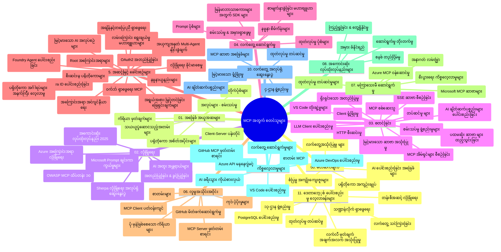

# Model Context Protocol (MCP) for Beginners - Study Guide

ဤကိုးကားလမ်းညွှန်စာမျက်နှာသည် "Model Context Protocol (MCP) for Beginners" သင်တန်းအတွက် ရှေ့ဆောင်ပုံစံနှင့် ပါဝင်မှုအကြောင်းအရာများအား အနှစ်ချုပ်တစ်ရပ် ရရှိစေနိုင်သည်။ ဤလမ်းညွှန်ကို အသုံးပြု၍ ကိုးကားလမ်းညွှန်ဒေတာများကို ထိရောက်စွာ လမ်းညွှန်နိုင်ပြီး ရရှိနိုင်သော အရင်းအမြစ်များမှ အကျိုးစီးပွားအများဆုံးကို ရယူပါ။

## Repository Overview

Model Context Protocol (MCP) သည် AI မော်ဒယ်များနှင့် client application များအကြား ဆက်သွယ်မှု များအတွက် စံသတ်မှတ်ထားသော ဖွဲ့စည်းမှုတစ်ခု ဖြစ်သည်။ စတင်ကာ Anthropic မှ ဖန်တီးခဲ့ပြီး၊ ယခုအခါမှာ MCP အသိုင်းအဝိုင်းလူစုလိုက်အဖျော်ယမကာမှ စီမံထိန်းသိမ်းနေသည်။ ဤ repository တွင် AI developer များ၊ system architect များနှင့် software engineer များအတွက် အတည်တကျ အသုံးပြုနိုင်သည့် C#, Java, JavaScript, Python နှင့် TypeScript အသုံးပြု လက်တွေ့ နမူနာကုဒ်များ ပါရှိသည့် တကျော့တာ ဘာသာရပ်တစ်ခုအဖြစ် curriculum လုံးဝအားဖြင့် ဖော်ပြထားသည်။

## Visual Curriculum Map

## Repository Structure

ဤ repository ကို MCP ၏ အပိုင်းဆိုင်ရာအဓိက ၁၁ ခုဖြင့် စနစ်တကျ ထိန်းသိမ်းထားသည်-

1. **Introduction (00-Introduction/)**
   - Model Context Protocol အကြောင်း အကျဉ်းချုပ်
   - AI pipeline တွင် စံသတ်မှတ်ခြင်း၏ အရေးကြီးမှု
   - လက်တွဲအသုံးချမှု နမူနာများနှင့် အကျိုးများ

2. **Core Concepts (01-CoreConcepts/)**
   - Client-server ရုပ်ပုံဖွဲ့စည်းမှု
   - Protocol အဓိက အစိတ်အပိုင်းများ
   - MCP တွင် သတင်းစကား ပုံစံများ

3. **Security (02-Security/)**
   - MCP အခြေခံ စနစ်များ၏ လုံခြုံရေး အန္တာရာယ်များ
   - လုံခြုံရေး အကောင်အထည်ဖော်မှုအတွက် အကောင်းဆုံးလမ်းညွှန်များ
   - အတည်ပြုခြင်းနှင့် လက်ခံခွင့်အပေါ် နည်းဗျူဟာများ
   - **စုံလင်သော လုံခြုံရေး စာရွက်စာတမ်းများ**:
     - MCP Security Best Practices 2025
     - Azure Content Safety Implementation Guide
     - MCP Security Controls and Techniques
     - MCP Best Practices Quick Reference
   - **အဓိက လုံခြုံရေး ခေါင်းစဉ်များ**:
     - Prompt injection နှင့် tool poisoning တိုက်ခိုက်မှုများ
     - Session hijacking နှင့် confused deputy ပြဿနာများ
     - Token passthrough ဒဏ်ရာများ
     - အတန်းမကျသည့် ခွင့်ပြုချက်များနှင့် access control
     - AI ပိုင်းဆိုင်ရာ supply chain လုံခြုံရေး
     - Microsoft Prompt Shields တွဲဖက်အသုံးပြုခြင်း

4. **Getting Started (03-GettingStarted/)**
   - ပတ်ဝန်းကျင် စီစဉ်မှုနှင့် ဖွဲ့စည်းမှု
   - အခြေခံ MCP server နှင့် client အဖွဲ့စည်းခြင်း
   - ရှိပြီးသား application များနှင့် ပေါင်းစည်းခြင်း
   - အပိုင်းများပါဝင်သည်-
     - ပထမဆုံး server အကောင်အထည်ဖော်မှု
     - Client ဖန်တီးခြင်း
     - LLM client ပေါင်းစည်းမှု
     - VS Code ပေါင်းစည်းမှု
     - Server-Sent Events (SSE) server
     - တိုးတက်သော server အသုံးပြုမှု
     - HTTP အသွင်ကူးစက်
     - AI Toolkit ပေါင်းစည်းမှု
     - စမ်းသပ်မှုနည်းလမ်းများ
     - အသုံးပြုမှု လမ်းညွှန်ချက်များ

5. **Practical Implementation (04-PracticalImplementation/)**
   - မတူသော programming များအတွက် SDK များ အသုံးပြုခြင်း
   - Debugging, စမ်းသပ်ခြင်းနှင့် အတည်ပြုခြင်း နည်းဖြန့်များ
   - ပြန်လည်အသုံးပြုနိုင်သော prompt အချိုးအစားများနှင့် workflow များ ဖန်တီးခြင်း
   - နမူနာ စီမံကိန်းများနှင့် ကုဒ်နမူနာများ

6. **Advanced Topics (05-AdvancedTopics/)**
   - Context engineering နည်းလမ်းများ
   - Foundry agent ပေါင်းစည်းမှု
   - Multi-modal AI workflow များ
   - OAuth2 authentication နမူနာများ
   - အချိန်နှင့်တပြေးညီ ရှာဖွေမှုများ
   - အချိန်နှင့်တပြေးညီ အသွင်ကူးစက်မှုများ
   - Root context များ အကောင်အထည်ဖော်ခြင်း
   - Routing နည်းလမ်းများ
   - Sampling နည်းလမ်းများ
   - Scaling နည်းလမ်းများ
   - လုံခြုံရေး တိုးတက်မှုများ
   - Entra ID လုံခြုံရေး ပေါင်းစည်းမှု
   - ဝက်ဘ်ရှာဖွေရေး ပေါင်းစည်းမှု
   - ဆန့်ကျင်မှုရှိသော multi-agent reasoning (အငြိမ့်ပြိုင်ပွဲ ပုံစံများ)

7. **Community Contributions (06-CommunityContributions/)**
   - ကုဒ်နှင့် စာရွက်စာတမ်း ထည့်သွင်းပေးခြင်း နည်းလမ်းများ
   - GitHub တွင် ပူးပေါင်းဆောင်ရွက်ခြင်း
   - အသိုင်းအဝိုင်း ထောက်ပံ့မှုများနှင့် တုံ့ပြန်ချက်များ
   - MCP client များ (Claude Desktop, Cline, VSCode) အသုံးပြုပုံ
   - လူကြိုက်အများဆုံး MCP server များနှင့် ပူးပေါင်းဆောင်ရွက်ခြင်း (ရုပ်ပုံထုတ်လုပ်ခြင်းအပါအဝင်)

8. **Lessons from Early Adoption (07-LessonsfromEarlyAdoption/)**
   - လက်တွေ့ အကောင်အထည်ဖော်မှုများနှင့် အောင်မြင်မှု ဇာတ်လမ်းများ
   - MCP အခြေပြု ဖြေရှင်းချက်များတည်ဆောက်ခြင်းနှင့် ထုတ်ပေးခြင်း
   - ပုံစံများနှင့် အနာဂတ် လမ်းပြမြေပုံ
   - **Microsoft MCP Servers လမ်းညွှန်စာအုပ်**: ထုတ်လုပ်ရန် ပြင်ဆင်ပြီး Microsoft MCP servers ၁၀ ခု အကျုံးဝင် -
     - Microsoft Learn Docs MCP Server
     - Azure MCP Server (ကွဲပြားသော ချိတ်ဆက်ပစ္စည်း ၁၅+)
     - GitHub MCP Server
     - Azure DevOps MCP Server
     - MarkItDown MCP Server
     - SQL Server MCP Server
     - Playwright MCP Server
     - Dev Box MCP Server
     - Azure AI Foundry MCP Server
     - Microsoft 365 Agents Toolkit MCP Server

9. **Best Practices (08-BestPractices/)**
   - စွမ်းဆောင်ရည် တိုးတက်ရေးနှင့် အထူးပြုပြင်ထိန်းသိမ်းခြင်း
   - MCP စနစ်များအတွက် အမွားခံနိုင်စွမ်း ဒီဇိုင်းရေးခြင်း
   - စမ်းသပ်မှုနှင့် တိုးတက်မှု များဆိုင်ရာ မျဉ်းစည်းများ

10. **Case Studies (09-CaseStudy/)**
    - MCP အသုံးပြုချိန် မတူညီသော အခြေအနေများတွင် လုပ်ဆောင်နိုင်မှုကိုပြသသည့် အကျဉ်းချုပ် ဝင်ငွေ ၇ ခု-
    - **Azure AI Travel Agents**: Azure OpenAI နှင့် AI Search ဖြင့် multi-agent စီမံခန့်ခွဲမှု
    - **Azure DevOps ပေါင်းစည်းမှု**: YouTube data အချက်အလက်များဖြင့် workflow automation
    - **အချိန်နှင့်တပြေးညီ ဝတ္ထု ရှာတွေ့ရေး**: Python console client နှင့် streaming HTTP
    - **အပြန်အလှန် စာအုပ်ဆွဲထုတ်ရေး ကိရိယာ**: Chainlit web app နှင့် conversational AI
    - **ထည့်သွင်းရေး စာရွက်စာတမ်း**: VS Code ပေါင်းစည်း၍ GitHub Copilot workflow များ
    - **Azure API စီမံခန့်ခွဲမှု**: MCP server ဖန်တီးခြင်းနှင့် စက်မှု API ပေါင်းစည်းခြင်း
    - **GitHub MCP Registry**: ecosystem တိုးတက်ရေးနှင့် agentic ပေါင်းစည်းမှု များ
    - ကုမ္ပဏီများအတွက် စံနှုန်းများ၊ developer ထုတ်လုပ်နိုင်စွမ်း နှင့် ecosystem တိုးတက်ရေး များကို ပါဝင်ရှိသည့် နမူနာများ

11. **Hands-on Workshop (10-StreamliningAIWorkflowsBuildingAnMCPServerWithAIToolkit/)**
    - MCP နှင့် AI Toolkit ပေါင်းစပ်ထားသော လက်တွေ့လေ့ကျင့်ခန်းကြီး
    - AI မော်ဒယ်များနှင့် အမြစ်တပ်ဆင်ထားသည့် ကိရိယာများကို တိုက်ရိုက် ဆက်သွယ်ပြီး ဉာဏ်ရည်ထုတ်လုပ်သော application များ တည်ဆောက်ခြင်း
    - အခြေခံဦးတည်ချက်များ၊ စိတ်ကြိုက် server ဖန်တီးခြင်းနှင့် ထုတ်လုပ်မှုစနစ် အသုံးပြုပုံများပါဝင်သော ပျောက်ကွယ်ဖွဲ့အစည်းများ
    - **Lab Structure**:
      - Lab 1: MCP Server အခြေခံများ
      - Lab 2: တိုးတက်သော MCP Server ဖန်တီးမှု
      - Lab 3: AI Toolkit ပေါင်းစည်းမှု
      - Lab 4: ထုတ်လုပ်မှုနှင့် အရွယ်အစားတင်ခြင်း
    - လက်တွေ့ လေ့ကျင့်မှုလမ်းညွှန်ချက်များ

12. **MCP Server Database Integration Labs (11-MCPServerHandsOnLabs/)**
    - PostgreSQL ပေါင်းစည်းထားသည့် ထုတ်လုပ်ရန် ပြင်ဆင်သော MCP server များ ဖန်တီးခြင်းအတွက် ၁၃ လေ့ကျင့်ခန်း စနစ်တကျ
    - အမှတ်တံဆိပ် Zava Retail အသုံးပြုသော လက်တွေ့ စျေးကွက် ခြေရာခံမှုရေးဆွဲမှု
    - Enterprise-grade များမှာ Row Level Security (RLS), semantic search, multi-tenant data access များပါဝင်သည်
    - **Lab Structure အပြည့်အစုံ**:
      - **Labs 00-03: အခြေခံများ** - သွင်ပြင်လက္ခဏာ၊ ဖွဲ့စည်းမှု၊ လုံခြုံရေး၊ ပတ်ဝန်းကျင် စီမံထိန်းသိမ်းမှု
      - **Labs 04-06: MCP Server တည်ဆောက်ခြင်း** - Database ဒီဇိုင်း၊ MCP Server ရေးဆွဲမှု၊ ကိရိယာ ဖန်တီးခြင်း
      - **Labs 07-09: တိုးတက်မှုများ** - Semantic Search, စမ်းသပ်ခြင်းနှင့် Debugging, VS Code ပေါင်းစည်းမှု
      - **Labs 10-12: ထုတ်လုပ်မှုနှင့် အကောင်းဆုံးလမ်းညွှန်ချက်များ** - တင်သွင်းမှု၊ ကြပ်ကွယ်မှု၊ ပိုမိုကျွမ်းကျင်စေခြင်း
    - **အနည်းဆုံးသာနည်းပညာများ**: FastMCP framework, PostgreSQL, Azure OpenAI, Azure Container Apps, Application Insights
    - **လေ့လာမှု ရလဒ်များ**: ထုတ်လုပ်ရန် ပြင်ဆင်ထားသော MCP server များ၊ database ပေါင်းစည်းမှု ပုံစံများ၊ AI စွမ်းအားဖြင့် မြှင့်တင်ထားသော စေလွှတ်ချက်များ၊ စက်မှု လုံခြုံရေး

## Additional Resources

ဤ repository တွင် ထောက်ပံ့လာသော အရင်းအမြစ်များပါ ပါဝင်သည်-

- **Images folder**: curriculum တစ်လျှောက်တွင် အသုံးပြုသော ပုံများနှင့် ရွေးချယ်ခွင့်ပုံများ
- **ဘာသာပြန်များ**: စာရွက်စာတမ်းများ အလိုအလျောက် ဘာသာပြန်ခြင်းဖြင့် မတူညီသော ဘာသာစကားများအတွက် ထောက်ပံ့မှု
- **အတည်ပြု MCP ရင်းမြစ်များ**:
  - [MCP Documentation](https://modelcontextprotocol.io/)
  - [MCP Specification](https://spec.modelcontextprotocol.io/)
  - [MCP GitHub Repository](https://github.com/modelcontextprotocol)

## How to Use This Repository

1. **အဆင့်လိုက် သင်ယူမှု**: အခန်း ၀၀ မှ ၁၁ အထိ အဆင့်လိုက် လေ့လာမှုအတွက် လိုက်နာပါ။
2. **ဘာသာစကားအခြေပြု လေ့လာမှု**: သုံးစွဲလိုသော programming ဘာသာစကားအလိုက် samples ဖိုင်များကို လေ့လာပါ။
3. **လက်တွေ့အသုံးချမှု**: ပတ်ဝန်းကျင် ကို တပ်ဆင်ပြီး ပထမဆုံး MCP server နှင့် client တည်ဆောက်မှုကို "Getting Started" ခေါင်းစဉ်မှ စတင်ပါ။
4. **အဆင့်မြင့် လေ့လာမှု**: အခြေခံအဆင့်အထိ ကျွမ်းကျင်လာပြီးပါက advanced topics များထဲသို့ ဝင်ရောက်လေ့လာပါ။
5. **အသိုင်းအဝိုင်း ပါဝင်ဆောင်ရွက်မှု**: GitHub ပေါ်ရှိ MCP အသိုင်းအဝိုင်း နှင့် Discord ချန်နယ်များတွင် ပူးပေါင်းဆောင်ရွက်၍ ကျွမ်းကျင်သူများနှင့် ပံ့ပိုးသူများနှင့် ဆက်သွယ်ပါ။

## MCP Clients and Tools

Curriculum တွင် MCP clients နှင့် ကိရိယာများမျိုးစုံ ပါဝင်သည်-

1. **အတည်ပြု Client များ**:
   - Visual Studio Code 
   - Visual Studio Code တွင် MCP
   - Claude Desktop
   - VSCode တွင် Claude
   - Claude API

2. **အသိုင်းအဝိုင်း Client များ**:
   - Cline (terminal-based)
   - Cursor (code editor)
   - ChatMCP
   - Windsurf

3. **MCP စီမံခန့်ခွဲရေး ကိရိယာများ**:
   - MCP CLI
   - MCP Manager
   - MCP Linker
   - MCP Router

## Popular MCP Servers

ဤ repository တွင် နာမည်ကြီး MCP servers များအဖြစ် သုံးသပ်ပြသထားသည်-

1. **Microsoft မွ အတည်ပြု MCP Servers**:
   - Microsoft Learn Docs MCP Server
   - Azure MCP Server (ကွဲပြားတဲ့ ချိတ်ဆက်ပစ္စည်း ၁၅+)
   - GitHub MCP Server
   - Azure DevOps MCP Server
   - MarkItDown MCP Server
   - SQL Server MCP Server
   - Playwright MCP Server
   - Dev Box MCP Server
   - Azure AI Foundry MCP Server
   - Microsoft 365 Agents Toolkit MCP Server

2. **အတည်ပြု ဥပမာ Servers**:
   - Filesystem
   - Fetch
   - Memory
   - Sequential Thinking

3. **ပုံရိပ် ထုတ်လုပ်မှု**:
   - Azure OpenAI DALL-E 3
   - Stable Diffusion WebUI
   - Replicate

4. **ဖန်တီးမှု ကိရိယာများ**:
   - Git MCP
   - Terminal Control
   - Code Assistant

5. **ထူးခြားသော Servers**:
   - Salesforce
   - Microsoft Teams
   - Jira & Confluence

## Contributing

ဤ repository သည် အသိုင်းအဝိုင်းမှ လှုပ်ရှားမှုများကို ကြိုဆိုပါသည်။ MCP ecosystem သို့ ထောက်ပံ့ရန် အကြံဉာဏ်များ ဆင်းသက်လိုပါက Community Contributions အပိုင်းကို ကြည့်ရှုပါ။

----

*ဤလေ့လာရေးလမ်းညွှန်စာမျက်နှာကို နောက်ဆုံး ပြင်ဆင်သည့် ရက်စွဲမှာ 2026 ခုနှစ်၊ ဖေဖော်ဝါရီလ ၅ ရက် ဖြစ်ပြီး MCP Specification ၂၀၂၅-၁၁-၂၅ မှ အသစ်ဆုံးအချက်အလက်များကို ထည့်သွင်းပြင်ဆင်ထားသည်။ Repository အတွင်း ပါဝင်မှုများကို ဤရက်စွဲပြီးနောက် ပြင်ဆင်မှုဖြစ်နိုင်ပါသည်။*

---

<!-- CO-OP TRANSLATOR DISCLAIMER START -->
**ကြေညာချက်**  
ဤစာရွက်စာတမ်းကို AI ဘာသာပြန်ဝန်ဆောင်မှု [Co-op Translator](https://github.com/Azure/co-op-translator) ဖြင့် ဘာသာပြန်ထားပါသည်။ တိကျမှုအတွက် ကြိုးပမ်းပေမယ့် အလိုအလျောက် ဘာသာပြန်ချက်များတွင် အမွားများ သို့မဟုတ် မှန်ကန်မှုမရှိမှုများ ရှိနိုင်ကြောင်း သတိပြုပါ။ မူရင်းစာရွက်စာတမ်းသည် မူရင်းဘာသာဖြင့် အတည်ပြုရောက်ရှိသော အရင်းအမြစ်အဖြစ် ယူဆသင့်သည်။ အရေးကြီးသော သတင်းအချက်အလက်များအတွက် လုပ်သားလက်တွေ့ လူ့ဘာသာပြန်ခြင်းကို အကြံပြုပါသည်။ ဤဘာသာပြန်ချက်ကို အသုံးပြုရာမှ ဖြစ်ပေါ်နိုင်သည့် မသက်ဆိုင်မှုများ သို့မဟုတ် မှားယွင်းသဘောထားရန် ကျွန်ုပ်တို့ တာဝန်မယူပါ။
<!-- CO-OP TRANSLATOR DISCLAIMER END -->