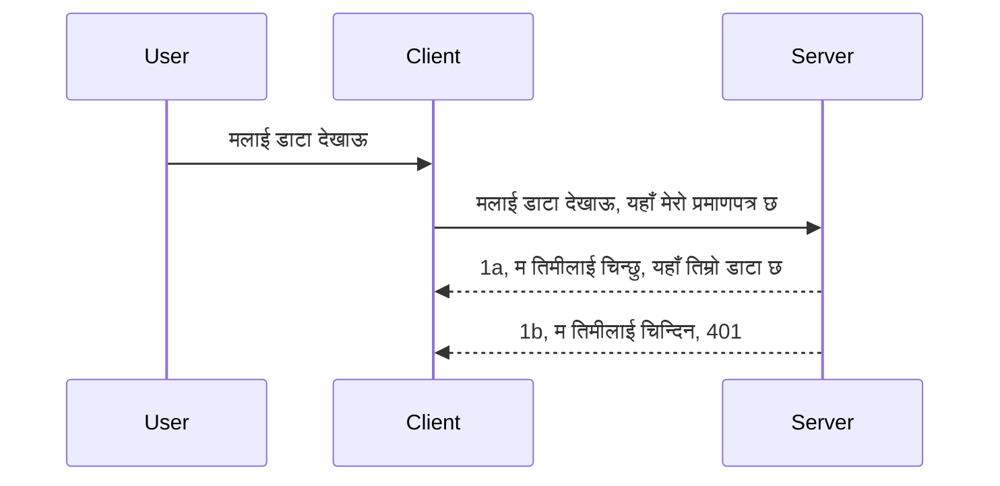

# Simple auth

MCP SDK हरूले OAuth 2.1 को प्रयोगलाई समर्थन गर्दछ जुन सत्यिकरण सर्भर, स्रोत सर्भर, प्रमाणपत्रहरू पोस्ट गर्ने, कोड प्राप्त गर्ने, कोडलाई बैरर टोकनमा बदल्ने सम्मको प्रक्रिया समेटेको हुन्छ जबसम्म तपाई अन्ततः आफ्नो स्रोत डेटा प्राप्त गर्न सक्नुहुन्छ। यदि तपाईं OAuth मा अनभिज्ञ हुनुहुन्छ जुन लागू गर्न एक उत्कृष्ट कुरा हो, भने बेसिक स्तरको प्रमाणिकरणबाट सुरु गरेर क्रमशः उत्कृष्ट सुरक्षा तर्फ बढ्ने राम्रो विचार हो। त्यसैले यो अध्याय अस्तित्वमा छ, तपाईंलाई अझ उन्नत प्रमाणिकरण तर्फ तयार पार्न।

## प्रमाणिकरण भन्नाले के बुझाउँछौं?

प्रमाणिकरण authentication र authorization को छोटकरी हो। विचार यस्तो छ कि हामीले दुई कुरा गर्न आवश्यक छ:

- **Authentication**, जसले भन्न खोजेको छ कि हामीले कसैलाई हाम्रो घरमा प्रवेश गर्न दिनु पर्ने हो कि होइन, त्यो व्यक्तिलाई "यहाँ" हुने अधिकार छ कि छैन, अर्थात् हाम्रो स्रोत सर्भर जहाँ हाम्रो MCP सर्भरका सुविधा हुन्छन्, त्यहाँ पहुँच पाउन पाउनु पर्ने हो कि होइन भनेर थाहा पाउने प्रक्रिया।
- **Authorization**, प्रक्रिया जसले पत्ता लगाउँछ कि प्रयोगकर्ताले ती विशिष्ट स्रोतहरूको पहुँच हुनु पर्छ कि छैन जुन उनीहरू सोधिरहेका छन्, उदाहरणका लागि ती अर्डरहरू वा ती उत्पादनहरू, वा उनीहरूले सामग्री पढ्न पाउने तर मेटाउन नपाउने जस्तो अधिकार छ कि छैन।

## प्रमाणपत्रहरू: हामी प्रणालीलाई कसरी आफ्नो परिचय गराउँछौं

धेरैजसो वेब विकासकर्ताहरूले सर्भरसँग प्रमाणपत्र प्रदान गर्ने बारे सोच्न थाल्छन्, प्रायः एउटा रहस्य जुन भन्छ यदि उनीहरू यहाँ हुन पाउँछन् "Authentication"। यो प्रमाणपत्र प्रायः युजरनेम र पासवर्डको base64 इन्कोड गरिएको संस्करण वा विशिष्ट प्रयोगकर्तालाई अनौठो रूपमा चिन्न API कुञ्जी हुन्छ।

यो प्रायः "Authorization" नामको हेडर मार्फत पठाइन्छ यस प्रकार:

```json
{ "Authorization": "secret123" }
```

यसलाई सामान्यतया बेसिक प्रमाणिकरण भनिन्छ। समग्र प्रवाह यस प्रकार छ:


अब हामी प्रवाह दृष्टिकोणबाट यो कसरी काम गर्छ बुझिसकेपछि, यसको कार्यान्वयन कसरी गर्ने? अधिकांश वेब सर्भरहरूले middleware भनिने अवधारणा हुन्छ, जुन अनुरोधको भागका रूपमा चल्ने कोडको टुक्रा हुन्छ जसले प्रमाणपत्रहरू प्रमाणीकरण गर्न सक्छ, र प्रमाणपत्रहरू मान्य भएमा अनुरोध पास गर्न अनुमति दिन्छ। यदि अनुरोधसँग मान्य प्रमाणपत्र छैन भने तपाईंलाई प्रमाणिकरण त्रुटि फिर्ता हुन्छ। हामी कसरि यो लागू गर्न सक्छौं हेरौँ:

**Python**

```python
class AuthMiddleware(BaseHTTPMiddleware):
    async def dispatch(self, request, call_next):

        has_header = request.headers.get("Authorization")
        if not has_header:
            print("-> Missing Authorization header!")
            return Response(status_code=401, content="Unauthorized")

        if not valid_token(has_header):
            print("-> Invalid token!")
            return Response(status_code=403, content="Forbidden")

        print("Valid token, proceeding...")
       
        response = await call_next(request)
        # कुनै पनि ग्राहक हेडरहरू थप्नुहोस् वा जवाफमा कुनै नगरीक परिवर्तन गर्नुहोस्
        return response


starlette_app.add_middleware(CustomHeaderMiddleware)
```

यहाँ हामीले: 

- `AuthMiddleware` नामक मिडलवेयर सिर्जना गरेका छौं जहाँ यसको `dispatch` विधि वेब सर्भरले आह्वान गर्छ। 
- वेब सर्भरमा मिडलवेयर थपेका छौं:

    ```python
    starlette_app.add_middleware(AuthMiddleware)
    ```

- प्रमाणीकरण परीक्षण गर्ने तरिका लेखेका छौं जसले जाँच गर्दछ कि Authorization हेडर छ र पठाइएको रहस्य मान्य छ कि छैन:

    ```python
    has_header = request.headers.get("Authorization")
    if not has_header:
        print("-> Missing Authorization header!")
        return Response(status_code=401, content="Unauthorized")

    if not valid_token(has_header):
        print("-> Invalid token!")
        return Response(status_code=403, content="Forbidden")
    ```

    यदि रहस्य छ र मान्य छ भने हामी `call_next` कल गरेर अनुरोध पास गर्न दिन्छौं र प्रतिक्रियाफिर्ता गर्दछौं।

    ```python
    response = await call_next(request)
    # कुनै पनि ग्राहक हेडरहरू थप्नुहोस् वा प्रतिक्रिया मा कुनै तरिकाले परिवर्तन गर्नुहोस्
    return response
    ```

यसले काम गर्ने तरिका यस्तो छ कि यदि वेब अनुरोध सर्भरतर्फ गरियो भने मिडलवेयर आह्वान हुनेछ र यसको कार्यान्वयन अनुसार त्यो अनुरोधलाई पास गर्न दिन्छ या क्लाइन्टलाई अगाडि बढ्न अनुमति छैन भन्ने त्रुटि फिर्ता गर्छ।

**TypeScript**

यहाँ हामी लोकप्रिय Express फ्रेमवर्कसँग मिडलवेयर सिर्जना गर्छौं र अनुरोध MCP सर्भरमा पुग्नु अघि अवरोध गर्छौं। यहाँ त्यस्को कोड छ:

```typescript
function isValid(secret) {
    return secret === "secret123";
}

app.use((req, res, next) => {
    // 1. प्राधिकरण हेडर छ कि छैन?
    if(!req.headers["Authorization"]) {
        res.status(401).send('Unauthorized');
    }
    
    let token = req.headers["Authorization"];

    // 2. मान्यता जाँच्नुहोस्।
    if(!isValid(token)) {
        res.status(403).send('Forbidden');
    }

   
    console.log('Middleware executed');
    // 3. अनुरोधलाई अनुरोध पाइपलाइनको अर्को चरणमा पठाउनुहोस्।
    next();
});
```

यस कोडमा हामी:

1. पहिलो पटक Authorization हेडर छ कि छैन जाँच गर्छौं, नत्र 401 त्रुटि पठाउँछौं।
2. प्रमाणपत्र/टोकन मान्य छ कि छैन सुनिश्चित गर्छौं, नत्र 403 त्रुटि पठाउँछौं।
3. अन्ततः अनुरोध पाइपलाइनमा अनुरोधलाई पास गर्छौं र सोधिएको स्रोत फिर्ता गर्छौं।

## अभ्यास: प्रमाणिकरण लागू गर्नुहोस्

हामीले ज्ञान लिएर कार्यान्वयन गर्ने प्रयास गरौं। योजना यस प्रकार छ:

सर्भर

- वेब सर्भर र MCP इन्स्टेन्स सिर्जना गर्नुहोस्।
- सर्भरका लागि मिडलवेयर लागू गर्नुहोस्।

क्लाइन्ट 

- हेडरमार्फत प्रमाणपत्र सहित वेब अनुरोध पठाउनुहोस्।

### -1- वेब सर्भर र MCP इन्स्टेन्स सिर्जना गर्नुहोस्

हाम्रो पहिलो चरणमा, हामीले वेब सर्भर इन्स्टेन्स र MCP सर्भर सिर्जना गर्नु पर्छ।

**Python**

यहाँ हामी MCP सर्भर इन्स्टेन्स सिर्जना गर्छौं, starlette वेब एप बनाउँछौं र uvicorn सँग होस्ट गर्छौं।

```python
# MCP सर्भर सिर्जना गर्दै

app = FastMCP(
    name="MCP Resource Server",
    instructions="Resource Server that validates tokens via Authorization Server introspection",
    host=settings["host"],
    port=settings["port"],
    debug=True
)

# starlette वेब एप्लिकेशन सिर्जना गर्दै
starlette_app = app.streamable_http_app()

# uvicorn मार्फत एप्लिकेशन सेवा गर्दै
async def run(starlette_app):
    import uvicorn
    config = uvicorn.Config(
            starlette_app,
            host=app.settings.host,
            port=app.settings.port,
            log_level=app.settings.log_level.lower(),
        )
    server = uvicorn.Server(config)
    await server.serve()

run(starlette_app)
```

यस कोडमा हामीले:

- MCP सर्भर सिर्जना गर्यौं।
- MCP सर्भरबाट starlette वेब एप निर्माण गर्यौं, `app.streamable_http_app()`।
- uvicorn प्रयोग गरेर वेब एप होस्ट र सर्भ गर्यौं। `server.serve()`।

**TypeScript**

यहाँ हामी MCP सर्भर इन्स्टेन्स सिर्जना गर्छौं।

```typescript
const server = new McpServer({
      name: "example-server",
      version: "1.0.0"
    });

    // ... सर्भर स्रोतहरू, उपकरणहरू, र प्रम्प्टहरू सेट अप गर्नुहोस् ...
```

यो MCP सर्भर सिर्जना हामीले POST /mcp रूट परिभाषामा गर्नु पर्ने भयो, त्यसैले माथिको कोडलाई यस प्रकार सारौं:

```typescript
import express from "express";
import { randomUUID } from "node:crypto";
import { McpServer } from "@modelcontextprotocol/sdk/server/mcp.js";
import { StreamableHTTPServerTransport } from "@modelcontextprotocol/sdk/server/streamableHttp.js";
import { isInitializeRequest } from "@modelcontextprotocol/sdk/types.js"

const app = express();
app.use(express.json());

// सत्र आईडी द्वारा ट्रान्सपोर्टहरू भण्डारण गर्ने नक्सा
const transports: { [sessionId: string]: StreamableHTTPServerTransport } = {};

// क्लाइन्ट-देखि-सर्भर सञ्चारका लागि POST अनुरोधहरूलाई ह्यान्डल गर्नुहोस्
app.post('/mcp', async (req, res) => {
  // अवस्थित सत्र आईडी जाँच गर्नुहोस्
  const sessionId = req.headers['mcp-session-id'] as string | undefined;
  let transport: StreamableHTTPServerTransport;

  if (sessionId && transports[sessionId]) {
    // अवस्थित ट्रान्सपोर्ट पुन: प्रयोग गर्नुहोस्
    transport = transports[sessionId];
  } else if (!sessionId && isInitializeRequest(req.body)) {
    // नयाँ सुरुवात अनुरोध
    transport = new StreamableHTTPServerTransport({
      sessionIdGenerator: () => randomUUID(),
      onsessioninitialized: (sessionId) => {
        // सत्र आईडी द्वारा ट्रान्सपोर्ट भण्डारण गर्नुहोस्
        transports[sessionId] = transport;
      },
      // DNS पुन: बाँध्ने सुरक्षा पूर्वनिर्धारित रूपमा पछिल्लो अनुकूलताका लागि अक्षम गरिएको छ। यदि तपाईंले यो सर्भर
      // स्थानीय रूपमा चलाउँदै हुनुहुन्छ भने, निश्चित गर्नुहोस् कि यसलाई सेट गर्नुहोस्:
      // enableDnsRebindingProtection: true,
      // allowedHosts: ['127.0.0.1'],
    });

    // ट्रान्सपोर्ट बन्द हुँदा सफा गर्नुहोस्
    transport.onclose = () => {
      if (transport.sessionId) {
        delete transports[transport.sessionId];
      }
    };
    const server = new McpServer({
      name: "example-server",
      version: "1.0.0"
    });

    // ... सर्भर स्रोतहरू, उपकरणहरू, र प्रॉम्प्टहरू सेट अप गर्नुहोस् ...

    // MCP सर्भरमा जडान गर्नुहोस्
    await server.connect(transport);
  } else {
    // अमान्य अनुरोध
    res.status(400).json({
      jsonrpc: '2.0',
      error: {
        code: -32000,
        message: 'Bad Request: No valid session ID provided',
      },
      id: null,
    });
    return;
  }

  // अनुरोध ह्यान्डल गर्नुहोस्
  await transport.handleRequest(req, res, req.body);
});

// GET र DELETE अनुरोधहरूको लागि पुन: प्रयोगयोग्य ह्यान्डलर
const handleSessionRequest = async (req: express.Request, res: express.Response) => {
  const sessionId = req.headers['mcp-session-id'] as string | undefined;
  if (!sessionId || !transports[sessionId]) {
    res.status(400).send('Invalid or missing session ID');
    return;
  }
  
  const transport = transports[sessionId];
  await transport.handleRequest(req, res);
};

// SSE मार्फत सर्भर-देखि-क्लाइन्ट सूचनाहरूका लागि GET अनुरोधहरू ह्यान्डल गर्नुहोस्
app.get('/mcp', handleSessionRequest);

// सत्र समाप्तिका लागि DELETE अनुरोधहरू ह्यान्डल गर्नुहोस्
app.delete('/mcp', handleSessionRequest);

app.listen(3000);
```

यहाँ तपाईले देख्नुभएको छ कि MCP सर्भर सिर्जना `app.post("/mcp")` भित्र सारिएको छ।

अब आउनुहोस् अर्को चरणमा, मिडलवेयर सिर्जना गर्ने ताकि हामी आउने प्रमाणपत्र प्रमाणित गर्न सकौं।

### -2- सर्भरका लागि मिडलवेयर लागू गर्नुहोस्

अब मिडलवेयर भागमा जाऔं। यहाँ हामी एउटा मिडलवेयर सिर्जना गर्नेछौं जुन `Authorization` हेडरमा प्रमाणपत्र खोज्छ र त्यसको मान्यता जाँच गर्छ। यदि स्वीकार्य छ भने अनुरोधले आवश्यक काम गर्न अघि बढ्छ (जस्तै उपकरण सूचीकरण, स्रोत पढ्ने वा जुनसुकै MCP सुविधा क्लाइन्टले सोधेको हो)।

**Python**

मिडलवेयर बनाउन, हामीले `BaseHTTPMiddleware` बाट इनहेरीट गर्ने कक्षा बनाउन आवश्यक छ। दुई महत्वपूर्ण भागहरू छन्:

- अनुरोध `request` जसबाट हेडर जानकारी पढिन्छ।
- `call_next` प्रतिक्रिया जसलाई कल गर्नु पर्छ यदि क्लाइन्टले स्वीकार्य प्रमाणपत्र ल्याएको भए।

पहिले, यदि `Authorization` हेडर छैन भने यो केस ह्याण्डल गर्नुपर्छ:

```python
has_header = request.headers.get("Authorization")

# कुनै हेडर उपलब्ध छैन, 401 सँग असफल गर्नुहोस्, अन्यथा अगाडि बढ्नुहोस्।
if not has_header:
    print("-> Missing Authorization header!")
    return Response(status_code=401, content="Unauthorized")
```

यहाँ हामी 401 unauthorized सन्देश पठाउँछौं किनकि क्लाइन्ट प्रमाणीकरणमा असफल भएको छ।

अर्को, यदि प्रमाणपत्र बुझाएको थियो भने त्यसको मान्यता जाँच्नु पर्छ यसरी:

```python
 if not valid_token(has_header):
    print("-> Invalid token!")
    return Response(status_code=403, content="Forbidden")
```

यहाँ 403 forbidden सन्देश पठाउँछौं। तल पूरा मिडलवेयर हेर्नुहोस् जुन माथिका सबै कुरा कार्यान्वयन गरेको छ:

```python
class AuthMiddleware(BaseHTTPMiddleware):
    async def dispatch(self, request, call_next):

        has_header = request.headers.get("Authorization")
        if not has_header:
            print("-> Missing Authorization header!")
            return Response(status_code=401, content="Unauthorized")

        if not valid_token(has_header):
            print("-> Invalid token!")
            return Response(status_code=403, content="Forbidden")

        print("Valid token, proceeding...")
        print(f"-> Received {request.method} {request.url}")
        response = await call_next(request)
        response.headers['Custom'] = 'Example'
        return response

```

अति राम्रो, तर `valid_token` फंक्शन के हो? यहाँ छ:

```python
# उत्पादनका लागि प्रयोग नगर्नुहोस् - यसलाई सुधार गर्नुहोस् !!
def valid_token(token: str) -> bool:
    # "Bearer " उपसर्ग हटाउनुहोस्
    if token.startswith("Bearer "):
        token = token[7:]
        return token == "secret-token"
    return False
```

यो अवश्य पनि सुधार गर्न सकिन्छ।

महत्त्वपूर्ण: तपाईंले कहिल्यै यस प्रकारका रहस्यहरू कोडमा नराख्नुपर्छ। आदर्श रूपमा, तपाईंले तुलना गर्ने मान डाटा स्रोत वा IDP (पहिचान सेवा प्रदायक) बाट लिनुपर्छ, वा अझ राम्रो कुरा, IDP लाई प्रमाणीकरण गराउन दिनुपर्छ।

**TypeScript**

Express सँग यो लागू गर्न, हामीले `use` विधि प्रयोग गर्नुपर्छ जसले मिडलवेयर फंक्शनहरू लिन्छ।

हामीले:

- अनुरोध भेरिएबलसँग अन्तरक्रिया गर्नुपर्छ र `Authorization` प्रोपर्टीमा पास गरिएको प्रमाणपत्र जाँच्नुपर्छ।
- प्रमाणपत्रको मान्यता जाँच्नुपर्छ, र यदि सही छ भने अनुरोधलाई अगाडि बढ्न दिनुपर्छ र क्लाइन्टको MCP अनुरोधले जे गर्नुपर्‍यो गर्छ (जस्तै उपकरण सूचीकृत गर्नु, स्रोत पढ्नु वा अन्य MCP सम्बन्धि कार्य)।

यहाँ, हामीले जाँच गर्दैछौं कि `Authorization` हेडर छ कि छैन, छैन भने अनुरोध रोक्दैछौं:

```typescript
if(!req.headers["authorization"]) {
    res.status(401).send('Unauthorized');
    return;
}
```

यदि हेडर पहिलो स्थानमा पठाइएको छैन भने 401 त्रुटि प्राप्त हुन्छ।

अर्को, प्रमाणपत्र मान्य छ कि छैन जाँच्छौं, छैन भने फेरि अनुरोध रोकिन्छ तर सन्देश फरक हुन्छ:

```typescript
if(!isValid(token)) {
    res.status(403).send('Forbidden');
    return;
} 
```

यहाँ 403 त्रुटि आउँछ।

पूरा कोड यस प्रकार छ:

```typescript
app.use((req, res, next) => {
    console.log('Request received:', req.method, req.url, req.headers);
    console.log('Headers:', req.headers["authorization"]);
    if(!req.headers["authorization"]) {
        res.status(401).send('Unauthorized');
        return;
    }
    
    let token = req.headers["authorization"];

    if(!isValid(token)) {
        res.status(403).send('Forbidden');
        return;
    }  

    console.log('Middleware executed');
    next();
});
```

हामीले वेब सर्भरलाई मिडलवेयर सेटअप गर्यौं जसले क्लाइन्टले हाम्रोतर्फ पठाउने प्रमाणपत्र जाँच्छ। क्लाइन्टका बारेमा के?

### -3- हेडरमार्फत प्रमाणपत्रसहित वेब अनुरोध पठाउनुहोस्

हामीले सुनिश्चित गर्नुपर्छ कि क्लाइन्ट हेडरमार्फत प्रमाणपत्र पास गर्दैछ। हामी MCP क्लाइन्ट प्रयोग गर्दैछौं, त्यसबारे कसरी गर्ने हो हेर्नुहोस्।

**Python**

क्लाइन्टको लागि, हामीले यसरी हेडरमा प्रमाणपत्र पास गर्नुपर्छ:

```python
# मान कडाइले राख्नु हुँदैन, कम्तिमा वातावरण चर (environment variable) वा बढी सुरक्षित भण्डारणमा राख्नुहोस्
token = "secret-token"

async with streamablehttp_client(
        url = f"http://localhost:{port}/mcp",
        headers = {"Authorization": f"Bearer {token}"}
    ) as (
        read_stream,
        write_stream,
        session_callback,
    ):
        async with ClientSession(
            read_stream,
            write_stream
        ) as session:
            await session.initialize()
      
            # TODO, तपाईं क्लाएन्टमा के गर्न चाहनुहुन्छ, जस्तै उपकरणहरूको सूची बनाउने, उपकरणहरू कल गर्ने आदि।
```

यहाँ `headers = {"Authorization": f"Bearer {token}"}` यसरी `headers` प्रोपर्टी भर्दै छौं।

**TypeScript**

यो दुई चरणमा समाधान गर्न सकिन्छ:

1. हाम्रो प्रमाणपत्रसहित कन्फिगरेसन वस्तु तयार गर्नुहोस्।
2. कन्फिगरेसन वस्तुलाई ट्रान्सपोर्टमा पास गर्नुहोस्।

```typescript

// यहाँ देखाइएको जस्तो मानलाई हार्डकोड नगर्नुहोस्। कम्तीमा यसलाई env भेरिएबलको रूपमा राख्नुहोस् र विकास मोडमा dotenv जस्ता केहि प्रयोग गर्नुहोस्।
let token = "secret123"

// क्लाइन्ट ट्रान्सपोर्ट विकल्प वस्तु परिभाषित गर्नुहोस्
let options: StreamableHTTPClientTransportOptions = {
  sessionId: sessionId,
  requestInit: {
    headers: {
      "Authorization": "secret123"
    }
  }
};

// विकल्प वस्तु ट्रान्सपोर्टलाई पास गर्नुहोस्
async function main() {
   const transport = new StreamableHTTPClientTransport(
      new URL(serverUrl),
      options
   );
```

यहाँ माथि देख्न सकिन्छ कि हामीले `options` वस्तु सिर्जना गर्यौं र हेडरहरू `requestInit` प्रोपर्टीअन्तर्गत राख्यौं।

महत्त्वपूर्ण: यसलाई कसरी सुधार गर्ने? हालको कार्यान्वयनमा केही समस्या छन्। सबैभन्दा पहिले, प्रमाणपत्र यसरी पठाउनु जोखिमपूर्ण छ जबसम्म तपाईं कम्तीमा HTTPS प्रयोग गर्नुहुन्छ। त्यसपछि पनि, प्रमाणपत्र चोरी हुन सक्छ, त्यसैले तपाईंलाई सजिलै टोकन रद्द गर्न सक्ने, कहाँबाट आयो पत्ता लगाउने, अनुरोध धेरै पटक भयो कि भएन (बोट जस्तो व्यवहार), संक्षेपमा धेरै चिन्ताहरू व्यवस्थापन गर्ने प्रणाली चाहिन्छ।

तथापि, अत्यन्त सरल API हरूका लागि जहाँ तपाईंलाई प्रमाणिकरणबिना कसैले तपाईको API कल नगरोस् भने यो आधार राम्रो सुरुवात हो।

त्यसैले, सुरक्षा अलिकति कडा बनाउने प्रयास गरौं एउटा मानकीकृत ढाँचाको प्रयोग गरेर जस्तो JSON Web Token, जसलाई JWT वा "JOT" टोकनहरू पनि भनिन्छ।

## JSON Web Tokens, JWT

त्यसैले हामी साधारण प्रमाणपत्र पठाउनबाट सुधार गर्ने प्रयास गर्दैछौं। JWT अपनाउँदा तुरुन्तै के सुधार हुन्छ?

- **सुरक्षा सुधारहरू**। बेसिक प्रमाणिकरणमा, तपाईं बारम्बार base64 इन्कोड गरिएको युजरनेम र पासवर्ड वा API कुञ्जी पठाउनु हुन्छ जुन जोखिम बढाउँछ। JWT मा, तपाईं युजरनेम र पासवर्ड पठाउनुहुन्छ, र टोकन पाएपछि त्यो टोकन समयसीमा सहित हुन्छ जसले एक्स्पायर हुन्छ। JWT ले रोलहरू, स्कोपहरू र अनुमति प्रयोग गरेर सानो-काट सिकाइ नियन्त्रण सजिलै प्रयोग गर्न दिन्छ।
- **स्टेटलेसनेस र स्केलेबिलिटी**। JWT स्वर-निहित हुन्छ, यसले सबै प्रयोगकर्ता जानकारी बोकेको हुन्छ र सर्भर-तर्फ सत्र भण्डारण आवश्यक छैन। टोकनलाई स्थानीय रूपमा पनि प्रमाणिकरण गर्न सकिन्छ।
- **इन्टरअपरेबिलिटी र फेडेरेसन**। JWT Open ID Connect को केन्द्र हो र Entra ID, Google Identity र Auth0 जस्ता परिचित पहिचान प्रदायकहरूसँग प्रयोग हुन्छ। यसले सिंगल साइन-ऑन र थप सुविधा प्रदान गरेर यसलाई एन्त्रप्राइज-ग्रेड बनाउँछ।
- **मोड्युलरिटी र लचिलोपन**। JWT API गेटवेहरू जस्तै Azure API Management, NGINX सँग पनि प्रयोग गर्न सकिन्छ। यसले प्रमाणिकरण परिदृश्यहरू र सर्भर-देखि-श्रेणी सम्वाद समावेश impersonation र delegation पनि समर्थन गर्छ।
- **प्रदर्शन र क्यासिङ**। JWT डिकोड पछि क्यास गर्न सकिन्छ जसले पार्सिङ आवश्यकतालाई कम गर्छ। यो विशेष गरी उच्च-ट्राफिक एपहरूमा थ्रूपुट सुधार्छ र इन्फ्रास्ट्रक्चरमा लोड घटाउँछ।
- **उन्नत सुविधाहरू**। यसले introspection (सर्भरमा मान्यता जाँच) र revocation (टोकन अमान्य बनाउने) पनि समर्थन गर्छ।

यी सबै फाइदाहरूका साथ, हेरौं कसरी हामी हाम्रो कार्यान्वयन अर्को स्तरमा लैजान सक्छौं।

## बेसिक प्रमाणिकरणलाई JWT मा रूपान्तरण

त्यसैले, हामीले ठूलो स्तरमा जसरी परिवर्तन गर्नुपर्छ:

- **JWT टोकन निर्माण गर्न सिक्नुहोस्** र यो क्लाइन्टबाट सर्भरमा पठाउन तयार गर्नुहोस्।
- **JWT टोकन प्रमाणित गर्नुहोस्**, र यदि मान्य छ भने क्लाइन्टलाई स्रोतहरू प्रदान गर्नुहोस्।
- **सिक्योर्ड टोकन भण्डारण**। हामीले टोकन कसरी भण्डारण गर्ने।
- **रुटहरू सुरक्षा गर्ने**। हामीले रुटहरू र विशेष MCP सुविधाहरू सुरक्षित गर्नुपर्छ।
- **रिफ्रेस टोकनहरू थप्ने**। छोटो अवधि टोकन सिर्जना गर्ने तर त्यस्तै लामो अवधि रिफ्रेस टोकन सिर्जना गर्ने जसबाट नयाँ टोकन प्राप्त गर्न सकिन्छ। रिफ्रेस एन्डपोइन्ट र रोटेसन रणनीति पनि सुनिश्चित गर्ने।

### -1- JWT टोकन निर्माण गर्नुहोस्

सबैभन्दा पहिले, JWT टोकनका भागहरू यस्तो हुन्छन्:

- **हेडर**, प्रयोग गरिएको एल्गोरिदम र टोकन प्रकार।
- **पेलोड**, दाबीहरू जस्तै sub (टोकनले प्रतिनिधित्व गर्ने युजर/एजेन्सी, सामान्यतया userid), exp (कहिले एक्स्पायर हुन्छ), role (भूमिका)।
- **सिग्नेचर**, गुप्त कुञ्जी वा निजी कुञ्जीसँग हस्ताक्षर गरिएको।

यसका लागि हामी हेडर, पेलोड र इन्कोड गरिएको टोकन बनाउने छौं।

**Python**

```python

import jwt
import jwt
from jwt.exceptions import ExpiredSignatureError, InvalidTokenError
import datetime

# JWT साइन गर्न प्रयोग गरिएको गोप्य कुञ्जी
secret_key = 'your-secret-key'

header = {
    "alg": "HS256",
    "typ": "JWT"
}

# प्रयोगकर्ता जानकारी र यसको दाबीहरू र समाप्ति समय
payload = {
    "sub": "1234567890",               # विषय (प्रयोगकर्ता आईडी)
    "name": "User Userson",                # अनुकूलित दाबी
    "admin": True,                     # अनुकूलित दाबी
    "iat": datetime.datetime.utcnow(),# जारी गरिएको मिति
    "exp": datetime.datetime.utcnow() + datetime.timedelta(hours=1)  # समाप्ति
}

# यसलाई इन्कोड गर्नुहोस्
encoded_jwt = jwt.encode(payload, secret_key, algorithm="HS256", headers=header)
```

माथिको कोडमा हामीले:

- HS256 एल्गोरिदम र JWT प्रकारको साथ हेडर परिभाषित गर्यौं।
- एउटा पेलोड बनायौं जसमा विषय वा प्रयोगकर्ता ID, युजरनेम, भूमिका, कहिले जारी भयो र कहिले एक्स्पायर हुन्छ भनी समयसीमा समावेश छ।

**TypeScript**

यहाँ हामीलाई JWT टोकन बनाउन केही dependencies चाहिन्छ।

Dependencies

```sh

npm install jsonwebtoken
npm install --save-dev @types/jsonwebtoken
```

अब यी राखेपछि, हेडर, पेलोड बनाउन र त्यसबाट इन्कोड गरिएको टोकन बनाउने।

```typescript
import jwt from 'jsonwebtoken';

const secretKey = 'your-secret-key'; // उत्पादनमा वातावरण चरहरू प्रयोग गर्नुहोस्

// पेलोड परिभाषित गर्नुहोस्
const payload = {
  sub: '1234567890',
  name: 'User usersson',
  admin: true,
  iat: Math.floor(Date.now() / 1000), // जारी गरिएको मिति
  exp: Math.floor(Date.now() / 1000) + 60 * 60 // १ घण्टामा समाप्त हुन्छ
};

// हेडर परिभाषित गर्नुहोस् (वैकल्पिक, jsonwebtoken ले पूर्वनिर्धारित सेट गर्दछ)
const header = {
  alg: 'HS256',
  typ: 'JWT'
};

// टोकन सिर्जना गर्नुहोस्
const token = jwt.sign(payload, secretKey, {
  algorithm: 'HS256',
  header: header
});

console.log('JWT:', token);
```

यस टोकनले:

HS256 प्रयोग गरी हस्ताक्षर गरिएको छ
1 घण्टा मान्य छ
sub, name, admin, iat, र exp दाबीहरू समावेश छ।

### -2- टोकन प्रमाणित गर्नुहोस्

हामीलाई टोकन प्रमाणित पनि गर्नुपर्छ। यो सर्भरमा गरिनु पर्छ जसले सुनिश्चित गर्छ कि क्लाइन्टले पठाएको टोकन साँच्चिकै मान्य छ। यहाँ धेरै जाँच गर्नुपर्छ जस्तो संरचना, वैधता। तपाईंलाई आफ्नो सिस्टममा प्रयोगकर्ता छ कि छैन भन्ने थप जाँचहरू थप्न पनि प्रोत्साहित गरिन्छ।

टोकन प्रमाणित गर्न हामीले यसलाई decode गर्न आवश्यक छ जसले हामीलाई पढ्न र त्यसपछि वैधता जाँच गर्न मद्दत गर्छ:

**Python**

```python

# JWT लाई डिकोड र प्रमाणित गर्नुहोस्
try:
    decoded = jwt.decode(token, secret_key, algorithms=["HS256"])
    print("✅ Token is valid.")
    print("Decoded claims:")
    for key, value in decoded.items():
        print(f"  {key}: {value}")
except ExpiredSignatureError:
    print("❌ Token has expired.")
except InvalidTokenError as e:
    print(f"❌ Invalid token: {e}")

```

यस कोडमा, हामीले `jwt.decode` कल गर्छौं टोकन, गुप्त कुञ्जी र एल्गोरिदम प्रयोग गरेर। ध्यान दिनुहोस् हामीले try-catch प्रयोग गरेका छौं किनकि असफल प्रमाणिकरणले त्रुटि ल्याउँछ।

**TypeScript**

यहाँ हामी `jwt.verify` कल गर्नुपर्नेछ जसले टोकन डिकोड गरेको संस्करण दिन्छ जुन हामी थप विश्लेषण गर्न सक्छौं। यदि यो कल असफल भयो भने यसको मतलब संरचना गलत छ वा अब मान्य छैन।

```typescript

try {
  const decoded = jwt.verify(token, secretKey);
  console.log('Decoded Payload:', decoded);
} catch (err) {
  console.error('Token verification failed:', err);
}
```

ध्यान दिनुहोस्: पहिले जस्तै, हामीले थप जाँच गर्नु पर्छ कि यो टोकन हाम्रो सिस्टमभित्र प्रयोगकर्तालार्ई जनाउँछ कि छैन र प्रयोगकर्ताको दावी अनुमतिको हक छ कि छैन।

अर्को, रोल-आधारित पहुँच नियन्त्रण (Role Based Access Control), जसलाई RBAC भनिन्छ, हेर्नुहोस्।
## भूमिका आधारित पहुँच नियन्त्रण थप्दै

हामीले विभिन्न भूमिकाहरूले फरक अनुमति पाउने कुरा व्यक्त गर्न चाहन्छौं। उदाहरणका लागि, हामीले मान्छौं कि एउटै एडमिनले सबै गर्न सक्छ र सामान्य प्रयोगकर्ताले पढ्न/लेखन गर्न सक्छ र अतिथिले मात्र पढ्न सक्छ। त्यसैले, यहाँ केही सम्भावित अनुमति स्तरहरू छन्:

- Admin.Write
- User.Read
- Guest.Read

अब हामी मिडलवेयर प्रयोग गरेर यस्तो नियन्त्रण कसरी कार्यान्वयन गर्ने देखौं। मिडलवेयरहरू मार्गअनुसार थप्न सकिन्छ र सबै मार्गका लागि पनि हुन सक्छ।

**Python**

```python
from starlette.middleware.base import BaseHTTPMiddleware
from starlette.responses import JSONResponse
import jwt

# कोडमा गोप्य कुरा राख्नु हुँदैन, यसले प्रदर्शनका लागि मात्र हो। यसलाई सुरक्षित ठाउँबाट पढ्नुहोस्।
SECRET_KEY = "your-secret-key" # यसलाई env भेरिएबलमा राख्नुहोस्।
REQUIRED_PERMISSION = "User.Read"

class JWTPermissionMiddleware(BaseHTTPMiddleware):
    async def dispatch(self, request, call_next):
        auth_header = request.headers.get("Authorization")
        if not auth_header or not auth_header.startswith("Bearer "):
            return JSONResponse({"error": "Missing or invalid Authorization header"}, status_code=401)

        token = auth_header.split(" ")[1]
        try:
            decoded = jwt.decode(token, SECRET_KEY, algorithms=["HS256"])
        except jwt.ExpiredSignatureError:
            return JSONResponse({"error": "Token expired"}, status_code=401)
        except jwt.InvalidTokenError:
            return JSONResponse({"error": "Invalid token"}, status_code=401)

        permissions = decoded.get("permissions", [])
        if REQUIRED_PERMISSION not in permissions:
            return JSONResponse({"error": "Permission denied"}, status_code=403)

        request.state.user = decoded
        return await call_next(request)


```

मिडलवेयर थप्ने केही विभिन्न तरिका तल जस्तै छन्:

```python

# विकल्प १: स्टारलेट अनुप्रयोग निर्माण गर्दा मिडलवेयर थप्नुहोस्
middleware = [
    Middleware(JWTPermissionMiddleware)
]

app = Starlette(routes=routes, middleware=middleware)

# विकल्प २: स्टारलेट अनुप्रयोग पहिले नै निर्माण भइसकेपछि मिडलवेयर थप्नुहोस्
starlette_app.add_middleware(JWTPermissionMiddleware)

# विकल्प ३: प्रत्येक मार्गमा मिडलवेयर थप्नुहोस्
routes = [
    Route(
        "/mcp",
        endpoint=..., # ह्यान्डलर
        middleware=[Middleware(JWTPermissionMiddleware)]
    )
]
```

**TypeScript**

हामी `app.use` र एउटा मिडलवेयर प्रयोग गर्न सक्छौं जुन सबै अनुरोधहरूको लागि चल्नेछ।

```typescript
app.use((req, res, next) => {
    console.log('Request received:', req.method, req.url, req.headers);
    console.log('Headers:', req.headers["authorization"]);

    // 1. प्रमाणिकरण हेडर पठाइएको छ कि छैन जाँच गर्नुहोस्

    if(!req.headers["authorization"]) {
        res.status(401).send('Unauthorized');
        return;
    }
    
    let token = req.headers["authorization"];

    // 2. टोकन मान्य छ कि छैन जाँच गर्नुहोस्
    if(!isValid(token)) {
        res.status(403).send('Forbidden');
        return;
    }  

    // 3. टोकन प्रयोगकर्ता हाम्रो प्रणालीमा अवस्थित छ कि छैन जाँच गर्नुहोस्
    if(!isExistingUser(token)) {
        res.status(403).send('Forbidden');
        console.log("User does not exist");
        return;
    }
    console.log("User exists");

    // 4. टोकनसँग सही अनुमति छ कि छैन प्रमाणित गर्नुहोस्
    if(!hasScopes(token, ["User.Read"])){
        res.status(403).send('Forbidden - insufficient scopes');
    }

    console.log("User has required scopes");

    console.log('Middleware executed');
    next();
});

```

हाम्रो मिडलवेयरले के-के गर्न सक्छ र के-के गर्नुपर्छ, मुख्य रूपमा:

1. प्राधिकरण हेडर छ कि छैन जाँच गर्नुहोस्
2. टोकन मान्य छ कि छैन जाँच गर्नुहोस्, हामीले `isValid` भन्ने विधि लेखेका छौं जसले JWT टोकनको अखण्डता र वैधता जाँच गर्छ।
3. प्रयोगकर्ता हाम्रो प्रणालीमा छ कि छैन जाँच गर्नुहोस्।

   ```typescript
    // DB मा प्रयोगकर्ताहरू
   const users = [
     "user1",
     "User usersson",
   ]

   function isExistingUser(token) {
     let decodedToken = verifyToken(token);

     // TODO, DB मा प्रयोगकर्ता छ कि छैन जाँच गर्नुहोस्
     return users.includes(decodedToken?.name || "");
   }
   ```

   माथि, हामीले एक साधारण `users` सूची बनाएका छौं, जसले स्वाभाविक रूपमा डेटाबेसमा हुनुपर्छ।

4. थप रूपमा, हामीले टोकनसँग सही अनुमति छ कि छैन जाँच्नु पर्छ।

   ```typescript
   if(!hasScopes(token, ["User.Read"])){
        res.status(403).send('Forbidden - insufficient scopes');
   }
   ```

   माथिको कोडमा मिडलवेयरले जाँच गर्छ कि टोकनमा User.Read अनुमति छ कि छैन, नभए ४०३ त्रुटि पठाइन्छ। तल `hasScopes` सहायक विधि छ।

   ```typescript
   function hasScopes(scope: string, requiredScopes: string[]) {
     let decodedToken = verifyToken(scope);
    return requiredScopes.every(scope => decodedToken?.scopes.includes(scope));
  }
   ```

Have a think which additional checks you should be doing, but these are the absolute minimum of checks you should be doing.

Using Express as a web framework is a common choice. There are helpers library when you use JWT so you can write less code.

- `express-jwt`, helper library that provides a middleware that helps decode your token.
- `express-jwt-permissions`, this provides a middleware `guard` that helps check if a certain permission is on the token.

Here's what these libraries can look like when used:

```typescript
const express = require('express');
const jwt = require('express-jwt');
const guard = require('express-jwt-permissions')();

const app = express();
const secretKey = 'your-secret-key'; // put this in env variable

// Decode JWT and attach to req.user
app.use(jwt({ secret: secretKey, algorithms: ['HS256'] }));

// Check for User.Read permission
app.use(guard.check('User.Read'));

// multiple permissions
// app.use(guard.check(['User.Read', 'Admin.Access']));

app.get('/protected', (req, res) => {
  res.json({ message: `Welcome ${req.user.name}` });
});

// Error handler
app.use((err, req, res, next) => {
  if (err.code === 'permission_denied') {
    return res.status(403).send('Forbidden');
  }
  next(err);
});

```

अब तपाईंले देख्नुभयो कि मिडलवेयर प्रमाणिकरण र प्राधिकरण दुबैका लागि कसरी प्रयोग गर्न सकिन्छ, MCP को बारेमा भने के? के यसले हामीले प्रमाणिकरण गर्ने तरिका परिवर्तन गर्छ? त्यसो भए अर्को खण्डमा पत्ता लगाऔं।

### -3- MCP मा RBAC थप्नुहोस्

अहिलेसम्म तपाईंले मिडलवेयर मार्फत RBAC कसरी थप्ने देख्नु भयो, तर MCP को लागि हरेक विशेषता अनुसार RBAC थप्ने सजिलो तरिका छैन, त्यसैले हामी के गर्छौं? यहाँ कोड जस्तै कुरा थप्नुपर्छ जसले जाँच गर्छ कि क्लाइन्टसँग विशेष उपकरण कल गर्ने अधिकार छ कि छैन:

प्रति विशेषता RBAC प्राप्त गर्न केही विकल्पहरू छन्, यहाँ केही छन्:

- तपाईंले जहाँ अनुमति स्तर जाँच्न आवश्यक छ त्यहाँ प्रत्येक उपकरण, स्रोत, प्रॉम्प्टका लागि जाँच थप्नुहोस्।

   **python**

   ```python
   @tool()
   def delete_product(id: int):
      try:
          check_permissions(role="Admin.Write", request)
      catch:
        pass # ग्राहक प्रमाणीकरण असफल भयो, प्रमाणीकरण त्रुटि उठाउनुहोस्
   ```

   **typescript**

   ```typescript
   server.registerTool(
    "delete-product",
    {
      title: Delete a product",
      description: "Deletes a product",
      inputSchema: { id: z.number() }
    },
    async ({ id }) => {
      
      try {
        checkPermissions("Admin.Write", request);
        // गर्न बाँकी छ, id लाई productService र remote entry मा पठाउनुहोस्
      } catch(Exception e) {
        console.log("Authorization error, you're not allowed");  
      }

      return {
        content: [{ type: "text", text: `Deletected product with id ${id}` }]
      };
    }
   );
   ```


- उन्नत सर्भर दृष्टिकोण र अनुरोध ह्यान्डलरहरू प्रयोग गर्नुहोस् जसले जाँच गर्नुपर्ने स्थानहरू कम गर्छ।

   **Python**

   ```python
   
   tool_permission = {
      "create_product": ["User.Write", "Admin.Write"],
      "delete_product": ["Admin.Write"]
   }

   def has_permission(user_permissions, required_permissions) -> bool:
      # user_permissions: प्रयोगकर्ताले राखेका अनुमतिहरूको सूची
      # required_permissions: उपकरणको लागि आवश्यक अनुमतिहरूको सूची
      return any(perm in user_permissions for perm in required_permissions)

   @server.call_tool()
   async def handle_call_tool(
     name: str, arguments: dict[str, str] | None
   ) -> list[types.TextContent]:
    # request.user.permissions प्रयोगकर्ताको अनुमतिहरूको सूची हो भनी मान्नुहोस्
     user_permissions = request.user.permissions
     required_permissions = tool_permission.get(name, [])
     if not has_permission(user_permissions, required_permissions):
        # त्रुटि उ�ठाउनुहोस् "तपाईंलाई उपकरण {name} कल गर्ने अनुमति छैन"
        raise Exception(f"You don't have permission to call tool {name}")
     # निरन्तरता दिनुहोस् र उपकरण कल गर्नुहोस्
     # ...
   ```   
   

   **TypeScript**

   ```typescript
   function hasPermission(userPermissions: string[], requiredPermissions: string[]): boolean {
       if (!Array.isArray(userPermissions) || !Array.isArray(requiredPermissions)) return false;
       // प्रयोगकर्तासँग कम्तीमा एक आवश्यक अनुमति भएमा true फर्काउनुहोस्
       
       return requiredPermissions.some(perm => userPermissions.includes(perm));
   }
  
   server.setRequestHandler(CallToolRequestSchema, async (request) => {
      const { params: { name } } = request;
  
      let permissions = request.user.permissions;
  
      if (!hasPermission(permissions, toolPermissions[name])) {
         return new Error(`You don't have permission to call ${name}`);
      }
  
      // जारी राख्नुहोस्..
   });
   ```

   यसलाई ध्यान दिनुहोस्, तपाईंले आफ्नो मिडलवेयरले डिकोड गरिएको टोकन अनुरोधको user गुणमा असाइन गर्नुपर्छ जसले माथिको कोडलाई सरल बनाउँछ।

### संक्षेपमा

अब हामीले RBAC लाई सामान्य रूपमा र MCP को लागि कसरी समर्थन गर्ने छलफल गर्यौं, तपाईंले प्रस्तुत अवधारणाहरू बुझ्नुभएको छ कि छैन सुनिश्चित गर्न आफैं सुरक्षा लागू गर्ने प्रयास गर्ने समय आएको छ।

## कार्य १: आधारभूत प्रमाणीकरण प्रयोग गरी mcp सर्भर र mcp क्लाइन्ट बनाउनुहोस्

यहाँ तपाईंले हेडरहरू मार्फत प्रमाणपत्र पठाउने कुरा सिक्नु भएको छ।

## समाधान १

[Solution 1](./code/basic/README.md)

## कार्य २: कार्य १ बाट समाधानलाई JWT प्रयोग गरी उन्नत गर्नुहोस्

पहिलो समाधान लिनुहोस् तर यस पटक सुधार गरौं।

Basic Auth को सट्टा JWT प्रयोग गरौं।

## समाधान २

[Solution 2](./solution/jwt-solution/README.md)

## चुनौती

हामीले "MCP मा RBAC थप्नुहोस्" अनुभागमा वर्णन गरे जस्तै उपकरण अनुसार RBAC थप्नुहोस्।

## सारांश

तपाईंले यो अध्यायमा धेरै कुरा सिक्नुभएको छ भन्ने आशा छ, सुरक्षाको अभावदेखि आधारभूत सुरक्षा, JWT र कसरी यसलाई MCP मा थप्ने सम्म।

हामीले कस्टम JWT को साथ एक मजबुत आधार निर्माण गर्यौं, तर विस्तारसँग एक मानक-आधारित पहिचान मोडेलतर्फ अघि बढिरहेका छौं। Entra वा Keycloak जस्ता IdP अपनाउँदा हामी टोकन जारी गर्ने, प्रमाणिकरण गर्ने र जीवनचक्र व्यवस्थापनलाई विश्वसनीय प्लेटफर्ममा छोड्न सक्छौं — जसले हामीलाई अनुप्रयोग तर्क र प्रयोगकर्ता अनुभवमा ध्यान केन्द्रित गर्ने स्वतन्त्रता दिन्छ।

त्यसका लागि, हामीसँग [उन्नत अध्याय Entra मा](../../05-AdvancedTopics/mcp-security-entra/README.md) छ।

## के छ अगाडि

- अर्को: [MCP होस्टहरू सेटअप गर्दै](../12-mcp-hosts/README.md)

---

<!-- CO-OP TRANSLATOR DISCLAIMER START -->
**अस्वीकरण**:
यो दस्तावेज़ AI अनुवाद सेवा [Co-op Translator](https://github.com/Azure/co-op-translator) प्रयोग गरी अनुवाद गरिएको हो। हामी शुद्धताका लागि प्रयास गर्छौं, तर कृपया ध्यान दिनुहोस् कि स्वचालित अनुवादमा त्रुटिहरू वा असत्यताहरू हुन सक्छन्। मूल दस्तावेजलाई यसको मूल भाषामा आधिकारिक स्रोत मानिनु पर्छ। महत्वपूर्ण जानकारीका लागि, व्यावसायिक मानव अनुवाद सिफारिस गरिन्छ। यस अनुवादको प्रयोगबाट उत्पन्न हुने कुनै पनि गलत बुझाइ वा गलत व्याख्याका लागि हामी जिम्मेवार छैनौं।
<!-- CO-OP TRANSLATOR DISCLAIMER END -->