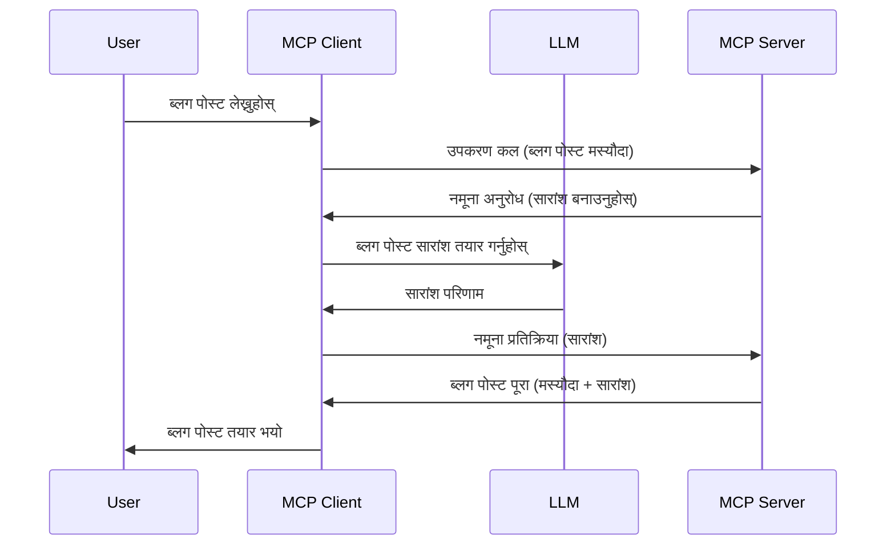

# स्याम्प्लिङ - क्लाइन्टलाई सुविधाहरू प्रतिनिधित्व गर्नुहोस्

कहिलेकाहीं, तपाईंलाई MCP क्लाइन्ट र MCP सर्भरलाई साझा लक्ष्य प्राप्त गर्न सहकार्य गर्न आवश्यक पर्छ। तपाईंको अवस्थामा सर्भरलाई क्लाइन्टमा रहेको LLM को मद्दत आवश्यक पर्न सक्छ। यस्तो अवस्थामा, स्याम्प्लिङ प्रयोग गर्नुपर्छ।

आउनुहोस् केही प्रयोग केसहरू र स्याम्प्लिङ समावेश गरेर समाधान कसरी बनाउने भनेर अन्वेषण गरौं।

## सिंहावलोकन

यस पाठमा, हामी स्याम्प्लिङ कहिले र कहाँ प्रयोग गर्ने र यसलाई कसरी कन्फिगर गर्ने भन्ने कुरा व्याख्या गर्नेछौं।

## सिक्ने उद्देश्यहरू

यस अध्यायमा, हामीले गर्नेछौं:

- स्याम्प्लिङ के हो र कहिले प्रयोग गर्ने भनेर व्याख्या गर्ने।
- MCP मा स्याम्प्लिङ कसरी कन्फिगर गर्ने देखाउने।
- स्याम्प्लिङको क्रियाकलापका उदाहरणहरू प्रदान गर्ने।

## स्याम्प्लिङ के हो र किन प्रयोग गर्ने?

स्याम्प्लिङ एक उन्नत सुविधा हो जुन यसरी काम गर्छ:


### स्याम्प्लिङ अनुरोध

ठीक छ, अब हामीसँग एक विश्वसनीय परिस्थितिको सन्दर्भ छ, सर्भरले क्लाइन्टलाई फिर्ता पठाउने स्याम्प्लिङ अनुरोधबारे कुरा गरौं। JSON-RPC ढाँचामा यस्तो अनुरोध यसरी देखिन सक्छ:

```json
{
  "jsonrpc": "2.0",
  "id": 1,
  "method": "sampling/createMessage",
  "params": {
    "messages": [
      {
        "role": "user",
        "content": {
          "type": "text",
          "text": "Create a blog post summary of the following blog post: <BLOG POST>"
        }
      }
    ],
    "modelPreferences": {
      "hints": [
        {
          "name": "claude-3-sonnet"
        }
      ],
      "intelligencePriority": 0.8,
      "speedPriority": 0.5
    },
    "systemPrompt": "You are a helpful assistant.",
    "maxTokens": 100
  }
}
```

यहाँ केही कुरा उल्लेखनीय छन्:

- Prompt, content -> text भित्र, हाम्रो प्रॉम्प्ट हो जुन LLM लाई ब्लग पोस्ट सामग्री संक्षेप गर्न निर्देशन दिन्छ।

- **modelPreferences**। यो भाग ठीक त्यस्तै हो, एक प्राथमिकता, LLM सँग कुन कन्फिगरेसन प्रयोग गर्ने सुझाव। प्रयोगकर्ताले यी सूचनाहरूको पालना गर्ने वा परिवर्तन गर्ने विकल्प छ। यस केसमा मोडल प्रयोग गर्ने, गति र बुद्धिमत्ता प्राथमिकतामा सिफारिसहरू छन्।
- **systemPrompt**, यो तपाईंको सामान्य सिस्टम प्रॉम्प्ट हो जुन तपाईंको LLM लाई व्यक्तित्व दिन्छ र निर्देशनात्मक निर्देशनहरू समावेश गर्दछ।
- **maxTokens**, यो अर्को गुण हो जसले यो कार्यका लागि कति टोकन प्रयोग गर्ने सिफारिस गरिएको हो भन्ने कुरा जनाउँछ।

### स्याम्प्लिङ प्रतिक्रिया

यो प्रतिक्रिया MCP क्लाइन्टले अन्ततः MCP सर्भरलाई पठाउने हो र क्लाइन्टले LLM कल गरेर, प्रतिक्षा गरेर र त्यसपछि यस सन्देश निर्माण गरेर प्राप्त हुने परिणाम हो। JSON-RPC मा यसरी देखिन सक्छ:

```json
{
  "jsonrpc": "2.0",
  "id": 1,
  "result": {
    "role": "assistant",
    "content": {
      "type": "text",
      "text": "Here's your abstract <ABSTRACT>"
    },
    "model": "gpt-5",
    "stopReason": "endTurn"
  }
}
```

कसरी प्रतिक्रिया ब्लग पोस्टको सारांश हो जस्तो हामीले माग्यौं। साथै, हेर्नुहोस् कि प्रयोग गरिएको `model` हामीले मागेको होइन तर "gpt-5" छ "claude-3-sonnet" को सट्टा। यसले देखाउँछ कि प्रयोगकर्ताले के प्रयोग गर्ने निर्णय परिवर्तन गर्न सक्छ र तपाईंको स्याम्प्लिङ अनुरोध एउटा सिफारिस मात्र हो।

अब हामीले मुख्य प्रवाह र "ब्लग पोस्ट सिर्जना + सारांश" को लागि उपयोगी काम बुझ्यौं, यसलाई काम गर्नका लागि के गर्नु पर्छ हेरौं।

### सन्देश प्रकारहरू

स्याम्प्लिङ सन्देशहरू केवल टेक्स्टमा सिमित छैनन्, तपाईंले तस्बिर र अडियो पनि पठाउन सक्नुहुन्छ। JSON-RPC यसरी फरक देखिन्छ:

**टेक्स्ट**

```json
{
  "type": "text",
  "text": "The message content"
}
```

**तस्बिर सामग्री**

```json
{
  "type": "image",
  "data": "base64-encoded-image-data",
  "mimeType": "image/jpeg"
}
```

**अडियो सामग्री**

```json
{
  "type": "audio",
  "data": "base64-encoded-audio-data",
  "mimeType": "audio/wav"
}
```

> NOTE: स्याम्प्लिङबारे विस्तृत जानकारीका लागि, [अधिकारिक डकुमेन्ट्स](https://modelcontextprotocol.io/specification/2025-06-18/client/sampling) हेर्नुहोस्

## क्लाइन्टमा स्याम्प्लिङ कसरी कन्फिगर गर्ने

> नोट: यदि तपाईं केवल सर्भर मात्र निर्माण गर्दै हुनुहुन्छ भने यहाँ धेरै केहि गर्नु पर्दैन।

क्लाइन्टमा, तपाईंले निम्न सुविधा यसरी निर्दिष्ट गर्नु पर्छ:

```json
{
  "capabilities": {
    "sampling": {}
  }
}
```

जब तपाईंले चयन गरेको क्लाइन्ट सर्भरसँग सुरू हुन्छ, तब यो सुविधा उपयोगमा आउनेछ।

## स्याम्प्लिङको उदाहरण - ब्लग पोस्ट सिर्जना

आउनुहोस् स्याम्प्लिङ सर्भर कोड गरौं, हामीलाई यी कदमहरू गर्न आवश्यक छ:

1. सर्भरमा उपकरण सिर्जना गर्नुहोस्।
2. उक्त उपकरणले स्याम्प्लिङ अनुरोध सिर्जना गर्नुपर्छ।
3. उपकरणले क्लाइन्टको स्याम्प्लिङ अनुरोधको जवाफ सुन्नुपर्छ।
4. त्यसपछि उपकरणले परिणाम उत्पादन गर्नुपर्छ।

क्रमशः कोड हेर्नुहोस्:

### -1- उपकरण सिर्जना

**python**

```python
@mcp.tool()
async def create_blog(title: str, content: str, ctx: Context[ServerSession, None]) -> str:
    """Create a blog post and generate a summary"""

```

### -2- स्याम्प्लिङ अनुरोध सिर्जना

तपाईंको उपकरणलाई निम्न कोडले विस्तार गर्नुहोस्:

**python**

```python
post = BlogPost(
        id=len(posts) + 1,
        title=title,
        content=content,
        abstract=""
    )

prompt = f"Create an abstract of the following blog post: title: {title} and draft: {content} "

result = await ctx.session.create_message(
        messages=[
            SamplingMessage(
                role="user",
                content=TextContent(type="text", text=prompt),
            )
        ],
        max_tokens=100,
)

```

### -3- प्रतिक्रिया कुर्नुहोस् र प्रतिक्रिया फर्काउनुहोस्

**python**

```python
post.abstract = result.content.text

posts.append(post)

# पूर्ण उत्पादन फर्काउनुहोस्
return json.dumps({
    "id": post.title,
    "abstract": post.abstract
})
```

### -4- पूर्ण कोड

**python**

```python
from starlette.applications import Starlette
from starlette.routing import Mount, Host

from mcp.server.fastmcp import Context, FastMCP

from mcp.server.session import ServerSession
from mcp.types import SamplingMessage, TextContent

import json


from uuid import uuid4
from typing import List
from pydantic import BaseModel


mcp = FastMCP("Blog post generator")

# app = FastAPI()

posts = []

class BlogPost(BaseModel):
    id: int
    title: str
    content: str
    abstract: str

posts: List[BlogPost] = []

@mcp.tool()
async def create_blog(title: str, content: str, ctx: Context[ServerSession, None]) -> str:
    """Create a blog post and generate a summary"""

    post = BlogPost(
        id=len(posts) + 1,
        title=title,
        content=content,
        abstract=""
    )

    prompt = f"Create an abstract of the following blog post: title: {title} and draft: {content} "

    result = await ctx.session.create_message(
        messages=[
            SamplingMessage(
                role="user",
                content=TextContent(type="text", text=prompt),
            )
        ],
        max_tokens=100,
    )

    post.abstract = result.content.text

    posts.append(post)

    # सम्पूर्ण ब्लग पोस्ट फिर्ता गर्नुहोस्
    return json.dumps({
        "id": post.title,
        "abstract": post.abstract
    })

if __name__ == "__main__":
    print("Starting server...")
    # mcp.run()
    mcp.run(transport="streamable-http")

# एप्लिकेशन चलाउन: python server.py
```

### -5- Visual Studio Code मा परीक्षण गर्नुहोस्

Visual Studio Code मा यसलाई परीक्षण गर्न यसरी गर्नुहोस्:

1. टर्मिनलमा सर्भर सुरू गर्नुहोस्।
2. यसलाई *mcp.json* मा थप्नुहोस् (र सुरु भएको सुनिश्चित गर्नुहोस्), जस्तै:

   ```json
   "servers": {
      "blog-server": {
        "type": "http",
        "url": "http://localhost:8000/mcp"
      }
   }
   ```

1. प्रॉम्प्ट टाइप गर्नुहोस्:

   ```text
   create a blog post named "Where Python comes from", the content is "Python is actually named after Monty Python Flying Circus"
   ```

1. स्याम्प्लिङ हुन दिनुहोस्। पहिलो पटक परीक्षण गर्दा तपाईंलाई अतिरिक्त संवाद देखाइनेछ जसलाई स्वीकार्नु पर्नेछ, त्यसपछि सामान्य उपकरण चलाउन अनुमति माग्ने संवाद देखिनेछ।

1. परिणामहरू निरीक्षण गर्नुहोस्। तपाईंले परिणामहरू GitHub Copilot Chat मा राम्ररी देख्नु हुनेछ र कच्चा JSON प्रतिक्रिया पनि निरीक्षण गर्न सक्नुहुन्छ।

**बोनस**। Visual Studio Code उपकरणहरू स्याम्प्लिङको लागि उत्कृष्ट समर्थन गर्छन्। तपाईंले स्थापना गरेको सर्भरमा स्याम्प्लिङ पहुँच यसरी कन्फिगर गर्न सक्नुहुन्छ:

1. विस्तार सेक्सनमा जानुहोस्।
2. "MCP SERVERS - INSTALLED" सेक्सनमा स्थापना गरिएको सर्भरको गियर आइकन छान्नुहोस्।
3 "Configure Model Access" चयन गर्नुहोस्, यहाँ तपाईंले GitHub Copilot ले स्याम्प्लिङ प्रदर्शन गर्दा कुन मोडेलहरू प्रयोग गर्न सक्छ चयन गर्न सक्नुहुन्छ। साथै, "Show Sampling requests" थिचेर हालै भएका स्याम्प्लिङ अनुरोधहरू देख्न सक्नुहुन्छ।

## असाइनमेन्ट

यस असाइनमेन्टमा, तपाईंले अलिक फरक स्याम्प्लिङ बनाउनु हुनेछ अर्थात् यस्तो स्याम्प्लिङ एकीकरण जसले उत्पादन विवरण उत्पन्न गर्न सहयोग पुर्याउँछ। तपाईंको अवस्था:

**परिदृश्य**: एक ई-कमर्स ब्याक अफिस कर्मचारीलाई उत्पादन विवरण सिर्जना गर्न धेरै समय लाग्छ। त्यसैले, तपाईं एउटा समाधान बनाउन लाग्नु भएको छ जहाँ "create_product" नामको उपकरणलाई "title" र "keywords" तर्कहरूसहित कल गर्दा यो पूर्ण उत्पादन उत्पादन गर्नुपर्छ जसमा "description" क्षेत्र समावेश हुनेछ जुन क्लाइन्टको LLM द्वारा भर्नुपर्छ।

TIP: पहिले सिकेका कुरा प्रयोग गरी स्याम्प्लिङ अनुरोध प्रयोग गरेर यो सर्भर र यसको उपकरण बनाउनुहोस्।

## समाधान

[Solution](./solution/README.md)

## मुख्य कुरा

स्याम्प्लिङ एक शक्तिशाली सुविधा हो जसले सर्भरलाई LLM को मद्दत आवश्यक पर्दा क्लाइन्टसमक्ष कार्यहरू प्रतिनिधित्व गर्न अनुमति दिन्छ।

## अर्को के

- [अध्याय ४ - व्यावहारिक कार्यान्वयन](../../04-PracticalImplementation/README.md)

---

<!-- CO-OP TRANSLATOR DISCLAIMER START -->
**अस्वीकरण**:
यो दस्तावेज AI अनुवाद सेवा [Co-op Translator](https://github.com/Azure/co-op-translator) प्रयोग गरेर अनुवाद गरिएको हो। हामी सटीकताका लागि प्रयास गर्छौं, तर कृपया ध्यान दिनुहोस् कि स्वचालित अनुवादमा त्रुटिहरू वा अशुद्धता हुन सक्छ। मूल भाषा मा रहेको दस्तावेजलाई अधिकारिक स्रोतको रूपमा लिनु पर्छ। महत्वपूर्ण जानकारीको लागि, व्यावसायिक मानव अनुवाद सिफारिस गरिन्छ। यस अनुवादको प्रयोगबाट उत्पन्न हुने कुनै पनि गलतफहमी वा गलत व्याख्याका लागि हामी जिम्मेवार हुने छैनौं।
<!-- CO-OP TRANSLATOR DISCLAIMER END -->