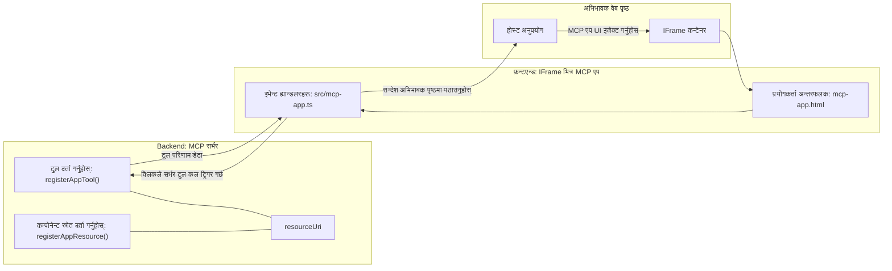

# MCP अनुप्रयोगहरू

MCP अनुप्रयोगहरू MCP मा नयाँ दृष्टिकोण हो। विचार यो हो कि एउटा उपकरण कलबाट मात्र डेटा फिर्ता गर्ने होइन्, तपाईंले यस जानकारीसँग कसरी अन्तरक्रिया गर्नुपर्छ भन्ने जानकारी पनि प्रदान गर्नुहुन्छ। यसको अर्थ उपकरण नतिजाहरूमा अब UI जानकारी पनि हुन सक्छ। तर किन हामीलाई त्यो चाहिन्छ? अब, तपाईं आज के गर्दै हुनुहुन्छ भनेर विचार गर्नुहोस्। तपाईं सम्भवतः MCP सर्भरको परिणाम उपभोग गर्दै हुनुहुन्छ कुनै प्रकारको फ्रन्टएन्ड राखेर, त्यो तपाईंले लेख्न र मर्मत गर्नुपर्ने कोड हो। कहिलेकाहीं त्यो चाहिन्छ, तर कहिलेकाहीं यदि तपाईंले डेटा देखि उपयोगकर्ता इन्टरफेससम्म सबै समेटिएको एउटा स्व-सम्पूर्ण सन्निहित जानकारीको टुक्रा ल्याउन सक्नुहुन्छ भने त्यो राम्रो हुनेछ।

## अवलोकन

यस पाठले MCP अनुप्रयोगहरूमा व्यावहारिक मार्गदर्शन प्रदान गर्दछ, यससँग कसरी सुरु गर्ने र तपाईंका विद्यमान वेब अनुप्रयोगहरूमा यसलाई कसरी एकीकृत गर्ने। MCP अनुप्रयोगहरू MCP मानकमा नयाँ थप हो।

## सिक्ने उद्देश्यहरू

यस पाठको अन्त्यसम्म, तपाईं सक्षम हुनुहुनेछ:

- MCP अनुप्रयोगहरू के हुन् भनेर व्याख्या गर्न।
- कहिले MCP अनुप्रयोगहरू प्रयोग गर्ने।
- आफ्नै MCP अनुप्रयोगहरू निर्माण र एकीकृत गर्ने।

## MCP अनुप्रयोगहरू - यो कसरी काम गर्छ

MCP अनुप्रयोगहरूको विचार यो हो कि एउटा प्रतिक्रिया दिनु जसले एक कम्पोनेन्टको रूपमा प्रस्तुत गर्न सकिन्छ। यस्तो कम्पोनेन्टमा दृश्यात्मक र अन्तरक्रियात्मक दुवै हुन सक्छन्, जस्तै, बटन क्लिकहरू, प्रयोगकर्ताको इनपुट र थप। सर्भर पक्षबाट सुरु गरौं र हाम्रो MCP सर्भर। एउटा MCP अनुप्रयोग कम्पोनेन्ट बनाउन तपाईंले उपकरण मात्र होइन एप्लिकेसन स्रोत पनि बनाउनुपर्छ। यी दुई अर्धांशहरू resourceUri द्वारा जडित छन्।

यहाँ एउटा उदाहरण छ। के समावेश छ र कुन भागले के गर्छ भनेर दृश्यमा देख्ने कोशिश गरौं:

```text
server.ts -- responsible for registering tools and the component as a UI component
src/
  mcp-app.ts -- wiring up event handlers
mcp-app.html -- the user interface
```

यो दृश्यले कम्पोनेन्ट र यसको तर्क सिर्जना गर्ने वास्तुकला वर्णन गर्छ।


अर्को, ब्याकएन्ड र फ्रन्टएन्डको जिम्मेवारीहरू वर्णन गर्ने प्रयास गरौं।

### ब्याकएन्ड

यहाँ दुई कुराहरू पूरा गर्नुपर्छ:

- हामी अन्तरक्रिया गर्न चाहने उपकरणहरू दर्ता गर्ने।
- कम्पोनेन्ट परिभाषित गर्ने।

**उपकरण दर्ता गर्नु**

```typescript
registerAppTool(
    server,
    "get-time",
    {
      title: "Get Time",
      description: "Returns the current server time.",
      inputSchema: {},
      _meta: { ui: { resourceUri } }, // यस उपकरणलाई यसको UI स्रोतसँग लिंक गर्दछ
    },
    async () => {
      const time = new Date().toISOString();
      return { content: [{ type: "text", text: time }] };
    },
  );

```

माथिको कोड व्यवहार वर्णन गर्छ, जहाँ `get-time` नामक उपकरण सार्वजनिक गरिएको छ। यसले कुनै इनपुट लिँदैन तर हालको समय प्रदान गर्छ। हामीसँग `inputSchema` परिभाषित गर्ने क्षमता छ जहाँ उपकरणहरूले प्रयोगकर्ताको इनपुट स्वीकार्नुपर्ने हुन्छ।

**कम्पोनेन्ट दर्ता गर्नु**

त्यसै फाईलमा, हामीले कम्पोनेन्ट दर्ता गर्न पनि आवश्यक छ:

```typescript
const resourceUri = "ui://get-time/mcp-app.html";

// स्रोत दर्ता गर्नुहोस्, जसले यूआईको लागि बन्डल गरिएको HTML/JavaScript फर्काउँछ।
registerAppResource(
  server,
  resourceUri,
  resourceUri,
  { mimeType: RESOURCE_MIME_TYPE },
  async () => {
    const html = await fs.readFile(path.join(DIST_DIR, "mcp-app.html"), "utf-8");

    return {
    contents: [
        { uri: resourceUri, mimeType: RESOURCE_MIME_TYPE, text: html },
    ],
    };
  },
);
```

यहाँ कसरी `resourceUri` प्रयोग गरेर कम्पोनेन्टलाई यसको उपकरणहरूसँग जडान गरिएको छ भन्ने ध्यान दिनुहोस्। रुचिका कुरा कर्सरमा UI फाईल लोड गर्ने र कम्पोनेन्ट फिर्ता गर्ने कलब्याक पनि छ।

### कम्पोनेन्ट फ्रन्टएन्ड

ब्याकएन्ड जस्तै, यहाँ दुई भागहरू छन्:

- शुद्ध HTML मा लेखिएको फ्रन्टएन्ड।
- कोड जसले घटना (event) हरूलाई व्यवस्थापन गर्छ र के गर्नुपर्छ निर्धारण गर्छ, जस्तै उपकरण कल गर्ने वा अभिभावक विन्डोलाई सन्देश पठाउने।

**प्रयोगकर्ता अन्तरफलक**

प्रयोगकर्ता अन्तरफलक हेरौं।

```html
<!-- mcp-app.html -->
<!DOCTYPE html>
<html lang="en">
  <head>
    <meta charset="UTF-8" />
    <title>Get Time App</title>
  </head>
  <body>
    <p>
      <strong>Server Time:</strong> <code id="server-time">Loading...</code>
    </p>
    <button id="get-time-btn">Get Server Time</button>
    <script type="module" src="/src/mcp-app.ts"></script>
  </body>
</html>
```

**इभेन्ट वायआरअप**

अन्तिम भाग इभेन्ट वायआरअप हो। यसको अर्थ हामीले UI को कुन भागमा इभेन्ट ह्यान्डलरहरू आवश्य छ र इभेन्ट उठेमा के गर्ने भनेर निर्धारित गर्ने:

```typescript
// mcp-app.ts

import { App } from "@modelcontextprotocol/ext-apps";

// एलिमेन्ट सन्दर्भहरू प्राप्त गर्नुहोस्
const serverTimeEl = document.getElementById("server-time")!;
const getTimeBtn = document.getElementById("get-time-btn")!;

// अनुप्रयोग इन्स्ट्यान्स सिर्जना गर्नुहोस्
const app = new App({ name: "Get Time App", version: "1.0.0" });

// सर्भरबाट उपकरण नतिजाहरू प्रशोधन गर्नुहोस्। सुरुमा `app.connect()` अघि सेट गर्नुहोस् ताकि
// प्रारम्भिक उपकरण नतिजा छुटाउन नपरोस्।
app.ontoolresult = (result) => {
  const time = result.content?.find((c) => c.type === "text")?.text;
  serverTimeEl.textContent = time ?? "[ERROR]";
};

// बटन क्लिक जडान गर्नुहोस्
getTimeBtn.addEventListener("click", async () => {
  // `app.callServerTool()` ले UI लाई सर्भरबाट नयाँ डाटा अनुरोध गर्न अनुमति दिन्छ
  const result = await app.callServerTool({ name: "get-time", arguments: {} });
  const time = result.content?.find((c) => c.type === "text")?.text;
  serverTimeEl.textContent = time ?? "[ERROR]";
});

// होस्टसँग जडान गर्नुहोस्
app.connect();
```

माथिको बाट देखिनसक्छ कि यो DOM तत्वहरूलाई इभेन्टसँग जोड्ने सामान्य कोड हो। विशेष कुरा हो `callServerTool` कल जुन ब्याकएन्डमा उपकरण कल गर्दछ।

## प्रयोगकर्ता इनपुटसँग काम गर्ने

अहिलेसम्म हामीले यस्तो कम्पोनेन्ट देख्यौं जसमा एउटा बटन छ र यदि क्लिक गरिन्छ भने एउटा उपकरण कल हुन्छ। अब हामी थप UI तत्वहरू जस्तै इनपुट फिल्ड थप्न र उपकरणमा तर्कहरू पठाउन सक्ने प्रयास गरौं। हामी एक FAQ कार्यक्षमता लागू गर्नेछौं। यसले यसरी काम गर्नुपर्छ:

- एउटा बटन र एउटा इनपुट तत्व हुने जहाँ प्रयोगकर्ताले "Shipping" जस्तै कुञ्जी शब्द टाइप गर्छ र खोजी गर्छ। यसले ब्याकएन्डमा एउटा उपकरण कल गर्नेछ जुन FAQ डाटामा खोजी गर्छ।
- त्यही FAQ खोजलाई समर्थन गर्ने उपकरण।

पहिले ब्याकएन्डमा आवश्यक समर्थन थपौं:

```typescript
const faq: { [key: string]: string } = {
    "shipping": "Our standard shipping time is 3-5 business days.",
    "return policy": "You can return any item within 30 days of purchase.",
    "warranty": "All products come with a 1-year warranty covering manufacturing defects.",
  }

registerAppTool(
    server,
    "get-faq",
    {
      title: "Search FAQ",
      description: "Searches the FAQ for relevant answers.",
      inputSchema: zod.object({
        query: zod.string().default("shipping"),
      }),
      _meta: { ui: { resourceUri: faqResourceUri } }, // यस उपकरणलाई यसको UI स्रोतसँग लिंक गर्दछ
    },
    async ({ query }) => {
      const answer: string = faq[query.toLowerCase()] || "Sorry, I don't have an answer for that.";
      return { content: [{ type: "text", text: answer }] };
    },
  );
```

यहाँ हामीले कसरी `inputSchema` भर्नु हुन्छ र यसलाई `zod` स्किमाको रूपमा प्रदान गर्न सकिन्छ भनेर देखाइयो:

```typescript
inputSchema: zod.object({
  query: zod.string().default("shipping"),
})
```

माथिको स्किमामा हामीले `query` नामक इनपुट प्यारामिटर घोषणा गरेका छौं र यो वैकल्पिक छ, र यसको डिफल्ट मान "shipping" छ।

अब *mcp-app.html* मा जानुहोस् र यहाँ कुन UI बनाउनुपर्छ हेर्नुहोस्:

```html
<div class="faq">
    <h1>FAQ response</h1>
    <p>FAQ Response: <code id="faq-response">Loading...</code></p>
    <input type="text" id="faq-query" placeholder="Enter FAQ query" />
    <button id="get-faq-btn">Get FAQ Response</button>
  </div>
```

राम्रो, अब इनपुट तत्व र बटन छ। पछि *mcp-app.ts* मा जाउँ र यी इभेन्टहरू जोडौं:

```typescript
const getFaqBtn = document.getElementById("get-faq-btn")!;
const faqQueryInput = document.getElementById("faq-query") as HTMLInputElement;

getFaqBtn.addEventListener("click", async () => {
  const query = faqQueryInput.value;
  const result = await app.callServerTool({ name: "get-faq", arguments: { query } });
  const faq = result.content?.find((c) => c.type === "text")?.text;
  faqResponseEl.textContent = faq ?? "[ERROR]";
});
```

माथिको कोडमा हामीले:

- अन्तरक्रियात्मक UI तत्वहरूको सन्दर्भ बनेका छौं।
- बटन क्लिक ह्यान्डल गरेर इनपुट मान पर्ल्याएर `app.callServerTool()` कल गर्छौं जसमा `name` र `arguments` हुन्छन् जहाँ पछि `query` मान पठाइन्छ।

जब तपाईं `callServerTool` कल गर्नुहुन्छ, यो अभिभावक विन्डोलाई सन्देश पठाउँछ र त्यो विन्डो अन्ततः MCP सर्भर कल गर्छ।

### ट्राई गर्नुहोस्

यसलाई प्रयास गर्दा अब हामीले निम्न देख्नु पर्छ:


यहाँ "warranty" जस्तो इनपुटसँग प्रयास गरिएको छ:


यो कोड चलाउन, [Code section](./code/README.md) मा जानुहोस्।

## भिजुअल स्टुडियो कोडमा परीक्षण

Visual Studio Code ले MCP अनुप्रयोगहरूका लागि राम्रो समर्थन छ र सम्भवतः तपाइँको MCP अनुप्रयोगहरू परीक्षण गर्ने सबैभन्दा सजिलो तरिकामध्ये एक हो। Visual Studio Code प्रयोग गर्न, *mcp.json* मा निम्नServer entry थप्नुहोस्:

```json
"my-mcp-server-7178eca7": {
    "url": "http://localhost:3001/mcp",
    "type": "http"
  }
```

पछि सर्भर सुरु गर्नुहोस्, तपाईले आफ्नो MCP अनुप्रयोगसँग Chat Window मार्फत संचार गर्न सक्नुहुन्छ यदि तपाईंसँग GitHub Copilot छ भने।

यसलाई प्रॉम्प्ट मार्फत ट्रिगर गर्न सकिन्छ, जस्तै "#get-faq":


वेब ब्राउजरमा जस्तै, यसले यस्तै तरिकाले प्रस्तुत गर्दछ:


## असाइनमेन्ट

रक पेपर सिजर गेम बनाउनुहोस्। यसमा निम्न समावेश हुनु पर्छ:

UI:

- विकल्पहरूको ड्रप डाउन सूची
- चयन पेश गर्न बटन
- लेबल जसले देखाउँछ कसले के छाने र कसले जित्यो

सर्भर:

- एउटा रक पेपर सिजर उपकरण जुन "choice" इनपुट लिन्छ। यसले कम्प्युटरको छनोट पनि प्रस्तुत गर्नेछ र विजेता निर्धारण गर्नेछ।

## समाधान

[Solution](./assignment/README.md)

## सारांश

हामीले MCP अनुप्रयोगहरू नामक नयाँ दृष्टिकोण सिक्यौं। यो नयाँ दृष्टिकोण MCP सर्भरहरूलाई न केवल डेटा तर यो डेटा कसरी प्रस्तुत गरिनुपर्छ भन्नेमा पनि विचार राख्न अनुमति दिन्छ।

थप रूपमा, हामीले जान्यौं कि यी MCP अनुप्रयोगहरू iframe मा होस्ट गरिन्छन् र MCP सर्भरहरूसँग कुराकानी गर्न अभिभावक वेब अनुप्रयोगलाई सन्देशहरू पठाउनुपर्ने हुन्छ। यस्तो कुराकानी सजिलो बनाउन धेरै पुस्तकालयहरू छन्, जसमा सादा JavaScript, React, र बढी समावेश छन्।

## मुख्य सार

यहाँ तपाईंले सिक्नुभएको छ:

- MCP अनुप्रयोगहरू नयाँ मानक हो जुन तब उपयोगी हुन्छ जब तपाईंले डेटा र UI सुविधा दुबै पठाउन चाहनुहुन्छ।
- यी प्रकारका अनुप्रयोगहरू सुरक्षा कारणले iframe मा चल्छन्।

## के छ अर्को

- [Chapter 4](../../04-PracticalImplementation/README.md)

---

<!-- CO-OP TRANSLATOR DISCLAIMER START -->
**अस्वीकरण**:
यो दस्तावेज AI अनुवाद सेवा [Co-op Translator](https://github.com/Azure/co-op-translator) प्रयोग गरी अनुवाद गरिएको हो। हामी शुद्धताका लागि प्रयासरत छौं, तर कृपया ध्यान दिनुहोस् कि स्वचालित अनुवादमा त्रुटिहरू वा अशुद्धता हुनसक्छ। मौलिक दस्तावेज यसको मूल भाषामा आधिकारिक स्रोत मानिनुपर्छ। महत्वपूर्ण जानकारीको लागि, पेशेवर मानवीय अनुवाद सिफारिस गरिन्छ। यस अनुवादको प्रयोगबाट उत्पन्न कुनै पनि गलत बुझाइ वा गलत व्याख्याका लागि हामी जिम्मेवार छैनौं।
<!-- CO-OP TRANSLATOR DISCLAIMER END -->