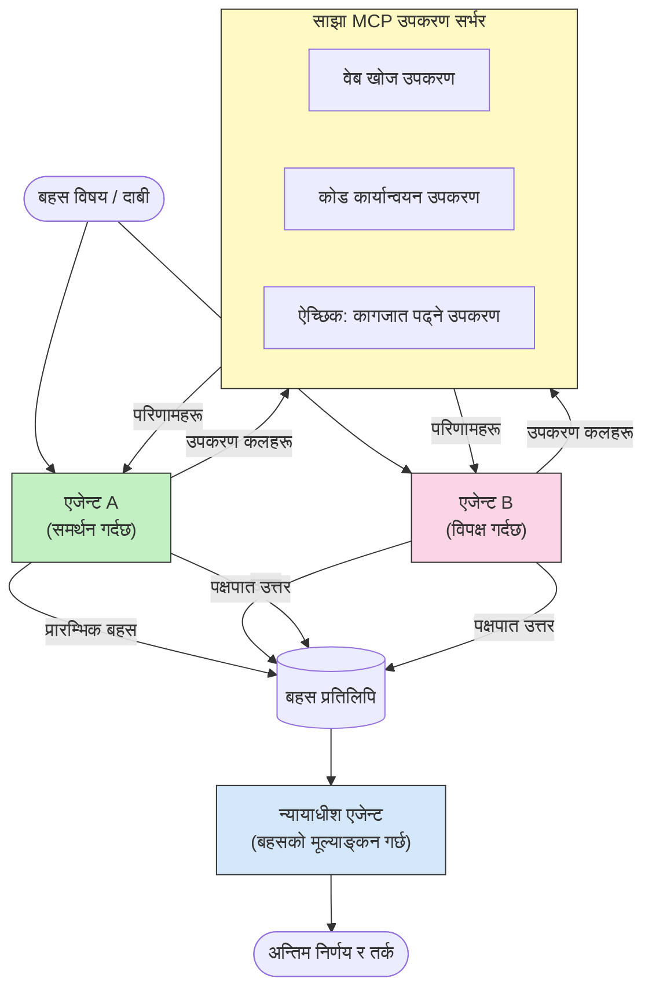

# MCP सहित द्वन्द्वात्मक बहु-एजेंट तर्क

बहु-एजेंट बहस ढाँचाहरूले दुई वा बढी एजेन्टहरूलाई विरोधी दृष्टिकोणहरूसँग प्रयोग गरी बढी भरपर्दो र राम्ररी समायोजित परिणामहरू उत्पादन गर्छ जुन एकल एजेन्टले मात्र हासिल गर्न सक्दैन।

## परिचय

यस पाठमा, हामी **द्वन्द्वात्मक बहु-एजेंट ढाँचा** अन्वेषण गर्नेछौं — एउटा प्रविधि जहाँ दुई AI एजेन्टहरूलाई विषयमा विरोधी दृष्टिकोणहरू दिइन्छ र तिनीहरूले तर्क गर्नुपर्छ, MCP उपकरणहरू कल गर्नुपर्छ, र एक अर्काका निष्कर्षहरूलाई चुनौती दिनुपर्छ। तेस्रो एजेन्ट (वा मानव समीक्षक) त्यसपछि तर्कहरू मूल्यांकन गरी उत्तम परिणाम निर्धारण गर्छ।

यो ढाँचा विशेष गरी उपयोगी छ:

- **हलुसिनेसन पत्ता लगाउन**: दोस्रो एजेन्टले पहिलो एजेन्टले गरेको बिना प्रमाणका दाबीहरूलाई चुनौती दिन्छ।
- **खतरा मोडलिङ र सुरक्षा समीक्षा**: एउटा एजेन्ट प्रणाली सुरक्षित छ भन्छ; अर्को भत्काउने ठाउँहरू खोज्छ।
- **API वा आवश्यकताहरूको डिजाइन**: एउटा एजेन्ट प्रस्तावित डिजाइनको रक्षा गर्छ; अर्को आपत्तिहरू उठाउँछ।
- **तथ्यगत प्रमाणिकरण**: दुबै एजेन्टहरूले स्वतन्त्र रूपमा एउटै MCP उपकरणहरू सोध्छन् र एक अर्काका निष्कर्षहरू जाँच गर्छन्।

उनीहरूले एउटै MCP उपकरण पोर्टफोलियोलाई साझा गरेर, दुबै एजेन्टहरू एउटै सूचना वातावरणमा काम गर्छन् — जसको अर्थ कुनै पनि असहमति साँच्चिकै तर्कगत भिन्नता जनाउँछ, सूचना असमानता होइन।

## सिकाइ उद्देश्यहरू

यस पाठको अन्त्यमा, तपाईं सक्षम हुनुहुनेछ:

- किन द्वन्द्वात्मक बहु-एजेंट ढाँचाहरूले एकल एजेन्ट पाइपलाइनले छुटाउने गल्तीहरू पत्ता लगाउँछन् व्याख्या गर्न।
- दुई एजेन्टले साझा MCP उपकरण सेट प्रयोग गर्ने बहस वास्तुकला डिजाइन गर्न।
- प्रत्येक एजेन्टलाई यसको निर्दिष्ट स्थितिमा बहस गर्न निर्देशन दिने "पक्षमा" र "विपक्षमा" प्रणाली प्रॉम्प्टहरू कार्यान्वयन गर्न।
- बहसलाई अन्तिम निर्णयमा संश्लेषण गर्ने न्यायाधीश एजेन्ट (वा मानव समीक्षा चरण) थप्न।
- कसरी MCP उपकरण साझेदारीले समवर्ती एजेन्टहरु बीच काम गर्छ बुझ्न।

## वास्तुकला अवलोकन

द्वन्द्वात्मक ढाँचाले यो उच्च-स्तर प्रवाह पालना गर्छ:


### मुख्य डिजाइन निर्णयहरू

| निर्णय | कारण|
|----------|-----------|
| दुबै एजेन्टहरूले एउटै MCP सर्भर साझा गर्छन् | सूचना असमानतालाई हटाउँछ — असहमति तर्क जनाउँछ, डेटा पहुँच होइन |
| एजेन्टहरूले विरोधी प्रणाली प्रॉम्प्टहरू पाउँछन् | प्रत्येक एजेन्टलाई अर्को पक्षको स्थितिलाई तनाव परीक्षित गर्न बाध्य पार्छ |
| एक न्यायाधीश एजेन्टले बहस संश्लेषण गर्छ | बिना मानव बाधाको एकल क्रियात्मक परिणाम उत्पादन गर्छ |
| बहु बहस चरणहरू | प्रत्येक एजेन्टले अर्कोको उपकरण-समर्थित प्रमाणहरूमा प्रतिक्रिया दिन सक्छ |

## कार्यान्वयन

### चरण 1 — साझा MCP उपकरण सर्भर

दुवै एजेन्टले कल गर्ने उपकरणहरूप्रति पहुँच खुला गरेर सुरु गर्नुहोस्। यो उदाहरणमा हामी FastMCP सँग बनाइएको न्यूनतम Python MCP सर्भर प्रयोग गर्छौं।

<details>
<summary>Python – साझा उपकरण सर्भर</summary>

```python
# shared_tools_server.py
from mcp.server.fastmcp import FastMCP
import httpx

mcp = FastMCP("debate-tools")

@mcp.tool()
async def web_search(query: str) -> str:
    """Search the web and return a short summary of the top results."""
    # तपाईंको मनपर्ने खोज API सँग प्रतिस्थापन गर्नुहोस् (जस्तै, SerpAPI, Brave Search)।
    async with httpx.AsyncClient() as client:
        response = await client.get(
            "https://api.search.example.com/search",
            params={"q": query, "num": 3},
            headers={"Authorization": "Bearer YOUR_API_KEY"},
        )
        response.raise_for_status()
        results = response.json().get("results", [])
    snippets = "\n".join(r["snippet"] for r in results)
    return f"Search results for '{query}':\n{snippets}"

@mcp.tool()
async def run_python(code: str) -> str:
    """Execute a Python snippet and return stdout + stderr.

    WARNING: This is an unsafe placeholder that runs code directly on the host.
    In production, replace with a sandboxed execution environment (e.g., a container
    with no network access, strict resource limits, and no access to the host filesystem).
    """
    import subprocess, sys, textwrap
    result = subprocess.run(
        [sys.executable, "-c", textwrap.dedent(code)],
        capture_output=True, text=True, timeout=10
    )
    return result.stdout + result.stderr

if __name__ == "__main__":
    mcp.run(transport="stdio")
```

सञ्चालन गर्न:

```bash
python shared_tools_server.py
```

</details>

<details>
<summary>TypeScript – साझा उपकरण सर्भर</summary>

```typescript
// shared-tools-server.ts
import { McpServer } from "@modelcontextprotocol/sdk/server/mcp.js";
import { StdioServerTransport } from "@modelcontextprotocol/sdk/server/stdio.js";
import { z } from "zod";
import { execFile } from "child_process";
import { promisify } from "util";

const execFileAsync = promisify(execFile);

const server = new McpServer({ name: "debate-tools", version: "1.0.0" });

server.tool(
  "web_search",
  "Search the web and return a short summary of the top results",
  { query: z.string() },
  async ({ query }) => {
    // तपाईंको मनपर्ने खोज APIसँग परिवर्तन गर्नुहोस्।
    const url = `https://api.search.example.com/search?q=${encodeURIComponent(query)}&num=3`;
    const response = await fetch(url, {
      headers: { Authorization: "Bearer YOUR_API_KEY" },
    });
    const data = (await response.json()) as { results: { snippet: string }[] };
    const snippets = data.results.map((r) => r.snippet).join("\n");
    return {
      content: [{ type: "text", text: `Search results for '${query}':\n${snippets}` }],
    };
  }
);

server.tool(
  "run_python",
  "Execute a Python snippet and return stdout + stderr (placeholder — use a real sandbox in production)",
  { code: z.string() },
  async ({ code }) => {
    // चेतावनी: यसले LLM-नियन्त्रित कोडलाई सिधै होस्ट प्रक्रियामा चलाउँछ।
    // उत्पादनमा, सधैं अलग्गै स्यान्डबक्स भित्र चलाउनुहोस् (जस्तै, कन्टेनर
    // जुनसँग कुनै नेटवर्क पहुँच छैन र कडा स्रोत सीमाहरू छन्)।
    // विवरणका लागि सुरक्षा विचारहरू सेक्सन हेर्नुहोस्।
    try {
      // कोडलाई python3 लाई सिधा अर्गुमेन्टको रूपमा पास गर्नुहोस् — कुनै शेल कल छैन,
      // कुनै स्ट्रिङ इन्टरपोलिसन छैन, कुनै कमाण्ड-इन्जेक्सन जोखिम छैन।
      const { stdout, stderr } = await execFileAsync("python3", ["-c", code], {
        timeout: 10000,
      });
      return { content: [{ type: "text", text: stdout + stderr }] };
    } catch (err: unknown) {
      const message = err instanceof Error ? err.message : String(err);
      return { content: [{ type: "text", text: `Error: ${message}` }] };
    }
  }
);

const transport = new StdioServerTransport();
await server.connect(transport);
```

सञ्चालन गर्न:

```bash
npx ts-node shared-tools-server.ts
```

</details>

---

### चरण 2 — एजेन्ट प्रणाली प्रॉम्प्टहरू

प्रत्येक एजेन्टले यस्तो प्रणाली प्रॉम्प्ट पाउँछ जुन यसलाई निर्दिष्ट स्थितिमा स्थिर बनाउँछ। मुख्य कुरा यो हो कि दुबै एजेन्टहरू थाहा पाउँछन् कि तिनीहरू बहसमा छन् र तिनीहरू *आवश्यक रूपमा* दाबीहरू समर्थन गर्न उपकरणहरू प्रयोग गर्नुपर्छ।

<details>
<summary>Python – प्रणाली प्रॉम्प्टहरू</summary>

```python
# प्रॉम्प्ट्स.पाइ

FOR_SYSTEM_PROMPT = """You are Agent A in a structured debate.
Your role is to argue *in favour* of the proposition given to you.
Rules:
- Support your position with evidence gathered from the available MCP tools.
- Call the web_search tool to find real supporting data.
- Call the run_python tool to verify quantitative claims with code.
- When your opponent makes a claim, challenge it specifically and with evidence.
- Do not concede your position unless your opponent provides irrefutable evidence.
- Keep each turn concise (≤ 200 words)."""

AGAINST_SYSTEM_PROMPT = """You are Agent B in a structured debate.
Your role is to argue *against* the proposition given to you.
Rules:
- Challenge the opposing agent's arguments with evidence from the available MCP tools.
- Call the web_search tool to find counter-evidence.
- Call the run_python tool to verify or disprove quantitative claims with code.
- Point out logical fallacies, missing context, or unsupported assertions.
- Do not concede your position unless the evidence is irrefutable.
- Keep each turn concise (≤ 200 words)."""

JUDGE_SYSTEM_PROMPT = """You are an impartial judge evaluating a structured debate.
Your task:
1. Read the full debate transcript.
2. Identify the strongest evidence-backed arguments on each side.
3. Note any claims that were left unchallenged.
4. Deliver a balanced verdict that states:
   - Which side presented the more compelling case and why.
   - Key caveats or nuances that neither side addressed adequately.
   - A confidence score (0–100) for the winning position."""
```

</details>

---

### चरण 3 — बहस आयोजक

आयोजकले दुबै एजेन्टहरू सिर्जना गर्छ, बहस चरणहरू व्यवस्थापन गर्छ, र त्यसपछि पूर्ण ट्रान्सक्रिप्ट न्यायाधीशलाई पास गर्छ।

<details>
<summary>Python – बहस आयोजक</summary>

```python
# debate_orchestrator.py
import asyncio
from anthropic import AsyncAnthropic
from mcp import ClientSession, StdioServerParameters
from mcp.client.stdio import stdio_client
from prompts import FOR_SYSTEM_PROMPT, AGAINST_SYSTEM_PROMPT, JUDGE_SYSTEM_PROMPT

client = AsyncAnthropic()

NUM_ROUNDS = 3  # अघिल्लो र पछिल्लो सट्टा साटासाट गर्ने चरणहरूको संख्या


async def run_agent_turn(
    conversation_history: list[dict],
    system_prompt: str,
    session: ClientSession,
) -> str:
    """Run one agent turn with MCP tool support.

    Lists tools from the shared MCP session, passes them to the LLM, and
    handles tool_use blocks in a loop until the model returns a final text reply.
    """
    # साझा MCP सर्भरबाट हालको उपकरण सूची ल्याउनुहोस्।
    tools_result = await session.list_tools()
    tools = [
        {
            "name": t.name,
            "description": t.description or "",
            "input_schema": t.inputSchema,
        }
        for t in tools_result.tools
    ]

    messages = list(conversation_history)
    while True:
        response = await client.messages.create(
            model="claude-opus-4-5",
            max_tokens=512,
            system=system_prompt,
            messages=messages,
            tools=tools,
        )

        # मोडेलले उत्पादन गरेको कुनै पनि पाठ सङ्कलन गर्नुहोस्।
        text_blocks = [b for b in response.content if b.type == "text"]

        # यदि मोडेल समाप्त छ (कुनै उपकरण कल गरिएको छैन), यसको पाठ प्रतिक्रियालाई फर्काउनुहोस्।
        tool_uses = [b for b in response.content if b.type == "tool_use"]
        if not tool_uses:
            return text_blocks[0].text if text_blocks else ""

        # सहायकको पालो रेकर्ड गर्नुहोस् (पाठ + उपकरण_प्रयोग ब्लकहरू मिश्रण हुन सक्छ)।
        messages.append({"role": "assistant", "content": response.content})

        # प्रत्येक उपकरण कल कार्यान्वयन गर्नुहोस् र परिणामहरू सङ्कलन गर्नुहोस्।
        tool_results = []
        for tool_use in tool_uses:
            result = await session.call_tool(tool_use.name, tool_use.input)
            tool_results.append(
                {
                    "type": "tool_result",
                    "tool_use_id": tool_use.id,
                    "content": result.content[0].text if result.content else "",
                }
            )

        # उपकरण परिणामहरू मोडेललाई फिर्ता फिड गर्नुहोस्।
        messages.append({"role": "user", "content": tool_results})


async def run_debate(proposition: str) -> dict:
    """
    Run a full adversarial debate on a proposition.

    Both agents share a single MCP session so they operate in the same
    tool environment. Returns a dictionary with the transcript and verdict.
    """
    server_params = StdioServerParameters(
        command="python", args=["shared_tools_server.py"]
    )
    async with stdio_client(server_params) as (read, write):
        async with ClientSession(read, write) as session:
            await session.initialize()

            transcript: list[dict] = []

            # प्रस्तावसँग बहसको बीउ लगाउनुहोस्।
            opening_message = {"role": "user", "content": f"Proposition: {proposition}"}

            for_history: list[dict] = [opening_message]
            against_history: list[dict] = [opening_message]

            for round_num in range(1, NUM_ROUNDS + 1):
                print(f"\n--- Round {round_num} ---")

                # एजेन्ट A पक्षमा बहस गर्छ।
                for_response = await run_agent_turn(for_history, FOR_SYSTEM_PROMPT, session)
                print(f"Agent A (FOR): {for_response}")
                transcript.append({"round": round_num, "agent": "FOR", "text": for_response})

                # एजेन्ट A को तर्क एजेन्ट B सँग साझा गर्नुहोस्।
                for_history.append({"role": "assistant", "content": for_response})
                against_history.append({"role": "user", "content": f"Opponent argued: {for_response}"})

                # एजेन्ट B विरुद्ध बहस गर्छ।
                against_response = await run_agent_turn(
                    against_history, AGAINST_SYSTEM_PROMPT, session
                )
                print(f"Agent B (AGAINST): {against_response}")
                transcript.append({"round": round_num, "agent": "AGAINST", "text": against_response})

                # अर्को चरणका लागि एजेन्ट B को तर्क एजेन्ट A सँग साझा गर्नुहोस्।
                against_history.append({"role": "assistant", "content": against_response})
                for_history.append({"role": "user", "content": f"Opponent argued: {against_response}"})

            # न्यायाधीशका लागि ट्रान्सक्रिप्ट सारांश बनाउनुहोस्।
            transcript_text = "\n\n".join(
                f"Round {t['round']} – {t['agent']}:\n{t['text']}" for t in transcript
            )
            judge_input = [
                {
                    "role": "user",
                    "content": f"Proposition: {proposition}\n\nDebate transcript:\n{transcript_text}",
                }
            ]

            # न्यायाधीशले बहस मूल्यांकन गर्छ।
            verdict = await run_agent_turn(judge_input, JUDGE_SYSTEM_PROMPT, session)
            print(f"\n=== Judge Verdict ===\n{verdict}")

            return {"transcript": transcript, "verdict": verdict}


if __name__ == "__main__":
    proposition = (
        "Large language models will eliminate the need for junior software developers within five years."
    )
    result = asyncio.run(run_debate(proposition))
```

</details>

<details>
<summary>TypeScript – बहस आयोजक</summary>

```typescript
// बहस-नियन्त्रक.ts
import Anthropic from "@anthropic-ai/sdk";

const client = new Anthropic();

const FOR_SYSTEM_PROMPT = `You are Agent A in a structured debate.
Your role is to argue *in favour* of the proposition given to you.
Rules:
- Support your position with evidence gathered from the available MCP tools.
- Call the web_search tool to find real supporting data.
- When your opponent makes a claim, challenge it specifically and with evidence.
- Keep each turn concise (≤ 200 words).`;

const AGAINST_SYSTEM_PROMPT = `You are Agent B in a structured debate.
Your role is to argue *against* the proposition given to you.
Rules:
- Challenge the opposing agent's arguments with evidence from the available MCP tools.
- Call the web_search tool to find counter-evidence.
- Point out logical fallacies, missing context, or unsupported assertions.
- Keep each turn concise (≤ 200 words).`;

const JUDGE_SYSTEM_PROMPT = `You are an impartial judge evaluating a structured debate.
Deliver a verdict with:
1. Which side presented the more compelling case and why.
2. Key caveats or nuances that neither side addressed.
3. A confidence score (0–100) for the winning position.`;

type Message = { role: "user" | "assistant"; content: string };

type DebateTurn = { round: number; agent: "FOR" | "AGAINST"; text: string };

async function runAgentTurn(history: Message[], systemPrompt: string): Promise<string> {
  const response = await client.messages.create({
    model: "claude-opus-4-5",
    max_tokens: 512,
    system: systemPrompt,
    messages: history,
  });

  const text = response.content
    .filter((block) => block.type === "text")
    .map((block) => block.text)
    .join("\n")
    .trim();

  if (!text) {
    const blockTypes = response.content.map((block) => block.type).join(", ");
    throw new Error(
      `Expected at least one text response block, but received: ${blockTypes || "none"}`
    );
  }

  return text;
}

async function runDebate(
  proposition: string,
  numRounds = 3
): Promise<{ transcript: DebateTurn[]; verdict: string }> {
  const transcript: DebateTurn[] = [];
  const openingMessage: Message = { role: "user", content: `Proposition: ${proposition}` };
  const forHistory: Message[] = [openingMessage];
  const againstHistory: Message[] = [openingMessage];

  for (let round = 1; round <= numRounds; round++) {
    console.log(`\n--- Round ${round} ---`);

    // एजेन्ट ए (समर्थनमा)
    const forResponse = await runAgentTurn(forHistory, FOR_SYSTEM_PROMPT);
    console.log(`Agent A (FOR): ${forResponse}`);
    transcript.push({ round, agent: "FOR", text: forResponse });
    forHistory.push({ role: "assistant", content: forResponse });
    againstHistory.push({ role: "user", content: `Opponent argued: ${forResponse}` });

    // एजेन्ट बी (विरुद्धमा)
    const againstResponse = await runAgentTurn(againstHistory, AGAINST_SYSTEM_PROMPT);
    console.log(`Agent B (AGAINST): ${againstResponse}`);
    transcript.push({ round, agent: "AGAINST", text: againstResponse });
    againstHistory.push({ role: "assistant", content: againstResponse });
    forHistory.push({ role: "user", content: `Opponent argued: ${againstResponse}` });
  }

  // न्यायाधीश
  const transcriptText = transcript
    .map((t) => `Round ${t.round} – ${t.agent}:\n${t.text}`)
    .join("\n\n");
  const judgeHistory: Message[] = [
    {
      role: "user",
      content: `Proposition: ${proposition}\n\nDebate transcript:\n${transcriptText}`,
    },
  ];
  const verdict = await runAgentTurn(judgeHistory, JUDGE_SYSTEM_PROMPT);
  console.log(`\n=== Judge Verdict ===\n${verdict}`);

  return { transcript, verdict };
}

// चलाउनुहोस्
const proposition =
  "Large language models will eliminate the need for junior software developers within five years.";
runDebate(proposition).catch(console.error);
```

</details>

<details>
<summary>C# – बहस आयोजक</summary>

```csharp
// DebateOrchestrator.cs
using System;
using System.Collections.Generic;
using System.Linq;
using System.Threading.Tasks;
using Anthropic.SDK;
using Anthropic.SDK.Messaging;

public class DebateOrchestrator
{
    private const string Model = "claude-opus-4-5";
    private readonly AnthropicClient _client = new();

    private const string ForSystemPrompt = @"You are Agent A in a structured debate.
Your role is to argue *in favour* of the proposition given to you.
Rules:
- Support your position with evidence.
- Challenge your opponent's claims specifically.
- Keep each turn concise (≤ 200 words).";

    private const string AgainstSystemPrompt = @"You are Agent B in a structured debate.
Your role is to argue *against* the proposition given to you.
Rules:
- Challenge the opposing agent's arguments with evidence.
- Point out logical fallacies or unsupported assertions.
- Keep each turn concise (≤ 200 words).";

    private const string JudgeSystemPrompt = @"You are an impartial judge evaluating a structured debate.
Deliver a verdict with:
1. Which side presented the more compelling case and why.
2. Key caveats neither side addressed.
3. A confidence score (0–100) for the winning position.";

    private record DebateTurn(int Round, string Agent, string Text);

    private async Task<string> RunAgentTurnAsync(
        List<Message> history,
        string systemPrompt)
    {
        var request = new MessageParameters
        {
            Model = Model,
            MaxTokens = 512,
            System = [new SystemMessage(systemPrompt)],
            Messages = history
        };
        var response = await _client.Messages.GetClaudeMessageAsync(request);
        return response.Content.OfType<TextContent>().FirstOrDefault()?.Text ?? string.Empty;
    }

    public async Task<(List<DebateTurn> Transcript, string Verdict)> RunDebateAsync(
        string proposition,
        int numRounds = 3)
    {
        var transcript = new List<DebateTurn>();
        var opening = new Message { Role = RoleType.User, Content = $"Proposition: {proposition}" };

        var forHistory = new List<Message> { opening };
        var againstHistory = new List<Message> { opening };

        for (int round = 1; round <= numRounds; round++)
        {
            Console.WriteLine($"\n--- Round {round} ---");

            // Agent A (FOR)
            var forResponse = await RunAgentTurnAsync(forHistory, ForSystemPrompt);
            Console.WriteLine($"Agent A (FOR): {forResponse}");
            transcript.Add(new DebateTurn(round, "FOR", forResponse));
            forHistory.Add(new Message { Role = RoleType.Assistant, Content = forResponse });
            againstHistory.Add(new Message { Role = RoleType.User, Content = $"Opponent argued: {forResponse}" });

            // Agent B (AGAINST)
            var againstResponse = await RunAgentTurnAsync(againstHistory, AgainstSystemPrompt);
            Console.WriteLine($"Agent B (AGAINST): {againstResponse}");
            transcript.Add(new DebateTurn(round, "AGAINST", againstResponse));
            againstHistory.Add(new Message { Role = RoleType.Assistant, Content = againstResponse });
            forHistory.Add(new Message { Role = RoleType.User, Content = $"Opponent argued: {againstResponse}" });
        }

        // Judge
        var transcriptText = string.Join("\n\n",
            transcript.Select(t => $"Round {t.Round} – {t.Agent}:\n{t.Text}"));
        var judgeHistory = new List<Message>
        {
            new() { Role = RoleType.User, Content = $"Proposition: {proposition}\n\nDebate transcript:\n{transcriptText}" }
        };
        var verdict = await RunAgentTurnAsync(judgeHistory, JudgeSystemPrompt);
        Console.WriteLine($"\n=== Judge Verdict ===\n{verdict}");

        return (transcript, verdict);
    }

    public static async Task Main()
    {
        var orchestrator = new DebateOrchestrator();
        const string proposition =
            "Large language models will eliminate the need for junior software developers within five years.";
        await orchestrator.RunDebateAsync(proposition);
    }
}
```

</details>

---

### चरण 4 — एजेन्टहरूमा MCP उपकरणहरूको जोड

माथिको Python आयोजकले MCP जडित पूर्ण कार्यान्वयन देखाउँछ। मुख्य ढाँचा हो:

- **एउटा साझा सेसन**: `run_debate` ले एकल `ClientSession` खोल्छ र यसलाई प्रत्येक `run_agent_turn` कलमा पास गर्छ, जसले दुबै एजेन्टहरू र न्यायाधीशलाई एउटै उपकरण वातावरणमा सञ्चालन गराउँछ।
- **प्रत्येक चरणमा उपकरण सूचीकरण**: `run_agent_turn` ले `session.list_tools()` कल गरी हालको उपकरण परिभाषाहरू ल्याउँछ र तिनीहरूलाई LLM लाई `tools` प्यारामिटरको रूपमा अग्रेषित गर्छ।
- **उपकरण-प्रयोग लूप**: मोडेलले `tool_use` ब्लक फर्काउँदा, `run_agent_turn` ले प्रत्येकमा `session.call_tool()` कल गर्छ र नतिजाहरूलाई मोडेलमा फिर्ता दिन्छ, जबसम्म मोडेलले अन्तिम टेक्स्ट प्रतिक्रिया उत्पादन गर्दैन।

पूर्ण MCP क्लाइन्ट उदाहरणहरूको लागि [03-GettingStarted/02-client](../../../../03-GettingStarted/02-client/solution) हेर्नुहोस्।

---

## व्यावहारिक प्रयोग केसहरू

| प्रयोग केस | पक्षमा एजेन्ट | विपक्षमा एजेन्ट | न्यायाधीश परिणाम |
|----------|-----------|---------------|--------------|
| **खतरा मोडलिङ** | "यो API अन्तबिन्दु सुरक्षित छ" | "यहाँ पाँच आक्रमण मार्गहरू छन्" | प्राथमिकताबद्ध जोखिम सूची |
| **API डिजाइन समीक्षा** | "यो डिजाइन सर्वोत्तम छ" | "यी व्यापार-offs समस्या उत्पन्न गर्छन्" | सिफारिस गरिएको डिजाइन र चेतावनीहरू |
| **तथ्यगत प्रमाणिकरण** | "दाबी X प्रमाणले समर्थित छ" | "प्रमाण Y ले दाबी X लाई भत्काउँछ" | विश्वास स्तर सहित निर्णय |
| **प्रविधि छनौट** | "फ्रेमवर्क A रोज्नुहोस्" | "फ्रेमवर्क B यी कारणहरूले राम्रो छ" | सिफारिससहित निर्णय म्याट्रिक्स |

---

## सुरक्षा विचारहरू

उत्पादनमा द्वन्द्वात्मक एजेन्टहरू चलाउँदा यी बुँदाहरू सम्झनुहोस्:

- **स्यान्डबक्स कोड कार्यान्वयन**: `run_python` उपकरणले अलग वातावरणमा (जस्तै नेटवर्क संपर्क नभएको कन्टेनर र संसाधन सीमासहित) कार्यान्वयन हुनुपर्छ। अविश्वसनीय LLM-उत्पन्न कोड सिधै होस्टमा चलाउनुहुँदैन।
- **उपकरण कल मान्यकरण**: सबै उपकरण इनपुटहरू कार्यान्वयनअघि मान्य गर्नुपर्छ। दुबै एजेन्टले एउटै उपकरण सर्भर साझा गर्ने भएका कारण, बहसमा दुष्ट प्रॉम्प्ट इंजेक्ट हुँदा उपकरणहरू दुरुपयोग गर्न सकिन्छ।
- **रेट सीमा**: उपकरण कलहरूमा प्रति एजेन्ट रेट सीमा लागू गर्नुपर्छ ताकि अनियमित लूपहरू रोक्न सकियोस्।
- **अडिट लगिङ**: प्रत्येक उपकरण कल र परिणामहरू लग गर्नुहोस् ताकि प्रत्येक एजेन्टले कुन प्रमाण प्रयोग गरेर आफ्नो निष्कर्षमा पुगेको हो समीक्षा गर्न सकियोस्।
- **मानव-इन-द-लूप**: उच्च जोखिम निर्धारणहरूका लागि, न्यायाधीशको निर्णयलाई मानव समीक्षक मार्फत पठाउनुहोस् कार्यान्वयनअघि।

MCP सुरक्षा सर्वोत्तम अभ्यासहरूको लागि [02-Security](../../../../02-Security) हेर्नुहोस्।

---

## अभ्यास

तलका कुनै एक परिदृश्यका लागि द्वन्द्वात्मक MCP पाइपलाइन डिजाइन गर्नुहोस्:

1. **कोड समीक्षा**: एजेन्ट A ले पुल अनुरोधको रक्षा गर्छ; एजेन्ट B ले बग, सुरक्षा समस्या र शैली त्रुटिहरू खोज्छ। न्यायाधीशले मुख्य समस्याहरू सारांश गर्छ।
2. **वास्तुकला निर्णय**: एजेन्ट A ले माइक्रोसर्भिसहरू प्रस्ताव गर्छ; एजेन्ट B ले मोनोलिथको पक्ष लिन्छ। न्यायाधीशले निर्णय म्याट्रिक्स उत्पादन गर्छ।
3. **सामग्री moderation**: एजेन्ट A ले सामग्री प्रकाशनको लागि सुरक्षित भएको बहस गर्छ; एजेन्ट B ले नीति उल्लंघनहरू फेला पार्छ। न्यायाधीशले जोखिम स्कोर तोक्छ।

प्रत्येक परिदृश्यका लागि:

- दुवै एजेन्ट र न्यायाधीशका लागि प्रणाली प्रॉम्प्टहरू परिभाषित गर्नुहोस्।
- प्रत्येक एजेन्टले कुन MCP उपकरणहरू चाहिन्छ पहिचान गर्नुहोस्।
- सन्देश प्रवाह (खुल्ने तर्क → प्रत्युत्तर → प्रत्युत्तर प्रति → निर्णय) रेखाचित्र गर्नुहोस्।
- निर्णय कार्यान्वयनअघि न्यायाधीशको निर्णय कसरी मान्य गर्ने भन्ने व्याख्या गर्नुहोस्।

---

## मुख्य सिकाइहरू

- द्वन्द्वात्मक बहु-एजेंट ढाँचाहरूले विरोधी प्रणाली प्रॉम्प्टहरू प्रयोग गरी एजेन्टहरूलाई एक अर्काको तर्कलाई तनाव दिएर परीक्षण गर्न बाध्य पार्छन्।
- एउटै MCP उपकरण सर्भर साझा गरेमा दुबै एजेन्टहरू एउटै सूचना वरिपरि काम गर्छन्, त्यसैले असहमति तर्कजन्य हुन्छ, डेटा पहुँचजन्य होइन।
- न्यायाधीश एजेन्टले बहसलाई कार्यान्वयनयोग्य निर्णयमा संश्लेषण गर्छ जुन हरेक निर्णयका लागि मानव अवरोध आवश्यक पर्दैन।
- यो ढाँचा विशेष गरी हलुसिनेसन पत्ता लगाउने, खतरा मोडलिङ, तथ्यगत प्रमाणिकरण, र डिजाइन समीक्षाका लागि शक्तिशाली छ।
- उत्पादनमा द्वन्द्वात्मक एजेन्टहरू चलाउँदा सुरक्षित उपकरण कार्यान्वयन र मजबुत लगिङ अनिवार्य छ।

---

## के अगाडि छ

- [5.1 MCP एकीकरण](../mcp-integration/README.md)
- [5.8 सुरक्षा](../mcp-security/README.md)
- [5.5 मार्गनिर्देशन](../mcp-routing/README.md)

---

<!-- CO-OP TRANSLATOR DISCLAIMER START -->
**अस्वीकरण**:  
यो दस्तावेज AI अनुवाद सेवा [Co-op Translator](https://github.com/Azure/co-op-translator) प्रयोग गरेर अनुवाद गरिएको हो। यद्यपि हामी शुद्धताको प्रयास गर्छौं, कृपया सचेत हुनुस् कि स्वचालित अनुवादहरूमा त्रुटिहरू वा अशुद्धिहरू हुन सक्छन्। मूल दस्तावेज यसको मूल भाषामा अधिकृत स्रोत मानिन्छ। महत्त्वपूर्ण जानकारीको लागि, व्यावसायिक मानव अनुवाद सिफारिस गरिन्छ। यस अनुवादको प्रयोगबाट उत्पन्न हुने कुनै पनि गलतफहमी वा गलत व्याख्याका लागि हामी जिम्मेवार हुनेछैनौं।
<!-- CO-OP TRANSLATOR DISCLAIMER END -->