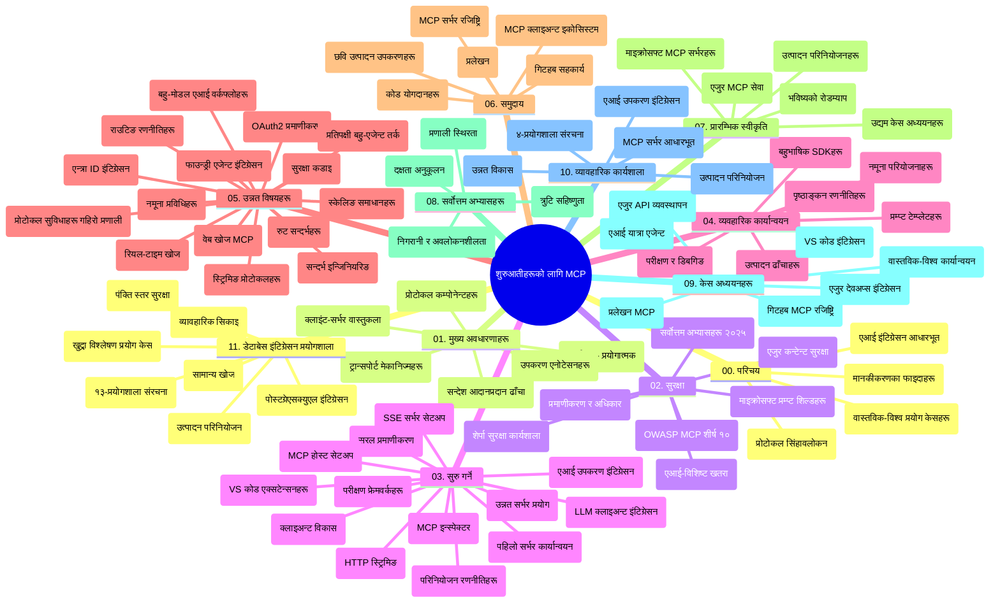

# प्रारम्भकर्ताहरूका लागि मोडेल सन्दर्भ प्रोटोकल (MCP) - अध्ययन गाइड

यस अध्ययन गाइडले "प्रारम्भकर्ताहरूका लागि मोडेल सन्दर्भ प्रोटोकल (MCP)" पाठ्यक्रमका लागि रिपोजिटरी संरचना र सामग्री को एक सिंहावलोकन प्रदान गर्छ। रिपोजिटरीलाई दक्षतापूर्वक नेभिगेट गर्न र उपलब्ध स्रोतहरूको अधिकतम उपयोग गर्न यो गाइड प्रयोग गर्नुहोस्।

## रिपोजिटरी सिंहावलोकन

मोडेल सन्दर्भ प्रोटोकल (MCP) एआई मोडेल र क्लाइन्ट अनुप्रयोगहरू बीच अन्तरक्रियाहरूको लागि एक मानकीकृत फ्रेमवर्क हो। सुरुमा एनथ्रोपिकद्वारा सिर्जना गरिएको, MCP अब आधिकारिक GitHub संगठन मार्फत व्यापक MCP समुदायद्वारा व्यवस्थापन हुन्छ। यस रिपोजिटरीले सी#, जावा, जाभास्क्रिप्ट, पाइथन र टाइपस्क्रिप्टमा व्यावहारिक कोड उदाहरणहरूसहितको व्यापक पाठ्यक्रम प्रदान गर्छ, जुन एआई विकासकर्ता, प्रणाली वास्तुकार र सफ्टवेयर इन्जिनियरहरूका लागि डिजाइन गरिएको हो।

## दृश्य पाठ्यक्रम नक्सा

## रिपोजिटरी संरचना

रिपोजिटरी एघार मुख्य भागहरूमा व्यवस्थित छ, प्रत्येकले MCP का फरक पक्षहरूमा केन्द्रित छ:

1. **परिचय (00-Introduction/)**
   - मोडेल सन्दर्भ प्रोटोकलको सिंहावलोकन
   - एआई पाइपलाइनहरूमा मानकीकरण किन महत्वपूर्ण छ
   - व्यावहारिक उपयोग केसहरू र लाभहरू

2. **मूल अवधारणाहरू (01-CoreConcepts/)**
   - क्लाइन्ट-सर्भर वास्तुकला
   - प्रमुख प्रोटोकल कम्पोनेन्टहरू
   - MCP मा सन्देश पठाउने ढाँचाहरू

3. **सुरक्षा (02-Security/)**
   - MCP-आधारित प्रणालीहरूमा सुरक्षा खतरा
   - कार्यान्वयनहरूको सुरक्षाका लागि उत्तम अभ्यासहरू
   - प्रमाणीकरण र अधिकार रणनीतिहरू
   - **व्यापक सुरक्षा दस्तावेजहरू**:
     - MCP सुरक्षा उत्तम अभ्यास 2025
     - Azure सामग्री सुरक्षा कार्यान्वयन गाइड
     - MCP सुरक्षा नियन्त्रण र प्रविधिहरू
     - MCP उत्तम अभ्यास छिटो सन्दर्भ
   - **प्रमुख सुरक्षा विषयहरू**:
     - प्रॉम्प्ट इन्जेक्शन र उपकरण विषाक्तता आक्रमणहरू
     - सेसन हाइज्याकिंग र भ्रमित डेप्युटी समस्याहरू
     - टोकन पासथ्रू जोखिमहरू
     - अत्यधिक अनुमतिहरू र पहुँच नियन्त्रण
     - एआई कम्पोनेन्टहरूको आपूर्ति श्रृंखला सुरक्षा
     - Microsoft प्रॉम्प्ट शिल्डको एकीकरण

4. **थालनी (03-GettingStarted/)**
   - वातावरण सेटअप र कन्फिगरेसन
   - आधारभूत MCP सर्भर र क्लाइन्ट सिर्जना
   - अवस्थित अनुप्रयोगहरूसँग एकीकरण
   - समावेश खण्डहरू:
     - पहिलो सर्भर कार्यान्वयन
     - क्लाइन्ट विकास
     - LLM क्लाइन्ट एकीकरण
     - VS कोड एकीकरण
     - सर्भर-सेन्ट इभेन्ट (SSE) सर्भर
     - उन्नत सर्भर प्रयोग
     - HTTP स्ट्रिमिङ
     - AI टूलकिट एकीकरण
     - परीक्षण रणनीतिहरू
     - परिनियोजन निर्देशनहरू

5. **व्यावहारिक कार्यान्वयन (04-PracticalImplementation/)**
   - विभिन्न प्रोग्रामिङ भाषामा SDK प्रयोग
   - डिबगिङ, परीक्षण र प्रमाणीकरण प्रविधिहरू
   - पुन: प्रयोगयोग्य प्रॉम्प्ट टेम्पलेटहरू र वर्कफ्लोहरू तयार पार्ने
   - कार्यान्वयन उदाहरण सहित नमूना परियोजनाहरू

6. **उन्नत विषयहरू (05-AdvancedTopics/)**
   - सन्दर्भ इन्जिनियरिङ प्रविधिहरू
   - फाउन्ड्री एजेन्ट एकीकरण
   - बहु-मोडल एआई वर्कफ्लोहरू
   - OAuth2 प्रमाणीकरण डेमोहरू
   - वास्तविक-समय खोज क्षमताहरू
   - वास्तविक-समय स्ट्रिमिङ
   - रुट सन्दर्भ कार्यान्वयनहरू
   - राउटिङ रणनीतिहरू
   - स्याम्प्लिङ प्रविधिहरू
   - स्केलिङ उपायहरू
   - सुरक्षा विचारहरू
   - एन्त्र ID सुरक्षा एकीकरण
   - वेब खोज एकीकरण
   - विपक्षात्मक बहु-एजेन्ट तर्क (बहस ढाँचाहरू)

7. **समुदाय योगदानहरू (06-CommunityContributions/)**
   - कोड र दस्तावेजीकरणमा कसरी योगदान गर्ने
   - GitHub मार्फत सहकार्य
   - समुदाय-चालित सुधार र प्रतिक्रिया
   - विभिन्न MCP क्लाइन्टहरू प्रयोग (Claude Desktop, Cline, VSCode)
   - लोकप्रिय MCP सर्भरहरू सँग काम गर्ने, जसमा छवि सिर्जना समावेश छ

8. **प्रारम्भिक अंगीकारबाट सिकाइ (07-LessonsfromEarlyAdoption/)**
   - वास्तविक विश्व कार्यान्वयन र सफलताका कथाहरू
   - MCP-आधारित समाधानहरू निर्माण र परिनियोजन
   - प्रवृत्ति र भविष्यको रोडम्याप
   - **Microsoft MCP सर्भरहरू गाइड**: उत्पादन-तयार Microsoft MCP सर्भरहरूको समग्र मार्गदर्शन, जसमा समावेश छन्:
     - Microsoft Learn Docs MCP सर्भर
     - Azure MCP सर्भर (१५+ विशेष कनेक्टरहरू)
     - GitHub MCP सर्भर
     - Azure DevOps MCP सर्भर
     - MarkItDown MCP सर्भर
     - SQL Server MCP सर्भर
     - Playwright MCP सर्भर
     - Dev Box MCP सर्भर
     - Azure AI Foundry MCP सर्भर
     - Microsoft 365 Agents Toolkit MCP सर्भर

9. **उत्तम अभ्यासहरू (08-BestPractices/)**
   - प्रदर्शन ट्युनिङ र अनुकूलन
   - दोष-रोधक MCP प्रणाली डिजाइन
   - परीक्षण र लचिलोपन रणनीतिहरू

10. **केस अध्ययनहरू (09-CaseStudy/)**
    - MCP को बहुमुखीताको प्रदर्शन गर्ने सात व्यापक केस अध्ययनहरू:
    - **Azure AI यात्रा एजेन्टहरू**: Azure OpenAI र AI खोजसँग बहु-एजेन्ट समन्वय
    - **Azure DevOps एकीकरण**: YouTube डेटा अद्यावधिकहरूसँग वर्कफ्लो प्रक्रिया स्वचालन
    - **वास्तविक-समय दस्तावेज पुनःप्राप्ति**: स्ट्रिमिङ HTTP सहित पाइथन कन्सोल क्लाइन्ट
    - **इन्टरऐक्टिभ अध्ययन योजना जेनेरेटर**: Chainlit वेब एपसँग संवादात्मक AI
    - **इन-एडिटर दस्तावेजीकरण**: GitHub Copilot वर्कफ्लोसहित VS Code एकीकरण
    - **Azure API व्यवस्थापन**: MCP सर्भर सिर्जना सहित एन्त्रप्राइज API एकीकरण
    - **GitHub MCP रजिस्ट्री**: इकोसिस्टम विकास र एजेन्टिक एकीकरण प्लेटफर्म
    - एन्त्रप्राइज एकीकरण, विकासकर्ता उत्पादकतामा र इकोसिस्टम विकासमा कार्यान्वयन उदाहरणहरू

11. **व्यावहारिक कार्यशाला (10-StreamliningAIWorkflowsBuildingAnMCPServerWithAIToolkit/)**
    - MCP र AI टूलकिट संयोजनसँग व्यावहारिक व्यापक कार्यशाला
    - वास्तविक संसारका टूलहरूसँग एआई मोडेलहरू पुल गर्ने बुद्धिमान अनुप्रयोगहरू निर्माण
    - आधारभूत, कस्टम सर्भर विकास र उत्पादन परिनियोजन रणनीतिहरू समेट्ने व्यावहारिक मोड्युलहरू
    - **लैब संरचना**:
      - लैब 1: MCP सर्भर आधारभूत
      - लैब 2: उन्नत MCP सर्भर विकास
      - लैब 3: AI टूलकिट एकीकरण
      - लैब 4: उत्पादन परिनियोजन र स्केलिंग
    - चरण-दर-चरण निर्देशन सहित लैब आधारित सिकाइ प्रविधि

12. **MCP सर्भर डाटाबेस इंटीग्रेशन लैबहरू (11-MCPServerHandsOnLabs/)**
    - उत्पादन-तयार MCP सर्भरहरू PostgreSQL एकीकरणका साथ निर्माण गर्ने समग्र १३-लैब सिकाइ मार्ग
    - Zava Retail प्रयोग केस प्रयोग गरी वास्तविक-विश्व खुद्रा विश्लेषण कार्यान्वयन
    - **एन्त्रप्राइज-ग्रेड ढाँचाहरू**, जसमा रो लेवल सुरक्षा (RLS), सिम्यान्टिक खोज, र बहु-टेनेंट डाटा पहुँच समावेश छ
    - **पूर्ण लैब संरचना**:
      - **लैब 00-03: आधारहरू** - परिचय, वास्तुकला, सुरक्षा, वातावरण सेटअप
      - **लैब 04-06: MCP सर्भर निर्माण** - डाटाबेस डिजाइन, MCP सर्भर कार्यान्वयन, टूल विकास
      - **लैब 07-09: उन्नत सुविधाहरू** - सिम्यान्टिक खोज, परीक्षण र डिबगिङ, VS कोड एकीकरण
      - **लैब 10-12: उत्पादन र उत्तम अभ्यासहरू** - परिनियोजन, अनुगमन, अनुकूलन
    - **प्रविधिहरू समेटिएको**: FastMCP फ्रेमवर्क, PostgreSQL, Azure OpenAI, Azure कन्टेनर एप्स, एप्लिकेशन इनसाइट्स
    - **सिकाइ परिणामहरू**: उत्पादन-तयार MCP सर्भरहरू, डाटाबेस एकीकरण ढाँचाहरू, एआई-संचालित विश्लेषण, एन्त्रप्राइज सुरक्षा

## अतिरिक्त स्रोतहरू

रिपोजिटरीले समर्थन गर्ने स्रोतहरू समावेश गर्दछ:

- **तस्बिर फोल्डर**: पाठ्यक्रमभर प्रयोग भएका डायग्राम र चित्रणहरू
- **अनुवादहरू**: दस्तावेजहरूको स्वचालित बहुभाषिक अनुवाद समर्थन
- **अधिकृत MCP स्रोतहरू**:
  - [MCP Documentation](https://modelcontextprotocol.io/)
  - [MCP Specification](https://spec.modelcontextprotocol.io/)
  - [MCP GitHub Repository](https://github.com/modelcontextprotocol)

## यस रिपोजिटरी कसरी प्रयोग गर्ने

1. **क्रमिक सिकाइ**: संरचित सिकाइ अनुभवको लागि अध्यायहरूलाई क्रममा (00 देखि 11 सम्म) पालना गर्नुहोस्।
2. **भाषा-विशिष्ट फोकस**: तपाईंले रुचाएको प्रोग्रामिङ भाषामा कार्यान्वयनहरूको लागि नमूना डिरेक्टरीहरू अन्वेषण गर्नुहोस्।
3. **व्यावहारिक कार्यान्वयन**: तपाईंको वातावरण सेटअप गर्न र पहिलो MCP सर्भर र क्लाइन्ट सिर्जना गर्न "थालनी" खण्डबाट सुरु गर्नुहोस्।
4. **उन्नत अन्वेषण**: आधारभूत बुझेपछि, उन्नत विषयहरूमा गहिराइमा जानुहोस्।
5. **समुदाय सहभागिता**: विशेषज्ञ र साथि विकासकर्तासँग जडान हुन GitHub छलफल र Discord च्यानलहरूमा MCP समुदायमा सामेल हुनुहोस्।

## MCP क्लाइन्ट र उपकरणहरू

पाठ्यक्रमले विभिन्न MCP क्लाइन्ट र उपकरणहरू समेट्छ:

1. **अधिकृत क्लाइन्टहरू**:
   - Visual Studio Code
   - Visual Studio Code मा MCP
   - Claude Desktop
   - VSCode मा Claude
   - Claude API

2. **समुदाय क्लाइन्टहरू**:
   - Cline (टर्मिनल आधारित)
   - Cursor (कोड सम्पादक)
   - ChatMCP
   - Windsurf

3. **MCP व्यवस्थापन उपकरणहरू**:
   - MCP CLI
   - MCP Manager
   - MCP Linker
   - MCP Router

## लोकप्रिय MCP सर्भरहरू

रिपोजिटरीले विभिन्न MCP सर्भरहरू परिचय गराउँछ, जसमा समावेश छन्:

1. **अधिकृत Microsoft MCP सर्भरहरू**:
   - Microsoft Learn Docs MCP सर्भर
   - Azure MCP सर्भर (१५+ विशेष कनेक्टरहरू)
   - GitHub MCP सर्भर
   - Azure DevOps MCP सर्भर
   - MarkItDown MCP सर्भर
   - SQL Server MCP सर्भर
   - Playwright MCP सर्भर
   - Dev Box MCP सर्भर
   - Azure AI Foundry MCP सर्भर
   - Microsoft 365 Agents Toolkit MCP सर्भर

2. **अधिकृत रिफरेन्स सर्भरहरू**:
   - फाइलसिस्टम
   - Fetch
   - मेमोरी
   - सिक्वेन्सियल थिंकिंग

3. **छवि सिर्जना**:
   - Azure OpenAI DALL-E 3
   - Stable Diffusion WebUI
   - Replicate

4. **विकास उपकरणहरू**:
   - Git MCP
   - टर्मिनल नियन्त्रण
   - कोड सहायक

5. **विशेषीकृत सर्भरहरू**:
   - Salesforce
   - Microsoft Teams
   - Jira र Confluence

## योगदान

यस रिपोजिटरीले समुदायबाट योगदानहरूलाई स्वागत गर्दछ। MCP इकोसिस्टममा प्रभावकारी योगदान कसरी गर्ने विषयमा मार्गदर्शनको लागि समुदाय योगदानहरू खण्ड हेर्नुहोस्।

----

*यो अध्ययन गाइड अन्तिम पटक ५ फेब्रुअरी २०२६ मा अद्यावधिक गरिएको हो, जुन MCP विनिर्देशन २०२५-११-२५ को नवीनतम संस्करण प्रतिबिम्बित गर्दछ र उक्त मितिसम्मको रिपोजिटरीको सिंहावलोकन प्रदान गर्दछ। यस मितिपछि रिपोजिटरी सामग्री अद्यावधिक हुन सक्छ।*

---

<!-- CO-OP TRANSLATOR DISCLAIMER START -->
**अस्वीकरण**:  
यो दस्तावेज़ AI अनुवाद सेवा [Co-op Translator](https://github.com/Azure/co-op-translator) को प्रयोग गरी अनुवाद गरिएको हो। हामी सटीकताको लागि प्रयास गर्छौं, तर कृपया ध्यान दिनुहोस् कि स्वचालित अनुवादमा त्रुटिहरू वा अशुद्धिहरू हुन सक्नेछ। मूल दस्तावेज आफ्नै मूल भाषामा आधिकारिक स्रोतको रूपमा मान्नुपर्दछ। महत्वपूर्ण जानकारीका लागि, पेशेवर मानवीय अनुवाद सिफारिस गरिन्छ। हामी यस अनुवादको प्रयोगबाट उत्पन्न कुनै पनि गलतफहमी वा गलत व्याख्याका लागि उत्तरदायी छैनौं।
<!-- CO-OP TRANSLATOR DISCLAIMER END -->