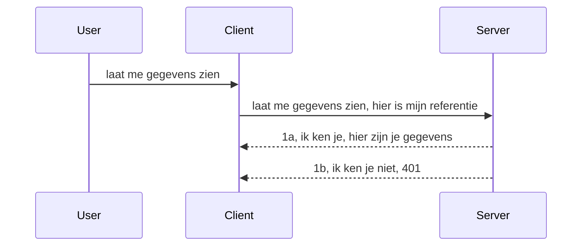

# Eenvoudige authenticatie

MCP SDK's ondersteunen het gebruik van OAuth 2.1 wat eerlijk gezegd een behoorlijk ingewikkeld proces is met concepten zoals auth-server, resource-server, het versturen van inloggegevens, het verkrijgen van een code, het inwisselen van de code voor een bearer-token totdat je uiteindelijk je resourcedata kunt verkrijgen. Als je niet gewend bent aan OAuth, wat een geweldig iets is om te implementeren, is het een goed idee om te beginnen met een basisniveau van authenticatie en op te bouwen naar betere en betere beveiliging. Daarom bestaat dit hoofdstuk, om je op te bouwen naar meer geavanceerde authenticatie.

## Authenticatie, wat bedoelen we?

Auth is een afkorting van authenticatie en autorisatie. Het idee is dat we twee dingen moeten doen:

- **Authenticatie**, wat het proces is om te achterhalen of we een persoon binnenlaten in ons huis, dat ze het recht hebben om "hier" te zijn, dat wil zeggen toegang hebben tot onze resource-server waar onze MCP Server-functies zijn gevestigd.
- **Autorisatie**, is het proces om te bepalen of een gebruiker toegang zou moeten hebben tot deze specifieke bronnen waarnaar ze vragen, bijvoorbeeld deze orders of deze producten, of of ze alleen de inhoud mogen lezen maar niet mogen verwijderen als een ander voorbeeld.

## Inloggegevens: hoe we het systeem vertellen wie we zijn

Nou, de meeste webontwikkelaars beginnen te denken in termen van het verstrekken van een inloggegeven aan de server, meestal een geheim dat zegt of ze hier mogen zijn "Authenticatie". Deze inloggegeven is meestal een base64-gecodeerde versie van een gebruikersnaam en wachtwoord of een API-sleutel die een specifieke gebruiker uniek identificeert.

Dit houdt in dat het wordt verstuurd via een header genaamd "Authorization" zoals volgt:

```json
{ "Authorization": "secret123" }
```

Dit wordt meestal aangeduid als basis authenticatie. Hoe de algehele flow daarna werkt, is op de volgende manier:


Nu we begrijpen hoe het werkt vanuit een flow-standpunt, hoe implementeren we het dan? Nou, de meeste webservers hebben een concept genaamd middleware, een stuk code dat draait als onderdeel van het verzoek dat inloggegevens kan verifiëren, en als de inloggegevens geldig zijn, kan het verzoek doorgaan. Als het verzoek geen geldige inloggegevens heeft, krijg je een auth-fout. Laten we kijken hoe dit geïmplementeerd kan worden:

**Python**

```python
class AuthMiddleware(BaseHTTPMiddleware):
    async def dispatch(self, request, call_next):

        has_header = request.headers.get("Authorization")
        if not has_header:
            print("-> Missing Authorization header!")
            return Response(status_code=401, content="Unauthorized")

        if not valid_token(has_header):
            print("-> Invalid token!")
            return Response(status_code=403, content="Forbidden")

        print("Valid token, proceeding...")
       
        response = await call_next(request)
        # voeg eventuele klantkoppen toe of wijzig op enige wijze de reactie
        return response


starlette_app.add_middleware(CustomHeaderMiddleware)
```

Hier hebben we:

- Een middleware gemaakt genaamd `AuthMiddleware` waar de `dispatch` methode door de webserver wordt aangeroepen.
- De middleware toegevoegd aan de webserver:

    ```python
    starlette_app.add_middleware(AuthMiddleware)
    ```

- Validatielogica geschreven die controleert of de Authorization-header aanwezig is en of het verzonden geheim geldig is:

    ```python
    has_header = request.headers.get("Authorization")
    if not has_header:
        print("-> Missing Authorization header!")
        return Response(status_code=401, content="Unauthorized")

    if not valid_token(has_header):
        print("-> Invalid token!")
        return Response(status_code=403, content="Forbidden")
    ```

    als het geheim aanwezig en geldig is, laten we het verzoek doorgaan door `call_next` aan te roepen en de response te retourneren.

    ```python
    response = await call_next(request)
    # voeg eventuele klantkoppen toe of wijzig op een bepaalde manier de respons
    return response
    ```

Hoe het werkt is dat als een webverzoek naar de server wordt gedaan, de middleware zal worden aangeroepen en, gegeven de implementatie, het verzoek óf doorgelaten wordt óf er een fout wordt teruggegeven die aangeeft dat de client niet mag doorgaan.

**TypeScript**

Hier maken we een middleware met het populaire framework Express en onderscheppen het verzoek voordat het de MCP Server bereikt. Hier is de code daarvoor:

```typescript
function isValid(secret) {
    return secret === "secret123";
}

app.use((req, res, next) => {
    // 1. Autorisatieheader aanwezig?
    if(!req.headers["Authorization"]) {
        res.status(401).send('Unauthorized');
    }
    
    let token = req.headers["Authorization"];

    // 2. Controleer geldigheid.
    if(!isValid(token)) {
        res.status(403).send('Forbidden');
    }

   
    console.log('Middleware executed');
    // 3. Geeft het verzoek door aan de volgende stap in de verzoekpipeline.
    next();
});
```

In deze code:

1. Controleren we of de Authorization-header überhaupt aanwezig is, zo niet, sturen we een 401-fout.
2. Controleren we of de inloggegeven/token geldig is, zo niet, sturen we een 403-fout.
3. Tenslotte geven we het verzoek door in de request-pijplijn en retourneren de gevraagde resource.

## Oefening: Implementeer authenticatie

Laten we onze kennis toepassen en proberen te implementeren. Hier is het plan:

Server

- Maak een webserver en MCP-instantie aan.
- Implementeer een middleware voor de server.

Client

- Verstuur een webverzoek met inloggegeven via header.

### -1- Maak een webserver en MCP-instantie aan

In onze eerste stap moeten we een webserver-instantie en de MCP Server maken.

**Python**

Hier maken we een MCP server-instantie, maken we een starlette webapp en hosten deze met uvicorn.

```python
# MCP-server aan het maken

app = FastMCP(
    name="MCP Resource Server",
    instructions="Resource Server that validates tokens via Authorization Server introspection",
    host=settings["host"],
    port=settings["port"],
    debug=True
)

# starlette webapp aan het maken
starlette_app = app.streamable_http_app()

# app serveren via uvicorn
async def run(starlette_app):
    import uvicorn
    config = uvicorn.Config(
            starlette_app,
            host=app.settings.host,
            port=app.settings.port,
            log_level=app.settings.log_level.lower(),
        )
    server = uvicorn.Server(config)
    await server.serve()

run(starlette_app)
```

In deze code:

- Maken we de MCP Server aan.
- Construeren we de starlette webapp vanaf de MCP Server, `app.streamable_http_app()`.
- Host en serveren we de webapp met uvicorn via `server.serve()`.

**TypeScript**

Hier maken we een MCP Server-instantie.

```typescript
const server = new McpServer({
      name: "example-server",
      version: "1.0.0"
    });

    // ... stel serverbronnen, hulpmiddelen en prompts in ...
```

Deze MCP Server creatie zal moeten gebeuren binnen onze POST /mcp route-definitie, dus laten we de bovenstaande code verplaatsen als volgt:

```typescript
import express from "express";
import { randomUUID } from "node:crypto";
import { McpServer } from "@modelcontextprotocol/sdk/server/mcp.js";
import { StreamableHTTPServerTransport } from "@modelcontextprotocol/sdk/server/streamableHttp.js";
import { isInitializeRequest } from "@modelcontextprotocol/sdk/types.js"

const app = express();
app.use(express.json());

// Kaart om transporten op te slaan per sessie-ID
const transports: { [sessionId: string]: StreamableHTTPServerTransport } = {};

// Verwerk POST-verzoeken voor communicatie van client naar server
app.post('/mcp', async (req, res) => {
  // Controleer op bestaande sessie-ID
  const sessionId = req.headers['mcp-session-id'] as string | undefined;
  let transport: StreamableHTTPServerTransport;

  if (sessionId && transports[sessionId]) {
    // Hergebruik bestaand transport
    transport = transports[sessionId];
  } else if (!sessionId && isInitializeRequest(req.body)) {
    // Nieuw initialisatieverzoek
    transport = new StreamableHTTPServerTransport({
      sessionIdGenerator: () => randomUUID(),
      onsessioninitialized: (sessionId) => {
        // Sla het transport op per sessie-ID
        transports[sessionId] = transport;
      },
      // DNS-rebindingbescherming is standaard uitgeschakeld voor achterwaartse compatibiliteit. Als u deze server lokaal draait
      // zorg er dan voor dat u instelt:
      // enableDnsRebindingProtection: true,
      // allowedHosts: ['127.0.0.1'],
    });

    // Ruim het transport op wanneer gesloten
    transport.onclose = () => {
      if (transport.sessionId) {
        delete transports[transport.sessionId];
      }
    };
    const server = new McpServer({
      name: "example-server",
      version: "1.0.0"
    });

    // ... stel serverbronnen, hulpmiddelen en prompts in ...

    // Verbinden met de MCP-server
    await server.connect(transport);
  } else {
    // Ongeldig verzoek
    res.status(400).json({
      jsonrpc: '2.0',
      error: {
        code: -32000,
        message: 'Bad Request: No valid session ID provided',
      },
      id: null,
    });
    return;
  }

  // Verwerk het verzoek
  await transport.handleRequest(req, res, req.body);
});

// Herbruikbare handler voor GET- en DELETE-verzoeken
const handleSessionRequest = async (req: express.Request, res: express.Response) => {
  const sessionId = req.headers['mcp-session-id'] as string | undefined;
  if (!sessionId || !transports[sessionId]) {
    res.status(400).send('Invalid or missing session ID');
    return;
  }
  
  const transport = transports[sessionId];
  await transport.handleRequest(req, res);
};

// Verwerk GET-verzoeken voor server-naar-clientmeldingen via SSE
app.get('/mcp', handleSessionRequest);

// Verwerk DELETE-verzoeken voor sessiebeëindiging
app.delete('/mcp', handleSessionRequest);

app.listen(3000);
```

Nu zie je hoe de creatie van de MCP Server naar binnen `app.post("/mcp")` is verplaatst.

Laten we doorgaan naar de volgende stap van het maken van de middleware zodat we het binnenkomende inloggegeven kunnen valideren.

### -2- Implementeer een middleware voor de server

Laten we nu naar het middleware-gedeelte gaan. Hier maken we een middleware die zoekt naar een inloggegeven in de `Authorization` header en deze valideert. Als het acceptabel is, gaat het verzoek door om te doen wat het moet doen (bijv. tools tonen, een resource lezen of welke MCP-functionaliteit de client ook vroeg).

**Python**

Om de middleware te maken, moeten we een klasse maken die erft van `BaseHTTPMiddleware`. Er zijn twee interessante delen:

- Het verzoek `request`, waar we de header-informatie uit lezen.
- `call_next`, de callback die we moeten aanroepen als de client een inloggegeven heeft meegebracht die we accepteren.

Eerst moeten we het geval afhandelen als de `Authorization` header ontbreekt:

```python
has_header = request.headers.get("Authorization")

# geen koptekst aanwezig, falen met 401, anders doorgaan.
if not has_header:
    print("-> Missing Authorization header!")
    return Response(status_code=401, content="Unauthorized")
```

Hier sturen we een 401 unauthorized bericht omdat de client faalt in authenticatie.

Vervolgens, als een inloggegeven is ingediend, moeten we de geldigheid controleren zoals volgt:

```python
 if not valid_token(has_header):
    print("-> Invalid token!")
    return Response(status_code=403, content="Forbidden")
```

Let op hoe we hierboven een 403 forbidden bericht sturen. Laten we de volledige middleware hieronder zien die alles implementeert wat we hierboven noemden:

```python
class AuthMiddleware(BaseHTTPMiddleware):
    async def dispatch(self, request, call_next):

        has_header = request.headers.get("Authorization")
        if not has_header:
            print("-> Missing Authorization header!")
            return Response(status_code=401, content="Unauthorized")

        if not valid_token(has_header):
            print("-> Invalid token!")
            return Response(status_code=403, content="Forbidden")

        print("Valid token, proceeding...")
        print(f"-> Received {request.method} {request.url}")
        response = await call_next(request)
        response.headers['Custom'] = 'Example'
        return response

```

Geweldig, maar hoe zit het met de functie `valid_token`? Hier is die hieronder:

```python
# NIET gebruiken voor productie - verbeter het !!
def valid_token(token: str) -> bool:
    # verwijder de "Bearer " voorvoegsel
    if token.startswith("Bearer "):
        token = token[7:]
        return token == "secret-token"
    return False
```

Dit kan uiteraard worden verbeterd.

BELANGRIJK: Je zou NOOIT geheimen zoals deze in code moeten hebben. Je zou idealiter de waarde moeten ophalen uit een databron of van een IDP (identity service provider) of beter nog, de validatie door de IDP laten uitvoeren.

**TypeScript**

Om dit met Express te implementeren, moeten we de `use` methode aanroepen die middleware-functies accepteert.

We moeten:

- Interacteren met de request variabele om de meegegeven inloggegeven in de `Authorization` property te controleren.
- De inloggegeven valideren, en indien geldig, het verzoek door laten gaan zodat de MCP-aanvraag van de client kan doen wat die moet doen (bijv. tools tonen, resource lezen of iets anders gerelateerd aan MCP).

Hier controleren we of de `Authorization` header aanwezig is, en als hij dat niet is, stoppen we het verzoek:

```typescript
if(!req.headers["authorization"]) {
    res.status(401).send('Unauthorized');
    return;
}
```

Als de header niet wordt meegestuurd, krijg je een 401.

Vervolgens controleren we of de inloggegeven geldig is, zo niet, stoppen we opnieuw het verzoek maar met een iets andere boodschap:

```typescript
if(!isValid(token)) {
    res.status(403).send('Forbidden');
    return;
} 
```

Let op hoe je nu een 403-fout krijgt.

Hier is de volledige code:

```typescript
app.use((req, res, next) => {
    console.log('Request received:', req.method, req.url, req.headers);
    console.log('Headers:', req.headers["authorization"]);
    if(!req.headers["authorization"]) {
        res.status(401).send('Unauthorized');
        return;
    }
    
    let token = req.headers["authorization"];

    if(!isValid(token)) {
        res.status(403).send('Forbidden');
        return;
    }  

    console.log('Middleware executed');
    next();
});
```

We hebben de webserver zo ingesteld dat een middleware wordt geaccepteerd om de inloggegeven te controleren die de client hopelijk meestuurt. Wat te denken van de client zelf?

### -3- Verstuur webverzoek met inloggegeven via header

We moeten ervoor zorgen dat de client de inloggegeven meezendt via de header. Omdat we een MCP-client gaan gebruiken, moeten we uitzoeken hoe dat gedaan wordt.

**Python**

Voor de client moeten we een header doorgeven met onze inloggegeven zo:

```python
# Hardeer de waarde niet, bewaar deze minimaal in een omgevingsvariabele of een veiliger opslagmedium
token = "secret-token"

async with streamablehttp_client(
        url = f"http://localhost:{port}/mcp",
        headers = {"Authorization": f"Bearer {token}"}
    ) as (
        read_stream,
        write_stream,
        session_callback,
    ):
        async with ClientSession(
            read_stream,
            write_stream
        ) as session:
            await session.initialize()
      
            # TODO, wat je in de client gedaan wilt hebben, bijv. lijst gereedschap, oproep gereedschap etc.
```

Let op hoe we de `headers` eigenschap vullen zoals `headers = {"Authorization": f"Bearer {token}"}`.

**TypeScript**

We kunnen dit in twee stappen oplossen:

1. Maak een configuratieobject aan met onze inloggegeven.
2. Geef het configuratieobject door aan de transportlaag.

```typescript

// Gebruik de waarde niet hardgecodeerd zoals hier getoond. Heb het minimaal als een omgevingsvariabele en gebruik iets als dotenv (in dev-modus).
let token = "secret123"

// definieer een client transportoptie-object
let options: StreamableHTTPClientTransportOptions = {
  sessionId: sessionId,
  requestInit: {
    headers: {
      "Authorization": "secret123"
    }
  }
};

// geef het opties-object door aan de transportlaag
async function main() {
   const transport = new StreamableHTTPClientTransport(
      new URL(serverUrl),
      options
   );
```

Hier zie je hoe we eerst een `options` object hebben gemaakt en onze headers onder de `requestInit` eigenschap hebben geplaatst.

BELANGRIJK: Hoe verbeteren we dit vanuit hier? Nou, de huidige implementatie kent een paar problemen. Ten eerste is het behoorlijk riskant om op deze manier een inloggegeven door te geven tenzij je tenminste HTTPS gebruikt. Zelfs dan kan de inloggegeven gestolen worden, dus je hebt een systeem nodig waarmee je eenvoudig het token kunt intrekken en additionele controles kunt doen zoals van waar in de wereld het afkomstig is, gebeurt het verzoek te vaak (bot-achtig gedrag), kortom, er zijn vele zorgen.

Het moet wel gezegd worden, voor zeer eenvoudige API's waar je niet wilt dat iemand je API aanroept zonder authenticatie is wat we hier hebben een goed begin.

Dat gezegd hebbende, laten we proberen de beveiliging wat aan te scherpen door een gestandaardiseerd formaat te gebruiken zoals JSON Web Token, ook bekend als JWT of "JOT" tokens.

## JSON Web Tokens, JWT

We proberen dus de dingen te verbeteren ten opzichte van het versturen van hele eenvoudige inloggegevens. Wat zijn de directe verbeteringen die we krijgen door JWT te adopteren?

- **Beveiligingsverbeteringen**. Bij basis auth stuur je de gebruikersnaam en wachtwoord als een base64-gecodeerd token (of je stuurt een API-sleutel) keer op keer mee, wat het risico verhoogt. Met JWT stuur je je gebruikersnaam en wachtwoord en krijg je een token terug, dat ook tijdgebonden is en dus verloopt. JWT laat je gemakkelijk fijne toegangscontrole toepassen met rollen, scopes en permissies.
- **Statelessness en schaalbaarheid**. JWT's zijn self-contained, ze dragen alle gebruikersinformatie mee en elimineren de noodzaak om sessies server-side op te slaan. Token kunnen ook lokaal geverifieerd worden.
- **Interoperabiliteit en federatie**. JWT's zijn het middelpunt van Open ID Connect en worden gebruikt met bekende identity providers zoals Entra ID, Google Identity en Auth0. Ze maken ook gebruik van single sign on en meer mogelijk, wat het enterprise-grade maakt.
- **Modulariteit en flexibiliteit**. JWT's kunnen ook worden gebruikt met API Gateways zoals Azure API Management, NGINX en anderen. Ze ondersteunen gebruiksscenario's voor authenticatie en server-tot-server communicatie inclusief impersonatie en delegatie-scenario's.
- **Prestaties en caching**. JWT's kunnen gecachet worden na decodering wat de noodzaak voor parsing vermindert. Dit helpt speciaal bij apps met veel verkeer omdat het doorvoer verbetert en de belasting op je infrastructuur vermindert.
- **Geavanceerde eigenschappen**. Het ondersteunt ook introspectie (validiteit checken op server) en intrekking (een token ongeldig maken).

Met al deze voordelen, laten we kijken hoe we onze implementatie naar het volgende niveau kunnen tillen.

## Van basic auth naar JWT

Dus, de veranderingen die we op hoofdlijnen moeten maken zijn:

- **Leren een JWT token te construeren** en het klaar te maken om van client naar server verstuurd te worden.
- **Een JWT token valideren**, en indien geldig, de client toegang geven tot onze resources.
- **Token veilig opslaan**. Hoe we dit token opslaan.
- **Routes beschermen**. We moeten de routes beschermen, in ons geval moeten we routes en specifieke MCP-functies beschermen.
- **Refresh tokens toevoegen**. Zorg dat we tokens maken die kortdurend zijn, maar refresh tokens die langdurig zijn en gebruikt kunnen worden om nieuwe tokens te verkrijgen als ze verlopen. Zorg ook voor een refresh endpoint en een rotatiestrategie.

### -1- Construeer een JWT token

Een JWT token heeft eerst en vooral de volgende onderdelen:

- **header**, de gebruikte algoritme en token type.
- **payload**, claims, zoals sub (de gebruiker of entiteit die het token vertegenwoordigt. In een auth-scenario is dit typisch de userid), exp (wanneer het verloopt), role (de rol)
- **signature**, ondertekend met een geheim of private key.

Hiervoor moeten we de header, payload en de gecodeerde token construeren.

**Python**

```python

import jwt
import jwt
from jwt.exceptions import ExpiredSignatureError, InvalidTokenError
import datetime

# Geheime sleutel gebruikt om de JWT te ondertekenen
secret_key = 'your-secret-key'

header = {
    "alg": "HS256",
    "typ": "JWT"
}

# de gebruikersinformatie en de claims en vervaltijd
payload = {
    "sub": "1234567890",               # Onderwerp (gebruikers-ID)
    "name": "User Userson",                # Aangepaste claim
    "admin": True,                     # Aangepaste claim
    "iat": datetime.datetime.utcnow(),# Uitgegeven op
    "exp": datetime.datetime.utcnow() + datetime.timedelta(hours=1)  # Vervaltijd
}

# codeer het
encoded_jwt = jwt.encode(payload, secret_key, algorithm="HS256", headers=header)
```

In bovenstaande code hebben we:

- Een header gedefinieerd met HS256 als algoritme en type JWT.
- Een payload geconstrueerd die een subject of user id bevat, een gebruikersnaam, een rol, wanneer het is uitgegeven en wanneer het verloopt, waarmee we het tijdgebonden aspect implementeren dat we eerder noemden.

**TypeScript**

Hier hebben we een paar dependencies nodig die ons helpen het JWT token te construeren.

Dependencies

```sh

npm install jsonwebtoken
npm install --save-dev @types/jsonwebtoken
```

Nu dit klaar is, laten we de header, payload maken en daarmee het gecodeerde token creëren.

```typescript
import jwt from 'jsonwebtoken';

const secretKey = 'your-secret-key'; // Gebruik omgevingsvariabelen in productie

// Definieer de payload
const payload = {
  sub: '1234567890',
  name: 'User usersson',
  admin: true,
  iat: Math.floor(Date.now() / 1000), // Uitgegeven om
  exp: Math.floor(Date.now() / 1000) + 60 * 60 // Verloopt over 1 uur
};

// Definieer de header (optioneel, jsonwebtoken stelt standaardwaarden in)
const header = {
  alg: 'HS256',
  typ: 'JWT'
};

// Maak het token aan
const token = jwt.sign(payload, secretKey, {
  algorithm: 'HS256',
  header: header
});

console.log('JWT:', token);
```

Dit token is:

Ondertekend met HS256
Geldig voor 1 uur
Bevat claims zoals sub, name, admin, iat en exp.

### -2- Valideer een token

We moeten ook een token valideren, dit moet op de server gebeuren om te verzekeren dat wat de client stuurt daadwerkelijk geldig is. Er zijn veel checks die we moeten uitvoeren, van het valideren van de structuur tot geldigheid. Je wordt ook aangemoedigd om extra controles toe te voegen om te zien of de gebruiker in je systeem staat en meer.

Om een token te valideren moeten we het decoderen zodat we het kunnen lezen en daarna beginnen met het controleren van de geldigheid:

**Python**

```python

# Decodeer en verifieer de JWT
try:
    decoded = jwt.decode(token, secret_key, algorithms=["HS256"])
    print("✅ Token is valid.")
    print("Decoded claims:")
    for key, value in decoded.items():
        print(f"  {key}: {value}")
except ExpiredSignatureError:
    print("❌ Token has expired.")
except InvalidTokenError as e:
    print(f"❌ Invalid token: {e}")

```

In deze code roepen we `jwt.decode` aan met het token, de geheime sleutel en het gekozen algoritme als input. Let op hoe we een try-catch constructie gebruiken omdat een mislukte validatie leidt tot het gooien van een fout.

**TypeScript**

Hier moeten we `jwt.verify` aanroepen om een gedecrypteerde versie van het token te krijgen die we verder kunnen analyseren. Als deze aanroep mislukt, betekent dit dat de structuur van het token incorrect is of het token niet meer geldig is.

```typescript

try {
  const decoded = jwt.verify(token, secretKey);
  console.log('Decoded Payload:', decoded);
} catch (err) {
  console.error('Token verification failed:', err);
}
```

OPMERKING: zoals eerder vermeld, moeten we extra controles uitvoeren om te verzekeren dat dit token wijst naar een gebruiker in ons systeem en dat de gebruiker de rechten heeft die het claimt te hebben.

Vervolgens kijken we naar role based access control, ook bekend als RBAC.
## Rollen-gebaseerde toegang toevoegen

Het idee is dat we willen uitdrukken dat verschillende rollen verschillende rechten hebben. Bijvoorbeeld, we veronderstellen dat een admin alles kan doen, een normale gebruiker kan lezen/schrijven en een gast alleen kan lezen. Daarom zijn hier een aantal mogelijke permissieniveaus:

- Admin.Write 
- User.Read
- Guest.Read

Laten we eens kijken hoe we zo'n controle kunnen implementeren met middleware. Middleware kan toegevoegd worden per route evenals voor alle routes.

**Python**

```python
from starlette.middleware.base import BaseHTTPMiddleware
from starlette.responses import JSONResponse
import jwt

# HEB het geheim niet in de code zoals deze, dit is alleen voor demonstratiedoeleinden. Lees het van een veilige plek.
SECRET_KEY = "your-secret-key" # Zet dit in een omgevingsvariabele
REQUIRED_PERMISSION = "User.Read"

class JWTPermissionMiddleware(BaseHTTPMiddleware):
    async def dispatch(self, request, call_next):
        auth_header = request.headers.get("Authorization")
        if not auth_header or not auth_header.startswith("Bearer "):
            return JSONResponse({"error": "Missing or invalid Authorization header"}, status_code=401)

        token = auth_header.split(" ")[1]
        try:
            decoded = jwt.decode(token, SECRET_KEY, algorithms=["HS256"])
        except jwt.ExpiredSignatureError:
            return JSONResponse({"error": "Token expired"}, status_code=401)
        except jwt.InvalidTokenError:
            return JSONResponse({"error": "Invalid token"}, status_code=401)

        permissions = decoded.get("permissions", [])
        if REQUIRED_PERMISSION not in permissions:
            return JSONResponse({"error": "Permission denied"}, status_code=403)

        request.state.user = decoded
        return await call_next(request)


```

Er zijn een paar verschillende manieren om de middleware toe te voegen zoals hieronder:

```python

# Alt 1: voeg middleware toe tijdens het construeren van de starlette-app
middleware = [
    Middleware(JWTPermissionMiddleware)
]

app = Starlette(routes=routes, middleware=middleware)

# Alt 2: voeg middleware toe nadat de starlette-app al is geconstrueerd
starlette_app.add_middleware(JWTPermissionMiddleware)

# Alt 3: voeg middleware per route toe
routes = [
    Route(
        "/mcp",
        endpoint=..., # handler
        middleware=[Middleware(JWTPermissionMiddleware)]
    )
]
```

**TypeScript**

We kunnen `app.use` gebruiken en een middleware die voor alle verzoeken zal draaien.

```typescript
app.use((req, res, next) => {
    console.log('Request received:', req.method, req.url, req.headers);
    console.log('Headers:', req.headers["authorization"]);

    // 1. Controleer of de autorisatie-header is verzonden

    if(!req.headers["authorization"]) {
        res.status(401).send('Unauthorized');
        return;
    }
    
    let token = req.headers["authorization"];

    // 2. Controleer of het token geldig is
    if(!isValid(token)) {
        res.status(403).send('Forbidden');
        return;
    }  

    // 3. Controleer of de tokengebruiker bestaat in ons systeem
    if(!isExistingUser(token)) {
        res.status(403).send('Forbidden');
        console.log("User does not exist");
        return;
    }
    console.log("User exists");

    // 4. Verifieer of het token de juiste toestemming heeft
    if(!hasScopes(token, ["User.Read"])){
        res.status(403).send('Forbidden - insufficient scopes');
    }

    console.log("User has required scopes");

    console.log('Middleware executed');
    next();
});

```

Er zijn best wat dingen die we onze middleware kunnen laten doen en die onze middleware MOET doen, namelijk:

1. Controleren of de autorisatie-header aanwezig is
2. Controleren of het token geldig is, we noemen `isValid` wat een methode is die we hebben geschreven om de integriteit en geldigheid van het JWT-token te controleren.
3. Verifiëren dat de gebruiker bestaat in ons systeem, dit moeten we controleren.

   ```typescript
    // gebruikers in DB
   const users = [
     "user1",
     "User usersson",
   ]

   function isExistingUser(token) {
     let decodedToken = verifyToken(token);

     // TODO, controleer of gebruiker bestaat in DB
     return users.includes(decodedToken?.name || "");
   }
   ```

   Bovenstaand hebben we een zeer eenvoudige lijst `users` gemaakt, die natuurlijk in een database zou moeten staan.

4. Daarnaast moeten we ook controleren of het token de juiste rechten heeft.

   ```typescript
   if(!hasScopes(token, ["User.Read"])){
        res.status(403).send('Forbidden - insufficient scopes');
   }
   ```

   In deze code hierboven van de middleware controleren we of het token de User.Read permissie bevat, zo niet dan sturen we een 403 fout. Hieronder staat de helpermethode `hasScopes`.

   ```typescript
   function hasScopes(scope: string, requiredScopes: string[]) {
     let decodedToken = verifyToken(scope);
    return requiredScopes.every(scope => decodedToken?.scopes.includes(scope));
  }
   ```

Have a think which additional checks you should be doing, but these are the absolute minimum of checks you should be doing.

Using Express as a web framework is a common choice. There are helpers library when you use JWT so you can write less code.

- `express-jwt`, helper library that provides a middleware that helps decode your token.
- `express-jwt-permissions`, this provides a middleware `guard` that helps check if a certain permission is on the token.

Here's what these libraries can look like when used:

```typescript
const express = require('express');
const jwt = require('express-jwt');
const guard = require('express-jwt-permissions')();

const app = express();
const secretKey = 'your-secret-key'; // put this in env variable

// Decode JWT and attach to req.user
app.use(jwt({ secret: secretKey, algorithms: ['HS256'] }));

// Check for User.Read permission
app.use(guard.check('User.Read'));

// multiple permissions
// app.use(guard.check(['User.Read', 'Admin.Access']));

app.get('/protected', (req, res) => {
  res.json({ message: `Welcome ${req.user.name}` });
});

// Error handler
app.use((err, req, res, next) => {
  if (err.code === 'permission_denied') {
    return res.status(403).send('Forbidden');
  }
  next(err);
});

```

Je hebt nu gezien hoe middleware kan worden gebruikt voor zowel authenticatie als autorisatie, maar hoe zit het met MCP, verandert dat hoe we auth doen? Laten we dat ontdekken in de volgende sectie.

### -3- RBAC toevoegen aan MCP

Je hebt tot nu toe gezien hoe je RBAC via middleware kunt toevoegen, echter is er voor MCP geen gemakkelijke manier om per MCP-functie RBAC toe te voegen, wat doen we dan? Nou, we moeten gewoon code toevoegen zoals deze die controleert of de client de rechten heeft om een specifiek tool aan te roepen:

Je hebt een paar verschillende keuzes om per functie RBAC te realiseren, hier zijn er een paar:

- Voeg een controle toe voor elk tool, resource, prompt waar je het permissieniveau moet controleren.

   **python**

   ```python
   @tool()
   def delete_product(id: int):
      try:
          check_permissions(role="Admin.Write", request)
      catch:
        pass # client mislukte autorisatie, verhoog autorisatiefout
   ```

   **typescript**

   ```typescript
   server.registerTool(
    "delete-product",
    {
      title: Delete a product",
      description: "Deletes a product",
      inputSchema: { id: z.number() }
    },
    async ({ id }) => {
      
      try {
        checkPermissions("Admin.Write", request);
        // todo, stuur id naar productService en remote entry
      } catch(Exception e) {
        console.log("Authorization error, you're not allowed");  
      }

      return {
        content: [{ type: "text", text: `Deletected product with id ${id}` }]
      };
    }
   );
   ```


- Gebruik een geavanceerde server aanpak en de request handlers zodat je minimaliseert op combien plekken je de controle moet doen.

   **Python**

   ```python
   
   tool_permission = {
      "create_product": ["User.Write", "Admin.Write"],
      "delete_product": ["Admin.Write"]
   }

   def has_permission(user_permissions, required_permissions) -> bool:
      # user_permissions: lijst met machtigingen die de gebruiker heeft
      # required_permissions: lijst met machtigingen die vereist zijn voor het hulpmiddel
      return any(perm in user_permissions for perm in required_permissions)

   @server.call_tool()
   async def handle_call_tool(
     name: str, arguments: dict[str, str] | None
   ) -> list[types.TextContent]:
    # Ga ervan uit dat request.user.permissions een lijst is met machtigingen voor de gebruiker
     user_permissions = request.user.permissions
     required_permissions = tool_permission.get(name, [])
     if not has_permission(user_permissions, required_permissions):
        # Fout opwerpen "Je hebt geen toestemming om hulpmiddel {name} te gebruiken"
        raise Exception(f"You don't have permission to call tool {name}")
     # doorgaan en hulpmiddel aanroepen
     # ...
   ```   
   

   **TypeScript**

   ```typescript
   function hasPermission(userPermissions: string[], requiredPermissions: string[]): boolean {
       if (!Array.isArray(userPermissions) || !Array.isArray(requiredPermissions)) return false;
       // Geef true terug als de gebruiker ten minste één vereiste toestemming heeft
       
       return requiredPermissions.some(perm => userPermissions.includes(perm));
   }
  
   server.setRequestHandler(CallToolRequestSchema, async (request) => {
      const { params: { name } } = request;
  
      let permissions = request.user.permissions;
  
      if (!hasPermission(permissions, toolPermissions[name])) {
         return new Error(`You don't have permission to call ${name}`);
      }
  
      // ga door..
   });
   ```

   Let op, je moet ervoor zorgen dat je middleware een gedecodeerd token toewijst aan de `user` eigenschap van het request zodat bovenstaande code eenvoudig blijft.

### Samenvatting

Nu we besproken hebben hoe je ondersteuning voor RBAC toevoegt in het algemeen en specifiek voor MCP, is het tijd om zelf beveiliging te implementeren om te zorgen dat je de gepresenteerde concepten begrijpt.

## Opgave 1: Bouw een mcp-server en mcp-client met basis authenticatie

Hier neem je wat je hebt geleerd over het verzenden van credentials via headers.

## Oplossing 1

[Oplossing 1](./code/basic/README.md)

## Opgave 2: Upgrade de oplossing van Opgave 1 naar het gebruik van JWT

Neem de eerste oplossing maar verbeter deze nu.

In plaats van Basic Auth, gebruiken we JWT.

## Oplossing 2

[Oplossing 2](./solution/jwt-solution/README.md)

## Uitdaging

Voeg RBAC per tool toe zoals beschreven in de sectie "Add RBAC to MCP".

## Samenvatting

Je hebt hopelijk veel geleerd in dit hoofdstuk, van geen beveiliging, naar basisbeveiliging, naar JWT en hoe het kan worden toegevoegd aan MCP.

We hebben een stevige basis gebouwd met aangepaste JWT's, maar naarmate we opschalen, bewegen we ons richting een op standaarden gebaseerd identiteitsmodel. Het adopteren van een IdP zoals Entra of Keycloak stelt ons in staat om tokenuitgifte, validatie en levenscyclusbeheer uit te besteden aan een vertrouwd platform — zo kunnen wij ons richten op app-logic en gebruikerservaring.

Hiervoor hebben we een meer [gevorderd hoofdstuk over Entra](../../05-AdvancedTopics/mcp-security-entra/README.md)

## Wat nu

- Volgende: [MCP Hosts instellen](../12-mcp-hosts/README.md)

---

<!-- CO-OP TRANSLATOR DISCLAIMER START -->
**Disclaimer**:
Dit document is vertaald met behulp van de AI-vertalingsdienst [Co-op Translator](https://github.com/Azure/co-op-translator). Hoewel we streven naar nauwkeurigheid, dient u er rekening mee te houden dat automatische vertalingen fouten of onnauwkeurigheden kunnen bevatten. Het oorspronkelijke document in de oorspronkelijke taal wordt beschouwd als de gezaghebbende bron. Voor kritieke informatie wordt professionele menselijke vertaling aanbevolen. Wij zijn niet aansprakelijk voor enige misverstanden of verkeerde interpretaties die voortvloeien uit het gebruik van deze vertaling.
<!-- CO-OP TRANSLATOR DISCLAIMER END -->