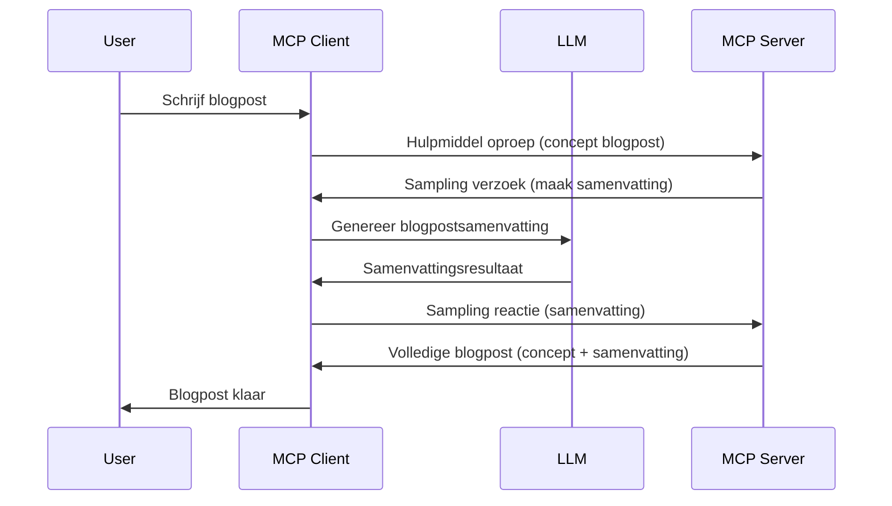

# Sampling - delegeer functies aan de Client

Soms moeten de MCP Client en de MCP Server samenwerken om een gemeenschappelijk doel te bereiken. Je kunt een situatie hebben waarbij de Server de hulp nodig heeft van een LLM die op de client draait. Voor deze situatie is sampling wat je moet gebruiken.

Laten we enkele use cases bekijken en hoe je een oplossing bouwt met sampling.

## Overzicht

In deze les richten we ons op het uitleggen wanneer en waar sampling te gebruiken is en hoe je dit configureert.

## Leerdoelen

In dit hoofdstuk zullen we:

- Uitleggen wat Sampling is en wanneer je het moet gebruiken.
- Tonen hoe Sampling te configureren in MCP.
- Voorbeelden geven van Sampling in actie.

## Wat is Sampling en waarom gebruiken?

Sampling is een geavanceerde functie die op de volgende manier werkt:


### Sampling verzoek

Oké, nu hebben we een hoog-overzicht van een geloofwaardig scenario, laten we het hebben over het sampling verzoek dat de server terugstuurt naar de client. Dit is hoe zo’n verzoek eruit kan zien in JSON-RPC formaat:

```json
{
  "jsonrpc": "2.0",
  "id": 1,
  "method": "sampling/createMessage",
  "params": {
    "messages": [
      {
        "role": "user",
        "content": {
          "type": "text",
          "text": "Create a blog post summary of the following blog post: <BLOG POST>"
        }
      }
    ],
    "modelPreferences": {
      "hints": [
        {
          "name": "claude-3-sonnet"
        }
      ],
      "intelligencePriority": 0.8,
      "speedPriority": 0.5
    },
    "systemPrompt": "You are a helpful assistant.",
    "maxTokens": 100
  }
}
```

Hier zijn een paar dingen die het noemen waard zijn:

- Prompt, onder content -> text, is onze prompt die een instructie is voor de LLM om inhoud van een blogpost samen te vatten.

- **modelPreferences**. Dit gedeelte is precies wat het zegt, een voorkeur, een aanbeveling van welke configuratie te gebruiken met de LLM. De gebruiker kan kiezen of hij deze aanbevelingen volgt of ze aanpast. In dit geval zijn er aanbevelingen over het model om te gebruiken, en prioriteit voor snelheid en intelligentie.
- **systemPrompt**, dit is je normale systeem prompt die je LLM een persoonlijkheid geeft en instructies bevat.
- **maxTokens**, dit is een eigenschap die aangeeft hoeveel tokens aanbevolen zijn voor deze taak.

### Sampling antwoord

Dit antwoord is wat de MCP Client uiteindelijk terugstuurt naar de MCP Server en is het resultaat van het aanroepen van de LLM door de client, wachten op dat antwoord en dan dit bericht samenstellen. Zo kan het eruit zien in JSON-RPC:

```json
{
  "jsonrpc": "2.0",
  "id": 1,
  "result": {
    "role": "assistant",
    "content": {
      "type": "text",
      "text": "Here's your abstract <ABSTRACT>"
    },
    "model": "gpt-5",
    "stopReason": "endTurn"
  }
}
```

Let op hoe het antwoord een samenvatting van de blogpost is, precies zoals gevraagd. Let ook op dat het gebruikte `model` niet is wat we vroegen, maar "gpt-5" in plaats van "claude-3-sonnet". Dit illustreert dat de gebruiker van gedachten kan veranderen over welk model te gebruiken en dat je sampling verzoek een aanbeveling is.

Oké, nu we de hoofdflow begrijpen, en een bruikbare taak om het voor te gebruiken is “blogpost creëren + samenvatting”, laten we zien wat we moeten doen om het werkend te krijgen.

### Berichttypen

Sampling berichten zijn niet beperkt tot alleen tekst, je kunt ook afbeeldingen en audio sturen. Zo ziet de JSON-RPC er anders uit:

**Tekst**

```json
{
  "type": "text",
  "text": "The message content"
}
```

**Afbeeldingsinhoud**

```json
{
  "type": "image",
  "data": "base64-encoded-image-data",
  "mimeType": "image/jpeg"
}
```

**Audio-inhoud**

```json
{
  "type": "audio",
  "data": "base64-encoded-audio-data",
  "mimeType": "audio/wav"
}
```

> NOTE: voor meer gedetailleerde info over Sampling, kijk in de [officiële docs](https://modelcontextprotocol.io/specification/2025-06-18/client/sampling)

## Hoe Sampling in de Client te Configureren

> Opmerking: als je alleen een server bouwt, hoef je hier niet veel te doen.

In een client moet je de volgende feature specificeren als volgt:

```json
{
  "capabilities": {
    "sampling": {}
  }
}
```

Deze wordt dan opgepikt wanneer je gekozen client initialiseert met de server.

## Voorbeeld van Sampling in Actie - Maak een Blogpost

Laten we samen een sampling server coderen, we moeten het volgende doen:

1. Maak een tool aan op de Server.
1. Deze tool moet een sampling verzoek maken
1. De tool wacht tot het sampling verzoek van de client beantwoord is.
1. Dan wordt het resultaat van de tool geproduceerd.

Laten we de code stap voor stap bekijken:

### -1- Maak de tool

**python**

```python
@mcp.tool()
async def create_blog(title: str, content: str, ctx: Context[ServerSession, None]) -> str:
    """Create a blog post and generate a summary"""

```

### -2- Maak een sampling verzoek

Breid je tool uit met de volgende code:

**python**

```python
post = BlogPost(
        id=len(posts) + 1,
        title=title,
        content=content,
        abstract=""
    )

prompt = f"Create an abstract of the following blog post: title: {title} and draft: {content} "

result = await ctx.session.create_message(
        messages=[
            SamplingMessage(
                role="user",
                content=TextContent(type="text", text=prompt),
            )
        ],
        max_tokens=100,
)

```

### -3- Wacht op het antwoord en retourneer het

**python**

```python
post.abstract = result.content.text

posts.append(post)

# retourneer het complete product
return json.dumps({
    "id": post.title,
    "abstract": post.abstract
})
```

### -4- Volledige code

**python**

```python
from starlette.applications import Starlette
from starlette.routing import Mount, Host

from mcp.server.fastmcp import Context, FastMCP

from mcp.server.session import ServerSession
from mcp.types import SamplingMessage, TextContent

import json


from uuid import uuid4
from typing import List
from pydantic import BaseModel


mcp = FastMCP("Blog post generator")

# app = FastAPI()

posts = []

class BlogPost(BaseModel):
    id: int
    title: str
    content: str
    abstract: str

posts: List[BlogPost] = []

@mcp.tool()
async def create_blog(title: str, content: str, ctx: Context[ServerSession, None]) -> str:
    """Create a blog post and generate a summary"""

    post = BlogPost(
        id=len(posts) + 1,
        title=title,
        content=content,
        abstract=""
    )

    prompt = f"Create an abstract of the following blog post: title: {title} and draft: {content} "

    result = await ctx.session.create_message(
        messages=[
            SamplingMessage(
                role="user",
                content=TextContent(type="text", text=prompt),
            )
        ],
        max_tokens=100,
    )

    post.abstract = result.content.text

    posts.append(post)

    # retourneer de volledige blogpost
    return json.dumps({
        "id": post.title,
        "abstract": post.abstract
    })

if __name__ == "__main__":
    print("Starting server...")
    # mcp.run()
    mcp.run(transport="streamable-http")

# run app met: python server.py
```

### -5- Testen in Visual Studio Code

Om dit te testen in Visual Studio Code, doe het volgende:

1. Start de server in de terminal
1. Voeg het toe aan *mcp.json* (en zorg dat het gestart is), bijvoorbeeld zo:

   ```json
   "servers": {
      "blog-server": {
        "type": "http",
        "url": "http://localhost:8000/mcp"
      }
   }
   ```

1. Typ een prompt:

   ```text
   create a blog post named "Where Python comes from", the content is "Python is actually named after Monty Python Flying Circus"
   ```

1. Laat sampling plaatsvinden. De eerste keer dat je dit test krijg je een extra dialoog te zien die je moet accepteren, daarna zie je de normale dialoog om je te vragen een tool uit te voeren

1. Inspecteer de resultaten. Je ziet de resultaten zowel mooi gerenderd in GitHub Copilot Chat, maar je kunt ook de ruwe JSON-response inspecteren.

**Bonus**. Visual Studio Code heeft geweldige ondersteuning voor sampling. Je kunt Sampling toegang configureren op je geïnstalleerde server door er als volgt naartoe te navigeren:

1. Ga naar het extensiegedeelte.
1. Selecteer het tandwielicoon bij je geïnstalleerde server in de sectie "MCP SERVERS - INSTALLED".
1. Selecteer "Configure Model Access", hier kun je selecteren welke modellen GitHub Copilot mag gebruiken tijdens sampling. Je kunt ook alle recente sampling verzoeken zien door "Show Sampling requests" te kiezen.

## Opdracht

In deze opdracht bouw je een iets andere Sampling, namelijk een sampling integratie die het genereren van een productomschrijving ondersteunt. Dit is je scenario:

**Scenario**: De backoffice medewerker van een e-commerce heeft hulp nodig, het kost te veel tijd om productomschrijvingen te genereren. Daarom bouw je een oplossing waarmee je een tool "create_product" aanroept met "title" en "keywords" als argumenten, en die een compleet product moet produceren inclusief een "description" veld dat wordt ingevuld door de LLM van een client.

TIP: gebruik wat je eerder geleerd hebt om deze server en tool te bouwen met een sampling verzoek.

## Oplossing

[Solution](./solution/README.md)

## Belangrijkste punten

Sampling is een krachtige functie die de server toestaat taken te delegeren aan de client wanneer deze de hulp van een LLM nodig heeft.

## Wat volgt

- [Hoofdstuk 4 - Praktische implementatie](../../04-PracticalImplementation/README.md)

---

<!-- CO-OP TRANSLATOR DISCLAIMER START -->
**Disclaimer**:  
Dit document is vertaald met behulp van de AI-vertalingsdienst [Co-op Translator](https://github.com/Azure/co-op-translator). Hoewel we streven naar nauwkeurigheid, dient u er rekening mee te houden dat automatische vertalingen fouten of onnauwkeurigheden kunnen bevatten. Het oorspronkelijke document in de oorspronkelijke taal moet worden beschouwd als de gezaghebbende bron. Voor belangrijke informatie wordt professionele menselijke vertaling aanbevolen. Wij zijn niet aansprakelijk voor enige misverstanden of verkeerde interpretaties die voortvloeien uit het gebruik van deze vertaling.
<!-- CO-OP TRANSLATOR DISCLAIMER END -->