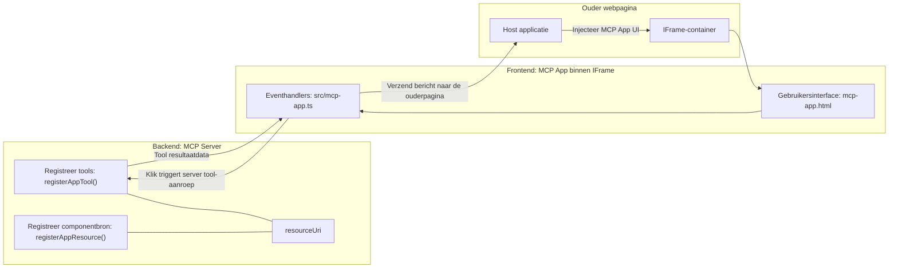

# MCP Apps

MCP Apps is een nieuw paradigma binnen MCP. Het idee is dat je niet alleen reageert met data terug van een toolaanroep, maar ook informatie geeft over hoe met deze informatie omgegaan moet worden. Dat betekent dat toolresultaten nu UI-informatie kunnen bevatten. Waarom zouden we dat willen? Nou, denk aan hoe je het tegenwoordig doet. Je consumeert waarschijnlijk de resultaten van een MCP Server door er een soort frontend voor te zetten, dat is code die je moet schrijven en onderhouden. Soms is dat wat je wilt, maar soms zou het fijn zijn als je gewoon een stukje informatie kunt binnenhalen dat zelfvoorzienend is en alles bevat, van data tot gebruikersinterface.

## Overzicht

Deze les biedt praktische richtlijnen over MCP Apps, hoe je ermee kunt beginnen en hoe je het kunt integreren in je bestaande Web Apps. MCP Apps is een zeer nieuwe toevoeging aan de MCP-standaard.

## Leerdoelen

Aan het einde van deze les ben je in staat om:

- Uit te leggen wat MCP Apps zijn.
- Te bepalen wanneer je MCP Apps gebruikt.
- Je eigen MCP Apps te bouwen en te integreren.

## MCP Apps - hoe werkt het

Het idee van MCP Apps is om een antwoord te geven dat in wezen een component is die gerenderd kan worden. Zo’n component kan zowel visuele elementen als interactiviteit bevatten, bijvoorbeeld knopklikken, gebruikersinvoer en meer. Laten we beginnen met de serverzijde en onze MCP Server. Om een MCP App-component te maken, moet je een tool creëren maar ook de applicatieresource. Deze twee helften zijn verbonden door een resourceUri.

Hier is een voorbeeld. Laten we proberen te visualiseren wat erbij komt kijken en welke onderdelen wat doen:

```text
server.ts -- responsible for registering tools and the component as a UI component
src/
  mcp-app.ts -- wiring up event handlers
mcp-app.html -- the user interface
```

Deze visual beschrijft de architectuur voor het creëren van een component en de logica ervan.


Laten we vervolgens de verantwoordelijkheden voor backend en frontend respectievelijk beschrijven.

### De backend

Er zijn twee dingen die we hier moeten bereiken:

- Registreren van de tools waarmee we willen interacteren.
- De component definiëren.

**Het registreren van de tool**

```typescript
registerAppTool(
    server,
    "get-time",
    {
      title: "Get Time",
      description: "Returns the current server time.",
      inputSchema: {},
      _meta: { ui: { resourceUri } }, // Koppelt dit hulpmiddel aan zijn UI-bron
    },
    async () => {
      const time = new Date().toISOString();
      return { content: [{ type: "text", text: time }] };
    },
  );

```

De bovenstaande code beschrijft het gedrag, waarbij het een tool exposeert genaamd `get-time`. Deze neemt geen input maar genereert de huidige tijd. We hebben de mogelijkheid een `inputSchema` te definiëren voor tools waarin we gebruikersinvoer moeten accepteren.

**Het registreren van de component**

In hetzelfde bestand moeten we ook de component registreren:

```typescript
const resourceUri = "ui://get-time/mcp-app.html";

// Registreer de resource, die de gebundelde HTML/JavaScript voor de UI retourneert.
registerAppResource(
  server,
  resourceUri,
  resourceUri,
  { mimeType: RESOURCE_MIME_TYPE },
  async () => {
    const html = await fs.readFile(path.join(DIST_DIR, "mcp-app.html"), "utf-8");

    return {
    contents: [
        { uri: resourceUri, mimeType: RESOURCE_MIME_TYPE, text: html },
    ],
    };
  },
);
```

Let op hoe we `resourceUri` vermelden om de component met zijn tools te verbinden. Ook interessant is de callback waarmee we het UI-bestand laden en de component retourneren.

### De component frontend

Net als bij de backend zijn hier twee onderdelen:

- Een frontend geschreven in puur HTML.
- Code die gebeurtenissen afhandelt en wat te doen, bijvoorbeeld tools aanroepen of berichten naar het oudervenster sturen.

**Gebruikersinterface**

Laten we kijken naar de gebruikersinterface.

```html
<!-- mcp-app.html -->
<!DOCTYPE html>
<html lang="en">
  <head>
    <meta charset="UTF-8" />
    <title>Get Time App</title>
  </head>
  <body>
    <p>
      <strong>Server Time:</strong> <code id="server-time">Loading...</code>
    </p>
    <button id="get-time-btn">Get Server Time</button>
    <script type="module" src="/src/mcp-app.ts"></script>
  </body>
</html>
```

**Evenementenkoppeling**

Het laatste stuk is het koppelen van events. Dat betekent dat we identificeren welk deel van onze UI event handlers nodig heeft en wat te doen wanneer events worden geactiveerd:

```typescript
// mcp-app.ts

import { App } from "@modelcontextprotocol/ext-apps";

// Verkrijg elementreferenties
const serverTimeEl = document.getElementById("server-time")!;
const getTimeBtn = document.getElementById("get-time-btn")!;

// Maak app-instantie aan
const app = new App({ name: "Get Time App", version: "1.0.0" });

// Verwerk toolresultaten van de server. Zet vóór `app.connect()` om te voorkomen
// dat het initiële toolresultaat ontbreekt.
app.ontoolresult = (result) => {
  const time = result.content?.find((c) => c.type === "text")?.text;
  serverTimeEl.textContent = time ?? "[ERROR]";
};

// Verbind knopklik
getTimeBtn.addEventListener("click", async () => {
  // `app.callServerTool()` laat de UI verse gegevens van de server opvragen
  const result = await app.callServerTool({ name: "get-time", arguments: {} });
  const time = result.content?.find((c) => c.type === "text")?.text;
  serverTimeEl.textContent = time ?? "[ERROR]";
});

// Verbind met host
app.connect();
```

Zoals je hierboven ziet is dit reguliere code om DOM-elementen aan events te koppelen. Het is het vermelden waard dat er een oproep is naar `callServerTool` die eindigt met het aanroepen van een tool op de backend.

## Omgaan met gebruikersinvoer

Tot nu toe hebben we een component gezien met een knop die bij klikken een tool aanroept. Laten we kijken of we meer UI-elementen kunnen toevoegen zoals een invoerveld en zien of we argumenten naar een tool kunnen sturen. Laten we een FAQ-functionaliteit implementeren. Zo zou het moeten werken:

- Er moet een knop en een invoerelement zijn waar de gebruiker een trefwoord typt om te zoeken, bijvoorbeeld "Shipping". Dit zou een tool moeten aanroepen op de backend die zoekt in de FAQ-data.
- Een tool die de genoemde FAQ-zoekfunctie ondersteunt.

Laten we eerst de benodigde ondersteuning aan de backend toevoegen:

```typescript
const faq: { [key: string]: string } = {
    "shipping": "Our standard shipping time is 3-5 business days.",
    "return policy": "You can return any item within 30 days of purchase.",
    "warranty": "All products come with a 1-year warranty covering manufacturing defects.",
  }

registerAppTool(
    server,
    "get-faq",
    {
      title: "Search FAQ",
      description: "Searches the FAQ for relevant answers.",
      inputSchema: zod.object({
        query: zod.string().default("shipping"),
      }),
      _meta: { ui: { resourceUri: faqResourceUri } }, // Koppelt deze tool aan zijn UI-bron
    },
    async ({ query }) => {
      const answer: string = faq[query.toLowerCase()] || "Sorry, I don't have an answer for that.";
      return { content: [{ type: "text", text: answer }] };
    },
  );
```

Wat we hier zien is hoe we `inputSchema` opbouwen en een `zod` schema geven zoals:

```typescript
inputSchema: zod.object({
  query: zod.string().default("shipping"),
})
```

In bovenstaand schema geven we aan dat we een inputparameter `query` hebben, die optioneel is met standaardwaarde "shipping".

Oké, laten we verder gaan naar *mcp-app.html* om te zien welke UI we ervoor moeten maken:

```html
<div class="faq">
    <h1>FAQ response</h1>
    <p>FAQ Response: <code id="faq-response">Loading...</code></p>
    <input type="text" id="faq-query" placeholder="Enter FAQ query" />
    <button id="get-faq-btn">Get FAQ Response</button>
  </div>
```

Top, nu hebben we een invoerelement en een knop. Laten we vervolgens naar *mcp-app.ts* gaan om deze events te koppelen:

```typescript
const getFaqBtn = document.getElementById("get-faq-btn")!;
const faqQueryInput = document.getElementById("faq-query") as HTMLInputElement;

getFaqBtn.addEventListener("click", async () => {
  const query = faqQueryInput.value;
  const result = await app.callServerTool({ name: "get-faq", arguments: { query } });
  const faq = result.content?.find((c) => c.type === "text")?.text;
  faqResponseEl.textContent = faq ?? "[ERROR]";
});
```

In bovenstaande code:

- Maken we referenties naar de interactieve UI-elementen.
- Handelen we een knopklik af om de waarde van het invoerveld te parsen en roepen we `app.callServerTool()` aan met `name` en `arguments` waarbij het laatste `query` als waarde doorgeeft.

Wat er feitelijk gebeurt als je `callServerTool` aanroept, is dat er een bericht wordt gestuurd naar het oudervenster en dat venster roept uiteindelijk de MCP Server aan.

### Probeer het uit

Dit uitproberen zou het volgende moeten laten zien:


en hier proberen we het met input zoals "warranty"


Om deze code uit te voeren, ga naar de [Code sectie](./code/README.md)

## Testen in Visual Studio Code

Visual Studio Code heeft uitstekende ondersteuning voor MCP Apps en is waarschijnlijk een van de gemakkelijkste manieren om je MCP Apps te testen. Voeg om Visual Studio Code te gebruiken een server entry toe aan *mcp.json* zoals:

```json
"my-mcp-server-7178eca7": {
    "url": "http://localhost:3001/mcp",
    "type": "http"
  }
```

Start daarna de server, je zou moeten kunnen communiceren met je MCP App via het Chatvenster, mits je GitHub Copilot geïnstalleerd hebt.

Je kunt het triggeren via een prompt, bijvoorbeeld "#get-faq":


en net zoals wanneer je het via een webbrowser uitvoerde, wordt het op dezelfde manier gerenderd:


## Opdracht

Maak een steen-papier-schaar spel. Dit moet bestaan uit het volgende:

UI:

- een dropdown lijst met opties
- een knop om een keuze in te dienen
- een label die toont wie wat koos en wie er won

Server:

- moet een steen-papier-schaar tool hebben die "choice" als input neemt. Het moet ook een computerkeuze renderen en de winnaar bepalen

## Oplossing

[Oplossing](./assignment/README.md)

## Samenvatting

We hebben geleerd over het nieuwe paradigma MCP Apps. Het is een nieuw paradigma dat MCP Servers in staat stelt niet alleen een mening te hebben over data maar ook over hoe deze data gepresenteerd moet worden.

Daarnaast hebben we geleerd dat deze MCP Apps in een IFrame draaien en om te communiceren met MCP Servers berichten moeten sturen naar de ouder webapp. Er bestaan verschillende bibliotheken voor zowel plain JavaScript als React en meer die deze communicatie gemakkelijker maken.

## Belangrijkste punten

Dit heb je geleerd:

- MCP Apps is een nieuwe standaard die nuttig kan zijn als je zowel data als UI-functionaliteit wilt leveren.
- Dit soort apps draaien in een IFrame om veiligheidsredenen.

## Wat hierna

- [Hoofdstuk 4](../../04-PracticalImplementation/README.md)

---

<!-- CO-OP TRANSLATOR DISCLAIMER START -->
**Disclaimer**:  
Dit document is vertaald met behulp van de AI-vertalingsservice [Co-op Translator](https://github.com/Azure/co-op-translator). Hoewel we streven naar nauwkeurigheid, dient u er rekening mee te houden dat geautomatiseerde vertalingen fouten of onnauwkeurigheden kunnen bevatten. Het originele document in de oorspronkelijke taal moet als de gezaghebbende bron worden beschouwd. Voor belangrijke informatie wordt professionele menselijke vertaling aanbevolen. Wij zijn niet aansprakelijk voor eventuele misverstanden of verkeerde interpretaties die voortvloeien uit het gebruik van deze vertaling.
<!-- CO-OP TRANSLATOR DISCLAIMER END -->