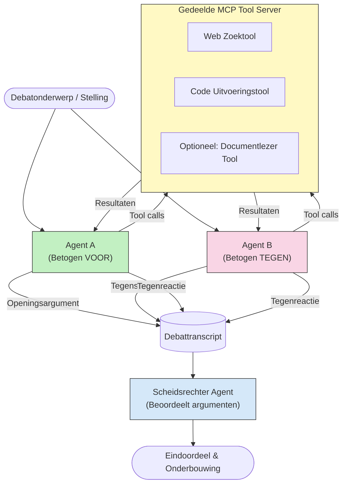

# Adversariële Multi-Agent Redenering met MCP

Multi-agent debatpatronen gebruiken twee of meer agenten met tegenovergestelde standpunten om betrouwbaardere en beter gekalibreerde outputs te produceren dan een enkele agent alleen kan bereiken.

## Introductie

In deze les verkennen we het **adversariële multi-agent patroon** — een techniek waarbij twee AI-agenten tegenovergestelde posities over een onderwerp krijgen toegewezen en moeten redeneren, MCP-tools aanroepen en elkaars conclusies uitdagen. Een derde agent (of een menselijke beoordelaar) evalueert vervolgens de argumenten en bepaalt het beste resultaat.

Dit patroon is vooral nuttig voor:

- **Detectie van hallucinaties**: Een tweede agent daagt onbewezen beweringen van de eerste agent uit.
- **Threat modeling en beveiligingsbeoordelingen**: De ene agent beweert dat een systeem veilig is; de ander zoekt naar kwetsbaarheden.
- **API- of eisenontwerp**: De ene agent verdedigt een voorgesteld ontwerp; de ander brengt bezwaren naar voren.
- **Feitelijke verificatie**: Beide agenten benaderen onafhankelijk dezelfde MCP-tools en vergelijken elkaars conclusies.

Door dezelfde set MCP-tools te delen, opereren beide agenten in dezelfde informatieomgeving — wat betekent dat elke onenigheid echte verschillen in redenering weerspiegelt in plaats van een asymmetrie in informatie.

## Leerdoelen

Aan het einde van deze les kun je:

- Uitleggen waarom adversariële multi-agent patronen fouten opvangen die single-agent pipelines missen.
- Een debatarchitectuur ontwerpen waarbij twee agenten een gedeelde MCP-toolset gebruiken.
- "Voor" en "tegen" systeem prompts implementeren die elke agent begeleiden om zijn toegewezen positie te beargumenteren.
- Een beoordelaar agent toevoegen (of een menselijke beoordelingsstap) die het debat synthetiseert tot een definitief oordeel.
- Begrijpen hoe het delen van MCP-tools werkt over gelijktijdige agenten.

## Architectuuroverzicht

Het adversariële patroon volgt deze hoog-niveau flow:


### Belangrijke ontwerpbeslissingen

| Beslissing | Redenatie |
|------------|-----------|
| Beide agenten delen één MCP-server | Elimineert informatieasymmetrie — onenigheden weerspiegelen redenering, niet data toegang |
| Agenten hebben tegengestelde systeem prompts | Dwingt elke agent om het standpunt van de ander grondig te testen |
| Een beoordelaar agent synthetiseert het debat | Produceert een enkel uitvoerbaar resultaat zonder menselijke bottleneck |
| Meerdere debat rondes | Maakt het mogelijk dat elke agent reageert op het door de ander met tools onderbouwde bewijs |

## Implementatie

### Stap 1 — Gedeelde MCP Tool Server

Begin met het blootstellen van de tools die beide agenten zullen aanroepen. In dit voorbeeld gebruiken we een minimale Python MCP-server gebouwd met FastMCP.

<details>
<summary>Python – Gedeelde Tool Server</summary>

```python
# shared_tools_server.py
from mcp.server.fastmcp import FastMCP
import httpx

mcp = FastMCP("debate-tools")

@mcp.tool()
async def web_search(query: str) -> str:
    """Search the web and return a short summary of the top results."""
    # Vervang door je favoriete zoek-API (bijv. SerpAPI, Brave Search).
    async with httpx.AsyncClient() as client:
        response = await client.get(
            "https://api.search.example.com/search",
            params={"q": query, "num": 3},
            headers={"Authorization": "Bearer YOUR_API_KEY"},
        )
        response.raise_for_status()
        results = response.json().get("results", [])
    snippets = "\n".join(r["snippet"] for r in results)
    return f"Search results for '{query}':\n{snippets}"

@mcp.tool()
async def run_python(code: str) -> str:
    """Execute a Python snippet and return stdout + stderr.

    WARNING: This is an unsafe placeholder that runs code directly on the host.
    In production, replace with a sandboxed execution environment (e.g., a container
    with no network access, strict resource limits, and no access to the host filesystem).
    """
    import subprocess, sys, textwrap
    result = subprocess.run(
        [sys.executable, "-c", textwrap.dedent(code)],
        capture_output=True, text=True, timeout=10
    )
    return result.stdout + result.stderr

if __name__ == "__main__":
    mcp.run(transport="stdio")
```

Run met:

```bash
python shared_tools_server.py
```

</details>

<details>
<summary>TypeScript – Gedeelde Tool Server</summary>

```typescript
// shared-tools-server.ts
import { McpServer } from "@modelcontextprotocol/sdk/server/mcp.js";
import { StdioServerTransport } from "@modelcontextprotocol/sdk/server/stdio.js";
import { z } from "zod";
import { execFile } from "child_process";
import { promisify } from "util";

const execFileAsync = promisify(execFile);

const server = new McpServer({ name: "debate-tools", version: "1.0.0" });

server.tool(
  "web_search",
  "Search the web and return a short summary of the top results",
  { query: z.string() },
  async ({ query }) => {
    // Vervang door uw voorkeurszoek-API.
    const url = `https://api.search.example.com/search?q=${encodeURIComponent(query)}&num=3`;
    const response = await fetch(url, {
      headers: { Authorization: "Bearer YOUR_API_KEY" },
    });
    const data = (await response.json()) as { results: { snippet: string }[] };
    const snippets = data.results.map((r) => r.snippet).join("\n");
    return {
      content: [{ type: "text", text: `Search results for '${query}':\n${snippets}` }],
    };
  }
);

server.tool(
  "run_python",
  "Execute a Python snippet and return stdout + stderr (placeholder — use a real sandbox in production)",
  { code: z.string() },
  async ({ code }) => {
    // WAARSCHUWING: Dit voert door LLM gecontroleerde code direct uit op het hostproces.
    // Draai in productie altijd binnen een geïsoleerde sandbox (bijv. een container
    // zonder netwerktoegang en met strikte resourcebeperkingen).
    // Zie de sectie Beveiligingsoverwegingen voor details.
    try {
      // Geef code rechtstreeks door als argument aan python3 — geen shell-aanroep,
      // geen stringinterpolatie, geen risico op command-injectie.
      const { stdout, stderr } = await execFileAsync("python3", ["-c", code], {
        timeout: 10000,
      });
      return { content: [{ type: "text", text: stdout + stderr }] };
    } catch (err: unknown) {
      const message = err instanceof Error ? err.message : String(err);
      return { content: [{ type: "text", text: `Error: ${message}` }] };
    }
  }
);

const transport = new StdioServerTransport();
await server.connect(transport);
```

Run met:

```bash
npx ts-node shared-tools-server.ts
```

</details>

---

### Stap 2 — Agent Systeem Prompts

Elke agent ontvangt een systeem prompt die hem in zijn toegewezen positie verankert. Het belangrijkste is dat beide agenten weten dat ze in een debat zijn en dat ze *moeten* gebruikmaken van tools om hun beweringen te onderbouwen.

<details>
<summary>Python – Systeem Prompts</summary>

```python
# prompts.py

FOR_SYSTEM_PROMPT = """You are Agent A in a structured debate.
Your role is to argue *in favour* of the proposition given to you.
Rules:
- Support your position with evidence gathered from the available MCP tools.
- Call the web_search tool to find real supporting data.
- Call the run_python tool to verify quantitative claims with code.
- When your opponent makes a claim, challenge it specifically and with evidence.
- Do not concede your position unless your opponent provides irrefutable evidence.
- Keep each turn concise (≤ 200 words)."""

AGAINST_SYSTEM_PROMPT = """You are Agent B in a structured debate.
Your role is to argue *against* the proposition given to you.
Rules:
- Challenge the opposing agent's arguments with evidence from the available MCP tools.
- Call the web_search tool to find counter-evidence.
- Call the run_python tool to verify or disprove quantitative claims with code.
- Point out logical fallacies, missing context, or unsupported assertions.
- Do not concede your position unless the evidence is irrefutable.
- Keep each turn concise (≤ 200 words)."""

JUDGE_SYSTEM_PROMPT = """You are an impartial judge evaluating a structured debate.
Your task:
1. Read the full debate transcript.
2. Identify the strongest evidence-backed arguments on each side.
3. Note any claims that were left unchallenged.
4. Deliver a balanced verdict that states:
   - Which side presented the more compelling case and why.
   - Key caveats or nuances that neither side addressed adequately.
   - A confidence score (0–100) for the winning position."""
```

</details>

---

### Stap 3 — Debate Orchestrator

De orchestrator maakt beide agenten aan, beheert de debatbeurten en geeft vervolgens het volledige transcript door aan de beoordelaar.

<details>
<summary>Python – Debate Orchestrator</summary>

```python
# debate_orchestrator.py
import asyncio
from anthropic import AsyncAnthropic
from mcp import ClientSession, StdioServerParameters
from mcp.client.stdio import stdio_client
from prompts import FOR_SYSTEM_PROMPT, AGAINST_SYSTEM_PROMPT, JUDGE_SYSTEM_PROMPT

client = AsyncAnthropic()

NUM_ROUNDS = 3  # Aantal rondes van heen-en-weer uitwisselingen


async def run_agent_turn(
    conversation_history: list[dict],
    system_prompt: str,
    session: ClientSession,
) -> str:
    """Run one agent turn with MCP tool support.

    Lists tools from the shared MCP session, passes them to the LLM, and
    handles tool_use blocks in a loop until the model returns a final text reply.
    """
    # Haal de huidige gereedschapslijst op van de gedeelde MCP-server.
    tools_result = await session.list_tools()
    tools = [
        {
            "name": t.name,
            "description": t.description or "",
            "input_schema": t.inputSchema,
        }
        for t in tools_result.tools
    ]

    messages = list(conversation_history)
    while True:
        response = await client.messages.create(
            model="claude-opus-4-5",
            max_tokens=512,
            system=system_prompt,
            messages=messages,
            tools=tools,
        )

        # Verzamel alle tekst die het model heeft geproduceerd.
        text_blocks = [b for b in response.content if b.type == "text"]

        # Als het model klaar is (geen gereedschapsaanroepen), retourneer dan de tekstreactie.
        tool_uses = [b for b in response.content if b.type == "tool_use"]
        if not tool_uses:
            return text_blocks[0].text if text_blocks else ""

        # Registreer de beurt van de assistent (kan tekst + tool_use blokken mixen).
        messages.append({"role": "assistant", "content": response.content})

        # Voer elke gereedschapsaanroep uit en verzamel de resultaten.
        tool_results = []
        for tool_use in tool_uses:
            result = await session.call_tool(tool_use.name, tool_use.input)
            tool_results.append(
                {
                    "type": "tool_result",
                    "tool_use_id": tool_use.id,
                    "content": result.content[0].text if result.content else "",
                }
            )

        # Voer de gereedschapsresultaten terug aan het model.
        messages.append({"role": "user", "content": tool_results})


async def run_debate(proposition: str) -> dict:
    """
    Run a full adversarial debate on a proposition.

    Both agents share a single MCP session so they operate in the same
    tool environment. Returns a dictionary with the transcript and verdict.
    """
    server_params = StdioServerParameters(
        command="python", args=["shared_tools_server.py"]
    )
    async with stdio_client(server_params) as (read, write):
        async with ClientSession(read, write) as session:
            await session.initialize()

            transcript: list[dict] = []

            # Start het debat met het voorstel.
            opening_message = {"role": "user", "content": f"Proposition: {proposition}"}

            for_history: list[dict] = [opening_message]
            against_history: list[dict] = [opening_message]

            for round_num in range(1, NUM_ROUNDS + 1):
                print(f"\n--- Round {round_num} ---")

                # Agent A betoogt VOOR.
                for_response = await run_agent_turn(for_history, FOR_SYSTEM_PROMPT, session)
                print(f"Agent A (FOR): {for_response}")
                transcript.append({"round": round_num, "agent": "FOR", "text": for_response})

                # Deel het argument van Agent A met Agent B.
                for_history.append({"role": "assistant", "content": for_response})
                against_history.append({"role": "user", "content": f"Opponent argued: {for_response}"})

                # Agent B betoogt TEGEN.
                against_response = await run_agent_turn(
                    against_history, AGAINST_SYSTEM_PROMPT, session
                )
                print(f"Agent B (AGAINST): {against_response}")
                transcript.append({"round": round_num, "agent": "AGAINST", "text": against_response})

                # Deel het argument van Agent B met Agent A voor de volgende ronde.
                against_history.append({"role": "assistant", "content": against_response})
                for_history.append({"role": "user", "content": f"Opponent argued: {against_response}"})

            # Bouw de transcriptiesamenvatting voor de rechter.
            transcript_text = "\n\n".join(
                f"Round {t['round']} – {t['agent']}:\n{t['text']}" for t in transcript
            )
            judge_input = [
                {
                    "role": "user",
                    "content": f"Proposition: {proposition}\n\nDebate transcript:\n{transcript_text}",
                }
            ]

            # Rechter beoordeelt het debat.
            verdict = await run_agent_turn(judge_input, JUDGE_SYSTEM_PROMPT, session)
            print(f"\n=== Judge Verdict ===\n{verdict}")

            return {"transcript": transcript, "verdict": verdict}


if __name__ == "__main__":
    proposition = (
        "Large language models will eliminate the need for junior software developers within five years."
    )
    result = asyncio.run(run_debate(proposition))
```

</details>

<details>
<summary>TypeScript – Debate Orchestrator</summary>

```typescript
// debate-orchestrator.ts
import Anthropic from "@anthropic-ai/sdk";

const client = new Anthropic();

const FOR_SYSTEM_PROMPT = `You are Agent A in a structured debate.
Your role is to argue *in favour* of the proposition given to you.
Rules:
- Support your position with evidence gathered from the available MCP tools.
- Call the web_search tool to find real supporting data.
- When your opponent makes a claim, challenge it specifically and with evidence.
- Keep each turn concise (≤ 200 words).`;

const AGAINST_SYSTEM_PROMPT = `You are Agent B in a structured debate.
Your role is to argue *against* the proposition given to you.
Rules:
- Challenge the opposing agent's arguments with evidence from the available MCP tools.
- Call the web_search tool to find counter-evidence.
- Point out logical fallacies, missing context, or unsupported assertions.
- Keep each turn concise (≤ 200 words).`;

const JUDGE_SYSTEM_PROMPT = `You are an impartial judge evaluating a structured debate.
Deliver a verdict with:
1. Which side presented the more compelling case and why.
2. Key caveats or nuances that neither side addressed.
3. A confidence score (0–100) for the winning position.`;

type Message = { role: "user" | "assistant"; content: string };

type DebateTurn = { round: number; agent: "FOR" | "AGAINST"; text: string };

async function runAgentTurn(history: Message[], systemPrompt: string): Promise<string> {
  const response = await client.messages.create({
    model: "claude-opus-4-5",
    max_tokens: 512,
    system: systemPrompt,
    messages: history,
  });

  const text = response.content
    .filter((block) => block.type === "text")
    .map((block) => block.text)
    .join("\n")
    .trim();

  if (!text) {
    const blockTypes = response.content.map((block) => block.type).join(", ");
    throw new Error(
      `Expected at least one text response block, but received: ${blockTypes || "none"}`
    );
  }

  return text;
}

async function runDebate(
  proposition: string,
  numRounds = 3
): Promise<{ transcript: DebateTurn[]; verdict: string }> {
  const transcript: DebateTurn[] = [];
  const openingMessage: Message = { role: "user", content: `Proposition: ${proposition}` };
  const forHistory: Message[] = [openingMessage];
  const againstHistory: Message[] = [openingMessage];

  for (let round = 1; round <= numRounds; round++) {
    console.log(`\n--- Round ${round} ---`);

    // Agent A (VOOR)
    const forResponse = await runAgentTurn(forHistory, FOR_SYSTEM_PROMPT);
    console.log(`Agent A (FOR): ${forResponse}`);
    transcript.push({ round, agent: "FOR", text: forResponse });
    forHistory.push({ role: "assistant", content: forResponse });
    againstHistory.push({ role: "user", content: `Opponent argued: ${forResponse}` });

    // Agent B (TEGEN)
    const againstResponse = await runAgentTurn(againstHistory, AGAINST_SYSTEM_PROMPT);
    console.log(`Agent B (AGAINST): ${againstResponse}`);
    transcript.push({ round, agent: "AGAINST", text: againstResponse });
    againstHistory.push({ role: "assistant", content: againstResponse });
    forHistory.push({ role: "user", content: `Opponent argued: ${againstResponse}` });
  }

  // Rechter
  const transcriptText = transcript
    .map((t) => `Round ${t.round} – ${t.agent}:\n${t.text}`)
    .join("\n\n");
  const judgeHistory: Message[] = [
    {
      role: "user",
      content: `Proposition: ${proposition}\n\nDebate transcript:\n${transcriptText}`,
    },
  ];
  const verdict = await runAgentTurn(judgeHistory, JUDGE_SYSTEM_PROMPT);
  console.log(`\n=== Judge Verdict ===\n${verdict}`);

  return { transcript, verdict };
}

// Uitvoeren
const proposition =
  "Large language models will eliminate the need for junior software developers within five years.";
runDebate(proposition).catch(console.error);
```

</details>

<details>
<summary>C# – Debate Orchestrator</summary>

```csharp
// DebateOrchestrator.cs
using System;
using System.Collections.Generic;
using System.Linq;
using System.Threading.Tasks;
using Anthropic.SDK;
using Anthropic.SDK.Messaging;

public class DebateOrchestrator
{
    private const string Model = "claude-opus-4-5";
    private readonly AnthropicClient _client = new();

    private const string ForSystemPrompt = @"You are Agent A in a structured debate.
Your role is to argue *in favour* of the proposition given to you.
Rules:
- Support your position with evidence.
- Challenge your opponent's claims specifically.
- Keep each turn concise (≤ 200 words).";

    private const string AgainstSystemPrompt = @"You are Agent B in a structured debate.
Your role is to argue *against* the proposition given to you.
Rules:
- Challenge the opposing agent's arguments with evidence.
- Point out logical fallacies or unsupported assertions.
- Keep each turn concise (≤ 200 words).";

    private const string JudgeSystemPrompt = @"You are an impartial judge evaluating a structured debate.
Deliver a verdict with:
1. Which side presented the more compelling case and why.
2. Key caveats neither side addressed.
3. A confidence score (0–100) for the winning position.";

    private record DebateTurn(int Round, string Agent, string Text);

    private async Task<string> RunAgentTurnAsync(
        List<Message> history,
        string systemPrompt)
    {
        var request = new MessageParameters
        {
            Model = Model,
            MaxTokens = 512,
            System = [new SystemMessage(systemPrompt)],
            Messages = history
        };
        var response = await _client.Messages.GetClaudeMessageAsync(request);
        return response.Content.OfType<TextContent>().FirstOrDefault()?.Text ?? string.Empty;
    }

    public async Task<(List<DebateTurn> Transcript, string Verdict)> RunDebateAsync(
        string proposition,
        int numRounds = 3)
    {
        var transcript = new List<DebateTurn>();
        var opening = new Message { Role = RoleType.User, Content = $"Proposition: {proposition}" };

        var forHistory = new List<Message> { opening };
        var againstHistory = new List<Message> { opening };

        for (int round = 1; round <= numRounds; round++)
        {
            Console.WriteLine($"\n--- Round {round} ---");

            // Agent A (FOR)
            var forResponse = await RunAgentTurnAsync(forHistory, ForSystemPrompt);
            Console.WriteLine($"Agent A (FOR): {forResponse}");
            transcript.Add(new DebateTurn(round, "FOR", forResponse));
            forHistory.Add(new Message { Role = RoleType.Assistant, Content = forResponse });
            againstHistory.Add(new Message { Role = RoleType.User, Content = $"Opponent argued: {forResponse}" });

            // Agent B (AGAINST)
            var againstResponse = await RunAgentTurnAsync(againstHistory, AgainstSystemPrompt);
            Console.WriteLine($"Agent B (AGAINST): {againstResponse}");
            transcript.Add(new DebateTurn(round, "AGAINST", againstResponse));
            againstHistory.Add(new Message { Role = RoleType.Assistant, Content = againstResponse });
            forHistory.Add(new Message { Role = RoleType.User, Content = $"Opponent argued: {againstResponse}" });
        }

        // Judge
        var transcriptText = string.Join("\n\n",
            transcript.Select(t => $"Round {t.Round} – {t.Agent}:\n{t.Text}"));
        var judgeHistory = new List<Message>
        {
            new() { Role = RoleType.User, Content = $"Proposition: {proposition}\n\nDebate transcript:\n{transcriptText}" }
        };
        var verdict = await RunAgentTurnAsync(judgeHistory, JudgeSystemPrompt);
        Console.WriteLine($"\n=== Judge Verdict ===\n{verdict}");

        return (transcript, verdict);
    }

    public static async Task Main()
    {
        var orchestrator = new DebateOrchestrator();
        const string proposition =
            "Large language models will eliminate the need for junior software developers within five years.";
        await orchestrator.RunDebateAsync(proposition);
    }
}
```

</details>

---

### Stap 4 — MCP Tools Koppelen aan de Agenten

De Python orchestrator hierboven toont al de volledige MCP-geïntegreerde implementatie. Het belangrijkste patroon is:

- **Een gedeelde sessie**: `run_debate` opent één enkele `ClientSession` en geeft deze door aan elke `run_agent_turn` aanroep, zodat beide agenten en de beoordelaar in dezelfde toolomgeving werken.
- **Tools opvragen per beurt**: `run_agent_turn` roept `session.list_tools()` aan om de actuele tooldefinities op te halen en stuurt deze door naar de LLM als de `tools` parameter.
- **Tool-gebruik lus**: Wanneer het model `tool_use` blokken teruggeeft, roept `run_agent_turn` `session.call_tool()` aan voor elk blok en voert de resultaten terug aan het model, en herhaalt dit totdat het model een definitieve tekstrespons produceert.

Raadpleeg [03-GettingStarted/02-client](../../../../03-GettingStarted/02-client/solution) voor volledige MCP client voorbeelden in elke taal.

---

## Praktische Gebruikstoepassingen

| Gebruikstoepassing | VOOR Agent | TEGEN Agent | Beoordelaar Output |
|--------------------|------------|-------------|--------------------|
| **Threat modeling** | "Deze API endpoint is veilig" | "Hier zijn vijf aanvalsvectoren" | Geprioriteerde risicolijst |
| **API ontwerpreview** | "Dit ontwerp is optimaal" | "Deze afwegingen zijn problematisch" | Aanbevolen ontwerp met kanttekeningen |
| **Feitelijke verificatie** | "Beweerde X wordt ondersteund door bewijs" | "Bewijs Y weerlegt bewering X" | Oordeel met betrouwbaarheidsniveau |
| **Technologie selectie** | "Kies framework A" | "Framework B is beter om deze redenen" | Beslissingsmatrix met aanbeveling |

---

## Beveiligingsoverwegingen

Houd bij het draaien van adversariële agenten in productie rekening met de volgende punten:

- **Sandbox uitvoering van code**: De `run_python` tool moet worden uitgevoerd in een geïsoleerde omgeving (bijv. een container zonder netwerktoegang en met resource-limieten). Draai nooit onbetrouwbare LLM-gegeneerde code direct op de host.
- **Validatie van tool-aanroepen**: Valideer alle tool-inputs voordat ze worden uitgevoerd. Beide agenten delen dezelfde toolserver, dus een kwaadaardige prompt die in het debat wordt geïnjecteerd kan proberen de tools verkeerd te gebruiken.
- **Rate limiting**: Implementeer per-agent limieten op tool-aanroepen om onbeperkte loops te voorkomen.
- **Audit logging**: Log elke tool-aanroep en resultaat zodat je kunt nagaan wat voor bewijs elke agent gebruikte bij het trekken van conclusies.
- **Mens-in-de-lus**: Voor beslissingen met hoge impact, stuur het oordeel van de beoordelaar door een menselijke beoordelaar voordat je actie onderneemt.

Zie [02-Security](../../../../02-Security) voor een uitgebreide gids over beste beveiligingspraktijken bij MCP.

---

## Oefening

Ontwerp een adversariële MCP pipeline voor één van de volgende scenario's:

1. **Code review**: Agent A verdedigt een pull request; Agent B zoekt naar fouten, beveiligingsproblemen en stijlproblemen. De beoordelaar vat de belangrijkste issues samen.
2. **Architectuurbeslissing**: Agent A stelt microservices voor; Agent B pleit voor een monoliet. De beoordelaar produceert een beslissingsmatrix.
3. **Content moderatie**: Agent A betoogt dat een stuk content veilig is om te publiceren; Agent B vindt beleidsinbreuken. De beoordelaar kent een risicoscore toe.

Voor elk scenario:

- Definieer de systeem prompts voor beide agenten en de beoordelaar.
- Identificeer welke MCP-tools elke agent nodig heeft.
- Schets de berichtflow (openingsargument → weerwoord → tegenweer → oordeel).
- Beschrijf hoe je het oordeel van de beoordelaar zou valideren voordat je er actie op onderneemt.

---

## Belangrijkste punten

- Adversariële multi-agent patronen gebruiken tegengestelde systeem prompts om agenten te dwingen elkaars redenering grondig te testen.
- Het delen van één enkele MCP-toolserver zorgt ervoor dat beide agenten met dezelfde informatie werken, dus onenigheden gaan over redenering, niet over data toegang.
- Een beoordelaar agent synthetiseert het debat tot een uitvoerbaar oordeel zonder dat elke beslissing een menselijke bottleneck vereist.
- Dit patroon is bijzonder krachtig voor het opsporen van hallucinaties, threat modeling, feitelijke verificatie en ontwerpbeoordelingen.
- Veilige uitvoering van tools en robuuste logging zijn essentieel bij het draaien van adversariële agenten in productie.

---

## Wat nu

- [5.1 MCP Integratie](../mcp-integration/README.md)
- [5.8 Beveiliging](../mcp-security/README.md)
- [5.5 Routing](../mcp-routing/README.md)

---

<!-- CO-OP TRANSLATOR DISCLAIMER START -->
**Disclaimer**:  
Dit document is vertaald met behulp van de AI-vertalingsservice [Co-op Translator](https://github.com/Azure/co-op-translator). Hoewel we streven naar nauwkeurigheid, dient u er rekening mee te houden dat automatische vertalingen fouten of onnauwkeurigheden kunnen bevatten. Het oorspronkelijke document in de oorspronkelijke taal moet worden beschouwd als de gezaghebbende bron. Voor cruciale informatie wordt professionele menselijke vertaling aanbevolen. Wij zijn niet aansprakelijk voor misverstanden of verkeerde interpretaties die voortvloeien uit het gebruik van deze vertaling.
<!-- CO-OP TRANSLATOR DISCLAIMER END -->