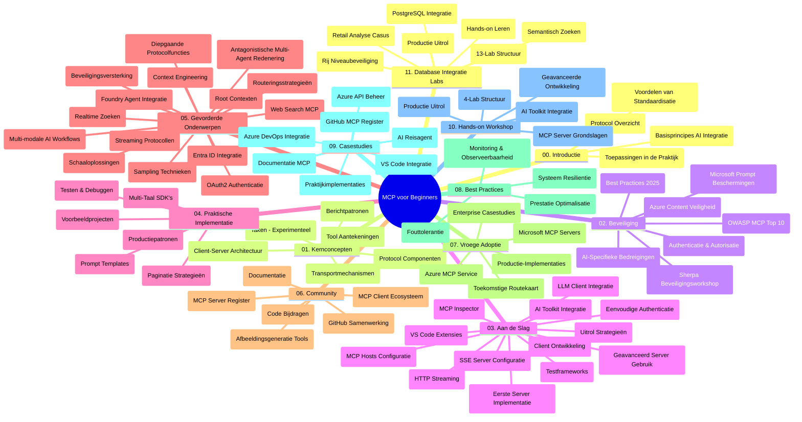

# Model Context Protocol (MCP) voor Beginners - Studiegids

Deze studiegids biedt een overzicht van de repositorystructuur en inhoud voor de "Model Context Protocol (MCP) voor Beginners" cursus. Gebruik deze gids om efficiënt door de repository te navigeren en optimaal gebruik te maken van de beschikbare bronnen.

## Overzicht van de Repository

Het Model Context Protocol (MCP) is een gestandaardiseerd kader voor interacties tussen AI-modellen en clientapplicaties. Oorspronkelijk gemaakt door Anthropic, wordt MCP nu onderhouden door de bredere MCP-gemeenschap via de officiële GitHub-organisatie. Deze repository biedt een uitgebreide cursus met praktische codevoorbeelden in C#, Java, JavaScript, Python en TypeScript, ontworpen voor AI-ontwikkelaars, systeemarchitecten en software-engineers.

## Visuele Cursuskaart

## Repositorystructuur

De repository is georganiseerd in elf hoofdsecties, elk gericht op verschillende aspecten van MCP:

1. **Introductie (00-Introduction/)**
   - Overzicht van het Model Context Protocol
   - Waarom standaardisatie belangrijk is in AI-pijplijnen
   - Praktische use cases en voordelen

2. **Kernconcepten (01-CoreConcepts/)**
   - Client-serverarchitectuur
   - Belangrijke protocolcomponenten
   - Berichtenpatronen in MCP

3. **Beveiliging (02-Security/)**
   - Beveiligingsbedreigingen in MCP-gebaseerde systemen
   - Beste praktijken voor het beveiligen van implementaties
   - Authenticatie- en autorisatiestrategieën
   - **Uitgebreide beveiligingsdocumentatie**:
     - MCP Security Best Practices 2025
     - Azure Content Safety Implementatiehandleiding
     - MCP Security Controls en Technieken
     - MCP Best Practices Quick Reference
   - **Belangrijke beveiligingsthema's**:
     - Promptinjection- en toolvergiftigingsaanvallen
     - Session hijacking en confused deputy-problemen
     - Token passthrough-kwetsbaarheden
     - Overmatige permissies en toegangscontrole
     - Supply chain-beveiliging voor AI-componenten
     - Integratie met Microsoft Prompt Shields

4. **Aan de Slag (03-GettingStarted/)**
   - Omgevingsopzet en configuratie
   - Basis MCP-servers en -clients maken
   - Integratie met bestaande applicaties
   - Inclusief secties voor:
     - Eerste serverimplementatie
     - Clientontwikkeling
     - LLM-clientintegratie
     - VS Code-integratie
     - Server-Sent Events (SSE) server
     - Geavanceerd servergebruik
     - HTTP-streaming
     - AI Toolkit-integratie
     - Teststrategieën
     - Uitrolrichtlijnen

5. **Praktische Implementatie (04-PracticalImplementation/)**
   - Gebruik van SDK's in verschillende programmeertalen
   - Debuggen, testen en validatietechnieken
   - Het maken van herbruikbare prompttemplates en workflows
   - Voorbeeldprojecten met implementatievoorbeelden

6. **Geavanceerde Onderwerpen (05-AdvancedTopics/)**
   - Context engineering-technieken
   - Foundry-agentintegratie
   - Multimodale AI-workflows
   - OAuth2 authenticatie demonstraties
   - Real-time zoekmogelijkheden
   - Real-time streaming
   - Implementatie van root contexts
   - Routingstrategieën
   - Samplingtechnieken
   - Schaalmethoden
   - Beveiligingsoverwegingen
   - Entra ID beveiligingsintegratie
   - Webzoekintegratie
   - Adversarial multi-agent redenering (debate patterns)

7. **CommunityBijdragen (06-CommunityContributions/)**
   - Hoe code en documentatie bij te dragen
   - Samenwerken via GitHub
   - Communitygedreven verbeteringen en feedback
   - Gebruik van diverse MCP-clients (Claude Desktop, Cline, VSCode)
   - Werken met populaire MCP-servers inclusief beeldgeneratie

8. **Lessen uit Vroege Adoptie (07-LessonsfromEarlyAdoption/)**
   - Praktische implementaties en succesverhalen
   - Bouwen en uitrollen van MCP-gebaseerde oplossingen
   - Trends en toekomstige roadmap
   - **Microsoft MCP Servers Gids**: Uitgebreide gids voor 10 productierijpe Microsoft MCP-servers inclusief:
     - Microsoft Learn Docs MCP Server
     - Azure MCP Server (15+ gespecialiseerde connectors)
     - GitHub MCP Server
     - Azure DevOps MCP Server
     - MarkItDown MCP Server
     - SQL Server MCP Server
     - Playwright MCP Server
     - Dev Box MCP Server
     - Azure AI Foundry MCP Server
     - Microsoft 365 Agents Toolkit MCP Server

9. **Beste Praktijken (08-BestPractices/)**
   - Prestatie-afstemming en optimalisatie
   - Ontwerpen van fouttolerante MCP-systemen
   - Test- en veerkrachtstrategieën

10. **Case Studies (09-CaseStudy/)**
    - **Zeven uitgebreide case studies** die de veelzijdigheid van MCP in diverse scenario’s aantonen:
    - **Azure AI Travel Agents**: Multi-agent orchestration met Azure OpenAI en AI Search
    - **Azure DevOps Integratie**: Automatiseren van workflowprocessen met YouTube-gegevensupdates
    - **Real-Time Documentatie Opvragen**: Python consoleclient met HTTP-streaming
    - **Interactieve Studieplangenerator**: Chainlit webapp met conversationele AI
    - **Documentatie in de Editor**: VS Code-integratie met GitHub Copilot-workflows
    - **Azure API Management**: Enterprise API-integratie met MCP-servercreatie
    - **GitHub MCP Registry**: Ecosysteemontwikkeling en agentische integratieplatform
    - Implementatievoorbeelden op het gebied van enterprise-integratie, ontwikkelaarproductiviteit en ecosysteemontwikkeling

11. **Praktische Workshop (10-StreamliningAIWorkflowsBuildingAnMCPServerWithAIToolkit/)**
    - Uitgebreide hands-on workshop die MCP combineert met AI Toolkit
    - Bouwen van intelligente applicaties die AI-modellen koppelen aan real-world tools
    - Praktische modules die basisprincipes, aangepaste serverontwikkeling en productie-uitrolstrategieën behandelen
    - **Labstructuur**:
      - Lab 1: MCP Server Fundamenten
      - Lab 2: Geavanceerde MCP Serverontwikkeling
      - Lab 3: AI Toolkit-integratie
      - Lab 4: Productie-uitrol en schaalvergroting
    - Lab-gebaseerde leerbenadering met stapsgewijze instructies

12. **MCP Server Database Integratie Labs (11-MCPServerHandsOnLabs/)**
    - **Uitgebreid 13-labs leerpad** voor het bouwen van productierijpe MCP-servers met PostgreSQL-integratie
    - **Praktische retailanalyse-implementatie** met de Zava Retail use case
    - **Enterprise-grade patronen** zoals Row Level Security (RLS), semantisch zoeken en multi-tenant data toegang
    - **Volledige Labstructuur**:
      - **Labs 00-03: Fundamenten** - Introductie, Architectuur, Beveiliging, Omgevingsopzet
      - **Labs 04-06: Bouwen van de MCP Server** - Databaseontwerp, MCP Server implementatie, Toolontwikkeling
      - **Labs 07-09: Geavanceerde functies** - Semantisch zoeken, testen & debuggen, VS Code-integratie
      - **Labs 10-12: Productie & Beste Praktijken** - Uitrol, monitoring, optimalisatie
    - **Behandelde Technologieën**: FastMCP framework, PostgreSQL, Azure OpenAI, Azure Container Apps, Application Insights
    - **Leerresultaten**: Productierijpe MCP-servers, database-integratiepatronen, AI-gedreven analyses, enterprise beveiliging

## Aanvullende Bronnen

De repository bevat ondersteunende bronnen:

- **Images map**: Bevat diagrammen en illustraties gebruikt door de hele cursus
- **Vertalingen**: Meertalige ondersteuning met geautomatiseerde vertalingen van documentatie
- **Officiële MCP bronnen**:
  - [MCP Documentation](https://modelcontextprotocol.io/)
  - [MCP Specification](https://spec.modelcontextprotocol.io/)
  - [MCP GitHub Repository](https://github.com/modelcontextprotocol)

## Hoe Deze Repository te Gebruiken

1. **Gevolgzaam Leren**: Volg de hoofdstukken in volgorde (00 tot 11) voor een gestructureerde leerervaring.
2. **Taalgerichte Focus**: Als je geïnteresseerd bent in een specifieke programmeertaal, verken dan de samplemappen voor implementaties in jouw voorkeurstaal.
3. **Praktische Implementatie**: Begin met de sectie "Aan de Slag" om je omgeving op te zetten en je eerste MCP-server en client te maken.
4. **Geavanceerde Verkenning**: Duik na het beheersen van de basis in de geavanceerde onderwerpen om je kennis uit te breiden.
5. **Community Betrokkenheid**: Word lid van de MCP-gemeenschap via GitHub-discussies en Discord-kanalen om te verbinden met experts en medeontwikkelaars.

## MCP-clients en Tools

De cursus behandelt diverse MCP-clients en tools:

1. **Officiële Clients**:
   - Visual Studio Code
   - MCP in Visual Studio Code
   - Claude Desktop
   - Claude in VSCode
   - Claude API

2. **Community Clients**:
   - Cline (terminal-gebaseerd)
   - Cursor (code-editor)
   - ChatMCP
   - Windsurf

3. **MCP Beheer Tools**:
   - MCP CLI
   - MCP Manager
   - MCP Linker
   - MCP Router

## Populaire MCP-servers

De repository introduceert diverse MCP-servers, waaronder:

1. **Officiële Microsoft MCP-servers**:
   - Microsoft Learn Docs MCP Server
   - Azure MCP Server (15+ gespecialiseerde connectors)
   - GitHub MCP Server
   - Azure DevOps MCP Server
   - MarkItDown MCP Server
   - SQL Server MCP Server
   - Playwright MCP Server
   - Dev Box MCP Server
   - Azure AI Foundry MCP Server
   - Microsoft 365 Agents Toolkit MCP Server

2. **Officiële Referentieservers**:
   - Filesystem
   - Fetch
   - Memory
   - Sequential Thinking

3. **Beeldgeneratie**:
   - Azure OpenAI DALL-E 3
   - Stable Diffusion WebUI
   - Replicate

4. **Ontwikkeltools**:
   - Git MCP
   - Terminal Control
   - Code Assistant

5. **Gespecialiseerde Servers**:
   - Salesforce
   - Microsoft Teams
   - Jira & Confluence

## Bijdragen

Deze repository verwelkomt bijdragen vanuit de community. Zie de sectie Community Contributions voor richtlijnen over hoe effectief bij te dragen aan het MCP-ecosysteem.

----

*Deze studiegids is voor het laatst bijgewerkt op 5 februari 2026, reflecterend de laatste MCP Specification 2025-11-25 en geeft een overzicht van de repository per die datum. De inhoud van de repository kan na deze datum worden bijgewerkt.*

---

<!-- CO-OP TRANSLATOR DISCLAIMER START -->
**Disclaimer**:  
Dit document is vertaald met behulp van de AI-vertalingsdienst [Co-op Translator](https://github.com/Azure/co-op-translator). Hoewel we streven naar nauwkeurigheid, dient u zich ervan bewust te zijn dat geautomatiseerde vertalingen fouten of onnauwkeurigheden kunnen bevatten. Het oorspronkelijke document in de oorspronkelijke taal moet worden beschouwd als de gezaghebbende bron. Voor kritieke informatie wordt professionele menselijke vertaling aanbevolen. Wij zijn niet aansprakelijk voor enige misverstanden of verkeerde interpretaties die voortvloeien uit het gebruik van deze vertaling.
<!-- CO-OP TRANSLATOR DISCLAIMER END -->