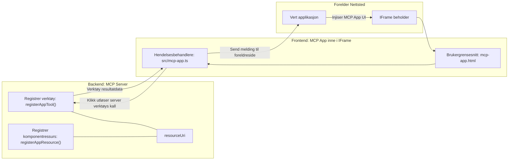

# MCP-apper

MCP-apper er et nytt paradigme i MCP. Ideen er at du ikke bare svarer med data fra et verktøysanrop, men også gir informasjon om hvordan denne informasjonen skal kunne interageres med. Det betyr at verktøyresultater nå kan inneholde UI-informasjon. Hvorfor skulle vi ønske det? Vel, tenk på hvordan du gjør ting i dag. Du konsumerer sannsynligvis resultatene fra en MCP-server ved å sette en slags frontend foran den, det er kode du må skrive og vedlikeholde. Noen ganger er det det du ønsker, men noen ganger hadde det vært flott om du bare kunne ta inn et utdrag av informasjon som er selvstendig og har alt fra data til brukergrensesnitt.

## Oversikt

Denne leksjonen gir praktisk veiledning om MCP-apper, hvordan komme i gang med det, og hvordan integrere det i dine eksisterende nettapper. MCP-apper er en veldig ny tillegg til MCP-standarden.

## Læringsmål

Etter denne leksjonen vil du kunne:

- Forklare hva MCP-apper er.
- Når du skal bruke MCP-apper.
- Bygge og integrere dine egne MCP-apper.

## MCP-apper – hvordan fungerer det

Ideen med MCP-apper er å tilby et svar som i realiteten er en komponent som skal rendres. En slik komponent kan ha både visuelle elementer og interaktivitet, f.eks. knappetrykk, brukerinput og mer. La oss starte med serversiden og vår MCP-server. For å lage en MCP-app-komponent må du lage et verktøy, men også applikasjonsressursen. Disse to delene knyttes sammen via en resourceUri.

Her er et eksempel. La oss prøve å visualisere hva som er involvert og hvilke deler som gjør hva:

```text
server.ts -- responsible for registering tools and the component as a UI component
src/
  mcp-app.ts -- wiring up event handlers
mcp-app.html -- the user interface
```
  
Denne visualiseringen beskriver arkitekturen for å lage en komponent og dens logikk.


La oss prøve å beskrive ansvarsområdene for backend og frontend henholdsvis.

### Backend

Det er to ting vi må få til her:

- Registrere verktøyene vi ønsker å samhandle med.
- Definere komponenten.

**Registrere verktøyet**

```typescript
registerAppTool(
    server,
    "get-time",
    {
      title: "Get Time",
      description: "Returns the current server time.",
      inputSchema: {},
      _meta: { ui: { resourceUri } }, // Knytter dette verktøyet til dets UI-ressurs
    },
    async () => {
      const time = new Date().toISOString();
      return { content: [{ type: "text", text: time }] };
    },
  );

```
  
Koden ovenfor beskriver oppførselen, hvor den eksponerer et verktøy kalt `get-time`. Det tar ingen input, men produserer nåværende tid. Vi har mulighet til å definere et `inputSchema` for verktøy der vi må kunne motta brukerinput.

**Registrere komponenten**

I samme fil må vi også registrere komponenten:

```typescript
const resourceUri = "ui://get-time/mcp-app.html";

// Registrer ressursen, som returnerer den bundne HTML/JavaScript for brukergrensesnittet.
registerAppResource(
  server,
  resourceUri,
  resourceUri,
  { mimeType: RESOURCE_MIME_TYPE },
  async () => {
    const html = await fs.readFile(path.join(DIST_DIR, "mcp-app.html"), "utf-8");

    return {
    contents: [
        { uri: resourceUri, mimeType: RESOURCE_MIME_TYPE, text: html },
    ],
    };
  },
);
```
  
Legg merke til hvordan vi nevner `resourceUri` for å knytte komponenten til verktøyene sine. Interessant er også callbacken hvor vi laster UI-filen og returnerer komponenten.

### Komponentens frontend

Akkurat som backend, er det to deler her:

- En frontend skrevet i ren HTML.
- Kode som håndterer hendelser og hva som skal gjøres, f.eks. kalle verktøy eller sende meldinger til overordnet vindu.

**Brukergrensesnitt**

La oss se på brukergrensesnittet.

```html
<!-- mcp-app.html -->
<!DOCTYPE html>
<html lang="en">
  <head>
    <meta charset="UTF-8" />
    <title>Get Time App</title>
  </head>
  <body>
    <p>
      <strong>Server Time:</strong> <code id="server-time">Loading...</code>
    </p>
    <button id="get-time-btn">Get Server Time</button>
    <script type="module" src="/src/mcp-app.ts"></script>
  </body>
</html>
```
  
**Hendelsesoppsett**

Det siste er hendelsesoppsettet. Det betyr at vi identifiserer hvilken del av UI-et vårt som trenger hendelseshåndterere og hva som skal skje når hendelser trigges:

```typescript
// mcp-app.ts

import { App } from "@modelcontextprotocol/ext-apps";

// Hent elementreferanser
const serverTimeEl = document.getElementById("server-time")!;
const getTimeBtn = document.getElementById("get-time-btn")!;

// Opprett appinstans
const app = new App({ name: "Get Time App", version: "1.0.0" });

// Håndter verktøyresultater fra serveren. Sett før `app.connect()` for å unngå
// å gå glipp av det innledende verktøyresultatet.
app.ontoolresult = (result) => {
  const time = result.content?.find((c) => c.type === "text")?.text;
  serverTimeEl.textContent = time ?? "[ERROR]";
};

// Koble til knappetrykk
getTimeBtn.addEventListener("click", async () => {
  // `app.callServerTool()` lar UI be om ferske data fra serveren
  const result = await app.callServerTool({ name: "get-time", arguments: {} });
  const time = result.content?.find((c) => c.type === "text")?.text;
  serverTimeEl.textContent = time ?? "[ERROR]";
});

// Koble til vert
app.connect();
```
  
Som du kan se fra ovenfor, er dette vanlig kode for å koble DOM-elementer til hendelser. Viktig å nevne er kallet til `callServerTool` som ender opp med å kalle et verktøy på backend.

## Håndtering av brukerinput

Så langt har vi sett en komponent som har en knapp som når den klikkes kaller et verktøy. La oss se om vi kan legge til flere UI-elementer som et inndatafelt og om vi kan sende argumenter til et verktøy. La oss implementere en FAQ-funksjon. Slik skal det fungere:

- Det skal være en knapp og et inndataelement hvor brukeren skriver inn et søkeord, for eksempel "Shipping". Dette skal kalle et verktøy på backend som søker i FAQ-dataene.
- Et verktøy som støtter den nevnte FAQ-søkefunksjonen.

La oss legge til nødvendig støtte i backend først:

```typescript
const faq: { [key: string]: string } = {
    "shipping": "Our standard shipping time is 3-5 business days.",
    "return policy": "You can return any item within 30 days of purchase.",
    "warranty": "All products come with a 1-year warranty covering manufacturing defects.",
  }

registerAppTool(
    server,
    "get-faq",
    {
      title: "Search FAQ",
      description: "Searches the FAQ for relevant answers.",
      inputSchema: zod.object({
        query: zod.string().default("shipping"),
      }),
      _meta: { ui: { resourceUri: faqResourceUri } }, // Knytt dette verktøyet til dets UI-ressurs
    },
    async ({ query }) => {
      const answer: string = faq[query.toLowerCase()] || "Sorry, I don't have an answer for that.";
      return { content: [{ type: "text", text: answer }] };
    },
  );
```
  
Det vi ser her er hvordan vi fyller ut `inputSchema` og gir det et `zod`-skjema slik:

```typescript
inputSchema: zod.object({
  query: zod.string().default("shipping"),
})
```
  
I skjemaet ovenfor erklærer vi at vi har en inndatapararmeter kalt `query` og at den er valgfri med standardverdien "shipping".

Ok, la oss gå videre til *mcp-app.html* for å se hvilket UI vi må lage for dette:

```html
<div class="faq">
    <h1>FAQ response</h1>
    <p>FAQ Response: <code id="faq-response">Loading...</code></p>
    <input type="text" id="faq-query" placeholder="Enter FAQ query" />
    <button id="get-faq-btn">Get FAQ Response</button>
  </div>
```
  
Flott, nå har vi et inndataelement og knapp. La oss gå til *mcp-app.ts* for å knytte disse hendelsene:

```typescript
const getFaqBtn = document.getElementById("get-faq-btn")!;
const faqQueryInput = document.getElementById("faq-query") as HTMLInputElement;

getFaqBtn.addEventListener("click", async () => {
  const query = faqQueryInput.value;
  const result = await app.callServerTool({ name: "get-faq", arguments: { query } });
  const faq = result.content?.find((c) => c.type === "text")?.text;
  faqResponseEl.textContent = faq ?? "[ERROR]";
});
```
  
I koden over:

- Oppretter vi referanser til de interaktive UI-elementene.
- Håndterer knappetrykk for å hente ut verdien fra inndataboksen, og kaller `app.callServerTool()` med `name` og `arguments` hvor det siste sender `query` som verdi.

Det som faktisk skjer når du kaller `callServerTool` er at den sender en melding til overordnet vindu, og det vinduet ender opp med å kalle MCP-serveren.

### Prøv det

Ved å prøve dette bør vi nå se følgende:


og her prøver vi med input som "warranty"


For å kjøre denne koden, gå til [Code section](./code/README.md)

## Testing i Visual Studio Code

Visual Studio Code har god støtte for MCP-apper og er sannsynligvis en av de enkleste måtene å teste MCP-appene dine på. For å bruke Visual Studio Code, legg til en serveroppføring i *mcp.json* slik:

```json
"my-mcp-server-7178eca7": {
    "url": "http://localhost:3001/mcp",
    "type": "http"
  }
```
  
Deretter starter du serveren, og du skal kunne kommunisere med MCP-appen din gjennom Chatteditoren dersom du har GitHub Copilot installert.

Du kan trigge det via en prompt, for eksempel "#get-faq":


Og akkurat som når du kjørte det i en nettleser, rendres det på samme måte slik:


## Oppgave

Lag et stein-saks-papir-spill. Det skal bestå av følgende:

UI:

- en nedtrekksliste med valg
- en knapp for å sende inn valg
- en etikett som viser hvem som valgte hva og hvem som vant

Server:

- skal ha et verktøy for stein-saks-papir som tar "choice" som input. Det skal også generere et datavalgt valg og avgjøre vinneren

## Løsning

[Løsning](./assignment/README.md)

## Oppsummering

Vi lærte om det nye paradigmet MCP-apper. Det er et nytt paradigme som lar MCP-servere ha en mening om ikke bare dataene, men også hvordan disse dataene skal presenteres.

I tillegg lærte vi at disse MCP-appene hostes i et IFrame, og for å kommunisere med MCP-servere må de sende meldinger til den overordnede webappen. Det finnes flere biblioteker der ute for både vanlig JavaScript, React og mer som gjør denne kommunikasjonen enklere.

## Viktige punkter

Her er hva du lærte:

- MCP-apper er en ny standard som kan være nyttig når du vil levere både data og UI-funksjoner.
- Denne typen apper kjører i et IFrame av sikkerhetsgrunner.

## Hva kommer nå

- [Kapittel 4](../../04-PracticalImplementation/README.md)

---

<!-- CO-OP TRANSLATOR DISCLAIMER START -->
**Ansvarsfraskrivelse**:
Dette dokumentet er oversatt ved hjelp av AI-oversettelsestjenesten [Co-op Translator](https://github.com/Azure/co-op-translator). Selv om vi streber etter nøyaktighet, vennligst vær klar over at automatiserte oversettelser kan inneholde feil eller unøyaktigheter. Det opprinnelige dokumentet på dets originale språk skal anses som den autoritative kilden. For kritisk informasjon anbefales profesjonell menneskelig oversettelse. Vi er ikke ansvarlige for eventuelle misforståelser eller feiltolkninger som oppstår ved bruk av denne oversettelsen.
<!-- CO-OP TRANSLATOR DISCLAIMER END -->