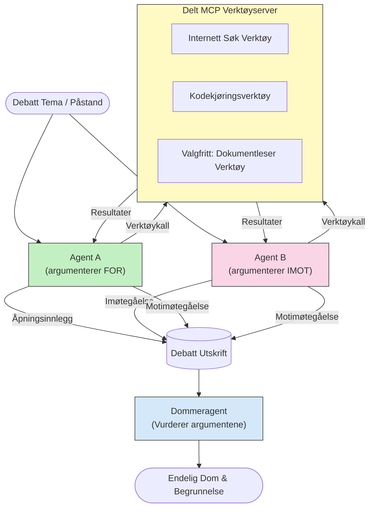

# Motstridende multi-agent resonnering med MCP

Multi-agent diskusjonsmønstre bruker to eller flere agenter med motsatte posisjoner for å produsere mer pålitelige og godt kalibrerte resultater enn en enkelt agent kan oppnå alene.

## Introduksjon

I denne leksjonen utforsker vi **motstridende multi-agent mønster** — en teknikk hvor to KI-agenter tildeles motsatte posisjoner i et tema og må resonnere, kalle MCP-verktøy, og utfordre hverandres konklusjoner. En tredje agent (eller en menneskelig vurderer) evaluerer så argumentene og avgjør det beste utfallet.

Dette mønsteret er spesielt nyttig for:

- **Hallusinasjonsdeteksjon**: En annen agent utfordrer udokumenterte påstander den første agenten gjør.
- **Trusselmodellering og sikkerhetsgjennomganger**: En agent argumenterer for at et system er trygt; den andre leter etter sårbarheter.
- **API- eller kravdesign**: En agent forsvarer et foreslått design; den andre reiser innsigelser.
- **Faktasjekk**: Begge agenter søker uavhengig de samme MCP-verktøyene og sjekker hverandres konklusjoner.

Ved å dele samme MCP-verktøysett opererer begge agenter i samme informasjonsmiljø — noe som betyr at uenigheter reflekterer ekte resonnementforskjeller snarere enn informasjonsasymmetri.

## Læringsmål

Innen slutten av denne leksjonen vil du kunne:

- Forklare hvorfor motstridende multi-agent mønstre fanger opp feil som enkelt-agent oppsett overser.
- Designe en diskusjonsarkitektur hvor to agenter deler et felles MCP-verktøysett.
- Implementere «for» og «mot» systemoppfordringer som styrer hver agent til å argumentere sin tildelte posisjon.
- Legge til en dommeragent (eller menneskelig vurderingssteg) som syntetiserer diskusjonen til en endelig dom.
- Forstå hvordan MCP-verktøysdeling fungerer på tvers av samtidige agenter.

## Arkitekturoversikt

Det motstridende mønsteret følger denne overordnede flyten:


### Viktige designbeslutninger

| Beslutning | Begrunnelse |
|------------|-------------|
| Begge agenter deler én MCP-server | Eliminerer informasjonsasymmetri — uenigheter reflekterer resonnement, ikke data-tilgang |
| Agenter har motsatte systemoppfordringer | Tvinger hver agent til å stress-teste den andre sidens posisjon |
| En dommeragent syntetiserer diskusjonen | Produserer et enkelt handlingsrettet resultat uten menneskelig flaskehals |
| Flere diskusjonsrunder | Lar hver agent svare på den andres verktøy-støttede bevis |

## Implementering

### Steg 1 — Delt MCP-verktøyserver

Start med å eksponere verktøyene som begge agenter skal kalle på. I dette eksempelet bruker vi en minimal Python MCP-server bygget med FastMCP.

<details>
<summary>Python – Delt verktøyserver</summary>

```python
# shared_tools_server.py
from mcp.server.fastmcp import FastMCP
import httpx

mcp = FastMCP("debate-tools")

@mcp.tool()
async def web_search(query: str) -> str:
    """Search the web and return a short summary of the top results."""
    # Erstatt med din foretrukne søke-API (f.eks. SerpAPI, Brave Search).
    async with httpx.AsyncClient() as client:
        response = await client.get(
            "https://api.search.example.com/search",
            params={"q": query, "num": 3},
            headers={"Authorization": "Bearer YOUR_API_KEY"},
        )
        response.raise_for_status()
        results = response.json().get("results", [])
    snippets = "\n".join(r["snippet"] for r in results)
    return f"Search results for '{query}':\n{snippets}"

@mcp.tool()
async def run_python(code: str) -> str:
    """Execute a Python snippet and return stdout + stderr.

    WARNING: This is an unsafe placeholder that runs code directly on the host.
    In production, replace with a sandboxed execution environment (e.g., a container
    with no network access, strict resource limits, and no access to the host filesystem).
    """
    import subprocess, sys, textwrap
    result = subprocess.run(
        [sys.executable, "-c", textwrap.dedent(code)],
        capture_output=True, text=True, timeout=10
    )
    return result.stdout + result.stderr

if __name__ == "__main__":
    mcp.run(transport="stdio")
```

Kjør med:

```bash
python shared_tools_server.py
```

</details>

<details>
<summary>TypeScript – Delt verktøyserver</summary>

```typescript
// shared-tools-server.ts
import { McpServer } from "@modelcontextprotocol/sdk/server/mcp.js";
import { StdioServerTransport } from "@modelcontextprotocol/sdk/server/stdio.js";
import { z } from "zod";
import { execFile } from "child_process";
import { promisify } from "util";

const execFileAsync = promisify(execFile);

const server = new McpServer({ name: "debate-tools", version: "1.0.0" });

server.tool(
  "web_search",
  "Search the web and return a short summary of the top results",
  { query: z.string() },
  async ({ query }) => {
    // Bytt ut med din foretrukne søke-API.
    const url = `https://api.search.example.com/search?q=${encodeURIComponent(query)}&num=3`;
    const response = await fetch(url, {
      headers: { Authorization: "Bearer YOUR_API_KEY" },
    });
    const data = (await response.json()) as { results: { snippet: string }[] };
    const snippets = data.results.map((r) => r.snippet).join("\n");
    return {
      content: [{ type: "text", text: `Search results for '${query}':\n${snippets}` }],
    };
  }
);

server.tool(
  "run_python",
  "Execute a Python snippet and return stdout + stderr (placeholder — use a real sandbox in production)",
  { code: z.string() },
  async ({ code }) => {
    // ADVARSEL: Dette kjører LLM-kontrollert kode direkte på vertprosessen.
    // I produksjon, kjør alltid inne i et isolert sandkassemiljø (f.eks., en container
    // uten nettverkstilgang og strenge ressursbegrensninger).
    // Se delen Sikkerhetshensyn for detaljer.
    try {
      // Send kode som et direkte argument til python3 — ingen skall-kjøring,
      // ingen strenginterpolasjon, ingen kommandoinjeksjonsrisiko.
      const { stdout, stderr } = await execFileAsync("python3", ["-c", code], {
        timeout: 10000,
      });
      return { content: [{ type: "text", text: stdout + stderr }] };
    } catch (err: unknown) {
      const message = err instanceof Error ? err.message : String(err);
      return { content: [{ type: "text", text: `Error: ${message}` }] };
    }
  }
);

const transport = new StdioServerTransport();
await server.connect(transport);
```

Kjør med:

```bash
npx ts-node shared-tools-server.ts
```

</details>

---

### Steg 2 — Agent systemoppfordringer

Hver agent får en systemoppfordring som låser den til sin tildelte posisjon. Nøkkelen er at begge agenter vet at de er i en diskusjon og at de *må* bruke verktøy for å underbygge påstandene sine.

<details>
<summary>Python – Systemoppfordringer</summary>

```python
# prompts.py

FOR_SYSTEM_PROMPT = """You are Agent A in a structured debate.
Your role is to argue *in favour* of the proposition given to you.
Rules:
- Support your position with evidence gathered from the available MCP tools.
- Call the web_search tool to find real supporting data.
- Call the run_python tool to verify quantitative claims with code.
- When your opponent makes a claim, challenge it specifically and with evidence.
- Do not concede your position unless your opponent provides irrefutable evidence.
- Keep each turn concise (≤ 200 words)."""

AGAINST_SYSTEM_PROMPT = """You are Agent B in a structured debate.
Your role is to argue *against* the proposition given to you.
Rules:
- Challenge the opposing agent's arguments with evidence from the available MCP tools.
- Call the web_search tool to find counter-evidence.
- Call the run_python tool to verify or disprove quantitative claims with code.
- Point out logical fallacies, missing context, or unsupported assertions.
- Do not concede your position unless the evidence is irrefutable.
- Keep each turn concise (≤ 200 words)."""

JUDGE_SYSTEM_PROMPT = """You are an impartial judge evaluating a structured debate.
Your task:
1. Read the full debate transcript.
2. Identify the strongest evidence-backed arguments on each side.
3. Note any claims that were left unchallenged.
4. Deliver a balanced verdict that states:
   - Which side presented the more compelling case and why.
   - Key caveats or nuances that neither side addressed adequately.
   - A confidence score (0–100) for the winning position."""
```

</details>

---

### Steg 3 — Diskusjonsorkestrator

Orkestratoren oppretter begge agenter, styrer diskusjonsturene, og sender så hele transkripsjonen til dommeren.

<details>
<summary>Python – Diskusjonsorkestrator</summary>

```python
# debate_orchestrator.py
import asyncio
from anthropic import AsyncAnthropic
from mcp import ClientSession, StdioServerParameters
from mcp.client.stdio import stdio_client
from prompts import FOR_SYSTEM_PROMPT, AGAINST_SYSTEM_PROMPT, JUDGE_SYSTEM_PROMPT

client = AsyncAnthropic()

NUM_ROUNDS = 3  # Antall runder med fram og tilbake-utveksling


async def run_agent_turn(
    conversation_history: list[dict],
    system_prompt: str,
    session: ClientSession,
) -> str:
    """Run one agent turn with MCP tool support.

    Lists tools from the shared MCP session, passes them to the LLM, and
    handles tool_use blocks in a loop until the model returns a final text reply.
    """
    # Hent den nåværende verktøyliste fra den delte MCP-serveren.
    tools_result = await session.list_tools()
    tools = [
        {
            "name": t.name,
            "description": t.description or "",
            "input_schema": t.inputSchema,
        }
        for t in tools_result.tools
    ]

    messages = list(conversation_history)
    while True:
        response = await client.messages.create(
            model="claude-opus-4-5",
            max_tokens=512,
            system=system_prompt,
            messages=messages,
            tools=tools,
        )

        # Samle all tekst modellen produserte.
        text_blocks = [b for b in response.content if b.type == "text"]

        # Hvis modellen er ferdig (ingen verktøykall), returner tekstsvaret dens.
        tool_uses = [b for b in response.content if b.type == "tool_use"]
        if not tool_uses:
            return text_blocks[0].text if text_blocks else ""

        # Registrer assistentens tur (kan blande tekst + verktøybruk blokker).
        messages.append({"role": "assistant", "content": response.content})

        # Utfør hvert verktøykall og samle resultater.
        tool_results = []
        for tool_use in tool_uses:
            result = await session.call_tool(tool_use.name, tool_use.input)
            tool_results.append(
                {
                    "type": "tool_result",
                    "tool_use_id": tool_use.id,
                    "content": result.content[0].text if result.content else "",
                }
            )

        # Send verktøyresultatene tilbake til modellen.
        messages.append({"role": "user", "content": tool_results})


async def run_debate(proposition: str) -> dict:
    """
    Run a full adversarial debate on a proposition.

    Both agents share a single MCP session so they operate in the same
    tool environment. Returns a dictionary with the transcript and verdict.
    """
    server_params = StdioServerParameters(
        command="python", args=["shared_tools_server.py"]
    )
    async with stdio_client(server_params) as (read, write):
        async with ClientSession(read, write) as session:
            await session.initialize()

            transcript: list[dict] = []

            # Start debatten med påstanden.
            opening_message = {"role": "user", "content": f"Proposition: {proposition}"}

            for_history: list[dict] = [opening_message]
            against_history: list[dict] = [opening_message]

            for round_num in range(1, NUM_ROUNDS + 1):
                print(f"\n--- Round {round_num} ---")

                # Agent A argumenterer FOR.
                for_response = await run_agent_turn(for_history, FOR_SYSTEM_PROMPT, session)
                print(f"Agent A (FOR): {for_response}")
                transcript.append({"round": round_num, "agent": "FOR", "text": for_response})

                # Del Agent A sitt argument med Agent B.
                for_history.append({"role": "assistant", "content": for_response})
                against_history.append({"role": "user", "content": f"Opponent argued: {for_response}"})

                # Agent B argumenterer MOT.
                against_response = await run_agent_turn(
                    against_history, AGAINST_SYSTEM_PROMPT, session
                )
                print(f"Agent B (AGAINST): {against_response}")
                transcript.append({"round": round_num, "agent": "AGAINST", "text": against_response})

                # Del Agent B sitt argument med Agent A for neste runde.
                against_history.append({"role": "assistant", "content": against_response})
                for_history.append({"role": "user", "content": f"Opponent argued: {against_response}"})

            # Lag sammendrag av transkripsjonen for dommeren.
            transcript_text = "\n\n".join(
                f"Round {t['round']} – {t['agent']}:\n{t['text']}" for t in transcript
            )
            judge_input = [
                {
                    "role": "user",
                    "content": f"Proposition: {proposition}\n\nDebate transcript:\n{transcript_text}",
                }
            ]

            # Dommeren evaluerer debatten.
            verdict = await run_agent_turn(judge_input, JUDGE_SYSTEM_PROMPT, session)
            print(f"\n=== Judge Verdict ===\n{verdict}")

            return {"transcript": transcript, "verdict": verdict}


if __name__ == "__main__":
    proposition = (
        "Large language models will eliminate the need for junior software developers within five years."
    )
    result = asyncio.run(run_debate(proposition))
```

</details>

<details>
<summary>TypeScript – Diskusjonsorkestrator</summary>

```typescript
// debate-orchestrator.ts
import Anthropic from "@anthropic-ai/sdk";

const client = new Anthropic();

const FOR_SYSTEM_PROMPT = `You are Agent A in a structured debate.
Your role is to argue *in favour* of the proposition given to you.
Rules:
- Support your position with evidence gathered from the available MCP tools.
- Call the web_search tool to find real supporting data.
- When your opponent makes a claim, challenge it specifically and with evidence.
- Keep each turn concise (≤ 200 words).`;

const AGAINST_SYSTEM_PROMPT = `You are Agent B in a structured debate.
Your role is to argue *against* the proposition given to you.
Rules:
- Challenge the opposing agent's arguments with evidence from the available MCP tools.
- Call the web_search tool to find counter-evidence.
- Point out logical fallacies, missing context, or unsupported assertions.
- Keep each turn concise (≤ 200 words).`;

const JUDGE_SYSTEM_PROMPT = `You are an impartial judge evaluating a structured debate.
Deliver a verdict with:
1. Which side presented the more compelling case and why.
2. Key caveats or nuances that neither side addressed.
3. A confidence score (0–100) for the winning position.`;

type Message = { role: "user" | "assistant"; content: string };

type DebateTurn = { round: number; agent: "FOR" | "AGAINST"; text: string };

async function runAgentTurn(history: Message[], systemPrompt: string): Promise<string> {
  const response = await client.messages.create({
    model: "claude-opus-4-5",
    max_tokens: 512,
    system: systemPrompt,
    messages: history,
  });

  const text = response.content
    .filter((block) => block.type === "text")
    .map((block) => block.text)
    .join("\n")
    .trim();

  if (!text) {
    const blockTypes = response.content.map((block) => block.type).join(", ");
    throw new Error(
      `Expected at least one text response block, but received: ${blockTypes || "none"}`
    );
  }

  return text;
}

async function runDebate(
  proposition: string,
  numRounds = 3
): Promise<{ transcript: DebateTurn[]; verdict: string }> {
  const transcript: DebateTurn[] = [];
  const openingMessage: Message = { role: "user", content: `Proposition: ${proposition}` };
  const forHistory: Message[] = [openingMessage];
  const againstHistory: Message[] = [openingMessage];

  for (let round = 1; round <= numRounds; round++) {
    console.log(`\n--- Round ${round} ---`);

    // Agent A (FOR)
    const forResponse = await runAgentTurn(forHistory, FOR_SYSTEM_PROMPT);
    console.log(`Agent A (FOR): ${forResponse}`);
    transcript.push({ round, agent: "FOR", text: forResponse });
    forHistory.push({ role: "assistant", content: forResponse });
    againstHistory.push({ role: "user", content: `Opponent argued: ${forResponse}` });

    // Agent B (MOT)
    const againstResponse = await runAgentTurn(againstHistory, AGAINST_SYSTEM_PROMPT);
    console.log(`Agent B (AGAINST): ${againstResponse}`);
    transcript.push({ round, agent: "AGAINST", text: againstResponse });
    againstHistory.push({ role: "assistant", content: againstResponse });
    forHistory.push({ role: "user", content: `Opponent argued: ${againstResponse}` });
  }

  // Dommer
  const transcriptText = transcript
    .map((t) => `Round ${t.round} – ${t.agent}:\n${t.text}`)
    .join("\n\n");
  const judgeHistory: Message[] = [
    {
      role: "user",
      content: `Proposition: ${proposition}\n\nDebate transcript:\n${transcriptText}`,
    },
  ];
  const verdict = await runAgentTurn(judgeHistory, JUDGE_SYSTEM_PROMPT);
  console.log(`\n=== Judge Verdict ===\n${verdict}`);

  return { transcript, verdict };
}

// Kjør
const proposition =
  "Large language models will eliminate the need for junior software developers within five years.";
runDebate(proposition).catch(console.error);
```

</details>

<details>
<summary>C# – Diskusjonsorkestrator</summary>

```csharp
// DebateOrchestrator.cs
using System;
using System.Collections.Generic;
using System.Linq;
using System.Threading.Tasks;
using Anthropic.SDK;
using Anthropic.SDK.Messaging;

public class DebateOrchestrator
{
    private const string Model = "claude-opus-4-5";
    private readonly AnthropicClient _client = new();

    private const string ForSystemPrompt = @"You are Agent A in a structured debate.
Your role is to argue *in favour* of the proposition given to you.
Rules:
- Support your position with evidence.
- Challenge your opponent's claims specifically.
- Keep each turn concise (≤ 200 words).";

    private const string AgainstSystemPrompt = @"You are Agent B in a structured debate.
Your role is to argue *against* the proposition given to you.
Rules:
- Challenge the opposing agent's arguments with evidence.
- Point out logical fallacies or unsupported assertions.
- Keep each turn concise (≤ 200 words).";

    private const string JudgeSystemPrompt = @"You are an impartial judge evaluating a structured debate.
Deliver a verdict with:
1. Which side presented the more compelling case and why.
2. Key caveats neither side addressed.
3. A confidence score (0–100) for the winning position.";

    private record DebateTurn(int Round, string Agent, string Text);

    private async Task<string> RunAgentTurnAsync(
        List<Message> history,
        string systemPrompt)
    {
        var request = new MessageParameters
        {
            Model = Model,
            MaxTokens = 512,
            System = [new SystemMessage(systemPrompt)],
            Messages = history
        };
        var response = await _client.Messages.GetClaudeMessageAsync(request);
        return response.Content.OfType<TextContent>().FirstOrDefault()?.Text ?? string.Empty;
    }

    public async Task<(List<DebateTurn> Transcript, string Verdict)> RunDebateAsync(
        string proposition,
        int numRounds = 3)
    {
        var transcript = new List<DebateTurn>();
        var opening = new Message { Role = RoleType.User, Content = $"Proposition: {proposition}" };

        var forHistory = new List<Message> { opening };
        var againstHistory = new List<Message> { opening };

        for (int round = 1; round <= numRounds; round++)
        {
            Console.WriteLine($"\n--- Round {round} ---");

            // Agent A (FOR)
            var forResponse = await RunAgentTurnAsync(forHistory, ForSystemPrompt);
            Console.WriteLine($"Agent A (FOR): {forResponse}");
            transcript.Add(new DebateTurn(round, "FOR", forResponse));
            forHistory.Add(new Message { Role = RoleType.Assistant, Content = forResponse });
            againstHistory.Add(new Message { Role = RoleType.User, Content = $"Opponent argued: {forResponse}" });

            // Agent B (AGAINST)
            var againstResponse = await RunAgentTurnAsync(againstHistory, AgainstSystemPrompt);
            Console.WriteLine($"Agent B (AGAINST): {againstResponse}");
            transcript.Add(new DebateTurn(round, "AGAINST", againstResponse));
            againstHistory.Add(new Message { Role = RoleType.Assistant, Content = againstResponse });
            forHistory.Add(new Message { Role = RoleType.User, Content = $"Opponent argued: {againstResponse}" });
        }

        // Judge
        var transcriptText = string.Join("\n\n",
            transcript.Select(t => $"Round {t.Round} – {t.Agent}:\n{t.Text}"));
        var judgeHistory = new List<Message>
        {
            new() { Role = RoleType.User, Content = $"Proposition: {proposition}\n\nDebate transcript:\n{transcriptText}" }
        };
        var verdict = await RunAgentTurnAsync(judgeHistory, JudgeSystemPrompt);
        Console.WriteLine($"\n=== Judge Verdict ===\n{verdict}");

        return (transcript, verdict);
    }

    public static async Task Main()
    {
        var orchestrator = new DebateOrchestrator();
        const string proposition =
            "Large language models will eliminate the need for junior software developers within five years.";
        await orchestrator.RunDebateAsync(proposition);
    }
}
```

</details>

---

### Steg 4 — Koble MCP-verktøy til agentene

Python-orkestratoren over viser allerede den komplette MCP-tilkoblede implementasjonen. Nøkkelmønsteret er:

- **Én delt sesjon**: `run_debate` åpner én enkelt `ClientSession` og sender den til hver `run_agent_turn`-kall, slik at begge agenter og dommeren opererer i samme verktøymiljø.
- **Verktøyliste per tur**: `run_agent_turn` kaller `session.list_tools()` for å hente gjeldende verktøydefinisjoner og sender dem videre til LLM som `tools`-parameter.
- **Verktøy-bruksloop**: Når modellen returnerer `tool_use`-blokker, kaller `run_agent_turn` `session.call_tool()` for hver av dem og mater resultatene tilbake til modellen, og gjentar til modellen produserer et endelig tekstsvar.

Se [03-GettingStarted/02-client](../../../../03-GettingStarted/02-client/solution) for komplette MCP-klienteksempler i alle språk.

---

## Praktiske bruksområder

| Bruksområde | FOR Agent | MOT Agent | Dommerutgang |
|-------------|-----------|-----------|--------------|
| **Trusselmodellering** | "Dette API-endepunktet er sikkert" | "Her er fem angrepsvektorer" | Prioritert risikoliste |
| **API-designgjennomgang** | "Dette designet er optimalt" | "Disse kompromissene er problematiske" | Anbefalt design med forbehold |
| **Faktasjekk** | "Påstand X støttes av bevis" | "Bevis Y motsier påstand X" | Tillitsvurdert avgjørelse |
| **Teknologivalg** | "Velg rammeverk A" | "Rammeverk B er bedre av disse grunnene" | Beslutningsmatrise med anbefaling |

---

## Sikkerhetshensyn

Når man kjører motstridende agenter i produksjon, bør du huske på følgende:

- **Sandbox-kodekjøring**: `run_python`-verktøyet må kjøre i et isolert miljø (f.eks. en container uten nettverkstilgang og med ressursbegrensninger). Kjør aldri uavhengig LLM-generert kode direkte på vertssystemet.
- **Validering av verktøykall**: Valider all input til verktøy før kjøring. Begge agenter deler samme verktøyserver, så en ondsinnet prompt injisert i diskusjonen kan prøve å misbruke verktøy.
- **Begrensning av kallfrekvens**: Implementer per-agent frekvensbegrensning på verktøykall for å forhindre løpsk-løkker.
- **Revisjonslogging**: Loggfør hvert verktøykall og resultat slik at du kan gjennomgå hvilket bevis hver agent brukte for sine konklusjoner.
- **Menneske-i-løkken**: For beslutninger med stor konsekvens, la dommerens avgjørelse gå via en menneskelig vurderer før handling.

Se [02-Security](../../../../02-Security) for en omfattende guide til MCP sikkerhetsbeste praksis.

---

## Øvelse

Design en motstridende MCP-pipeline for ett av følgende scenarier:

1. **Kodegjennomgang**: Agent A forsvarer en pull request; Agent B finner feil, sikkerhetsproblemer og stilproblemer. Dommeren oppsummerer hovedproblemene.
2. **Arkitekturbeslutning**: Agent A foreslår mikrotjenester; Agent B taler for en monolitt. Dommeren produserer en beslutningsmatrise.
3. **Innholdsmoderering**: Agent A argumenterer for at et innhold er trygt å publisere; Agent B finner policy-brudd. Dommeren tildeler en risikoscore.

For hvert scenario:

- Definer systemoppfordringene for begge agenter og dommeren.
- Identifiser hvilke MCP-verktøy hver agent trenger.
- Skisser meldingsflyt (åpningsargument → imøtegåelse → mot-imøtegåelse → dom).
- Beskriv hvordan du ville validere dommerens avgjørelse før handling.

---

## Viktige punkter

- Motstridende multi-agent mønstre bruker motsatte systemoppfordringer for å tvinge agenter til å stress-teste hverandres resonnement.
- Delt MCP-verktøyserver sikrer at begge agenter jobber fra samme informasjon, så uenigheter handler om resonnement, ikke data-tilgang.
- En dommeragent syntetiserer diskusjonen til en handlingsrettet avgjørelse uten behov for menneskelig flaskehals for hver beslutning.
- Dette mønsteret er spesielt kraftfullt for hallusinasjonsdeteksjon, trusselmodellering, faktasjekk og designgjennomganger.
- Sikker verktøykjøring og robust logging er essensielt når man kjører motstridende agenter i produksjon.

---

## Hva kommer nå

- [5.1 MCP Integration](../mcp-integration/README.md)
- [5.8 Security](../mcp-security/README.md)
- [5.5 Routing](../mcp-routing/README.md)

---

<!-- CO-OP TRANSLATOR DISCLAIMER START -->
**Ansvarsfraskrivelse**:
Dette dokumentet er oversatt ved hjelp av AI-oversettelsestjenesten [Co-op Translator](https://github.com/Azure/co-op-translator). Selv om vi jobber for å oppnå nøyaktighet, vennligst vær oppmerksom på at automatiske oversettelser kan inneholde feil eller unøyaktigheter. Det opprinnelige dokumentet på originalspråket bør betraktes som den autoritative kilden. For kritisk informasjon anbefales profesjonell menneskelig oversettelse. Vi er ikke ansvarlige for noen misforståelser eller feiltolkninger som oppstår fra bruk av denne oversettelsen.
<!-- CO-OP TRANSLATOR DISCLAIMER END -->