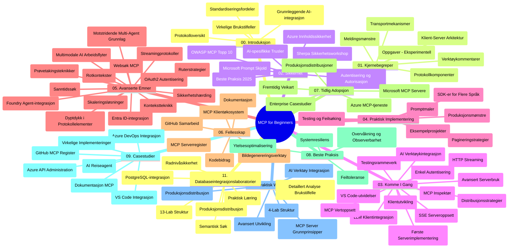

# Model Context Protocol (MCP) for nybegynnere - Studieveiledning

Denne studieveiledningen gir en oversikt over mappestrukturen og innholdet i "Model Context Protocol (MCP) for nybegynnere"-pensumet. Bruk denne veiledningen for å navigere i depotet effektivt og få mest mulig ut av de tilgjengelige ressursene.

## Depotoversikt

Model Context Protocol (MCP) er et standardisert rammeverk for interaksjoner mellom AI-modeller og klientapplikasjoner. Opprinnelig opprettet av Anthropic, vedlikeholdes MCP nå av det bredere MCP-fellesskapet gjennom den offisielle GitHub-organisasjonen. Dette depotet tilbyr en omfattende læreplan med praktiske kodeeksempler i C#, Java, JavaScript, Python og TypeScript, designet for AI-utviklere, systemarkitekter og programvareingeniører.

## Visuelt pensumkart

## Depotstruktur

Depotet er organisert i elleve hovedseksjoner, hver med fokus på ulike aspekter av MCP:

1. **Introduksjon (00-Introduction/)**
   - Oversikt over Model Context Protocol
   - Hvorfor standardisering er viktig i AI-pipelines
   - Praktiske bruksområder og fordeler

2. **Kjernebegreper (01-CoreConcepts/)**
   - Klient-server-arkitektur
   - Viktige protokollkomponenter
   - Meldingsmønstre i MCP

3. **Sikkerhet (02-Security/)**
   - Sikkerhetstrusler i MCP-baserte systemer
   - Beste praksis for å sikre implementasjoner
   - Autentiserings- og autorisasjonsstrategier
   - **Omfattende sikkerhetsdokumentasjon**:
     - MCP Sikkerhets beste praksis 2025
     - Azure Content Safety Implementasjonsguide
     - MCP Sikkerhetskontroller og teknikker
     - MCP Beste praksis rask referanse
   - **Viktige sikkerhetsemner**:
     - Prompt-injeksjon og verktøyforgiftingsangrep
     - Session hijacking og confused deputy-problemer
     - Sårbarheter ved token-gjennomgang
     - Overdrevne tillatelser og tilgangskontroll
     - Leverandørkjedesikkerhet for AI-komponenter
     - Microsoft Prompt Shields-integrasjon

4. **Komme i gang (03-GettingStarted/)**
   - Miljøoppsett og konfigurasjon
   - Opprette grunnleggende MCP-servere og -klienter
   - Integrasjon med eksisterende applikasjoner
   - Inneholder seksjoner for:
     - Første serverimplementasjon
     - Klientutvikling
     - LLM-klientintegrasjon
     - VS Code-integrasjon
     - Server-Sent Events (SSE)-server
     - Avansert serverbruk
     - HTTP-strømming
     - AI Toolkit-integrasjon
     - Teststrategier
     - Distribusjonsretningslinjer

5. **Praktisk implementering (04-PracticalImplementation/)**
   - Bruke SDK-er i forskjellige programmeringsspråk
   - Feilsøking, testing og valideringsmetoder
   - Lage gjenbrukbare promptmaler og arbeidsflyter
   - Eksempelsprosjekter med implementasjoner

6. **Avanserte emner (05-AdvancedTopics/)**
   - Konsteknikkteknikker
   - Foundry-agentintegrasjon
   - Multi-modal AI-arbeidsflyter
   - OAuth2-autentiseringsdemoer
   - Sanntidssøkfunksjoner
   - Sanntidsstrømming
   - Implementering av root contexts
   - Rutingsstrategier
   - Prøveteknikker
   - Skaleringsmetoder
   - Sikkerhetshensyn
   - Entra ID sikkerhetsintegrasjon
   - Websøk-integrasjon
   - Adversarial multi-agent reasoning (debattmønstre)

7. **Fellesskapsbidrag (06-CommunityContributions/)**
   - Hvordan bidra med kode og dokumentasjon
   - Samarbeid via GitHub
   - Fellesskapsdrevne forbedringer og tilbakemeldinger
   - Bruke ulike MCP-klienter (Claude Desktop, Cline, VSCode)
   - Arbeide med populære MCP-servere, inkludert bildegenerering

8. **Lærdom fra tidlig adopsjon (07-LessonsfromEarlyAdoption/)**
   - Reelle implementasjoner og suksesshistorier
   - Bygge og distribuere MCP-baserte løsninger
   - Trender og fremtidig veikart
   - **Microsoft MCP-serverguide**: Omfattende guide til 10 produksjonsklare Microsoft MCP-servere inkludert:
     - Microsoft Learn Docs MCP-server
     - Azure MCP-server (15+ spesialiserte tilkoblinger)
     - GitHub MCP-server
     - Azure DevOps MCP-server
     - MarkItDown MCP-server
     - SQL Server MCP-server
     - Playwright MCP-server
     - Dev Box MCP-server
     - Azure AI Foundry MCP-server
     - Microsoft 365 Agents Toolkit MCP-server

9. **Beste praksis (08-BestPractices/)**
   - Ytelsesjustering og optimalisering
   - Designe feiltolerante MCP-systemer
   - Test- og robusthetsstrategier

10. **Case-studier (09-CaseStudy/)**
    - **Sju omfattende case-studier** som demonstrerer MCPs allsidighet på tvers av ulike scenarioer:
    - **Azure AI Travel Agents**: Multi-agent orkestrering med Azure OpenAI og AI Search
    - **Azure DevOps-integrasjon**: Automatisering av arbeidsflytprosesser med YouTube-dataoppdateringer
    - **Sanntids dokumentasjonshenting**: Python-konsollklient med HTTP-strømming
    - **Interaktiv studieplansgenerator**: Chainlit web-app med samtalebasert AI
    - **Dokumentasjon i editor**: VS Code-integrasjon med GitHub Copilot-arbeidsflyter
    - **Azure API Management**: Enterprise API-integrasjon med MCP-serveroppretting
    - **GitHub MCP Registry**: Økosystemutvikling og agentisk integrasjonsplattform
    - Implementasjonseksempler som spenner fra enterprise-integrasjon, utviklerproduktivitet til økosystemutvikling

11. **Praktisk workshop (10-StreamliningAIWorkflowsBuildingAnMCPServerWithAIToolkit/)**
    - Omfattende praktisk workshop som kombinerer MCP med AI Toolkit
    - Bygge intelligente applikasjoner som knytter AI-modeller til virkelige verktøy
    - Praktiske moduler som dekker grunnleggende, egendefinert serverutvikling og produksjonsdistribusjonsstrategier
    - **Lab-struktur**:
      - Lab 1: MCP Server Grunnleggende
      - Lab 2: Avansert MCP Server Utvikling
      - Lab 3: AI Toolkit-integrasjon
      - Lab 4: Produksjonsdistribusjon og skalering
    - Lab-basert læringsmetode med trinnvise instruksjoner

12. **MCP Server Database Integrasjonslaboratorier (11-MCPServerHandsOnLabs/)**
    - **Omfattende 13-lab læringsløype** for å bygge produksjonsklare MCP-servere med PostgreSQL-integrasjon
    - **Reell detaljhandelsanalyseimplementasjon** med Zava Retail-brukstilfelle
    - **Enterprise-nivå mønstre** inkludert Row Level Security (RLS), semantisk søk og flerbruker data-tilgang
    - **Fullstendig labstruktur**:
      - **Labs 00-03: Grunnlag** - Introduksjon, arkitektur, sikkerhet, miljøoppsett
      - **Labs 04-06: Bygge MCP-server** - Databasedesign, MCP serverimplementasjon, verktøyutvikling
      - **Labs 07-09: Avanserte funksjoner** - Semantisk søk, testing & feilsøking, VS Code-integrasjon
      - **Labs 10-12: Produksjon & beste praksis** - Distribusjon, overvåkning, optimalisering
    - **Teknologier dekket**: FastMCP-rammeverk, PostgreSQL, Azure OpenAI, Azure Container Apps, Application Insights
    - **Læringsresultater**: Produksjonsklare MCP-servere, databseintegrasjonsmønstre, AI-drevet analyse, enterprise-sikkerhet

## Ekstra ressurser

Depotet inkluderer støtteressurser:

- **Bilder-mappe**: Inneholder diagrammer og illustrasjoner brukt gjennom pensumet
- **Oversettelser**: Flerspråklig støtte med automatiserte oversettelser av dokumentasjon
- **Offisielle MCP-ressurser**:
  - [MCP Dokumentasjon](https://modelcontextprotocol.io/)
  - [MCP Spesifikasjon](https://spec.modelcontextprotocol.io/)
  - [MCP GitHub-depot](https://github.com/modelcontextprotocol)

## Hvordan bruke dette depotet

1. **Sekvensiell læring**: Følg kapitlene i rekkefølge (00 til 11) for en strukturert læringsopplevelse.
2. **Språkspesifikt fokus**: Hvis du er interessert i et bestemt programmeringsspråk, utforsk sample-mappene for implementasjoner i ditt foretrukne språk.
3. **Praktisk implementering**: Start med "Komme i gang"-seksjonen for å sette opp miljøet og opprette din første MCP-server og klient.
4. **Avansert utforskning**: Når du er komfortabel med det grunnleggende, dykk inn i avanserte emner for å utvide kunnskapen.
5. **Fellesskapssamarbeid**: Bli med i MCP-fellesskapet gjennom GitHub-diskusjoner og Discord-kanaler for å koble til eksperter og medutviklere.

## MCP-klienter og verktøy

Pensumet dekker ulike MCP-klienter og verktøy:

1. **Offisielle klienter**:
   - Visual Studio Code
   - MCP i Visual Studio Code
   - Claude Desktop
   - Claude i VSCode
   - Claude API

2. **Fellesskapsklienter**:
   - Cline (terminalbasert)
   - Cursor (kodeeditor)
   - ChatMCP
   - Windsurf

3. **MCP-administrasjonsverktøy**:
   - MCP CLI
   - MCP Manager
   - MCP Linker
   - MCP Router

## Populære MCP-servere

Depotet introduserer ulike MCP-servere, inkludert:

1. **Offisielle Microsoft MCP-servere**:
   - Microsoft Learn Docs MCP-server
   - Azure MCP-server (15+ spesialiserte tilkoblinger)
   - GitHub MCP-server
   - Azure DevOps MCP-server
   - MarkItDown MCP-server
   - SQL Server MCP-server
   - Playwright MCP-server
   - Dev Box MCP-server
   - Azure AI Foundry MCP-server
   - Microsoft 365 Agents Toolkit MCP-server

2. **Offisielle referanseservere**:
   - Filesystem
   - Fetch
   - Memory
   - Sequential Thinking

3. **Bildegenerering**:
   - Azure OpenAI DALL-E 3
   - Stable Diffusion WebUI
   - Replicate

4. **Utviklingsverktøy**:
   - Git MCP
   - Terminal Control
   - Code Assistant

5. **Spesialiserte servere**:
   - Salesforce
   - Microsoft Teams
   - Jira & Confluence

## Bidrag

Dette depotet ønsker bidrag fra fellesskapet velkommen. Se delen Fellesskapsbidrag for veiledning om hvordan du effektivt kan bidra til MCP-økosystemet.

----

*Denne studieveiledningen ble sist oppdatert 5. februar 2026, og reflekterer den siste MCP Spesifikasjon 2025-11-25 og gir en oversikt over depotet per den dato. Depotinnhold kan bli oppdatert etter denne datoen.*

---

<!-- CO-OP TRANSLATOR DISCLAIMER START -->
**Ansvarsfraskrivelse**:
Dette dokumentet er oversatt ved bruk av AI-oversettelsestjenesten [Co-op Translator](https://github.com/Azure/co-op-translator). Selv om vi streber etter nøyaktighet, vennligst vær oppmerksom på at automatiserte oversettelser kan inneholde feil eller unøyaktigheter. Det originale dokumentet på sitt opprinnelige språk bør anses som den autoritative kilden. For kritisk informasjon anbefales profesjonell menneskelig oversettelse. Vi er ikke ansvarlige for eventuelle misforståelser eller feiltolkninger som oppstår ved bruk av denne oversettelsen.
<!-- CO-OP TRANSLATOR DISCLAIMER END -->