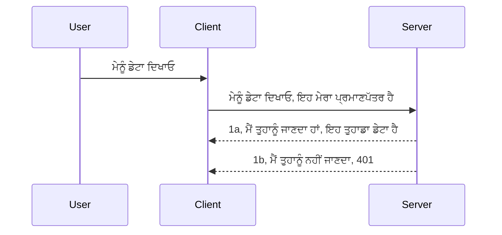

# Simple auth

MCP SDKs OAuth 2.1 ਦੇ ਵਰਤੋਂ ਨੂੰ ਸਹਿਯੋਗ ਦਿੰਦੇ ਹਨ ਜੋ ਕਿ ਇੱਕ ਭਾਰੀ ਪ੍ਰਕਿਰਿਆ ਹੈ ਜਿਸ ਵਿੱਚ auth ਸਰਵਰ, resource ਸਰਵਰ, ਗ੍ਰਹਿਣ ਪ੍ਰਮਾਣ ਪੱਤਰ ਭੇਜਣਾ, ਕੋਡ ਪ੍ਰਾਪਤ ਕਰਨਾ, ਕੋਡ ਨੂੰ bearer token ਨਾਲ ਬਦਲਣਾ ਸ਼ਾਮਲ ਹੈ ਜਦ ਤੱਕ ਤੁਸੀਂ ਅਖੀਰਕਾਰ ਆਪਣੇ resource ਡੇਟਾ ਨੂੰ ਪ੍ਰਾਪਤ ਨਹੀਂ ਕਰ ਲੈਂਦੇ। ਜੇ ਤੁਸੀਂ OAuth ਦੇ ਲਈ ਅਜਾਣ ਹੋ ਜੋ ਕਿ ਲਾਗੂ ਕਰਨ ਲਈ ਇੱਕ ਵਧੀਆ ਚੀਜ਼ ਹੈ, ਤਾਂ ਇਹ ਚੰਗਾ ਹੈ ਕਿ ਤੁਸੀਂ ਕੁਝ ਬੁਨਿਆਦੀ ਪੱਧਰ ਦੇ auth ਦੇ ਨਾਲ ਸ਼ੁਰੂ ਕਰੋ ਅਤੇ ਧੀਰੇ-ਧੀਰੇ ਵਧੀਆ ਸੁਰੱਖਿਆ ਤੱਕ ਪਹੁੰਚੋ। ਇਸ ਲਈ ਇਹ ਅધਿਆਇ ਮੌਜੂਦ ਹੈ, ਤਾਂ ਜੋ ਤੁਹਾਨੂੰ ਜ਼ਿਆਦਾ ਉन्नਤ auth ਤੱਕ ਲਿਜਾਇਆ ਜਾ ਸਕੇ।

## Auth, ਅਸੀਂ ਕੀ ਮਤਲਬ ਕਰਦੇ ਹਾਂ?

Auth ਦਾ ਮਤਲਬ authentication ਅਤੇ authorization ਹੈ। ਧਾਰਣਾ ਇਹ ਹੈ ਕਿ ਸਾਨੂੰ ਦੋ ਚੀਜ਼ਾਂ ਕਰਨੀਆਂ ਪੈਂਦੀਆਂ ਹਨ:

- **Authentication**, ਜੋ ਇਹ ਸੰਭਾਲਦਾ ਹੈ ਕਿ ਅਸੀਂ ਕਿਸੇ ਵਿਅਕਤੀ ਨੂੰ ਆਪਣੇ ਘਰ ਵਿੱਚ ਦਾਖਲ ਹੋਣ ਦੇਣ ਦੇ ਯੋਗ ਹਾਂ ਜਾਂ ਨਹੀਂ, ਇਹ ਕਿ ਉਹ "ਇੱਥੇ" ਹੋਣ ਦਾ ਅਧਿਕਾਰ ਰੱਖਦਾ ਹੈ, ਮਤਲਬ ਉਹ ਸਾਡੇ resource ਸਰਵਰ ਤੱਕ ਪਹੁੰਚ ਰੱਖਦਾ ਹੈ ਜਿੱਥੇ ਸਾਡੇ MCP Server ਦੀਆਂ ਵਿਸ਼ੇਸ਼ਤਾਵਾਂ ਹਨ।
- **Authorization**, ਇਹ ਪ੍ਰਕਿਰਿਆ ਹੈ ਇਹ ਪਤਾ ਕਰਨ ਲਈ ਕਿ ਕੋਈ ਉਪਭੋਗਤਾ ਇਨ੍ਹਾਂ ਖਾਸ ਸਰੋਤਾਂ ਜਿਹੜੇ ਉਹ ਮੰਗ ਰਹੇ ਹਨ ਉੱਤੇ ਰਾਹਤ ਰੱਖਦਾ ਹੈ ਜਾਂ ਨਹੀਂ, ਉਦਾਹਰਨ ਵਜੋਂ ਇਹ ਆਰਡਰ ਜਾਂ ਇਹ ਉਤਪਾਦ ਜਾ ਉਹ ਸਮੱਗਰੀ ਪੜ੍ਹ ਸਕਦਾ ਹੈ ਪਰ ਮਿਟਾ ਨਹੀਂ ਸਕਦਾ।

## Credentials: ਅਸੀਂ ਸਿਸਟਮ ਨੂੰ ਕਿਵੇਂ ਦੱਸਦੇ ਹਾਂ ਕਿ ਅਸੀਂ ਕੌਣ ਹਾਂ

ਜਿਆਦਾਤਰ ਵੈੱਬ ਡਿਵੈਲਪਰਾਂ ਵਿਚਕਾਰ ਸਰਵਰ ਨੂੰ ਪ੍ਰੱਕਟ ਕਰਨ ਵਾਲੇ ਇੱਕ credential ਬਾਰੇ ਸੋਚ ਕਰਦੇ ਹਨ, ਆਮ ਤੌਰ 'ਤੇ ਇੱਕ ਗੁਪਤ ਕਿਸਮ ਜੋ ਦੱਸਦਾ ਹੈ ਕਿ ਉਹ "Authentication" ਵਿੱਚ ਇੱਥੇ ਰਹਿਣ ਦੀ ਇਜਾਜ਼ਤ ਰੱਖਦੇ ਹਨ। ਇਹ credential ਆਮ ਤੌਰ 'ਤੇ username ਅਤੇ password ਦਾ base64 ਇੰਕੋਡ ਕੀਤਾ ਵਰਜਨ ਹੁੰਦਾ ਹੈ ਜਾਂ ਇੱਕ API ਕੁੰਜੀ ਜੋ ਖਾਸ ਉਪਭੋਗਤਾ ਨੂੰ ਵਿਲੱਖਣਕੌਰ ਤੌਰ 'ਤੇ ਪਛਾਣਦਾ ਹੈ।

ਇਹ ਆਮ ਤੌਰ 'ਤੇ "Authorization" ਨਾਮਕ ਹੈੱਡਰ ਰਾਹੀਂ ਭੇਜਿਆ ਜਾਂਦਾ ਹੈ:

```json
{ "Authorization": "secret123" }
```

ਇਸਨੂੰ ਆਮ ਤੌਰ 'ਤੇ basic authentication ਕਿਹਾ ਜਾਂਦਾ ਹੈ। ਇਸ ਦਾ ਸਮੁੱਚਾ ਪ੍ਰਵਾਹ ਇਸ ਤਰ੍ਹਾਂ ਕੰਮ ਕਰਦਾ ਹੈ:


ਹੁਣ ਜਦੋਂ ਸਾਨੂੰ ਸਮਝ ਆ ਗਿਆ ਕਿ ਇਹ ਪ੍ਰਵਾਹ ਕਿਸ ਤਰ੍ਹਾਂ ਕੰਮ ਕਰਦਾ ਹੈ, ਅਸੀਂ ਇਸਨੂੰ ਕਿਵੇਂ ਲਾਗੂ ਕਰੀਏ? ਬਹੁਤ ਸਾਰੇ ਵੈੱਬ ਸਰਵਰਾਂ ਕੋਲ middleware ਦਾ ਧਾਰਣਾ ਹੁੰਦੀ ਹੈ, ਇੱਕ ਕੋਡ ਦਾ ਹਿੱਸਾ ਜੋ request ਦੇ ਹਿੱਸੇ ਵਜੋਂ ਚਲਦਾ ਹੈ ਜੋ credentials ਦੀ ਜਾਂਚ ਕਰ ਸਕਦਾ ਹੈ, ਅਤੇ ਜੇ credentials ਸਹੀ ਹਨ ਤਾਂ request ਨੂੰ ਅੱਗੇ ਬੱਦ੍ਹਣ ਦਿੰਦਾ ਹੈ। ਜੇ request ਕੋਲ ਬਿਲਕੁਲ ਸਹੀ credentials ਨਹੀਂ ਹੁੰਦੇ ਤਾਂ ਤੁਹਾਨੂੰ auth error ਮਿਲੇਗਾ। ਆਓ ਦੇਖੀਏ ਕਿ ਇਹ ਕਿਵੇਂ ਲਾਗੂ ਹੋ ਸਕਦਾ ਹੈ:

**Python**

```python
class AuthMiddleware(BaseHTTPMiddleware):
    async def dispatch(self, request, call_next):

        has_header = request.headers.get("Authorization")
        if not has_header:
            print("-> Missing Authorization header!")
            return Response(status_code=401, content="Unauthorized")

        if not valid_token(has_header):
            print("-> Invalid token!")
            return Response(status_code=403, content="Forbidden")

        print("Valid token, proceeding...")
       
        response = await call_next(request)
        # ਕਿਸੇ ਵੀ ਗਾਹਕ ਦੇ ਸਿਰਲੇਖ ਜੋੜੋ ਜਾਂ ਜਵਾਬ ਵਿੱਚ ਕਿਸੇ ਤਰੀਕੇ ਨਾਲ ਬਦਲਾਅ ਕਰੋ
        return response


starlette_app.add_middleware(CustomHeaderMiddleware)
```

ਇੱਥੇ ਸਾਡੇ ਕੋਲ:

- ਇੱਕ middleware ਬਣਾਇਆ ਗਿਆ ਹੈ ਜਿਸਦਾ ਨਾਮ `AuthMiddleware` ਹੈ, ਜਿੱਥੇ ਇਸਦਾ `dispatch` ਮੈਥਡ ਵੈੱਬ ਸਰਵਰ ਵਲੋਂ ਕਾਲ ਕੀਤਾ ਜਾ ਰਿਹਾ ਹੈ।
- middleware ਨੂੰ ਵੈੱਬ ਸਰਵਰ ਵਿੱਚ ਜੋੜਿਆ ਗਿਆ ਹੈ:

    ```python
    starlette_app.add_middleware(AuthMiddleware)
    ```

- ਵੈਧਤਾ ਤਰਕ ਲਿਖਿਆ ਗਿਆ ਹੈ ਜੋ ਜਾਂਚ ਕਰਦਾ ਹੈ ਕਿ Authorization ਹੈੱਡਰ ਮੌਜੂਦ ਹੈ ਅਤੇ ਭੇਜਿਆ ਗਿਆ ਗੁਪਤ ਸ਼ਬਦ ਸਹੀ ਹੈ ਜਾਂ ਨਹੀਂ:

    ```python
    has_header = request.headers.get("Authorization")
    if not has_header:
        print("-> Missing Authorization header!")
        return Response(status_code=401, content="Unauthorized")

    if not valid_token(has_header):
        print("-> Invalid token!")
        return Response(status_code=403, content="Forbidden")
    ```

    ਜੇ ਗੁਪਤਸ਼ਬਦ ਮੌਜੂਦ ਅਤੇ ਸਹੀ ਹੈ ਤਾਂ ਅਸੀਂ `call_next` ਕਾਲ ਕਰਕੇ request ਨੂੰ ਅੱਗੇ ਲੰਘਣ ਦਿੰਦੇ ਹਾਂ ਅਤੇ ਜਵਾਬ ਵਾਪਸ ਕਰਦੇ ਹਾਂ।

    ```python
    response = await call_next(request)
    # ਜੇਕਰ ਕਿਸੇ ਵੀ ਗਾਹਕ ਹੈਡਰ ਨੂੰ ਜੋੜਣਾ ਜਾਂ ਜਵਾਬ ਵਿੱਚ ਕਿਸੇ ਤਰੀਕੇ ਨਾਲ ਬਦਲਾਅ ਕਰਨਾ ਹੋਵੇ
    return response
    ```

ਇਹ ਕੰਮ ਇਸ ਤਰ੍ਹਾਂ ਕੰਮ ਕਰਦਾ ਹੈ ਕਿ ਜੇ ਸਰਵਰ ਵੱਲ ਕੋਈ ਵੈੱਬ request ਆਉਂਦੀ ਹੈ ਤਾਂ middleware ਚੱਲੇਗਾ ਅਤੇ ਆਪਣੀ ਲਾਗੂ ਕਰਨ ਕ੍ਰਿਆਨਵਿਤੀ ਨਾਲ, ਇਉਂ request ਨੂੰ ਆਗੇ ਲੰਘਣ ਦੇਵੇਗਾ ਜਾਂ error ਦੇ ਕੇ ਤੁਹਾਨੂੰ ਦੱਸੇਗਾ ਕਿ client ਨੂੰ ਅੱਗੇ ਵੱਧਣ ਦੀ ਇਜਾਜ਼ਤ ਨਹੀਂ।

**TypeScript**

ਅਸੀਂ ਪ੍ਰਸਿੱਧ Express ਫ੍ਰੇਮਵਰਕ ਨਾਲ middleware ਬਣਾਉਂਦੇ ਹਾਂ ਅਤੇ MCP Server ਤੱਕ ਪਹੁੰਚਨ ਤੋਂ ਪਹਿਲਾਂ request ਨੂੰ ਰੋਕਦੇ ਹਾਂ। ਕੋਡ ਇਹ ਹੈ:

```typescript
function isValid(secret) {
    return secret === "secret123";
}

app.use((req, res, next) => {
    // 1. ਕੀ ਅਥੋਰਾਈਜੇਸ਼ਨ ਹੈਡਰ ਮੌਜੂਦ ਹੈ?
    if(!req.headers["Authorization"]) {
        res.status(401).send('Unauthorized');
    }
    
    let token = req.headers["Authorization"];

    // 2. ਵੈਧਤਾ ਦੀ ਜਾਂਚ ਕਰੋ।
    if(!isValid(token)) {
        res.status(403).send('Forbidden');
    }

   
    console.log('Middleware executed');
    // 3. ਬੇਨਤੀ ਪਾਈਪਲਾਈਨ ਵਿੱਚ ਅੱਗਲੇ ਕਦਮ ਨੂੰ ਬੇਨਤੀ ਭੇਜੋ।
    next();
});
```

ਇਸ ਕੋਡ ਵਿੱਚ ਅਸੀਂ:

1. ਸਭ ਤੋਂ ਪਹਿਲਾਂ ਜਾਂਚ ਕਰਦੇ ਹਾਂ ਕਿ Authorization ਹੈੱਡਰ ਮੌਜੂਦ ਹੈ ਜਾਂ ਨਹੀਂ, ਜੇ ਨਹੀਂ ਤਾਂ 401 error ਭੇਜਦੇ ਹਾਂ।
2. credential/token ਦੀ ਸਹੀ ਥਾਂ ਜਾਂਚ ਕਰਦੇ ਹਾਂ, ਜੇ ਨਹੀਂ ਤਾਂ 403 error ਭੇਜਦੇ ਹਾਂ।
3. ਆਖ਼ਰੀ ਵਿੱਚ request ਨੂੰ pipeline ਵਿੱਚ ਅੱਗੇ ਵਧਾਉਂਦੇ ਹਾਂ ਅਤੇ ਮੰਗੀਆ ਗਈ ਸਰੋਤ ਵਾਪਸ ਕਰਦੇ ਹਾਂ।

## ਕਸਰਤ: authentication ਨੂੰ ਲਾਗੂ ਕਰੋ

ਆਓ ਆਪਣੀ ਜਾਣਕਾਰੀ ਲੈ ਕੇ ਇਸਨੂੰ ਲਾਗੂ ਕਰਨ ਦੀ ਕੋਸ਼ਿਸ਼ ਕਰੀਏ। ਯੋਜਨਾ ਇਹ ਹੈ:

Server

- ਵੈੱਬ ਸਰਵਰ ਅਤੇ MCP ਇੰਸਟੈਂਸ ਬਣਾਓ।
- ਸਰਵਰ ਲਈ middleware ਲਾਗੂ ਕਰੋ।

Client

- ਹੈੱਡਰ ਰਾਹੀਂ credential ਵਾਲੀ ਵੈੱਬ request ਭੇਜੋ।

### -1- ਵੈੱਬ ਸਰਵਰ ਅਤੇ MCP ਇੰਸਟੈਂਸ ਬਣਾਓ

ਸਾਡਾ ਪਹਿਲਾ ਕਦਮ ਇਹ ਹੈ ਕਿ ਅਸੀਂ ਵੈੱਬ ਸਰਵਰ ਅਤੇ MCP ਸਰਵਰ ਇੰਸਟੈਂਸ ਬਣਾਈਏ।

**Python**

ਇੱਥੇ ਅਸੀਂ MCP ਸਰਵਰ ਇੰਸਟੈਂਸ ਬਣਾਉਂਦੇ ਹਾਂ, starlette ਵੈੱਬ ਐਪ ਬਣਾਉਂਦੇ ਹਾਂ ਅਤੇ uvicorn ਨਾਲ ਉਨ੍ਹਾਂ ਨੂੰ ਹੋਸਟ ਕਰਦੇ ਹਾਂ।

```python
# MCP ਸਰਵਰ ਬਣਾਉਣਾ

app = FastMCP(
    name="MCP Resource Server",
    instructions="Resource Server that validates tokens via Authorization Server introspection",
    host=settings["host"],
    port=settings["port"],
    debug=True
)

# starlette ਵੈੱਬ ਐਪ ਬਣਾਉਣਾ
starlette_app = app.streamable_http_app()

# uvicorn ਰਾਹੀਂ ਐਪ ਸਰਵ ਕਰਨਾ
async def run(starlette_app):
    import uvicorn
    config = uvicorn.Config(
            starlette_app,
            host=app.settings.host,
            port=app.settings.port,
            log_level=app.settings.log_level.lower(),
        )
    server = uvicorn.Server(config)
    await server.serve()

run(starlette_app)
```

ਇਸ ਕੋਡ ਵਿੱਚ:

- MCP Server ਬਣਾਇਆ ਗਿਆ ਹੈ।
- MCP Server ਤੋਂ starlette ਵੈੱਬ ਐਪ ਬਣਾਈ ਗਈ ਹੈ, `app.streamable_http_app()`.
- uvicorn ਨਾਲ ਵੈੱਬ ਐਪ ਨੂੰ ਹੋਸਟ ਅਤੇ ਚਲਾਇਆ ਗਿਆ ਹੈ `server.serve()`।

**TypeScript**

ਇੱਥੇ ਅਸੀਂ MCP Server ਇੰਸਟੈਂਸ ਬਣਾਉਂਦੇ ਹਾਂ।

```typescript
const server = new McpServer({
      name: "example-server",
      version: "1.0.0"
    });

    // ... ਸਰਵਰ ਸਰੋਤ, ਸੰਦ, ਅਤੇ ਪ੍ਰੰਪਟ ਸੈੱਟ ਕਰੋ ...
```

ਇਹ MCP Server ਬਣਾਉਣਾ ਸਾਡੇ POST /mcp ਰੂਟ ਦੀ ਪਰਿਭਾਸ਼ਾ ਵਿੱਚ ਹੋਵੇਗਾ, ਤਾਂ ਚਲੋ ਉੱਪਰ ਦਿੱਤਾ ਕੋਡ ਲਓ ਅਤੇ ਇਸ ਤਰ੍ਹਾਂ ਮਿਟਾਓ:

```typescript
import express from "express";
import { randomUUID } from "node:crypto";
import { McpServer } from "@modelcontextprotocol/sdk/server/mcp.js";
import { StreamableHTTPServerTransport } from "@modelcontextprotocol/sdk/server/streamableHttp.js";
import { isInitializeRequest } from "@modelcontextprotocol/sdk/types.js"

const app = express();
app.use(express.json());

// ਸੈਸ਼ਨ ID ਦੁਆਰਾ ਟ੍ਰਾਂਸਪੋਰਟ ਸਟੋਰ ਕਰਨ ਲਈ ਮੈਪ
const transports: { [sessionId: string]: StreamableHTTPServerTransport } = {};

// ਕਲਾਇੰਟ-ਤੋਂ-ਸਰਵਰ ਸੰਚਾਰ ਲਈ POST ਬੇਨਤੀਆਂ ਨੂੰ ਸੰਭਾਲੋ
app.post('/mcp', async (req, res) => {
  // ਮੌਜੂਦਾ ਸੈਸ਼ਨ ID ਦੀ ਜਾਂਚ ਕਰੋ
  const sessionId = req.headers['mcp-session-id'] as string | undefined;
  let transport: StreamableHTTPServerTransport;

  if (sessionId && transports[sessionId]) {
    // ਮੌਜੂਦਾ ਟ੍ਰਾਂਸਪੋਰਟ ਨੂੰ ਦੁਬਾਰਾ ਵਰਤੋਂ
    transport = transports[sessionId];
  } else if (!sessionId && isInitializeRequest(req.body)) {
    // ਨਵਾਂ ਸ਼ੁਰੂਆਤੀ ਬੇਨਤੀ
    transport = new StreamableHTTPServerTransport({
      sessionIdGenerator: () => randomUUID(),
      onsessioninitialized: (sessionId) => {
        // ਸੈਸ਼ਨ ID ਦੁਆਰਾ ਟ੍ਰਾਂਸਪੋਰਟ ਸਟੋਰ ਕਰੋ
        transports[sessionId] = transport;
      },
      // ਡੀਐਨਐਸ ਰੀਬਾਈਂਡਿੰਗ ਸੁਰੱਖਿਆ ਮੂਲ ਰੂਪ ਵਿੱਚ ਪਿੱਛੜੀ ਅਨੁਕੂਲਤਾ ਲਈ ਅਯੋਗ ਹੈ। ਜੇ ਤੁਸੀਂ ਇਹ ਸਰਵਰ
      // ਸਥਾਨਕ ਤੌਰ 'ਤੇ ਚਲਾ ਰਹੇ ਹੋ, ਤਾਂ ਪੱਕਾ ਕਰੋ ਕਿ ਇਹ ਸੈਟ ਕਰਨਾ:
      // enableDnsRebindingProtection: true,
      // allowedHosts: ['127.0.0.1'],
    });

    // ਬੰਦ ਹੋਣ 'ਤੇ ਟ੍ਰਾਂਸਪੋਰਟ ਨੂੰ ਸਾਫ ਕਰੋ
    transport.onclose = () => {
      if (transport.sessionId) {
        delete transports[transport.sessionId];
      }
    };
    const server = new McpServer({
      name: "example-server",
      version: "1.0.0"
    });

    // ... ਸਰਵਰ ਸੰਸਾਧਨਾਂ, ਸੰਦਾਂ ਅਤੇ ਪ੍ਰਾਂਪਟ ਸੈੱਟ ਕਰੋ ...

    // MCP ਸਰਵਰ ਨਾਲ ਜੁੜੋ
    await server.connect(transport);
  } else {
    // ਗਲਤ ਬੇਨਤੀ
    res.status(400).json({
      jsonrpc: '2.0',
      error: {
        code: -32000,
        message: 'Bad Request: No valid session ID provided',
      },
      id: null,
    });
    return;
  }

  // ਬੇਨਤੀ ਨੂੰ ਸੰਭਾਲੋ
  await transport.handleRequest(req, res, req.body);
});

// GET ਅਤੇ DELETE ਬੇਨਤੀਆਂ ਲਈ ਦੁਬਾਰਾ ਵਰਤਣਯੋਗ ਹੈਂਡਲਰ
const handleSessionRequest = async (req: express.Request, res: express.Response) => {
  const sessionId = req.headers['mcp-session-id'] as string | undefined;
  if (!sessionId || !transports[sessionId]) {
    res.status(400).send('Invalid or missing session ID');
    return;
  }
  
  const transport = transports[sessionId];
  await transport.handleRequest(req, res);
};

// ਸਰਵਰ-ਤੋਂ-ਕਲਾਇੰਟ ਨੋਟੀਫਿਕੇਸ਼ਨਾਂ ਲਈ SSE ਰਾਹੀਂ GET ਬੇਨਤੀਆਂ ਨੂੰ ਸੰਭਾਲੋ
app.get('/mcp', handleSessionRequest);

// ਸੈਸ਼ਨ ਖ਼ਤਮ ਕਰਨ ਲਈ DELETE ਬੇਨਤੀਆਂ ਨੂੰ ਸੰਭਾਲੋ
app.delete('/mcp', handleSessionRequest);

app.listen(3000);
```

ਹੁਣ ਤੁਸੀਂ ਵੇਖ ਸਕਦੇ ਹੋ ਕਿ MCP Server ਬਣਾਉਣਾ `app.post("/mcp")` ਦੇ ਅੰਦਰ ਕੀਤਾ ਗਿਆ ਹੈ।

ਆਓ middleware ਬਣਾਉਣ ਦੀ ਅਗਲੀ ਕਦਮ ਵਲ ਵਧੀਏ ਤਾਂ ਜੋ ਅਸੀਂ ਆ ਰਹੀ credential ਨੂੰ ਵੈਧ ਕਰ ਸਕੀਏ।

### -2- ਸਰਵਰ ਲਈ middleware ਲਾਗੂ ਕਰੋ

ਹੁਣ ਅਸੀਂ middleware ਹਿੱਸੇ ਵੱਲ ਜਾ ਰਹੇ ਹਾਂ। ਇੱਥੇ ਅਸੀਂ middleware ਬਣਾਵਾਂਗੇ ਜੋ `Authorization` ਹੈੱਡਰ ਵਿੱਚ credential ਲਈ ਲੱਭੇਗਾ ਅਤੇ ਇਸਨੂੰ ਵੈਧ ਕਰੇਗਾ। ਜੇ ਇਹ ਮੰਨਯੋਗ ਹੋਵੇਗਾ ਤਾਂ request ਅੱਗੇ ਵਧੇਗੀ ਅਤੇ ਜਰੂਰੀ ਕੰਮ ਜਿਵੇਂ ਟੂਲਸ ਦੀ ਸੂਚੀ ਪ੍ਰਦਾਨ ਕਰਨਾ, resource ਪੜ੍ਹਨਾ ਜਾਂ MCP ਫੰਕਸ਼ਨਾਲਿਟੀ ਨੂੰ ਚਲਾਉਣਾ ਕੀਤੇ ਜਾਣਗੇ।

**Python**

middleware ਬਣਾਉਣ ਲਈ, ਸਾਨੂੰ `BaseHTTPMiddleware` ਤੋਂ ਵਿਰਾਸਤ ਲੈਣ ਵਾਲੀ ਕਲਾਸ ਬਣਾਉਣੀ ਪਵੇਗੀ। ਦੋ ਚੀਜ਼ਾਂ ਖਾਸ ਧਿਆਨਯੋਗ ਹਨ:

- request `request` ਜੋ ਕਿ ਸਾਡੇ ਲਈ header ਜਾਣਕਾਰੀ ਲੈਣ ਲਈ ਹੈ।
- `call_next` callback ਜੋ ਸਾਨੂੰ ਕਾਲ ਕਰਨਾ ਹੈ ਜੇ client ਨੇ ਅਮੂਲ ਦਿਤਾ credential ਸਹੀ ਹੋਵੇ।

ਸਭ ਤੋਂ ਪਹਿਲਾਂ, ਸਾਨੂੰ ਇਹ ਮਾਮਲਾ ਸੰਭਾਲਣਾ ਹੈ ਜੇ Authorization ਹੈੱਡਰ ਮੌਜੂਦ ਨਾ ਹੋਵੇ:

```python
has_header = request.headers.get("Authorization")

# ਕੋਈ ਹੈਡਰ ਮੌਜੂਦ ਨਹੀਂ, 401 ਨਾਲ ਫੇਲ੍ਹ ਕਰੋ, ਨਹੀਂ ਤਾਂ ਅੱਗੇ ਵਧੋ।
if not has_header:
    print("-> Missing Authorization header!")
    return Response(status_code=401, content="Unauthorized")
```

ਇੱਥੇ ਅਸੀਂ 401 unauthorized ਮੈਸੇਜ ਭੇਜਦੇ ਹਾਂ ਕਿਉਂਕਿ client authentication ਵਿੱਚ ਅਸਫਲ ਹੈ।

ਅਗਲੇ, ਜੇ ਕੋਈ credential ਦਿੱਤਾ ਗਿਆ ਤਾਂ ਸਾਡੇ ਕੋਲ ਇਸਦੀ ਵੈਧਤਾ ਦੀ ਜਾਂਚ ਕਿਵੇਂ ਕਰੀਏ:

```python
 if not valid_token(has_header):
    print("-> Invalid token!")
    return Response(status_code=403, content="Forbidden")
```

ਉੱਪਰ 403 forbidden ਮੈਸੇਜ ਭੇਜਣ ਦਾ ਤਰੀਕਾ ਵੇਖੋ। ਅੱਗੇ ਪੂਰਾ middleware ਦੇਖੋ ਜਿਸਨੇ ਸਾਰੀ ਉਪਰੋਕਤ ਗੱਲਾਂ ਲਾਗੂ ਕੀਤੀਆਂ ਹਨ:

```python
class AuthMiddleware(BaseHTTPMiddleware):
    async def dispatch(self, request, call_next):

        has_header = request.headers.get("Authorization")
        if not has_header:
            print("-> Missing Authorization header!")
            return Response(status_code=401, content="Unauthorized")

        if not valid_token(has_header):
            print("-> Invalid token!")
            return Response(status_code=403, content="Forbidden")

        print("Valid token, proceeding...")
        print(f"-> Received {request.method} {request.url}")
        response = await call_next(request)
        response.headers['Custom'] = 'Example'
        return response

```

ਵਧੀਆ, ਪਰ `valid_token` ਫੰਕਸ਼ਨ ਕਿੱਥੇ ਹੈ? ਇੱਥੇ ਹੈ:

```python
# ਪ੍ਰੋਡਕਸ਼ਨ ਲਈ ਇਸਦਾ ਇਸਤੇਮਾਲ ਨਾ ਕਰੋ - ਇਸਨੂੰ ਬਿਹਤਰ ਬਣਾਓ !!
def valid_token(token: str) -> bool:
    # "Bearer " ਪ੍ਰਿਫਿਕਸ ਨੂੰ ਹਟਾਓ
    if token.startswith("Bearer "):
        token = token[7:]
        return token == "secret-token"
    return False
```

ਇਹ ਸਪষ্ট ਤੌਰ 'ਤੇ ਸੁਧਾਰਿਆ ਜਾ ਸਕਦਾ ਹੈ।

IMPORTANT: ਤੁਸੀਂ ਕਦੇ ਵੀ ਕੋਡ ਵਿੱਚ ਇਸ ਤਰ੍ਹਾਂ ਦੇ ਗੁਪਤ ਸ਼ਬਦ ਨਹੀਂ ਰੱਖਣੇ ਚਾਹੀਦੇ। ਸਹੀ ਹੈ ਕਿ ਤੁਸੀਂ ਮੁਕਾਬਲੇ ਲਈ ਮੁੱਲ ਕਿਸੇ ਡੇਟਾ ਸਰੋਤ ਜਾਂ IDP (identity service provider) ਤੋਂ ਪ੍ਰਾਪਤ ਕਰੋ ਜਾਂ ਬਿਹਤਰ ਇਹ ਹੈ ਕਿ IDP ਸਹੀ ਚੈੱਕ ਕਰੇ।

**TypeScript**

ਇਸਨੂੰ Express ਨਾਲ ਲਾਗੂ ਕਰਨ ਲਈ, ਸਾਨੂੰ `use` ਮੈਥਡ ਕਾਲ ਕਰਨੀ ਪਵੇਗੀ ਜੋ middleware ਫੰਕਸ਼ਨਾਂ ਨੂੰ ਲੈਂਦੀ ਹੈ।

ਸਾਨੂੰ ਇਹ ਕਰਨਾ ਹੈ:

- request ਵਿਰੇਅਬਲ ਨਾਲ ਇੰਟਰੈਕਟ ਕਰਨਾ ਅਤੇ Authorization ਵਿਸ਼ੇਸ਼ਤਾ ਵਿੱਚ ਦਿੱਤਾ credential ਚੈੱਕ ਕਰਨਾ।
- credential ਦੀ ਵੈਧਤਾ ਕਰਨੀ, ਜੇ ਸਹੀ ਹੈ ਤਾਂ request ਨੂੰ ਅੱਗੇ ਵਧਾਉਣ ਦਿਓ ਤੇ client ਦੇ MCP request ਨੂੰ ਜੋ ਵੀ ਕਰਨਾ ਹੈ ਉਹ ਕਰਨ ਦਿਓ।

ਇੱਥੇ ਅਸੀਂ ਜਾਂਚ ਕਰ ਰਹੇ ਹਾਂ ਕਿ ਕੀ Authorization ਹੈੱਡਰ ਮੌਜੂਦ ਹੈ, ਜੇ ਨਹੀਂ ਤਾਂ request ਨੂੰ ਰੋਕ ਦਿੰਦੇ ਹਾਂ:

```typescript
if(!req.headers["authorization"]) {
    res.status(401).send('Unauthorized');
    return;
}
```

ਜੇ ਹੈੱਡਰ ਨਹੀਂ ਭੇਜਿਆ ਗਿਆ ਤਾਂ 401 ਮਿਲਦਾ ਹੈ।

ਅਗਲੇ ਇਸ ਚੈੱਕ ਕਰਦੇ ਹਾਂ ਕਿ credential ਸਹੀ ਹੈ ਕਿ ਨਹੀਂ, ਜੇ ਨਹੀਂ, ਫਿਰ ਅਸੀਂ request ਰੋਕਦੇ ਹਾਂ ਪਰ ਥੋੜਾ ਵੱਖਰਾ ਸੁਨੇਹਾ ਨਾਲ:

```typescript
if(!isValid(token)) {
    res.status(403).send('Forbidden');
    return;
} 
```

ਹੁਣ ਤੁਹਾਨੂੰ 403 error ਮਿਲੇਗਾ।

ਪੂਰਾ ਕੋਡ ਦਿੱਤਾ ਗਿਆ ਹੈ:

```typescript
app.use((req, res, next) => {
    console.log('Request received:', req.method, req.url, req.headers);
    console.log('Headers:', req.headers["authorization"]);
    if(!req.headers["authorization"]) {
        res.status(401).send('Unauthorized');
        return;
    }
    
    let token = req.headers["authorization"];

    if(!isValid(token)) {
        res.status(403).send('Forbidden');
        return;
    }  

    console.log('Middleware executed');
    next();
});
```

ਅਸੀਂ ਵੈੱਬ ਸਰਵਰ ਨੂੰ middleware ਸੈਟਅੱਪ ਕੀਤਾ ਹੈ ਜੋ check ਕਰਦਾ ਹੈ ਕਿ client ਸੰਭਵਤਾ ਸਾਨੂੰ credential ਭੇਜ ਰਿਹਾ ਹੈ। ਉਦਮ, client ਆਪ ਕਿਵੇਂ ਹੈ?

### -3- ਹੈੱਡਰ ਰਾਹੀਂ credential ਨਾਲ ਵੈੱਬ request ਭੇਜੋ

ਸਾਨੂੰ ਇਹ ਯਕੀਨੀ ਬਣਾਉਣਾ ਹੈ ਕਿ client ਹੈੱਡਰ ਰਾਹੀਂ credential ਭੇਜ ਰਿਹਾ ਹੈ। ਅਸੀਂ MCP client ਦੀ ਵਰਤੋਂ ਕਰ ਰਹੇ ਹਾਂ, ਇਸ ਲਈ ਇਸਦਾ ਤਰੀਕਾ ਖੋਜਣਾ ਪਵੇਗਾ।

**Python**

client ਲਈ ਹੈੱਡਰ ਭੇਜਣ ਦੀ ਉਦਾਹਰਨ:

```python
# ਵੈਲਯੂ ਨੂੰ ਹਾਰਡਕੋਡ ਨਾ ਕਰੋ, ਇਹ ਨੂੰ ਘੱਟੋ-ਘੱਟ ਇਕ ਵਾਤਾਵਰਣ ਚਲਕ ਜਾਂ ਹੋਰ ਸੁਰੱਖਿਅਤ ਸਟੋਰੇਜ ਵਿੱਚ ਰੱਖੋ
token = "secret-token"

async with streamablehttp_client(
        url = f"http://localhost:{port}/mcp",
        headers = {"Authorization": f"Bearer {token}"}
    ) as (
        read_stream,
        write_stream,
        session_callback,
    ):
        async with ClientSession(
            read_stream,
            write_stream
        ) as session:
            await session.initialize()
      
            # TODO, ਤੁਸੀਂ ਕੁਝ ਕਲਾਇੰਟ ਵਿੱਚ ਕਰਵਾਉਣਾ ਚਾਹੁੰਦੇ ਹੋ, ਉਦਾਹਰਨ ਲਈ ਸੰਦ ਸੂਚੀਬੱਧ ਕਰੋ, ਸੰਦ ਬੁਲਾਓ ਆਦਿ।
```

ਧਿਆਨ ਦਿਓ ਕਿ ਅਸੀਂ `headers` ਪ੍ਰਾਪਰਟੀ ਨੂੰ ਇਸ ਤਰ੍ਹਾਂ ਭਰ ਰਹੇ ਹਾਂ: ` headers = {"Authorization": f"Bearer {token}"}`.

**TypeScript**

ਇਸਨੂੰ ਅਸੀਂ ਦੋ ਕਦਮਾਂ ਵਿੱਚ ਸੁਧਾਰ ਸਕਦੇ ਹਾਂ:

1. ਇੱਕ ਕਨਫਿਗਰੇਸ਼ਨオਬਜੈਕਟ ਵਿੱਚ ਆਪਣਾ credential ਪਾਓ।
2. ਉਸ ਕਨਫਿਗਰੇਸ਼ਨオबਜੈਕਟ ਨੂੰ transport ਨੂੰ ਦਿਓ।

```typescript

// ਇੱਥੇ ਦਿਖਾਏ ਗਏ ਤਰੀਕੇ ਨਾਲ ਮੁੱਲ ਨੂੰ ਸਖਤੀ ਨਾਲ ਕੋਡ ਵਿੱਚ ਨਾ ਲਿਖੋ। ਘੱਟੋਘੱਟ ਇਸਨੂੰ ਇੱਕ env ਵੈਰੀਏਬਲ ਵਜੋਂ ਰੱਖੋ ਅਤੇ ਵਿਕਾਸ ਮੋਡ ਵਿੱਚ dotenv ਵਰਗੀ ਕਿਸੇ ਚੀਜ਼ ਦੀ ਵਰਤੋਂ ਕਰੋ।
let token = "secret123"

// ਇਕ ਕਲਾਇੰਟ ਟਰਾਂਸਪੋਰਟ ਵਿਕਲਪ ਓਬਜੈਕਟ ਨੂੰ ਪਰਿਭਾਸ਼ਿਤ ਕਰੋ
let options: StreamableHTTPClientTransportOptions = {
  sessionId: sessionId,
  requestInit: {
    headers: {
      "Authorization": "secret123"
    }
  }
};

// ਟਰਾਂਸਪੋਰਟ ਨੂੰ ਵਿਕਲਪ ਓਬਜੈਕਟ ਪਾਸ ਕਰੋ
async function main() {
   const transport = new StreamableHTTPClientTransport(
      new URL(serverUrl),
      options
   );
```

ਇੱਥੇ ਤੁਸੀਂ ਵੇਖ ਸਕਦੇ ਹੋ ਕਿ ਕਿਵੇਂ ਅਸੀਂ `options`オਬਜੈਕਟ ਬਣਾਇਆ ਅਤੇ `requestInit` ਪ੍ਰਾਪਰਟੀ ਹੇਠਾਂ ਹੈੱਡਰ ਰੱਖੇ।

IMPORTANT: ਇਥੋਂ ਸੁਧਾਰ ਕਿਵੇਂ ਕਰੀਏ? ਮੌਜੂਦਾ ਲਾਗੂ ਕਈ ਸਮੱਸਯਾਵਾਂ ਨਾਲ ਆਉਂਦਾ ਹੈ। ਸਭ ਤੋਂ ਪਹਿਲਾਂ, ਇਸ ਤਰ੍ਹਾਂ credential ਭੇਜਣਾ ਖਤਰਨਾਕ ਹੈ ਜੇ ਤਕ HTTPS ਵਰਤੋਂ ਨਾ ਹੋਵੇ। ਉਸ ਤੋਂ ਬਾਅਦ ਵੀ credential ਚੋਰੀ ਹੋ ਸਕਦਾ ਹੈ, ਇਸ ਲਈ ਤੁਹਾਨੂੰ ਏਸ ਪਰਣਾਲੀ ਦੀ ਜਰੂਰਤ ਹੈ ਜਿੱਥੇ ਤੁਸੀਂ ਟੋਕਨ ਨੂੰ ਆਸਾਨੀ ਨਾਲ ਰੱਦ ਕਰ ਸਕਦੇ ਹੋ ਅਤੇ ਹੋਰ ਜਾਂਚਾਂ ਜਿਵੇਂ ਕਿ ਇਹ ਟੋਕਨ ਦੁਨੀਆ ਦੇ ਕਿੱਥੋਂ ਆ ਰਿਹਾ ਹੈ, ਬੋਟ ਵਰਗੀ ਵਾਤਾਵਰਣਾਲੀ ਵਿਹਾਰ ਦੀ ਜਾਂਚ, ਆਦਿ। ਕੂਲ ਮਿਲਾ ਕੇ ਇੱਕ ਬਹੁਤ ਸਾਰੇ ਚਿੰਤਾ ਵਿਸ਼ੇ ਹਨ।

ਪਰ ਇਹ ਵੀ ਕਹਿਣਾ ਚਾਹੀਦਾ ਹੈ ਕਿ ਬਹੁਤ ਸਧਾਰਨ APIs ਲਈ ਜਿੱਥੇ ਤੁਸੀਂ ਨਹੀਂ ਚਾਹੁੰਦੇ ਕਿ ਬਿਨਾਂ ਪ੍ਰਮਾਣਿਕਤਾ ਵਾਲਾ ਕੋਈ ਵੀ ਤੁਹਾਡੇ API ਨੂੰ ਕਾਲ ਕਰੇ, ਇਥੇ ਜੋ ਕੁਝ ਹੈ ਉਹ ਇੱਕ ਚੰਗਾ ਸ਼ੁਰੂਆਤ ਹੈ।

ਇਸੇ ਨਾਲ, ਆਓ ਸੁਰੱਖਿਆ ਨੂੰ ਕੁਝ ਜ਼ਿਆਦਾ ਮਜ਼ਬੂਤ ਕਰੀਏ ਜਿਵੇਂ JSON Web Token ਦੇ ਰੂਪ ਵਿੱਚ ਜਾਣਿਆ ਜਾਂਦਾ JWT ਜਾਂ "JOT" tokens ਨੂੰ ਵਰਤ ਕੇ।

## JSON Web Tokens, JWT

ਸਾਨੂੰ ਇਹਨਾਂ ਬੁਨਿਆਦੀ ਸਿਧਾਂਤਾਂ ਤੋਂ ਕੁਝ ਸੁਧਾਰ ਲੈਣੇ ਹਨ। JWT ਨੂੰ ਅਪਣਾਉਣ ਨਾਲ ਕੀ ਫੋੜਾਂ ਸਿਧਾਰਨ ਸੁਧਾਰ ਮਿਲਦੇ ਹਨ?

- **ਸੁਰੱਖਿਆ ਵਿੱਚ ਸੁਧਾਰਾਂ**। basic auth ਵਿੱਚ ਤੁਸੀਂ username ਅਤੇ password ਨੂੰ base64 ਇੰਕੋਡ ਕੀਤੇ ਟੋਕਨ ਵਜੋਂ (ਜਾਂ API key ਵੱਜੋਂ) ਵਾਰੰਵਾਰ ਭੇਜਦੇ ਹੋ, ਜਿਸ ਨਾਲ ਖਤਰਾ ਵਧਦਾ ਹੈ। JWT ਨਾਲ, ਤੁਸੀਂ username ਅਤੇ password ਭੇਜਦੇ ਹੋ ਅਤੇ ਟੋਕਨ ਮੁੜ ਪ੍ਰਾਪਤ ਕਰਦੇ ਹੋ ਜੋ ਸਮੇਂ ਲਈ ਸੀਮਿਤ ਹੁੰਦਾ ਹੈ, ਮਤਲਬ ਇਹ ਅੰਤੀਮ ਹੈ। JWT ਤੂੰ ਸਹੀ ਢੰਗ ਨਾਲ roles, scopes ਅਤੇ permissions ਵਰਤ ਕੇ ਸੁਖਮਨ ਡਟੇਤੇ ਨਿਯੰਤ੍ਰਣ ਸੌਖਾ ਕਰਦਾ ਹੈ।
- **ਸਟੇਟਲੈੱਸ ਅਤੇ ਸਕੇਲੇਬਿਲિટী**। JWT ਆਪ ਵਿਚ ਖੁਦਮੁਖਤਿਆਰ ਹੁੰਦਾ ਹੈ, ਇਹ ਸਾਰੀਆਂ ਉਪਭੋਗਤਾ ਜਾਣਕਾਰੀਆਂ ਭੇਜਦਾ ਹੈ ਅਤੇ ਸਰਵਰ-ਪਾਸੇ ਸੈਸ਼ਨ ਸਟੋਰੇਜ਼ ਦੀ ਜਰੂਰਤ ਖਤਮ ਕਰਦਾ ਹੈ। ਟੋਕਨ ਨੂੰ ਸਥਾਨਕ ਤੌਰ 'ਤੇ ਵੀ ਸਹੀ ਕੀਤਾ ਜਾ ਸਕਦਾ ਹੈ।
- **ਇੰਟਰਓਪਰੇਬਿਲਿਟੀ ਅਤੇ ਫੈਡਰੇਸ਼ਨ**। JWT Open ID Connect ਦਾ ਕੇਂਦਰ ਹੈ ਅਤੇ ਪ੍ਰਸਿੱਧ identity providers ਜਿਵੇਂ Entra ID, Google Identity ਅਤੇ Auth0 ਨਾਲ ਵਰਤਿਆ ਜਾਂਦਾ ਹੈ। ਇਹ ਸਿੰਗਲ ਸਾਈਨ-ਆਨ ਅਤੇ ਹੋਰ ਬਹੁਤ ਕੁਝ ਸੰਭਵ ਕਰ ਦਿੰਦਾ ਹੈ ਜਿਸ ਨਾਲ ਇਹ ਐਂਟਰਪ੍ਰਾਈਜ਼-ਗ੍ਰੇਡ ਬਣਦਾ ਹੈ।
- **ਮੋਡੀਊਲਾਰਿਟੀ ਅਤੇ ਲਚਕੀਲਾਪਣ**। JWT API Gateways ਜਿਵੇਂ Azure API Management, NGINX ਆਦਿ ਨਾਲ ਵੀ ਵਰਤਿਆ ਜਾ ਸਕਦਾ ਹੈ। ਇਹ ਉਪਯੋਗਤਾ authentication ਸਿਨੇਰੀਓ ਅਤੇ ਸਰਵਰ ਤੋਂ ਸਰਵਰ ਤੱਕ ਦੇ ਸੰਚਾਰ ਲਈ, ਜਿਸ ਵਿੱਚ impersonation ਅਤੇ delegation ਵੀ ਸ਼ਾਮਲ ਹਨ, ਲਈ ਸਮਰਥਨ ਦਿੰਦਾ ਹੈ।
- **ਕਾਰਗੁਜ਼ਾਰੀ ਅਤੇ ਕੈਸ਼ਿੰਗ**। ਟੋਕਨ decode ਹੋਣ ਤੋਂ ਬਾਅਦ ਕੈਸ਼ ਕੀਤਾ ਜਾ ਸਕਦਾ ਹੈ, ਜੋ parsing ਦੀ ਲੋੜ ਘਟਾਉਂਦਾ ਹੈ। ਇਸ ਨਾਲ ਖਾਸ ਕਰ ਕੇ ਉੱਚ ਟ੍ਰੈਫਿਕ ਵਾਲੀਆਂ ਐਪਸ ਵਿੱਚ throughput ਵਿੱਚ ਸੁਧਾਰ ਹੁੰਦਾ ਹੈ ਅਤੇ ਚੁਣੇ ਹੋਏ.Infrastructure ਦਾ ਬੋਝ ਘਟਦਾ ਹੈ।
- **ਉੱਨਤ ਫੀਚਰਾਂ**। ਹਾਂ, ਇਹ introspection (ਸਰਵਰ ਤੇ ਵੈਧਤਾ ਦੀ ਜਾਂਚ) ਅਤੇ revocation (ਟੋਕਨ ਨੂੰ ਅਵੈਧ ਬਨਾਉਣਾ) ਦਾ ਵੀ ਸਮਰਥਨ ਕਰਦਾ ਹੈ।

ਇਨ੍ਹਾਂ ਸਭ ਲਾਭਾਂ ਨਾਲ, ਆਓ ਵੇਖੀਏ ਸਾਡੀ ਲਾਗੂ ਕਰਨ ਦੀ ਪ੍ਰਕਿਰਿਆ ਨੂੰ ਅੱਗੇ ਕਿਵੇਂ ਲੈ ਜਾ ਸਕਦੇ ਹਾਂ।

## Basic auth ਤੋਂ JWT ਬਣਾਉਣਾ

ਸਾਡੇ ਕੋਲ ਬੋਹਤ ਵੱਡੇ ਪੱਧਰ 'ਤੇ ਬਦਲਾਅ ਹਨ:

- **JWT token ਬਣਾਉਣਾ ਸਿਖੋ** ਅਤੇ ਇਸਨੂੰ client ਤੋਂ server ਭੇਜਣ ਲਈ ਤਿਆਰ ਕਰੋ।
- **JWT ਟੋਕਨ ਦਾ ਸਹੀ ਚੈੱਕ ਕਰੋ** ਅਤੇ ਜੇ ਸਹੀ ਹੋਵੇ ਤਾਂ client ਨੂੰ ਸਰੋਤ ਪ੍ਰਾਪਤ ਕਰਨ ਦਿਓ।
- **ਟੋਕਨ ਸੁਰੱਖਿਅਤ ਸਟੋਰੇਜ਼**। ਅਸੀਂ ਇਹ ਟੋਕਨ ਕਿਵੇਂ ਸੰਭਾਲਦੇ ਹਾਂ।
- **ਰੂਟਾਂ ਦੀ ਸੁਰੱਖਿਆ ਕਰੋ**। ਸਾਡੇ ਕੋਲ routes ਅਤੇ ਵਿਸ਼ੇਸ਼ MCP ਵਿਸ਼ੇਸ਼ਤਾਵਾਂ ਸੁਰੱਖਿਅਤ ਕਰਨੀਆਂ ਹਨ।
- **refresh tokens ਸ਼ਾਮਲ ਕਰੋ**। ਟੋਕਨਾਂ ਨੂੰ ਛੋਟੀ ਅਵਧੀ ਲਈ ਬਣਾਓ ਪਰ refresh tokens ਜੋ ਲੰਮੀ ਅਵਧੀ ਲਈ ਹੋਣ ਜੋ ਨਵੇਂ ਟੋਕਨ ਲੈਣ ਲਈ ਵਰਤੇ ਜਾ ਸਕਦੇ ਹਨ। ਇੱਕ refresh endpoint ਅਤੇ rotation ਰਣਨੀਤੀ ਯਕੀਨ ਬਣਾਓ।

### -1- JWT token ਬਣਾਉਣਾ

ਸਭ ਤੋਂ ਪਹਿਲਾਂ, JWT ਟੋਕਨ ਦੇ ਹਿੱਸੇ:

- **header**, ਵਰਤੀ ਜਾਣ ਵਾਲੀ algorithm ਅਤੇ token ਦੀ ਕਿਸਮ।
- **payload**, ਜਿਵੇਂ claims, ਜਿਵੇਂ sub (ਉਪਭੋਗਤਾ ਜਾਂ ਐਂਟੀਟੀ ਜਿਸਦਾ ਟੋਕਨ ਪ੍ਰਤੀਨਿਧਿਤ ਕਰਦਾ ਹੈ। auth ਸੰਦਰਭ ਵਿੱਚ ਆਮ ਤੌਰ 'ਤੇ userid), exp (ਕਦੋਂ ਇਹ ਮਿਆਦ ਖਤਮ ਹੋਈ), role (ਭੂਮਿਕਾ)
- **signature**, ਇੱਕ ਗੁਪਤ ਜਾਂ ਪ੍ਰਾਈਵੇਟ ਕੁੰਜੀ ਨਾਲ ਸਾਈਨ ਕੀਤਾ ਗਿਆ।

ਇਸ ਲਈ, ਸਾਨੂੰ header, payload ਬਣਾਉਣੇ ਪੈਣਗੇ ਅਤੇ ਟੋਕਨ ਇੰਕੋਡ ਕਰਨਾ ਪਵੇਗਾ।

**Python**

```python

import jwt
import jwt
from jwt.exceptions import ExpiredSignatureError, InvalidTokenError
import datetime

# JWT ਨੂੰ ਸਾਈਨ ਕਰਨ ਲਈ ਵਰਤਿਆ ਗਿਆ ਗੁਪਤ ਕੁੰਜੀ
secret_key = 'your-secret-key'

header = {
    "alg": "HS256",
    "typ": "JWT"
}

# ਉਪਭੋਗਤਾ ਜਾਣਕਾਰੀ ਅਤੇ ਇਸ ਦੇ ਦਾਅਵੇ ਅਤੇ ਸਮਾਪਤੀ ਸਮਾਂ
payload = {
    "sub": "1234567890",               # ਵਿਸ਼ਾ (ਉਪਭੋਗਤਾ ID)
    "name": "User Userson",                # ਕਸਟਮ ਦਾਅਵਾ
    "admin": True,                     # ਕਸਟਮ ਦਾਅਵਾ
    "iat": datetime.datetime.utcnow(),# ਜਾਰੀ ਕੀਤਾ ਗਿਆ
    "exp": datetime.datetime.utcnow() + datetime.timedelta(hours=1)  # ਸਮਾਪਤੀ
}

# ਇਸ ਨੂੰ ਕੋਡ ਕਰੋ
encoded_jwt = jwt.encode(payload, secret_key, algorithm="HS256", headers=header)
```

ਉੱਪਰ ਦਿੱਤੇ ਕੋਡ ਵਿੱਚ ਅਸੀਂ:

- ਇੱਕ header ਨਿਰਧਾਰਿਤ ਕੀਤਾ ਜਿਸ ਵਿੱਚ HS256 algorithm ਅਤੇ JWT ਟਾਈਪ ਹੈ।
- payload ਬਣਾਇਆ ਜਿਸ ਵਿੱਚ ਇੱਕ subject ਜਾਂ user id, username, role, ਜਾਰੀ ਕਰਨ ਦਾ ਸਮਾਂ ਅਤੇ ਸਮਾਪਤੀ ਸਮਾਂ ਸ਼ਾਮਲ ਹੈ, ਜਿਸ ਤਰ੍ਹਾਂ ਅਸੀਂ ਸਮੇਂ ਸੀਮਿਤਤਾ ਦੀ ਲਾਗੂ ਕੀਤਾ।

**TypeScript**

ਇੱਥੇ ਸਾਨੂੰ ਕੁਝ dependencies ਦੀ ਜ਼ਰੂਰਤ ਹੈ ਜੋ JWT token ਬਣਾਉਣ ਵਿੱਚ ਮਦਦ ਕਰਣਗੇ।

Dependencies

```sh

npm install jsonwebtoken
npm install --save-dev @types/jsonwebtoken
```

ਹੁਣ ਜਦ ਇਹ ਸੈੱਟ ਹੈ, ਤਾਂ ਚਲੋ header, payload ਬਣਾਈਏ ਅਤੇ ਇਨ੍ਹਾਂ ਰਾਹੀਂ ਟੋਕਨ ਬਣਾਈਏ।

```typescript
import jwt from 'jsonwebtoken';

const secretKey = 'your-secret-key'; // ਉਤਪਾਦਨ ਵਿੱਚ environment variables ਦਾ ਉਪਯੋਗ ਕਰੋ

// ਪੇਲੋਡ ਨੂੰ ਪਰਿਭਾਸ਼ਿਤ ਕਰੋ
const payload = {
  sub: '1234567890',
  name: 'User usersson',
  admin: true,
  iat: Math.floor(Date.now() / 1000), // ਜਾਰੀ ਕੀਤਾ ਗਿਆ
  exp: Math.floor(Date.now() / 1000) + 60 * 60 // 1 ਘੰਟੇ ਵਿੱਚ ਮਿਆਦ ਖਤਮ ਹੁੰਦੀ ਹੈ
};

// ਹੈਡਰ ਪਰਿਭਾਸ਼ਿਤ ਕਰੋ (ਵਿਕਲਪਿਕ, jsonwebtoken ਮੂਲ ਸੈਟਿੰਗਾਂ ਕਰਦਾ ਹੈ)
const header = {
  alg: 'HS256',
  typ: 'JWT'
};

// ਟੋਕਨ ਬਣਾਓ
const token = jwt.sign(payload, secretKey, {
  algorithm: 'HS256',
  header: header
});

console.log('JWT:', token);
```

ਇਹ ਟੋਕਨ:

HS256 ਨਾਲ ਸਾਈਨ ਕੀਤਾ ਗਿਆ ਹੈ
1 ਘੰਟਾ ਲਈ ਵੈਧ ਹੈ
claims ਸ਼ਾਮਲ ਹਨ ਜਿਵੇਂ sub, name, admin, iat ਅਤੇ exp।

### -2- ਟੋਕਨ ਦੀ ਵੈਧਤਾ ਕਰਨਾ

ਸਾਨੂੰ ਟੋਕਨ ਦੀ ਵੈਧਤਾ ਕਰਨ ਦੀ ਲੋੜ ਹੈ, ਇਹ ਸਰਵਰ ਉੱਤੇ ਕਰਨੀ ਹਾਂ ਤਾਂ ਜੋ client ਵਲੋਂ ਭੇਜਿਆ ਟੋਕਨ ਅਸਲ ਵਿੱਚ ਸਹੀ ਹੋਵੇ। ਇੱਥੇ ਕਈ ਸੌਖੇ ਜਾਂਚ ਹੋਣੀਆਂ ਚਾਹੀਦੀਆਂ ਹਨ, ਜਿਵੇਂ ਇਸ ਦੀ ਬਣਾਵਟ ਅਤੇ ਵੈਧਤਾ ਦੀ ਜਾਂਚ। ਤੁਸੀਂ ਸਿਸਟਮ ਵਿੱਚ ਉਪਭੋਗਤਾ ਦੀ ਮੌਜੂਦਗੀ ਜਾਂ ਹੋਰ ਜਾਂਚਾਂ ਵੀ ਕਰਨ ਦੀ ਹੌਂਸਲਾ افزਾਈ ਕੀਤੀ ਜਾਂਦੀ ਹੈ।

ਟੋਕਨ ਵੈਧਤਾ ਲਈ, ਅਸੀਂ ਇਸਨੂੰ decode ਕਰਦੇ ਹਾਂ ਤਾਂ ਜੋ ਇਸਨੂੰ ਪੜ੍ਹ ਸਕੀਏ ਅਤੇ ਫਿਰ ਵੈਧਤਾ ਦੀ ਜਾਂਚ ਸ਼ੁਰੂ ਕਰੀਏ:

**Python**

```python

# JWT ਨੂੰ ਡੀਕੋਡ ਅਤੇ ਤਸਦੀਕ ਕਰੋ
try:
    decoded = jwt.decode(token, secret_key, algorithms=["HS256"])
    print("✅ Token is valid.")
    print("Decoded claims:")
    for key, value in decoded.items():
        print(f"  {key}: {value}")
except ExpiredSignatureError:
    print("❌ Token has expired.")
except InvalidTokenError as e:
    print(f"❌ Invalid token: {e}")

```

ਇੱਸ ਕੋਡ ਵਿੱਚ ਅਸੀਂ jwt.decode ਕਾਲ ਕਰਦੇ ਹਾਂ ਟੋਕਨ, ਗੁਪਤ ਕੁੰਜੀ ਅਤੇ algorithm ਵਰਤ ਕੇ। ਜੇਕਰ ਵੈਧਤਾ ਅਸਫਲ ਹੁੰਦੀ ਹੈ, ਤਾਂ ਇੱਕ error ਉਠਾਈ ਜਾਂਦੀ ਹੈ ਇਸ ਲਈ try-catch ਦੇ ਨਾਲ ਲਪੇਟਿਆ ਗਿਆ ਹੈ।

**TypeScript**

ਇੱਥੇ ਸਾਨੂੰ jwt.verify ਕਾਲ ਕਰਨੀ ਪਵੇਗੀ ਜੋ ਟੋਕਨ ਦੀ decode ਕੀਤੀ ਹੋਈ ਵਰਜਨ ਦੇਵੇਗਾ, ਜਿਸ ਨੂੰ ਅਸੀਂ ਹੋਰ ਜਾਂਚ ਲਈ ਵੇਖ ਸਕਦੇ ਹਾਂ। ਜੇ ਇਹ ਕਾਲ fail ਹੋਵੇ, ਤਾਂ ਮਤਲਬ টੋਕেন ਦੀ ਬਣਤਰ ਗਲਤ ਹੈ ਜਾਂ ਇਹ ਹੁਣ ਵੈਧ ਨਹੀਂ।

```typescript

try {
  const decoded = jwt.verify(token, secretKey);
  console.log('Decoded Payload:', decoded);
} catch (err) {
  console.error('Token verification failed:', err);
}
```

NOTE: ਜਿਵੇਂ ਪਹਿਲਾਂ ਕਿਹਾ ਗਿਆ ਸੀ, ਸਾਨੂੰ ਹੋਰ ਜਾਂਚਾਂ ਵੀ ਕਰਨੀਆਂ ਚਾਹੀਦੀਆਂ ਹਨ ਕਿ ਇਸ ਟੋਕਨ ਵਿੱਚ ਦਰਸਾਇਆ ਗਿਆ ਉਪਭੋਗਤਾ ਸਾਡੇ ਸਿਸਟਮ ਵਿੱਚ ਹੈ ਅਤੇ ਉਹ ਸਹੀ ਅਧਿਕਾਰ ਰੱਖਦਾ ਹੈ ਜਾਂ ਨਹੀਂ।

ਅਗਲੇ ਅਸੀਂ role-based access control ਜਾਂ RBAC ਦੇਖਦੇ ਹਾਂ।
## ਰੋਲ ਅਧਾਰਿਤ ਐਕਸੈੱਸ ਕੰਟਰੋਲ ਜੋੜਨਾ

ਖ਼ਿਆਲ ਇਹ ਹੈ ਕਿ ਅਸੀਂ ਬਿਆਨ ਕਰਨਾ ਚਾਹੁੰਦੇ ਹਾਂ ਕਿ ਵੱਖ-ਵੱਖ ਰੋਲਾਂ ਕੋਲ ਵੱਖ-ਵੱਖ ਅਨੁਮਤੀਆਂ ਹੋਦੀਆਂ ਹਨ। ਉਦਾਹਰਨ ਵਜੋਂ, ਅਸੀਂ ਮੰਨਦੇ ਹਾਂ ਕਿ ਇੱਕ ਐਡਮਿਨ ਸਭ ਕੁਝ ਕਰ ਸਕਦਾ ਹੈ ਅਤੇ ਇੱਕ ਆਮ ਯੂਜ਼ਰ ਸਿਰਫ ਪੜ੍ਹ ਸਕਦਾ ਅਤੇ ਲਿਖ ਸਕਦਾ ਹੈ ਅਤੇ ਇੱਕ ਮਹਿਮਾਨ ਸਿਰਫ ਪੜ੍ਹ ਸਕਦਾ ਹੈ। ਇਸ ਲਈ, ਇੱਥੇ ਕੁਝ ਸੰਭਾਵਿਤ ਅਨੁਮਤੀ ਪੱਧਰ ਹਨ:

- Admin.Write  
- User.Read  
- Guest.Read  

ਆਓ ਦੇਖੀਏ ਕਿ ਅਸੀਂ ਕਿਸ ਪ੍ਰਕਾਰ ਮਿਡਲਵੇਅਰ ਨਾਲ ਅਜਿਹਾ ਕੰਟਰੋਲ ਲਾਗੂ ਕਰ ਸਕਦੇ ਹਾਂ। ਮਿਡਲਵੇਅਰਾਂ ਨੂੰ ਰਾਹ ਪਰ ਜੋੜਿਆ ਜਾ ਸਕਦਾ ਹੈ ਨਾਲ ਨਾਲ ਸਾਰੇ ਰਾਹਾਂ ਲਈ ਵੀ।

**Python**

```python
from starlette.middleware.base import BaseHTTPMiddleware
from starlette.responses import JSONResponse
import jwt

# ਕੋਡ ਵਿੱਚ ਰਾਜ਼ ਨਾ ਰੱਖੋ, ਇਹ ਸਿਰਫ ਪ੍ਰਦਰਸ਼ਨੀ ਲਈ ਹੈ। ਕਿਸੇ ਸੁਰੱਖਿਅਤ ਥਾਂ ਤੋਂ ਇਹਨੂੰ ਪੜ੍ਹੋ।
SECRET_KEY = "your-secret-key" # ਇਸ ਨੂੰ env ਵੈਰੀਏਬਲ ਵਿੱਚ ਪਾਓ
REQUIRED_PERMISSION = "User.Read"

class JWTPermissionMiddleware(BaseHTTPMiddleware):
    async def dispatch(self, request, call_next):
        auth_header = request.headers.get("Authorization")
        if not auth_header or not auth_header.startswith("Bearer "):
            return JSONResponse({"error": "Missing or invalid Authorization header"}, status_code=401)

        token = auth_header.split(" ")[1]
        try:
            decoded = jwt.decode(token, SECRET_KEY, algorithms=["HS256"])
        except jwt.ExpiredSignatureError:
            return JSONResponse({"error": "Token expired"}, status_code=401)
        except jwt.InvalidTokenError:
            return JSONResponse({"error": "Invalid token"}, status_code=401)

        permissions = decoded.get("permissions", [])
        if REQUIRED_PERMISSION not in permissions:
            return JSONResponse({"error": "Permission denied"}, status_code=403)

        request.state.user = decoded
        return await call_next(request)


```
  
ਹੇਠਾਂ ਦਿੱਤੇ ਤਰੀਕਿਆਂ ਵਿੱਚ ਕੁਝ ਹਨ ਜਿਨ੍ਹਾਂ ਨਾਲ ਮਿਡਲਵੇਅਰ ਜੋੜਿਆ ਜਾ ਸਕਦਾ ਹੈ:

```python

# Alt 1: starlette ਐਪ ਬਣਾਉਂਦੇ ਸਮੇਂ ਮਿਡਲਵੇਅਰ ਸ਼ਾਮਲ ਕਰੋ
middleware = [
    Middleware(JWTPermissionMiddleware)
]

app = Starlette(routes=routes, middleware=middleware)

# Alt 2: starlette ਐਪ ਬਣਾਉਣ ਤੋਂ ਬਾਅਦ ਮਿਡਲਵੇਅਰ ਸ਼ਾਮਲ ਕਰੋ
starlette_app.add_middleware(JWTPermissionMiddleware)

# Alt 3: ਹਰ ਰੂਟ ਲਈ ਮਿਡਲਵੇਅਰ ਸ਼ਾਮਲ ਕਰੋ
routes = [
    Route(
        "/mcp",
        endpoint=..., # ਹੈਂਡਲਰ
        middleware=[Middleware(JWTPermissionMiddleware)]
    )
]
```
  
**TypeScript**

ਅਸੀਂ `app.use` ਵਰਤ ਕੇ ਮਿਡਲਵੇਅਰ ਜੋੜ ਸਕਦੇ ਹਾਂ ਜੋ ਸਾਰੀਆਂ ਬੇਨਤੀਆਂ ਲਈ ਚੱਲੇਗਾ।

```typescript
app.use((req, res, next) => {
    console.log('Request received:', req.method, req.url, req.headers);
    console.log('Headers:', req.headers["authorization"]);

    // 1. ਜਾਂਚ ਕਰੋ ਕਿ ਪ੍ਰਮਾਣਿਕਤਾ ਹੈਡਰ ਭੇਜਿਆ ਗਿਆ ਹੈ ਜਾਂ ਨਹੀਂ

    if(!req.headers["authorization"]) {
        res.status(401).send('Unauthorized');
        return;
    }
    
    let token = req.headers["authorization"];

    // 2. ਜਾਂਚ ਕਰੋ ਕਿ ਟੋਕਨ ਵੈਧ ਹੈ
    if(!isValid(token)) {
        res.status(403).send('Forbidden');
        return;
    }  

    // 3. ਜਾਂਚ ਕਰੋ ਕਿ ਟੋਕਨ ਉਪਭੋਗਤਾ ਸਾਡੇ ਸਿਸਟਮ ਵਿੱਚ ਮੌਜੂਦ ਹੈ
    if(!isExistingUser(token)) {
        res.status(403).send('Forbidden');
        console.log("User does not exist");
        return;
    }
    console.log("User exists");

    // 4. ਪੁਸ਼ਟੀ ਕਰੋ ਕਿ ਟੋਕਨ ਕੋਲ ਸਹੀ ਅਧਿਕਾਰ ਹਨ
    if(!hasScopes(token, ["User.Read"])){
        res.status(403).send('Forbidden - insufficient scopes');
    }

    console.log("User has required scopes");

    console.log('Middleware executed');
    next();
});

```
  
ਇੱਕ ਮਿਡਲਵੇਅਰ ਅਸੀਂ ਬਹੁਤ ਸਾਰੀਆਂ ਚੀਜ਼ਾਂ ਕਰਨ ਦੇ ਦੇ ਸਕਦੇ ਹਾਂ ਅਤੇ ਇਹ ਚੀਜ਼ਾਂ ਕਰਨੀ ਚਾਹੀਦੀਆਂ ਹਨ:

1. ਵੇਰੋਧਕ ਹੇਡਰ ਮੌਜੂਦ ਹੈ ਜਾਂ ਨਹੀਂ ਖੋਜੋ  
2. ਟੋਕਨ صحيح ਹੈ ਜਾਂ ਨਹੀਂ ਚੈੱਕ ਕਰੋ, ਅਸੀਂ `isValid` ਕਾਲ ਕਰਦੇ ਹਾਂ ਜੋ ਇੱਕ ਅਜਿਹਾ ਮੈਥਡ ਹੈ ਜੋ ਅਸੀਂ ਲਿਖਿਆ ਹੈ ਅਤੇ ਇਹ JWT ਟੋਕਨ ਦੀ ਸਹੀਅਤ ਅਤੇ ਇੰਟੀਗ੍ਰਿਟੀ ਜਾਂਚਦਾ ਹੈ।  
3. ਯੂਜ਼ਰ ਸਾਡੇ ਸਿਸਟਮ ਵਿੱਚ ਮੌਜੂਦ ਹੈ ਜਾਂ ਨਹੀਂ ਇਸ ਨੂੰ ਵੀ ਸਾਨੂੰ ਚੈੱਕ ਕਰਨਾ ਚਾਹੀਦਾ ਹੈ।  

   ```typescript
    // ਡੀਬੀ ਵਿੱਚ ਉਪਭੋਗਤਾਵਾਂ
   const users = [
     "user1",
     "User usersson",
   ]

   function isExistingUser(token) {
     let decodedToken = verifyToken(token);

     // ਟੂਡੂ, ਚੈੱਕ ਕਰੋ ਕਿ ਉਪਭੋਗਤਾ ਡੀਬੀ ਵਿੱਚ ਮੌਜੂਦ ਹੈ ਜਾਂ ਨਹੀਂ
     return users.includes(decodedToken?.name || "");
   }
   ```
  
ਊਪਰ ਦਿੱਤਾ ਗਇਆ, ਅਸੀਂ ਇੱਕ ਬਹੁਤ ਸਧਾਰਣ `users` ਲਿਸਟ ਬਣਾਈ ਹੈ ਜੋ ਸਪਸ਼ਟ ਤੌਰ 'ਤੇ ਡੇਟਾਬੇਸ ਵਿੱਚ ਹੋਣੀ ਚਾਹੀਦੀ ਹੈ।  

4. ਇਸ ਤੋਂ ਇਲਾਵਾ, ਸਾਨੂੰ ਇਹ ਵੀ ਚੈੱਕ ਕਰਨਾ ਚਾਹੀਦਾ ਹੈ ਕਿ ਟੋਕਨ ਕੋਲ ਸਹੀ ਅਨੁਮਤੀਆਂ ਹਨ ਜਾਂ ਨਹੀਂ।  

   ```typescript
   if(!hasScopes(token, ["User.Read"])){
        res.status(403).send('Forbidden - insufficient scopes');
   }
   ```
  
ਇਸ ਕੋਡ ਵਿੱਚ, ਅਸੀਂ ਦੇਖਦੇ ਹਾਂ ਕਿ ਟੋਕਨ ਕੋਲ User.Read ਅਨੁਮਤੀ ਹੈ ਜਾਂ ਨਹੀਂ, ਜੇ ਨਹੀਂ ਤਾਂ ਅਸੀਂ 403 ਤ੍ਰੁੱਟੀ ਭੇਜਦੇ ਹਾਂ। ਹੇਠਾਂ `hasScopes` ਮਦਦਗਾਰ ਮੈਥਡ ਹੈ।  

   ```typescript
   function hasScopes(scope: string, requiredScopes: string[]) {
     let decodedToken = verifyToken(scope);
    return requiredScopes.every(scope => decodedToken?.scopes.includes(scope));
  }  
   ```

Have a think which additional checks you should be doing, but these are the absolute minimum of checks you should be doing.

Using Express as a web framework is a common choice. There are helpers library when you use JWT so you can write less code.

- `express-jwt`, helper library that provides a middleware that helps decode your token.
- `express-jwt-permissions`, this provides a middleware `guard` that helps check if a certain permission is on the token.

Here's what these libraries can look like when used:

```typescript
const express = require('express');
const jwt = require('express-jwt');
const guard = require('express-jwt-permissions')();

const app = express();
const secretKey = 'your-secret-key'; // put this in env variable

// Decode JWT and attach to req.user
app.use(jwt({ secret: secretKey, algorithms: ['HS256'] }));

// Check for User.Read permission
app.use(guard.check('User.Read'));

// multiple permissions
// app.use(guard.check(['User.Read', 'Admin.Access']));

app.get('/protected', (req, res) => {
  res.json({ message: `Welcome ${req.user.name}` });
});

// Error handler
app.use((err, req, res, next) => {
  if (err.code === 'permission_denied') {
    return res.status(403).send('Forbidden');
  }
  next(err);
});

```
  
ਹੁਣ ਤੁਸੀਂ ਦੇਖ ਚੁੱਕੇ ਹੋ ਕਿ ਮਿਡਲਵੇਅਰ ਦੋਹਾਂ ਪ੍ਰਮਾਣਕੀਕਰਨ ਅਤੇ ਪ੍ਰਮਾਣਿਕਰਨ ਲਈ ਵਰਤੀ ਜਾ ਸਕਦੀ ਹੈ, ਪਰ MCP ਦਾ ਕੀ? ਕੀ ਇਹ ਅਸੀਂ ਅਥੋਰਾਈਜ਼ੇਸ਼ਨ ਕਰਦਾ ਤਰੀਕਾ ਬਦਲਦਾ ਹੈ? ਆਓ ਅਗਲੇ ਹਿੱਸੇ ਵਿੱਚ ਪਤਾ ਲਗਾਈਏ।  

### -3- MCP ਵਿੱਚ RBAC ਸ਼ਾਮਲ ਕਰੋ

ਹੁਣ ਤੱਕ ਤੁਸੀਂ ਦੇਖਿਆ ਕਿ ਤੁਸੀਂ ਕਿਵੇਂ ਮਿਡਲਵੇਅਰ ਰਾਹੀਂ RBAC ਜੋੜ ਸਕਦੇ ਹੋ, ਪਰ MCP ਲਈ ਹਰ MCP ਫੀਚਰ ਲਈ RBAC ਜੋੜਨ ਦਾ ਕੋਈ ਸੌਖਾ ਤਰੀਕਾ ਨਹੀਂ ਹੈ, ਤਾਂ ਅਸੀਂ ਕੀ ਕਰੀਏ? ਅਸੀਂ ਇਸ ਤਰ੍ਹਾਂ ਕੋਡ ਜੋੜਨਾ ਪੈਂਦਾ ਹੈ ਜੋ ਇਸ ਮਾਮਲੇ ਵਿੱਚ ਜਾਂਚਦਾ ਹੈ ਕਿ ਕਲਾਇੰਟ ਕੋਲ ਕਿਸੇ ਨਿਸ਼ਚਿਤ ਸੰਦ ਨੂੰ ਕਾਲ ਕਰਨ ਦਾ ਅਧਿਕਾਰ ਹੈ ਜਾਂ ਨਹੀਂ:  

ਤੁਹਾਡੇ ਕੋਲ ਕੁਝ ਵੱਖਰੇ ਵਿਕਲਪ ਹਨ ਕਿ ਤੁਸੀਂ ਪ੍ਰਤੀ ਫੀਚਰ RBAC ਕਿਵੇਂ ਕਰਾਂ, ਇੱਥੇ ਕੁਝ ਹਨ:  

- ਹਰ ਸੰਦ, ਸਰੋਤ, ਪ੍ਰਾਂਪਟ ਤੇ ਇੱਕ ਜਾਂਚ ਜੋੜੋ ਜਿੱਥੇ ਤੁਹਾਨੂੰ ਅਨੁਮਤੀ ਪੱਧਰ ਦੀ ਜਾਂਚ ਕਰਨ ਦੀ ਲੋੜ ਹੋਵੇ।  

   **python**  

   ```python
   @tool()
   def delete_product(id: int):
      try:
          check_permissions(role="Admin.Write", request)
      catch:
        pass # ਕਲਾਇੰਟ ਨੇ ਪ੍ਰਮਾਣਿਕਤਾ ਵਿੱਚ ਅਸਫਲਤਾ ਹੁੰਦੀ ਹੈ, ਪ੍ਰਮਾਣਿਕਤਾ ਦੋਸ਼ ਉੱਠਾਓ
   ```
  
   **typescript**  

   ```typescript
   server.registerTool(
    "delete-product",
    {
      title: Delete a product",
      description: "Deletes a product",
      inputSchema: { id: z.number() }
    },
    async ({ id }) => {
      
      try {
        checkPermissions("Admin.Write", request);
        // ਕਰਨ ਲਈ, productService ਅਤੇ ਰਿਮੋਟ ਐਂਟਰੀ ਨੂੰ ID ਭੇਜੋ
      } catch(Exception e) {
        console.log("Authorization error, you're not allowed");  
      }

      return {
        content: [{ type: "text", text: `Deletected product with id ${id}` }]
      };
    }
   );
   ```
  

- ਅਸੀਂ ਐਡਵਾਂਸਡ ਸਰਵਰ ਅਪ੍ਰੋਚ ਅਤੇ ਬੇਨਤੀ ਹੈਂਡਲਰ ਵਰਤ ਕੇ ਇਹ ਕੰਮ ਘੱਟ ਥਾਵਾਂ ਤੇ ਕਰਨ ਦਾ ਯਤਨ ਕਰ ਸਕਦੇ ਹਾਂ।  

   **Python**  

   ```python
   
   tool_permission = {
      "create_product": ["User.Write", "Admin.Write"],
      "delete_product": ["Admin.Write"]
   }

   def has_permission(user_permissions, required_permissions) -> bool:
      # user_permissions: ਉਪਭੋਗਤਾ ਕੋਲ ਰੱਖੀਆਂ ਪਰਮੀਸ਼ਨਾਂ ਦੀ ਸੂਚੀ
      # required_permissions: ਸੰਦ ਲਈ ਜ਼ਰੂਰੀ ਪਰਮੀਸ਼ਨਾਂ ਦੀ ਸੂਚੀ
      return any(perm in user_permissions for perm in required_permissions)

   @server.call_tool()
   async def handle_call_tool(
     name: str, arguments: dict[str, str] | None
   ) -> list[types.TextContent]:
    # ਧਾਰੋ request.user.permissions ਉਪਭੋਗਤਾ ਲਈ ਪਰਮੀਸ਼ਨਾਂ ਦੀ ਸੂਚੀ ਹੈ
     user_permissions = request.user.permissions
     required_permissions = tool_permission.get(name, [])
     if not has_permission(user_permissions, required_permissions):
        # ਗਲਤੀ ਉਠਾਓ "ਤੁਹਾਡੇ ਕੋਲ ਸੰਦ {name} ਨੂੰ ਕਾਲ ਕਰਨ ਦੀ ਆਗਿਆ ਨਹੀਂ ਹੈ"
        raise Exception(f"You don't have permission to call tool {name}")
     # ਜਾਰੀ ਰੱਖੋ ਅਤੇ ਸੰਦ ਨੂੰ ਕਾਲ ਕਰੋ
     # ...
   ```   
   

   **TypeScript**  

   ```typescript
   function hasPermission(userPermissions: string[], requiredPermissions: string[]): boolean {
       if (!Array.isArray(userPermissions) || !Array.isArray(requiredPermissions)) return false;
       // ਜੇ ਉਪਭੋਗਤਾ ਕੋਲ ਘੱਟੋ ਘੱਟ ਇੱਕ ਲੋੜੀਂਦਾ ਅਧਿਕਾਰ ਹੈ ਤਾਂ ਸੱਚ ਵਾਪਸ ਕਰੋ
       
       return requiredPermissions.some(perm => userPermissions.includes(perm));
   }
  
   server.setRequestHandler(CallToolRequestSchema, async (request) => {
      const { params: { name } } = request;
  
      let permissions = request.user.permissions;
  
      if (!hasPermission(permissions, toolPermissions[name])) {
         return new Error(`You don't have permission to call ${name}`);
      }
  
      // ਅੱਗੇ ਵਧੋ..
   });
   ```
  
   ਨੋਟ ਕਰੋ, ਤੁਹਾਨੂੰ ਇਹ ਯਕੀਨੀ ਬਣਾਉਣਾ ਹੋਵੇਗਾ ਕਿ ਤੁਹਾਡੇ ਮਿਡਲਵੇਅਰ ਨੇ ਡੀਕੋਡ ਕੀਤਾ ਹੋਇਆ ਟੋਕਨ ਬੇਨਤੀ ਦੀ `user` ਪ੍ਰਾਪਰਟੀ ਵਿੱਚ ਸੌਂਪ ਦਿੱਤਾ ਹੈ ਤਾਂ ਜੋ ਉਪਰੋਕਤ ਕੋਡ ਆਸਾਨ ਬਣ ਜਾਂਦਾ ਹੈ।  

### ਸੰਖੇਪ

ਹੁਣ ਜਦੋਂ ਅਸੀਂ RBAC ਨੂੰ ਆਮ ਤੌਰ ਤੇ ਅਤੇ ਖਾਸ ਕਰਕੇ MCP ਵਿੱਚ ਜੋੜਨ ਬਾਰੇ ਗੱਲ ਕੀਤੀ, ਤਾਂ ਤੁਹਾਡੇ ਲਈ ਆਪਣੀ ਸੁਰੱਖਿਆ ਲਾਗੂ ਕਰਨ ਦੀ ਕੋਸ਼ਿਸ਼ ਕਰਨ ਦਾ ਸਮਾਂ ਆ ਗਿਆ ਹੈ ਤਾਂ ਜੋ ਤੁਸੀਂ ਆਪਣੇ ਲਈ ਦਰਸਾਏ ਗਏ ਸੰਕਲਪਾਂ ਨੂੰ ਸਮਝ ਸako।  

## ਅਸਾਈਨਮੈਂਟ 1: ਇੱਕ mcp ਸਰਵਰ ਅਤੇ mcp ਕਲਾਇੰਟ ਬੇਸਿਕ ਪ੍ਰਮਾਣਕੀਕਰਨ ਨਾਲ ਬਣਾਓ

ਇੱਥੇ ਤੁਸੀਂ ਉਹ ਸਿੱਖਿਆ ਲਓਗੇ ਜੋ ਤੁਸੀਂ ਹੈਡਰਾਂ ਰਾਹੀਂ ਪ੍ਰਮਾਣਪੱਤਰ ਭੇਜਣ ਬਾਰੇ ਸਿੱਖਿਆ ਹੈ।  

## ਹੱਲ 1

[Solution 1](./code/basic/README.md)  

## ਅਸਾਈਨਮੈਂਟ 2: ਅਸਾਈਨਮੈਂਟ 1 ਦਾ ਹੱਲ JWT ਨਾਲ ਅਪਗ੍ਰੇਡ ਕਰੋ

ਪਹਿਲੇ ਹੱਲ ਨੂੰ ਲਓ ਪਰ ਇਸ ਵਾਰੀ ਇਸਨੂੰ ਬਿਹਤਰ ਬਣਾਉ।  

ਮੂਲ ਬੇਸਿਕ ਆਥ ਵਰਤਣ ਦੀ ਥਾਂ JWT ਵਰਤੋਂ।  

## ਹੱਲ 2

[Solution 2](./solution/jwt-solution/README.md)  

## ਚੁਣੌਤੀ

ਉਸ ਸੰਦ ਲਈ RBAC ਜੋ ਅਸੀਂ "Add RBAC to MCP" ਭਾਗ ਵਿੱਚ ਵੇਰਵਾ ਕੀਤਾ ਹੈ, ਜੋੜੋ।  

## ਸੰਖੇਪ

ਉਮੀਦ ਹੈ ਕਿ ਤੁਸੀਂ ਇਸ ਅਧਿਆਇ ਵਿਚ ਬਹੁਤ ਕੁਝ ਸਿੱਖਿਆ ਹੈ, ਕੋਈ ਵੀ ਸੁਰੱਖਿਆ ਨਾ ਹੋਣ ਤੋਂ ਲੈ ਕੇ ਬੇਸਿਕ ਸੁਰੱਖਿਆ, JWT ਅਤੇ ਇਸ ਨੂੰ MCP ਵਿੱਚ ਕਿਵੇਂ ਜੋੜਿਆ ਜਾ ਸਕਦਾ ਹੈ।  

ਅਸੀਂ ਕਸਟਮ JWTs ਨਾਲ ਇੱਕ ਮਜ਼ਬੂਤ ਬੁਨਿਆਦ ਬਣਾਈ ਹੈ, ਪਰ ਜਿਵੇਂ ਜਿਵੇਂ ਅਸੀਂ ਵਧ ਰਹੇ ਹਾਂ, ਅਸੀਂ ਇੱਕ ਮਿਆਰ-ਆਧਾਰਿਤ ਪਛਾਣ ਮਾਡਲ ਵੱਲ ਵਧ ਰਹੇ ਹਾਂ। ਇੰਟਰਾ ਜਾਂ ਕੀਕਲਾਕ ਵਰਗਾ IdP ਅਪਣਾਉਣਾ ਸਾਡੇ ਲਈ ਟੋਕਨ ਜਾਰੀ ਕਰਨ, ਸੁਧਾਰ ਕਰਨ ਅਤੇ ਲਾਈਫਸਾਈਕਲ ਪ੍ਰਬੰਧਨ ਨੂੰ ਇੱਕ ਭਰੋਸੇਮੰਦ ਪਲੇਟਫਾਰਮ 'ਤੇ ਛੱਡਣ ਦਾ ਮੌਕਾ ਦਿੰਦਾ ਹੈ — ਜਿਸ ਨਾਲ ਅਸੀਂ ਐਪ ਲਾਜਿਕ ਅਤੇ ਯੂਜ਼ਰ ਅਨੁਭਵ 'ਤੇ ਜ਼ਿਆਦਾ ਧਿਆਨ ਦੇ ਸਕਦੇ ਹਾਂ।  

ਇਸ ਲਈ, ਸਾਡੇ ਕੋਲ ਇੱਕ ਹੋਰ [ਅਡਵਾਂਸਡ ਅਧਿਆਇ ਇੰਟਰਾ ਬਾਰੇ](../../05-AdvancedTopics/mcp-security-entra/README.md) ਹੈ।  

## ਅਗਲਾ ਕੀ ਹੈ

- ਅਗਲਾ: [MCP ਹੋਸਟ ਸੈੱਟਅਪ](../12-mcp-hosts/README.md)

---

<!-- CO-OP TRANSLATOR DISCLAIMER START -->
**ਕਿਰਪਾ ਨੋਟਿਸ**:  
ਇਹ ਦਸਤਾਵੇਜ਼ [Co-op Translator](https://github.com/Azure/co-op-translator) ਦੀ ਸਹਾਇਤਾ ਨਾਲ AI ਅਨੁਵਾਦ ਸੇਵਾ ਦਾ ਉਪਯੋਗ ਕਰਕੇ ਅਨੁਵਾਦਿਤ ਕੀਤਾ ਗਿਆ ਹੈ। ਜਦੋਂ ਕਿ ਅਸੀਂ ਸਹੀਤਾ ਲਈ ਕੋਸ਼ਿਸ਼ ਕਰਦੇ ਹਾਂ, ਕਿਰਪਾ ਕਰਕੇ ਧਿਆਨ ਦੇਵੋ ਕਿ ਸਵੈਚਾਲਿਤ ਅਨੁਵਾਦਾਂ ਵਿੱਚ ਗਲਤੀਆਂ ਜਾਂ ਅਸਮਰੱਥਤਾਵਾਂ ਹੋ ਸਕਦੀਆਂ ਹਨ। ਮੂਲ ਦਸਤਾਵੇਜ਼ ਆਪਣੀ ਮੂਲ ਭਾਸ਼ਾ ਵਿੱਚ ਪ੍ਰਮਾਣਿਕ ਸਰੋਤ ਮੰਨਿਆ ਜਾਣਾ ਚਾਹੀਦਾ ਹੈ। ਸੰਵੇਦਨਸ਼ੀਲ ਜਾਣਕਾਰੀ ਲਈ ਪ੍ਰੋਫੈਸ਼ਨਲ ਮਨੁੱਖੀ ਅਨੁਵਾਦ ਦੀ ਸਿਫਾਰਸ਼ ਕੀਤੀ ਜਾਂਦੀ ਹੈ। ਅਸੀਂ ਇਸ ਅਨੁਵਾਦ ਦੀ ਵਰਤੋਂ ਤੋਂ ਉਪਜੀਆਂ ਕੋਈ ਵੀ ਗਲਤ ਫਹਿਮੀ ਜਾਂ ਭੁਲੇਖੇ ਲਈ ਜ਼ਿੰਮੇਵਾਰ ਨਹੀਂ ਹਾਂ।
<!-- CO-OP TRANSLATOR DISCLAIMER END -->