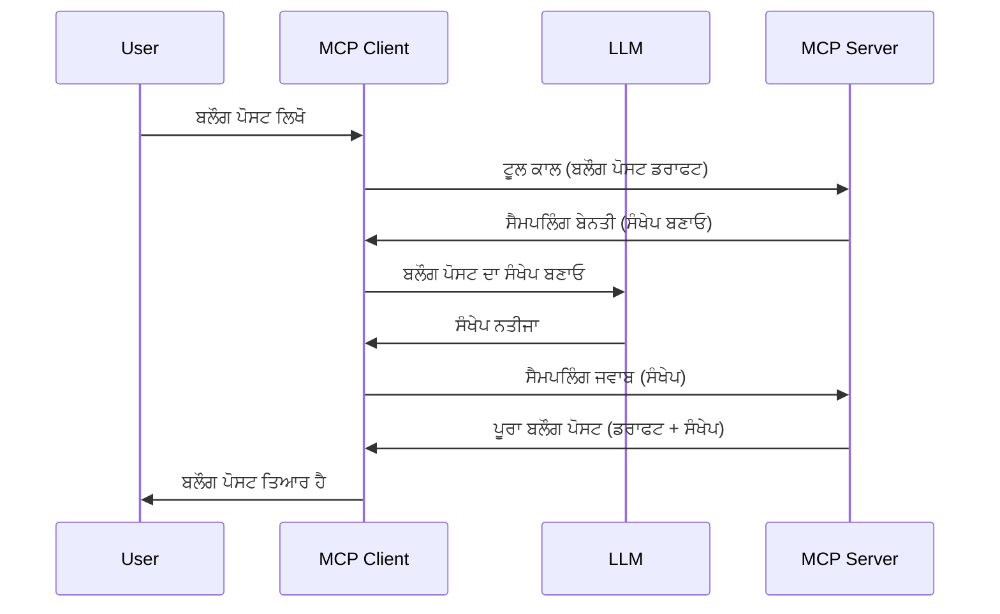

# ਸੈਂਪਲਿੰਗ - ਫੀਚਰਾਂ ਨੂੰ ਕਲਾਇੰਟ ਨੂੰ ਸੌਂਪਨਾ

ਕਦੇ ਕਦੇ, ਤੁਹਾਨੂੰ MCP ਕਲਾਇੰਟ ਅਤੇ MCP ਸਰਵਰ ਨੂੰ ਮਿਲ ਕੇ ਇੱਕ ਸਾਂਝਾ ਟੀਚਾ ਹਾਸਲ ਕਰਨ ਲਈ ਕੰਮ ਕਰਨਾ ਪੈਂਦਾ ਹੈ। ਤੁਹਾਡੇ ਕੋਲ ਇੱਕ ਹਾਲਤ ਹੋ ਸਕਦੀ ਹੈ ਜਿੱਥੇ ਸਰਵਰ ਨੂੰ ਕਲਾਇੰਟ ਉੱਤੇ ਬੈਠੇ ਇੱਕ LLM ਦੀ ਮਦਦ ਦੀ ਲੋੜ ਹੁੰਦੀ ਹੈ। ਇਸ ਸਥਿਤੀ ਲਈ, ਸੈਂਪਲਿੰਗ ਤੁਹਾਨੂੰ ਇਸਤੇਮਾਲ ਕਰਨੀ ਚਾਹੀਦੀ ਹੈ।

ਆਓ ਕੁਝ ਉਪਯੋਗ ਮਾਮਲਿਆਂ ਦੀ ਜਾਂਚ ਕਰੀਏ ਅਤੇ ਸੈਂਪਲਿੰਗ ਨੂੰ ਸ਼ਾਮਲ ਕਰਕੇ ਇੱਕ ਹੱਲ ਕਿਵੇਂ ਬਣਾਇਆ ਜਾ ਸਕਦਾ ਹੈ ਇਹ ਵੇਖੀਏ।

## ਝਲਕ

ਇਸ ਪਾਠ ਵਿਚ, ਅਸੀਂ ਸੈਂਪਲਿੰਗ ਕਦੋਂ ਅਤੇ ਕਿੱਥੇ ਵਰਤਣਾ ਹੈ ਅਤੇ ਇਸਨੂੰ ਕਿਵੇਂ ਸੰਰਚਿਤ ਕਰਨਾ ਹੈ ਇਸ ਬਾਰੇ ਵਿਚਾਰ ਕਰਾਂਗੇ।

## ਸਿੱਖਣ ਦੇ ਲੱਛਣ

ਇਸ ਅਧਿਆਇ ਵਿੱਚ, ਅਸੀਂ:

- ਸਮਝਾਵਾਂਗੇ ਕਿ ਸੈਂਪਲਿੰਗ ਕੀ ਹੈ ਅਤੇ ਕਦੋਂ ਇਸਤਮਾਲ ਕਰਨੀ ਹੈ।
- MCP ਵਿੱਚ ਸੈਂਪਲਿੰਗ ਨੂੰ ਕਿਵੇਂ ਸੰਰਚਿਤ ਕਰਨਾ ਹੈ ਦਿਖਾਵਾਂਗੇ।
- ਸੈਂਪਲਿੰਗ ਦੇ ਉਦਾਹਰਨ ਦਿਖਾਵਾਂਗੇ।

## ਸੈਂਪਲਿੰਗ ਕੀ ਹੈ ਅਤੇ ਇਸਨੂੰ ਕਿਉਂ ਵਰਤਣਾ?

ਸੈਂਪਲਿੰਗ ਇੱਕ ਅਡਵਾਂਸ ਫੀਚਰ ਹੈ ਜੋ ਇਨ੍ਹਾਂ ਤਰੀਕਿਆਂ ਨਾਲ ਕੰਮ ਕਰਦਾ ਹੈ:


### ਸੈਂਪਲਿੰਗ ਬੇਨਤੀ

ਚੰਗਾ, ਹੁਣ ਸਾਡੇ ਕੋਲ ਇੱਕ ਭਰੋਸੇਮੰਦ ਦ੍ਰਿਸ਼ ਦੇਖਣ ਦਾ ਮੌਕਾ ਹੈ, ਚਲੋ ਸੈਂਪਲਿੰਗ ਬੇਨਤੀ ਬਾਰੇ ਗੱਲ ਕਰੀਏ ਜੋ ਸਰਵਰ ਕਲਾਇੰਟ ਨੂੰ ਭੇਜਦਾ ਹੈ। ਇਹ ਹੈ ਕਿ JSON-RPC ਫਾਰਮੈਟ ਵਿੱਚ ਇੱਧਰ ਕਿਵੇਂ ਦਿਖ ਸਕਦਾ ਹੈ:

```json
{
  "jsonrpc": "2.0",
  "id": 1,
  "method": "sampling/createMessage",
  "params": {
    "messages": [
      {
        "role": "user",
        "content": {
          "type": "text",
          "text": "Create a blog post summary of the following blog post: <BLOG POST>"
        }
      }
    ],
    "modelPreferences": {
      "hints": [
        {
          "name": "claude-3-sonnet"
        }
      ],
      "intelligencePriority": 0.8,
      "speedPriority": 0.5
    },
    "systemPrompt": "You are a helpful assistant.",
    "maxTokens": 100
  }
}
```

ਇੱਥੇ ਕੁਝ ਗੱਲਾਂ ਹਨ ਜਿਨ੍ਹਾਂ ਨੂੰ ਖ਼ਾਸ ਤੌਰ ਤੇ ਵਿਆਖਿਆ ਕਰਨੀ ਔਚੀਤ ਹੈ:

- Prompt, content -> text ਹੇਠਾਂ, ਸਾਡਾ ਪ੍ਰਾਂਪਟ ਹੈ ਜੋ LLM ਨੂੰ ਬਲੌਗ ਪੋਸਟ ਸਮੱਗਰੀ ਦਾ ਸਾਰ ਸੰਖੇਪ ਕਰਨ ਲਈ ਹੁਕਮ ਦਿੰਦਾ ਹੈ।

- **modelPreferences**। ਇਹ ਹਿੱਸਾ ਬਿਲਕੁਲ ਐਸਾ ਹੀ ਹੈ, ਜੋ ਇੱਕ ਪਸੰਦ ਦੇ ਤੌਰ ਤੇ ਹੈ ਜੋ LLM ਨਾਲ ਕਿਹੜਾ ਸੰਰਚਨਾ ਵਰਤਣ ਦੀ ਸਿਫਾਰਸ਼ ਕਰਦਾ ਹੈ। ਉਪਭੋਗਤਾ ਇਹ ਚੁਣ ਸਕਦਾ ਹੈ ਕਿ ਇਹ ਸਿਫਾਰਸ਼ਾਂ ਦੇ ਨਾਲ ਜਾਵੇ ਜਾਂ ਉਹਨਾਂ ਨੂੰ ਬਦਲ ਦੇਵੇ। ਇਸ ਮਾਮਲੇ ਵਿੱਚ ਮਾਡਲ, ਗਤੀ ਅਤੇ ਬੁੱਧੀਮਾਨਤਾ ਪ੍ਰਾਥਮਿਕਤਾ ਦੇ ਬਾਰੇ ਸਿਫਾਰਸ਼ਾਂ ਹਨ।
- **systemPrompt**, ਇਹ ਤੁਹਾਡਾ ਆਮ ਸਿਸਟਮ ਪ੍ਰਾਂਪਟ ਹੈ ਜੋ ਤੁਹਾਡੇ LLM ਨੂੰ ਇੱਕ ਵਿਅਕਤੀਗਤ ਬਣਾਉਂਦਾ ਹੈ ਅਤੇ ਸੰਕੇਤ ਦਿਉਂਦਾ ਹੈ।
- **maxTokens**, ਇਹ ਇਕ ਹੋਰ ਖਾਸੀਅਤ ਹੈ ਜੋ ਦੱਸਦੀ ਹੈ ਕਿ ਇਸ ਕੰਮ ਲਈ ਕਿੰਨੇ ਟੋਕਨ ਵਰਤਣ ਦੀ ਸਿਫਾਰਸ਼ ਕੀਤੀ ਗਈ ਹੈ।

### ਸੈਂਪਲਿੰਗ ਜਵਾਬ

ਇਹ ਜਵਾਬ ਉਹ ਹੈ ਜੋ MCP ਕਲਾਇੰਟ ਅਖੀਰਕਾਰ MCP ਸਰਵਰ ਨੂੰ ਭੇਜਦਾ ਹੈ ਅਤੇ ਇਹ ਸਾਰਥਕ ਹੁੰਦਾ ਹੈ ਕਲਾਇੰਟ LLM ਨੂੰ ਕਾਲ ਕਰ ਕੇ ਜਵਾਬ ਦੀ ਉਡੀਕ ਕਰਦਾ ਹੈ ਅਤੇ ਫਿਰ ਇਸ ਸੁਨੇਹੇ ਨੂੰ ਬਣਾਉਂਦਾ ਹੈ। ਇਹ JSON-RPC ਵਿੱਚ ਇਸ ਤਰ੍ਹਾਂ ਦਿਖ ਸਕਦਾ ਹੈ:

```json
{
  "jsonrpc": "2.0",
  "id": 1,
  "result": {
    "role": "assistant",
    "content": {
      "type": "text",
      "text": "Here's your abstract <ABSTRACT>"
    },
    "model": "gpt-5",
    "stopReason": "endTurn"
  }
}
```

ਨੋਟ ਕਰੋ ਕਿ ਜਵਾਬ ਬਲੌਗ ਪੋਸਟ ਦਾ ਇੱਕ ਸੰਖੇਪ ਹੈ ਜਿਵੇਂ ਕਿ ਅਸੀਂ ਮੰਗਿਆ ਸੀ। ਇਸ ਦੇ ਨਾਲ ਇਹ ਵੀ ਨੋਟ ਕਰੋ ਕਿ ਵਰਤਿਆ ਗਿਆ `model` ਉਹ ਨਹੀਂ ਹੈ ਜੋ ਅਸੀਂ ਮੰਗਿਆ ਸੀ ਪਰ "gpt-5" ਹੈ "claude-3-sonnet" ਦੀ ਥਾਂ। ਇਹ ਇਹ ਦਰਸਾਉਂਦਾ ਹੈ ਕਿ ਉਪਭੋਗਤਾ ਆਪਣਾ ਮਨ ਬਦਲ ਸਕਦਾ ਹੈ ਕਿ ਕੀ ਵਰਤਣਾ ਹੈ ਅਤੇ ਤੁਹਾਡੀ ਸੈਂਪਲਿੰਗ ਬੇਨਤੀ ਸਿਰਫ਼ ਇੱਕ ਸਿਫਾਰਸ਼ ਹੈ।

ਚੰਗਾ, ਹੁਣ ਜਦੋਂ ਅਸੀਂ ਮੁੱਖ ਪ੍ਰਵਾਹ ਨੂੰ ਸਮਝ ਗਏ ਹਾਂ, ਅਤੇ ਇਸ ਕਾਮ ਲਈ ਵਰਤਣ ਯੋਗ ਟਾਸਕ "ਬਲੌਗ ਪੋਸਟ ਸਿਰਜਣਾ + ਸੰਖੇਪ" ਹੈ, ਆਓ ਵੇਖੀਏ ਕਿ ਇਸ ਨੂੰ ਸਫਲ ਬਣਾਉਣ ਲਈ ਕੀ ਕਰਨਾ ਪਵੇਗਾ।

### ਸੁਨੇਹਾ ਕਿਸਮਾਂ

ਸੈਂਪਲਿੰਗ ਸੁਨੇਹੇ ਸਿਰਫ਼ ਲਿਖਤ ਤੱਕ ਸੀਮਿਤ ਨਹੀਂ ਹਨ; ਤੁਸੀਂ ਚਿੱਤਰ ਅਤੇ ਆਡੀਓ ਵੀ ਭੇਜ ਸਕਦੇ ਹੋ। JSON-RPC ਕਿਵੇਂ ਵੱਖਰਾ ਦਿਖਦਾ ਹੈ:

**ਲਿਖਤ**

```json
{
  "type": "text",
  "text": "The message content"
}
```

**ਚਿੱਤਰ ਸਮੱਗਰੀ**

```json
{
  "type": "image",
  "data": "base64-encoded-image-data",
  "mimeType": "image/jpeg"
}
```

**ਆਡੀਓ ਸਮੱਗਰੀ**

```json
{
  "type": "audio",
  "data": "base64-encoded-audio-data",
  "mimeType": "audio/wav"
}
```

> NOTE: ਸੈਂਪਲਿੰਗ ਬਾਰੇ ਵਿਸਥਾਰ ਵਿੱਚ ਜਾਣਕਾਰੀ ਲਈ, [ਅਧਿਕਾਰਕ ਦਸਤਾਵੇਜ਼](https://modelcontextprotocol.io/specification/2025-06-18/client/sampling) ਵੇਖੋ

## ਕਲਾਇੰਟ ਵਿੱਚ ਸੈਂਪਲਿੰਗ ਕਿਵੇਂ ਸੰਰਚਿਤ ਕਰੀਏ

> ਨੋਟ: ਜੇ ਤੁਸੀਂ ਸਿਰਫ ਸਰਵਰ ਬਣਾਉਂਦੇ ਹੋ ਤਾਂ ਤੁਹਾਨੂੰ ਇੱਥੇ ਜਿਆਦਾ ਕੰਮ ਕਰਨ ਦੀ ਲੋੜ ਨਹੀਂ।

ਇੱਕ ਕਲਾਇੰਟ ਵਿੱਚ, ਤੁਹਾਨੂੰ ਹੇਠਾਂ ਦਿੱਤਾ ਫੀਚਰ ਇਸ ਤਰ੍ਹਾਂ ਨਿਰਧਾਰਤ ਕਰਨਾ ਪਵੇਗਾ:

```json
{
  "capabilities": {
    "sampling": {}
  }
}
```

ਇਸ ਨੂੰ ਫਿਰ ਚੁਣੇ ਹੋਏ ਕਲਾਇੰਟ ਵੱਲੋਂ ਸਰਵਰ ਨਾਲ ਇਨਿਸ਼ੀਅਲਾਈਜ਼ ਕਰਦਿਆਂ ਪਕੜ ਲਿਆ ਜਾਵੇਗਾ।

## ਸੈਂਪਲਿੰਗ ਦੇ ਕਾਰਜ ਵਿੱਚ ਉਦਾਹਰਨ - ਇੱਕ ਬਲੌਗ ਪੋਸਟ ਬਣਾਉਣਾ

ਆਓ ਇੱਕ ਸੈਂਪਲਿੰਗ ਸਰਵਰ ਕੋਡ ਕਰੀਏ, ਸਾਨੂੰ ਹੇਠਾਂ ਦਿੱਤੀਆਂ ਗੱਲਾਂ ਕਰਨੀ ਪੈਣਗੀਆਂ:

1. ਸਰਵਰ 'ਤੇ ਇੱਕ ਟੂਲ ਬਣਾਓ।
2. ਉਸ ਟੂਲ ਨੂੰ ਸੈਂਪਲਿੰਗ ਬੇਨਤੀ ਤਿਆਰ ਕਰਨੀ ਚਾਹੀਦੀ ਹੈ।
3. ਟੂਲ ਨੂੰ ਕਲਾਇੰਟ ਦੀ ਸੈਂਪਲਿੰਗ ਬੇਨਤੀ ਦੇ ਜਵਾਬ ਦੀ ਉਡੀਕ ਕਰਨੀ ਚਾਹੀਦੀ ਹੈ।
4. ਫਿਰ ਟੂਲ ਦਾ ਨਤੀਜਾ ਪੈਦਾ ਹੋਣਾ ਚਾਹੀਦਾ ਹੈ।

ਆਓ ਕਿਸੇ ਕਦਮ ਬਦ ਕਦਮ ਕੋਡ ਵੇਖੀਏ:

### -1- ਟੂਲ ਬਣਾਓ

**python**

```python
@mcp.tool()
async def create_blog(title: str, content: str, ctx: Context[ServerSession, None]) -> str:
    """Create a blog post and generate a summary"""

```

### -2- ਸੈਂਪਲਿੰਗ ਬੇਨਤੀ ਬਣਾਓ

ਆਪਣਾ ਟੂਲ ਹੇਠਾਂ ਦਿੱਤੇ ਕੋਡ ਨਾਲ ਵਧਾਓ:

**python**

```python
post = BlogPost(
        id=len(posts) + 1,
        title=title,
        content=content,
        abstract=""
    )

prompt = f"Create an abstract of the following blog post: title: {title} and draft: {content} "

result = await ctx.session.create_message(
        messages=[
            SamplingMessage(
                role="user",
                content=TextContent(type="text", text=prompt),
            )
        ],
        max_tokens=100,
)

```

### -3- ਜਵਾਬ ਦੀ ਉਡੀਕ ਕਰੋ ਅਤੇ ਜਵਾਬ ਵਾਪਸ ਭੇਜੋ

**python**

```python
post.abstract = result.content.text

posts.append(post)

# ਪੂਰਾ ਉਤਪਾਦ ਵਾਪਸ ਕਰੋ
return json.dumps({
    "id": post.title,
    "abstract": post.abstract
})
```

### -4- ਪੂਰਾ ਕੋਡ

**python**

```python
from starlette.applications import Starlette
from starlette.routing import Mount, Host

from mcp.server.fastmcp import Context, FastMCP

from mcp.server.session import ServerSession
from mcp.types import SamplingMessage, TextContent

import json


from uuid import uuid4
from typing import List
from pydantic import BaseModel


mcp = FastMCP("Blog post generator")

# ਐਪ = FastAPI()

posts = []

class BlogPost(BaseModel):
    id: int
    title: str
    content: str
    abstract: str

posts: List[BlogPost] = []

@mcp.tool()
async def create_blog(title: str, content: str, ctx: Context[ServerSession, None]) -> str:
    """Create a blog post and generate a summary"""

    post = BlogPost(
        id=len(posts) + 1,
        title=title,
        content=content,
        abstract=""
    )

    prompt = f"Create an abstract of the following blog post: title: {title} and draft: {content} "

    result = await ctx.session.create_message(
        messages=[
            SamplingMessage(
                role="user",
                content=TextContent(type="text", text=prompt),
            )
        ],
        max_tokens=100,
    )

    post.abstract = result.content.text

    posts.append(post)

    # ਪੂਰਾ ਬਲੌਗ ਪੋਸਟ ਵਾਪਸ ਕਰੋ
    return json.dumps({
        "id": post.title,
        "abstract": post.abstract
    })

if __name__ == "__main__":
    print("Starting server...")
    # mcp.run()
    mcp.run(transport="streamable-http")

# ਐਪ ਚਲਾਓ ਨਾਲ: python server.py
```

### -5- Visual Studio Code ਵਿੱਚ ਇਸਦਾ ਟੈਸਟ ਕਰਨਾ

ਇਸ ਨੂੰ Visual Studio Code ਵਿੱਚ ਟੈਸਟ ਕਰਨ ਲਈ, ਇਹਨਾਂ ਚੀਜ਼ਾਂ ਨੂੰ ਕਰੋ:

1. ਟਰਮੀਨਲ ਵਿੱਚ ਸਰਵਰ ਸ਼ੁਰੂ ਕਰੋ
1. ਇਸਨੂੰ *mcp.json* ਵਿੱਚ ਜੋੜੋ (ਅਤੇ ਧਿਆਨ ਰੱਖੋ ਕਿ ਇਹ ਸ਼ੁਰੂ ਹੋ ਚੁੱਕਾ ਹੈ) ਜਿਵੇਂ ਕਿ:

   ```json
   "servers": {
      "blog-server": {
        "type": "http",
        "url": "http://localhost:8000/mcp"
      }
   }
   ```

1. ਇੱਕ ਪ੍ਰਾਂਪਟ ਲਿਖੋ:

   ```text
   create a blog post named "Where Python comes from", the content is "Python is actually named after Monty Python Flying Circus"
   ```

1. ਸੈਂਪਲਿੰਗ ਨੂੰ ਹੋਣ ਦਿਓ। ਪਹਿਲੀ ਵਾਰੀ ਇਸ ਦੀ ਜਾਂਚ ਕਰਨ 'ਤੇ ਤੁਹਾਨੂੰ ਇੱਕ ਵਾਧੂ ਸੰਵਾਦ ਦਿਖੇਗਾ ਜਿਸ ਨੂੰ ਸੋਕੂਲ ਕਰਨਾ ਪਵੇਗਾ, ਫਿਰ ਤੁਹਾਨੂੰ ਸਧਾਰਣ ਸੰਵਾਦ ਦਿੱਤਾ ਜਾਵੇਗਾ ਕਿ ਤੁਸੀਂ ਟੂਲ ਚਲਾਉਣਾ ਚਾਹੁੰਦੇ ਹੋ।

1. ਨਤੀਜੇ ਨਿਰੀਖਣ ਕਰੋ। ਤੁਸੀਂ ਨਤੀਜੇ GitHub Copilot Chat ਵਿੱਚ ਸੁੰਦਰ ਤੌਰ ਤੇ ਦਰਸਾਏ ਹੋਏ ਵੇਖੋਗੇ ਪਰ ਤੁਸੀਂ ਕੱਚਾ JSON ਜਵਾਬ ਵੀ ਨਿਰੀਖਣ ਕਰ ਸਕਦੇ ਹੋ।

**ਬੋਨਸ**. Visual Studio Code ਟੂਲਿੰਗ ਸੈਂਪਲਿੰਗ ਲਈ ਬਹੁਤ ਸਹਾਇਕ ਹੈ। ਤੁਸੀਂ ਆਪਣੇ ਸਥਾਪਿਤ ਸਰਵਰ ‘ਤੇ ਸੈਂਪਲਿੰਗ ਐਕਸੈਸ ਸੰਰਚਿਤ ਕਰ ਸਕਦੇ ਹੋ ਇਸ ਤਰ੍ਹਾਂ:

1. ਐਕਸਟੈਂਸ਼ਨ ਸੈਕਸ਼ਨ ਵਿੱਚ ਜਾਓ।
1. "MCP SERVERS - INSTALLED" ਸੈਕਸ਼ਨ ਵਿੱਚ ਆਪਣੇ ਸਥਾਪਤ ਸਰਵਰ ਲਈ ਕਾਗ ਆਈਕਨ ਚੁਣੋ।
1. "Configure Model Access" ਚੁਣੋ, ਇੱਥੇ ਤੁਸੀਂ ਚੁਣ ਸਕਦੇ ਹੋ ਕਿ ਕਿਸ ਮਾਡਲ ਨੂੰ GitHub Copilot ਸੈਂਪਲਿੰਗ ਕਰਨ ਦੌਰਾਨ ਵਰਤ ਸਕਦਾ ਹੈ। ਤੁਸੀਂ ਹਾਲ ਹੀ ਵਿੱਚ ਹੋਏ ਸਾਰੇ ਸੈਂਪਲਿੰਗ ਬੇਨਤੀਆਂ "Show Sampling requests" ਚੁਣ ਕੇ ਵੀ ਦੇਖ ਸਕਦੇ ਹੋ।

## ਅਸਾਈਨਮੈਂਟ

ਇਸ ਅਸਾਈਨਮੈਂਟ ਵਿੱਚ, ਤੁਸੀਂ ਇਕ ਥੋੜ੍ਹਾ ਵੱਖਰਾ ਸੈਂਪਲਿੰਗ ਬਣਾਵੋਗੇ, ਜਿਸਦਾ ਨਾਮ ਸੈਂਪਲਿੰਗ ਇੰਟੀਗ੍ਰੇਸ਼ਨ ਹੈ ਜੋ ਉਤਪਾਦ ਵਰਨਨ ਬਣਾਉਣ ਦਾ ਸਮਰਥਨ ਕਰਦਾ ਹੈ। ਤੁਸੀਂ ਇਹ ਹਾਲਤ ਹਾਸਲ ਕਰਦੇ ਹੋ:

**ਹਾਲਤ**: ਇੱਕ ਈ-ਕਾਮਰਸ ਵਿੱਚ ਪਿੱਛਲਾ ਦਫਤਰ ਕਰਮਚਾਰੀ ਨੂੰ ਮਦਦ ਦੀ ਲੋੜ ਹੈ, ਉਤਪਾਦ ਵਰਨਨ ਬਣਾਉਣ ਵਿੱਚ ਬਹੁਤ ਸਮਾਂ ਲੱਗਦਾ ਹੈ। ਇਸ ਲਈ, ਤੁਸੀਂ ਇੱਕ ਹੱਲ ਤਿਆਰ ਕਰਨਾਂ ਹੈ ਜਿੱਥੇ ਤੁਸੀਂ "create_product" ਨਾਮਕ ਟੂਲ ਕਾਲ ਕਰ ਸਕਦੇ ਹੋ ਜਿਸ ਵਿੱਚ "title" ਅਤੇ "keywords" ਆਰਗਯੂਮੈਂਟ ਹਨ ਅਤੇ ਇਸ ਨੂੰ ਇੱਕ ਪੂਰਾ ਉਤਪਾਦ ਤਿਆਰ ਕਰਨਾ ਚਾਹੀਦਾ ਹੈ ਜਿਸ ਵਿੱਚ "description" ਫੀਲਡ ਸ਼ਾਮਲ ਹੈ ਜੋ ਕਲਾਇੰਟ ਦੇ LLM ਵੱਲੋਂ ਭਰਿਆ ਜਾਣਾ ਚਾਹੀਦਾ ਹੈ।

TIP: ਜੋ ਤੁਸੀਂ ਪਹਿਲਾਂ ਸਿੱਖਿਆ ਸੀ, ਉਸਨੂੰ ਵਰਤ ਕੇ ਇਹ ਸਰਵਰ ਅਤੇ ਉਸਦਾ ਟੂਲ ਇੱਕ ਸੈਂਪਲਿੰਗ ਬੇਨਤੀ ਉਪਯੋਗ ਕਰਕੇ ਬਣਾਓ।

## ਹੱਲ

[Solution](./solution/README.md)

## ਮੁੱਖ ਸਿੱਖਰੀਆਂ

ਸੈਂਪਲਿੰਗ ਇੱਕ ਸ਼ਕਤੀਸ਼ਾਲੀ ਫੀਚਰ ਹੈ ਜੋ ਸਰਵਰ ਨੂੰ LLM ਦੀ ਮਦਦ ਲਈ ਕਲਾਇੰਟ ਨੂੰ ਕੰਮ ਸੌਂਪਣ ਦੀ ਆਗਿਆ ਦਿੰਦਾ ਹੈ।

## ਅਗਲੇ ਕੀ ਹੈ

- [ਅਧਿਆਇ 4 - ਵਿਹਾਰਕ ਲਾਗੂ ਕਰਨਾ](../../04-PracticalImplementation/README.md)

---

<!-- CO-OP TRANSLATOR DISCLAIMER START -->
**ਡਿਸਕਲੇਮਰ**:  
ਇਹ ਦਸਤਾਵੇਜ਼ ਏਆਈ ਅਨੁਵਾਦ ਸੇਵਾ [Co-op Translator](https://github.com/Azure/co-op-translator) ਦੀ ਵਰਤੋਂ ਕਰਕੇ ਅਨੁਵਾਦ ਕੀਤਾ ਗਿਆ ਹੈ। ਜਦੋਂ ਕਿ ਅਸੀਂ ਸ਼ੁੱਧਤਾ ਲਈ ਯਤਨਸ਼ੀਲ ਹਾਂ, ਕਿਰਪਾ ਕਰਕੇ ਜਾਣੋ ਕਿ ਸਵੈਚਾਲਿਤ ਅਨੁਵਾਦ ਵਿੱਚ ਗਲਤੀਆਂ ਜਾਂ ਅਣਸੂਰੀਆਂ ਹੋ ਸਕਦੀਆਂ ਹਨ। ਮੂਲ ਦਸਤਾਵੇਜ਼ ਜਿਸਦੀ ਮੂਲ ਭਾਸ਼ਾ ਹੋਵੇ, ਉਹ ਪ੍ਰਮਾਣਿਕ ਸਰੋਤ ਮੰਨਿਆ ਜਾਣਾ ਚਾਹੀਦਾ ਹੈ। ਮਹੱਤਵਪੂਰਨ ਜਾਣਕਾਰੀ ਲਈ, ਪੇਸ਼ੇਵਰ ਮਨੁੱਖੀ ਅਨੁਵਾਦ ਸਿਫਾਰਸ਼ ਕੀਤੀ ਜਾਂਦੀ ਹੈ। ਅਸੀਂ ਇਸ ਅਨੁਵਾਦ ਦੀ ਵਰਤੋਂ ਤੋਂ ਪੈਦਾ ਹੋਣ ਵਾਲੀਆਂ ਕਿਸੇ ਵੀ ਗਲਤਫਹਿਮੀਆਂ ਜਾਂ ਗਲਤ ਵਿਆਖਿਆਵਾਂ ਲਈ ਜ਼ਿੰਮੇਵਾਰ ਨਹੀਂ ਹਾਂ।
<!-- CO-OP TRANSLATOR DISCLAIMER END -->