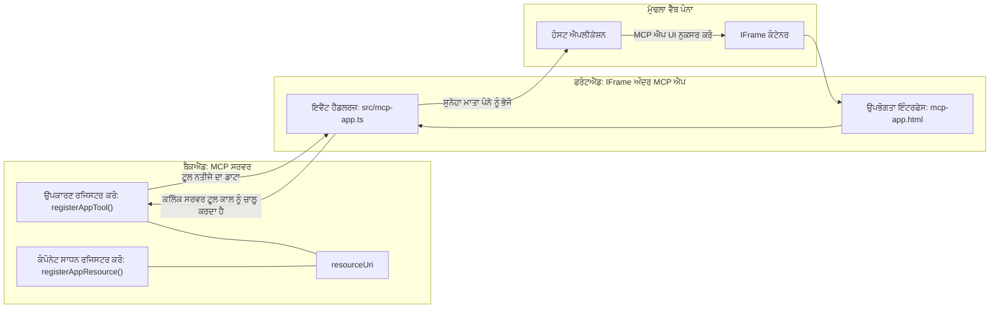

# MCP ਐਪਸ

MCP ਐਪਸ MCP ਵਿੱਚ ਇਕ ਨਵਾਂ ਪਮਾਨ ਹੈ। ਵਿਚਾਰ ਇਹ ਹੈ ਕਿ ਤੁਸੀਂ ਸਿਰਫ ਟੂਲ ਕਾਲ ਤੋਂ ਡੇਟਾ ਵਾਪਸ ਨਹੀਂ ਦਿੰਦੇ, ਬਲਕਿ ਇਸ ਜਾਣਕਾਰੀ ਨਾਲ ਕਿਵੇਂ ਇੰਟਰੈਕਟ ਕਰਨਾ ਹੈ ਇਸ ਬਾਰੇ ਜਾਣਕਾਰੀ ਵੀ ਪ੍ਰਦਾਨ ਕਰਦੇ ਹੋ। ਇਸਦਾ ਮਤਲਬ ਹੈ ਕਿ ਹੁਣ ਟੂਲ ਦੇ ਨਤੀਜੇ UI ਜਾਣਕਾਰੀ ਵੀ ਰੱਖ ਸਕਦੇ ਹਨ। ਪਰ ਅਸੀੰ ਇਹ ਕਿਉਂ ਚਾਹੁੰਦੇ ਹਾਂ? ਸੋਚੋ ਕਿ ਅਸੀਂ ਅੱਜ ਕਿਵੇਂ ਕੰਮ ਕਰਦੇ ਹਾਂ। ਤੁਸੀਂ ਸੰਭਵਤ: MCP ਸਰਵਰ ਦੇ ਨਤੀਜੇ ਖਪਤ ਕਰ ਰਹੇ ਹੋ ਜਿਸਦੇ ਸਾਹਮਣੇ ਕਿਸੇ ਕਿਸਮ ਦਾ ਫਰੰਟਐਂਡ ਹੈ, ਉਹ ਕੋਡ ਤੁਹਾਨੂੰ ਲਿਖਣਾ ਤੇ ਸੰਭਾਲਣਾ ਪੈਂਦਾ ਹੈ। ਕਈ ਵਾਰੀ ਇਹੀ ਚਾਹੀਦਾ ਹੈ, ਪਰ ਕਈ ਵਾਰੀ ਵਧੀਆ ਹੁੰਦਾ ਜੇ ਤੁਸੀਂ ਇੱਕ ਸਮੁੱਚੇ ਜਾਣਕਾਰੀ ਦੇ ਟੇਕੜੇ ਨੂੰ ਲੈ ਆਓ ਜਿਸ ਵਿੱਚ ਡੇਟਾ ਤੋਂ ਲੈ ਕੇ ਯੂਜ਼ਰ ਇੰਟਰਫੇਸ ਤੱਕ ਸਭ ਕੁਝ ਹੋਵੇ।  

## ਓਵਰਵਿਊ

ਇਹ ਪਾਠ MCP ਐਪਸ ਬਾਰੇ ਪ੍ਰਯੋਗਿਕ ਦਿਸ਼ਾ-ਨਿਰਦੇਸ਼ ਪ੍ਰਦਾਨ ਕਰਦਾ ਹੈ, ਇਸ ਨਾਲ ਕਿਵੇਂ ਸ਼ੁਰੂ ਕਰਨਾ ਹੈ ਅਤੇ ਕਿਵੇਂ ਇਸਨੂੰ ਆਪਣੇ ਮੌਜੂਦਾ ਵੈੱਬ ਐਪਸ ਵਿੱਚ ਇਕਠਾ ਕਰਨਾ ਹੈ। MCP ਐਪਸ MCP ਮਾਨਕ ਵਿੱਚ ਇਕ ਬਹੁਤ ਨਵੀਂ ਜੋੜ ਹੈ।

## ਸਿੱਖਣ ਦੇ ਉਦਦੇਸ਼

ਇਸ ਪਾਠ ਦੇ ਅੰਤ ਤੱਕ, ਤੁਸੀਂ ਸਮਝ ਸਕੋਗੇ:

- MCP ਐਪਸ ਕੀ ਹਨ।
- MCP ਐਪਸ ਕਦੋਂ ਵਰਤਣੇ ਹਨ।
- ਆਪਣੇ ਖੁਦ ਦੇ MCP ਐਪਸ ਬਣਾਉਣ ਅਤੇ ਇੱਕਠੇ ਕਰਨ।

## MCP ਐਪਸ - ਇਹ ਕਿਵੇਂ ਕੰਮ ਕਰਦਾ ਹੈ

MCP ਐਪਸ ਦਾ ਵਿਚਾਰ ਇਹ ਹੈ ਕਿ ਇੱਕ ਜਵਾਬ ਦਿੱਤਾ ਜਾਵੇ ਜੋ ਅਸਲ ਵਿੱਚ ਦਰਸਾਉਣਯੋਗ ਕੰਪੋਨੈਂਟ ਹੁੰਦਾ ਹੈ। ਐਸੀ ਕੰਪੋਨੈਂਟ ਵਿੱਚ ਦ੍ਰਿਸ਼ ਅਤੇ ਇੰਟਰਐਕਟੀਵਿਟੀ ਦੋਹਾਂ ਹੋ ਸਕਦੇ ਹਨ, ਜਿਵੇਂ ਕਿ ਬਟਨ ਕਲਿੱਕ, ਯੂਜ਼ਰ ਇਨਪੁਟ ਅਤੇ ਹੋਰ। ਚੱਲੋ ਸਰਵਰ ਪਾਸੇ ਅਤੇ ਸਾਡੇ MCP ਸਰਵਰ ਨਾਲ ਸ਼ੁਰੂ ਕਰੀਏ। ਇੱਕ MCP ਐਪ ਕੰਪੋਨੈਂਟ ਬਣਾਉਣ ਲਈ ਤੁਹਾਨੂੰ ਟੂਲ ਬਣਾਉਣਾ ਅਤੇ ਐਪਲੀਕੇਸ਼ਨ ਸਰੋਤ ਵੀ ਬਣਾਉਣਾ ਪੈਂਦਾ ਹੈ। ਇਹ ਦੋਹਾਂ ਹਿੱਸੇ resourceUri ਦੁਆਰਾ ਜੁੜੇ ਹੁੰਦੇ ਹਨ।

ਇੱਥੇ ਇੱਕ ਉਦਾਹਰਨ ਹੈ। ਚੱਲੋ ਵੇਖੀਏ ਕੀ ਸ਼ਾਮਲ ਹੈ ਅਤੇ ਕਿਹੜਾ ਹਿੱਸਾ ਕੀ ਕਰਦਾ ਹੈ:

```text
server.ts -- responsible for registering tools and the component as a UI component
src/
  mcp-app.ts -- wiring up event handlers
mcp-app.html -- the user interface
```

ਇਸ ਦ੍ਰਿਸ਼ ਨਾਲ ਕੰਪੋਨੈਂਟ ਬਣਾਉਣ ਅਤੇ ਇਸ ਦੀ ਲੋਜਿਕ ਦੀ ਆਰਕੀਟੈਕਚਰ ਵਰਨਿਤ ਕੀਤੀ ਗਈ ਹੈ।


ਚੱਲੋ ਅਗਲੇ ਵਿਚਕਾਰ ਬੈਕਐਂਡ ਅਤੇ ਫਰੰਟਐਂਡ ਦੀਆਂ ਜਿਮੇਵਾਰੀਆਂ ਵਰਣਨ ਕਰੀਏ।

### ਬੈਕਐਂਡ

ਇੱਥੇ ਸਾਡੇ ਕੋਲ ਦੋ主要 ਕੰਮ ਹਨ:

- ਉਹ ਟੂਲਜ਼ ਰਜਿਸਟਰ ਕਰਨਾ ਜਿਨ੍ਹਾਂ ਨਾਲ ਅਸੀਂ ਇੰਟਰਐਕਟ ਕਰਨਾ ਚਾਹੁੰਦੇ ਹਾਂ।
- ਕੰਪੋਨੈਂਟ ਨੂੰ ਪਰਿਭਾਸ਼ਿਤ ਕਰਨਾ।

**ਟੂਲ ਰਜਿਸਟਰ ਕਰਨਾ**

```typescript
registerAppTool(
    server,
    "get-time",
    {
      title: "Get Time",
      description: "Returns the current server time.",
      inputSchema: {},
      _meta: { ui: { resourceUri } }, // ਇਸ ਸੰਦ ਨੂੰ ਇਸ ਦੀ UI ਸਰੋਤ ਨਾਲ ਜੋੜਦਾ ਹੈ
    },
    async () => {
      const time = new Date().toISOString();
      return { content: [{ type: "text", text: time }] };
    },
  );

```

ਉਪਰ ਦਿੱਤਾ ਕੋਡ ਵਿਹਾਰ ਨੂੰ ਦਰਸਾਉਂਦਾ ਹੈ, ਜਿਸ ਵਿੱਚ ਇੱਕ `get-time` ਨਾਮਕ ਟੂਲ ਨੂੰ ਪ੍ਰਭਾਵਤ ਕੀਤਾ ਗਿਆ ਹੈ। ਇਸ ਨੂੰ ਕੋਈ ਇਨਪੁਟ ਨਹੀਂ ਲੱਗਦੀ ਪਰ ਇਹ ਮੌਜੂਦਾ ਸਮਾਂ ਤਿਆਰ ਕਰਦਾ ਹੈ। ਅਸੀਂ ਜੇਕਰ ਯੂਜ਼ਰ ਇਨਪੁਟ ਲੈਣ ਵਾਲੇ ਟੂਲ ਬਣਾਉਣੀਆਂ ਹਨ ਤਾਂ `inputSchema` ਵੀ ਪਰਿਭਾਸ਼ਿਤ ਕਰ ਸਕਦੇ ਹਾਂ।

**ਕੰਪੋਨੈਂਟ ਰਜਿਸਟਰ ਕਰਨਾ**

ਇਹੀ ਫਾਇਲ ਵਿੱਚ, ਸਾਨੂੰ ਕੰਪੋਨੈਂਟ ਵੀ ਰਜਿਸਟਰ ਕਰਨਾ ਪੈਂਦਾ ਹੈ:

```typescript
const resourceUri = "ui://get-time/mcp-app.html";

// ਸਰੋਤ ਨੂੰ ਰਜਿਸਟਰ ਕਰੋ, ਜੋ UI ਲਈ ਬੰਡਲ ਕੀਤਾ ਹੋਇਆ HTML/JavaScript ਵਾਪਸ ਕਰਦਾ ਹੈ।
registerAppResource(
  server,
  resourceUri,
  resourceUri,
  { mimeType: RESOURCE_MIME_TYPE },
  async () => {
    const html = await fs.readFile(path.join(DIST_DIR, "mcp-app.html"), "utf-8");

    return {
    contents: [
        { uri: resourceUri, mimeType: RESOURCE_MIME_TYPE, text: html },
    ],
    };
  },
);
```

ਦੇਖੋ ਕਿਵੇਂ ਅਸੀਂ `resourceUri` ਦਾ ਜ਼ਿਕਰ ਕਰਕੇ ਕੰਪੋਨੈਂਟ ਨੂੰ ਇਸਦੇ ਟੂਲਾਂ ਨਾਲ ਜੋੜਦੇ ਹਾਂ। ਦਿਲਚਸਪੀ ਵਾਲੀ ਗੱਲ callback ਹੈ ਜਿੱਥੇ ਅਸੀਂ UI ਫਾਇਲ ਲੋਡ ਕਰਕੇ ਕੰਪੋਨੈਂਟ ਵਾਪਸ ਭੇਜਦੇ ਹਾਂ।

### ਕੰਪੋਨੈਂਟ ਫਰੰਟਐਂਡ

ਬੈਕਐਂਡ ਵਾਂਗ, ਇੱਥੇ ਵੀ ਦੋ ਹਿੱਸੇ ਹਨ:

- ਖਾਲੀ HTML ਵਿੱਚ ਲਿਖਿਆ ਫਰੰਟਐਂਡ।
- ਕੋਡ ਜੋ ਇਵੈਂਟਾਂ ਨੂੰ ਸੰਭਾਲਦਾ ਹੈ ਅਤੇ ਕਰਨ ਲਈ ਕਿਹਾ ਗਿਆ ਕੰਮ ਜਿਵੇਂ ਕਿ ਟੂਲ ਕਾਲ ਕਰਨਾ ਜਾਂ ਮਾਪੇ ਵਿੰਡੋ ਨੂੰ ਸੁਨੇਹੇ ਭੇਜਣਾ।

**ਯੂਜ਼ਰ ਇੰਟਰਫੇਸ**

ਆਓ ਯੂਜ਼ਰ ਇੰਟਰਫੇਸ 'ਤੇ ਨਜ਼ਰ ਮਾਰਦੇ ਹਾਂ।

```html
<!-- mcp-app.html -->
<!DOCTYPE html>
<html lang="en">
  <head>
    <meta charset="UTF-8" />
    <title>Get Time App</title>
  </head>
  <body>
    <p>
      <strong>Server Time:</strong> <code id="server-time">Loading...</code>
    </p>
    <button id="get-time-btn">Get Server Time</button>
    <script type="module" src="/src/mcp-app.ts"></script>
  </body>
</html>
```

**ਇਵੈਂਟ ਵਾਇਰਅੱਪ**

ਅਖੀਰਲਾ ਹਿੱਸਾ ਇਵੈਂਟ ਵਾਇਰਅੱਪ ਹੈ। ਇਸਦਾ ਮਤਲਬ ਹੈ ਅਸੀਂ ਪਤਾ ਕਰਦੇ ਹਾਂ UI ਦਾ ਕਿਹੜਾ ਹਿੱਸਾ ਇਵੈਂਟ ਹੈਂਡਲਰ ਚਾਹੀਦਾ ਤੇ ਇਵੈਂਟ ਮਹਿਸੂਸ ਹੋਣ ਤੇ ਕੀ ਕਰਨਾ ਹੈ:

```typescript
// mcp-app.ts

import { App } from "@modelcontextprotocol/ext-apps";

// ਐਲਿਮੈਂਟ ਰੈਫਰੈਂਸ ਪ੍ਰਾਪਤ ਕਰੋ
const serverTimeEl = document.getElementById("server-time")!;
const getTimeBtn = document.getElementById("get-time-btn")!;

// ਐਪ ਇੰਸਟੈਂਸ ਬਣਾਓ
const app = new App({ name: "Get Time App", version: "1.0.0" });

// ਸਰਵਰ ਤੋਂ ਟੂਲ ਦੇ ਨਤੀਜੇ ਸੰਭਾਲੋ। `app.connect()` ਤੋਂ ਪਹਿਲਾਂ ਸੈਟ ਕਰੋ ਤਾਂ ਜੋ
// ਸ਼ੁਰੂਆਤੀ ਟੂਲ ਨਤੀਜੇ ਨੂੰ ਗੁੰਮ ਨਾ ਹੋਵੇ।
app.ontoolresult = (result) => {
  const time = result.content?.find((c) => c.type === "text")?.text;
  serverTimeEl.textContent = time ?? "[ERROR]";
};

// ਬਟਨ ਕਲਿੱਕ ਨੂੰ ਜੁੜੋ
getTimeBtn.addEventListener("click", async () => {
  // `app.callServerTool()` UI ਨੂੰ ਸਰਵਰ ਤੋਂ ਤਾਜ਼ਾ ਡੇਟਾ ਮੰਗਣੀ ਦੀ ਆਗਿਆ ਦਿੰਦਾ ਹੈ
  const result = await app.callServerTool({ name: "get-time", arguments: {} });
  const time = result.content?.find((c) => c.type === "text")?.text;
  serverTimeEl.textContent = time ?? "[ERROR]";
});

// ਹੋਸਟ ਨਾਲ ਜੁੜੋ
app.connect();
```

ਉਪਰੋਕਤ ਤੋਂ ਤੁਸੀਂ ਵੇਖ ਸਕਦੇ ਹੋ ਕਿ ਇਹ ਸਧਾਰਣ ਕੋਡ ਹੈ ਜੋ DOM ਤੱਤਾਂ ਨੂੰ ਇਵੈਂਟ ਨਾਲ ਜੁੜਦਾ ਹੈ। ਖਾਸ ਕਰਕੇ ਕਹਿਣ ਜੋਗ ਕੀ `callServerTool` ਕੌਲ ਹੈ ਜੋ ਬੈਕਐਂਡ 'ਤੇ ਟੂਲ ਕਾਲ ਕਰਦਾ ਹੈ।

## ਯੂਜ਼ਰ ਇਨਪੁਟ ਨਾਲ ਕਾਰਜਵਾਈ

ਹੁਣ ਤੱਕ ਅਸੀਂ ਇੱਕ ਐਸਾ ਕੰਪੋਨੈਂਟ ਦੇਖਿਆ ਜਿਸ ਵਿੱਚ ਬਟਨ ਹੈ ਜੋ ਕਲਿੱਕ ਹੋਣ 'ਤੇ ਟੂਲ ਕਾਲ ਕਰਦਾ ਹੈ। ਆਓ ਵੇਖੀਏ ਕਿ ਅਸੀਂ ਹੋਰ UI ਤੱਤ, ਜਿਵੇਂ ਇਨਪੁਟ ਫੀਲਡ ਵੀ ਸ਼ਾਮਲ ਕਰ ਸਕਦੇ ਹਾਂ ਅਤੇ ਟੂਲ ਨੂੰ ਆਰਗੂਮੈਂਟ ਭੇਜ ਸਕਦੇ ਹਾਂ। ਅਸੀਂ ਇੱਕ FAQ ਫੰਕਸ਼ਨਲਿਟੀ ਬਣਾਉਂਦੇ ਹਾਂ। ਇਹ ਕੁਝ ਇਸ ਰੂਪ ਵਿੱਚ ਕੰਮ ਕਰੇਗਾ:

- ਇੱਕ ਬਟਨ ਅਤੇ ਇਨਪੁਟ ਤੱਤ ਹੋਣਾ ਚਾਹੀਦਾ ਜਿੱਥੇ ਯੂਜ਼ਰ ਖੋਜ ਕਰਨ ਲਈ ਕੋਈ ਕੀਵਰਡ ਜਿਵੇਂ "Shipping" ਲਿਖਦਾ ਹੈ। ਇਹ ਬੈਕਐਂਡ 'ਤੇ ਇੱਕ ਟੂਲ ਕਾਲ ਕਰੇਗਾ ਜੋ FAQ ਡੇਟਾ ਵਿੱਚ ਖੋਜ ਕਰਦਾ ਹੈ।
- ਇੱਕ ਟੂਲ ਜੋ ਇਸ ਫੈਕਸ਼ਨ ਨੂੰ ਸਹਾਇਤਾ ਦਿੰਦਾ ਹੈ।

ਆਓ ਪਹਿਲਾਂ ਬੈਕਐਂਡ ਲਈ ਜਰੂਰੀ ਸਹਾਇਤਾ ਸ਼ਾਮਲ ਕਰੀਏ:

```typescript
const faq: { [key: string]: string } = {
    "shipping": "Our standard shipping time is 3-5 business days.",
    "return policy": "You can return any item within 30 days of purchase.",
    "warranty": "All products come with a 1-year warranty covering manufacturing defects.",
  }

registerAppTool(
    server,
    "get-faq",
    {
      title: "Search FAQ",
      description: "Searches the FAQ for relevant answers.",
      inputSchema: zod.object({
        query: zod.string().default("shipping"),
      }),
      _meta: { ui: { resourceUri: faqResourceUri } }, // ਇਸ ਟੂਲ ਨੂੰ ਇਸਦੇ UI ਸਰੋਤ ਨਾਲ ਜੋੜਦਾ ਹੈ
    },
    async ({ query }) => {
      const answer: string = faq[query.toLowerCase()] || "Sorry, I don't have an answer for that.";
      return { content: [{ type: "text", text: answer }] };
    },
  );
```

ਅਸੀਂ ਇੱਥੇ ਦੇਖ ਰਹੇ ਹਾਂ ਕਿ ਕਿਵੇਂ `inputSchema` ਭਰਦੇ ਹਨ ਅਤੇ ਇੱਕ `zod` schema ਦਿੰਦੇ ਹਨ:

```typescript
inputSchema: zod.object({
  query: zod.string().default("shipping"),
})
```

ਉਪਰ ਦਿੱਤੇ schema ਵਿੱਚ ਅਸੀਂ ਦਰਸਾਇਆ ਹੈ ਕਿ ਸਾਡੇ ਕੋਲ ਇੱਕ ਇਨਪੁਟ ਪੈਰਾਮੀਟਰ ਹੈ ਜਿਸਦਾ ਨਾਮ `query` ਹੈ ਅਤੇ ਇਹ ਵਿਕਲਪਿਕ ਹੈ ਜਿਸਦਾ ਮੂਲ ਮੁੱਲ "shipping" ਹੈ।

ਚੱਲੋ ਹੁਣ *mcp-app.html* ਤੇ ਜਾ ਕੇ ਵੇਖੀਏ ਕਿ ਇਸ ਲਈ ਕਿਹੜਾ UI ਬਣਾਉਣਾ ਹੈ:

```html
<div class="faq">
    <h1>FAQ response</h1>
    <p>FAQ Response: <code id="faq-response">Loading...</code></p>
    <input type="text" id="faq-query" placeholder="Enter FAQ query" />
    <button id="get-faq-btn">Get FAQ Response</button>
  </div>
```

ਵਧੀਆ, ਹੁਣ ਸਾਡੇ ਕੋਲ ਇੱਕ ਇਨਪੁਟ ਤੱਤ ਅਤੇ ਇੱਕ ਬਟਨ ਹੈ। ਚੱਲੋ ਹੁਣ *mcp-app.ts* ਤੇ ਜਾ ਕੇ ਇਨ इਵੈਂਟਾਂ ਨੂੰ ਜੋੜੀਏ:

```typescript
const getFaqBtn = document.getElementById("get-faq-btn")!;
const faqQueryInput = document.getElementById("faq-query") as HTMLInputElement;

getFaqBtn.addEventListener("click", async () => {
  const query = faqQueryInput.value;
  const result = await app.callServerTool({ name: "get-faq", arguments: { query } });
  const faq = result.content?.find((c) => c.type === "text")?.text;
  faqResponseEl.textContent = faq ?? "[ERROR]";
});
```

ਉਪਰ ਦਿੱਤੇ ਕੋਡ ਵਿੱਚ ਅਸੀਂ:

- ਇੰਟਰਐਕਟਿਵ UI ਤੱਤਾਂ ਨੂੰ ਸੰਬੰਧਤ ਕੀਤਾ ਹੈ।
- ਬਟਨ ਕਲਿੱਕ ਨੂੰ ਸੰਭਾਲਿਆ ਹੈ, ਇਨਪੁਟ ਦੀ ਵੈਲਯੂ ਪ੍ਰਾਪਤ ਕੀਤੀ ਤੇ `app.callServerTool()` ਨੂੰ ਕਾਲ ਕੀਤਾ ਜਿੱਥੇ `name` ਅਤੇ `arguments` ਦਿੱਤੇ ਗਏ ਹਨ; ਜਿੱਥੇ `query` ਦਾ ਮੁੱਲ ਆਰਗੂਮੈਂਟ ਵਜੋਂ ਭੇਜਿਆ ਗਿਆ ਹੈ।

ਜਦ ਤੁਸੀਂ `callServerTool` ਕਾਲ ਕਰੋਗੇ ਤਾਂ ਇਹ ਮਾਪੇ ਵਿੰਡੋ ਨੂੰ ਸੁਨੇਹਾ ਭੇਜਦਾ ਹੈ ਅਤੇ ਵਿੰਡੋ MCP ਸਰਵਰ ਨੂੰ ਕਾਲ ਕਰਦੀ ਹੈ।

### ਇਸਨੂੰ ਜਮ੍ਹਾ ਕਰਕੇ ਦੇਖੋ

ਇਸਨੂੰ ਟ੍ਰਾਈ ਕਰਨ ਉੱਤੇ ਅਸੀਂ ਹੁਣ ਇਹ ਵੇਖਾਂਗੇ:


ਅਤੇ ਇੱਥੇ ਇਨਪੁਟ "warranty" ਦੇ ਨਾਲ ਟ੍ਰਾਈ ਕਰਦੇ ਹਾਂ:


ਇਸ ਕੋਡ ਨੂੰ ਚਲਾਉਣ ਲਈ, [Code section](./code/README.md) 'ਤੇ ਜਾਓ।

## ਵਿਜ਼ੂਅਲ ਸਟੂਡੀਓ ਕੋਡ ਵਿੱਚ ਟੈਸਟਿੰਗ

Visual Studio Code MCP ਐਪਸ ਲਈ শ্রੇଷ্ঠ ਸਹਾਇਤਾ ਪ੍ਰਦਾਨ ਕਰਦਾ ਹੈ ਅਤੇ ਸ਼ਾਇਦ ਤੁਹਾਡੇ MCP ਐਪਸ ਦੀ ਜਾਂਚ ਕਰਨ ਦਾ ਸਭ ਤੋਂ ਆਸਾਨ ਤਰੀਕਾ ਹੈ। Visual Studio Code ਵਰਤਣ ਲਈ, *mcp.json* ਵਿੱਚ ਸਰਵਰ ਐਂਟਰੀ ਜੋੜੋ ਇਸ ਤਰ੍ਹਾਂ:

```json
"my-mcp-server-7178eca7": {
    "url": "http://localhost:3001/mcp",
    "type": "http"
  }
```

ਫਿਰ ਸਰਵਰ ਸ਼ੁਰੂ ਕਰੋ, ਤੁਸੀਂ MCP ਐਪ ਨਾਲ ਚੈਟ ਵਿੰਡੋ ਰਾਹੀਂ ਸੰਚਾਰ ਕਰ ਸਕੋਗੇ ਜੇਕਰ ਤੁਹਾਡੇ ਕੋਲ GitHub Copilot ਇੰਸਟਾਲ ਹੈ। 

ਤੁਸੀਂ ਇਸਨੂੰ ਪ੍ਰਾਰੰਭਿਕ ਵਾਕ ਦੇ ਰੂਪ ਵਿੱਚ ਟਿੰਗਰ ਕਰ ਸਕਦੇ ਹੋ, ਜਿਵੇਂ "#get-faq":


ਅਤੇ ਜਿਵੇਂ ਤੁਸੀਂ ਬ੍ਰਾਉਜ਼ਰ ਤੋਂ ਚਲਾਇਆ ਸੀ, ਇਹ ਇਨ੍ਹਾਂ ਤਰ੍ਹਾਂ ਰੈਂਡਰ ਕਰਦਾ ਹੈ:


## ਅਸਾਈਨਮੈਂਟ

ਇੱਕ ਰਾਕ ਪੇਪਰ ਸਿਜ਼ਰ ਖੇਲ ਬਣਾਓ। ਇਸ ਵਿੱਚ ਇਹ ਸ਼ਾਮਲ ਹੋਣਾ ਚਾਹੀਦਾ ਹੈ:

UI:

- ਵਿਕਲਪਾਂ ਦੇ ਨਾਲ ਡ੍ਰੌਪ ਡਾਊਨ ਸੂਚੀ
- ਚੋਣ ਭੇਜਣ ਲਈ ਬਟਨ
- ਇੱਕ ਲੇਬਲ ਜੋ ਦਿਖਾਵੇ ਕਿ ਕਿਸਨੇ ਕੀ ਚੁਣਿਆ ਅਤੇ ਕੌਣ ਜੀਤਿਆ

ਸਰਵਰ:

- ਰਾਕ ਪੇਪਰ ਸਿਜ਼ਰ ਟੂਲ ਹੋਣਾ ਚਾਹੀਦਾ ਜੋ "choice" ਨੂੰ ਇਨਪੁਟ ਵਜੋਂ ਲੈਂਦਾ ਹੈ। ਇਹ ਕੰਪਿਊਟਰ ਦੀ ਚੋਣ ਵੀ ਦਿਖਾਉਣਾ ਚਾਹੀਦਾ ਹੈ ਅਤੇ ਜੇਤੂ ਦਾ ਨਿਰਧਾਰਨ ਕਰਨਾ ਚਾਹੀਦਾ ਹੈ।

## ਹੱਲ

[Solution](./assignment/README.md)

## ਸਾਰਾਂਸ਼

ਅਸੀਂ ਇਸ ਨਵੇਂ ਪਮਾਨ MCP ਐਪਸ ਬਾਰੇ ਸਿੱਖਿਆ। ਇਹ ਨਵਾਂ ਪਮਾਨ MCP ਸਰਵਰਜ਼ ਨੂੰ ਨਾ ਸਿਰਫ ਡੇਟਾ ਬਲਕਿ ਇਸ ਡੇਟਾ ਨੂੰ ਕਿਵੇਂ ਪੇਸ਼ ਕਰਨਾ ਚਾਹੀਦਾ ਹੈ ਇਸ ਬਾਰੇ ਵੀ ਰਾਏ ਰੱਖਣ ਦੀ ਆਗਿਆ ਦਿੰਦਾ ਹੈ।

ਇਸ ਤੋਂ ਇਲਾਵਾ ਅਸੀਂ ਜਾਣਿਆ ਕਿ ਇਹ MCP ਐਪਸ ਇੱਕ IFrame ਵਿੱਚ ਹੋਸਟ ਕੀਤੇ ਜਾਂਦੇ ਹਨ ਅਤੇ MCP ਸਰਵਰਜ਼ ਨਾਲ ਸੰਚਾਰ ਕਰਨ ਲਈ ਇਹਨਾਂ ਨੂੰ ਮਾਪੇ ਵੈੱਬ ਐਪ ਨੂੰ ਸੁਨੇਹੇ ਭੇਜਣੇ ਪੈਂਦੇ ਹਨ। ਇੱਥੇ ਕਈ ਲਾਇਬ੍ਰੇਰੀਆਂ ਹਨ, ਜਿਵੇਂ ਕਿ ਸਾਧਾਰਣ ਜਾਵਾਸਕ੍ਰਿਪਟ ਅਤੇ React ਲਈ, ਜੋ ਇਸ ਸੰਚਾਰ ਨੂੰ ਅਸਾਨ ਬਣਾਉਂਦੀਆਂ ਹਨ।

## ਮੁੱਖ ਗੱਲਾਂ

ਤੁਸੀਂ ਇਹ ਸਿੱਖਿਆ:

- MCP ਐਪਸ ਇਕ ਨਵਾਂ ਮਿਆਰੀਕਰਨ ਹੈ ਜੋ ਡੇਟਾ ਅਤੇ UI ਫੀਚਰ ਦੋਹਾਂ ਨੂੰ ਭੇਜਣ ਸਮੇਂ ਲਾਭਦਾਇਕ ਹੈ।
- ਇਹ ਪ੍ਰਭਾਵੀ ਆਵਸ਼ਕਤਾ ਲਈ IFrame ਵਿੱਚ ਚੱਲਦੇ ਹਨ।

## ਅਗਲਾ ਕੀ ਹੈ

- [ਅਧਿਆਇ 4](../../04-PracticalImplementation/README.md)

---

<!-- CO-OP TRANSLATOR DISCLAIMER START -->
**ਡੀਸਕਲੇਮਰ**:  
ਇਹ ਦਸਤਾਵੇਜ਼ ਏਆਈ ਅਨੁਵਾਦ ਸੇਵਾ [Co-op Translator](https://github.com/Azure/co-op-translator) ਦੀ ਵਰਤੋਂ ਕਰਕੇ ਅਨੁਵਾਦਿਤ ਕੀਤਾ ਗਿਆ ਹੈ। ਜਦੋਂ ਕਿ ਅਸੀਂ ਸਹੀਪਣ ਲਈ ਕੋਸ਼ਿਸ਼ ਕਰਦੇ ਹਾਂ, ਕਿਰਪਾ ਕਰਕੇ ਧਿਆਨ ਦਿਓ ਕਿ ਸਵੈਚਾਲਿਤ ਅਨੁਵਾਦਾਂ ਵਿੱਚ ਗਲਤੀਆਂ ਜਾਂ ਅਸਮਰੱਥਤਾਵਾਂ ਹੋ ਸਕਦੀਆਂ ਹਨ। ਮੂਲ ਦਸਤਾਵੇਜ਼ ਆਪਣੇ ਮੂਲ ਭਾਸ਼ਾ ਵਿੱਚ ਅਧਿਕਾਰਤ ਸੂਤਰ ਮੰਨਿਆ ਜਾਣਾ ਚਾਹੀਦਾ ਹੈ। ਮਹੱਤਵਪੂਰਨ ਜਾਣਕਾਰੀ ਲਈ, ਵਿਸ਼ੇਸ਼ਗਿਆਨਵੀ ਮਨੁੱਖੀ ਅਨੁਵਾਦ ਦੀ ਸਿਫਾਰਸ਼ ਕੀਤੀ ਜਾਂਦੀ ਹੈ। ਅਸੀਂ ਇਸ ਅਨੁਵਾਦ ਦੀ ਵਰਤੋਂ ਕਰਕੇ ਪੈਦਾ ਹੋਣ ਵਾਲੀਆਂ ਕਿਸੇ ਵੀ ਗਲਤਫਹਮੀਆਂ ਜਾਂ ਗਲਤ ਵਿਵਰਣਾਂ ਲਈ ਜਵਾਬਦੇਹ ਨਹੀਂ ਹਾਂ।
<!-- CO-OP TRANSLATOR DISCLAIMER END -->