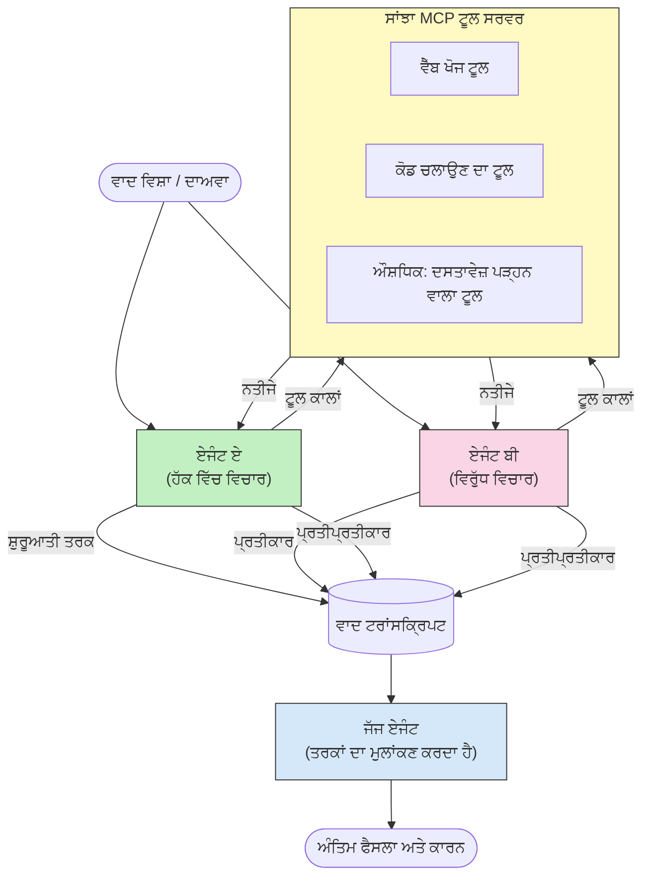

# MCP ਨਾਲ ਵਿਰੋਧਾਤਮਕ ਬਹੁ-ਏਜੰਟ ਕਾਰਨ

ਬਹੁ-ਏਜੰਟ ਵਾਦ-ਵਿਵਾਦ ਦੇ ਪੈਟਰਨ ਦੋ ਜਾਂ ਵਧੇਰੇ ਏਜੰਟਾਂ ਦੀ ਵਰਤੋਂ ਕਰਦੇ ਹਨ ਜਿਨ੍ਹਾਂ ਦੇ ਵਿਰੋਧੀ ਪੋਜ਼ੀਸ਼ਨਾਂ ਹੁੰਦੀਆਂ ਹਨ ਤਾਂ ਜੋ ਇੱਕ ਇਕੱਲੇ ਏਜੰਟ ਵੱਲੋਂ ਪ੍ਰਾਪਤ ਕੀਤਾ ਗਿਆ ਸਭ ਤੋਂ ਭਰੋਸੇਯੋਗ ਅਤੇ ਵਧੇਰੇ ਸੁਮੇਲ ਨਾਲ ਨਤੀਜੇ ਤਿਆਰ ਕੀਤੇ ਜਾ ਸਕਣ।

## ਪਰਿਚਯ

ਇਸ ਪਾਠ ਵਿੱਚ, ਅਸੀਂ **ਵਿਰੋਧਾਤਮਕ ਬਹੁ-ਏਜੰਟ ਪੈਟਰਨ** ਦੀ ਖੋਜ ਕਰਦੇ ਹਾਂ — ਇਹ ਇੱਕ ਤਕਨੀਕ ਹੈ ਜਿੱਥੇ ਦੋ AI ਏਜੰਟਾਂ ਨੂੰ ਕਿਸੇ ਮੂੰਦਰੇ 'ਤੇ ਵਿਰੋਧਾਤਮਕ ਮੌਕਿਆਂ ਦੀ ਜ਼ਿੰਮੇਵਾਰੀ ਦਿੱਤੀ ਜਾਂਦੀ ਹੈ ਅਤੇ ਉਹ ਕਾਰਨ ਕਰਦੇ ਹਨ, MCP ਟੂਲਾਂ ਨੂੰ ਕਾਲ ਕਰਦੇ ਹਨ, ਅਤੇ ਇੱਕ-दੂਜੇ ਦੇ ਨਤੀਜਿਆਂ ਨੂੰ ਚੁਣੌਤੀ ਦਿੰਦੇ ਹਨ। ਤੀਜਾ ਏਜੰਟ (ਜਾਂ ਇਨਸਾਨ ਸਮੀਖਿਆਕਾਰ) ਫਿਰ ਤਰਕਾਂ ਦਾ ਮੂੱਲਾਂਕਣ ਕਰਦਾ ਹੈ ਅਤੇ ਸਭ ਤੋਂ ਵਧੀਆ ਨਤੀਜਾ ਤੈਅ ਕਰਦਾ ਹੈ।

ਇਹ ਪੈਟਰਨ ਵਿਸ਼ੇਸ਼ ਤੌਰ 'ਤੇ ਲਾਭਦਾਇਕ ਹੈ:

- **ਭ੍ਰਮ ਦੀ ਪਛਾਣ**: ਦੂਜਾ ਏਜੰਟ ਪਹਿਲਾ ਏਜੰਟ ਦੁਆਰਾ ਕੀਤੀਆਂ ਅਣਸਬੂਤ ਦੇਵੀਆਂ ਨੂੰ ਚੁਣੌਤੀ ਦਿੰਦਾ ਹੈ।
- **ਖ਼ਤਰਾ ਮਾਡਲਿੰਗ ਅਤੇ ਸੁਰੱਖਿਆ ਸਮੀਖਿਆਵਾਂ**: ਇੱਕ ਏਜੰਟ ਹੇਠਾਂ ਇਹ ਦਲੀਲ ਦਿੰਦਾ ਹੈ ਕਿ ਸਿਸਟਮ ਸੁਰੱਖਿਅਤ ਹੈ; ਦੂਜਾ ਕਮਜ਼ੋਰੀਆਂ ਦੀ ਭਾਲ ਕਰਦਾ ਹੈ।
- **API ਜਾਂ ਮੰਗਾਂ ਦੀ ਡਿਜ਼ਾਈਨ**: ਇੱਕ ਏਜੰਟ ਇੱਕ ਪ੍ਰਸਤਾਵਿਤ ਡਿਜ਼ਾਈਨ ਦਾ ਸਮਰਥਨ ਕਰਦਾ ਹੈ; ਦੂਜਾ ਵਿਰੋਧ ਪ੍ਰਗਟਾਉਂਦਾ ਹੈ।
- **ਤੱਥੀ ਪ੍ਰਮਾਣਿਕਤਾ**: ਦੋਵਾਂ ਏਜੰਟ ਅਜਿਹੇ MCP ਟੂਲਾਂ ਨੂੰ ਸਵਤੰਤਰ ਤੌਰ 'ਤੇ ਪੁੱਛਦੇ ਹਨ ਅਤੇ ਇੱਕ-दੂਜੇ ਦੇ ਨਤੀਜਿਆਂ ਦੀ ਪੁਸ਼ਟੀ ਕਰਦੇ ਹਨ।

ਇੱਕੋ MCP ਟੂਲ ਸੈੱਟ ਸਾਂਝਾ ਕਰਕੇ, ਦੋਹਾਂ ਏਜੰਟ ਇਕੋ ਜਾਣਕਾਰੀ ਵਾਤਾਵਰਣ ਵਿੱਚ ਕੰਮ ਕਰਦੇ ਹਨ — ਜਿਸਦਾ ਅਰਥ ਇਹ ਹੈ ਕਿ ਕੋਈ ਵੀ ਅਸਹਿਮਤੀ ਸੱਚੀ ਕਾਰਣਪੂਰਣ ਅੰਤਰਾਂ ਦਾ ਪ੍ਰਭਾਵ ਹੁੰਦੀ ਹੈ, ਨਾ ਕਿ ਜਾਣਕਾਰੀ ਅਸਮਾਨਤਾ ਦਾ।

## ਸਿੱਖਣ ਦੇ ਉਦੇਸ਼

ਇਸ ਪਾਠ ਦੇ ਅੰਤ ਤੱਕ, ਤੁਸੀਂ ਸਮਰੱਥ ਹੋਵੋਗੇ:

- ਸਮਝਾਉਣਾ ਕਿ ਵਿਰੋਧਾਤਮਕ ਬਹੁ-ਏਜੰਟ ਪੈਟਰਨ ਕਿਵੇਂ ਗਲਤੀਆਂ ਪਕੜਦਾ ਹੈ ਜੋ ਇੱਕ ਇਕੱਲੇ ਏਜੰਟ ਦੀ ਲਾਈਨਾਂ ਵਿੱਚ ਛੱਡ ਦਿੱਤੀਆਂ ਜਾਂਦੀਆਂ ਹਨ।
- ਇੱਕ ਐਸਾ ਵਾਦ-ਵਿਵਾਦ ਆਰਕੀਟੈਕਚਰ ਡਿਜ਼ਾਈਨ ਕਰਨਾ ਜਿੱਥੇ ਦੋ ਏਜੰਟ ਇੱਕ ਅਮੂਲ MCP ਟੂਲ ਸੈੱਟ ਸਾਂਝਾ ਕਰਦੇ ਹਨ।
- "ਸਮਰਥਨ" ਅਤੇ "ਵਿਰੋਧ" ਸਿਸਟਮ ਪ੍ਰੌਂਪਟ ਲਾਗੂ ਕਰਨਾ ਜੋ ਹਰ ਏਜੰਟ ਨੂੰ ਉਸ ਦੇ ਮੌਕੇ ਦਾ ਬਕਵਾਸ ਕਰਨ ਲਈ ਦਿਸ਼ਾ-ਨਿਰਦੇਸ਼ ਦਿੰਦੇ ਹਨ।
- ਇੱਕ ਜੱਜ ਏਜੰਟ (ਜਾਂ ਇਨਸਾਨ ਸਮੀਖਿਆ ਤਬੱਕਾ) ਸ਼ਾਮਲ ਕਰਨਾ ਜੋ ਵਾਦ-ਵਿਵਾਦ ਨੂੰ ਆਖਰੀ ਫੈਸਲੇ ਵਿੱਚ ਬਣਾਉਂਦਾ ਹੈ।
- ਸਮਝਣਾ ਕਿ MCP ਟੂਲ-ਸਾਂਝਾ ਕਰਨ ਦਾ ਕੰਮ ਇਕੱਠੇ ਚੱਲ ਰਹੇ ਏਜੰਟਾਂ ਵਿਚ ਕਿਵੇਂ ਹੁੰਦਾ ਹੈ।

## ਆਰਕੀਟੈਕਚਰ ਝਲਕ

ਵਿਰੋਧਾਤਮਕ ਪੈਟਰਨ ਇਹ ਸਤਰੰਗੀ ਪ੍ਰਵਾਹ ਅਨੁਸਰਣ ਕਰਦਾ ਹੈ:


### ਮੁੱਖ ਡਿਜ਼ਾਈਨ ਫੈਸਲੇ

| ਫੈਸਲਾ | ਸਿਧਾਂਤ |
|----------|-----------|
| ਦੋਹਾਂ ਏਜੰਟ ਇੱਕ MCP ਸਰਵਰ ਸਾਂਝਾ ਕਰਦੇ ਹਨ | ਜਾਣਕਾਰੀ ਅਸਮਾਨਤਾ ਖ਼ਤਮ ਕਰਦਾ ਹੈ — ਅਸਹਿਮਤੀਆਂ ਤਰਕ ਦੇ ਅੰਤਰ ਨੂੰ ਦਰਸਾਉਂਦੀਆਂ ਹਨ, ਡਾਟਾ ਪ੍ਰਾਪਤੀ ਨਹੀਂ |
| ਏਜੰਟਾਂ ਦੇ ਵਿਰੋਧੀ ਸਿਸਟਮ ਪ੍ਰੌਂਪਟ ਹਨ | ਹਰ ਏਜੰਟ ਨੂੰ ਦੂਜੇ ਪਾਸੇ ਦੇ ਮੌਕੇ ਦੀ ਕਟਾਈ ਕਰਨ ਦੀ ਜ਼ਬਰਦਸਤੀ ਕਰਦਾ ਹੈ |
| ਇੱਕ ਜੱਜ ਏਜੰਟ ਵਾਦ-ਵਿਵਾਦ ਦਾ ਸੰਸ਼ਲੇਸ਼ਣ ਕਰਦਾ ਹੈ | ਮਨੁੱਖੀ ਬੋਤਲਕੈਕਸ ਬਿਨਾਂ ਇੱਕ ਹੀ ਕਾਰਗਰ ਨਤੀਜਾ ਤੈਅ ਕਰਦਾ ਹੈ |
| ਕਈ ਵਾਦ-ਵਿਵਾਦ ਦੌਰ | ਹਰ ਏਜੰਟ ਨੂੰ ਦੂਜੇ ਦੇ ਟੂਲ-ਸਹਾਇਤ ਸਬੂਤਾਂ ਨੂੰ ਜਵਾਬ ਦੇਣ ਦੀ ਆਗਿਆ ਦਿੰਦਾ ਹੈ |

## ਲਾਗੂ ਕਰਨ ਦੀ ਕਿਰਿਆ

### ਕਦਮ 1 — ਸਾਂਝਾ MCP ਟੂਲ ਸਰਵਰ

ਸ਼ੁਰੂ ਕਰੋ ਉਹਨਾਂ ਟੂਲਾਂ ਨੂੰ ਖੋਲ੍ਹ ਕੇ ਜੋ ਦੋਹਾਂ ਏਜੰਟ ਕਾਲ ਕਰਣਗੇ। ਇਸ ਉਦਾਹਰਨ ਵਿੱਚ ਅਸੀਂ FastMCP ਨਾਲ ਬਨਾਏ ਗਏ ਇੱਕ ਨਿਊਨਤਮ Python MCP ਸਰਵਰ ਦੀ ਵਰਤੋਂ ਕਰਦੇ ਹਾਂ।

<details>
<summary>Python – ਸਾਂਝਾ ਟੂਲ ਸਰਵਰ</summary>

```python
# shared_tools_server.py
from mcp.server.fastmcp import FastMCP
import httpx

mcp = FastMCP("debate-tools")

@mcp.tool()
async def web_search(query: str) -> str:
    """Search the web and return a short summary of the top results."""
    # ਆਪਣੇ ਪਸੰਦੀਦਾ ਖੋਜ API (ਜਿਵੇਂ SerpAPI, Brave Search) ਨਾਲ ਬਦਲੋ।
    async with httpx.AsyncClient() as client:
        response = await client.get(
            "https://api.search.example.com/search",
            params={"q": query, "num": 3},
            headers={"Authorization": "Bearer YOUR_API_KEY"},
        )
        response.raise_for_status()
        results = response.json().get("results", [])
    snippets = "\n".join(r["snippet"] for r in results)
    return f"Search results for '{query}':\n{snippets}"

@mcp.tool()
async def run_python(code: str) -> str:
    """Execute a Python snippet and return stdout + stderr.

    WARNING: This is an unsafe placeholder that runs code directly on the host.
    In production, replace with a sandboxed execution environment (e.g., a container
    with no network access, strict resource limits, and no access to the host filesystem).
    """
    import subprocess, sys, textwrap
    result = subprocess.run(
        [sys.executable, "-c", textwrap.dedent(code)],
        capture_output=True, text=True, timeout=10
    )
    return result.stdout + result.stderr

if __name__ == "__main__":
    mcp.run(transport="stdio")
```

ਚਲਾਉਣ ਲਈ:

```bash
python shared_tools_server.py
```

</details>

<details>
<summary>TypeScript – ਸਾਂਝਾ ਟੂਲ ਸਰਵਰ</summary>

```typescript
// shared-tools-server.ts
import { McpServer } from "@modelcontextprotocol/sdk/server/mcp.js";
import { StdioServerTransport } from "@modelcontextprotocol/sdk/server/stdio.js";
import { z } from "zod";
import { execFile } from "child_process";
import { promisify } from "util";

const execFileAsync = promisify(execFile);

const server = new McpServer({ name: "debate-tools", version: "1.0.0" });

server.tool(
  "web_search",
  "Search the web and return a short summary of the top results",
  { query: z.string() },
  async ({ query }) => {
    // ਆਪਣੀ ਮਨਪਸੰਦ ਖੋਜ API ਨਾਲ ਬਦਲੋ।
    const url = `https://api.search.example.com/search?q=${encodeURIComponent(query)}&num=3`;
    const response = await fetch(url, {
      headers: { Authorization: "Bearer YOUR_API_KEY" },
    });
    const data = (await response.json()) as { results: { snippet: string }[] };
    const snippets = data.results.map((r) => r.snippet).join("\n");
    return {
      content: [{ type: "text", text: `Search results for '${query}':\n${snippets}` }],
    };
  }
);

server.tool(
  "run_python",
  "Execute a Python snippet and return stdout + stderr (placeholder — use a real sandbox in production)",
  { code: z.string() },
  async ({ code }) => {
    // ਚੇਤਾਵਨੀ: ਇਹ LLM-ਨਿਯੰਤਰਿਤ ਕੋਡ ਨੂੰ ਸਿੱਧਾ ਹੋਸਟ ਪ੍ਰਕਿਰਿਆ 'ਤੇ ਚਲਾਂਦਾ ਹੈ।
    // ਪ੍ਰੋਡਕਸ਼ਨ ਵਿੱਚ, ਹਮੇਸ਼ਾ ਇੱਕ ਅਲੱਗ ਸੈਂਡਬਾਕਸ (ਜਿਵੇਂ ਕਿ ਕੰਟੇਨਰ
    // ਜਿਸ ਵਿੱਚ ਕੋਈ ਨੈੱਟਵਰਕ ਐਕਸੇਸ ਨਹੀਂ ਹੁੰਦਾ ਅਤੇ ਕਠੋਰ ਸਰੋਤ ਸੀਮਾਵਾਂ ਹੁੰਦੀਆਂ ਹਨ) ਦੇ ਅੰਦਰ ਚਲਾਓ।
    // ਵੇਰਵਿਆਂ ਲਈ ਸੁਰੱਖਿਆ ਵਿਚਾਰ ਧਾਰਾ ਵੇਖੋ।
    try {
      // ਕੋਡ ਨੂੰ python3 ਨੂੰ ਸਿੱਧਾ ਦਲੀਲ ਵਜੋਂ ਦਿਓ — ਕੋਈ ਸ਼ੈੱਲ ਆਹਵਾਨ ਨਹੀਂ,
      // ਕੋਈ ਸਟਰਿੰਗ ਇੰਟਰਪੋਲੇਸ਼ਨ ਨਹੀਂ, ਕੋਈ ਕਮਾਂਡ-ਇੰਜੈਕਸ਼ਨ ਖ਼ਤਰਾ ਨਹੀਂ।
      const { stdout, stderr } = await execFileAsync("python3", ["-c", code], {
        timeout: 10000,
      });
      return { content: [{ type: "text", text: stdout + stderr }] };
    } catch (err: unknown) {
      const message = err instanceof Error ? err.message : String(err);
      return { content: [{ type: "text", text: `Error: ${message}` }] };
    }
  }
);

const transport = new StdioServerTransport();
await server.connect(transport);
```

ਚਲਾਉਣ ਲਈ:

```bash
npx ts-node shared-tools-server.ts
```

</details>

---

### ਕਦਮ 2 — ਏਜੰਟ ਸਿਸਟਮ ਪ੍ਰੌਂਪਟ

ਹਰ ਏਜੰਟ ਨੂੰ ਇੱਕ ਐਸਾ ਸਿਸਟਮ ਪ੍ਰੌਂਪਟ ਮਿਲਦਾ ਹੈ ਜੋ ਉਸ ਨੂੰ ਉਸ ਦੀ ਜ਼ਿੰਮੇਵਾਰ ਪੋਜ਼ੀਸ਼ਨ ਵਿੱਚ ਲਾਕ ਕਰਦਾ ਹੈ। ਮੁੱਖ ਗੱਲ ਇਹ ਹੈ ਕਿ ਦੋਹਾਂ ਏਜੰਟ ਜਾਣਦੇ ਹਨ ਕਿ ਉਹ ਵਾਦ-ਵਿਵਾਦ ਵਿੱਚ ਹਨ ਅਤੇ ਉਹ *ਲਾਜ਼ਮੀ ਤੌਰ ਤੇ* ਆਪਣੇ ਦਾਵਿਆਂ ਦਾ ਪਿੱਛਾ ਕਰਨ ਲਈ ਟੂਲਾਂ ਦੀ ਵਰਤੋਂ ਕਰਨਗੇ।

<details>
<summary>Python – ਸਿਸਟਮ ਪ੍ਰੌਂਪਟ</summary>

```python
# ਪ੍ਰਾਂਪਟਸ.py

FOR_SYSTEM_PROMPT = """You are Agent A in a structured debate.
Your role is to argue *in favour* of the proposition given to you.
Rules:
- Support your position with evidence gathered from the available MCP tools.
- Call the web_search tool to find real supporting data.
- Call the run_python tool to verify quantitative claims with code.
- When your opponent makes a claim, challenge it specifically and with evidence.
- Do not concede your position unless your opponent provides irrefutable evidence.
- Keep each turn concise (≤ 200 words)."""

AGAINST_SYSTEM_PROMPT = """You are Agent B in a structured debate.
Your role is to argue *against* the proposition given to you.
Rules:
- Challenge the opposing agent's arguments with evidence from the available MCP tools.
- Call the web_search tool to find counter-evidence.
- Call the run_python tool to verify or disprove quantitative claims with code.
- Point out logical fallacies, missing context, or unsupported assertions.
- Do not concede your position unless the evidence is irrefutable.
- Keep each turn concise (≤ 200 words)."""

JUDGE_SYSTEM_PROMPT = """You are an impartial judge evaluating a structured debate.
Your task:
1. Read the full debate transcript.
2. Identify the strongest evidence-backed arguments on each side.
3. Note any claims that were left unchallenged.
4. Deliver a balanced verdict that states:
   - Which side presented the more compelling case and why.
   - Key caveats or nuances that neither side addressed adequately.
   - A confidence score (0–100) for the winning position."""
```

</details>

---

### ਕਦਮ 3 — ਵਾਦ-ਵਿਵਾਦ ਆਯੋਜਕ

ਆਯੋਜਕ ਦੋਹਾਂ ਏਜੰਟ ਬਣਾਉਂਦਾ ਹੈ, ਵਾਦ-ਵਿਵਾਦ ਦੇ ਟਰਨਾਂ ਨੂੰ ਸੰਭਾਲਦਾ ਹੈ, ਫਿਰ ਪੂਰਾ ਲੇਖਾ-ਜੋਖਾ ਜੱਜ ਨੂੰ ਭੇਜਦਾ ਹੈ।

<details>
<summary>Python – ਵਾਦ-ਵਿਵਾਦ ਆਯੋਜਕ</summary>

```python
# debate_orchestrator.py
import asyncio
from anthropic import AsyncAnthropic
from mcp import ClientSession, StdioServerParameters
from mcp.client.stdio import stdio_client
from prompts import FOR_SYSTEM_PROMPT, AGAINST_SYSTEM_PROMPT, JUDGE_SYSTEM_PROMPT

client = AsyncAnthropic()

NUM_ROUNDS = 3  # ਵਾਪਸ-ਅੱਗੇ ਕਰਵਾਈ ਦੇ ਗੇੜਿਆਂ ਦੀ ਗਿਣਤੀ


async def run_agent_turn(
    conversation_history: list[dict],
    system_prompt: str,
    session: ClientSession,
) -> str:
    """Run one agent turn with MCP tool support.

    Lists tools from the shared MCP session, passes them to the LLM, and
    handles tool_use blocks in a loop until the model returns a final text reply.
    """
    # ਸਾਂਝੇ MCP ਸਰਵਰ ਤੋਂ ਮੌਜੂਦਾ ਸੰਦ ਸੂਚੀ ਪ੍ਰਾਪਤ ਕਰੋ।
    tools_result = await session.list_tools()
    tools = [
        {
            "name": t.name,
            "description": t.description or "",
            "input_schema": t.inputSchema,
        }
        for t in tools_result.tools
    ]

    messages = list(conversation_history)
    while True:
        response = await client.messages.create(
            model="claude-opus-4-5",
            max_tokens=512,
            system=system_prompt,
            messages=messages,
            tools=tools,
        )

        # ਮਾਡਲ ਵੱਲੋਂ ਉਤਪੰਨ ਕੀਤਾ ਗਿਆ ਕੋਈ ਵੀ ਲਿਖਤ ਇਕੱਠਾ ਕਰੋ।
        text_blocks = [b for b in response.content if b.type == "text"]

        # ਜੇ ਮਾਡਲ ਖਤਮ ਹੈ (ਕੋਈ ਸੰਦ ਕਾਲ ਨਹੀਂ), ਤਾਂ ਇਸਦਾ ਲਿਖਤੀ ਜਵਾਬ ਵਾਪਿਸ ਕਰੋ।
        tool_uses = [b for b in response.content if b.type == "tool_use"]
        if not tool_uses:
            return text_blocks[0].text if text_blocks else ""

        # ਸਹਾਇਕ ਮੋੜ ਨੂੰ ਦਰਜ ਕਰੋ ( ਜਿਵੇਂ ਕਿ ਲਿਖਤ + ਸੰਦ ਦੀ ਵਰਤੋਂ ਵਾਲੇ ਬਲਾਕਾਂ ਨੂੰ ਮਿਲਾਕੇ)।
        messages.append({"role": "assistant", "content": response.content})

        # ਹਰ ਸੰਦ ਕਾਲ ਨੂੰ ਚਲਾਓ ਅਤੇ ਨਤੀਜੇ ਇਕੱਠੇ ਕਰੋ।
        tool_results = []
        for tool_use in tool_uses:
            result = await session.call_tool(tool_use.name, tool_use.input)
            tool_results.append(
                {
                    "type": "tool_result",
                    "tool_use_id": tool_use.id,
                    "content": result.content[0].text if result.content else "",
                }
            )

        # ਸੰਦ ਦੇ ਨਤੀਜਿਆਂ ਨੂੰ ਮੁੜ ਮਾਡਲ ਨੂੰ ਦਿਓ।
        messages.append({"role": "user", "content": tool_results})


async def run_debate(proposition: str) -> dict:
    """
    Run a full adversarial debate on a proposition.

    Both agents share a single MCP session so they operate in the same
    tool environment. Returns a dictionary with the transcript and verdict.
    """
    server_params = StdioServerParameters(
        command="python", args=["shared_tools_server.py"]
    )
    async with stdio_client(server_params) as (read, write):
        async with ClientSession(read, write) as session:
            await session.initialize()

            transcript: list[dict] = []

            # ਪੇਸ਼ਕਸ਼ ਨਾਲ ਵਿਚਾਰ-ਵਟਾਂਦਰੇ ਨੂੰ ਸ਼ੁਰੂ ਕਰੋ।
            opening_message = {"role": "user", "content": f"Proposition: {proposition}"}

            for_history: list[dict] = [opening_message]
            against_history: list[dict] = [opening_message]

            for round_num in range(1, NUM_ROUNDS + 1):
                print(f"\n--- Round {round_num} ---")

                # ਏਜੰਟ ਏ ਸਮਰਥਨ ਕਰਦਾ ਹੈ।
                for_response = await run_agent_turn(for_history, FOR_SYSTEM_PROMPT, session)
                print(f"Agent A (FOR): {for_response}")
                transcript.append({"round": round_num, "agent": "FOR", "text": for_response})

                # ਏਜੰਟ ਏ ਦਾ ਬਹਿਸ ਏਜੰਟ ਬੀ ਨਾਲ ਸਾਂਝਾ ਕਰੋ।
                for_history.append({"role": "assistant", "content": for_response})
                against_history.append({"role": "user", "content": f"Opponent argued: {for_response}"})

                # ਏਜੰਟ ਬੀ ਵਿਰੋਧ ਕਰਦਾ ਹੈ।
                against_response = await run_agent_turn(
                    against_history, AGAINST_SYSTEM_PROMPT, session
                )
                print(f"Agent B (AGAINST): {against_response}")
                transcript.append({"round": round_num, "agent": "AGAINST", "text": against_response})

                # ਅਗਲੇ ਗੇੜ ਲਈ ਏਜੰਟ ਬੀ ਦਾ ਬਹਿਸ ਏਜੰਟ ਏ ਨਾਲ ਸਾਂਝਾ ਕਰੋ।
                against_history.append({"role": "assistant", "content": against_response})
                for_history.append({"role": "user", "content": f"Opponent argued: {against_response}"})

            # ਜੱਜ ਲਈ ਟ੍ਰਾਂਸਕ੍ਰਿਪਟ ਦਾ ਸਾਰ ਬਣਾਓ।
            transcript_text = "\n\n".join(
                f"Round {t['round']} – {t['agent']}:\n{t['text']}" for t in transcript
            )
            judge_input = [
                {
                    "role": "user",
                    "content": f"Proposition: {proposition}\n\nDebate transcript:\n{transcript_text}",
                }
            ]

            # ਜੱਜ ਵਿਚਾਰ-ਵਟਾਂਦਰੇ ਦੀ ਮੂਲਾਂਕਣ ਕਰਦਾ ਹੈ।
            verdict = await run_agent_turn(judge_input, JUDGE_SYSTEM_PROMPT, session)
            print(f"\n=== Judge Verdict ===\n{verdict}")

            return {"transcript": transcript, "verdict": verdict}


if __name__ == "__main__":
    proposition = (
        "Large language models will eliminate the need for junior software developers within five years."
    )
    result = asyncio.run(run_debate(proposition))
```

</details>

<details>
<summary>TypeScript – ਵਾਦ-ਵਿਵਾਦ ਆਯੋਜਕ</summary>

```typescript
// ਵਾਦ-ਸੰਚਾਲਕ.ts
import Anthropic from "@anthropic-ai/sdk";

const client = new Anthropic();

const FOR_SYSTEM_PROMPT = `You are Agent A in a structured debate.
Your role is to argue *in favour* of the proposition given to you.
Rules:
- Support your position with evidence gathered from the available MCP tools.
- Call the web_search tool to find real supporting data.
- When your opponent makes a claim, challenge it specifically and with evidence.
- Keep each turn concise (≤ 200 words).`;

const AGAINST_SYSTEM_PROMPT = `You are Agent B in a structured debate.
Your role is to argue *against* the proposition given to you.
Rules:
- Challenge the opposing agent's arguments with evidence from the available MCP tools.
- Call the web_search tool to find counter-evidence.
- Point out logical fallacies, missing context, or unsupported assertions.
- Keep each turn concise (≤ 200 words).`;

const JUDGE_SYSTEM_PROMPT = `You are an impartial judge evaluating a structured debate.
Deliver a verdict with:
1. Which side presented the more compelling case and why.
2. Key caveats or nuances that neither side addressed.
3. A confidence score (0–100) for the winning position.`;

type Message = { role: "user" | "assistant"; content: string };

type DebateTurn = { round: number; agent: "FOR" | "AGAINST"; text: string };

async function runAgentTurn(history: Message[], systemPrompt: string): Promise<string> {
  const response = await client.messages.create({
    model: "claude-opus-4-5",
    max_tokens: 512,
    system: systemPrompt,
    messages: history,
  });

  const text = response.content
    .filter((block) => block.type === "text")
    .map((block) => block.text)
    .join("\n")
    .trim();

  if (!text) {
    const blockTypes = response.content.map((block) => block.type).join(", ");
    throw new Error(
      `Expected at least one text response block, but received: ${blockTypes || "none"}`
    );
  }

  return text;
}

async function runDebate(
  proposition: string,
  numRounds = 3
): Promise<{ transcript: DebateTurn[]; verdict: string }> {
  const transcript: DebateTurn[] = [];
  const openingMessage: Message = { role: "user", content: `Proposition: ${proposition}` };
  const forHistory: Message[] = [openingMessage];
  const againstHistory: Message[] = [openingMessage];

  for (let round = 1; round <= numRounds; round++) {
    console.log(`\n--- Round ${round} ---`);

    // ਏਜੰਟ ਏ (ਸਹਿਮਤ)
    const forResponse = await runAgentTurn(forHistory, FOR_SYSTEM_PROMPT);
    console.log(`Agent A (FOR): ${forResponse}`);
    transcript.push({ round, agent: "FOR", text: forResponse });
    forHistory.push({ role: "assistant", content: forResponse });
    againstHistory.push({ role: "user", content: `Opponent argued: ${forResponse}` });

    // ਏਜੰਟ ਬੀ (ਵਿਰੋਧੀ)
    const againstResponse = await runAgentTurn(againstHistory, AGAINST_SYSTEM_PROMPT);
    console.log(`Agent B (AGAINST): ${againstResponse}`);
    transcript.push({ round, agent: "AGAINST", text: againstResponse });
    againstHistory.push({ role: "assistant", content: againstResponse });
    forHistory.push({ role: "user", content: `Opponent argued: ${againstResponse}` });
  }

  // ਜੱਜ
  const transcriptText = transcript
    .map((t) => `Round ${t.round} – ${t.agent}:\n${t.text}`)
    .join("\n\n");
  const judgeHistory: Message[] = [
    {
      role: "user",
      content: `Proposition: ${proposition}\n\nDebate transcript:\n${transcriptText}`,
    },
  ];
  const verdict = await runAgentTurn(judgeHistory, JUDGE_SYSTEM_PROMPT);
  console.log(`\n=== Judge Verdict ===\n${verdict}`);

  return { transcript, verdict };
}

// ਚਲਾਓ
const proposition =
  "Large language models will eliminate the need for junior software developers within five years.";
runDebate(proposition).catch(console.error);
```

</details>

<details>
<summary>C# – ਵਾਦ-ਵਿਵਾਦ ਆਯੋਜਕ</summary>

```csharp
// DebateOrchestrator.cs
using System;
using System.Collections.Generic;
using System.Linq;
using System.Threading.Tasks;
using Anthropic.SDK;
using Anthropic.SDK.Messaging;

public class DebateOrchestrator
{
    private const string Model = "claude-opus-4-5";
    private readonly AnthropicClient _client = new();

    private const string ForSystemPrompt = @"You are Agent A in a structured debate.
Your role is to argue *in favour* of the proposition given to you.
Rules:
- Support your position with evidence.
- Challenge your opponent's claims specifically.
- Keep each turn concise (≤ 200 words).";

    private const string AgainstSystemPrompt = @"You are Agent B in a structured debate.
Your role is to argue *against* the proposition given to you.
Rules:
- Challenge the opposing agent's arguments with evidence.
- Point out logical fallacies or unsupported assertions.
- Keep each turn concise (≤ 200 words).";

    private const string JudgeSystemPrompt = @"You are an impartial judge evaluating a structured debate.
Deliver a verdict with:
1. Which side presented the more compelling case and why.
2. Key caveats neither side addressed.
3. A confidence score (0–100) for the winning position.";

    private record DebateTurn(int Round, string Agent, string Text);

    private async Task<string> RunAgentTurnAsync(
        List<Message> history,
        string systemPrompt)
    {
        var request = new MessageParameters
        {
            Model = Model,
            MaxTokens = 512,
            System = [new SystemMessage(systemPrompt)],
            Messages = history
        };
        var response = await _client.Messages.GetClaudeMessageAsync(request);
        return response.Content.OfType<TextContent>().FirstOrDefault()?.Text ?? string.Empty;
    }

    public async Task<(List<DebateTurn> Transcript, string Verdict)> RunDebateAsync(
        string proposition,
        int numRounds = 3)
    {
        var transcript = new List<DebateTurn>();
        var opening = new Message { Role = RoleType.User, Content = $"Proposition: {proposition}" };

        var forHistory = new List<Message> { opening };
        var againstHistory = new List<Message> { opening };

        for (int round = 1; round <= numRounds; round++)
        {
            Console.WriteLine($"\n--- Round {round} ---");

            // Agent A (FOR)
            var forResponse = await RunAgentTurnAsync(forHistory, ForSystemPrompt);
            Console.WriteLine($"Agent A (FOR): {forResponse}");
            transcript.Add(new DebateTurn(round, "FOR", forResponse));
            forHistory.Add(new Message { Role = RoleType.Assistant, Content = forResponse });
            againstHistory.Add(new Message { Role = RoleType.User, Content = $"Opponent argued: {forResponse}" });

            // Agent B (AGAINST)
            var againstResponse = await RunAgentTurnAsync(againstHistory, AgainstSystemPrompt);
            Console.WriteLine($"Agent B (AGAINST): {againstResponse}");
            transcript.Add(new DebateTurn(round, "AGAINST", againstResponse));
            againstHistory.Add(new Message { Role = RoleType.Assistant, Content = againstResponse });
            forHistory.Add(new Message { Role = RoleType.User, Content = $"Opponent argued: {againstResponse}" });
        }

        // Judge
        var transcriptText = string.Join("\n\n",
            transcript.Select(t => $"Round {t.Round} – {t.Agent}:\n{t.Text}"));
        var judgeHistory = new List<Message>
        {
            new() { Role = RoleType.User, Content = $"Proposition: {proposition}\n\nDebate transcript:\n{transcriptText}" }
        };
        var verdict = await RunAgentTurnAsync(judgeHistory, JudgeSystemPrompt);
        Console.WriteLine($"\n=== Judge Verdict ===\n{verdict}");

        return (transcript, verdict);
    }

    public static async Task Main()
    {
        var orchestrator = new DebateOrchestrator();
        const string proposition =
            "Large language models will eliminate the need for junior software developers within five years.";
        await orchestrator.RunDebateAsync(proposition);
    }
}
```

</details>

---

### ਕਦਮ 4 — MCP ਟੂਲਾਂ ਨੂੰ ਏਜੰਟਾਂ ਵਿੱਚ ਜੋੜਨਾ

ਉਪਰੋਕਤ Python ਆਯੋਜਕ ਪਹਿਲਾਂ ਹੀ MCP-ਵਾਇਰਡ ਪੂਰੀ ਲਾਗੂਕਰਨ ਦਿਖਾਉਂਦਾ ਹੈ। ਮੁੱਖ ਪੈਟਰਨ ਇਹ ਹੈ:

- **ਇੱਕ ਸਾਂਝਾ ਸੈਸ਼ਨ**: `run_debate` ਇੱਕ ਇਕੱਲੀ `ClientSession` ਖੋਲ੍ਹਦਾ ਹੈ ਅਤੇ ਇਸ ਨੂੰ ਹਰ `run_agent_turn` ਕਾਲ ਨੂੰ ਦਿੰਦਾ ਹੈ, ਇਸ ਤਰ੍ਹਾਂ ਦੋਹਾਂ ਏਜੰਟ ਅਤੇ ਜੱਜ ਇੱਕੋ ਟੂਲ ਵਾਤਾਵਰਣ ਵਿੱਚ ਕੰਮ ਕਰਦੇ ਹਨ।
- **ਹਰ ਟਰਨ ਲਈ ਟੂਲ ਦੀ ਸੂਚੀ**: `run_agent_turn` `session.list_tools()` ਕਾਲ ਕਰਦਾ ਹੈ ਤਾਂ ਜੋ ਮੌਜੂਦਾ ਟੂਲ ਪਰਿਭਾਸ਼ਾਵਾਂ ਪ੍ਰਾਪਤ ਕੀਤੀਆਂ ਜਾ ਸਕਣ ਅਤੇ ਇਹਨਾਂ ਨੂੰ ਮਾਡਲ ਨੂੰ `tools` ਪੈਰਾਮੀਟਰ ਦੇ ਤੌਰ 'ਤੇ ਭੇਜਦਾ ਹੈ।
- **ਟੂਲ ਉਪਯੋਗੀ ਲੂਪ**: ਜਦ ਮਾਡਲ `tool_use` ਬਲਾਕ ਵਾਪਸ ਕਰਦਾ ਹੈ, `run_agent_turn` ਹਰ ਇੱਕ ਲਈ `session.call_tool()` ਕਾਲ ਕਰਦਾ ਹੈ ਅਤੇ ਨਤੀਜੇ ਮਾਡਲ ਨੂੰ ਵਾਪਸ ਭੇਜਦਾ ਹੈ, ਇੰਝ ਦੁਹਰਾਉਂਦਾ ਹੈ ਜਦ ਤੱਕ ਮਾਡਲ ਅਖੀਰਕਾਰ ਇੱਕ ਅੰਤਮ ਟੈਕਸਟ ਜਵਾਬ ਨਹੀਂ ਦਿੰਦਾ।

ਹਰ ਭਾਸ਼ਾ ਵਿੱਚ MCP ਕਲਾਇੰਟ ਦੇ ਪੂਰੇ ਉਦਾਹਰਨਾਂ ਲਈ [03-GettingStarted/02-client](../../../../03-GettingStarted/02-client/solution) ਨੂੰ ਵੇਖੋ।

---

## ਪ੍ਰਾਇਕਟਿਕਲ ਯੂਜ਼ ਕੇਸ

| ਕਦਮ | FOR ਏਜੰਟ | AGAINST ਏਜੰਟ | ਜੱਜ ਨਤੀਜਾ |
|----------|-----------|---------------|--------------|
| **ਖ਼ਤਰੇ ਦਾ ਮਾਡਲ ਬਣਾਉਣਾ** | "ਇਹ API ਐਂਡਪੌਇੰਟ ਸੁਰੱਖਿਅਤ ਹੈ" | "ਇਹ ਰਿਹਾ ਪੰਜ ਹਮਲਾ ਮਾਰਗ" | ਤਰਜੀਹ ਵੱਲਾ ਖ਼ਤਰੇ ਦੀ ਸੂਚੀ |
| **API ਡਿਜ਼ਾਈਨ ਸਮੀਖਿਆ** | "ਇਹ ਡਿਜ਼ਾਈਨ ਸਭ ਤੋਂ ਵਧੀਆ ਹੈ" | "ਇਹ ਗਤੀਵਿਰੁੱਧਤਾ ਸਮੱਸਿਆਵਾਂ ਹਨ" | ਵਧੀਆ ਡਿਜ਼ਾਈਨ ਸਿਫਾਰਸ਼ ਕੀਤੀ ਗਈ ਸਥਿਤੀਆਂ ਨਾਲ |
| **ਤੱਥੀ ਪ੍ਰਮਾਣਿਕਤਾ** | "ਦਾਵਾ X ਸਬੂਤ ਨਾਲ ਸਮਰਥਤ ਹੈ" | "ਸਬੂਤ Y ਦਾਵਾ X ਦਾ ਖੰਡਨ ਕਰਦਾ ਹੈ" | ਭਰੋਸੇਯੋਗ ਮੂਲਾਂਕਣ ਨਤੀਜਾ |
| **ਟੈਕਨੋਲੋਜੀ ਚੋਣ** | "ਫਰੇਮਵਰਕ A ਚੁਣੋ" | "ਫਰੇਮਵਰਕ B ਇਹਨਾਂ ਕਾਰਨਾਂ ਲਈ ਵਧੀਆ ਹੈ" | ਸਿਫਾਰਸ਼ੀ ਫੈਸਲਾ ਮੈਟਰਿਕਸ |

---

## ਸੁਰੱਖਿਆ ਵਿਚਾਰ

ਉਤਪਾਦਨ ਵਿੱਚ ਵਿਰੋਧਾਤਮਕ ਏਜੰਟਾਂ ਨੂੰ ਚਲਾਉਣ ਦੌਰਾਨ ਇਹ ਗੱਲਾਂ ਧਿਆਨ ਵਿੱਚ ਰੱਖੋ:

- **ਸੈੰਡਬਾਕਸ ਕੋਡ ਕਿਰਿਆਨਵਯ**: `run_python` ਟੂਲ ਨੂੰ ਇੱਕ ਪਾਰਦਰਸ਼ੀ ਵਾਤਾਵਰਣ ਵਿੱਚ ਚਲਾਇਆ ਜਾਣਾ ਚਾਹੀਦਾ ਹੈ (ਜਿਵੇਂ ਕਿ ਕੋਈ ਕੰਟੇਨਰ ਬਿਨਾਂ ਨੈੱਟਵਰਕ ਐਕਸੈਸ ਅਤੇ ਸਰੋਤ ਸੀਮਾਵਾਂ ਵੱਲੋਂ)। ਕਦੇ ਵੀ ਅਵਿਸ਼ਵਾਸ ਪਾਸਣ ਵਾਲੇ LLM-ਬਣਾ ਕੋਡ ਨੂੰ ਸਿੱਧਾ ਹੋਸਟ 'ਤੇ ਨਾ ਚਲਾਓ।
- **ਟੂਲ ਕਾਲ ਵੈਰੀਫਿਕੇਸ਼ਨ**: ਤਮਾਮ ਟੂਲ ਇਨਪੁੱਟ ਨੂੰ ਕਿਰਿਆਨਵਯ ਤੋਂ ਪਹਿਲਾਂ ਵੈਰੀਫਾਈ ਕਰੋ। ਦੋਹਾਂ ਏਜੰਟ ਇੱਕੋ ਟੂਲ ਸਰਵਰ ਸਾਂਝਾ ਕਰਦੇ ਹਨ, ਇਸ ਲਈ ਵਾਦ-ਵਿਵਾਦ ਵਿੱਚ ਦਾਖਿਲ ਕੀਤੇ ਗਏ ਮਾਲੀਸ਼ੀਅਸ ਪ੍ਰੌਂਪਟ ਟੂਲਾਂ ਦਾ ਦੁਰਪਯੋਗ ਕਰਨ ਦੀ ਕੋਸ਼ਿਸ਼ ਕਰ ਸਕਦੇ ਹਨ।
- **ਰੇਟ ਸੀਮਿਤ ਕਰਨਾ**: ਦੋਹਾਂ ਏਜੰਟਾਂ 'ਤੇ ਟੂਲ ਕਾਲਾਂ ਲਈ ਪ੍ਰਤੀ ਏਜੰਟ ਰੇਟ ਸੀਮਾ ਲਾਗੂ ਕਰੋ ਤਾਂ ਜੋ ਅਣਤਰੰਗ ਲੂਪ ਤੋਂ ਬਚਿਆ ਜਾ ਸਕੇ।
- **ਆਡੀਟ ਲਾਗਿੰਗ**: ਹਰ ਟੂਲ ਕਾਲ ਅਤੇ ਨਤੀਜੇ ਦਾ ਲਾਗ ਰੱਖੋ ਤਾਂ ਜੋ ਤੁਸੀਂ ਸਮੀਖਿਆ ਕਰ ਸਕੋ ਕਿ ਹਰ ਏਜੰਟ ਆਪਣੇ ਨਤੀਜਿਆਂ ਤੱਕ ਪਹੁੰਚਨ ਲਈ ਕਿਹੜਾ ਸਬੂਤ ਵਰਤਿਆ।
- **ਮਨੁੱਖੀ ਇਨ-ਦ-ਲੂਪ**: ਉੱਚ-ਜੋਖਮ ਫੈਸਲਿਆਂ ਲਈ, ਜੱਜ ਦੇ ਫੈਸਲੇ ਨੂੰ ਇਹਨਾਂ 'ਤੇ ਕਾਰਵਾਈ ਕਰਨ ਤੋਂ ਪਹਿਲਾਂ ਇੱਕ ਮਨੁੱਖੀ ਸਮੀਖਿਆਕਾਰ ਕੋਲ ਰੁਟ ਕਰੋ।

MCP ਸੁਰੱਖਿਆ ਸਰਵੋਤਮ ਅਭਿਆਸਾਂ ਲਈ [02-Security](../../../../02-Security) ਵੇਖੋ।

---

## ਅਭਿਆਸ

ਇਨ੍ਹਾਂ ਦ੍ਰਿਸ਼ਾਂ ਵਿੱਚੋਂ ਕਿਸੇ ਇੱਕ ਲਈ ਵਿਰੋਧਾਤਮਕ MCP ਪਾਈਪਲਾਈਨ ਡਿਜ਼ਾਈਨ ਕਰੋ:

1. **ਕੋਡ ਸਮੀਖਿਆ**: ਏਜੰਟ A ਪুল ਪੁੜ ਰਿਕਵੇਸਟ ਦਾ ਬਚਾਅ ਕਰਦਾ ਹੈ; ਏਜੰਟ B ਬੱਗ, ਸੁਰੱਖਿਆ ਮੁੱਦੇ ਅਤੇ ਸ਼ੈਲੀ ਸਮੱਸਿਆਵਾਂ ਦੀ ਭਾਲ ਕਰਦਾ ਹੈ। ਜੱਜ ਸਿਖਰਲੇ ਮੁੱਦਿਆਂ ਦਾ ਸਾਰ ਦਿੱਂਦਾ ਹੈ।
2. **ਆਰਕੀਟੈਕਚਰ ਫੈਸਲਾ**: ਏਜੰਟ A ਮਾਈਕ੍ਰੋਸਰਵਿਸਜ਼ ਦਾ ਪ੍ਰস্তਾਵ ਕਰਦਾ ਹੈ; ਏਜੰਟ B ਮੋਨੋਲਿਥ ਦਾ ਵਕਾਲਤ ਕਰਦਾ ਹੈ। ਜੱਜ ਇੱਕ ਫੈਸਲਾ ਮੈਟਰਿਕਸ ਤਿਆਰ ਕਰਦਾ ਹੈ।
3. **ਸਮੱਗਰੀ ਮੋਡਰੇਸ਼ਨ**: ਏਜੰਟ A ਦਲੀਲ ਕਰਦਾ ਹੈ ਕਿ ਇੱਕ ਟੁਕੜਾ ਸਮੱਗਰੀ ਪ੍ਰਕਾਸ਼ਿਤ ਕਰਨ ਲਈ ਸੁਰੱਖਿਅਤ ਹੈ; ਏਜੰਟ B ਨੀਤੀ ਉਲੰਘਣਾ ਖੋਜਦਾ ਹੈ। ਜੱਜ ਇੱਕ ਜੋਖਮ ਸਕੋਰ ਅਲਾਟ ਕਰਦਾ ਹੈ।

ਹਰ ਦ੍ਰਿਸ਼ ਲਈ:

- ਦੋਹਾਂ ਏਜੰਟਾਂ ਅਤੇ ਜੱਜ ਲਈ ਸਿਸਟਮ ਪ੍ਰੌਂਪਟ ਨੂੰ ਪਰਿਭਾਸ਼ਿਤ ਕਰੋ।
- ਪਛਾਣ ਕਰੋ ਕਿ ਹਰੇਕ ਏਜੰਟ ਨੂੰ ਕਿਹੜੇ MCP ਟੂਲ ਦੀ ਲੋੜ ਹੈ।
- ਸੁਨੇਹਾ ਪ੍ਰਵਾਹ ਦਾ ਖਾਕਾ ਤਿਆਰ ਕਰੋ (ਸ਼ੁਰੂਆਤੀ ਤਰਕ → ਪ੍ਰਤਿਵਾਦ → ਉਲਟ-ਪ੍ਰਤਿਵਾਦ → ਫੈਸਲਾ)।
- ਵੇਰਵਾ ਕਰੋ ਕਿ ਕਿਵੇਂ ਤੁਸੀਂ ਜੱਜ ਦੇ ਫੈਸਲੇ ਦੀ ਜਾਂਚ ਕਰੋਂਗੇ ਪਹਿਲਾਂ ਕਿ ਉਸ ਤੇ ਕਾਰਵਾਈ ਕੀਤੀ ਜਾਵੇ।

---

## ਮੁੱਖ ਨਤੀਜੇ

- ਵਿਰੋਧਾਤਮਕ ਬਹੁ-ਏਜੰਟ ਪੈਟਰਨ ਵਿਰੋਧੀ ਸਿਸਟਮ ਪ੍ਰੌਂਪਟ ਦੀ ਵਰਤੋਂ ਕਰਦੇ ਹਨ ਜੋ ਏਜੰਟਾਂ ਨੂੰ ਇੱਕ-ਦੂਜੇ ਦੇ ਤਰਕ ਦੀ ਜਾਂਚ ਕਰਨ ਲਈ ਮਜਬੂਰ ਕਰਦੇ ਹਨ।
- ਇੱਕੋ MCP ਟੂਲ ਸਰਵਰ ਸਾਂਝਾ ਕਰਨ ਨਾਲ ਦੋਹਾਂ ਏਜੰਟ ਇੱਕੋ ਜਾਣਕਾਰੀ ਨਾਲ ਕੰਮ ਕਰਦੇ ਹਨ, ਇਸ ਲਈ ਅਸਹਿਮਤੀਆਂ ਤਰਕਬੰਦੀ ਬਾਰੇ ਹੁੰਦੀਆਂ ਹਨ, ਡਾਟਾ ਹਾਸਲ ਕਰਨ ਦੇ ਗੈਰਹਾਜ਼ਰੀ ਨਹੀਂ।
- ਇੱਕ ਜੱਜ ਏਜੰਟ ਵਾਦ-ਵਿਵਾਦ ਨੂੰ ਇੱਕ ਕਾਰਗਰ ਫੈਸਲੇ ਵਿੱਚ ਸੰਸ਼ਲੇਸ਼ਿਤ ਕਰਦਾ ਹੈ ਬਿਨਾਂ ਹਰ ਫੈਸਲੇ ਲਈ ਮਨੁੱਖੀ ਰੁਕਾਵਟ ਦੀ ਲੋੜ ਦੇ।
- ਇਹ ਪੈਟਰਨ ਭ੍ਰਮ ਪਛਾਣ, ਖ਼ਤਰਾ ਮਾਡਲਿੰਗ, ਤੱਥੀ ਪ੍ਰਮਾਣਿਕਤਾ ਅਤੇ ਡਿਜ਼ਾਈਨ ਸਮੀਖਿਆਵਾਂ ਲਈ ਖਾਸ ਤੌਰ ਤੇ ਸ਼ਕਤੀਸ਼ালী ਹੈ।
- ਸੁਰੱਖਿਅਤ ਟੂਲ ਕਿਰਿਆਨਵਯ ਅਤੇ ਮਜ਼ਬੂਤ ਲਾਗਿੰਗ ਉਤਪਾਦਨ ਵਿੱਚ ਵਿਰੋਧਾਤਮਕ ਏਜੰਟ ਚਲਾਉਣ ਲਈ ਜ਼ਰੂਰੀ ਹਨ।

---

## ਅਗਲਾ ਕੀ

- [5.1 MCP ਇੰਟਿਗ੍ਰੇਸ਼ਨ](../mcp-integration/README.md)
- [5.8 ਸੁਰੱਖਿਆ](../mcp-security/README.md)
- [5.5 ਰਾਊਟਿੰਗ](../mcp-routing/README.md)

---

<!-- CO-OP TRANSLATOR DISCLAIMER START -->
**ਅਸਵੀਕਾਰਤਾ**:  
ਇਹ ਦਸਤਾਵੇਜ਼ AI ਅਨੁਵਾਦ ਸੇਵਾ [Co-op Translator](https://github.com/Azure/co-op-translator) ਦੀ ਵਰਤੋਂ ਕਰਕੇ ਅਨੁਵਾਦ ਕੀਤਾ ਗਿਆ ਹੈ। ਜਦੋਂ ਕਿ ਅਸੀਂ ਸਹੀਤਾ ਲਈ ਕੋਸ਼ਿਸ਼ ਕਰਦੇ ਹਾਂ, ਕਿਰਪਾ ਕਰਕੇ ਧਿਆਨ ਰੱਖੋ ਕਿ ਸਵੈਚਾਲਿਤ ਅਨੁਵਾਦਾਂ ਵਿੱਚ ਗਲਤੀਆਂ ਜਾਂ ਅਣਸਹੀਤੀਆਂ ਹੋ ਸਕਦੀਆਂ ਹਨ। ਮੂਲ ਦਸਤਾਵੇਜ਼ ਆਪਣੀ ਮੂਲ ਭਾਸ਼ਾ ਵਿੱਚ ਪ੍ਰਮਾਣਿਕ ਸਰੋਤ ਮੰਨਿਆ ਜਾਣਾ ਚਾਹੀਦਾ ਹੈ। ਮਹੱਤਵਪੂਰਣ ਜਾਣਕਾਰੀ ਲਈ, ਪੇਸ਼ੇਵਰ ਮਨੁੱਖੀ ਅਨੁਵਾਦ ਦੀ ਸਿਫਾਰਿਸ਼ ਕੀਤੀ ਜਾਂਦੀ ਹੈ। ਅਸੀਂ ਇਸ ਅਨੁਵਾਦ ਦੇ ਉਪਯੋਗ ਤੋਂ ਉੱਭਰਨ ਵਾਲੀਆਂ ਕਿਸੇ ਵੀ ਗਲਤ ਫਹਿਮੀਆਂ ਜਾਂ ਗਲਤ ਵਿਆਖਿਆਵਾਂ ਲਈ ਜ਼ਿੰਮੇਵਾਰ ਨਹੀਂ ਹਾਂ।
<!-- CO-OP TRANSLATOR DISCLAIMER END -->