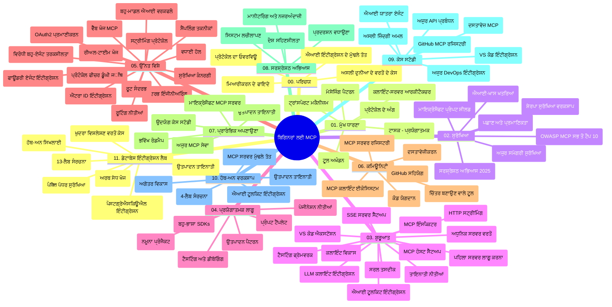

# ਮਾਡਲ ਕਾਂਟੈਕਸਟ ਪ੍ਰੋਟੋਕੋਲ (MCP) ਬਾਰੇ ਸ਼ੁਰੂਆਤੀ - ਅਧਿਐਨ ਮਾਰਗਦਰਸ਼ਕ

ਇਹ ਅਧਿਐਨ ਮਾਰਗਦਰਸ਼ਕ "ਮਾਡਲ ਕਾਂਟੈਕਸਟ ਪ੍ਰੋਟੋਕੋਲ (MCP) ਬਾਰੇ ਸ਼ੁਰੂਆਤੀ" ਪਾਠਕ੍ਰਮ ਲਈ ਰੀਪੋਜ਼ਟਰੀ ਦੀ ਬਣਤਰ ਅਤੇ ਸਮੱਗਰੀ ਬਾਰੇ ਇੱਕ ਝਲਕ ਪ੍ਰਦਾਨ ਕਰਦਾ ਹੈ। ਇਸ ਮਾਰਗਦਰਸ਼ਕ ਦੀ ਵਰਤੋਂ ਕਰਕੇ ਰੀਪੋਜ਼ਟਰੀ ਨੂੰ ਪ੍ਰਭਾਵਸ਼ਾਲੀ ਢੰਗ ਨਾਲ ਨੈਵੀਗੇਟ ਕਰੋ ਅਤੇ ਉਪਲੱਬਧ ਸਰੋਤਾਂ ਦਾ ਪੂਰਾ ਫਾਇਦਾ ਉਠਾਓ।

## ਰੀਪੋਜ਼ਟਰੀ ਦਾ ਜਾਇਜ਼ਾ

ਮਾਡਲ ਕਾਂਟੈਕਸਟ ਪ੍ਰੋਟੋਕੋਲ (MCP) ਇੱਕ ਮਿਆਰੀਕ੍ਰਿਤ ਫਰੇਮਵਰਕ ਹੈ ਜੋ AI ਮਾਡਲਾਂ ਅਤੇ ਕਲਾਇੰਟ ਐਪਲੀਕੇਸ਼ਨਾਂ ਦੇ ਵਿਚਕਾਰ ਸੰਵਾਦ ਲਈ ਹੈ। ਪਹਿਲਾਂ Anthropoc ਨੇ ਬਣਾਇਆ ਸੀ, ਹੁਣ MCP ਨੂੰ MCP ਸਮੁਦਾਇ ਵੱਲੋਂ ਅਧਿਕਾਰਤ GitHub ਸੰਗਠਨ ਰਾਹੀਂ ਸੰਭਾਲਿਆ ਜਾਂਦਾ ਹੈ। ਇਹ ਰੀਪੋਜ਼ਟਰੀ AI ਵਿਕਾਸਕਾਰਾਂ, ਸਿਸਟਮ ਆਰਕੀਟੈਕਟਾਂ ਅਤੇ ਸੌਫਟਵੇਅਰ ਇੰਜੀਨੀਅਰਾਂ ਲਈ C#, Java, JavaScript, Python, ਅਤੇ TypeScript ਵਿੱਚ ਹੱਥ-ਓਨ ਕੋਡ ਉਦਾਹਰਨਾਂ ਸਹਿਤ ਸਮਗ੍ਰ ਪਾਠਕ੍ਰਮ ਪ੍ਰਦਾਨ ਕਰਦਾ ਹੈ।

## ਵਿਜ਼ੂਅਲ ਪਾਠਕ੍ਰਮ ਨਕਸ਼ਾ

## ਰੀਪੋਜ਼ਟਰੀ ਬਣਤਰ

ਰੀਪੋਜ਼ਟਰੀ ਨੂੰ ਗਿਆਰਾਂ ਮੁੱਖ ਭਾਗਾਂ ਵਿੱਚ ਵੰਡਿਆ ਗਿਆ ਹੈ, ਹਰ ਭਾਗ MCP ਦੇ ਵੱਖ-ਵੱਖ ਪਹਿਲੂਆਂ 'ਤੇ ਧਿਆਨ ਕੇਂਦ੍ਰਿਤ ਕਰਦਾ ਹੈ:

1. **ਪਰਿਚਯ (00-Introduction/)**
   - ਮਾਡਲ ਕਾਂਟੈਕਸਟ ਪ੍ਰੋਟੋਕੋਲ ਦਾ ਜਾਇਜ਼ਾ
   - AI ਪੈਪਲਾਈਨਾਂ ਵਿੱਚ ਮਿਆਰੀਕਰਨ ਕਿਉਂ ਜਰੂਰੀ ਹੈ
   - ਵਿਹਾਰਕ ਉਪਯੋਗ ਅਤੇ ਲਾਭ

2. **ਮੂਲ ਧਾਰਣਾ (01-CoreConcepts/)**
   - ਕਲਾਇੰਟ-ਸਰਵਰ ਆਰਕੀਟੈਕਚਰ
   - ਮੁੱਖ ਪ੍ਰੋਟੋਕੋਲ ਕੰਪੋਨੇਟ
   - MCP ਵਿੱਚ ਸੁਨੇਹਾ ਭੇਜਣ ਦੇ ਧਾਂਚੇ

3. **ਸੁਰੱਖਿਆ (02-Security/)**
   - MCP-ਅਧਾਰਿਤ ਸਿਸਟਮਾਂ ਵਿੱਚ ਸੁਰੱਖਿਆ ਖਤਰੇ
   - ਕਾਇਮਕਦਮਾਂ ਲਈ ਸਭ ਤੋਂ ਵਧੀਆ ਅਭਿਆਸ
   - ਪ੍ਰਮਾਣਿਕਤਾ ਅਤੇ ਅਧਿਕਾਰਣ ਰਣਨੀਤੀਆਂ
   - **ਵਿਆਪਕ ਸੁਰੱਖਿਆ ਦਸਤਾਵੇਜ਼**:
     - MCP ਸੁਰੱਖਿਆ ਲਈ ਵਧੀਆ ਅਭਿਆਸ 2025
     - Azure ਸਮੱਗਰੀ ਸੁਰੱਖਿਆ ਕਾਰਗੁਜ਼ਾਰੀ ਮਾਰਗਦਰਸ਼ਕ
     - MCP ਸੁਰੱਖਿਆ ਨਿਯੰਤਰਣ ਅਤੇ ਤਕਨੀਕਾਂ
     - MCP ਬਿਹਤਰ ਅਭਿਆਸ ਦਾ ਲਘੂ ਸਰਵੇਖਣ
   - **ਮੁੱਖ ਸੁਰੱਖਿਆ ਵਿਸ਼ੇ**:
     - ਪ੍ਰੋਮਪਟ ਇੰਜੈਕਸ਼ਨ ਅਤੇ ਟੂਲ ਜਹਿਰਲੇ ਹਮਲੇ
     - ਸੈਸ਼ਨ ਹਾਈਜੈਕਿੰਗ ਅਤੇ ਗੁੰਝਲਦਾਰ ਡਿਪਿਊ ਸਮੱਸਿਆਵਾਂ
     - ਟੋਕਨ ਪਾਸਥਰੂ ਕਮਜ਼ੋਰ੍ਹੀਆਂ
     - ਬੇਹੱਦ ਅਧਿਕਾਰ ਅਤੇ ਪਹੁੰਚ ਨਿਯੰਤਰਣ
     - AI ਹਿੱਸਿਆਂ ਲਈ ਸਪਲਾਈ ਚੇਨ ਸੁਰੱਖਿਆ
     - Microsoft ਪ੍ਰੋਮਪਟ ਸ਼ੀਲਡ ਇਕਾਈਕਰਨ

4. **ਸ਼ੁਰੂਆਤ (03-GettingStarted/)**
   - ਮਾਹੌਲ ਸੈਟਅੱਪ ਅਤੇ ਸੰਰਚਨਾ
   - ਮੁੱਢਲੇ MCP ਸਰਵਰ ਅਤੇ ਕਲਾਇੰਟ ਬਣਾਉਣਾ
   - ਮੌਜੂਦਾ ਐਪਲੀਕੇਸ਼ਨਾਂ ਨਾਲ ਇਕਤ੍ਰਿਤ ਕਰਨਾ
   - ਹਿੱਸੇ ਸ਼ਾਮਿਲ ਹਨ:
     - ਪਹਿਲਾ ਸਰਵਰ ਲਾਗੂ ਕਰਨਾ
     - ਕਲਾਇੰਟ ਵਿਕਾਸ
     - LLM ਕਲਾਇੰਟ ਇਕਾਈਕਰਨ
     - VS ਕੋਡ ਇਕਾਈਕਰਨ
     - ਸਰਵਰ-ਸੈਂਟ ਇਵੈਂਟਸ (SSE) ਸਰਵਰ
     - ਅੱਗੇ ਵਧੇ ਸਰਵਰ ਵਰਤੋਂ
     - HTTP ਸਟਰੀਮਿੰਗ
     - AI ਟੂਲਕਿਟ ਇਕਾਈਕਰਨ
     - ਟੈਸਟਿੰਗ ਰਣਨੀਤੀਆਂ
     - ਡਿਪਲੋਇਮੈਂਟ ਮਾਰਗਦਰਸ਼ਕ

5. **ਵਿਹਾਰਕ ਕਾਰਗੁਜ਼ਾਰੀ (04-PracticalImplementation/)**
   - ਵੱਖ-ਵੱਖ ਪ੍ਰੋਗ੍ਰਾਮਿੰਗ ਭਾਸ਼ਾਵਾਂ ਵਿੱਚ SDK ਦੀ ਵਰਤੋਂ
   - ਡੀਬੱਗਿੰਗ, ਟੈਸਟਿੰਗ, ਅਤੇ ਸਹੀ ਕਰਾਉਣ ਦੀਆਂ ਤਕਨੀਕਾਂ
   - ਮੁੜ-ਵਰਤੋਂਯੋਗ ਪ੍ਰੋਮਪਟ ਟੈਂਪਲੇਟਸ ਅਤੇ ਰੁਟਬੰਦੀਆਂ ਬਣਾਉਣਾ
   - ਲਾਗੂ ਕੀਤੇ ਹੋਏ ਪ੍ਰੋਜੈਕਟਾਂ ਦੇ ਨਮੂਨੇ

6. **ਉਚ ਪੱਧਰੀ ਵਿਸ਼ੇ (05-AdvancedTopics/)**
   - ਸੰਦਰਭ ਇੰਜੀਨੀਅਰਿੰਗ ਤਕਨੀਕਾਂ
   - ਫਾਊਂਡਰੀ ਏਜੰਟ ਇਕਾਈਕਰਨ
   - ਬਹੁ-ਮੋਡਲ AI ਵਰਕਫ਼ਲੋਜ਼
   - OAuth2 ਪ੍ਰਮਾਣਿਕਤਾ ਡੈਮੋਜ਼
   - ਤੁਰੰਤ ਖੋਜ ਸਮਰੱਥਾਵਾਂ
   - ਤੁਰੰਤ ਸਟ੍ਰੀਮਿੰਗ
   - ਰੂਟ ਸੰਦਰਭ ਲਾਗੂ ਕਰਨਾ
   - ਰਾਊਟਿੰਗ ਰਣਨੀਤੀਆਂ
   - ਸਮਪਲਿੰਗ ਤਕਨੀਕਾਂ
   - ਸਕੇਲਿੰਗ ਤਰੀਕੇ
   - ਸੁਰੱਖਿਆ-ਸੰਬੰਧੀ ਸੋਚ-ਵਿਚਾਰ
   - Entra ID ਸੁਰੱਖਿਆ ਇਕਾਈਕਰਨ
   - ਵੈੱਬ ਖੋਜ ਇਕਾਈਕਰਨ
   - ਵਿਰੋਧੀ ਬਹੁ-ਏਜੰਟ ਤਰਕਸ਼ੀਲਤਾ (ਚਰਚਾ ਨਮੂਨੇ)

7. **ਕਮਿਉਨਿਟੀ ਯੋਗਦਾਨ (06-CommunityContributions/)**
   - ਕੋਡ ਅਤੇ ਦਸਤਾਵੇਜ਼ ਲਈ ਯੋਗਦਾਨ ਦੇਣ ਦਾ ਤਰੀਕਾ
   - GitHub ਰਾਹੀਂ ਸਹਿਯੋਗ
   - ਕਮਿਉਨਿਟੀ ਸਵੈ-ਚਲਿਤ ਸੁਧਾਰ ਅਤੇ ਫੀਡਬੈਕ
   - ਵੱਖ-ਵੱਖ MCP ਕਲਾਇੰਟ ਵਰਤੋਂ (Claude Desktop, Cline, VSCode)
   - ਪ੍ਰਸਿੱਧ MCP ਸਰਵਰਾਂ ਨਾਲ ਕੰਮ ਕਰਨਾ ਜਿਸ ਵਿੱਚ ਚਿੱਤਰ ਬਣਾਉਣਾ ਸ਼ਾਮਿਲ ਹੈ

8. **ਅਰੰਭਕ ਅਪਣਾਉਣ ਤੋਂ ਪਾਠ (07-LessonsfromEarlyAdoption/)**
   - ਹਕੀਕਤੀ ਲਾਗੂ ਕਰਵਾਈਆਂ ਅਤੇ ਸਫਲਤਾ ਦੀਆਂ ਕਹਾਣੀਆਂ
   - MCP-ਅਧਾਰਿਤ ਹੱਲ ਬਣਾਉਣ ਅਤੇ ਡਿਪਲੋਇ ਕਰਨ
   - ਰੁਝਾਨ ਅਤੇ ਭਵਿੱਖ ਦਾ ਰੋਡਮੈਪ
   - **Microsoft MCP ਸਰਵਰ ਗਾਈਡ**: 10 ਉਤਪਾਦਨ-ਤਿਆਰ Microsoft MCP ਸਰਵਰਾਂ ਲਈ ਵਿਆਪਕ ਮਾਰਗਦਰਸ਼ਨ:
     - Microsoft Learn Docs MCP ਸਰਵਰ
     - Azure MCP ਸਰਵਰ (15+ ਵਿਸ਼ੇਸ਼ ਕਨੈਕਟਰ)
     - GitHub MCP ਸਰਵਰ
     - Azure DevOps MCP ਸਰਵਰ
     - MarkItDown MCP ਸਰਵਰ
     - SQL ਸਰਵਰ MCP ਸਰਵਰ
     - Playwright MCP ਸਰਵਰ
     - Dev Box MCP ਸਰਵਰ
     - Azure AI Foundry MCP ਸਰਵਰ
     - Microsoft 365 Agents Toolkit MCP ਸਰਵਰ

9. **ਸਭ ਤੋਂ ਵਧੀਆ ਅਭਿਆਸ (08-BestPractices/)**
   - ਪ੍ਰਦਰਸ਼ਨ ਸੁਧਾਰ ਅਤੇ ਅਨੁਕੂਲਨ
   - ਖਰਾਬੀ-ਸਹਿਣਸ਼ੀਲ MCP ਸਿਸਟਮਾਂ ਦੀ ਡਿਜ਼ਾਈਨਿੰਗ
   - ਟੈਸਟਿੰਗ ਅਤੇ ਲਚੀਲਾਪਣ ਰਣਨੀਤੀਆਂ

10. **ਕੇਸ ਅਧਿਐਨ (09-CaseStudy/)**
    - **ਸੱਤ ਵਿਆਪਕ ਕੇਸ ਅਧਿਐਨ** ਜੋ MCP ਦੀ ਬਹੁਪੱਖੀਤਾ ਨੂੰ ਵੱਖ-ਵੱਖ ਸੰਦਰਭਾਂ ਵਿੱਚ ਦਰਸਾਉਂਦੇ ਹਨ:
    - **Azure AI ਯਾਤਰਾ ਏਜੰਟ**: Azure OpenAI ਅਤੇ AI ਖੋਜ ਨਾਲ ਬਹੁ-ਏਜੰਟ ਸਮਰੂਪਤਾ
    - **Azure DevOps ਇਕਾਈਕਰਨ**: ਯੂਟਿਊਬ ਡੇਟਾ ਅਪਡੇਟ ਨਾਲ ਵਰਕਫਲੋ ਪ੍ਰਕਿਰਿਆਵਾਂ ਨੂੰ ਸਵੈਚਾਲਿਤ ਕਰਨਾ
    - **ਤੁਰੰਤ ਦਸਤਾਵੇਜ਼ ਪ੍ਰਾਪਤੀ**: Python ਕਨਸੋਲ ਕਲਾਇੰਟ HTTP ਸਟ੍ਰੀਮਿੰਗ ਨਾਲ
    - **ਇੰਟਰਐਕਟਿਵ ਅਧਿਐਨ ਯੋਜਨਾ ਜੈਨਰੇਟਰ**: Chainlit ਵੈੱਬ ਐਪ ਸੰਵਾਦਾਤਮਕ AI ਨਾਲ
    - **ਸੰਪਾਦਕ ਅੰਦਰ ਦਸਤਾਵੇਜ਼**: VS Code GitHub Copilot ਵਰਕਫਲੋਜ਼ ਨਾਲ ਇਕਾਈਕਰਨ
    - **Azure API ਪ੍ਰਬੰਧਨ**: MCP ਸਰਵਰ ਬਣਾਉਣ ਨਾਲ ਏਂਟਰਪ੍ਰਾਈਜ਼ API ਇਕਾਈਕਰਨ
    - **GitHub MCP ਰਜਿਸਟਰੀ**: ਇੱਕੋ ਸਿਸਟਮ ਵਿਕਾਸ ਅਤੇ ਏਜੰਟਿਕ ਇਕਾਈਕਰਨ ਪਲੇਟਫਾਰਮ
    - ਉੱਦਾਹਰਨ ਲਾਗੂਆਂ ਵਿੱਚ ਏਂਟਰਪ੍ਰਾਈਜ਼ ਇਕਾਈਕਰਨ, ਵਿਕਾਸਕਾਰ ਉਤਪਾਦਕਤਾ ਅਤੇ ਇਕਵਸੀ ਸਿਸਟਮ ਵਿਕਾਸ ਸ਼ਾਮਿਲ ਹਨ

11. **ਹਥ-ਓਨ ਵਰਕਸ਼ਾਪ (10-StreamliningAIWorkflowsBuildingAnMCPServerWithAIToolkit/)**
    - MCP ਨੂੰ AI ਟੂਲਕਿਟ ਨਾਲ ਜੋੜਦੇ ਹੋਏ ਵਿਆਪਕ ਹੱਥ-ਓਨ ਵਰਕਸ਼ਾਪ
    - AI ਮਾਡਲਾਂ ਨੂੰ ਹਕੀਕਤੀ ਦੁਨੀਆ ਦੇ ਟੂਲਾਂ ਨਾਲ ਜੋੜਦੇ ਹੋਏ ਬੁੱਧੀਮਾਨ ਐਪਲੀਕੇਸ਼ਨਾਂ ਦਾ ਨਿਰਮਾਣ
    - ਮੂਲ ਭਾਗ, ਕਸਟਮ ਸਰਵਰ ਵਿਕਾਸ ਅਤੇ ਉਤਪਾਦਨ ਡਿਪਲੋਇਮੈਂਟ ਰਣਨੀਤੀਆਂ ਨੂੰ ਕਵਰ ਕਰਨ ਵਾਲੇ ਵਰਕਸ਼ਾਪ ਮਾਡਿਊਲਜ਼
    - **ਲੈਬ ਬਣਤਰ**:
      - ਲੈਬ 1: MCP ਸਰਵਰ ਮੂਲਧਾਰਾ
      - ਲੈਬ 2: ਅੱਗੇ ਵਧੇ MCP ਸਰਵਰ ਵਿਕਾਸ
      - ਲੈਬ 3: AI ਟੂਲਕਿਟ ਇਕਾਈਕਰਨ
      - ਲੈਬ 4: ਉਤਪਾਦਨ ਡਿਪਲੋਇਮੈਂਟ ਅਤੇ ਸਕੇਲਿੰਗ
    - ਪੈੜੀ ਦਰ ਪੈੜੀ ਹਦਾਇਤਾਂ ਦੇ ਨਾਲ ਲੈਬ ਸਮਾਧਾਨ ਧੰਗ

12. **MCP ਸਰਵਰ ਡੇਟਾਬੇਸ ਇਕਾਈਕਰਨ ਲੈਬਜ਼ (11-MCPServerHandsOnLabs/)**
    - **ਉਤਪਾਦਨ-ਤਿਆਰ MCP ਸਰਵਰਾਂ ਲਈ 13-ਲੈਬ ਸਮਗ੍ਰ ਪਾਠ-ਮਾਰਗ**
    - PostgreSQL ਇਕਾਈਕਰਨ ਰਾਹੀਂ ਬਣਾਉਣਾ
    - **ਹਕੀਕਤੀ ਖੁਦਰਾ ਵਿਵਰਣ ਵਿਸ਼ਲੇਸ਼ਣ ਲਾਗੂ ਕਰਨਾ** Zava Retail ਕੇਸ ਸਟਡੀ ਨਾਲ
    - **ਏਂਟਰਪ੍ਰਾਈਜ਼ ਦਰਜੇ ਦੇ ਡੈਜ਼ਾਈਨ ਤੇ ਅਮਲ** ਵਿੱਚ ਰੋਅ ਲੈਵਲ ਸੁਰੱਖਿਆ (RLS), ਸੈਮਾਂਟਿਕ ਖੋਜ ਅਤੇ ਬਹੁ-ਕਿਰਾਏਦਾਰ ਡੇਟਾ ਪਹੁੰਚ ਸ਼ਾਮਿਲ
    - **ਪੂਰੀ ਲੈਬ ਬਣਤਰ**:
      - **ਲੈਬਜ਼ 00-03: ਬੁਨਿਆਦਾਂ** - ਪਰਿਚਯ, ਆਰਕੀਟੈਕਚਰ, ਸੁਰੱਖਿਆ, ਮਾਹੌਲ ਸੈਟਅੱਪ
      - **ਲੈਬਜ਼ 04-06: MCP ਸਰਵਰ ਬਣਾਉਣਾ** - ਡੇਟਾਬੇਸ ਡਿਜ਼ਾਈਨ, MCP ਸਰਵਰ ਲਾਗੂ, ਟੂਲ ਵਿਕਾਸ
      - **ਲੈਬਜ਼ 07-09: ਅੱਗੇ ਵਧੇ ਫੀਚਰ** - ਸੈਮਾਂਟਿਕ ਖੋਜ, ਟੈਸਟਿੰਗ ਅਤੇ ਡੀਬੱਗਿੰਗ, VS ਕੋਡ ਇਕਾਈਕਰਨ
      - **ਲੈਬਜ਼ 10-12: ਉਤਪਾਦਨ ਅਤੇ ਸਰਵੋਤਮ ਅਭਿਆਸ** - ਡਿਪਲੋਇਮੈਂਟ, ਨਿਗਰਾਨੀ, ਅਨੁਕੂਲਨ
    - **ਕਵਰੇਜ ਟੈਕਨੋਲਜੀਜ਼**: FastMCP ਫਰੇਮਵਰਕ, PostgreSQL, Azure OpenAI, Azure ਕੰਟੇਨਰ ਐਪਸ, ਐਪਲੀਕੇਸ਼ਨ ਵਿਚਾਰ
    - **ਸਿੱਖਣ ਦੇ ਨਤੀਜੇ**: ਉਤਪਾਦਨ-ਤਿਆਰ MCP ਸਰਵਰ, ਡੇਟਾਬੇਸ ਇਕਾਈਕਰਨ ਨਮੂਨੇ, AI-ਚਾਲਿਤ ਵਿਸ਼ਲੇਸ਼ਣ, ਏਂਟਰਪ੍ਰਾਈਜ਼ ਸੁਰੱਖਿਆ

## ਵਾਧੂ ਸਰੋਤ

ਰੀਪੋਜ਼ਟਰੀ ਸਮਰਥਕ ਸਰੋਤ ਸ਼ਾਮਿਲ ਕਰਦਾ ਹੈ:

- **ਚਿੱਤਰ ਫੋਲਡਰ**: ਪਾਠਕ੍ਰਮ ਵਿੱਚ ਵਰਤੇ ਗਏ ਚਿੱਤਰ ਅਤੇ ਵਿਵਰਣ
- **ਅਨੁਵਾਦ**: ਦਸਤਾਵੇਜ਼ਾਂ ਦੇ ਆਟੋਮੈਟਿਕ ਅਨੁਵਾਦ ਨਾਲ ਬਹੁ-ਭਾਸ਼ਾਈ ਸਹਾਇਤਾ
- **ਅਧਿਕਾਰਤ MCP ਸਰੋਤ**:
  - [MCP ਦਸਤਾਵੇਜ਼ੀਕਰਨ](https://modelcontextprotocol.io/)
  - [MCP ਵਿਸ਼ੇਸ਼ਤਾ](https://spec.modelcontextprotocol.io/)
  - [MCP GitHub ਰੀਪੋਜ਼ਟਰੀ](https://github.com/modelcontextprotocol)

## ਇਸ ਰੀਪੋਜ਼ਟਰੀ ਦੀ ਵਰਤੋਂ ਕਿਵੇਂ ਕਰੀਏ

1. **ਕ੍ਰਮਬੱਧ ਅਧਿਐਨ**: ਸਾਢੀ ਅਨੁਕ੍ਰਮ (00 ਤੋਂ 11 ਤੱਕ) ਅਨੁਸਰਣ ਕਰੋ ਇੱਕ ਸੰਰਚਿਤ ਸਿੱਖਣ ਅਨੁਭਵ ਲਈ।
2. **ਭਾਸ਼ਾ-ਵਿਸ਼ੇਸ਼ ਧਿਆਨ**: ਜੇ ਤੁਸੀਂ ਕਿਸੇ ਖਾਸ ਪ੍ਰੋਗ੍ਰਾਮਿੰਗ ਭਾਸ਼ਾ ਵਿੱਚ ਰੁਚੀ ਰੱਖਦੇ ਹੋ, ਤਾਂ ਆਪਣੀ ਮਨਪਸੰਦ ਭਾਸ਼ਾ ਵਿੱਚ ਲਾਗੂਆਂ ਲਈ ਸੈਂਪਲ ਡਾਇਰੈਕਟਰੀਆਂ ਵੇਖੋ।
3. **ਵਿਹਾਰਕ ਕਾਰਗੁਜ਼ਾਰੀ**: ਆਪਣੇ ਮਾਹੌਲ ਸੈੱਟ ਕਰਨ ਅਤੇ ਪਹਿਲਾ MCP ਸਰਵਰ ਅਤੇ ਕਲਾਇੰਟ ਬਣਾਉਣ ਲਈ "ਸ਼ੁਰੂਆਤ" ਭਾਗ ਨਾਲ ਸ਼ੁਰੂ ਕਰੋ।
4. **ਉਚ ਪੱਧਰੀ ਖੋਜ**: ਜਦੋ ਮੁਢਲੇ ਧਾਰਣਾਵਾਂ 'ਚ ਸ਼ਮੂਲੀਅਤ ਹੋ ਜਾਵੇ, ਤਾਂ ਆਪਣੇ ਗਿਆਨ ਦੇ ਵਿਸਥਾਰ ਲਈ ਉਚ ਪੱਧਰੀ ਵਿਸ਼ਿਆਂ ਵਿੱਚ ਡੁੱਬਕੀ ਲਗਾਓ।
5. **ਕਮਿਉਨਿਟੀ ਸ਼ਾਮਿਲ ਹੋਣਾ**: MCP ਕਮਿਉਨਿਟੀ ਨਾਲ GitHub ਚਰਚਾ ਅਤੇ Discord ਚੈਨਲਾਂ ਰਾਹੀਂ ਜੁੜੋ ਤਾਂ ਜੋ ਵਿਸ਼ੇਸ਼ਗਿਆਨੀਆਂ ਅਤੇ ਹੋਰ ਵਿਕਾਸਕਾਰਾਂ ਨਾਲ ਸਹਿਯੋਗ ਕੀਤਾ ਜਾ ਸਕੇ।

## MCP ਕਲਾਇੰਟ ਅਤੇ ਟੂਲ

ਪਾਠਕ੍ਰਮ ਵੱਖ-ਵੱਖ MCP ਕਲਾਇੰਟਾਂ ਅਤੇ ਟੂਲਾਂ ਨੂੰ ਕਵਰ ਕਰਦਾ ਹੈ:

1. **ਅਧਿਕਾਰਤ ਕਲਾਇੰਟ**:
   - Visual Studio Code 
   - Visual Studio Code ਵਿੱਚ MCP
   - Claude Desktop
   - VSCode ਵਿੱਚ Claude
   - Claude API

2. **ਕਮਿਉਨਿਟੀ ਕਲਾਇੰਟ**:
   - Cline (ਟਰਮੀਨਲ-ਅਧਾਰਿਤ)
   - Cursor (ਕੋਡ ਸਪਾਦਕ)
   - ChatMCP
   - Windsurf

3. **MCP ਪ੍ਰਬੰਧਨ ਟੂਲ**:
   - MCP CLI
   - MCP ਮੈਨੇਜਰ
   - MCP ਲਿੰਕਰ
   - MCP ਰਾਊਟਰ

## ਲੋਕਪ੍ਰਿਯ MCP ਸਰਵਰ

ਰੀਪੋਜ਼ਟਰੀ ਵੱਖ-ਵੱਖ MCP ਸਰਵਰਾਂ ਨੂੰ ਜਾਣੂ ਕਰਵਾਉਂਦਾ ਹੈ, ਜਿਨ੍ਹਾਂ ਵਿੱਚ ਸ਼ਾਮਿਲ ਹਨ:

1. **ਅਧਿਕਾਰਤ Microsoft MCP ਸਰਵਰ**:
   - Microsoft Learn Docs MCP ਸਰਵਰ
   - Azure MCP ਸਰਵਰ (15+ ਵਿਸ਼ੇਸ਼ ਕਨੈਕਟਰ)
   - GitHub MCP ਸਰਵਰ
   - Azure DevOps MCP ਸਰਵਰ
   - MarkItDown MCP ਸਰਵਰ
   - SQL ਸਰਵਰ MCP ਸਰਵਰ
   - Playwright MCP ਸਰਵਰ
   - Dev Box MCP ਸਰਵਰ
   - Azure AI Foundry MCP ਸਰਵਰ
   - Microsoft 365 Agents Toolkit MCP ਸਰਵਰ

2. **ਅਧਿਕਾਰਤ ਰੈਫਰੈਂਸ ਸਰਵਰ**:
   - ਫਾਇਲਸਿਸਟਮ
   - ਫੈਚ
   - ਮੈਮੋਰੀ
   - ਕ੍ਰਮਿਕ ਸੋਚ

3. **ਚਿੱਤਰ ਤਿਆਰਕ**:
   - Azure OpenAI DALL-E 3
   - Stable Diffusion WebUI
   - Replicate

4. **ਵਿਕਾਸ ਟੂਲ**:
   - Git MCP
   - ਟਰਮੀਨਲ ਕੰਟਰੋਲ
   - ਕੋਡ ਅਸਿਸਟੈਂਟ

5. **ਵਿਸ਼ੇਸ਼ ਸਰਵਰ**:
   - Salesforce
   - Microsoft Teams
   - Jira & Confluence

## ਯੋਗਦਾਨ ਪਾਉਣਾ

ਇਹ ਰੀਪੋਜ਼ਟਰੀ ਕਮਿਉਨਿਟੀ ਵੱਲੋਂ ਦੇਣ ਵਾਲੇ ਯੋਗਦਾਨਾਂ ਦਾ ਸਵਾਗਤ ਕਰਦਾ ਹੈ। MCP ਪਰਿਸਰ ਲਈ ਪ੍ਰਭਾਵਸ਼ਾਲੀ ਯੋਗਦਾਨ ਦੇਣ ਲਈ ਕਮਿਉਨਿਟੀ ਯੋਗਦਾਨ ਭਾਗ ਨੂੰ ਵੇਖੋ।

----

*ਇਹ ਅਧਿਐਨ ਮਾਰਗਦਰਸ਼ਕ ਦਾ ਆਖਰੀ ਅਪਡੇਟ 5 ਫਰਵਰੀ, 2026 ਨੂੰ ਕੀਤਾ ਗਿਆ ਸੀ, ਜੋ ਸਭ ਤੋਂ ਨਵੀਂ MCP ਵਿਸ਼ੇਸ਼ਤਾ 2025-11-25 ਨੂੰ ਦਰਸਾਉਂਦਾ ਹੈ ਅਤੇ ਉਸ ਸਮੇਂ ਦੀ ਰੀਪੋਜ਼ਟਰੀ ਦਾ ਜਾਇਜ਼ਾ ਦਿੰਦਾ ਹੈ। ਇਸ ਮਿਤੀ ਤੋਂ ਬਾਅਦ ਰੀਪੋਜ਼ਟਰੀ ਦੀ ਸਮੱਗਰੀ ਅਪਡੇਟ ਹੋ ਸਕਦੀ ਹੈ।*

---

<!-- CO-OP TRANSLATOR DISCLAIMER START -->
**ਅਸਵੀਕਾਰੋਤਾ**:  
ਇਹ ਦਸਤावੇਜ਼ AI ਅਨੁਵਾਦ ਸੇਵਾ [Co-op Translator](https://github.com/Azure/co-op-translator) ਦੀ ਵਰਤੋਂ ਕਰਕੇ ਅਨੁਵਾਦਿਤ ਕੀਤਾ ਗਿਆ ਹੈ। ਜਦੋਂ ਕਿ ਅਸੀਂ ਸਹੀਤਾ ਲਈ ਕੋਸ਼ਿਸ਼ ਕਰਦੇ ਹਾਂ, ਕਿਰਪਾ ਕਰਕੇ ਧਿਆਨ ਦਿਓ ਕਿ ਸਵੈਚਾਲਿਤ ਅਨੁਵਾਦਾਂ ਵਿੱਚ ਗਲਤੀਆਂ ਜਾਂ ਅਸਪਸ਼ਟਤਾਵਾਂ ਹੋ ਸਕਦੀਆਂ ਹਨ। ਮੂਲ ਦਸਤਾਵੇਜ਼ ਆਪਣੀ ਮੂਲ ਭਾਸ਼ਾ ਵਿੱਚ ਹੀ ਅਥਾਰਟੀਟਿਵ ਸ੍ਰੋਤ ਮੰਨਿਆ ਜਾਣਾ ਚਾਹੀਦਾ ਹੈ। ਜਰੂਰੀ ਜਾਣਕਾਰੀ ਲਈ, ਪ੍ਰੋਫੈਸ਼ਨਲ ਮਨੁੱਖੀ ਅਨੁਵਾਦ ਦੀ ਸਿਫ਼ਾਰਿਸ਼ ਕੀਤੀ ਜਾਂਦੀ ਹੈ। ਅਸੀਂ ਇਸ ਅਨੁਵਾਦ ਦੀ ਵਰਤੋਂ ਨਾਲ ਹੋਣ ਵਾਲੀਆਂ ਕਿਸੇ ਵੀ ਗਲਤ ਫ਼ਹਿਮੀ ਜਾਂ ਗਲਤ ਵਿਆਖਿਆ ਲਈ ਜ਼ਿੰਮੇਵਾਰ ਨਹੀਂ ਹਾਂ।
<!-- CO-OP TRANSLATOR DISCLAIMER END -->