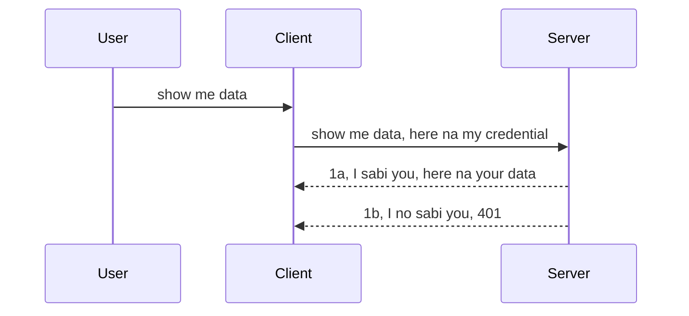

# Simple auth

MCP SDKs dey support di use of OAuth 2.1 wey to be fair, na real work wey dey involve concepts like auth server, resource server, posting credentials, getting code, exchanging code for bearer token till you fit finally get your resource data. If you no sabi OAuth well wey be beta thing to implement, e good make you start with basic auth and build am up to better security. Na why dis chapter dey, to build you reach more advanced auth.

## Auth, wetin we mean?

Auth na short form for authentication and authorization. Di idea na say we need do two tins:

- **Authentication**, na di process of finding out if person go fit enter our house, if dem get right to "be here" mean say dem get access to our resource server wey MCP Server features dey.
- **Authorization**, na di process of finding out if user fit get access to di specific resources wey dem dey ask for, example na these orders or products or whether dem fit read di content but no fit delete as example.

## Credentials: how we take tell di system who we be

Most web developers dey start to think say dem go provide credential to di server, normally secret wey say if dem fit be here "Authentication". Dis credential fit be base64 encoded username and password or API key wey identify specific user.

Dis one dey sent through header wey dem dey call "Authorization" like dis:

```json
{ "Authorization": "secret123" }
```

Dis one na basic authentication dem dey call am. How di overall flow dey work na like dis:


Now we understand how e dey work from flow side, how we go implement am? Most web servers get middleware concept, na piece of code wey dey run as part of di request wey fit verify credentials, if credentials valid e go let request pass. If e no valid, you go get auth error. Make we see how to implement am:

**Python**

```python
class AuthMiddleware(BaseHTTPMiddleware):
    async def dispatch(self, request, call_next):

        has_header = request.headers.get("Authorization")
        if not has_header:
            print("-> Missing Authorization header!")
            return Response(status_code=401, content="Unauthorized")

        if not valid_token(has_header):
            print("-> Invalid token!")
            return Response(status_code=403, content="Forbidden")

        print("Valid token, proceeding...")
       
        response = await call_next(request)
        # add any customer headers or change for di response somehow
        return response


starlette_app.add_middleware(CustomHeaderMiddleware)
```

Here we get: 

- Middleware called `AuthMiddleware` where di `dispatch` method dey called by di web server.
- Middleware don add go the web server:

    ```python
    starlette_app.add_middleware(AuthMiddleware)
    ```

- Writen validation code wey check if Authorization header dey and if di secret wey dem send valid:

    ```python
    has_header = request.headers.get("Authorization")
    if not has_header:
        print("-> Missing Authorization header!")
        return Response(status_code=401, content="Unauthorized")

    if not valid_token(has_header):
        print("-> Invalid token!")
        return Response(status_code=403, content="Forbidden")
    ```

    if secret dey and valid, we go let request pass by calling `call_next` and return di response.

    ```python
    response = await call_next(request)
    # add any customer headers or change for di response somehow
    return response
    ```

How e dey work be say if web request come the server middleware go run and from implementation e go let request pass or e go return error say client no fit continue.

**TypeScript**

Here we create middleware with Express wey popular and intercept di request before e reach MCP Server. Dis na di code for am:

```typescript
function isValid(secret) {
    return secret === "secret123";
}

app.use((req, res, next) => {
    // 1. Authorization header dey?
    if(!req.headers["Authorization"]) {
        res.status(401).send('Unauthorized');
    }
    
    let token = req.headers["Authorization"];

    // 2. Check say e correct.
    if(!isValid(token)) {
        res.status(403).send('Forbidden');
    }

   
    console.log('Middleware executed');
    // 3. Carry di request go di next step for di request pipeline.
    next();
});
```

For dis code we:

1. Check if Authorization header dey, if no dey, we send 401 error.
2. Check if credential/token valid, if no dey valid, we send 403 error.
3. Lastly, pass di request down pipeline and return di resource wey dem request.

## Exercise: Implement authentication

Make we use our knowledge try implement am. Di plan na dis:

Server

- Create web server and MCP instance.
- Implement middleware for server.

Client 

- Send web request with credential via header.

### -1- Create web server and MCP instance

For first step, we go create the web server instance and MCP Server.

**Python**

Here we create MCP server instance, create starlette web app and host am using uvicorn.

```python
# di di MCP Server

app = FastMCP(
    name="MCP Resource Server",
    instructions="Resource Server that validates tokens via Authorization Server introspection",
    host=settings["host"],
    port=settings["port"],
    debug=True
)

# di di starlette web app
starlette_app = app.streamable_http_app()

# dey serve app wit uvicorn
async def run(starlette_app):
    import uvicorn
    config = uvicorn.Config(
            starlette_app,
            host=app.settings.host,
            port=app.settings.port,
            log_level=app.settings.log_level.lower(),
        )
    server = uvicorn.Server(config)
    await server.serve()

run(starlette_app)
```

For dis code we:

- Create MCP Server.
- Build starlette web app from MCP Server, `app.streamable_http_app()`.
- Host and server web app using uvicorn `server.serve()`.

**TypeScript**

Here we create MCP Server instance.

```typescript
const server = new McpServer({
      name: "example-server",
      version: "1.0.0"
    });

    // ... set up server resources, tools, and prompts ...
```

This MCP Server creation need happen inside our POST /mcp route, so make we move di code:

```typescript
import express from "express";
import { randomUUID } from "node:crypto";
import { McpServer } from "@modelcontextprotocol/sdk/server/mcp.js";
import { StreamableHTTPServerTransport } from "@modelcontextprotocol/sdk/server/streamableHttp.js";
import { isInitializeRequest } from "@modelcontextprotocol/sdk/types.js"

const app = express();
app.use(express.json());

// Map wey dey store transports by session ID
const transports: { [sessionId: string]: StreamableHTTPServerTransport } = {};

// Handle POST requests for client-to-server communication
app.post('/mcp', async (req, res) => {
  // Check if session ID dey already
  const sessionId = req.headers['mcp-session-id'] as string | undefined;
  let transport: StreamableHTTPServerTransport;

  if (sessionId && transports[sessionId]) {
    // Use di transport wey already dey
    transport = transports[sessionId];
  } else if (!sessionId && isInitializeRequest(req.body)) {
    // New initialization request
    transport = new StreamableHTTPServerTransport({
      sessionIdGenerator: () => randomUUID(),
      onsessioninitialized: (sessionId) => {
        // Store di transport by session ID
        transports[sessionId] = transport;
      },
      // DNS rebinding protection no dey on by default for backward compatibility. If you dey run dis server
      // locally, make sure say you set:
      // enableDnsRebindingProtection: true,
      // allowedHosts: ['127.0.0.1'],
    });

    // Clean up transport wen e close
    transport.onclose = () => {
      if (transport.sessionId) {
        delete transports[transport.sessionId];
      }
    };
    const server = new McpServer({
      name: "example-server",
      version: "1.0.0"
    });

    // ... set up server resources, tools, and prompts ...

    // Connect to di MCP server
    await server.connect(transport);
  } else {
    // Invalid request
    res.status(400).json({
      jsonrpc: '2.0',
      error: {
        code: -32000,
        message: 'Bad Request: No valid session ID provided',
      },
      id: null,
    });
    return;
  }

  // Handle di request
  await transport.handleRequest(req, res, req.body);
});

// Reusable handler for GET and DELETE requests
const handleSessionRequest = async (req: express.Request, res: express.Response) => {
  const sessionId = req.headers['mcp-session-id'] as string | undefined;
  if (!sessionId || !transports[sessionId]) {
    res.status(400).send('Invalid or missing session ID');
    return;
  }
  
  const transport = transports[sessionId];
  await transport.handleRequest(req, res);
};

// Handle GET requests for server-to-client notifications via SSE
app.get('/mcp', handleSessionRequest);

// Handle DELETE requests for session termination
app.delete('/mcp', handleSessionRequest);

app.listen(3000);
```

Now you see say MCP Server creation dey inside `app.post("/mcp")`.

Make we go next step to create middleware to validate di incoming credential.

### -2- Implement middleware for server

Make we start with middleware now. We go create middleware wey go look for credential inside `Authorization` header and check if e valid. If ok, request go continue do wetin e suppose do (like list tools, read resource or MCP function wey client request).

**Python**

To create middleware, we need create class wey inherit from `BaseHTTPMiddleware`. Two tins important:

- The request `request`, we go read header info from am.
- `call_next` callback we need call if client bring valid credential.

First, we go handle case if `Authorization` header no dey:

```python
has_header = request.headers.get("Authorization")

# no header dey, fail wit 401, if no, continue.
if not has_header:
    print("-> Missing Authorization header!")
    return Response(status_code=401, content="Unauthorized")
```

Here we send 401 unauthorized message because client fail authentication.

Next, if credential show, we check if e valid like dis:

```python
 if not valid_token(has_header):
    print("-> Invalid token!")
    return Response(status_code=403, content="Forbidden")
```

Note how we send 403 forbidden message. Make we check full middleware wey implement all dis:

```python
class AuthMiddleware(BaseHTTPMiddleware):
    async def dispatch(self, request, call_next):

        has_header = request.headers.get("Authorization")
        if not has_header:
            print("-> Missing Authorization header!")
            return Response(status_code=401, content="Unauthorized")

        if not valid_token(has_header):
            print("-> Invalid token!")
            return Response(status_code=403, content="Forbidden")

        print("Valid token, proceeding...")
        print(f"-> Received {request.method} {request.url}")
        response = await call_next(request)
        response.headers['Custom'] = 'Example'
        return response

```

Good, but wetin `valid_token` function do? Here e dey:

```python
# NO use dis one for production - make am beta !!
def valid_token(token: str) -> bool:
    # commot the "Bearer " prefix
    if token.startswith("Bearer "):
        token = token[7:]
        return token == "secret-token"
    return False
```

Dis one fit better.

IMPORTANT: You no suppose put secrets like dis for code. Normally, you go get di value from data source or IDP (identity service provider) or better, make IDP do di validation.

**TypeScript**

To implement this with Express, we call `use` method to take middleware functions.

We need:

- Work with request variable to check credential inside `Authorization`.
- Validate credential, if valid, allow request continue and do wetin MCP suppose do.

Here, we check if `Authorization` header dey, if no, we stop request:

```typescript
if(!req.headers["authorization"]) {
    res.status(401).send('Unauthorized');
    return;
}
```

If no header, you go get 401.

Next, we check if credential valid, if no, we stop again with different message:

```typescript
if(!isValid(token)) {
    res.status(403).send('Forbidden');
    return;
} 
```

You go get 403 error now.

Here be full code:

```typescript
app.use((req, res, next) => {
    console.log('Request received:', req.method, req.url, req.headers);
    console.log('Headers:', req.headers["authorization"]);
    if(!req.headers["authorization"]) {
        res.status(401).send('Unauthorized');
        return;
    }
    
    let token = req.headers["authorization"];

    if(!isValid(token)) {
        res.status(403).send('Forbidden');
        return;
    }  

    console.log('Middleware executed');
    next();
});
```

We set up web server to accept middleware to check client credential. How about client side?

### -3- Send web request with credential via header

We need make sure client dey send credential inside header. We go use MCP client, but how to do am?

**Python**

For client, we pass header with credential like dis:

```python
# NO hardcode di value, make e dey at least for environmental variable or betta storage weh secure pass
token = "secret-token"

async with streamablehttp_client(
        url = f"http://localhost:{port}/mcp",
        headers = {"Authorization": f"Bearer {token}"}
    ) as (
        read_stream,
        write_stream,
        session_callback,
    ):
        async with ClientSession(
            read_stream,
            write_stream
        ) as session:
            await session.initialize()
      
            # TODO, wetin you wan make di client do, like list tools, call tools and so on
```

Note how we fill `headers` like ` headers = {"Authorization": f"Bearer {token}"}`.

**TypeScript**

We fit do am two way:

1. Create config object with credential.
2. Pass config to transport.

```typescript

// NO hardcode di value like dis here. For minimum, make e be env variable and use sometin like dotenv (for dev mode).
let token = "secret123"

// define client transport option object
let options: StreamableHTTPClientTransportOptions = {
  sessionId: sessionId,
  requestInit: {
    headers: {
      "Authorization": "secret123"
    }
  }
};

// pass di options object go di transport
async function main() {
   const transport = new StreamableHTTPClientTransport(
      new URL(serverUrl),
      options
   );
```

You see we create `options` object and put headers inside `requestInit`.

IMPORTANT: How we fit improve am from here? Current way get some risk. First, passing credential like dis dey risky unless you get HTTPS at least. Even so, credential fit thief so you need system to easily revoke token and add other checks like where e come from, if request baka-too-often (bot behaviour), and more.

But, for simple APIs wey no want anybody call API without authentication, dis one na good start.

Now, make we try tighten security small using standard format like JSON Web Token, JWT or "JOT" tokens.

## JSON Web Tokens, JWT

So we dey try improve from simple credentials. Wetin JWT give us quick improvement?

- **Security improvement**. For basic auth, you send username and password as base64 or API key again and again which risk dey high. With JWT, you send username and password get token and e dey expire after some time. JWT let you control access small-small using roles, scopes, permissions.
- **Statelessness and scalability**. JWT self-contained, carry all user info and no need store session for server side. Token fit validate locally.
- **Interoperability and federation**. JWT na core for Open ID Connect and e dey use for known ID providers like Entra ID, Google Identity and Auth0. E make single sign on and more possible, dey enterprise quality.
- **Modularity and flexibility**. JWT fit work with API Gateways like Azure API Management, NGINX and more. E support auth scenarios and server-server communication like impersonation and delegation.
- **Performance and caching**. JWT fit cache after decode to reduce parsing. This help more for high-traffic apps to increase throughput and reduce server load.
- **Advanced features**. E also support introspection (check valid on server) and revocation (make token invalid).

With dis benefits, make we see how to improve our implementation.

## Turning basic auth into JWT

Di high level changes we go do na:

- **Learn how to construct JWT token** ready to send from client to server.
- **Validate JWT token** make if valid, let client get resources.
- **Secure token storage** how to store am.
- **Protect routes** need protect routes and specific MCP features.
- **Add refresh tokens** create short-lived tokens plus long-lived refresh tokens to get new tokens if old one expire. Add refresh endpoint and rotation strategy.

### -1- Construct JWT token

JWT token get dis parts:

- **header**, algorithm used and token type.
- **payload**, claims like sub (user or entity token represent, normally userid), exp (when e expire), role (the role)
- **signature**, signed with secret or private key.

We need build header, payload then encoded token.

**Python**

```python

import jwt
import jwt
from jwt.exceptions import ExpiredSignatureError, InvalidTokenError
import datetime

# Secret key wey dem dey use sign the JWT
secret_key = 'your-secret-key'

header = {
    "alg": "HS256",
    "typ": "JWT"
}

# the user info and im claims plus when e go expire
payload = {
    "sub": "1234567890",               # Subject (user ID)
    "name": "User Userson",                # Custom claim
    "admin": True,                     # Custom claim
    "iat": datetime.datetime.utcnow(),# Issued at
    "exp": datetime.datetime.utcnow() + datetime.timedelta(hours=1)  # Expiry
}

# encode am
encoded_jwt = jwt.encode(payload, secret_key, algorithm="HS256", headers=header)
```

For dis code:

- Define header with HS256 algorithm and type JWT.
- Build payload with subject/user id, username, role, issued time and expiry time to add time bound feature.

**TypeScript**

For dis we need dependencies for making JWT token.

Dependencies

```sh

npm install jsonwebtoken
npm install --save-dev @types/jsonwebtoken
```

Now make we create header, payload and encoded token.

```typescript
import jwt from 'jsonwebtoken';

const secretKey = 'your-secret-key'; // Use env vars for production

// Define the payload
const payload = {
  sub: '1234567890',
  name: 'User usersson',
  admin: true,
  iat: Math.floor(Date.now() / 1000), // Issued at
  exp: Math.floor(Date.now() / 1000) + 60 * 60 // E go expire for 1 hour
};

// Define the header (optional, jsonwebtoken dey set defaults)
const header = {
  alg: 'HS256',
  typ: 'JWT'
};

// Create the token
const token = jwt.sign(payload, secretKey, {
  algorithm: 'HS256',
  header: header
});

console.log('JWT:', token);
```

This token:

Signed with HS256
Valid for 1 hour
Has claims like sub, name, admin, iat, exp.

### -2- Validate token

We need validate token on server to make sure client send correct token. Many checks including token structure and validity. Also add checks if user dey your system and if user get rights.

To validate, decode token then check:

**Python**

```python

# Decode an check the JWT
try:
    decoded = jwt.decode(token, secret_key, algorithms=["HS256"])
    print("✅ Token is valid.")
    print("Decoded claims:")
    for key, value in decoded.items():
        print(f"  {key}: {value}")
except ExpiredSignatureError:
    print("❌ Token has expired.")
except InvalidTokenError as e:
    print(f"❌ Invalid token: {e}")

```

For dis code, we call `jwt.decode` with token, secret key and algorithm. We use try-catch because failure go throw error.

**TypeScript**

Here we call `jwt.verify` to decode token for analysis. If fail, token structure wrong or e no valid.

```typescript

try {
  const decoded = jwt.verify(token, secretKey);
  console.log('Decoded Payload:', decoded);
} catch (err) {
  console.error('Token verification failed:', err);
}
```

NOTE: like we talk before, you suppose add other checks to confirm this token belong to user and user get rights.

Next, make we look role based access control, wey dem call RBAC.
## Adding role based access control

Di idea be say we want talk say different roles get different permissions. For example, we assume say admin fit do everything and say normal user fit do read/write and say guest fit only read. So, here be some possible permission levels:

- Admin.Write 
- User.Read
- Guest.Read

Make we see how we fit take implement such control with middleware. Middleware fit join for each route as well as for all routes.

**Python**

```python
from starlette.middleware.base import BaseHTTPMiddleware
from starlette.responses import JSONResponse
import jwt

# NO try put di secret inside di code, dis na only for show. Make you read am from place wey dey safe.
SECRET_KEY = "your-secret-key" # put dis one for env variable
REQUIRED_PERMISSION = "User.Read"

class JWTPermissionMiddleware(BaseHTTPMiddleware):
    async def dispatch(self, request, call_next):
        auth_header = request.headers.get("Authorization")
        if not auth_header or not auth_header.startswith("Bearer "):
            return JSONResponse({"error": "Missing or invalid Authorization header"}, status_code=401)

        token = auth_header.split(" ")[1]
        try:
            decoded = jwt.decode(token, SECRET_KEY, algorithms=["HS256"])
        except jwt.ExpiredSignatureError:
            return JSONResponse({"error": "Token expired"}, status_code=401)
        except jwt.InvalidTokenError:
            return JSONResponse({"error": "Invalid token"}, status_code=401)

        permissions = decoded.get("permissions", [])
        if REQUIRED_PERMISSION not in permissions:
            return JSONResponse({"error": "Permission denied"}, status_code=403)

        request.state.user = decoded
        return await call_next(request)


```

E get some different ways to add middleware like dis below:

```python

# Alt 1: put middleware while you dey build starlette app
middleware = [
    Middleware(JWTPermissionMiddleware)
]

app = Starlette(routes=routes, middleware=middleware)

# Alt 2: put middleware after starlette app don already build
starlette_app.add_middleware(JWTPermissionMiddleware)

# Alt 3: put middleware per route
routes = [
    Route(
        "/mcp",
        endpoint=..., # handler
        middleware=[Middleware(JWTPermissionMiddleware)]
    )
]
```

**TypeScript**

We fit use `app.use` and middleware wey go run for all requests.

```typescript
app.use((req, res, next) => {
    console.log('Request received:', req.method, req.url, req.headers);
    console.log('Headers:', req.headers["authorization"]);

    // 1. Check if dem don send authorization header

    if(!req.headers["authorization"]) {
        res.status(401).send('Unauthorized');
        return;
    }
    
    let token = req.headers["authorization"];

    // 2. Check if token na correct one
    if(!isValid(token)) {
        res.status(403).send('Forbidden');
        return;
    }  

    // 3. Check if token user dey for our system
    if(!isExistingUser(token)) {
        res.status(403).send('Forbidden');
        console.log("User does not exist");
        return;
    }
    console.log("User exists");

    // 4. Make sure say the token get correct permission
    if(!hasScopes(token, ["User.Read"])){
        res.status(403).send('Forbidden - insufficient scopes');
    }

    console.log("User has required scopes");

    console.log('Middleware executed');
    next();
});

```

E get plenti tins we fit let our middleware do and tins wey our middleware MUST do, na these ones:

1. Check if authorization header dey
2. Check if token valid, we go call `isValid` wey be method wey we write wey go check integrity and validity of JWT token.
3. Verify say user dey our system, we suppose check dis one.

   ```typescript
    // users wey dey for DB
   const users = [
     "user1",
     "User usersson",
   ]

   function isExistingUser(token) {
     let decodedToken = verifyToken(token);

     // TODO, check if user dey for DB
     return users.includes(decodedToken?.name || "");
   }
   ```

   For up there, we create simple `users` list, we suppose keep am for database.

4. Plus, we suppose also check say token get correct permissions.

   ```typescript
   if(!hasScopes(token, ["User.Read"])){
        res.status(403).send('Forbidden - insufficient scopes');
   }
   ```

   For dis code from middleware, we check say token get User.Read permission, if e no get we go send 403 error. Below na `hasScopes` helper method.

   ```typescript
   function hasScopes(scope: string, requiredScopes: string[]) {
     let decodedToken = verifyToken(scope);
    return requiredScopes.every(scope => decodedToken?.scopes.includes(scope));
  }
   ```

Have a think which additional checks you should be doing, but these are the absolute minimum of checks you should be doing.

Using Express as a web framework is a common choice. There are helpers library when you use JWT so you can write less code.

- `express-jwt`, helper library that provides a middleware that helps decode your token.
- `express-jwt-permissions`, this provides a middleware `guard` that helps check if a certain permission is on the token.

Here's what these libraries can look like when used:

```typescript
const express = require('express');
const jwt = require('express-jwt');
const guard = require('express-jwt-permissions')();

const app = express();
const secretKey = 'your-secret-key'; // put this in env variable

// Decode JWT and attach to req.user
app.use(jwt({ secret: secretKey, algorithms: ['HS256'] }));

// Check for User.Read permission
app.use(guard.check('User.Read'));

// multiple permissions
// app.use(guard.check(['User.Read', 'Admin.Access']));

app.get('/protected', (req, res) => {
  res.json({ message: `Welcome ${req.user.name}` });
});

// Error handler
app.use((err, req, res, next) => {
  if (err.code === 'permission_denied') {
    return res.status(403).send('Forbidden');
  }
  next(err);
});

```

Now you don see how middleware fit work for both authentication and authorization, but how about MCP, e dey change how we do auth? Make we find out for the next section.

### -3- Add RBAC to MCP

You don see how you fit add RBAC with middleware, but for MCP e no easy to add per MCP feature RBAC, so wetin we go do? Well, na to add code like dis wey go check if client get rights to call specific tool:

You get different ways to do per feature RBAC, here be some:

- Add check for each tool, resource, prompt wey you need check permission level.

   **python**

   ```python
   @tool()
   def delete_product(id: int):
      try:
          check_permissions(role="Admin.Write", request)
      catch:
        pass # klayan no fit get permission, raise permission gbege
   ```

   **typescript**

   ```typescript
   server.registerTool(
    "delete-product",
    {
      title: Delete a product",
      description: "Deletes a product",
      inputSchema: { id: z.number() }
    },
    async ({ id }) => {
      
      try {
        checkPermissions("Admin.Write", request);
        // todo, send id go productService and remote entry
      } catch(Exception e) {
        console.log("Authorization error, you're not allowed");  
      }

      return {
        content: [{ type: "text", text: `Deletected product with id ${id}` }]
      };
    }
   );
   ```


- Use advanced server approach and request handlers so you reduce how many places you go make check.

   **Python**

   ```python
   
   tool_permission = {
      "create_product": ["User.Write", "Admin.Write"],
      "delete_product": ["Admin.Write"]
   }

   def has_permission(user_permissions, required_permissions) -> bool:
      # user_permissions: list of permissions weh di user get
      # required_permissions: list of permissions weh di tool need
      return any(perm in user_permissions for perm in required_permissions)

   @server.call_tool()
   async def handle_call_tool(
     name: str, arguments: dict[str, str] | None
   ) -> list[types.TextContent]:
    # Assume say request.user.permissions be list of permissions weh di user get
     user_permissions = request.user.permissions
     required_permissions = tool_permission.get(name, [])
     if not has_permission(user_permissions, required_permissions):
        # Raise error "You no get permission to call tool {name}"
        raise Exception(f"You don't have permission to call tool {name}")
     # carry on make you call tool
     # ...
   ```   
   

   **TypeScript**

   ```typescript
   function hasPermission(userPermissions: string[], requiredPermissions: string[]): boolean {
       if (!Array.isArray(userPermissions) || !Array.isArray(requiredPermissions)) return false;
       // Return true if user get at least one required permission
       
       return requiredPermissions.some(perm => userPermissions.includes(perm));
   }
  
   server.setRequestHandler(CallToolRequestSchema, async (request) => {
      const { params: { name } } = request;
  
      let permissions = request.user.permissions;
  
      if (!hasPermission(permissions, toolPermissions[name])) {
         return new Error(`You don't have permission to call ${name}`);
      }
  
      // continue dey go..
   });
   ```

   Note, you go need make sure say your middleware assign decoded token to request's user property so code up there go simple.

### Summing up

Now we don talk how to add support for RBAC in general and MCP in particular, na time to try implement security by yourself to make sure say you understand the concepts wey we show you.

## Assignment 1: Build an mcp server and mcp client using basic authentication

Here you go use wetin you don learn about sending credentials through headers.

## Solution 1

[Solution 1](./code/basic/README.md)

## Assignment 2: Upgrade the solution from Assignment 1 to use JWT

Take the first solution but this time, make we improve am.

Instead of using Basic Auth, make we use JWT.

## Solution 2

[Solution 2](./solution/jwt-solution/README.md)

## Challenge

Add the RBAC per tool wey we describe for section "Add RBAC to MCP".

## Summary

You don hopefully learn plenti things for this chapter, from no security at all, to basic security, to JWT and how we fit add am to MCP.

We build solid foundation with custom JWTs, but as we dey scale, we dey move towards standards-based identity model. To use IdP like Entra or Keycloak dey help us offload token issuance, validation, and lifecycle management to trusted platform — we go fit focus on app logic and user experience.

For that one, we get more [advanced chapter on Entra](../../05-AdvancedTopics/mcp-security-entra/README.md)

## What's Next

- Next: [Setting Up MCP Hosts](../12-mcp-hosts/README.md)

---

<!-- CO-OP TRANSLATOR DISCLAIMER START -->
**Disclaimer**:
Dis document don translate wit AI translation service [Co-op Translator](https://github.com/Azure/co-op-translator). Even tho we dey try make am correct, abeg make you sabi say automated translation fit get errors or mistakes. The original document Wey e dey for im correct language na im be di main correct source. For important information, make person wey sabi do human translation do am. We no go take responsibility for any misunderstanding or wrong meaning Wey fit show as person use dis translation.
<!-- CO-OP TRANSLATOR DISCLAIMER END -->