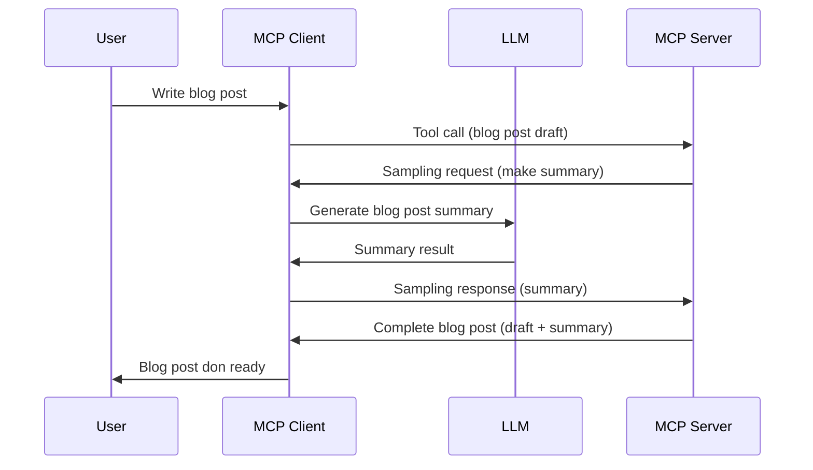

# Sampling - delegate features to the Client

Sometimes, you need di MCP Client and di MCP Server make dem work together to achieve one goal. You fit get case where di Server need help from one LLM wey dey for di client side. For dat kain situation, sampling na wetin you go use.

Make we explore some use cases dem and how to build solution wey dey use sampling.

## Overview

For dis lesson, we go focus on to explain when and how to use Sampling and how to set am up.

## Learning Objectives

For dis chapter, we go:

- Explain wetin Sampling be and when to use am.
- Show how to set up Sampling for MCP.
- Give examples of Sampling for work.

## Wetin Sampling be and why use am?

Sampling na one advanced feature wey dey work like dis:


### Sampling request

Ok, now we don get one big picture of correct scenario, make we talk about di sampling request wey di server dey send back to di client. Na so di request fit look for JSON-RPC format:

```json
{
  "jsonrpc": "2.0",
  "id": 1,
  "method": "sampling/createMessage",
  "params": {
    "messages": [
      {
        "role": "user",
        "content": {
          "type": "text",
          "text": "Create a blog post summary of the following blog post: <BLOG POST>"
        }
      }
    ],
    "modelPreferences": {
      "hints": [
        {
          "name": "claude-3-sonnet"
        }
      ],
      "intelligencePriority": 0.8,
      "speedPriority": 0.5
    },
    "systemPrompt": "You are a helpful assistant.",
    "maxTokens": 100
  }
}
```

Some tins wey make sense to talk here be:

- Prompt, under content -> text, na di prompt wey be instruction for di LLM to summarize blog post content.

- **modelPreferences**. Dis section na wetin e be, na preference, recommendation of how to configure di LLM. User fit choose to follow dem or change am. For dis case, dem recommend some model to use and priority for speed and intelligence.
- **systemPrompt**, na your normal system prompt wey give your LLM personality and guidance instructions.
- **maxTokens**, na another property wey talk how many tokens dem recommend make use for dis work.

### Sampling response

Dis response na wetin di MCP Client go send back to di MCP Server after di client call di LLM, wait for response then make dis message. E fit look like dis for JSON-RPC:

```json
{
  "jsonrpc": "2.0",
  "id": 1,
  "result": {
    "role": "assistant",
    "content": {
      "type": "text",
      "text": "Here's your abstract <ABSTRACT>"
    },
    "model": "gpt-5",
    "stopReason": "endTurn"
  }
}
```

Note how di response be summary of di blog post just like we ask. Also note how di used `model` no be wetin we ask but "gpt-5" instead of "claude-3-sonnet". Dis one dey show say user fit change mind on wetin to use and your sampling request na just recommendation.

Ok, now we don understand the main flow and useful task for "blog post creation + abstract", make we see wetin we need to do to make am work.

### Message types

Sampling messages no sure to only text but you fit send, images and audio too. Dis na how JSON-RPC dey look different:

**Text**

```json
{
  "type": "text",
  "text": "The message content"
}
```

**Image content**

```json
{
  "type": "image",
  "data": "base64-encoded-image-data",
  "mimeType": "image/jpeg"
}
```

**Audio content**

```json
{
  "type": "audio",
  "data": "base64-encoded-audio-data",
  "mimeType": "audio/wav"
}
```

> NOTE: for more detailed info on Sampling, check out di [official docs](https://modelcontextprotocol.io/specification/2025-06-18/client/sampling)

## How to Configure Sampling in the Client

> Note: if na only server you dey build, no need do plenty here.

For client, you need to specify dis kind feature like dis:

```json
{
  "capabilities": {
    "sampling": {}
  }
}
```

Dis one go dey picked when your chosen client start with di server.

## Example of Sampling in Action - Create a Blog Post

Make we code one sampling server together, we go need do dis ones:

1. Create tool for di Server.
1. Make tool create one sampling request
1. Tool go wait till client sampling request answer done.
1. Then tool result go show.

Make we see di code step by step:

### -1- Create the tool

**python**

```python
@mcp.tool()
async def create_blog(title: str, content: str, ctx: Context[ServerSession, None]) -> str:
    """Create a blog post and generate a summary"""

```

### -2- Create a sampling request

Add dis to your tool:

**python**

```python
post = BlogPost(
        id=len(posts) + 1,
        title=title,
        content=content,
        abstract=""
    )

prompt = f"Create an abstract of the following blog post: title: {title} and draft: {content} "

result = await ctx.session.create_message(
        messages=[
            SamplingMessage(
                role="user",
                content=TextContent(type="text", text=prompt),
            )
        ],
        max_tokens=100,
)

```

### -3- Wait for the response and return response

**python**

```python
post.abstract = result.content.text

posts.append(post)

# mek di full product back
return json.dumps({
    "id": post.title,
    "abstract": post.abstract
})
```

### -4- Full code

**python**

```python
from starlette.applications import Starlette
from starlette.routing import Mount, Host

from mcp.server.fastmcp import Context, FastMCP

from mcp.server.session import ServerSession
from mcp.types import SamplingMessage, TextContent

import json


from uuid import uuid4
from typing import List
from pydantic import BaseModel


mcp = FastMCP("Blog post generator")

# app = FastAPI()

posts = []

class BlogPost(BaseModel):
    id: int
    title: str
    content: str
    abstract: str

posts: List[BlogPost] = []

@mcp.tool()
async def create_blog(title: str, content: str, ctx: Context[ServerSession, None]) -> str:
    """Create a blog post and generate a summary"""

    post = BlogPost(
        id=len(posts) + 1,
        title=title,
        content=content,
        abstract=""
    )

    prompt = f"Create an abstract of the following blog post: title: {title} and draft: {content} "

    result = await ctx.session.create_message(
        messages=[
            SamplingMessage(
                role="user",
                content=TextContent(type="text", text=prompt),
            )
        ],
        max_tokens=100,
    )

    post.abstract = result.content.text

    posts.append(post)

    # return di complete blog post
    return json.dumps({
        "id": post.title,
        "abstract": post.abstract
    })

if __name__ == "__main__":
    print("Starting server...")
    # mcp.run()
    mcp.run(transport="streamable-http")

# run di app wit: python server.py
```

### -5- Testing it in Visual Studio Code

To test am for Visual Studio Code, do dis:

1. Start server for terminal
1. Add am to *mcp.json* (make sure e start) e.g something like dis:

   ```json
   "servers": {
      "blog-server": {
        "type": "http",
        "url": "http://localhost:8000/mcp"
      }
   }
   ```

1. Type prompt:

   ```text
   create a blog post named "Where Python comes from", the content is "Python is actually named after Monty Python Flying Circus"
   ```

1. Allow sampling to happen. The first time you try dis, you go see one extra dialog wey you need accept, then you go see regular dialog for make you run tool

1. Check results well well. You go see results nicely for GitHub Copilot Chat and you fit also check raw JSON response.

**Bonus**. Visual Studio Code tooling get better support for sampling. You fit set Sampling access on your installed server like dis:

1. Go extension section.
1. Click di cog icon for your installed server for "MCP SERVERS - INSTALLED".
1 Choose "Configure Model Access", here you fit pick which Models GitHub Copilot fit use for sampling. You go also see all sampling requests wey happen recently by choosing "Show Sampling requests".

## Assignment

For dis assignment, you go build one small different Sampling wey be sampling integration wey support to generate product description. Here be your scenario:

**Scenario**: Back office worker for e-commerce need help, e dey take too long to generate product descriptions. So, you go build solution wey fit call tool "create_product" wit "title" and "keywords" as arguments and e go produce full product wit "description" field wey client LLM go populate.

TIP: use wetin you learn before to build dis server and tool using sampling request.

## Solution

[Solution](./solution/README.md)

## Key Takeaways

Sampling na strong feature wey allow server give client task when e need help from LLM.

## What's Next

- [Chapter 4 - Practical implementation](../../04-PracticalImplementation/README.md)

---

<!-- CO-OP TRANSLATOR DISCLAIMER START -->
**Disclaimer**:  
Dis document don translate wit AI translation service [Co-op Translator](https://github.com/Azure/co-op-translator). Even though we dey try to make am correct, abeg sabi say automated translation fit get errors or mistakes. Di original document for im own language na di correct source. For important mata, e better make human professional translator do am. We no go responsible for any misunderstanding or wrong meaning wey fit come from dis translation.
<!-- CO-OP TRANSLATOR DISCLAIMER END -->