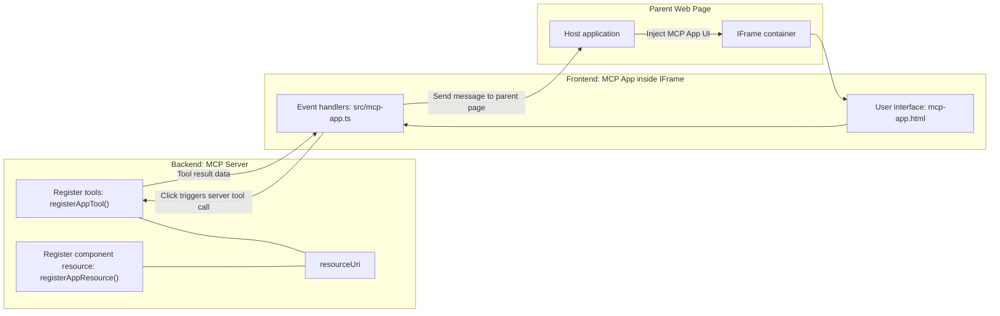

# MCP Apps

MCP Apps na new way wey MCP dey work. The idea be say no be only to respond with data back from tool call, but you go also provide info on how people suppose dey interact with that info. That one mean say tool results fit get UI info inside. Why we go want am? Well, think about how you dey do tins today. You dey probably dey use the results of MCP Server by putting some kind of frontend in front of am, na code you go need write and maintain. Sometimes na wetin you want, but sometimes e go better if you fit just carry one small snippet of info wey complete, wey get e everything from data to user interface.

## Overview

Dis lesson go give you real guide on MCP Apps, how to start with am and how to join am with your existing Web Apps. MCP Apps na beta new addition to MCP Standard.

## Learning Objectives

By the end of dis lesson, you go fit:

- Explain wetin MCP Apps be.
- When to use MCP Apps.
- Build and put your own MCP Apps join.

## MCP Apps - how e dey work

The idea for MCP Apps na to provide response wey be like component wey go render. Such component fit get both visuals and interactivity, like button clicks, user input and more. Make we start from server side with our MCP Server. To create MCP App component you need create tool plus the application resource. These two parts connect with resourceUri.

See example here. Make we try show wetin dey involved and which parts dey do wetin:

```text
server.ts -- responsible for registering tools and the component as a UI component
src/
  mcp-app.ts -- wiring up event handlers
mcp-app.html -- the user interface
```

Dis visual dey describe how to create component and e logic.


Make we try describe the roles for backend and frontend.

### The backend

Two tins we need do here:

- Register the tools we want to dey interact with.
- Define the component.

**Registering the tool**

```typescript
registerAppTool(
    server,
    "get-time",
    {
      title: "Get Time",
      description: "Returns the current server time.",
      inputSchema: {},
      _meta: { ui: { resourceUri } }, // Dey connect dis tool to im UI resource
    },
    async () => {
      const time = new Date().toISOString();
      return { content: [{ type: "text", text: time }] };
    },
  );

```

Code wey show before dey describe the behavior, e get tool wey dem call `get-time`. E no need input but e go produce the current time. We fit define `inputSchema` for tools if we need accept user input.

**Registering the component**

For the same file, we need register the component too:

```typescript
const resourceUri = "ui://get-time/mcp-app.html";

// Register di resource, wey go return di bundled HTML/JavaScript for di UI.
registerAppResource(
  server,
  resourceUri,
  resourceUri,
  { mimeType: RESOURCE_MIME_TYPE },
  async () => {
    const html = await fs.readFile(path.join(DIST_DIR, "mcp-app.html"), "utf-8");

    return {
    contents: [
        { uri: resourceUri, mimeType: RESOURCE_MIME_TYPE, text: html },
    ],
    };
  },
);
```

See how we mention `resourceUri` to connect component with e tools. Also the callback wey dey load the UI file and return the component na important.

### The component frontend

Like backend, two parts dey here:

- Frontend wey pure HTML.
- Code wey handle events and wetin to do, like calling tools or messaging the parent window.

**User interface**

Make us see the user interface.

```html
<!-- mcp-app.html -->
<!DOCTYPE html>
<html lang="en">
  <head>
    <meta charset="UTF-8" />
    <title>Get Time App</title>
  </head>
  <body>
    <p>
      <strong>Server Time:</strong> <code id="server-time">Loading...</code>
    </p>
    <button id="get-time-btn">Get Server Time</button>
    <script type="module" src="/src/mcp-app.ts"></script>
  </body>
</html>
```

**Event wireup**

Last part na event wireup. E mean say we go find which part for UI need event handlers and what to do if events show:

```typescript
// mcp-app.ts

import { App } from "@modelcontextprotocol/ext-apps";

// Grab element references
const serverTimeEl = document.getElementById("server-time")!;
const getTimeBtn = document.getElementById("get-time-btn")!;

// Make app instance
const app = new App({ name: "Get Time App", version: "1.0.0" });

// Manage tool results wey come from the server. Set am before `app.connect()` make e no miss
// di first tool result.
app.ontoolresult = (result) => {
  const time = result.content?.find((c) => c.type === "text")?.text;
  serverTimeEl.textContent = time ?? "[ERROR]";
};

// Connect button click
getTimeBtn.addEventListener("click", async () => {
  // `app.callServerTool()` dey allow di UI request fresh data from di server
  const result = await app.callServerTool({ name: "get-time", arguments: {} });
  const time = result.content?.find((c) => c.type === "text")?.text;
  serverTimeEl.textContent = time ?? "[ERROR]";
});

// Connect to host
app.connect();
```

Like you see for the code above, na normal code to join DOM elements with events. The call to `callServerTool` dey important because e go call tool for backend.

## Dealing with user input

So far, we don see component wey get button when you click e go call tool. Make we try add more UI elements like input field and see if we fit send arguments to tool. Make we build FAQ function. Wetin suppose happen be:

- E go get button and input element wey user go type keyword like "Shipping". This one go call tool for backend to search FAQ data.
- Tool wey fit support FAQ search.

Make we add the support to backend first:

```typescript
const faq: { [key: string]: string } = {
    "shipping": "Our standard shipping time is 3-5 business days.",
    "return policy": "You can return any item within 30 days of purchase.",
    "warranty": "All products come with a 1-year warranty covering manufacturing defects.",
  }

registerAppTool(
    server,
    "get-faq",
    {
      title: "Search FAQ",
      description: "Searches the FAQ for relevant answers.",
      inputSchema: zod.object({
        query: zod.string().default("shipping"),
      }),
      _meta: { ui: { resourceUri: faqResourceUri } }, // Connect dis tool to im UI resource
    },
    async ({ query }) => {
      const answer: string = faq[query.toLowerCase()] || "Sorry, I don't have an answer for that.";
      return { content: [{ type: "text", text: answer }] };
    },
  );
```

See how we fill `inputSchema` and give am `zod` schema like dis:

```typescript
inputSchema: zod.object({
  query: zod.string().default("shipping"),
})
```

For schema we talk say we get input parameter `query` and e fit optional with default "shipping".

Ok, make we go *mcp-app.html* see wetin UI we go create for this:

```html
<div class="faq">
    <h1>FAQ response</h1>
    <p>FAQ Response: <code id="faq-response">Loading...</code></p>
    <input type="text" id="faq-query" placeholder="Enter FAQ query" />
    <button id="get-faq-btn">Get FAQ Response</button>
  </div>
```

Great, now we get input element and button. Make we check *mcp-app.ts* to wire these events:

```typescript
const getFaqBtn = document.getElementById("get-faq-btn")!;
const faqQueryInput = document.getElementById("faq-query") as HTMLInputElement;

getFaqBtn.addEventListener("click", async () => {
  const query = faqQueryInput.value;
  const result = await app.callServerTool({ name: "get-faq", arguments: { query } });
  const faq = result.content?.find((c) => c.type === "text")?.text;
  faqResponseEl.textContent = faq ?? "[ERROR]";
});
```

For the code above we:

- Create reference to interactive UI elements.
- Handle button click to get input element value and we call `app.callServerTool()` with `name` and `arguments` where `query` dey as value.

Wetins really happen when you call `callServerTool` be say e send message to parent window and that window go call MCP Server.

### Try am

Try am now you go see dis:


And see how e dey when we try input like "warranty"


To run this code, go [Code section](./code/README.md)

## Testing in Visual Studio Code

Visual Studio Code get beta support for MCP Apps and e be one of easiest way to test your MCP Apps. To use Visual Studio Code, add server entry to *mcp.json* like dis:

```json
"my-mcp-server-7178eca7": {
    "url": "http://localhost:3001/mcp",
    "type": "http"
  }
```

Then start server, you fit now communicate with your MCP App using Chat Window if you get GitHub Copilot install.

You fit trigger am with prompt like "#get-faq":


Like how you run am for web browser, e go render the same way:


## Assignment

Create rock paper scissor game. E suppose get dis:

UI:

- drop down list with options
- button to submit choice
- label wey show who pick wetin and who win

Server:

- get rock paper scissor tool wey take "choice" as input. E go show computer choice and decide who win.

## Solution

[Solution](./assignment/README.md)

## Summary

We learn about dis new way MCP Apps dey work. Na new way wey let MCP Servers get opinion about not just data but how data suppose show.

Plus, we learn say MCP Apps dey inside IFrame and to talk with MCP Servers dem go need send messages to parent web app. Plenty libraries dey for JavaScript, React and more wey make communication easy.

## Key Takeaways

Wetins you learn be:

- MCP Apps na new standard wey fit help when you want carry both data and UI features.
- Dis kind apps dey run for IFrame for security sake.

## What's Next

- [Chapter 4](../../04-PracticalImplementation/README.md)

---

<!-- CO-OP TRANSLATOR DISCLAIMER START -->
**Disclaimer**:  
Dis document don translate wit AI translation service [Co-op Translator](https://github.com/Azure/co-op-translator). Even tho we dey try make am correct, abeg sabi say automated translations fit get errors or mistakes. Di original document wey dey di native language na di correct and true source. For important info, make person wey sabi translate am well do am. We no go responsible for any wahala or wrong meaning wey fit show from dis translation.
<!-- CO-OP TRANSLATOR DISCLAIMER END -->