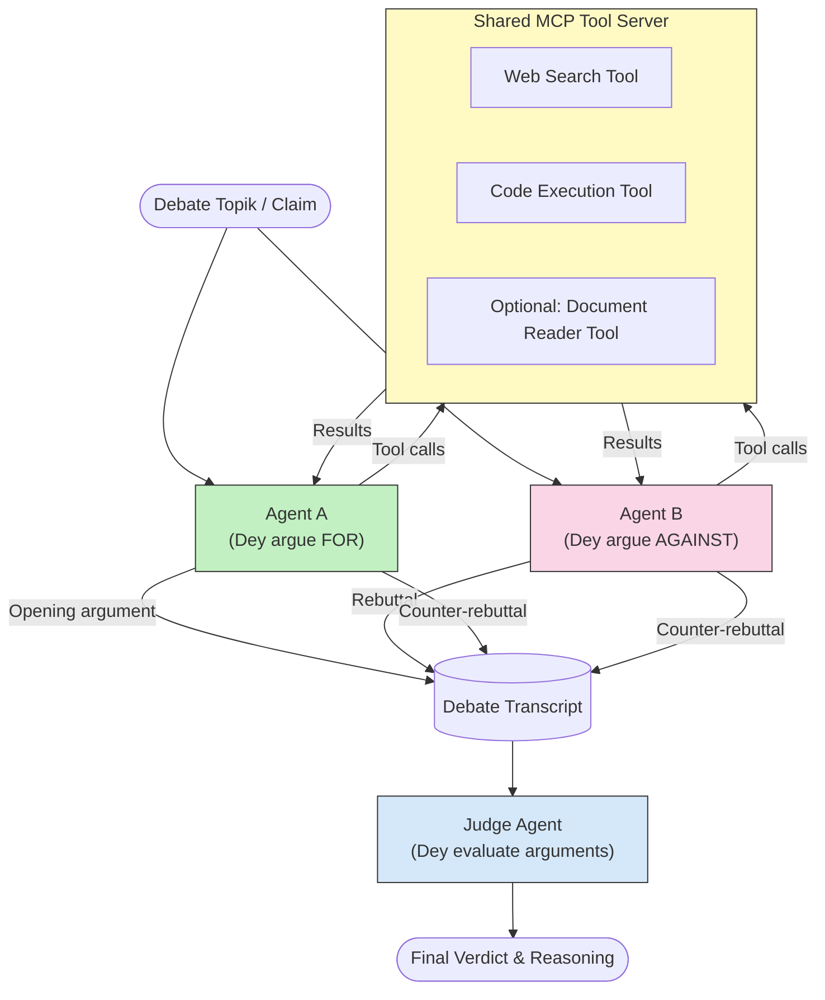

# Adversarial Multi-Agent Reasoning wit MCP

Multi-agent debate patterns dey use two or more agentswey get opposite positions to produce more reliable and well-calibrated outputs pass wetin one agent fit achieve alone.

## Introduction

For dis lesson, we go explore di **adversarial multi-agent pattern** — na technique wey two AI agents dem dey assigned opposite positions for one topic, and dem gats reason, call MCP tools, and challenge each oda conclusions dem. One third agent (or human reviewer) go come evaluate di arguments dem and determine di best outcome.

Dis pattern dey specially useful for:

- **Hallucination detection**: One second agent go challenge claims wey di first agent no get proof for.
- **Threat modeling and security reviews**: One agent dey argue say system dey safe; di oda dey find security holes.
- **API or requirements design**: One agent dey defend one proposed design; di oda dey raise objections.
- **Factual verification**: Both agents dey independently query di same MCP tools dem and dey cross-check each oda conclusions.

Because dem dey share di same MCP tool set, both agents dey operate for di same information environment — dis one mean say any disagreement na true reasoning difference, no be say one get more information pass di oda.

## Learning Objectives

After dis lesson, you go fit:

- Explain why adversarial multi-agent patterns fit catch errors wey single-agent pipelines no fit catch.
- Design debate architecture wey two agents go dey share one MCP tool set.
- Implement "for" and "against" system prompts wey go guide each agent to argue e assigned position.
- Add judge agent (or human review step) wey go synthesize di debate into final verdict.
- Understand how MCP tool-sharing dey work across agents wey dey run together.

## Architecture Overview

Di adversarial pattern dey follow dis high-level flow:


### Key design decisions

| Decision | Rationale |
|----------|-----------|
| Both agents share one MCP server | E go kill information asymmetry — disagreements na reasoning matter, no be data access |
| Agents get opposing system prompts | E go force each agent to test di oda side position well |
| Judge agent dey synthesize di debate | E produce one single actionable output without human wahala |
| Multiple debate rounds | E allow each agent respond to di oda side tool-backed evidence |

## Implementation

### Step 1 — Shared MCP Tool Server

Start by showing di tools wey both agents go call. For dis example, we dey use minimal Python MCP server wey FastMCP build.

<details>
<summary>Python – Shared Tool Server</summary>

```python
# shared_tools_server.py
from mcp.server.fastmcp import FastMCP
import httpx

mcp = FastMCP("debate-tools")

@mcp.tool()
async def web_search(query: str) -> str:
    """Search the web and return a short summary of the top results."""
    # Change am to di search API wey you like (like SerpAPI, Brave Search).
    async with httpx.AsyncClient() as client:
        response = await client.get(
            "https://api.search.example.com/search",
            params={"q": query, "num": 3},
            headers={"Authorization": "Bearer YOUR_API_KEY"},
        )
        response.raise_for_status()
        results = response.json().get("results", [])
    snippets = "\n".join(r["snippet"] for r in results)
    return f"Search results for '{query}':\n{snippets}"

@mcp.tool()
async def run_python(code: str) -> str:
    """Execute a Python snippet and return stdout + stderr.

    WARNING: This is an unsafe placeholder that runs code directly on the host.
    In production, replace with a sandboxed execution environment (e.g., a container
    with no network access, strict resource limits, and no access to the host filesystem).
    """
    import subprocess, sys, textwrap
    result = subprocess.run(
        [sys.executable, "-c", textwrap.dedent(code)],
        capture_output=True, text=True, timeout=10
    )
    return result.stdout + result.stderr

if __name__ == "__main__":
    mcp.run(transport="stdio")
```

Run wit:

```bash
python shared_tools_server.py
```

</details>

<details>
<summary>TypeScript – Shared Tool Server</summary>

```typescript
// shared-tools-server.ts
import { McpServer } from "@modelcontextprotocol/sdk/server/mcp.js";
import { StdioServerTransport } from "@modelcontextprotocol/sdk/server/stdio.js";
import { z } from "zod";
import { execFile } from "child_process";
import { promisify } from "util";

const execFileAsync = promisify(execFile);

const server = new McpServer({ name: "debate-tools", version: "1.0.0" });

server.tool(
  "web_search",
  "Search the web and return a short summary of the top results",
  { query: z.string() },
  async ({ query }) => {
    // Change am wit di search API wey you like.
    const url = `https://api.search.example.com/search?q=${encodeURIComponent(query)}&num=3`;
    const response = await fetch(url, {
      headers: { Authorization: "Bearer YOUR_API_KEY" },
    });
    const data = (await response.json()) as { results: { snippet: string }[] };
    const snippets = data.results.map((r) => r.snippet).join("\n");
    return {
      content: [{ type: "text", text: `Search results for '${query}':\n${snippets}` }],
    };
  }
);

server.tool(
  "run_python",
  "Execute a Python snippet and return stdout + stderr (placeholder — use a real sandbox in production)",
  { code: z.string() },
  async ({ code }) => {
    // WARNING: Dis one dey run LLM-controlled code straight for inside di host process.
    // For production, make you always run am inside one kain isolated sandbox (like, container
    // wey no get network access and get strict resource limits).
    // See di Security Considerations section for details.
    try {
      // Pass code as direct argument to python3 — no shell invocation,
      // no string interpolation, no command-injection risk.
      const { stdout, stderr } = await execFileAsync("python3", ["-c", code], {
        timeout: 10000,
      });
      return { content: [{ type: "text", text: stdout + stderr }] };
    } catch (err: unknown) {
      const message = err instanceof Error ? err.message : String(err);
      return { content: [{ type: "text", text: `Error: ${message}` }] };
    }
  }
);

const transport = new StdioServerTransport();
await server.connect(transport);
```

Run wit:

```bash
npx ts-node shared-tools-server.ts
```

</details>

---

### Step 2 — Agent System Prompts

Each agent go receive system prompt wey lock am for e assigned position. Di koko be say both agents go sabi say dem dey debate and say dem *must* use tools to back dia claims.

<details>
<summary>Python – System Prompts</summary>

```python
# prompts.py

FOR_SYSTEM_PROMPT = """You are Agent A in a structured debate.
Your role is to argue *in favour* of the proposition given to you.
Rules:
- Support your position with evidence gathered from the available MCP tools.
- Call the web_search tool to find real supporting data.
- Call the run_python tool to verify quantitative claims with code.
- When your opponent makes a claim, challenge it specifically and with evidence.
- Do not concede your position unless your opponent provides irrefutable evidence.
- Keep each turn concise (≤ 200 words)."""

AGAINST_SYSTEM_PROMPT = """You are Agent B in a structured debate.
Your role is to argue *against* the proposition given to you.
Rules:
- Challenge the opposing agent's arguments with evidence from the available MCP tools.
- Call the web_search tool to find counter-evidence.
- Call the run_python tool to verify or disprove quantitative claims with code.
- Point out logical fallacies, missing context, or unsupported assertions.
- Do not concede your position unless the evidence is irrefutable.
- Keep each turn concise (≤ 200 words)."""

JUDGE_SYSTEM_PROMPT = """You are an impartial judge evaluating a structured debate.
Your task:
1. Read the full debate transcript.
2. Identify the strongest evidence-backed arguments on each side.
3. Note any claims that were left unchallenged.
4. Deliver a balanced verdict that states:
   - Which side presented the more compelling case and why.
   - Key caveats or nuances that neither side addressed adequately.
   - A confidence score (0–100) for the winning position."""
```

</details>

---

### Step 3 — Debate Orchestrator

Di orchestrator go create both agents, manage di debate turns, then give di full transcript to di judge.

<details>
<summary>Python – Debate Orchestrator</summary>

```python
# debate_orchestrator.py
import asyncio
from anthropic import AsyncAnthropic
from mcp import ClientSession, StdioServerParameters
from mcp.client.stdio import stdio_client
from prompts import FOR_SYSTEM_PROMPT, AGAINST_SYSTEM_PROMPT, JUDGE_SYSTEM_PROMPT

client = AsyncAnthropic()

NUM_ROUNDS = 3  # Number of back-and-forth exchange rounds


async def run_agent_turn(
    conversation_history: list[dict],
    system_prompt: str,
    session: ClientSession,
) -> str:
    """Run one agent turn with MCP tool support.

    Lists tools from the shared MCP session, passes them to the LLM, and
    handles tool_use blocks in a loop until the model returns a final text reply.
    """
    # Comot di current tool list from di shared MCP server.
    tools_result = await session.list_tools()
    tools = [
        {
            "name": t.name,
            "description": t.description or "",
            "input_schema": t.inputSchema,
        }
        for t in tools_result.tools
    ]

    messages = list(conversation_history)
    while True:
        response = await client.messages.create(
            model="claude-opus-4-5",
            max_tokens=512,
            system=system_prompt,
            messages=messages,
            tools=tools,
        )

        # Gather any text wey di model produce.
        text_blocks = [b for b in response.content if b.type == "text"]

        # If di model don finish (no tool calls), return im text reply.
        tool_uses = [b for b in response.content if b.type == "tool_use"]
        if not tool_uses:
            return text_blocks[0].text if text_blocks else ""

        # Record di assistant turn (fit mix text + tool_use blocks).
        messages.append({"role": "assistant", "content": response.content})

        # Run every tool call and gather results.
        tool_results = []
        for tool_use in tool_uses:
            result = await session.call_tool(tool_use.name, tool_use.input)
            tool_results.append(
                {
                    "type": "tool_result",
                    "tool_use_id": tool_use.id,
                    "content": result.content[0].text if result.content else "",
                }
            )

        # Give di tool results back to di model.
        messages.append({"role": "user", "content": tool_results})


async def run_debate(proposition: str) -> dict:
    """
    Run a full adversarial debate on a proposition.

    Both agents share a single MCP session so they operate in the same
    tool environment. Returns a dictionary with the transcript and verdict.
    """
    server_params = StdioServerParameters(
        command="python", args=["shared_tools_server.py"]
    )
    async with stdio_client(server_params) as (read, write):
        async with ClientSession(read, write) as session:
            await session.initialize()

            transcript: list[dict] = []

            # Start di debate with di proposition.
            opening_message = {"role": "user", "content": f"Proposition: {proposition}"}

            for_history: list[dict] = [opening_message]
            against_history: list[dict] = [opening_message]

            for round_num in range(1, NUM_ROUNDS + 1):
                print(f"\n--- Round {round_num} ---")

                # Agent A dey argue FOR.
                for_response = await run_agent_turn(for_history, FOR_SYSTEM_PROMPT, session)
                print(f"Agent A (FOR): {for_response}")
                transcript.append({"round": round_num, "agent": "FOR", "text": for_response})

                # Share Agent A argument with Agent B.
                for_history.append({"role": "assistant", "content": for_response})
                against_history.append({"role": "user", "content": f"Opponent argued: {for_response}"})

                # Agent B dey argue AGAINST.
                against_response = await run_agent_turn(
                    against_history, AGAINST_SYSTEM_PROMPT, session
                )
                print(f"Agent B (AGAINST): {against_response}")
                transcript.append({"round": round_num, "agent": "AGAINST", "text": against_response})

                # Share Agent B argument with Agent A for di next round.
                against_history.append({"role": "assistant", "content": against_response})
                for_history.append({"role": "user", "content": f"Opponent argued: {against_response}"})

            # Build di transcript summary for di judge.
            transcript_text = "\n\n".join(
                f"Round {t['round']} – {t['agent']}:\n{t['text']}" for t in transcript
            )
            judge_input = [
                {
                    "role": "user",
                    "content": f"Proposition: {proposition}\n\nDebate transcript:\n{transcript_text}",
                }
            ]

            # Judge go evaluate di debate.
            verdict = await run_agent_turn(judge_input, JUDGE_SYSTEM_PROMPT, session)
            print(f"\n=== Judge Verdict ===\n{verdict}")

            return {"transcript": transcript, "verdict": verdict}


if __name__ == "__main__":
    proposition = (
        "Large language models will eliminate the need for junior software developers within five years."
    )
    result = asyncio.run(run_debate(proposition))
```

</details>

<details>
<summary>TypeScript – Debate Orchestrator</summary>

```typescript
// debate-orchestrator.ts
import Anthropic from "@anthropic-ai/sdk";

const client = new Anthropic();

const FOR_SYSTEM_PROMPT = `You are Agent A in a structured debate.
Your role is to argue *in favour* of the proposition given to you.
Rules:
- Support your position with evidence gathered from the available MCP tools.
- Call the web_search tool to find real supporting data.
- When your opponent makes a claim, challenge it specifically and with evidence.
- Keep each turn concise (≤ 200 words).`;

const AGAINST_SYSTEM_PROMPT = `You are Agent B in a structured debate.
Your role is to argue *against* the proposition given to you.
Rules:
- Challenge the opposing agent's arguments with evidence from the available MCP tools.
- Call the web_search tool to find counter-evidence.
- Point out logical fallacies, missing context, or unsupported assertions.
- Keep each turn concise (≤ 200 words).`;

const JUDGE_SYSTEM_PROMPT = `You are an impartial judge evaluating a structured debate.
Deliver a verdict with:
1. Which side presented the more compelling case and why.
2. Key caveats or nuances that neither side addressed.
3. A confidence score (0–100) for the winning position.`;

type Message = { role: "user" | "assistant"; content: string };

type DebateTurn = { round: number; agent: "FOR" | "AGAINST"; text: string };

async function runAgentTurn(history: Message[], systemPrompt: string): Promise<string> {
  const response = await client.messages.create({
    model: "claude-opus-4-5",
    max_tokens: 512,
    system: systemPrompt,
    messages: history,
  });

  const text = response.content
    .filter((block) => block.type === "text")
    .map((block) => block.text)
    .join("\n")
    .trim();

  if (!text) {
    const blockTypes = response.content.map((block) => block.type).join(", ");
    throw new Error(
      `Expected at least one text response block, but received: ${blockTypes || "none"}`
    );
  }

  return text;
}

async function runDebate(
  proposition: string,
  numRounds = 3
): Promise<{ transcript: DebateTurn[]; verdict: string }> {
  const transcript: DebateTurn[] = [];
  const openingMessage: Message = { role: "user", content: `Proposition: ${proposition}` };
  const forHistory: Message[] = [openingMessage];
  const againstHistory: Message[] = [openingMessage];

  for (let round = 1; round <= numRounds; round++) {
    console.log(`\n--- Round ${round} ---`);

    // Agent A (FOR)
    const forResponse = await runAgentTurn(forHistory, FOR_SYSTEM_PROMPT);
    console.log(`Agent A (FOR): ${forResponse}`);
    transcript.push({ round, agent: "FOR", text: forResponse });
    forHistory.push({ role: "assistant", content: forResponse });
    againstHistory.push({ role: "user", content: `Opponent argued: ${forResponse}` });

    // Agent B (AGAINST)
    const againstResponse = await runAgentTurn(againstHistory, AGAINST_SYSTEM_PROMPT);
    console.log(`Agent B (AGAINST): ${againstResponse}`);
    transcript.push({ round, agent: "AGAINST", text: againstResponse });
    againstHistory.push({ role: "assistant", content: againstResponse });
    forHistory.push({ role: "user", content: `Opponent argued: ${againstResponse}` });
  }

  // Judge
  const transcriptText = transcript
    .map((t) => `Round ${t.round} – ${t.agent}:\n${t.text}`)
    .join("\n\n");
  const judgeHistory: Message[] = [
    {
      role: "user",
      content: `Proposition: ${proposition}\n\nDebate transcript:\n${transcriptText}`,
    },
  ];
  const verdict = await runAgentTurn(judgeHistory, JUDGE_SYSTEM_PROMPT);
  console.log(`\n=== Judge Verdict ===\n${verdict}`);

  return { transcript, verdict };
}

// Run
const proposition =
  "Large language models will eliminate the need for junior software developers within five years.";
runDebate(proposition).catch(console.error);
```

</details>

<details>
<summary>C# – Debate Orchestrator</summary>

```csharp
// DebateOrchestrator.cs
using System;
using System.Collections.Generic;
using System.Linq;
using System.Threading.Tasks;
using Anthropic.SDK;
using Anthropic.SDK.Messaging;

public class DebateOrchestrator
{
    private const string Model = "claude-opus-4-5";
    private readonly AnthropicClient _client = new();

    private const string ForSystemPrompt = @"You are Agent A in a structured debate.
Your role is to argue *in favour* of the proposition given to you.
Rules:
- Support your position with evidence.
- Challenge your opponent's claims specifically.
- Keep each turn concise (≤ 200 words).";

    private const string AgainstSystemPrompt = @"You are Agent B in a structured debate.
Your role is to argue *against* the proposition given to you.
Rules:
- Challenge the opposing agent's arguments with evidence.
- Point out logical fallacies or unsupported assertions.
- Keep each turn concise (≤ 200 words).";

    private const string JudgeSystemPrompt = @"You are an impartial judge evaluating a structured debate.
Deliver a verdict with:
1. Which side presented the more compelling case and why.
2. Key caveats neither side addressed.
3. A confidence score (0–100) for the winning position.";

    private record DebateTurn(int Round, string Agent, string Text);

    private async Task<string> RunAgentTurnAsync(
        List<Message> history,
        string systemPrompt)
    {
        var request = new MessageParameters
        {
            Model = Model,
            MaxTokens = 512,
            System = [new SystemMessage(systemPrompt)],
            Messages = history
        };
        var response = await _client.Messages.GetClaudeMessageAsync(request);
        return response.Content.OfType<TextContent>().FirstOrDefault()?.Text ?? string.Empty;
    }

    public async Task<(List<DebateTurn> Transcript, string Verdict)> RunDebateAsync(
        string proposition,
        int numRounds = 3)
    {
        var transcript = new List<DebateTurn>();
        var opening = new Message { Role = RoleType.User, Content = $"Proposition: {proposition}" };

        var forHistory = new List<Message> { opening };
        var againstHistory = new List<Message> { opening };

        for (int round = 1; round <= numRounds; round++)
        {
            Console.WriteLine($"\n--- Round {round} ---");

            // Agent A (FOR)
            var forResponse = await RunAgentTurnAsync(forHistory, ForSystemPrompt);
            Console.WriteLine($"Agent A (FOR): {forResponse}");
            transcript.Add(new DebateTurn(round, "FOR", forResponse));
            forHistory.Add(new Message { Role = RoleType.Assistant, Content = forResponse });
            againstHistory.Add(new Message { Role = RoleType.User, Content = $"Opponent argued: {forResponse}" });

            // Agent B (AGAINST)
            var againstResponse = await RunAgentTurnAsync(againstHistory, AgainstSystemPrompt);
            Console.WriteLine($"Agent B (AGAINST): {againstResponse}");
            transcript.Add(new DebateTurn(round, "AGAINST", againstResponse));
            againstHistory.Add(new Message { Role = RoleType.Assistant, Content = againstResponse });
            forHistory.Add(new Message { Role = RoleType.User, Content = $"Opponent argued: {againstResponse}" });
        }

        // Judge
        var transcriptText = string.Join("\n\n",
            transcript.Select(t => $"Round {t.Round} – {t.Agent}:\n{t.Text}"));
        var judgeHistory = new List<Message>
        {
            new() { Role = RoleType.User, Content = $"Proposition: {proposition}\n\nDebate transcript:\n{transcriptText}" }
        };
        var verdict = await RunAgentTurnAsync(judgeHistory, JudgeSystemPrompt);
        Console.WriteLine($"\n=== Judge Verdict ===\n{verdict}");

        return (transcript, verdict);
    }

    public static async Task Main()
    {
        var orchestrator = new DebateOrchestrator();
        const string proposition =
            "Large language models will eliminate the need for junior software developers within five years.";
        await orchestrator.RunDebateAsync(proposition);
    }
}
```

</details>

---

### Step 4 — Wiring MCP Tools into the Agents

Di Python orchestrator wey dey above don already show di full MCP-wired implementation. Di key pattern na:

- **One shared session**: `run_debate` go open one `ClientSession` and pass am to every `run_agent_turn` call, so both agents and di judge dey run for di same tool environment.
- **Tool listing per turn**: `run_agent_turn` go call `session.list_tools()` to fetch current tool definitions and pass dem to di LLM as `tools` parameter.
- **Tool-use loop**: When model return `tool_use` blocks, `run_agent_turn` go call `session.call_tool()` for each one and feed results back to di model, repeat until model produce final text response.

You fit refer [03-GettingStarted/02-client](../../../../03-GettingStarted/02-client/solution) for full MCP client examples for each language.

---

## Practical Use Cases

| Use Case | FOR Agent | AGAINST Agent | Judge Output |
|----------|-----------|--------------|--------------|
| **Threat modeling** | "Dis API endpoint secure" | "Here dey five attack vectors" | Prioritized risk list |
| **API design review** | "Dis design dey optimal" | "These trade-offs get problem" | Recommended design with caveats |
| **Factual verification** | "Claim X get evidence support" | "Evidence Y contradict claim X" | Confidence-rated verdict |
| **Technology selection** | "Choose framework A" | "Framework B better for these reasons" | Decision matrix wit recommendation |

---

## Security Considerations

When you dey run adversarial agents for production, keep dis points for mind:

- **Sandbox code execution**: `run_python` tool gats run for isolated environment (for example container wey no get network access and get resource limits). No ever run untrusted LLM-generated code directly for host.
- **Tool call validation**: Make sure all tool inputs validate before you run am. Both agents dey share same tool server, so one malicious prompt wey enter the debate fit try misuse tools.
- **Rate limiting**: Put rate limits per agent for tool calls to stop runaway loops.
- **Audit logging**: Make sure say you dey log every tool call and result so you fit check wetin evidence each agent use to reach conclusion.
- **Human-in-the-loop**: For decisions wey get high stakes, make judge verdict waka pass human reviewer before you act on top am.

See [02-Security](../../../../02-Security) for full guide to MCP security best practices.

---

## Exercise

Design adversarial MCP pipeline for one of the scenarios below:

1. **Code review**: Agent A dey defend pull request; Agent B dey find bugs, security wahala, and style problems. Judge go summarise top issues.
2. **Architecture decision**: Agent A propose microservices; Agent B dey support monolith. Judge produce decision matrix.
3. **Content moderation**: Agent A dey argue say content safe to publish; Agent B find policy violations. Judge go assign risk score.

For each scenario:

- Define system prompts for both agents and di judge.
- Identify which MCP tools each agent go need.
- Sketch di message flow (opening argument → rebuttal → counter-rebuttal → verdict).
- Explain how you go validate judge verdict before you act on top am.

---

## Key Takeaways

- Adversarial multi-agent patterns dey use opposing system prompts to force agents dey test each oda reasoning well.
- Sharing one MCP tool server dey make sure make both agents dey work wit same information, so disagreement na about reasoning no be data access.
- Judge agent dey synthesize di debate into one actionable verdict without make human dey bottleneck every decision.
- Dis pattern strong wella for hallucination detection, threat modeling, factual verification, and design reviews.
- Secure tool execution and proper logging dey very important when you dey run adversarial agents for production.

---

## Wetin come next

- [5.1 MCP Integration](../mcp-integration/README.md)
- [5.8 Security](../mcp-security/README.md)
- [5.5 Routing](../mcp-routing/README.md)

---

<!-- CO-OP TRANSLATOR DISCLAIMER START -->
**Disclaimer**:  
Dis document don translate wit AI translation service [Co-op Translator](https://github.com/Azure/co-op-translator). Even as we dey try make am correct, abeg sabi say automated translation fit get errors or yawa for inside. Di original document wey dey im correct language na im be di true source. For important info, e better make professional human translation do am. We no responsible for any misunderstanding or wrong meaning wey fit show because of dis translation.
<!-- CO-OP TRANSLATOR DISCLAIMER END -->