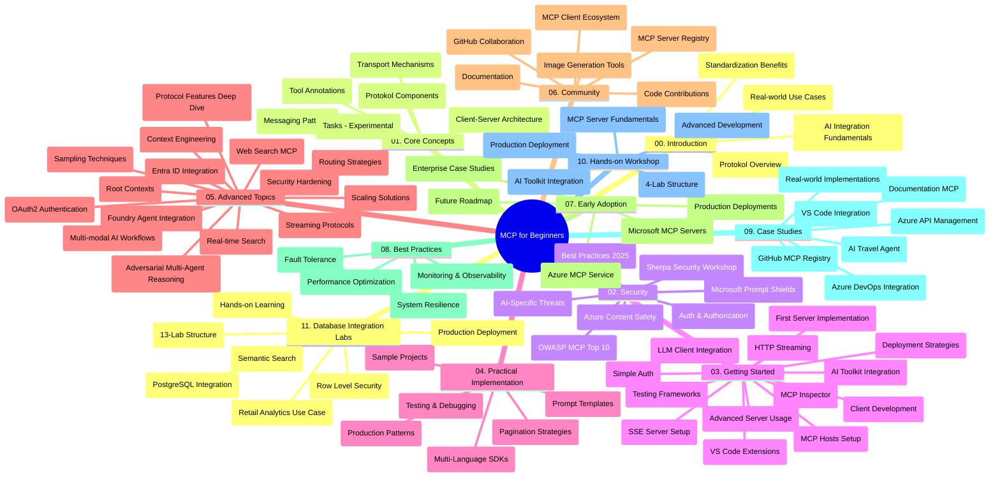

# Model Context Protocol (MCP) for Beginners - Study Guide

Dis study guide dey give you overview of di repository structure and di content wey dey for di "Model Context Protocol (MCP) for Beginners" curriculum. Use dis guide to waka inside di repository well-well and use all di resources wey dey available well.

## Repository Overview

Di Model Context Protocol (MCP) na one standardized framework wey AI models and client applications dey use to connect. Anthropic na di one wey first create am, but now di whole MCP community dey maintain am through di official GitHub organization. Dis repository get full curriculum with hands-on code examples for C#, Java, JavaScript, Python, and TypeScript, e good for AI developers, system architects, and software engineers.

## Visual Curriculum Map

## Repository Structure

Di repository arrange inside eleven main parts, each one dey focus on different aspect of MCP:

1. **Introduction (00-Introduction/)**
   - Overview of di Model Context Protocol
   - Why e good make AI pipelines dey standardized
   - Practical use cases and benefits

2. **Core Concepts (01-CoreConcepts/)**
   - Client-server architecture
   - Key protocol components
   - Messaging patterns for MCP

3. **Security (02-Security/)**
   - Security threats wey dey MCP-based systems
   - Best ways to keep di systems safe
   - Authentication and authorization styles
   - **Full Security Documentation**:
     - MCP Security Best Practices 2025
     - Azure Content Safety Implementation Guide
     - MCP Security Controls and Techniques
     - MCP Best Practices Quick Reference
   - **Main Security Topics**:
     - Prompt injection and tool poisoning attacks
     - Session hijacking and confused deputy problems
     - Token passthrough vulnerabilities
     - Too much permissions and access control
     - Supply chain security for AI parts
     - Microsoft Prompt Shields integration

4. **Getting Started (03-GettingStarted/)**
   - How to set up environment and configuration
   - How to make simple MCP servers and clients
   - How to join with existing apps
   - E get sections for:
     - First server implementation
     - Client development
     - LLM client integration
     - VS Code integration
     - Server-Sent Events (SSE) server
     - Advanced server use
     - HTTP streaming
     - AI Toolkit integration
     - Testing ways
     - Deployment guidelines

5. **Practical Implementation (04-PracticalImplementation/)**
   - How to use SDKs for different programming languages
   - Debugging, testing, and how to make sure e dey work
   - Making reusable prompt templates and workflows
   - Sample projects wey show implementation examples

6. **Advanced Topics (05-AdvancedTopics/)**
   - Context engineering methods
   - Foundry agent integration
   - Multi-modal AI workflows 
   - OAuth2 authentication demos
   - Real-time search abilities
   - Real-time streaming
   - Root contexts implementation
   - Routing approaches
   - Sampling methods
   - Scaling methods
   - Security considerations
   - Entra ID security integration
   - Web search integration
   - Adversarial multi-agent reasoning (debate patterns)

7. **Community Contributions (06-CommunityContributions/)**
   - How to contribute code and documentation
   - How to collab through GitHub
   - Community-driven improve and feedback
   - How to use different MCP clients (Claude Desktop, Cline, VSCode)
   - How to work with popular MCP servers including image generation

8. **Lessons from Early Adoption (07-LessonsfromEarlyAdoption/)**
   - Real-world use and success stories
   - How to build and deploy MCP-based solutions
   - Trends and future roadmap
   - **Microsoft MCP Servers Guide**: Complete guide for 10 production-ready Microsoft MCP servers including:
     - Microsoft Learn Docs MCP Server
     - Azure MCP Server (15+ specialized connectors)
     - GitHub MCP Server
     - Azure DevOps MCP Server
     - MarkItDown MCP Server
     - SQL Server MCP Server
     - Playwright MCP Server
     - Dev Box MCP Server
     - Azure AI Foundry MCP Server
     - Microsoft 365 Agents Toolkit MCP Server

9. **Best Practices (08-BestPractices/)**
   - How to tune performance and optimize
   - How to design MCP systems wey no go fail easily
   - Testing and resilience ways

10. **Case Studies (09-CaseStudy/)**
    - **Seven full case studies** wey show how MCP dey work for different situations:
    - **Azure AI Travel Agents**: Multi-agent coordination using Azure OpenAI and AI Search
    - **Azure DevOps Integration**: Automate workflow with YouTube data updates
    - **Real-Time Documentation Retrieval**: Python console client wey use streaming HTTP
    - **Interactive Study Plan Generator**: Chainlit web app with conversational AI
    - **In-Editor Documentation**: VS Code integration with GitHub Copilot workflows
    - **Azure API Management**: Enterprise API join with MCP server build
    - **GitHub MCP Registry**: Ecosystem development and agent integration platform
    - Implementation examples wey cover enterprise integration, developer productivity, and ecosystem growth

11. **Hands-on Workshop (10-StreamliningAIWorkflowsBuildingAnMCPServerWithAIToolkit/)**
    - Full hands-on workshop wey mix MCP with AI Toolkit
    - How to build smart apps wey join AI models and real-world tools
    - Practical modules wey cover basics, custom server development, and how to launch for production
    - **Lab Structure**:
      - Lab 1: MCP Server Basics
      - Lab 2: Advanced MCP Server Development
      - Lab 3: AI Toolkit Integration
      - Lab 4: Production Deployment and Scaling
    - Lab-based learning with step-by-step guide

12. **MCP Server Database Integration Labs (11-MCPServerHandsOnLabs/)**
    - **Big 13-lab learning path** to build production-ready MCP servers with PostgreSQL join
    - **Real-world retail analytics using Zava Retail case**
    - **Enterprise-grade patterns like Row Level Security (RLS), semantic search, and multi-tenant data access**
    - **Full Lab Structure**:
      - **Labs 00-03: Foundations** - Introduction, Architecture, Security, Environment Setup
      - **Labs 04-06: Building MCP Server** - Database Design, MCP Server Implementation, Tool Development
      - **Labs 07-09: Advanced Features** - Semantic Search, Testing & Debugging, VS Code Integration
      - **Labs 10-12: Production & Best Practices** - Deployment, Monitoring, Optimization
    - **Technologies Covered**: FastMCP framework, PostgreSQL, Azure OpenAI, Azure Container Apps, Application Insights
    - **Learning Outcomes**: Production-ready MCP servers, database join patterns, AI-powered analytics, enterprise security

## Additional Resources

Di repository get extra resources:

- **Images folder**: Di diagrams and illustrations wey dey inside di curriculum
- **Translations**: Support for many languages with automated doc translations
- **Official MCP Resources**:
  - [MCP Documentation](https://modelcontextprotocol.io/)
  - [MCP Specification](https://spec.modelcontextprotocol.io/)
  - [MCP GitHub Repository](https://github.com/modelcontextprotocol)

## How to Use This Repository

1. **Sequential Learning**: Follow chapters one by one (00 to 11) to learn properly.
2. **Language-Specific Focus**: If you like one programming language, check samples directories for code in your language.
3. **Practical Implementation**: Start with "Getting Started" section to set up your environment and make your first MCP server and client.
4. **Advanced Exploration**: After you sabi basics well, enter advanced topics to learn more.
5. **Community Engagement**: Join MCP community for GitHub discussions and Discord channels to meet experts and other developers.

## MCP Clients and Tools

Curriculum cover plenty MCP clients and tools:

1. **Official Clients**:
   - Visual Studio Code 
   - MCP inside Visual Studio Code
   - Claude Desktop
   - Claude inside VSCode 
   - Claude API

2. **Community Clients**:
   - Cline (terminal-based)
   - Cursor (code editor)
   - ChatMCP
   - Windsurf

3. **MCP Management Tools**:
   - MCP CLI
   - MCP Manager
   - MCP Linker
   - MCP Router

## Popular MCP Servers

Di repository show different MCP servers, including:

1. **Official Microsoft MCP Servers**:
   - Microsoft Learn Docs MCP Server
   - Azure MCP Server (15+ specialized connectors)
   - GitHub MCP Server
   - Azure DevOps MCP Server
   - MarkItDown MCP Server
   - SQL Server MCP Server
   - Playwright MCP Server
   - Dev Box MCP Server
   - Azure AI Foundry MCP Server
   - Microsoft 365 Agents Toolkit MCP Server

2. **Official Reference Servers**:
   - Filesystem
   - Fetch
   - Memory
   - Sequential Thinking

3. **Image Generation**:
   - Azure OpenAI DALL-E 3
   - Stable Diffusion WebUI
   - Replicate

4. **Development Tools**:
   - Git MCP
   - Terminal Control
   - Code Assistant

5. **Specialized Servers**:
   - Salesforce
   - Microsoft Teams
   - Jira & Confluence

## Contributing

Dis repository dey welcome contributions from di community. See di Community Contributions section for how to contribute well for MCP ecosystem.

----

*Dis study guide last update na for February 5, 2026, e show latest MCP Specification 2025-11-25 and e give overview of di repository as per dat date. Di content fit get update after dat time.*

---

<!-- CO-OP TRANSLATOR DISCLAIMER START -->
**Disclaimer**:  
Dis document don translate wit AI translation service [Co-op Translator](https://github.com/Azure/co-op-translator). Even though we try to make am correct, abeg sabi say automated translation fit get error or no too correct. Di original document wey e dey for im own language na di correct one wey you suppose use. For important information, better make person wey sabi translate am well well do am. We no go responsible for any misunderstanding or wrong interpretation wey fit happen from using dis translation.
<!-- CO-OP TRANSLATOR DISCLAIMER END -->