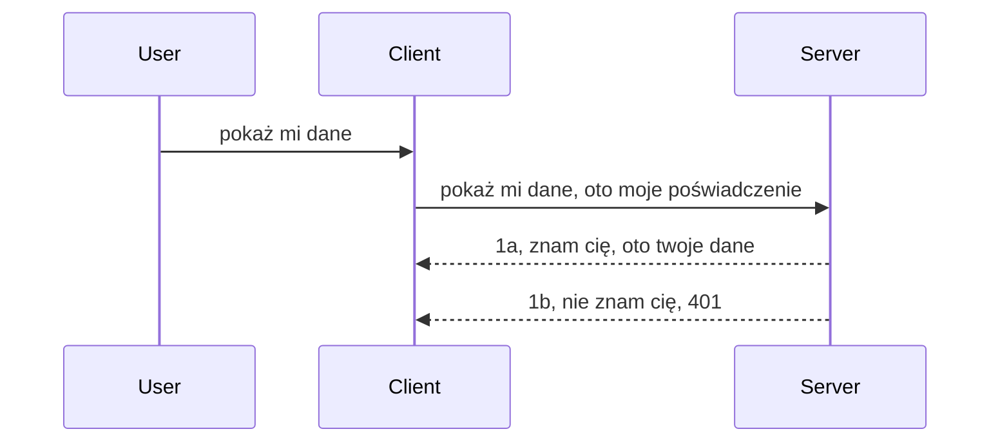

# Prosta autoryzacja

SDK MCP obsługują użycie OAuth 2.1, co, szczerze mówiąc, jest całkiem złożonym procesem obejmującym takie koncepcje jak serwer autoryzacji, serwer zasobów, przesyłanie poświadczeń, uzyskiwanie kodu, wymianę kodu na token dostępu, aż w końcu można uzyskać swoje dane zasobów. Jeśli nie jesteś przyzwyczajony do OAuth, co jest świetnym rozwiązaniem do wdrożenia, warto zacząć od jakiegoś podstawowego poziomu autoryzacji i stopniowo budować coraz lepsze zabezpieczenia. Dlatego istnieje ten rozdział, by wprowadzić Cię do bardziej zaawansowanej autoryzacji.

## Autoryzacja, co mamy na myśli?

Auth to skrót od authentication i authorization (uwierzytelnianie i autoryzacja). Idea jest taka, że musimy zrobić dwie rzeczy:

- **Uwierzytelnianie**, czyli proces ustalania czy pozwalamy osobie wejść do naszego domu, czy ma prawo być „tutaj”, czyli mieć dostęp do naszego serwera zasobów, gdzie działają funkcje MCP Server.
- **Autoryzacja**, to proces ustalania, czy użytkownik powinien mieć dostęp do konkretnych zasobów, o które prosi, na przykład do tych zamówień lub tych produktów, albo czy może tylko czytać zawartość, a nie usuwać jej jako inne przykłady.

## Poświadczenia: jak mówimy systemowi, kim jesteśmy

Większość web developerów myśli w ten sposób, że trzeba dostarczyć serwerowi poświadczenie, zazwyczaj sekret, który mówi, czy mają prawo tutaj być „Uwierzytelnianie”. To poświadczenie to zwykle base64 kodowana wersja nazwy użytkownika i hasła albo klucz API, który jednoznacznie identyfikuje konkretnego użytkownika.

Polega to na wysłaniu go za pomocą nagłówka o nazwie „Authorization”, w ten sposób:

```json
{ "Authorization": "secret123" }
```

Zwykle nazywa się to podstawową autoryzacją (basic authentication). Jak działa cały proces, jest następująco:


Teraz, gdy rozumiemy, jak to działa od strony przepływu, jak to zaimplementować? Większość serwerów WWW ma koncepcję zwaną middleware, kawałek kodu uruchamiany jako część żądania, który może zweryfikować poświadczenia, a jeśli są ważne, pozwala na dalsze przetwarzanie żądania. Jeśli żądanie nie ma poprawnych poświadczeń, otrzymujesz błąd autoryzacji. Zobaczmy, jak można to zaimplementować:

**Python**

```python
class AuthMiddleware(BaseHTTPMiddleware):
    async def dispatch(self, request, call_next):

        has_header = request.headers.get("Authorization")
        if not has_header:
            print("-> Missing Authorization header!")
            return Response(status_code=401, content="Unauthorized")

        if not valid_token(has_header):
            print("-> Invalid token!")
            return Response(status_code=403, content="Forbidden")

        print("Valid token, proceeding...")
       
        response = await call_next(request)
        # dodaj dowolne nagłówki klienta lub w inny sposób zmień odpowiedź
        return response


starlette_app.add_middleware(CustomHeaderMiddleware)
```

Tu mamy:

- Stworzony middleware o nazwie `AuthMiddleware`, gdzie jego metoda `dispatch` jest wywoływana przez serwer WWW.
- Dodany middleware do serwera WWW:

    ```python
    starlette_app.add_middleware(AuthMiddleware)
    ```

- Napisaną logikę walidacji, która sprawdza, czy nagłówek Authorization jest obecny i czy przesyłany sekret jest poprawny:

    ```python
    has_header = request.headers.get("Authorization")
    if not has_header:
        print("-> Missing Authorization header!")
        return Response(status_code=401, content="Unauthorized")

    if not valid_token(has_header):
        print("-> Invalid token!")
        return Response(status_code=403, content="Forbidden")
    ```

    jeśli sekret jest obecny i poprawny, pozwalamy przejść dalej, wywołując `call_next` i zwracamy odpowiedź.

    ```python
    response = await call_next(request)
    # dodaj dowolne nagłówki niestandardowe lub w jakiś sposób zmień odpowiedź
    return response
    ```

Działa to tak, że jeśli zapytanie sieciowe trafi do serwera, middleware zostanie wywołany i wg jego implementacji albo przepuści zapytanie dalej, albo zwróci błąd wskazujący, że klient nie ma pozwolenia na kontynuację.

**TypeScript**

Tutaj tworzymy middleware przy pomocy popularnego frameworka Express, przechwytując żądanie zanim dotrze do MCP Server. Oto kod:

```typescript
function isValid(secret) {
    return secret === "secret123";
}

app.use((req, res, next) => {
    // 1. Nagłówek autoryzacji obecny?
    if(!req.headers["Authorization"]) {
        res.status(401).send('Unauthorized');
    }
    
    let token = req.headers["Authorization"];

    // 2. Sprawdź ważność.
    if(!isValid(token)) {
        res.status(403).send('Forbidden');
    }

   
    console.log('Middleware executed');
    // 3. Przekazuje żądanie do następnego etapu w procesie obsługi żądań.
    next();
});
```

W tym kodzie:

1. Sprawdzamy, czy nagłówek Authorization w ogóle jest obecny, jeśli nie, wysyłamy błąd 401.
2. Zapewniamy, że poświadczenie/token jest ważny, jeśli nie, wysyłamy błąd 403.
3. W końcu przekazujemy żądanie dalej w pipeline i zwracamy żądany zasób.

## Ćwiczenie: Implementacja uwierzytelniania

Weźmy naszą wiedzę i spróbujmy zaimplementować to samodzielnie. Plan jest taki:

Serwer

- Utworzyć serwer WWW i instancję MCP.
- Zaimplementować middleware dla serwera.

Klient

- Wysłać żądanie sieciowe z poświadczeniem w nagłówku.

### -1- Utwórz serwer WWW i instancję MCP

Na pierwszym kroku musimy utworzyć instancję serwera WWW i serwer MCP.

**Python**

Tworzymy instancję serwera MCP, aplikację starlette i hostujemy ją używając uvicorn.

```python
# tworzenie serwera MCP

app = FastMCP(
    name="MCP Resource Server",
    instructions="Resource Server that validates tokens via Authorization Server introspection",
    host=settings["host"],
    port=settings["port"],
    debug=True
)

# tworzenie aplikacji webowej starlette
starlette_app = app.streamable_http_app()

# obsługa aplikacji za pomocą uvicorn
async def run(starlette_app):
    import uvicorn
    config = uvicorn.Config(
            starlette_app,
            host=app.settings.host,
            port=app.settings.port,
            log_level=app.settings.log_level.lower(),
        )
    server = uvicorn.Server(config)
    await server.serve()

run(starlette_app)
```

W tym kodzie:

- Tworzymy serwer MCP.
- Tworzymy aplikację starlette poprzez `app.streamable_http_app()` z MCP Server.
- Hostujemy i uruchamiamy aplikację starlette na uvicorn `server.serve()`.

**TypeScript**

Tworzymy instancję serwera MCP.

```typescript
const server = new McpServer({
      name: "example-server",
      version: "1.0.0"
    });

    // ... skonfiguruj zasoby serwera, narzędzia i podpowiedzi ...
```

Tworzenie serwera MCP musi odbywać się w definicji trasy POST /mcp, więc przenieśmy powyższy kod tak:

```typescript
import express from "express";
import { randomUUID } from "node:crypto";
import { McpServer } from "@modelcontextprotocol/sdk/server/mcp.js";
import { StreamableHTTPServerTransport } from "@modelcontextprotocol/sdk/server/streamableHttp.js";
import { isInitializeRequest } from "@modelcontextprotocol/sdk/types.js"

const app = express();
app.use(express.json());

// Mapa do przechowywania transportów według ID sesji
const transports: { [sessionId: string]: StreamableHTTPServerTransport } = {};

// Obsługa żądań POST dla komunikacji klient-serwer
app.post('/mcp', async (req, res) => {
  // Sprawdź istniejące ID sesji
  const sessionId = req.headers['mcp-session-id'] as string | undefined;
  let transport: StreamableHTTPServerTransport;

  if (sessionId && transports[sessionId]) {
    // Ponowne użycie istniejącego transportu
    transport = transports[sessionId];
  } else if (!sessionId && isInitializeRequest(req.body)) {
    // Nowe żądanie inicjalizacji
    transport = new StreamableHTTPServerTransport({
      sessionIdGenerator: () => randomUUID(),
      onsessioninitialized: (sessionId) => {
        // Przechowaj transport według ID sesji
        transports[sessionId] = transport;
      },
      // Ochrona przed DNS rebinding jest domyślnie wyłączona dla kompatybilności wstecznej. Jeśli uruchamiasz ten serwer
      // lokalnie, upewnij się, że ustawisz:
      // enableDnsRebindingProtection: true,
      // allowedHosts: ['127.0.0.1'],
    });

    // Sprzątaj transport po zamknięciu
    transport.onclose = () => {
      if (transport.sessionId) {
        delete transports[transport.sessionId];
      }
    };
    const server = new McpServer({
      name: "example-server",
      version: "1.0.0"
    });

    // ... skonfiguruj zasoby serwera, narzędzia i podpowiedzi ...

    // Połącz się z serwerem MCP
    await server.connect(transport);
  } else {
    // Nieprawidłowe żądanie
    res.status(400).json({
      jsonrpc: '2.0',
      error: {
        code: -32000,
        message: 'Bad Request: No valid session ID provided',
      },
      id: null,
    });
    return;
  }

  // Obsłuż żądanie
  await transport.handleRequest(req, res, req.body);
});

// Wspólny handler dla żądań GET i DELETE
const handleSessionRequest = async (req: express.Request, res: express.Response) => {
  const sessionId = req.headers['mcp-session-id'] as string | undefined;
  if (!sessionId || !transports[sessionId]) {
    res.status(400).send('Invalid or missing session ID');
    return;
  }
  
  const transport = transports[sessionId];
  await transport.handleRequest(req, res);
};

// Obsługa żądań GET dla powiadomień serwer-klient przez SSE
app.get('/mcp', handleSessionRequest);

// Obsługa żądań DELETE dla zakończenia sesji
app.delete('/mcp', handleSessionRequest);

app.listen(3000);
```

Jak widać, tworzenie serwera MCP przenieśliśmy do wnętrza `app.post("/mcp")`.

Przejdźmy do kolejnego kroku, tworzenia middleware, abyśmy mogli zweryfikować nadchodzące poświadczenie.

### -2- Zaimplementuj middleware dla serwera

Przejdźmy do części middleware. Utworzymy middleware, który szuka poświadczenia w nagłówku `Authorization` i je weryfikuje. Jeśli jest akceptowalne, żądanie będzie kontynuowane w celu wykonania tego, co musi (np. lista narzędzi, odczyt zasobu lub dowolna funkcjonalność MCP, o którą prosił klient).

**Python**

Aby stworzyć middleware, musimy stworzyć klasę dziedziczącą po `BaseHTTPMiddleware`. Są dwa interesujące elementy:

- Zapytanie `request`, z którego czytamy nagłówek.
- `call_next`, callback, który wywołujemy, jeśli klient dostarczył poświadczenie akceptowalne.

Najpierw obsłużmy sytuację, gdy brak nagłówka `Authorization`:

```python
has_header = request.headers.get("Authorization")

# brak nagłówka, błąd 401, w przeciwnym razie kontynuuj.
if not has_header:
    print("-> Missing Authorization header!")
    return Response(status_code=401, content="Unauthorized")
```

Tutaj zwracamy 401 unauthorized, ponieważ klient nie przeszedł autoryzacji.

Następnie, jeśli poświadczenie zostało przesłane, sprawdzamy jego ważność tak:

```python
 if not valid_token(has_header):
    print("-> Invalid token!")
    return Response(status_code=403, content="Forbidden")
```

Zauważ, że zwracamy 403 forbidden. Spójrzmy na pełny kod middleware implementujący wszystko, co powyżej opisaliśmy:

```python
class AuthMiddleware(BaseHTTPMiddleware):
    async def dispatch(self, request, call_next):

        has_header = request.headers.get("Authorization")
        if not has_header:
            print("-> Missing Authorization header!")
            return Response(status_code=401, content="Unauthorized")

        if not valid_token(has_header):
            print("-> Invalid token!")
            return Response(status_code=403, content="Forbidden")

        print("Valid token, proceeding...")
        print(f"-> Received {request.method} {request.url}")
        response = await call_next(request)
        response.headers['Custom'] = 'Example'
        return response

```

Świetnie, a co z funkcją `valid_token`? Oto ona:

```python
# NIE używać w produkcji - popraw to !!
def valid_token(token: str) -> bool:
    # usuń prefiks "Bearer "
    if token.startswith("Bearer "):
        token = token[7:]
        return token == "secret-token"
    return False
```

Oczywiście można to poprawić.

WAŻNE: Nigdy NIE powinieneś mieć sekretów takich jak ten w kodzie. Najlepiej pobierać wartość do porównania z bazy danych lub od IDP (provider tożsamości), a najlepiej pozwolić IDP na walidację.

**TypeScript**

Aby to zrobić w Express, trzeba wywołać metodę `use`, która przyjmuje funkcje middleware.

Musimy:

- Sprawdzić poświadczenie przekazane w `Authorization` w żądaniu.
- Zweryfikować poświadczenie i jeśli jest poprawne, pozwolić na dalsze przetwarzanie żądania MCP.

Tu sprawdzamy, czy w ogóle jest nagłówek `Authorization`, jeśli nie, zatrzymujemy żądanie:

```typescript
if(!req.headers["authorization"]) {
    res.status(401).send('Unauthorized');
    return;
}
```

Jeśli nagłówek nie zostanie wysłany, otrzymujemy błąd 401.

Następnie sprawdzamy, czy poświadczenie jest poprawne, jeśli nie, zatrzymujemy ponownie żądanie z innym komunikatem:

```typescript
if(!isValid(token)) {
    res.status(403).send('Forbidden');
    return;
} 
```

Tu otrzymujesz błąd 403.

Oto pełny kod:

```typescript
app.use((req, res, next) => {
    console.log('Request received:', req.method, req.url, req.headers);
    console.log('Headers:', req.headers["authorization"]);
    if(!req.headers["authorization"]) {
        res.status(401).send('Unauthorized');
        return;
    }
    
    let token = req.headers["authorization"];

    if(!isValid(token)) {
        res.status(403).send('Forbidden');
        return;
    }  

    console.log('Middleware executed');
    next();
});
```

Skonfigurowaliśmy serwer, aby akceptował middleware weryfikujące poświadczenie od klienta. A co z samym klientem?

### -3- Wyślij żądanie sieciowe z poświadczeniem w nagłówku

Musimy upewnić się, że klient przesyła poświadczenie w nagłówku. Ponieważ używamy klienta MCP, musimy to zrobić odpowiednio.

**Python**

Dla klienta trzeba przekazać nagłówek z naszym poświadczeniem, tak:

```python
# NIE wpisuj wartości na sztywno, trzymaj ją przynajmniej w zmiennej środowiskowej lub w bezpieczniejszym magazynie
token = "secret-token"

async with streamablehttp_client(
        url = f"http://localhost:{port}/mcp",
        headers = {"Authorization": f"Bearer {token}"}
    ) as (
        read_stream,
        write_stream,
        session_callback,
    ):
        async with ClientSession(
            read_stream,
            write_stream
        ) as session:
            await session.initialize()
      
            # DO ZROBIENIA, co chcesz wykonać po stronie klienta, np. lista narzędzi, wywołanie narzędzi itp.
```

Zauważ, jak wypełniamy właściwość `headers` tak: ` headers = {"Authorization": f"Bearer {token}"}`.

**TypeScript**

Rozwiązujemy w dwóch krokach:

1. Wypełniamy obiekt konfiguracyjny naszymi poświadczeniami.
2. Przekazujemy ten obiekt konfiguracyjny do transportu.

```typescript

// NIE wpisuj na sztywno wartości tak jak pokazano tutaj. Przynajmniej ustaw to jako zmienną środowiskową i użyj czegoś takiego jak dotenv (w trybie deweloperskim).
let token = "secret123"

// zdefiniuj obiekt opcji transportu klienta
let options: StreamableHTTPClientTransportOptions = {
  sessionId: sessionId,
  requestInit: {
    headers: {
      "Authorization": "secret123"
    }
  }
};

// przekaż obiekt opcji do transportu
async function main() {
   const transport = new StreamableHTTPClientTransport(
      new URL(serverUrl),
      options
   );
```

Tutaj widać, jak tworzymy obiekt `options` i umieszczamy tam nagłówki w `requestInit`.

WAŻNE: Jak to ulepszyć dalej? Obecne rozwiązanie ma problemy. Przede wszystkim przekazywanie poświadczeń w ten sposób jest ryzykowne, chyba że przynajmniej masz HTTPS. Nawet wtedy poświadczenie może zostać skradzione, więc potrzebny jest system łatwego unieważniania tokenów i dodatkowych zabezpieczeń, jak np. skąd zapytanie pochodzi, czy nie jest wykonywane zbyt często (zachowanie bota) — jednym słowem, jest wiele zagadnień.

Należy jednak powiedzieć, że do bardzo prostych API, gdzie nie chcesz, by ktoś korzystał bez uwierzytelnienia, takie podejście jest dobrym początkiem.

Jednak spróbujmy trochę podnieść poziom bezpieczeństwa, stosując standardowy format, jak JSON Web Token, znany też jako JWT lub tokeny „JOT”.

## JSON Web Tokeny, JWT

Starając się poprawić bezpieczeństwo względem prostych poświadczeń, co zyskujemy przy zastosowaniu JWT?

- **Poprawa bezpieczeństwa**. W podstawowej autoryzacji przesyłasz nazwę użytkownika i hasło jako token base64 (lub klucz API) w kółko, co zwiększa ryzyko. JWT pozwala wysłać nazwę użytkownika i hasło i otrzymać w zamian token czasowo ograniczony. JWT pozwala łatwo stosować precyzyjną kontrolę dostępu przez role, zakresy i uprawnienia.
- **Bezstanowość i skalowalność**. JWT są samodzielne, zawierają wszystkie informacje o użytkowniku i eliminują potrzebę przechowywania sesji po stronie serwera. Token można też weryfikować lokalnie.
- **Interoperacyjność i federacja**. JWT jest podstawą Open ID Connect i używany jest z popularnymi dostawcami tożsamości jak Entra ID, Google Identity, Auth0. Pozwala to stosować SSO i wiele więcej, co czyni rozwiązanie klasy enterprise.
- **Modularność i elastyczność**. JWT można też używać z bramami API jak Azure API Management, NGINX itd. Obsługuje scenariusze uwierzytelniania i komunikacji serwer-serwer, w tym podszywanie się i delegację.
- **Wydajność i cache**. JWT można cache’ować po odkodowaniu, co zmniejsza konieczność parsowania. To pomaga przy wysokim obciążeniu aplikacji, poprawia przepustowość i zmniejsza obciążenie infrastruktury.
- **Zaawansowane funkcje**. Obsługuje introspekcję (sprawdzanie ważności na serwerze) i unieważnianie (unieważnianie tokenu).

Z tymi wszystkimi korzyściami zobaczmy, jak przenieść naszą implementację na wyższy poziom.

## Zamiana podstawowej autoryzacji na JWT

Zmiany, które musimy wprowadzić na wysokim poziomie, to:

- **Nauczyć się tworzyć token JWT** i przygotować go do wysłania z klienta do serwera.
- **Weryfikować token JWT** i jeśli jest poprawny, udostępnić klientowi zasoby.
- **Bezpieczne przechowywanie tokenu**. Jak przechowywać token.
- **Chronić trasy**. Musimy chronić trasy, w naszym przypadku trasy i konkretne funkcje MCP.
- **Dodać tokeny odświeżające**. Tworzyć krótkotrwałe tokeny i długotrwałe tokeny odświeżające, które umożliwiają zdobywanie nowych tokenów po wygaśnięciu. Zapewnić endpoint do odświeżania i strategię rotacji.

### -1- Stwórz token JWT

Token JWT ma następujące części:

- **Nagłówek**, algorytm i typ tokenu.
- **Ładunek (payload)**, claims, jak sub (użytkownik, który token reprezentuje – zwykle userid), exp (czas wygaśnięcia), role (rola).
- **Podpis**, podpis wykonany sekretem lub kluczem prywatnym.

Trzeba stworzyć nagłówek, ładunek i zakodowany token.

**Python**

```python

import jwt
import jwt
from jwt.exceptions import ExpiredSignatureError, InvalidTokenError
import datetime

# Sekretny klucz używany do podpisywania JWT
secret_key = 'your-secret-key'

header = {
    "alg": "HS256",
    "typ": "JWT"
}

# informacje o użytkowniku oraz jego uprawnienia i czas wygaśnięcia
payload = {
    "sub": "1234567890",               # Podmiot (ID użytkownika)
    "name": "User Userson",                # Niestandardowe uprawnienie
    "admin": True,                     # Niestandardowe uprawnienie
    "iat": datetime.datetime.utcnow(),# Data wydania
    "exp": datetime.datetime.utcnow() + datetime.timedelta(hours=1)  # Data wygaśnięcia
}

# zakoduj to
encoded_jwt = jwt.encode(payload, secret_key, algorithm="HS256", headers=header)
```

W powyższym kodzie:

- Zdefiniowano nagłówek używający algorytmu HS256 z typem JWT.
- Stworzono ładunek zawierający subject lub user id, nazwę użytkownika, rolę, czas wydania i czas ważności, implementując aspekt ograniczenia czasowego.

**TypeScript**

Potrzebujemy kilku zależności, które pomogą tworzyć token JWT.

Zależności

```sh

npm install jsonwebtoken
npm install --save-dev @types/jsonwebtoken
```

Mając to, tworzymy nagłówek, ładunek i kodowany token.

```typescript
import jwt from 'jsonwebtoken';

const secretKey = 'your-secret-key'; // Używaj zmiennych środowiskowych w produkcji

// Zdefiniuj ładunek
const payload = {
  sub: '1234567890',
  name: 'User usersson',
  admin: true,
  iat: Math.floor(Date.now() / 1000), // Wydano o
  exp: Math.floor(Date.now() / 1000) + 60 * 60 // Wygasa za 1 godzinę
};

// Zdefiniuj nagłówek (opcjonalnie, jsonwebtoken ustawia wartości domyślne)
const header = {
  alg: 'HS256',
  typ: 'JWT'
};

// Utwórz token
const token = jwt.sign(payload, secretKey, {
  algorithm: 'HS256',
  header: header
});

console.log('JWT:', token);
```

Token ten jest:

Podpisany algorytmem HS256
Ważny przez 1 godzinę
Zawiera claims takie jak sub, name, admin, iat i exp.

### -2- Weryfikuj token

Musimy też weryfikować token, co powinniśmy robić po stronie serwera, by upewnić się, że to, co klient przesyła, jest faktycznie ważne. Jest wiele sprawdzeń, które powinniśmy wykonać, od struktury do ważności. Zaleca się także sprawdzać, czy użytkownik istnieje w systemie i czy ma odpowiednie prawa.

Aby zweryfikować token, trzeba go zdekodować i zacząć weryfikację:

**Python**

```python

# Odszyfruj i zweryfikuj JWT
try:
    decoded = jwt.decode(token, secret_key, algorithms=["HS256"])
    print("✅ Token is valid.")
    print("Decoded claims:")
    for key, value in decoded.items():
        print(f"  {key}: {value}")
except ExpiredSignatureError:
    print("❌ Token has expired.")
except InvalidTokenError as e:
    print(f"❌ Invalid token: {e}")

```

W tym kodzie wywołujemy `jwt.decode`, podając token, klucz sekretu i wybrany algorytm. Zauważ, że korzystamy z konstrukcji try-catch, ponieważ nieudana walidacja generuje wyjątek.

**TypeScript**

Tutaj wywołujemy `jwt.verify`, by otrzymać zdekodowaną wersję tokenu do dalszej analizy. Jeśli ta metoda zwróci błąd, token jest uszkodzony lub nie ważny.

```typescript

try {
  const decoded = jwt.verify(token, secretKey);
  console.log('Decoded Payload:', decoded);
} catch (err) {
  console.error('Token verification failed:', err);
}
```

UWAGA: jak wspomniano, powinniśmy wykonać dodatkowe sprawdzenia, by upewnić się, że token odnosi się do użytkownika w systemie i że ma on prawa, które deklaruje.

Teraz spójrzmy na kontrolę dostępu opartą na rolach, czyli RBAC.
## Dodawanie kontroli dostępu opartej na rolach

Chodzi o to, że chcemy wyrazić, że różne role mają różne uprawnienia. Na przykład przyjmujemy, że administrator może robić wszystko, zwykły użytkownik może czytać i pisać, a gość może tylko czytać. W związku z tym oto możliwe poziomy uprawnień:

- Admin.Write 
- User.Read
- Guest.Read

Zobaczmy, jak możemy zaimplementować taką kontrolę za pomocą middleware. Middleware można dodawać dla poszczególnych tras, jak i dla wszystkich tras.

**Python**

```python
from starlette.middleware.base import BaseHTTPMiddleware
from starlette.responses import JSONResponse
import jwt

# NIE trzymaj sekretu w kodzie, to jest tylko do celów demonstracyjnych. Wczytaj go z bezpiecznego miejsca.
SECRET_KEY = "your-secret-key" # umieść to w zmiennej środowiskowej
REQUIRED_PERMISSION = "User.Read"

class JWTPermissionMiddleware(BaseHTTPMiddleware):
    async def dispatch(self, request, call_next):
        auth_header = request.headers.get("Authorization")
        if not auth_header or not auth_header.startswith("Bearer "):
            return JSONResponse({"error": "Missing or invalid Authorization header"}, status_code=401)

        token = auth_header.split(" ")[1]
        try:
            decoded = jwt.decode(token, SECRET_KEY, algorithms=["HS256"])
        except jwt.ExpiredSignatureError:
            return JSONResponse({"error": "Token expired"}, status_code=401)
        except jwt.InvalidTokenError:
            return JSONResponse({"error": "Invalid token"}, status_code=401)

        permissions = decoded.get("permissions", [])
        if REQUIRED_PERMISSION not in permissions:
            return JSONResponse({"error": "Permission denied"}, status_code=403)

        request.state.user = decoded
        return await call_next(request)


```

Istnieje kilka różnych sposobów dodania middleware, jak poniżej:

```python

# Alt 1: dodaj middleware podczas tworzenia aplikacji starlette
middleware = [
    Middleware(JWTPermissionMiddleware)
]

app = Starlette(routes=routes, middleware=middleware)

# Alt 2: dodaj middleware po utworzeniu aplikacji starlette
starlette_app.add_middleware(JWTPermissionMiddleware)

# Alt 3: dodaj middleware dla każdej trasy
routes = [
    Route(
        "/mcp",
        endpoint=..., # obsługujący
        middleware=[Middleware(JWTPermissionMiddleware)]
    )
]
```

**TypeScript**

Możemy użyć `app.use` i middleware, które będzie działać dla wszystkich żądań.

```typescript
app.use((req, res, next) => {
    console.log('Request received:', req.method, req.url, req.headers);
    console.log('Headers:', req.headers["authorization"]);

    // 1. Sprawdź, czy nagłówek autoryzacji został wysłany

    if(!req.headers["authorization"]) {
        res.status(401).send('Unauthorized');
        return;
    }
    
    let token = req.headers["authorization"];

    // 2. Sprawdź, czy token jest ważny
    if(!isValid(token)) {
        res.status(403).send('Forbidden');
        return;
    }  

    // 3. Sprawdź, czy użytkownik tokena istnieje w naszym systemie
    if(!isExistingUser(token)) {
        res.status(403).send('Forbidden');
        console.log("User does not exist");
        return;
    }
    console.log("User exists");

    // 4. Zweryfikuj, czy token ma odpowiednie uprawnienia
    if(!hasScopes(token, ["User.Read"])){
        res.status(403).send('Forbidden - insufficient scopes');
    }

    console.log("User has required scopes");

    console.log('Middleware executed');
    next();
});

```

Jest kilka rzeczy, które nasze middleware może i POWINNO robić, mianowicie:

1. Sprawdzić, czy nagłówek autoryzacji jest obecny
2. Sprawdzić, czy token jest ważny, wywołujemy `isValid`, która jest metodą, którą napisaliśmy do sprawdzania integralności i ważności tokenu JWT.
3. Zweryfikować, czy użytkownik istnieje w naszym systemie, powinniśmy to sprawdzić.

   ```typescript
    // użytkownicy w bazie danych
   const users = [
     "user1",
     "User usersson",
   ]

   function isExistingUser(token) {
     let decodedToken = verifyToken(token);

     // DO ZROBIENIA, sprawdź czy użytkownik istnieje w bazie danych
     return users.includes(decodedToken?.name || "");
   }
   ```

   Powyżej utworzyliśmy bardzo prostą listę `users`, która oczywiście powinna znajdować się w bazie danych.

4. Dodatkowo powinniśmy również sprawdzić, czy token ma odpowiednie uprawnienia.

   ```typescript
   if(!hasScopes(token, ["User.Read"])){
        res.status(403).send('Forbidden - insufficient scopes');
   }
   ```

   W tym powyższym kodzie z middleware sprawdzamy, że token zawiera uprawnienie User.Read, jeśli nie, wysyłamy błąd 403. Poniżej znajduje się metoda pomocnicza `hasScopes`.

   ```typescript
   function hasScopes(scope: string, requiredScopes: string[]) {
     let decodedToken = verifyToken(scope);
    return requiredScopes.every(scope => decodedToken?.scopes.includes(scope));
  }
   ```

Have a think which additional checks you should be doing, but these are the absolute minimum of checks you should be doing.

Using Express as a web framework is a common choice. There are helpers library when you use JWT so you can write less code.

- `express-jwt`, helper library that provides a middleware that helps decode your token.
- `express-jwt-permissions`, this provides a middleware `guard` that helps check if a certain permission is on the token.

Here's what these libraries can look like when used:

```typescript
const express = require('express');
const jwt = require('express-jwt');
const guard = require('express-jwt-permissions')();

const app = express();
const secretKey = 'your-secret-key'; // put this in env variable

// Decode JWT and attach to req.user
app.use(jwt({ secret: secretKey, algorithms: ['HS256'] }));

// Check for User.Read permission
app.use(guard.check('User.Read'));

// multiple permissions
// app.use(guard.check(['User.Read', 'Admin.Access']));

app.get('/protected', (req, res) => {
  res.json({ message: `Welcome ${req.user.name}` });
});

// Error handler
app.use((err, req, res, next) => {
  if (err.code === 'permission_denied') {
    return res.status(403).send('Forbidden');
  }
  next(err);
});

```

Teraz widziałeś, jak middleware może być używane zarówno do uwierzytelniania, jak i autoryzacji, a co z MCP? Czy zmienia to, jak robimy autoryzację? Przekonajmy się w następnej sekcji.

### -3- Dodawanie RBAC do MCP

Do tej pory widziałeś, jak można dodać RBAC za pomocą middleware, jednak dla MCP nie ma łatwego sposobu na dodanie RBAC per funkcja MCP, więc co robimy? Cóż, wystarczy dodać kod, który w tym przypadku sprawdza, czy klient ma prawa do wywołania konkretnego narzędzia:

Masz kilka różnych opcji, aby osiągnąć RBAC per funkcja, oto niektóre z nich:

- Dodaj sprawdzenie dla każdego narzędzia, zasobu, prompta, gdzie trzeba sprawdzić poziom uprawnień.

   **python**

   ```python
   @tool()
   def delete_product(id: int):
      try:
          check_permissions(role="Admin.Write", request)
      catch:
        pass # klient nie przeszedł autoryzacji, zgłoś błąd autoryzacji
   ```

   **typescript**

   ```typescript
   server.registerTool(
    "delete-product",
    {
      title: Delete a product",
      description: "Deletes a product",
      inputSchema: { id: z.number() }
    },
    async ({ id }) => {
      
      try {
        checkPermissions("Admin.Write", request);
        // do zrobienia, wyślij identyfikator do productService i remote entry
      } catch(Exception e) {
        console.log("Authorization error, you're not allowed");  
      }

      return {
        content: [{ type: "text", text: `Deletected product with id ${id}` }]
      };
    }
   );
   ```


- Użyj zaawansowanego podejścia serwerowego i handlerów żądań, aby zminimalizować miejsca, w których trzeba wykonać sprawdzenie.

   **Python**

   ```python
   
   tool_permission = {
      "create_product": ["User.Write", "Admin.Write"],
      "delete_product": ["Admin.Write"]
   }

   def has_permission(user_permissions, required_permissions) -> bool:
      # user_permissions: lista uprawnień posiadanych przez użytkownika
      # required_permissions: lista uprawnień wymaganych do narzędzia
      return any(perm in user_permissions for perm in required_permissions)

   @server.call_tool()
   async def handle_call_tool(
     name: str, arguments: dict[str, str] | None
   ) -> list[types.TextContent]:
    # Załóż, że request.user.permissions to lista uprawnień użytkownika
     user_permissions = request.user.permissions
     required_permissions = tool_permission.get(name, [])
     if not has_permission(user_permissions, required_permissions):
        # Rzuć błąd "Nie masz uprawnień do wywołania narzędzia {name}"
        raise Exception(f"You don't have permission to call tool {name}")
     # kontynuuj i wywołaj narzędzie
     # ...
   ```   
   

   **TypeScript**

   ```typescript
   function hasPermission(userPermissions: string[], requiredPermissions: string[]): boolean {
       if (!Array.isArray(userPermissions) || !Array.isArray(requiredPermissions)) return false;
       // Zwróć true, jeśli użytkownik ma co najmniej jedno wymagane uprawnienie
       
       return requiredPermissions.some(perm => userPermissions.includes(perm));
   }
  
   server.setRequestHandler(CallToolRequestSchema, async (request) => {
      const { params: { name } } = request;
  
      let permissions = request.user.permissions;
  
      if (!hasPermission(permissions, toolPermissions[name])) {
         return new Error(`You don't have permission to call ${name}`);
      }
  
      // kontynuuj..
   });
   ```

   Uwaga, musisz upewnić się, że Twoje middleware przypisuje zdekodowany token do właściwości user żądania, aby powyższy kod był prosty.

### Podsumowanie

Teraz, gdy omówiliśmy, jak dodać wsparcie dla RBAC w ogóle, a w szczególności dla MCP, czas spróbować samodzielnie wdrożyć zabezpieczenia, aby upewnić się, że zrozumiałeś przedstawione koncepcje.

## Zadanie 1: Zbuduj serwer mcp i klienta mcp używając podstawowej autoryzacji

Tutaj wykorzystasz to, czego nauczyłeś się o przesyłaniu poświadczeń przez nagłówki.

## Rozwiązanie 1

[Solution 1](./code/basic/README.md)

## Zadanie 2: Ulepsz rozwiązanie z Zadania 1, aby korzystało z JWT

Weź pierwsze rozwiązanie, ale tym razem ulepszmy je.

Zamiast używać Basic Auth, użyjmy JWT.

## Rozwiązanie 2

[Solution 2](./solution/jwt-solution/README.md)

## Wyzwanie

Dodaj RBAC per narzędzie, jak opisano w sekcji "Dodawanie RBAC do MCP".

## Podsumowanie

Mamy nadzieję, że nauczyłeś się dużo w tym rozdziale, od całkowitego braku zabezpieczeń, przez podstawowe zabezpieczenia, po JWT i jak można je dodać do MCP.

Zbudowaliśmy solidne fundamenty z niestandardowymi JWT, ale w miarę skalowania przechodzimy w kierunku opartego na standardach modelu tożsamości. Przyjęcie IdP takiego jak Entra czy Keycloak pozwala nam odciążyć się od wystawiania, walidacji i zarządzania cyklem życia tokenów, korzystając z zaufanej platformy – co pozwala skupić się na logice aplikacji i doświadczeniu użytkownika.

Do tego mamy bardziej [zaawansowany rozdział o Entrze](../../05-AdvancedTopics/mcp-security-entra/README.md)

## Co dalej

- Następny: [Konfiguracja hostów MCP](../12-mcp-hosts/README.md)

---

<!-- CO-OP TRANSLATOR DISCLAIMER START -->
**Zastrzeżenie**:  
Ten dokument został przetłumaczony za pomocą usługi tłumaczenia AI [Co-op Translator](https://github.com/Azure/co-op-translator). Chociaż staramy się zapewnić dokładność, prosimy pamiętać, że automatyczne tłumaczenia mogą zawierać błędy lub nieścisłości. Oryginalny dokument w języku źródłowym powinien być uważany za wiarygodne źródło. W przypadku informacji krytycznych zalecane jest skorzystanie z profesjonalnego tłumaczenia wykonanego przez człowieka. Nie ponosimy odpowiedzialności za jakiekolwiek nieporozumienia lub błędne interpretacje wynikające z korzystania z tego tłumaczenia.
<!-- CO-OP TRANSLATOR DISCLAIMER END -->