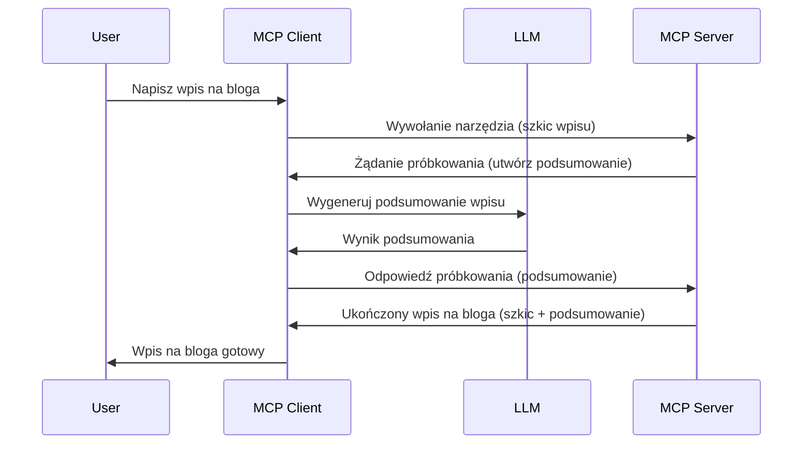

# Sampling - delegowanie funkcji do klienta

Czasami potrzebujesz, aby klient MCP i serwer MCP współpracowali, aby osiągnąć wspólny cel. Możesz mieć sytuację, w której serwer potrzebuje pomocy LLM, który znajduje się po stronie klienta. W takim przypadku do wykorzystania powinien być sampling.

Przyjrzyjmy się kilku przypadkom użycia i temu, jak zbudować rozwiązanie z udziałem samplingu.

## Przegląd

W tej lekcji skupimy się na wyjaśnieniu, kiedy i gdzie używać samplingu oraz jak go skonfigurować.

## Cele nauki

W tym rozdziale:

- Wyjaśnimy, czym jest sampling i kiedy go używać.
- Pokażemy, jak skonfigurować sampling w MCP.
- Przedstawimy przykłady działania samplingu.

## Czym jest sampling i dlaczego go używać?

Sampling to zaawansowana funkcja, która działa w następujący sposób:


### Żądanie samplingu

Ok, teraz mamy ogólny szkic wiarygodnego scenariusza, porozmawiajmy o żądaniu samplingu, które serwer wysyła z powrotem do klienta. Tak może wyglądać takie żądanie w formacie JSON-RPC:

```json
{
  "jsonrpc": "2.0",
  "id": 1,
  "method": "sampling/createMessage",
  "params": {
    "messages": [
      {
        "role": "user",
        "content": {
          "type": "text",
          "text": "Create a blog post summary of the following blog post: <BLOG POST>"
        }
      }
    ],
    "modelPreferences": {
      "hints": [
        {
          "name": "claude-3-sonnet"
        }
      ],
      "intelligencePriority": 0.8,
      "speedPriority": 0.5
    },
    "systemPrompt": "You are a helpful assistant.",
    "maxTokens": 100
  }
}
```

Kilka rzeczy tutaj warto podkreślić:

- Prompt, w content -> text, to nasza wskazówka, będąca instrukcją dla LLM, aby podsumował zawartość wpisu na blogu.

- **modelPreferences**. Ta sekcja to właśnie preferencje, rekomendacja konfiguracji do użycia z LLM. Użytkownik może zdecydować, czy przyjmie te rekomendacje, czy je zmieni. W tym przypadku mamy rekomendacje dotyczące modelu, prędkości i priorytetu inteligencji.

- **systemPrompt**, to normalny prompt systemowy, który nadaje LLM osobowość i zawiera instrukcje dotyczące zachowania.
- **maxTokens**, to kolejna właściwość mówiąca, ile tokenów zaleca się wykorzystać dla tego zadania.

### Odpowiedź samplingu

Ta odpowiedź to to, co klient MCP ostatecznie wysyła z powrotem do serwera MCP i jest wynikiem wywołania LLM przez klienta, oczekiwania na tę odpowiedź, a następnie skonstruowania tej wiadomości. Tak może wyglądać w JSON-RPC:

```json
{
  "jsonrpc": "2.0",
  "id": 1,
  "result": {
    "role": "assistant",
    "content": {
      "type": "text",
      "text": "Here's your abstract <ABSTRACT>"
    },
    "model": "gpt-5",
    "stopReason": "endTurn"
  }
}
```

Zwróć uwagę, że odpowiedź jest streszczeniem wpisu na blogu, tak jak prosiliśmy. Zauważ też, że użyty `model` nie jest tym, o który prosiliśmy – "gpt-5" zamiast "claude-3-sonnet". Ma to zilustrować, że użytkownik może zmienić zdanie co do używanego modelu, a twoje żądanie samplingu jest rekomendacją.

Ok, teraz gdy rozumiemy główny przebieg i przydatne zadanie do tego celu "tworzenie wpisu na bloga + streszczenie", zobaczmy, co trzeba zrobić, aby to działało.

### Typy wiadomości

Wiadomości związane z samplingiem nie ograniczają się tylko do tekstu, można też przesyłać obrazy i dźwięki. Tak wygląda różnica w JSON-RPC:

**Tekst**

```json
{
  "type": "text",
  "text": "The message content"
}
```

**Zawartość obrazu**

```json
{
  "type": "image",
  "data": "base64-encoded-image-data",
  "mimeType": "image/jpeg"
}
```

**Zawartość dźwięku**

```json
{
  "type": "audio",
  "data": "base64-encoded-audio-data",
  "mimeType": "audio/wav"
}
```

> NOTE: aby uzyskać szczegółowe informacje na temat samplingu, sprawdź [oficjalną dokumentację](https://modelcontextprotocol.io/specification/2025-06-18/client/sampling)

## Jak skonfigurować sampling po stronie klienta

> Uwaga: jeśli budujesz tylko serwer, tutaj nie musisz robić nic więcej.

W kliencie musisz określić następującą funkcję w ten sposób:

```json
{
  "capabilities": {
    "sampling": {}
  }
}
```

To zostanie odebrane podczas inicjalizacji twojego wybranego klienta z serwerem.

## Przykład działania samplingu – tworzenie wpisu na blogu

Stwórzmy razem serwer z samplingiem, musimy wykonać następujące kroki:

1. Stwórz narzędzie na serwerze.
2. Narzędzie powinno stworzyć żądanie samplingu.
3. Narzędzie powinno czekać na odpowiedź na żądanie samplingu od klienta.
4. Następnie powinno wygenerować wynik narzędzia.

Zobaczmy kod krok po kroku:

### -1- Stwórz narzędzie

**python**

```python
@mcp.tool()
async def create_blog(title: str, content: str, ctx: Context[ServerSession, None]) -> str:
    """Create a blog post and generate a summary"""

```

### -2- Stwórz żądanie samplingu

Rozszerz narzędzie o poniższy kod:

**python**

```python
post = BlogPost(
        id=len(posts) + 1,
        title=title,
        content=content,
        abstract=""
    )

prompt = f"Create an abstract of the following blog post: title: {title} and draft: {content} "

result = await ctx.session.create_message(
        messages=[
            SamplingMessage(
                role="user",
                content=TextContent(type="text", text=prompt),
            )
        ],
        max_tokens=100,
)

```

### -3- Czekaj na odpowiedź i zwróć ją

**python**

```python
post.abstract = result.content.text

posts.append(post)

# zwróć kompletny produkt
return json.dumps({
    "id": post.title,
    "abstract": post.abstract
})
```

### -4- Pełny kod

**python**

```python
from starlette.applications import Starlette
from starlette.routing import Mount, Host

from mcp.server.fastmcp import Context, FastMCP

from mcp.server.session import ServerSession
from mcp.types import SamplingMessage, TextContent

import json


from uuid import uuid4
from typing import List
from pydantic import BaseModel


mcp = FastMCP("Blog post generator")

# app = FastAPI()

posts = []

class BlogPost(BaseModel):
    id: int
    title: str
    content: str
    abstract: str

posts: List[BlogPost] = []

@mcp.tool()
async def create_blog(title: str, content: str, ctx: Context[ServerSession, None]) -> str:
    """Create a blog post and generate a summary"""

    post = BlogPost(
        id=len(posts) + 1,
        title=title,
        content=content,
        abstract=""
    )

    prompt = f"Create an abstract of the following blog post: title: {title} and draft: {content} "

    result = await ctx.session.create_message(
        messages=[
            SamplingMessage(
                role="user",
                content=TextContent(type="text", text=prompt),
            )
        ],
        max_tokens=100,
    )

    post.abstract = result.content.text

    posts.append(post)

    # zwróć cały wpis na blogu
    return json.dumps({
        "id": post.title,
        "abstract": post.abstract
    })

if __name__ == "__main__":
    print("Starting server...")
    # mcp.run()
    mcp.run(transport="streamable-http")

# uruchom aplikację poleceniem: python server.py
```

### -5- Testowanie w Visual Studio Code

Aby przetestować to w Visual Studio Code, wykonaj następujące kroki:

1. Uruchom serwer w terminalu.
2. Dodaj go do *mcp.json* (upewnij się, że jest uruchomiony), np. tak:

   ```json
   "servers": {
      "blog-server": {
        "type": "http",
        "url": "http://localhost:8000/mcp"
      }
   }
   ```

3. Wpisz prompt:

   ```text
   create a blog post named "Where Python comes from", the content is "Python is actually named after Monty Python Flying Circus"
   ```

4. Pozwól na wykonanie samplingu. Przy pierwszym teście pojawi się dodatkowy dialog do zaakceptowania, potem zobaczysz normalny dialog z prośbą o uruchomienie narzędzia.

5. Sprawdź wyniki. Zobaczysz wyniki ładnie wyświetlone w GitHub Copilot Chat, ale możesz też zajrzeć do surowej odpowiedzi JSON.

**Bonus**. Narzędzia Visual Studio Code mają świetne wsparcie dla samplingu. Możesz skonfigurować dostęp do samplingu na zainstalowanym serwerze, wykonując:

1. Przejdź do sekcji rozszerzeń.
2. Wybierz ikonę koła zębatego przy swoim zainstalowanym serwerze w sekcji "MCP SERVERS - INSTALLED".
3. Wybierz "Configure Model Access", tutaj możesz wybrać, które modele GitHub Copilot może używać podczas samplingu. Możesz też zobaczyć wszystkie ostatnie żądania samplingu, wybierając "Show Sampling requests".

## Zadanie

W tym zadaniu zbudujesz nieco inny sampling, czyli integrację samplingu wspierającą generowanie opisu produktu. Oto twoja sytuacja:

**Scenariusz**: Pracownik zaplecza w e-commerce potrzebuje pomocy, zajmuje mu to za dużo czasu, by generować opisy produktów. Dlatego masz zbudować rozwiązanie, w którym możesz wywołać narzędzie "create_product" z argumentami "title" i "keywords", a narzędzie powinno wygenerować kompletny produkt zawierający pole "description" wypełniane przez LLM klienta.

TIP: użyj tego, czego się nauczyłeś wcześniej, by skonstruować ten serwer i jego narzędzie za pomocą żądania samplingu.

## Rozwiązanie

[Solution](./solution/README.md)

## Kluczowe wnioski

Sampling to potężna funkcja pozwalająca serwerowi delegować zadania do klienta, gdy potrzebuje pomocy LLM.

## Co dalej

- [Rozdział 4 - Praktyczna implementacja](../../04-PracticalImplementation/README.md)

---

<!-- CO-OP TRANSLATOR DISCLAIMER START -->
**Zastrzeżenie**:  
Niniejszy dokument został przetłumaczony za pomocą usługi tłumaczenia AI [Co-op Translator](https://github.com/Azure/co-op-translator). Mimo że dążymy do dokładności, prosimy mieć na uwadze, że automatyczne tłumaczenia mogą zawierać błędy lub niedokładności. Oryginalny dokument w języku źródłowym powinien być uznawany za wiążące źródło. W przypadku istotnych informacji zalecane jest skorzystanie z profesjonalnego tłumaczenia wykonanego przez człowieka. Nie ponosimy odpowiedzialności za wszelkie nieporozumienia lub błędne interpretacje wynikające z korzystania z tego tłumaczenia.
<!-- CO-OP TRANSLATOR DISCLAIMER END -->