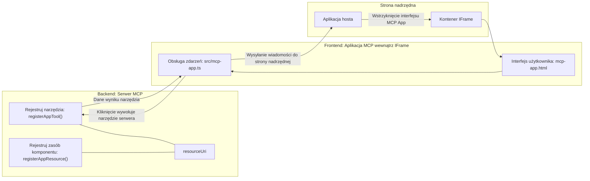

# Aplikacje MCP

Aplikacje MCP to nowy paradygmat w MCP. Idea polega na tym, że nie tylko zwracasz dane z wywołania narzędzia, ale także dostarczasz informacje o tym, jak z tymi danymi powinno się wchodzić w interakcję. Oznacza to, że wyniki narzędzi mogą teraz zawierać informacje UI. Ale dlaczego mielibyśmy tego chcieć? Cóż, zastanów się, jak działasz dzisiaj. Prawdopodobnie korzystasz z wyników serwera MCP, umieszczając przed nim jakiś frontend, to kod, który musisz napisać i utrzymywać. Czasami tego właśnie chcesz, ale czasami byłoby świetnie, gdybyś mógł po prostu wprowadzić fragment informacji, który jest samowystarczalny i zawiera wszystko, od danych po interfejs użytkownika.

## Przegląd

Ta lekcja dostarcza praktycznych wskazówek dotyczących aplikacji MCP, jak zacząć z nimi pracować i jak je integrować z istniejącymi aplikacjami webowymi. Aplikacje MCP to bardzo nowy dodatek do standardu MCP.

## Cele nauki

Po zakończeniu tej lekcji będziesz w stanie:

- Wyjaśnić, czym są aplikacje MCP.
- Kiedy stosować aplikacje MCP.
- Tworzyć i integrować własne aplikacje MCP.

## Aplikacje MCP – jak to działa

Idea aplikacji MCP polega na dostarczaniu odpowiedzi, która w zasadzie jest komponentem do renderowania. Taki komponent może mieć zarówno wizualizacje, jak i interaktywność, np. kliknięcia przycisków, dane wejściowe użytkownika i więcej. Zacznijmy od strony serwera i naszego serwera MCP. Aby stworzyć komponent aplikacji MCP, musisz stworzyć narzędzie, ale także zasób aplikacji. Te dwie części są połączone przez resourceUri.

Oto przykład. Spróbujmy zobrazować, co jest zaangażowane i które części co robią:

```text
server.ts -- responsible for registering tools and the component as a UI component
src/
  mcp-app.ts -- wiring up event handlers
mcp-app.html -- the user interface
```

Ten wizual opisuje architekturę tworzenia komponentu i jego logikę.


Spróbujmy teraz opisać odpowiedzialności odpowiednio dla backendu i frontendu.

### Backend

Musimy tu zrealizować dwie rzeczy:

- Rejestrację narzędzi, z którymi chcemy się komunikować.
- Definicję komponentu.

**Rejestracja narzędzia**

```typescript
registerAppTool(
    server,
    "get-time",
    {
      title: "Get Time",
      description: "Returns the current server time.",
      inputSchema: {},
      _meta: { ui: { resourceUri } }, // Łączy to narzędzie z jego zasobem interfejsu użytkownika
    },
    async () => {
      const time = new Date().toISOString();
      return { content: [{ type: "text", text: time }] };
    },
  );

```

Powyższy kod opisuje zachowanie, gdzie udostępnia narzędzie o nazwie `get-time`. Nie przyjmuje żadnych danych wejściowych, ale zwraca bieżący czas. Mamy możliwość zdefiniowania `inputSchema` dla narzędzi, które muszą przyjmować dane wejściowe od użytkownika.

**Rejestracja komponentu**

W tym samym pliku musimy także zarejestrować komponent:

```typescript
const resourceUri = "ui://get-time/mcp-app.html";

// Zarejestruj zasób, który zwraca połączony HTML/JavaScript dla interfejsu użytkownika.
registerAppResource(
  server,
  resourceUri,
  resourceUri,
  { mimeType: RESOURCE_MIME_TYPE },
  async () => {
    const html = await fs.readFile(path.join(DIST_DIR, "mcp-app.html"), "utf-8");

    return {
    contents: [
        { uri: resourceUri, mimeType: RESOURCE_MIME_TYPE, text: html },
    ],
    };
  },
);
```

Zwróć uwagę, jak wspominamy `resourceUri`, aby połączyć komponent z jego narzędziami. Interesujące jest również wywołanie zwrotne, gdzie ładujemy plik UI i zwracamy komponent.

### Frontend komponentu

Podobnie jak backend, tutaj mamy dwie części:

- Frontend napisany w czystym HTML.
- Kod obsługujący zdarzenia i co robić, np. wywołać narzędzia lub przesłać wiadomość do nadrzędnego okna.

**Interfejs użytkownika**

Przyjrzyjmy się interfejsowi użytkownika.

```html
<!-- mcp-app.html -->
<!DOCTYPE html>
<html lang="en">
  <head>
    <meta charset="UTF-8" />
    <title>Get Time App</title>
  </head>
  <body>
    <p>
      <strong>Server Time:</strong> <code id="server-time">Loading...</code>
    </p>
    <button id="get-time-btn">Get Server Time</button>
    <script type="module" src="/src/mcp-app.ts"></script>
  </body>
</html>
```

**Podłączanie zdarzeń**

Ostatnim elementem jest podłączenie zdarzeń. To znaczy, że wskazujemy, która część naszego UI wymaga obsługi zdarzeń i co robić, gdy zdarzenia zostaną wywołane:

```typescript
// mcp-app.ts

import { App } from "@modelcontextprotocol/ext-apps";

// Pobierz odniesienia do elementów
const serverTimeEl = document.getElementById("server-time")!;
const getTimeBtn = document.getElementById("get-time-btn")!;

// Utwórz instancję aplikacji
const app = new App({ name: "Get Time App", version: "1.0.0" });

// Obsłuż wyniki narzędzi z serwera. Ustaw przed `app.connect()`, aby uniknąć
// utraty początkowego wyniku narzędzia.
app.ontoolresult = (result) => {
  const time = result.content?.find((c) => c.type === "text")?.text;
  serverTimeEl.textContent = time ?? "[ERROR]";
};

// Podłącz kliknięcie przycisku
getTimeBtn.addEventListener("click", async () => {
  // `app.callServerTool()` pozwala interfejsowi żądać świeżych danych z serwera
  const result = await app.callServerTool({ name: "get-time", arguments: {} });
  const time = result.content?.find((c) => c.type === "text")?.text;
  serverTimeEl.textContent = time ?? "[ERROR]";
});

// Połącz się z hostem
app.connect();
```

Jak widać powyżej, jest to normalny kod do podłączania elementów DOM do zdarzeń. Warto zwrócić uwagę na wywołanie `callServerTool`, które wywołuje narzędzie po stronie backendu.

## Obsługa danych wejściowych użytkownika

Jak dotąd widzieliśmy komponent z przyciskiem, który po kliknięciu wywołuje narzędzie. Zobaczmy, czy możemy dodać więcej elementów UI, takich jak pole tekstowe, i czy możemy wysłać argumenty do narzędzia. Zaimplementujmy funkcjonalność FAQ. Oto, jak powinno to działać:

- Powinien być przycisk i element wejściowy, w którym użytkownik wpisuje słowo kluczowe do wyszukania, na przykład „Shipping” (Wysyłka). Powinno to wywołać narzędzie na backendzie, które przeszuka dane FAQ.
- Narzędzie obsługujące wspomniane wyszukiwanie FAQ.

Najpierw dodajmy potrzebne wsparcie do backendu:

```typescript
const faq: { [key: string]: string } = {
    "shipping": "Our standard shipping time is 3-5 business days.",
    "return policy": "You can return any item within 30 days of purchase.",
    "warranty": "All products come with a 1-year warranty covering manufacturing defects.",
  }

registerAppTool(
    server,
    "get-faq",
    {
      title: "Search FAQ",
      description: "Searches the FAQ for relevant answers.",
      inputSchema: zod.object({
        query: zod.string().default("shipping"),
      }),
      _meta: { ui: { resourceUri: faqResourceUri } }, // Łączy to narzędzie z jego zasobem interfejsu użytkownika
    },
    async ({ query }) => {
      const answer: string = faq[query.toLowerCase()] || "Sorry, I don't have an answer for that.";
      return { content: [{ type: "text", text: answer }] };
    },
  );
```

Widzimy tutaj, jak wypełniamy `inputSchema` i podajemy mu schemat `zod` w ten sposób:

```typescript
inputSchema: zod.object({
  query: zod.string().default("shipping"),
})
```

W powyższym schemacie deklarujemy, że mamy parametr wejściowy o nazwie `query`, który jest opcjonalny z domyślną wartością „shipping”.

Dobrze, przejdźmy do *mcp-app.html*, aby zobaczyć, jaki UI musimy stworzyć:

```html
<div class="faq">
    <h1>FAQ response</h1>
    <p>FAQ Response: <code id="faq-response">Loading...</code></p>
    <input type="text" id="faq-query" placeholder="Enter FAQ query" />
    <button id="get-faq-btn">Get FAQ Response</button>
  </div>
```

Świetnie, teraz mamy element wejściowy i przycisk. Przejdźmy teraz do *mcp-app.ts*, aby podłączyć te zdarzenia:

```typescript
const getFaqBtn = document.getElementById("get-faq-btn")!;
const faqQueryInput = document.getElementById("faq-query") as HTMLInputElement;

getFaqBtn.addEventListener("click", async () => {
  const query = faqQueryInput.value;
  const result = await app.callServerTool({ name: "get-faq", arguments: { query } });
  const faq = result.content?.find((c) => c.type === "text")?.text;
  faqResponseEl.textContent = faq ?? "[ERROR]";
});
```

W powyższym kodzie:

- Tworzymy referencje do interaktywnych elementów UI.
- Obsługujemy kliknięcie przycisku, aby pobrać wartość elementu wejściowego oraz wywołać `app.callServerTool()` z `name` i `arguments`, gdzie w argumentach przekazujemy wartość `query`.

W rzeczywistości wywołanie `callServerTool` wysyła wiadomość do nadrzędnego okna, które następnie wywołuje serwer MCP.

### Wypróbuj

Wypróbowując to, powinniśmy teraz zobaczyć następujące:


A oto przykład z wpisanym tekstem „warranty” (gwarancja):


Aby uruchomić ten kod, przejdź do [sekcji Kod](./code/README.md)

## Testowanie w Visual Studio Code

Visual Studio Code ma świetne wsparcie dla aplikacji MCP i prawdopodobnie jest jednym z najprostszych sposobów testowania aplikacji MCP. Aby użyć Visual Studio Code, dodaj wpis serwera do *mcp.json* w ten sposób:

```json
"my-mcp-server-7178eca7": {
    "url": "http://localhost:3001/mcp",
    "type": "http"
  }
```

Następnie uruchom serwer, powinieneś być w stanie komunikować się z aplikacją MCP przez okno rozmowy, pod warunkiem, że masz zainstalowanego GitHub Copilot.

Możesz wywołać to za pomocą prompta, na przykład "#get-faq":


I tak jak w przeglądarce, renderuje się to w ten sam sposób:


## Zadanie

Stwórz grę Papier-Kamień-Nożyce. Powinna składać się z następujących elementów:

UI:

- lista rozwijana z opcjami
- przycisk do zatwierdzenia wyboru
- etykieta pokazująca, kto co wybrał i kto wygrał

Serwer:

- powinien mieć narzędzie papier-kamień-nożyce, które przyjmuje "choice" jako wejście. Powinno także wygenerować wybór komputera i określić zwycięzcę.

## Rozwiązanie

[Rozwiązanie](./assignment/README.md)

## Podsumowanie

Poznaliśmy ten nowy paradygmat aplikacji MCP. To nowy paradygmat, który pozwala serwerom MCP mieć zdanie nie tylko o danych, ale także o tym, jak te dane powinny być prezentowane.

Dodatkowo, dowiedzieliśmy się, że aplikacje MCP są osadzane w IFrame i aby komunikować się z serwerami MCP, muszą wysyłać wiadomości do nadrzędnej aplikacji webowej. Istnieje kilka bibliotek dla czystego JavaScript i React oraz innych, które ułatwiają tę komunikację.

## Kluczowe wnioski

Oto, czego się nauczyłeś:

- Aplikacje MCP to nowy standard, który może być przydatny, gdy chcesz dostarczyć zarówno dane, jak i funkcje UI.
- Tego typu aplikacje działają w IFrame ze względów bezpieczeństwa.

## Co dalej

- [Rozdział 4](../../04-PracticalImplementation/README.md)

---

<!-- CO-OP TRANSLATOR DISCLAIMER START -->
**Zastrzeżenie**:  
Niniejszy dokument został przetłumaczony przy użyciu usługi tłumaczeń AI [Co-op Translator](https://github.com/Azure/co-op-translator). Chociaż dokładamy starań, aby tłumaczenie było precyzyjne, prosimy pamiętać, że automatyczne tłumaczenia mogą zawierać błędy lub nieścisłości. Oryginalny dokument w języku źródłowym powinien być uznawany za źródło autorytatywne. W przypadku informacji krytycznych zalecane jest skorzystanie z profesjonalnego tłumaczenia wykonanego przez człowieka. Nie ponosimy odpowiedzialności za jakiekolwiek nieporozumienia lub błędne interpretacje wynikające z użycia tego tłumaczenia.
<!-- CO-OP TRANSLATOR DISCLAIMER END -->