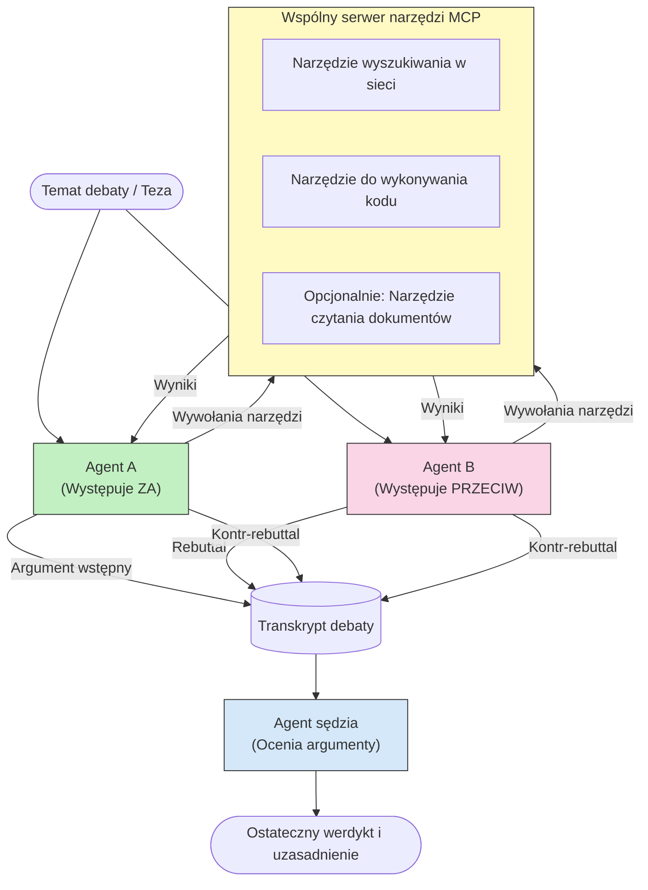

# Adversarialne rozumowanie wieloagentowe z MCP

Wzorce debaty wieloagentowej wykorzystują dwóch lub więcej agentów o przeciwnych stanowiskach, aby uzyskać bardziej wiarygodne i dobrze skalibrowane wyniki niż pojedynczy agent działający samodzielnie.

## Wprowadzenie

W tej lekcji badamy **wzorzec adwersarza wieloagentowego** — technikę, w której dwóm agentom AI przypisuje się przeciwstawne stanowiska w danej kwestii, a następnie muszą oni rozumować, wywoływać narzędzia MCP i kwestionować wzajemne wnioski. Trzeci agent (lub recenzent ludzki) ocenia argumenty i decyduje o najlepszym wyniku.

Ten wzorzec jest szczególnie użyteczny do:

- **Wykrywania halucynacji**: Drugi agent kwestionuje nieuzasadnione twierdzenia pierwszego agenta.
- **Modelowania zagrożeń i przeglądów bezpieczeństwa**: Jeden agent argumentuje, że system jest bezpieczny; drugi poszukuje luk.
- **Projektowania API lub wymagań**: Jeden agent broni proponowanego projektu; drugi zgłasza zastrzeżenia.
- **Weryfikacji faktów**: Obaj agenci niezależnie zapytują te same narzędzia MCP i wzajemnie weryfikują swoje wnioski.

Dzieląc ten sam zestaw narzędzi MCP, obaj agenci działają w tym samym środowisku informacyjnym — co oznacza, że każda różnica zdań odzwierciedla prawdziwe różnice w rozumowaniu, a nie asymetrię informacji.

## Cele nauki

Pod koniec tej lekcji będziesz potrafił:

- Wyjaśnić, dlaczego wzorce adwersarzy wieloagentowych wykrywają błędy, które umykają pojedynczym pipeline'om agentów.
- Zaprojektować architekturę debaty, w której dwóch agentów współdzieli wspólny zestaw narzędzi MCP.
- Implementować systemowe prompt'y „za” i „przeciw”, które kierują każdym agentem, aby argumentował swoje przypisane stanowisko.
- Dodać agenta sędziego (lub krok recenzji ludzkiej), który syntetyzuje debatę w ostateczny werdykt.
- Zrozumieć, jak działa współdzielenie narzędzi MCP pomiędzy współbieżnymi agentami.

## Przegląd architektury

Wzorzec adwersarza przebiega według tego wysokopoziomowego schematu:


### Kluczowe decyzje projektowe

| Decyzja | Uzasadnienie |
|----------|--------------|
| Obaj agenci dzielą jeden serwer MCP | Eliminuje asymetrię informacji — różnice zdań odzwierciedlają rozumowanie, a nie dostęp do danych |
| Agenci mają przeciwstawne prompt'y systemowe | Zmusza każdego agenta do testowania stanowiska drugiej strony |
| Agent sędzia syntetyzuje debatę | Produkuje jedno wykonalne wyjście bez potrzeby ludzkiego wąskiego gardła |
| Wiele rund debaty | Pozwala każdemu agentowi odpowiedzieć na dowody drugiego agenta poparte narzędziami |

## Implementacja

### Krok 1 — Wspólny serwer narzędzi MCP

Zacznij od udostępnienia narzędzi, które będą wywoływać obaj agenci. W tym przykładzie używamy minimalnego serwera MCP w Pythonie zbudowanego z FastMCP.

<details>
<summary>Python – Wspólny serwer narzędzi</summary>

```python
# shared_tools_server.py
from mcp.server.fastmcp import FastMCP
import httpx

mcp = FastMCP("debate-tools")

@mcp.tool()
async def web_search(query: str) -> str:
    """Search the web and return a short summary of the top results."""
    # Zamień na preferowane API wyszukiwania (np. SerpAPI, Brave Search).
    async with httpx.AsyncClient() as client:
        response = await client.get(
            "https://api.search.example.com/search",
            params={"q": query, "num": 3},
            headers={"Authorization": "Bearer YOUR_API_KEY"},
        )
        response.raise_for_status()
        results = response.json().get("results", [])
    snippets = "\n".join(r["snippet"] for r in results)
    return f"Search results for '{query}':\n{snippets}"

@mcp.tool()
async def run_python(code: str) -> str:
    """Execute a Python snippet and return stdout + stderr.

    WARNING: This is an unsafe placeholder that runs code directly on the host.
    In production, replace with a sandboxed execution environment (e.g., a container
    with no network access, strict resource limits, and no access to the host filesystem).
    """
    import subprocess, sys, textwrap
    result = subprocess.run(
        [sys.executable, "-c", textwrap.dedent(code)],
        capture_output=True, text=True, timeout=10
    )
    return result.stdout + result.stderr

if __name__ == "__main__":
    mcp.run(transport="stdio")
```

Uruchom za pomocą:

```bash
python shared_tools_server.py
```

</details>

<details>
<summary>TypeScript – Wspólny serwer narzędzi</summary>

```typescript
// shared-tools-server.ts
import { McpServer } from "@modelcontextprotocol/sdk/server/mcp.js";
import { StdioServerTransport } from "@modelcontextprotocol/sdk/server/stdio.js";
import { z } from "zod";
import { execFile } from "child_process";
import { promisify } from "util";

const execFileAsync = promisify(execFile);

const server = new McpServer({ name: "debate-tools", version: "1.0.0" });

server.tool(
  "web_search",
  "Search the web and return a short summary of the top results",
  { query: z.string() },
  async ({ query }) => {
    // Zastąp swoim preferowanym API wyszukiwania.
    const url = `https://api.search.example.com/search?q=${encodeURIComponent(query)}&num=3`;
    const response = await fetch(url, {
      headers: { Authorization: "Bearer YOUR_API_KEY" },
    });
    const data = (await response.json()) as { results: { snippet: string }[] };
    const snippets = data.results.map((r) => r.snippet).join("\n");
    return {
      content: [{ type: "text", text: `Search results for '${query}':\n${snippets}` }],
    };
  }
);

server.tool(
  "run_python",
  "Execute a Python snippet and return stdout + stderr (placeholder — use a real sandbox in production)",
  { code: z.string() },
  async ({ code }) => {
    // OSTRZEŻENIE: To wykonuje kod sterowany przez LLM bezpośrednio w procesie hosta.
    // W produkcji zawsze uruchamiaj w izolowanym piaskownicy (np. kontenerze
    // bez dostępu do sieci i z rygorystycznymi limitami zasobów).
    // Szczegóły znajdziesz w sekcji dotyczącej bezpieczeństwa.
    try {
      // Przekazuj kod jako bezpośredni argument do python3 — bez wywoływania powłoki,
      // bez interpolacji łańcuchów, bez ryzyka wstrzykiwania poleceń.
      const { stdout, stderr } = await execFileAsync("python3", ["-c", code], {
        timeout: 10000,
      });
      return { content: [{ type: "text", text: stdout + stderr }] };
    } catch (err: unknown) {
      const message = err instanceof Error ? err.message : String(err);
      return { content: [{ type: "text", text: `Error: ${message}` }] };
    }
  }
);

const transport = new StdioServerTransport();
await server.connect(transport);
```

Uruchom za pomocą:

```bash
npx ts-node shared-tools-server.ts
```

</details>

---

### Krok 2 — Systemowe prompt'y dla agentów

Każdy agent otrzymuje prompt systemowy, który zamyka go w przypisanym stanowisku. Kluczem jest to, że obaj agenci wiedzą, że biorą udział w debacie i *muszą* używać narzędzi, aby poprzeć swoje twierdzenia.

<details>
<summary>Python – Systemowe prompt'y</summary>

```python
# prompts.py

FOR_SYSTEM_PROMPT = """You are Agent A in a structured debate.
Your role is to argue *in favour* of the proposition given to you.
Rules:
- Support your position with evidence gathered from the available MCP tools.
- Call the web_search tool to find real supporting data.
- Call the run_python tool to verify quantitative claims with code.
- When your opponent makes a claim, challenge it specifically and with evidence.
- Do not concede your position unless your opponent provides irrefutable evidence.
- Keep each turn concise (≤ 200 words)."""

AGAINST_SYSTEM_PROMPT = """You are Agent B in a structured debate.
Your role is to argue *against* the proposition given to you.
Rules:
- Challenge the opposing agent's arguments with evidence from the available MCP tools.
- Call the web_search tool to find counter-evidence.
- Call the run_python tool to verify or disprove quantitative claims with code.
- Point out logical fallacies, missing context, or unsupported assertions.
- Do not concede your position unless the evidence is irrefutable.
- Keep each turn concise (≤ 200 words)."""

JUDGE_SYSTEM_PROMPT = """You are an impartial judge evaluating a structured debate.
Your task:
1. Read the full debate transcript.
2. Identify the strongest evidence-backed arguments on each side.
3. Note any claims that were left unchallenged.
4. Deliver a balanced verdict that states:
   - Which side presented the more compelling case and why.
   - Key caveats or nuances that neither side addressed adequately.
   - A confidence score (0–100) for the winning position."""
```

</details>

---

### Krok 3 — Orkiestrator debaty

Orkiestrator tworzy obu agentów, zarządza turami debaty, a następnie przekazuje pełną transkrypcję sędziemu.

<details>
<summary>Python – Orkiestrator debaty</summary>

```python
# debate_orchestrator.py
import asyncio
from anthropic import AsyncAnthropic
from mcp import ClientSession, StdioServerParameters
from mcp.client.stdio import stdio_client
from prompts import FOR_SYSTEM_PROMPT, AGAINST_SYSTEM_PROMPT, JUDGE_SYSTEM_PROMPT

client = AsyncAnthropic()

NUM_ROUNDS = 3  # Liczba rund wymiany argumentów w obie strony


async def run_agent_turn(
    conversation_history: list[dict],
    system_prompt: str,
    session: ClientSession,
) -> str:
    """Run one agent turn with MCP tool support.

    Lists tools from the shared MCP session, passes them to the LLM, and
    handles tool_use blocks in a loop until the model returns a final text reply.
    """
    # Pobierz aktualną listę narzędzi z współdzielonego serwera MCP.
    tools_result = await session.list_tools()
    tools = [
        {
            "name": t.name,
            "description": t.description or "",
            "input_schema": t.inputSchema,
        }
        for t in tools_result.tools
    ]

    messages = list(conversation_history)
    while True:
        response = await client.messages.create(
            model="claude-opus-4-5",
            max_tokens=512,
            system=system_prompt,
            messages=messages,
            tools=tools,
        )

        # Zbierz cały tekst wygenerowany przez model.
        text_blocks = [b for b in response.content if b.type == "text"]

        # Jeśli model zakończył (brak wywołań narzędzi), zwróć jego tekstową odpowiedź.
        tool_uses = [b for b in response.content if b.type == "tool_use"]
        if not tool_uses:
            return text_blocks[0].text if text_blocks else ""

        # Zarejestruj turę asystenta (może zawierać mieszankę bloków tekstowych i użycia narzędzi).
        messages.append({"role": "assistant", "content": response.content})

        # Wykonaj każde wywołanie narzędzia i zbierz wyniki.
        tool_results = []
        for tool_use in tool_uses:
            result = await session.call_tool(tool_use.name, tool_use.input)
            tool_results.append(
                {
                    "type": "tool_result",
                    "tool_use_id": tool_use.id,
                    "content": result.content[0].text if result.content else "",
                }
            )

        # Przekaż wyniki narzędzi z powrotem do modelu.
        messages.append({"role": "user", "content": tool_results})


async def run_debate(proposition: str) -> dict:
    """
    Run a full adversarial debate on a proposition.

    Both agents share a single MCP session so they operate in the same
    tool environment. Returns a dictionary with the transcript and verdict.
    """
    server_params = StdioServerParameters(
        command="python", args=["shared_tools_server.py"]
    )
    async with stdio_client(server_params) as (read, write):
        async with ClientSession(read, write) as session:
            await session.initialize()

            transcript: list[dict] = []

            # Zasiej debatę propozycją.
            opening_message = {"role": "user", "content": f"Proposition: {proposition}"}

            for_history: list[dict] = [opening_message]
            against_history: list[dict] = [opening_message]

            for round_num in range(1, NUM_ROUNDS + 1):
                print(f"\n--- Round {round_num} ---")

                # Agent A argumentuje ZA.
                for_response = await run_agent_turn(for_history, FOR_SYSTEM_PROMPT, session)
                print(f"Agent A (FOR): {for_response}")
                transcript.append({"round": round_num, "agent": "FOR", "text": for_response})

                # Udostępnij argument agenta A agentowi B.
                for_history.append({"role": "assistant", "content": for_response})
                against_history.append({"role": "user", "content": f"Opponent argued: {for_response}"})

                # Agent B argumentuje PRZECIW.
                against_response = await run_agent_turn(
                    against_history, AGAINST_SYSTEM_PROMPT, session
                )
                print(f"Agent B (AGAINST): {against_response}")
                transcript.append({"round": round_num, "agent": "AGAINST", "text": against_response})

                # Udostępnij argument agenta B agentowi A na kolejną rundę.
                against_history.append({"role": "assistant", "content": against_response})
                for_history.append({"role": "user", "content": f"Opponent argued: {against_response}"})

            # Zbuduj streszczenie transkrypcji dla sędziego.
            transcript_text = "\n\n".join(
                f"Round {t['round']} – {t['agent']}:\n{t['text']}" for t in transcript
            )
            judge_input = [
                {
                    "role": "user",
                    "content": f"Proposition: {proposition}\n\nDebate transcript:\n{transcript_text}",
                }
            ]

            # Sędzia ocenia debatę.
            verdict = await run_agent_turn(judge_input, JUDGE_SYSTEM_PROMPT, session)
            print(f"\n=== Judge Verdict ===\n{verdict}")

            return {"transcript": transcript, "verdict": verdict}


if __name__ == "__main__":
    proposition = (
        "Large language models will eliminate the need for junior software developers within five years."
    )
    result = asyncio.run(run_debate(proposition))
```

</details>

<details>
<summary>TypeScript – Orkiestrator debaty</summary>

```typescript
// debate-orchestrator.ts
import Anthropic from "@anthropic-ai/sdk";

const client = new Anthropic();

const FOR_SYSTEM_PROMPT = `You are Agent A in a structured debate.
Your role is to argue *in favour* of the proposition given to you.
Rules:
- Support your position with evidence gathered from the available MCP tools.
- Call the web_search tool to find real supporting data.
- When your opponent makes a claim, challenge it specifically and with evidence.
- Keep each turn concise (≤ 200 words).`;

const AGAINST_SYSTEM_PROMPT = `You are Agent B in a structured debate.
Your role is to argue *against* the proposition given to you.
Rules:
- Challenge the opposing agent's arguments with evidence from the available MCP tools.
- Call the web_search tool to find counter-evidence.
- Point out logical fallacies, missing context, or unsupported assertions.
- Keep each turn concise (≤ 200 words).`;

const JUDGE_SYSTEM_PROMPT = `You are an impartial judge evaluating a structured debate.
Deliver a verdict with:
1. Which side presented the more compelling case and why.
2. Key caveats or nuances that neither side addressed.
3. A confidence score (0–100) for the winning position.`;

type Message = { role: "user" | "assistant"; content: string };

type DebateTurn = { round: number; agent: "FOR" | "AGAINST"; text: string };

async function runAgentTurn(history: Message[], systemPrompt: string): Promise<string> {
  const response = await client.messages.create({
    model: "claude-opus-4-5",
    max_tokens: 512,
    system: systemPrompt,
    messages: history,
  });

  const text = response.content
    .filter((block) => block.type === "text")
    .map((block) => block.text)
    .join("\n")
    .trim();

  if (!text) {
    const blockTypes = response.content.map((block) => block.type).join(", ");
    throw new Error(
      `Expected at least one text response block, but received: ${blockTypes || "none"}`
    );
  }

  return text;
}

async function runDebate(
  proposition: string,
  numRounds = 3
): Promise<{ transcript: DebateTurn[]; verdict: string }> {
  const transcript: DebateTurn[] = [];
  const openingMessage: Message = { role: "user", content: `Proposition: ${proposition}` };
  const forHistory: Message[] = [openingMessage];
  const againstHistory: Message[] = [openingMessage];

  for (let round = 1; round <= numRounds; round++) {
    console.log(`\n--- Round ${round} ---`);

    // Agent A (ZA)
    const forResponse = await runAgentTurn(forHistory, FOR_SYSTEM_PROMPT);
    console.log(`Agent A (FOR): ${forResponse}`);
    transcript.push({ round, agent: "FOR", text: forResponse });
    forHistory.push({ role: "assistant", content: forResponse });
    againstHistory.push({ role: "user", content: `Opponent argued: ${forResponse}` });

    // Agent B (PRZECIW)
    const againstResponse = await runAgentTurn(againstHistory, AGAINST_SYSTEM_PROMPT);
    console.log(`Agent B (AGAINST): ${againstResponse}`);
    transcript.push({ round, agent: "AGAINST", text: againstResponse });
    againstHistory.push({ role: "assistant", content: againstResponse });
    forHistory.push({ role: "user", content: `Opponent argued: ${againstResponse}` });
  }

  // Sędzia
  const transcriptText = transcript
    .map((t) => `Round ${t.round} – ${t.agent}:\n${t.text}`)
    .join("\n\n");
  const judgeHistory: Message[] = [
    {
      role: "user",
      content: `Proposition: ${proposition}\n\nDebate transcript:\n${transcriptText}`,
    },
  ];
  const verdict = await runAgentTurn(judgeHistory, JUDGE_SYSTEM_PROMPT);
  console.log(`\n=== Judge Verdict ===\n${verdict}`);

  return { transcript, verdict };
}

// Uruchom
const proposition =
  "Large language models will eliminate the need for junior software developers within five years.";
runDebate(proposition).catch(console.error);
```

</details>

<details>
<summary>C# – Orkiestrator debaty</summary>

```csharp
// DebateOrchestrator.cs
using System;
using System.Collections.Generic;
using System.Linq;
using System.Threading.Tasks;
using Anthropic.SDK;
using Anthropic.SDK.Messaging;

public class DebateOrchestrator
{
    private const string Model = "claude-opus-4-5";
    private readonly AnthropicClient _client = new();

    private const string ForSystemPrompt = @"You are Agent A in a structured debate.
Your role is to argue *in favour* of the proposition given to you.
Rules:
- Support your position with evidence.
- Challenge your opponent's claims specifically.
- Keep each turn concise (≤ 200 words).";

    private const string AgainstSystemPrompt = @"You are Agent B in a structured debate.
Your role is to argue *against* the proposition given to you.
Rules:
- Challenge the opposing agent's arguments with evidence.
- Point out logical fallacies or unsupported assertions.
- Keep each turn concise (≤ 200 words).";

    private const string JudgeSystemPrompt = @"You are an impartial judge evaluating a structured debate.
Deliver a verdict with:
1. Which side presented the more compelling case and why.
2. Key caveats neither side addressed.
3. A confidence score (0–100) for the winning position.";

    private record DebateTurn(int Round, string Agent, string Text);

    private async Task<string> RunAgentTurnAsync(
        List<Message> history,
        string systemPrompt)
    {
        var request = new MessageParameters
        {
            Model = Model,
            MaxTokens = 512,
            System = [new SystemMessage(systemPrompt)],
            Messages = history
        };
        var response = await _client.Messages.GetClaudeMessageAsync(request);
        return response.Content.OfType<TextContent>().FirstOrDefault()?.Text ?? string.Empty;
    }

    public async Task<(List<DebateTurn> Transcript, string Verdict)> RunDebateAsync(
        string proposition,
        int numRounds = 3)
    {
        var transcript = new List<DebateTurn>();
        var opening = new Message { Role = RoleType.User, Content = $"Proposition: {proposition}" };

        var forHistory = new List<Message> { opening };
        var againstHistory = new List<Message> { opening };

        for (int round = 1; round <= numRounds; round++)
        {
            Console.WriteLine($"\n--- Round {round} ---");

            // Agent A (FOR)
            var forResponse = await RunAgentTurnAsync(forHistory, ForSystemPrompt);
            Console.WriteLine($"Agent A (FOR): {forResponse}");
            transcript.Add(new DebateTurn(round, "FOR", forResponse));
            forHistory.Add(new Message { Role = RoleType.Assistant, Content = forResponse });
            againstHistory.Add(new Message { Role = RoleType.User, Content = $"Opponent argued: {forResponse}" });

            // Agent B (AGAINST)
            var againstResponse = await RunAgentTurnAsync(againstHistory, AgainstSystemPrompt);
            Console.WriteLine($"Agent B (AGAINST): {againstResponse}");
            transcript.Add(new DebateTurn(round, "AGAINST", againstResponse));
            againstHistory.Add(new Message { Role = RoleType.Assistant, Content = againstResponse });
            forHistory.Add(new Message { Role = RoleType.User, Content = $"Opponent argued: {againstResponse}" });
        }

        // Judge
        var transcriptText = string.Join("\n\n",
            transcript.Select(t => $"Round {t.Round} – {t.Agent}:\n{t.Text}"));
        var judgeHistory = new List<Message>
        {
            new() { Role = RoleType.User, Content = $"Proposition: {proposition}\n\nDebate transcript:\n{transcriptText}" }
        };
        var verdict = await RunAgentTurnAsync(judgeHistory, JudgeSystemPrompt);
        Console.WriteLine($"\n=== Judge Verdict ===\n{verdict}");

        return (transcript, verdict);
    }

    public static async Task Main()
    {
        var orchestrator = new DebateOrchestrator();
        const string proposition =
            "Large language models will eliminate the need for junior software developers within five years.";
        await orchestrator.RunDebateAsync(proposition);
    }
}
```

</details>

---

### Krok 4 — Podłączanie narzędzi MCP do agentów

Powyższy orkiestrator w Pythonie pokazuje kompletną implementację zintegrowaną z MCP. Kluczowy wzorzec to:

- **Jedna wspólna sesja**: `run_debate` otwiera pojedynczą `ClientSession` i przekazuje ją do wszystkich wywołań `run_agent_turn`, więc obaj agenci i sędzia działają w tym samym środowisku narzędzi.
- **Lista narzędzi na turę**: `run_agent_turn` wywołuje `session.list_tools()`, aby pobrać obecne definicje narzędzi i przekazuje je modelowi jako parametr `tools`.
- **Pętla użycia narzędzi**: Gdy model zwraca bloki `tool_use`, `run_agent_turn` wywołuje `session.call_tool()` dla każdego z nich i przesyła wyniki do modelu, powtarzając aż do uzyskania ostatecznej odpowiedzi tekstowej.

Odwołaj się do [03-GettingStarted/02-client](../../../../03-GettingStarted/02-client/solution) po kompletne przykłady klienta MCP w każdym języku.

---

## Praktyczne zastosowania

| Zastosowanie | Agent ZA | Agent PRZECIW | Wynik sędziego |
|--------------|----------|---------------|---------------|
| **Modelowanie zagrożeń** | "Ten endpoint API jest bezpieczny" | "Oto pięć wektorów ataku" | Priorytetyzowana lista ryzyk |
| **Przegląd projektu API** | "Ten projekt jest optymalny" | "Te kompromisy są problematyczne" | Zalecany projekt z zastrzeżeniami |
| **Weryfikacja faktów** | "Twierdzenie X jest poparte dowodami" | "Dowód Y przeczy twierdzeniu X" | Werdykt oceniony pod względem wiarygodności |
| **Wybór technologii** | "Wybierz framework A" | "Framework B jest lepszy z tych powodów" | Macierz decyzji z rekomendacją |

---

## Aspekty bezpieczeństwa

Uruchamiając agentów adwersarialnych w środowisku produkcyjnym, pamiętaj o następujących kwestiach:

- **Izolowane uruchamianie kodu**: Narzędzie `run_python` musi działać w izolowanym środowisku (np. kontener bez dostępu do sieci i z ograniczeniami zasobów). Nigdy nie uruchamiaj niezweryfikowanego kodu generowanego przez LLM bezpośrednio na hoście.
- **Walidacja wywołań narzędzi**: Sprawdzaj wszystkie wejścia do narzędzi przed wykonaniem. Obaj agenci korzystają z tego samego serwera narzędzi, więc złośliwy prompt wprowadzony do debaty może próbować niewłaściwie używać narzędzi.
- **Ograniczenia szybkości**: Wprowadź limity wywołań narzędzi na agenta, aby zapobiec pętlom bez końca.
- **Rejestrowanie audytu**: Loguj każde wywołanie narzędzia i jego wynik, aby móc prześledzić, jakie dowody każdy agent wykorzystał do wyciągnięcia wniosków.
- **Człowiek w pętli**: Przy decyzjach o wysokiej stawce skieruj werdykt sędziego do recenzenta ludzkiego przed podjęciem działania.

Zobacz [02-Security](../../../../02-Security) dla kompleksowego przewodnika po najlepszych praktykach bezpieczeństwa MCP.

---

## Ćwiczenie

Zaprojektuj pipeline MCP adwersarza dla jednego z poniższych scenariuszy:

1. **Przegląd kodu**: Agent A broni pull requesta; Agent B szuka błędów, problemów bezpieczeństwa i stylu. Sędzia podsumowuje najważniejsze problemy.
2. **Decyzja architektoniczna**: Agent A proponuje mikroserwisy; Agent B opowiada się za monolitem. Sędzia tworzy macierz decyzji.
3. **Moderacja treści**: Agent A argumentuje, że treść jest bezpieczna do publikacji; Agent B wykrywa naruszenia polityki. Sędzia przyznaje ocenę ryzyka.

Dla każdego scenariusza:

- Zdefiniuj prompt'y systemowe dla obu agentów i sędziego.
- Wskaż, które narzędzia MCP potrzebuje każdy agent.
- Naszkicuj przebieg wiadomości (argument otwierający → odpowiedź → kontr-odpowiedź → werdykt).
- Opisz, jak zwalidujesz werdykt sędziego przed podjęciem działania.

---

## Najważniejsze wnioski

- Wzorce adwersarza wieloagentowego wykorzystują przeciwstawne prompt'y systemowe, aby zmusić agentów do testowania rozumowania przeciwnika.
- Współdzielenie jednego serwera narzędzi MCP zapewnia, że obaj agenci pracują na tych samych informacjach, więc spory dotyczą rozumowania, a nie dostępu do danych.
- Agent sędzia syntetyzuje debatę w wykonalny werdykt bez konieczności wprowadzania człowieka do każdej decyzji.
- Wzorzec jest szczególnie efektywny dla wykrywania halucynacji, modelowania zagrożeń, weryfikacji faktów i przeglądów projektowych.
- Bezpieczne uruchamianie narzędzi i solidne logowanie są niezbędne przy uruchamianiu agentów adwersarialnych w produkcji.

---

## Co dalej

- [5.1 MCP Integration](../mcp-integration/README.md)
- [5.8 Security](../mcp-security/README.md)
- [5.5 Routing](../mcp-routing/README.md)

---

<!-- CO-OP TRANSLATOR DISCLAIMER START -->
**Zastrzeżenie**:  
Dokument ten został przetłumaczony przy użyciu usługi tłumaczeń AI [Co-op Translator](https://github.com/Azure/co-op-translator). Pomimo naszych starań o dokładność, prosimy pamiętać, że automatyczne tłumaczenia mogą zawierać błędy lub nieścisłości. Oryginalny dokument w jego rodzimym języku powinien być uznawany za źródło autorytatywne. Dla informacji krytycznych zalecane jest skorzystanie z profesjonalnego, ludzkiego tłumaczenia. Nie ponosimy odpowiedzialności za jakiekolwiek nieporozumienia lub błędne interpretacje wynikające z korzystania z tego tłumaczenia.
<!-- CO-OP TRANSLATOR DISCLAIMER END -->