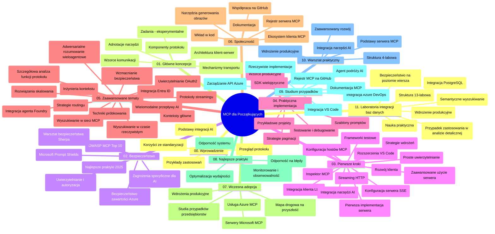

# Model Context Protocol (MCP) dla początkujących – przewodnik do nauki

Ten przewodnik do nauki zapewnia przegląd struktury i zawartości repozytorium dla kursu „Model Context Protocol (MCP) dla początkujących”. Użyj tego przewodnika, aby efektywnie poruszać się po repozytorium i w pełni wykorzystać dostępne zasoby.

## Przegląd repozytorium

Model Context Protocol (MCP) to ustandaryzowany framework do interakcji między modelami AI a aplikacjami klienckimi. Pierwotnie stworzony przez Anthropic, MCP jest obecnie utrzymywany przez szerszą społeczność MCP za pośrednictwem oficjalnej organizacji GitHub. To repozytorium zapewnia kompleksowy program nauczania z praktycznymi przykładami kodu w C#, Javie, JavaScript, Python oraz TypeScript, przeznaczony dla deweloperów AI, architektów systemów i inżynierów oprogramowania.

## Wizualna mapa programu nauczania

## Struktura repozytorium

Repozytorium jest podzielone na jedenaście głównych sekcji, z których każda koncentruje się na innych aspektach MCP:

1. **Wprowadzenie (00-Introduction/)**
   - Przegląd Model Context Protocol
   - Dlaczego standaryzacja ma znaczenie w pipeline’ach AI
   - Praktyczne przypadki użycia i korzyści

2. **Podstawowe koncepcje (01-CoreConcepts/)**
   - Architektura klient-serwer
   - Kluczowe elementy protokołu
   - Wzorce przesyłania wiadomości w MCP

3. **Bezpieczeństwo (02-Security/)**
   - Zagrożenia bezpieczeństwa w systemach opartych na MCP
   - Najlepsze praktyki zabezpieczania implementacji
   - Strategie uwierzytelniania i autoryzacji
   - **Kompleksowa dokumentacja bezpieczeństwa**:
     - MCP Security Best Practices 2025
     - Azure Content Safety Implementation Guide
     - MCP Security Controls and Techniques
     - MCP Best Practices Quick Reference
   - **Kluczowe zagadnienia bezpieczeństwa**:
     - Ataki wstrzykiwania promptów i zatruwania narzędzi
     - Przejęcie sesji i problemy z tzw. confused deputy
     - Luki w przekazywaniu tokenów
     - Nadmierne uprawnienia i kontrola dostępu
     - Bezpieczeństwo łańcucha dostaw dla komponentów AI
     - Integracja Microsoft Prompt Shields

4. **Pierwsze kroki (03-GettingStarted/)**
   - Konfiguracja środowiska i ustawienia
   - Tworzenie podstawowych serwerów i klientów MCP
   - Integracja z istniejącymi aplikacjami
   - Sekcje obejmujące:
     - Pierwsza implementacja serwera
     - Development klienta
     - Integracja klienta LLM
     - Integracja z VS Code
     - Serwer Server-Sent Events (SSE)
     - Zaawansowane użycie serwera
     - Strumieniowanie HTTP
     - Integracja z AI Toolkit
     - Strategie testowania
     - Wytyczne dotyczące wdrażania

5. **Praktyczna implementacja (04-PracticalImplementation/)**
   - Używanie SDK w różnych językach programowania
   - Techniki debugowania, testowania i walidacji
   - Tworzenie wielokrotnie używalnych szablonów promptów i workflowów
   - Przykładowe projekty z przykładami implementacji

6. **Zaawansowane tematy (05-AdvancedTopics/)**
   - Techniki inżynierii kontekstu
   - Integracja agenta Foundry
   - Wielomodalne workflow AI
   - Demonstracje uwierzytelniania OAuth2
   - Wyszukiwanie w czasie rzeczywistym
   - Strumieniowanie w czasie rzeczywistym
   - Implementacja root contexts
   - Strategie routingu
   - Techniki próbkowania
   - Podejścia do skalowania
   - Rozważania dotyczące bezpieczeństwa
   - Integracja zabezpieczeń Entra ID
   - Integracja wyszukiwania w sieci
   - Adwersarialne rozumowanie multi-agentowe (wzorce debat)

7. **Wkład społeczności (06-CommunityContributions/)**
   - Jak wnosić kod i dokumentację
   - Współpraca przez GitHub
   - Ulepszenia i opinie napędzane przez społeczność
   - Korzystanie z różnych klientów MCP (Claude Desktop, Cline, VSCode)
   - Praca z popularnymi serwerami MCP, w tym generowaniem obrazów

8. **Lekcje z wczesnej adopcji (07-LessonsfromEarlyAdoption/)**
   - Realne implementacje i historie sukcesu
   - Budowanie i wdrażanie rozwiązań opartych na MCP
   - Trendy i przyszła mapa drogowa
   - **Przewodnik po serwerach MCP Microsoft**: Kompleksowy przewodnik po 10 produkcyjnych serwerach MCP Microsoft, w tym:
     - Microsoft Learn Docs MCP Server
     - Azure MCP Server (15+ specjalizowanych konektorów)
     - GitHub MCP Server
     - Azure DevOps MCP Server
     - MarkItDown MCP Server
     - SQL Server MCP Server
     - Playwright MCP Server
     - Dev Box MCP Server
     - Azure AI Foundry MCP Server
     - Microsoft 365 Agents Toolkit MCP Server

9. **Najlepsze praktyki (08-BestPractices/)**
   - Strojenie wydajności i optymalizacja
   - Projektowanie odpornych na awarie systemów MCP
   - Strategie testowania i odporności

10. **Studia przypadków (09-CaseStudy/)**
    - **Siedem kompleksowych studiów przypadków** pokazujących wszechstronność MCP w różnych scenariuszach:
    - **Azure AI Travel Agents**: Orkiestracja multi-agentów z Azure OpenAI i AI Search
    - **Integracja Azure DevOps**: Automatyzacja procesów workflow z aktualizacjami danych YouTube
    - **Dokumentacja w czasie rzeczywistym**: Konsola klienta Python ze strumieniowaniem HTTP
    - **Interaktywny generator planu nauki**: Aplikacja webowa Chainlit z konwersacyjnym AI
    - **Dokumentacja w edytorze**: Integracja VS Code z workflowami GitHub Copilot
    - **Zarządzanie API w Azure**: Integracja korporacyjnego API z tworzeniem serwera MCP
    - **Rejestr MCP GitHub**: Rozwój ekosystemu i platforma integracji agentowej
    - Przykłady wdrożeń obejmujące integrację korporacyjną, produktywność deweloperów i rozwój ekosystemu

11. **Warsztat praktyczny (10-StreamliningAIWorkflowsBuildingAnMCPServerWithAIToolkit/)**
    - Kompleksowy warsztat praktyczny łączący MCP z AI Toolkit
    - Budowanie inteligentnych aplikacji łączących modele AI z narzędziami rzeczywistymi
    - Praktyczne moduły obejmujące podstawy, tworzenie niestandardowego serwera i strategie wdrożenia produkcyjnego
    - **Struktura labów**:
      - Lab 1: Podstawy serwera MCP
      - Lab 2: Zaawansowany development serwera MCP
      - Lab 3: Integracja AI Toolkit
      - Lab 4: Wdrożenie produkcyjne i skalowanie
    - Podejście oparte na laboratoriach z instrukcjami krok po kroku

12. **Laboratoria integracji bazy danych serwera MCP (11-MCPServerHandsOnLabs/)**
    - **Kompleksowa ścieżka nauki w 13 laboratoriach** dla budowy produkcyjnych serwerów MCP z integracją PostgreSQL
    - **Realistyczna implementacja analityki detalicznej** na przykładzie przypadku użycia Zava Retail
    - **Wzorce klasy korporacyjnej**, w tym Row Level Security (RLS), wyszukiwanie semantyczne i dostęp danych wielodostępnych
    - **Pełna struktura labów**:
      - **Laby 00-03: Podstawy** – Wprowadzenie, architektura, bezpieczeństwo, konfiguracja środowiska
      - **Laby 04-06: Budowa serwera MCP** – Projekt bazy danych, implementacja serwera MCP, rozwój narzędzi
      - **Laby 07-09: Funkcje zaawansowane** – Wyszukiwanie semantyczne, testowanie i debugowanie, integracja VS Code
      - **Laby 10-12: Produkcja i najlepsze praktyki** – Wdrożenie, monitorowanie, optymalizacja
    - **Technologie objęte**: framework FastMCP, PostgreSQL, Azure OpenAI, Azure Container Apps, Application Insights
    - **Efekty nauki**: Produkcyjne serwery MCP, wzorce integracji bazy danych, analityka AI, bezpieczeństwo korporacyjne

## Dodatkowe zasoby

Repozytorium zawiera zasoby wspierające:

- **Folder z obrazkami**: Zawiera diagramy i ilustracje używane w całym programie nauczania
- **Tłumaczenia**: Wsparcie wielojęzyczne z automatycznymi tłumaczeniami dokumentacji
- **Oficjalne zasoby MCP**:
  - [Dokumentacja MCP](https://modelcontextprotocol.io/)
  - [Specyfikacja MCP](https://spec.modelcontextprotocol.io/)
  - [Repozytorium MCP na GitHub](https://github.com/modelcontextprotocol)

## Jak korzystać z tego repozytorium

1. **Nauka sekwencyjna**: Przechodź przez rozdziały po kolei (od 00 do 11), aby uzyskać uporządkowane doświadczenie edukacyjne.
2. **Skupienie na konkretnym języku**: Jeśli interesuje Cię określony język programowania, eksploruj katalogi z przykładami w preferowanym języku.
3. **Praktyczna implementacja**: Zacznij od sekcji „Pierwsze kroki”, aby skonfigurować środowisko i stworzyć swój pierwszy serwer i klient MCP.
4. **Eksploracja zaawansowana**: Po opanowaniu podstaw zagłęb się w tematy zaawansowane, aby rozszerzyć swoją wiedzę.
5. **Zaangażowanie społeczności**: Dołącz do społeczności MCP poprzez dyskusje na GitHub i kanały Discord, aby łączyć się z ekspertami i innymi deweloperami.

## Klienci i narzędzia MCP

Program nauczania obejmuje różne klientów i narzędzia MCP:

1. **Oficjalni klienci**:
   - Visual Studio Code
   - MCP w Visual Studio Code
   - Claude Desktop
   - Claude w VSCode
   - Claude API

2. **Klienci społecznościowi**:
   - Cline (terminalowy)
   - Cursor (edytor kodu)
   - ChatMCP
   - Windsurf

3. **Narzędzia zarządzające MCP**:
   - MCP CLI
   - MCP Manager
   - MCP Linker
   - MCP Router

## Popularne serwery MCP

Repozytorium przedstawia różne serwery MCP, w tym:

1. **Oficjalne serwery MCP Microsoft**:
   - Microsoft Learn Docs MCP Server
   - Azure MCP Server (15+ specjalizowanych konektorów)
   - GitHub MCP Server
   - Azure DevOps MCP Server
   - MarkItDown MCP Server
   - SQL Server MCP Server
   - Playwright MCP Server
   - Dev Box MCP Server
   - Azure AI Foundry MCP Server
   - Microsoft 365 Agents Toolkit MCP Server

2. **Oficjalne serwery referencyjne**:
   - Filesystem
   - Fetch
   - Memory
   - Sequential Thinking

3. **Generowanie obrazów**:
   - Azure OpenAI DALL-E 3
   - Stable Diffusion WebUI
   - Replicate

4. **Narzędzia developerskie**:
   - Git MCP
   - Terminal Control
   - Code Assistant

5. **Serwery specjalizowane**:
   - Salesforce
   - Microsoft Teams
   - Jira & Confluence

## Wkład w repozytorium

To repozytorium zaprasza do wkładu społeczność. Zobacz sekcję Wkład społeczności, aby dowiedzieć się, jak skutecznie przyczyniać się do ekosystemu MCP.

----

*Ten przewodnik do nauki został ostatnio zaktualizowany 5 lutego 2026 roku, odzwierciedlając najnowszą Specyfikację MCP z 2025-11-25 i przedstawia stan repozytorium na ten dzień. Zawartość repozytorium może być aktualizowana po tej dacie.*

---

<!-- CO-OP TRANSLATOR DISCLAIMER START -->
**Zastrzeżenie**:  
Niniejszy dokument został przetłumaczony przy użyciu usługi tłumaczenia AI [Co-op Translator](https://github.com/Azure/co-op-translator). Pomimo naszych starań o dokładność, prosimy pamiętać, że automatyczne tłumaczenia mogą zawierać błędy lub nieścisłości. Oryginalny dokument w języku źródłowym powinien być uznany za wiarygodne źródło. W przypadku informacji krytycznych zaleca się skorzystanie z profesjonalnego tłumaczenia wykonanego przez człowieka. Nie ponosimy odpowiedzialności za jakiekolwiek nieporozumienia lub błędne interpretacje wynikające z użycia tego tłumaczenia.
<!-- CO-OP TRANSLATOR DISCLAIMER END -->