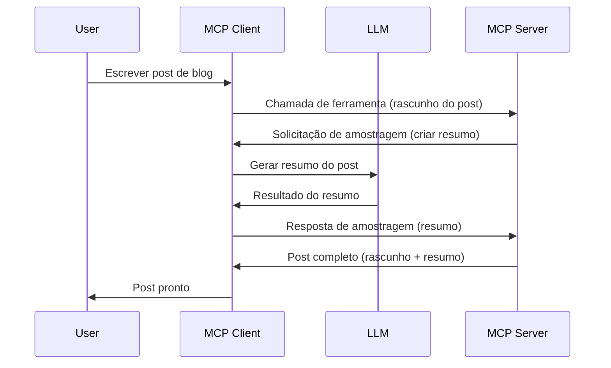

# Amostragem - delegar funcionalidades para o Cliente

Às vezes, você precisa que o Cliente MCP e o Servidor MCP colaborem para alcançar um objetivo comum. Pode haver um caso onde o Servidor requer a ajuda de um LLM que está no cliente. Para essa situação, amostragem é o que você deve usar.

Vamos explorar alguns casos de uso e como construir uma solução envolvendo amostragem.

## Visão Geral

Nesta lição, focamos em explicar quando e onde usar Amostragem e como configurá-la.

## Objetivos de Aprendizagem

Neste capítulo, iremos:

- Explicar o que é Amostragem e quando utilizá-la.
- Mostrar como configurar Amostragem no MCP.
- Fornecer exemplos de Amostragem em ação.

## O que é Amostragem e por que usá-la?

A Amostragem é um recurso avançado que funciona da seguinte forma:


### Solicitação de amostragem

Ok, agora que temos uma visão geral de um cenário plausível, vamos falar sobre a solicitação de amostragem que o servidor envia de volta para o cliente. Veja um exemplo de uma solicitação desse tipo no formato JSON-RPC:

```json
{
  "jsonrpc": "2.0",
  "id": 1,
  "method": "sampling/createMessage",
  "params": {
    "messages": [
      {
        "role": "user",
        "content": {
          "type": "text",
          "text": "Create a blog post summary of the following blog post: <BLOG POST>"
        }
      }
    ],
    "modelPreferences": {
      "hints": [
        {
          "name": "claude-3-sonnet"
        }
      ],
      "intelligencePriority": 0.8,
      "speedPriority": 0.5
    },
    "systemPrompt": "You are a helpful assistant.",
    "maxTokens": 100
  }
}
```

Há algumas coisas aqui que vale destacar:

- Prompt, sob content -> text, é nosso prompt que é uma instrução para o LLM resumir o conteúdo de um post de blog.

- **modelPreferences**. Esta seção é exatamente isso, uma preferência, uma recomendação de qual configuração usar com o LLM. O usuário pode optar por seguir essas recomendações ou alterá-las. Neste caso há recomendações sobre o modelo a usar e prioridade entre velocidade e inteligência.
- **systemPrompt**, este é seu prompt normal do sistema que dá personalidade ao seu LLM e contém instruções de orientação.
- **maxTokens**, esta é outra propriedade que indica quantos tokens são recomendados para usar nessa tarefa.

### Resposta de amostragem

Essa resposta é o que o Cliente MCP acaba enviando de volta para o Servidor MCP e é o resultado do cliente chamando o LLM, esperando essa resposta e então construindo essa mensagem. Veja como pode ser no formato JSON-RPC:

```json
{
  "jsonrpc": "2.0",
  "id": 1,
  "result": {
    "role": "assistant",
    "content": {
      "type": "text",
      "text": "Here's your abstract <ABSTRACT>"
    },
    "model": "gpt-5",
    "stopReason": "endTurn"
  }
}
```

Note como a resposta é um resumo do post do blog exatamente como pedimos. Também note que o `model` usado não é o que pedimos mas "gpt-5" ao invés de "claude-3-sonnet". Isso ilustra que o usuário pode mudar de ideia sobre o que usar e que sua solicitação de amostragem é uma recomendação.

Ok, agora que entendemos o fluxo principal, e a tarefa útil de usá-la para "criação de post de blog + resumo", vamos ver o que precisamos fazer para fazê-la funcionar.

### Tipos de mensagem

As mensagens de amostragem não se limitam apenas a texto, mas você também pode enviar imagens e áudio. Veja como o JSON-RPC fica diferente:

**Texto**

```json
{
  "type": "text",
  "text": "The message content"
}
```

**Conteúdo de imagem**

```json
{
  "type": "image",
  "data": "base64-encoded-image-data",
  "mimeType": "image/jpeg"
}
```

**Conteúdo de áudio**

```json
{
  "type": "audio",
  "data": "base64-encoded-audio-data",
  "mimeType": "audio/wav"
}
```

> NOTA: para informações mais detalhadas sobre Amostragem, confira a [documentação oficial](https://modelcontextprotocol.io/specification/2025-06-18/client/sampling)

## Como Configurar a Amostragem no Cliente

> Nota: se você está construindo apenas um servidor, não precisa fazer muita coisa aqui.

Em um cliente, você precisa especificar a seguinte funcionalidade assim:

```json
{
  "capabilities": {
    "sampling": {}
  }
}
```

Isso será então capturado quando seu cliente escolhido for inicializado com o servidor.

## Exemplo de Amostragem em Ação - Criar um Post de Blog

Vamos codificar juntos um servidor de amostragem, precisaremos fazer o seguinte:

1. Criar uma ferramenta no Servidor.
1. Essa ferramenta deve criar uma solicitação de amostragem.
1. A ferramenta deve esperar a resposta da solicitação de amostragem do cliente.
1. Então o resultado da ferramenta deve ser produzido.

Vamos ver o código passo a passo:

### -1- Criar a ferramenta

**python**

```python
@mcp.tool()
async def create_blog(title: str, content: str, ctx: Context[ServerSession, None]) -> str:
    """Create a blog post and generate a summary"""

```

### -2- Criar uma solicitação de amostragem

Estenda sua ferramenta com o seguinte código:

**python**

```python
post = BlogPost(
        id=len(posts) + 1,
        title=title,
        content=content,
        abstract=""
    )

prompt = f"Create an abstract of the following blog post: title: {title} and draft: {content} "

result = await ctx.session.create_message(
        messages=[
            SamplingMessage(
                role="user",
                content=TextContent(type="text", text=prompt),
            )
        ],
        max_tokens=100,
)

```

### -3- Esperar pela resposta e retornar a resposta

**python**

```python
post.abstract = result.content.text

posts.append(post)

# retorne o produto completo
return json.dumps({
    "id": post.title,
    "abstract": post.abstract
})
```

### -4- Código completo

**python**

```python
from starlette.applications import Starlette
from starlette.routing import Mount, Host

from mcp.server.fastmcp import Context, FastMCP

from mcp.server.session import ServerSession
from mcp.types import SamplingMessage, TextContent

import json


from uuid import uuid4
from typing import List
from pydantic import BaseModel


mcp = FastMCP("Blog post generator")

# app = FastAPI()

posts = []

class BlogPost(BaseModel):
    id: int
    title: str
    content: str
    abstract: str

posts: List[BlogPost] = []

@mcp.tool()
async def create_blog(title: str, content: str, ctx: Context[ServerSession, None]) -> str:
    """Create a blog post and generate a summary"""

    post = BlogPost(
        id=len(posts) + 1,
        title=title,
        content=content,
        abstract=""
    )

    prompt = f"Create an abstract of the following blog post: title: {title} and draft: {content} "

    result = await ctx.session.create_message(
        messages=[
            SamplingMessage(
                role="user",
                content=TextContent(type="text", text=prompt),
            )
        ],
        max_tokens=100,
    )

    post.abstract = result.content.text

    posts.append(post)

    # retorna o post completo do blog
    return json.dumps({
        "id": post.title,
        "abstract": post.abstract
    })

if __name__ == "__main__":
    print("Starting server...")
    # mcp.run()
    mcp.run(transport="streamable-http")

# rode o app com: python server.py
```

### -5- Testando no Visual Studio Code

Para testar isso no Visual Studio Code, faça o seguinte:

1. Inicie o servidor no terminal
1. Adicione-o no *mcp.json* (e certifique-se de que esteja iniciado), algo como:

   ```json
   "servers": {
      "blog-server": {
        "type": "http",
        "url": "http://localhost:8000/mcp"
      }
   }
   ```

1. Digite um prompt:

   ```text
   create a blog post named "Where Python comes from", the content is "Python is actually named after Monty Python Flying Circus"
   ```

1. Permita que a amostragem ocorra. Na primeira vez que você testar isso será apresentado um diálogo extra que você precisará aceitar, depois verá o diálogo normal pedindo para executar uma ferramenta.

1. Inspecione os resultados. Você verá os resultados bem renderizados no GitHub Copilot Chat, mas também pode inspecionar a resposta JSON bruta.

**Bônus**. As ferramentas do Visual Studio Code têm ótimo suporte para amostragem. Você pode configurar o acesso à Amostragem no seu servidor instalado navegando assim:

1. Vá para a seção de extensões.
1. Selecione o ícone de engrenagem para seu servidor instalado na seção "MCP SERVERS - INSTALLED".
1. Selecione "Configure Model Access", aqui você pode escolher quais Modelos o GitHub Copilot pode usar ao realizar amostragem. Você também pode ver todas as solicitações de amostragem recentes selecionando "Show Sampling requests".

## Tarefa

Nesta tarefa, você vai construir uma Amostragem ligeiramente diferente, ou seja, uma integração de amostragem que suporte a geração de descrição de produto. Aqui está seu cenário:

**Cenário**: O trabalhador do back office de um e-commerce precisa de ajuda, leva muito tempo gerar descrições de produtos. Portanto, você deve construir uma solução onde possa chamar uma ferramenta "create_product" com "title" e "keywords" como argumentos e ela deve produzir um produto completo incluindo um campo "description" que deve ser preenchido pelo LLM do cliente.

DICA: use o que aprendeu anteriormente para construir esse servidor e sua ferramenta usando uma solicitação de amostragem.

## Solução

[Solution](./solution/README.md)

## Principais Lições

A Amostragem é um recurso poderoso que permite ao servidor delegar tarefas ao cliente quando precisa da ajuda de um LLM.

## Próximos Passos

- [Capítulo 4 - Implementação prática](../../04-PracticalImplementation/README.md)

---

<!-- CO-OP TRANSLATOR DISCLAIMER START -->
**Aviso Legal**:  
Este documento foi traduzido usando o serviço de tradução por IA [Co-op Translator](https://github.com/Azure/co-op-translator). Embora nos esforcemos pela precisão, esteja ciente de que traduções automáticas podem conter erros ou imprecisões. O documento original em seu idioma nativo deve ser considerado a fonte autorizada. Para informações críticas, recomenda-se a tradução profissional humana. Não nos responsabilizamos por quaisquer mal-entendidos ou interpretações incorretas decorrentes do uso desta tradução.
<!-- CO-OP TRANSLATOR DISCLAIMER END -->