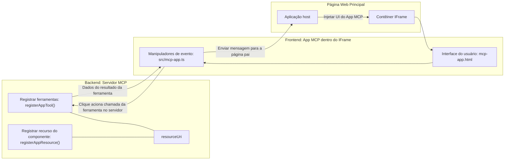

# MCP Apps

MCP Apps é um novo paradigma no MCP. A ideia é que, além de você responder com dados de volta de uma chamada de ferramenta, você também fornece informações sobre como essas informações devem ser interagidas. Isso significa que os resultados das ferramentas agora podem conter informações de interface do usuário. Mas por que quereríamos isso? Bem, considere como você faz as coisas hoje. Você provavelmente consome os resultados de um MCP Server colocando algum tipo de frontend na frente dele, isso é código que você precisa escrever e manter. Às vezes é isso que você quer, mas às vezes seria ótimo se você pudesse simplesmente trazer um trecho de informação que seja auto-contido e que tenha tudo, desde dados até interface do usuário.

## Visão Geral

Esta lição fornece orientação prática sobre MCP Apps, como começar com eles e como integrá-los em seus Apps Web existentes. MCP Apps é uma adição muito recente ao Padrão MCP.

## Objetivos de Aprendizagem

Ao final desta lição, você será capaz de:

- Explicar o que são MCP Apps.
- Quando usar MCP Apps.
- Construir e integrar seus próprios MCP Apps.

## MCP Apps - como funciona

A ideia com MCP Apps é fornecer uma resposta que essencialmente é um componente a ser renderizado. Tal componente pode ter tanto visuais quanto interatividade, por exemplo, cliques em botões, entrada do usuário e mais. Vamos começar pelo lado do servidor e nosso MCP Server. Para criar um componente MCP App você precisa criar uma ferramenta e também o recurso da aplicação. Essas duas partes estão conectadas por um resourceUri.

Aqui está um exemplo. Vamos tentar visualizar o que está envolvido e quais partes fazem o quê:

```text
server.ts -- responsible for registering tools and the component as a UI component
src/
  mcp-app.ts -- wiring up event handlers
mcp-app.html -- the user interface
```

Este visual descreve a arquitetura para criar um componente e sua lógica.


Vamos tentar descrever as responsabilidades a seguir para backend e frontend, respectivamente.

### O backend

Há duas coisas que precisamos realizar aqui:

- Registrar as ferramentas com as quais queremos interagir.
- Definir o componente. 

**Registrando a ferramenta**

```typescript
registerAppTool(
    server,
    "get-time",
    {
      title: "Get Time",
      description: "Returns the current server time.",
      inputSchema: {},
      _meta: { ui: { resourceUri } }, // Vincula esta ferramenta ao seu recurso de interface do usuário
    },
    async () => {
      const time = new Date().toISOString();
      return { content: [{ type: "text", text: time }] };
    },
  );

```

O código anterior descreve o comportamento, onde ele expõe uma ferramenta chamada `get-time`. Ela não recebe inputs, mas acaba produzindo a hora atual. Temos a capacidade de definir um `inputSchema` para ferramentas onde precisamos aceitar entrada do usuário.

**Registrando o componente**

No mesmo arquivo, também precisamos registrar o componente:

```typescript
const resourceUri = "ui://get-time/mcp-app.html";

// Registra o recurso, que retorna o HTML/JavaScript empacotado para a interface do usuário.
registerAppResource(
  server,
  resourceUri,
  resourceUri,
  { mimeType: RESOURCE_MIME_TYPE },
  async () => {
    const html = await fs.readFile(path.join(DIST_DIR, "mcp-app.html"), "utf-8");

    return {
    contents: [
        { uri: resourceUri, mimeType: RESOURCE_MIME_TYPE, text: html },
    ],
    };
  },
);
```

Note como mencionamos o `resourceUri` para conectar o componente com suas ferramentas. Também é interessante o callback onde carregamos o arquivo UI e retornamos o componente.

### Frontend do componente

Assim como no backend, há duas partes aqui:

- Um frontend escrito em HTML puro.
- Código que lida com eventos e o que fazer, por exemplo, chamar ferramentas ou enviar mensagens para a janela pai.

**Interface do usuário**

Vamos dar uma olhada na interface do usuário.

```html
<!-- mcp-app.html -->
<!DOCTYPE html>
<html lang="en">
  <head>
    <meta charset="UTF-8" />
    <title>Get Time App</title>
  </head>
  <body>
    <p>
      <strong>Server Time:</strong> <code id="server-time">Loading...</code>
    </p>
    <button id="get-time-btn">Get Server Time</button>
    <script type="module" src="/src/mcp-app.ts"></script>
  </body>
</html>
```

**Ligação de eventos**

A última parte é a ligação de eventos. Isso significa que identificamos qual parte da UI precisa de manipuladores de eventos e o que fazer caso eventos sejam disparados:

```typescript
// mcp-app.ts

import { App } from "@modelcontextprotocol/ext-apps";

// Obter referências dos elementos
const serverTimeEl = document.getElementById("server-time")!;
const getTimeBtn = document.getElementById("get-time-btn")!;

// Criar instância do aplicativo
const app = new App({ name: "Get Time App", version: "1.0.0" });

// Manipular resultados da ferramenta do servidor. Definir antes de `app.connect()` para evitar
// perder o resultado inicial da ferramenta.
app.ontoolresult = (result) => {
  const time = result.content?.find((c) => c.type === "text")?.text;
  serverTimeEl.textContent = time ?? "[ERROR]";
};

// Conectar clique do botão
getTimeBtn.addEventListener("click", async () => {
  // `app.callServerTool()` permite que a interface solicite dados novos do servidor
  const result = await app.callServerTool({ name: "get-time", arguments: {} });
  const time = result.content?.find((c) => c.type === "text")?.text;
  serverTimeEl.textContent = time ?? "[ERROR]";
});

// Conectar ao host
app.connect();
```

Como você pode ver acima, este é um código normal para conectar elementos DOM a eventos. Vale destacar a chamada para `callServerTool` que acaba chamando uma ferramenta no backend.

## Lidando com entrada do usuário

Até agora, vimos um componente que tem um botão que, quando clicado, chama uma ferramenta. Vamos ver se podemos adicionar mais elementos de UI como um campo de entrada e ver se conseguimos enviar argumentos para uma ferramenta. Vamos implementar uma funcionalidade de FAQ. Veja como deve funcionar:

- Deve haver um botão e um elemento de entrada onde o usuário digita uma palavra-chave para pesquisar, por exemplo, "Shipping". Isso deve chamar uma ferramenta no backend que faz uma busca nos dados do FAQ.
- Uma ferramenta que suporte a busca FAQ mencionada.

Vamos adicionar o suporte necessário ao backend primeiro:

```typescript
const faq: { [key: string]: string } = {
    "shipping": "Our standard shipping time is 3-5 business days.",
    "return policy": "You can return any item within 30 days of purchase.",
    "warranty": "All products come with a 1-year warranty covering manufacturing defects.",
  }

registerAppTool(
    server,
    "get-faq",
    {
      title: "Search FAQ",
      description: "Searches the FAQ for relevant answers.",
      inputSchema: zod.object({
        query: zod.string().default("shipping"),
      }),
      _meta: { ui: { resourceUri: faqResourceUri } }, // Vincula esta ferramenta ao seu recurso de interface do usuário
    },
    async ({ query }) => {
      const answer: string = faq[query.toLowerCase()] || "Sorry, I don't have an answer for that.";
      return { content: [{ type: "text", text: answer }] };
    },
  );
```

O que estamos vendo aqui é como preenchemos o `inputSchema` e damos um esquema `zod` assim:

```typescript
inputSchema: zod.object({
  query: zod.string().default("shipping"),
})
```

No esquema acima declaramos que temos um parâmetro de entrada chamado `query` e que ele é opcional com valor padrão "shipping".

Ok, vamos continuar para o *mcp-app.html* para ver qual UI precisamos criar para isso:

```html
<div class="faq">
    <h1>FAQ response</h1>
    <p>FAQ Response: <code id="faq-response">Loading...</code></p>
    <input type="text" id="faq-query" placeholder="Enter FAQ query" />
    <button id="get-faq-btn">Get FAQ Response</button>
  </div>
```

Ótimo, agora temos um elemento de entrada e um botão. Vamos para o *mcp-app.ts* em seguida para conectar esses eventos:

```typescript
const getFaqBtn = document.getElementById("get-faq-btn")!;
const faqQueryInput = document.getElementById("faq-query") as HTMLInputElement;

getFaqBtn.addEventListener("click", async () => {
  const query = faqQueryInput.value;
  const result = await app.callServerTool({ name: "get-faq", arguments: { query } });
  const faq = result.content?.find((c) => c.type === "text")?.text;
  faqResponseEl.textContent = faq ?? "[ERROR]";
});
```

No código acima nós:

- Criamos referências para os elementos interativos da UI.
- Lidamos com o clique do botão para extrair o valor do elemento de entrada e também chamamos `app.callServerTool()` com `name` e `arguments` onde este último passa `query` como valor.

O que realmente acontece quando você chama `callServerTool` é que ele envia uma mensagem para a janela pai e essa janela acaba chamando o MCP Server.

### Experimente

Ao testar isso, agora devemos ver o seguinte:


e aqui onde testamos com uma entrada como "warranty"


Para rodar esse código, vá para a [Seção de Código](./code/README.md)

## Testando no Visual Studio Code

O Visual Studio Code tem ótimo suporte para MCP Apps e é provavelmente uma das maneiras mais fáceis de testar seus MCP Apps. Para usar o Visual Studio Code, adicione uma entrada de servidor ao *mcp.json* assim:

```json
"my-mcp-server-7178eca7": {
    "url": "http://localhost:3001/mcp",
    "type": "http"
  }
```

Depois, inicie o servidor, você deve ser capaz de se comunicar com seu MCP App através da Janela de Chat desde que tenha o GitHub Copilot instalado.

Você pode disparar isso via prompt, por exemplo "#get-faq":


e assim como quando você rodou pelo navegador web, ele renderiza da mesma forma assim:


## Exercício

Crie um jogo de pedra, papel e tesoura. Ele deve consistir no seguinte:

UI:

- uma lista suspensa com opções
- um botão para enviar uma escolha
- um rótulo mostrando quem escolheu o quê e quem ganhou

Servidor:

- deve ter uma ferramenta pedra, papel e tesoura que receba "choice" como entrada. Ela também deve gerar uma escolha de computador e determinar o vencedor

## Solução

[Solução](./assignment/README.md)

## Resumo

Aprendemos sobre esse novo paradigma MCP Apps. É um novo paradigma que permite que MCP Servers tenham uma opinião não apenas sobre os dados, mas também sobre como esses dados devem ser apresentados.

Além disso, aprendemos que esses MCP Apps são hospedados dentro de um IFrame e para se comunicar com MCP Servers eles precisam enviar mensagens para o app web pai. Existem várias bibliotecas disponíveis tanto para JavaScript puro quanto para React e mais que facilitam essa comunicação.

## Principais Pontos

Aqui está o que você aprendeu:

- MCP Apps é um novo padrão que pode ser útil quando você quer enviar tanto dados quanto recursos de UI.
- Esses tipos de apps rodam em um IFrame por razões de segurança.

## O que vem a seguir

- [Capítulo 4](../../04-PracticalImplementation/README.md)

---

<!-- CO-OP TRANSLATOR DISCLAIMER START -->
**Aviso Legal**:
Este documento foi traduzido usando o serviço de tradução automática [Co-op Translator](https://github.com/Azure/co-op-translator). Embora nos esforcemos pela precisão, esteja ciente de que traduções automáticas podem conter erros ou imprecisões. O documento original em seu idioma nativo deve ser considerado a fonte autorizada. Para informações críticas, recomenda-se tradução humana profissional. Não nos responsabilizamos por quaisquer mal-entendidos ou interpretações incorretas decorrentes do uso desta tradução.
<!-- CO-OP TRANSLATOR DISCLAIMER END -->