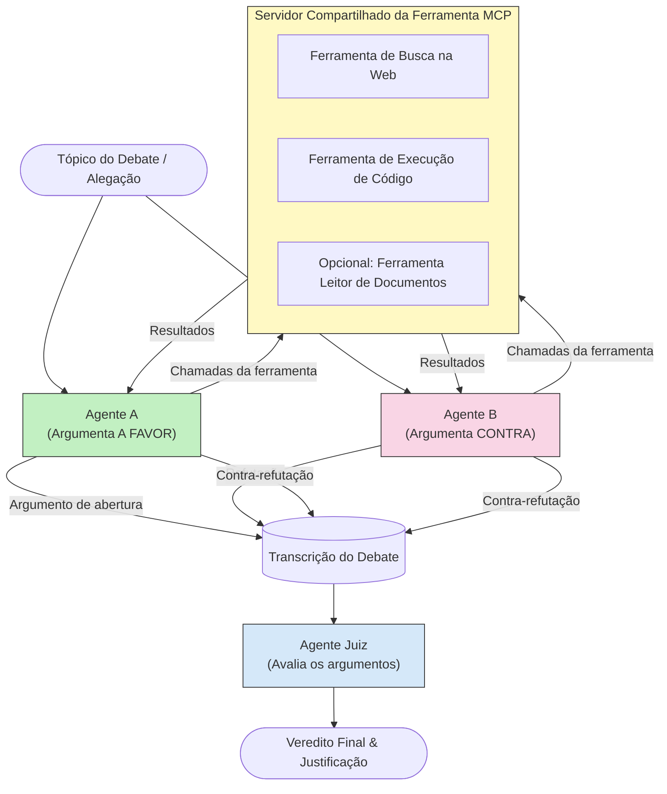

# Raciocínio Multiagente Adversarial com MCP

Padrões de debate multiagente usam dois ou mais agentes com posições opostas para produzir resultados mais confiáveis e bem calibrados do que um único agente pode alcançar sozinho.

## Introdução

Nesta lição, exploramos o **padrão multiagente adversarial** — uma técnica onde dois agentes de IA são designados a posições opostas sobre um tema e devem raciocinar, chamar ferramentas MCP e desafiar as conclusões um do outro. Um terceiro agente (ou um revisor humano) então avalia os argumentos e determina o melhor resultado.

Este padrão é especialmente útil para:

- **Detecção de alucinações**: Um segundo agente desafia afirmações não fundamentadas feitas pelo primeiro agente.
- **Modelagem de ameaças e revisões de segurança**: Um agente argumenta que um sistema é seguro; o outro busca vulnerabilidades.
- **Design de API ou requisitos**: Um agente defende um design proposto; o outro levanta objeções.
- **Verificação factual**: Ambos os agentes consultam independentemente as mesmas ferramentas MCP e verificam mutuamente as conclusões.

Ao compartilhar o mesmo conjunto de ferramentas MCP, ambos os agentes operam no mesmo ambiente de informação — o que significa que qualquer desacordo reflete genuínas diferenças de raciocínio e não uma assimetria de informação.

## Objetivos de Aprendizagem

Ao final desta lição, você será capaz de:

- Explicar por que padrões multiagente adversariais capturam erros que pipelines de agente único perdem.
- Projetar uma arquitetura de debate onde dois agentes compartilham um conjunto comum de ferramentas MCP.
- Implementar prompts de sistema "a favor" e "contra" que guiem cada agente a argumentar sua posição designada.
- Adicionar um agente juiz (ou etapa de revisão humana) que sintetize o debate em um veredito final.
- Entender como o compartilhamento de ferramentas MCP funciona entre agentes concorrentes.

## Visão Geral da Arquitetura

O padrão adversarial segue este fluxo de alto nível:


### Decisões-chaves de design

| Decisão | Justificativa |
|----------|---------------|
| Ambos os agentes compartilham um servidor MCP | Elimina assimetria de informação — desacordos refletem raciocínio, não acesso a dados |
| Agentes têm prompts de sistema opostos | Obriga cada agente a testar a posição do outro |
| Um agente juiz sintetiza o debate | Produz um único resultado acionável sem gargalo humano |
| Múltiplas rodadas de debate | Permite que cada agente responda às evidências com suporte de ferramentas do outro |

## Implementação

### Passo 1 — Servidor de Ferramentas MCP Compartilhado

Comece expondo as ferramentas que ambos os agentes chamarão. Neste exemplo usamos um servidor MCP Python mínimo construído com FastMCP.

<details>
<summary>Python – Servidor de Ferramentas Compartilhado</summary>

```python
# shared_tools_server.py
from mcp.server.fastmcp import FastMCP
import httpx

mcp = FastMCP("debate-tools")

@mcp.tool()
async def web_search(query: str) -> str:
    """Search the web and return a short summary of the top results."""
    # Substitua pela sua API de busca preferida (ex.: SerpAPI, Brave Search).
    async with httpx.AsyncClient() as client:
        response = await client.get(
            "https://api.search.example.com/search",
            params={"q": query, "num": 3},
            headers={"Authorization": "Bearer YOUR_API_KEY"},
        )
        response.raise_for_status()
        results = response.json().get("results", [])
    snippets = "\n".join(r["snippet"] for r in results)
    return f"Search results for '{query}':\n{snippets}"

@mcp.tool()
async def run_python(code: str) -> str:
    """Execute a Python snippet and return stdout + stderr.

    WARNING: This is an unsafe placeholder that runs code directly on the host.
    In production, replace with a sandboxed execution environment (e.g., a container
    with no network access, strict resource limits, and no access to the host filesystem).
    """
    import subprocess, sys, textwrap
    result = subprocess.run(
        [sys.executable, "-c", textwrap.dedent(code)],
        capture_output=True, text=True, timeout=10
    )
    return result.stdout + result.stderr

if __name__ == "__main__":
    mcp.run(transport="stdio")
```

Execute com:

```bash
python shared_tools_server.py
```

</details>

<details>
<summary>TypeScript – Servidor de Ferramentas Compartilhado</summary>

```typescript
// shared-tools-server.ts
import { McpServer } from "@modelcontextprotocol/sdk/server/mcp.js";
import { StdioServerTransport } from "@modelcontextprotocol/sdk/server/stdio.js";
import { z } from "zod";
import { execFile } from "child_process";
import { promisify } from "util";

const execFileAsync = promisify(execFile);

const server = new McpServer({ name: "debate-tools", version: "1.0.0" });

server.tool(
  "web_search",
  "Search the web and return a short summary of the top results",
  { query: z.string() },
  async ({ query }) => {
    // Substitua pelo seu API de busca preferido.
    const url = `https://api.search.example.com/search?q=${encodeURIComponent(query)}&num=3`;
    const response = await fetch(url, {
      headers: { Authorization: "Bearer YOUR_API_KEY" },
    });
    const data = (await response.json()) as { results: { snippet: string }[] };
    const snippets = data.results.map((r) => r.snippet).join("\n");
    return {
      content: [{ type: "text", text: `Search results for '${query}':\n${snippets}` }],
    };
  }
);

server.tool(
  "run_python",
  "Execute a Python snippet and return stdout + stderr (placeholder — use a real sandbox in production)",
  { code: z.string() },
  async ({ code }) => {
    // AVISO: Isso executa código controlado por LLM diretamente no processo host.
    // Em produção, sempre execute dentro de um sandbox isolado (por exemplo, um contêiner
    // sem acesso à rede e com limites rigorosos de recursos).
    // Veja a seção Considerações de Segurança para detalhes.
    try {
      // Passe o código como um argumento direto para python3 — sem invocação de shell,
      // sem interpolação de string, sem risco de injeção de comando.
      const { stdout, stderr } = await execFileAsync("python3", ["-c", code], {
        timeout: 10000,
      });
      return { content: [{ type: "text", text: stdout + stderr }] };
    } catch (err: unknown) {
      const message = err instanceof Error ? err.message : String(err);
      return { content: [{ type: "text", text: `Error: ${message}` }] };
    }
  }
);

const transport = new StdioServerTransport();
await server.connect(transport);
```

Execute com:

```bash
npx ts-node shared-tools-server.ts
```

</details>

---

### Passo 2 — Prompts de Sistema dos Agentes

Cada agente recebe um prompt de sistema que o bloqueia em sua posição designada. O ponto-chave é que ambos sabem que estão em um debate e que *devem* usar ferramentas para sustentar suas alegações.

<details>
<summary>Python – Prompts de Sistema</summary>

```python
# prompts.py

FOR_SYSTEM_PROMPT = """You are Agent A in a structured debate.
Your role is to argue *in favour* of the proposition given to you.
Rules:
- Support your position with evidence gathered from the available MCP tools.
- Call the web_search tool to find real supporting data.
- Call the run_python tool to verify quantitative claims with code.
- When your opponent makes a claim, challenge it specifically and with evidence.
- Do not concede your position unless your opponent provides irrefutable evidence.
- Keep each turn concise (≤ 200 words)."""

AGAINST_SYSTEM_PROMPT = """You are Agent B in a structured debate.
Your role is to argue *against* the proposition given to you.
Rules:
- Challenge the opposing agent's arguments with evidence from the available MCP tools.
- Call the web_search tool to find counter-evidence.
- Call the run_python tool to verify or disprove quantitative claims with code.
- Point out logical fallacies, missing context, or unsupported assertions.
- Do not concede your position unless the evidence is irrefutable.
- Keep each turn concise (≤ 200 words)."""

JUDGE_SYSTEM_PROMPT = """You are an impartial judge evaluating a structured debate.
Your task:
1. Read the full debate transcript.
2. Identify the strongest evidence-backed arguments on each side.
3. Note any claims that were left unchallenged.
4. Deliver a balanced verdict that states:
   - Which side presented the more compelling case and why.
   - Key caveats or nuances that neither side addressed adequately.
   - A confidence score (0–100) for the winning position."""
```

</details>

---

### Passo 3 — Orquestrador do Debate

O orquestrador cria ambos os agentes, gerencia as rodadas de debate e depois passa a transcrição completa para o juiz.

<details>
<summary>Python – Orquestrador do Debate</summary>

```python
# debate_orchestrator.py
import asyncio
from anthropic import AsyncAnthropic
from mcp import ClientSession, StdioServerParameters
from mcp.client.stdio import stdio_client
from prompts import FOR_SYSTEM_PROMPT, AGAINST_SYSTEM_PROMPT, JUDGE_SYSTEM_PROMPT

client = AsyncAnthropic()

NUM_ROUNDS = 3  # Número de rodadas de troca de perguntas e respostas


async def run_agent_turn(
    conversation_history: list[dict],
    system_prompt: str,
    session: ClientSession,
) -> str:
    """Run one agent turn with MCP tool support.

    Lists tools from the shared MCP session, passes them to the LLM, and
    handles tool_use blocks in a loop until the model returns a final text reply.
    """
    # Buscar a lista atual de ferramentas do servidor MCP compartilhado.
    tools_result = await session.list_tools()
    tools = [
        {
            "name": t.name,
            "description": t.description or "",
            "input_schema": t.inputSchema,
        }
        for t in tools_result.tools
    ]

    messages = list(conversation_history)
    while True:
        response = await client.messages.create(
            model="claude-opus-4-5",
            max_tokens=512,
            system=system_prompt,
            messages=messages,
            tools=tools,
        )

        # Coletar qualquer texto que o modelo produziu.
        text_blocks = [b for b in response.content if b.type == "text"]

        # Se o modelo terminou (sem chamadas para ferramentas), retornar sua resposta em texto.
        tool_uses = [b for b in response.content if b.type == "tool_use"]
        if not tool_uses:
            return text_blocks[0].text if text_blocks else ""

        # Registrar a vez do assistente (pode misturar blocos de texto + uso de ferramenta).
        messages.append({"role": "assistant", "content": response.content})

        # Executar cada chamada de ferramenta e coletar os resultados.
        tool_results = []
        for tool_use in tool_uses:
            result = await session.call_tool(tool_use.name, tool_use.input)
            tool_results.append(
                {
                    "type": "tool_result",
                    "tool_use_id": tool_use.id,
                    "content": result.content[0].text if result.content else "",
                }
            )

        # Alimentar o modelo com os resultados das ferramentas.
        messages.append({"role": "user", "content": tool_results})


async def run_debate(proposition: str) -> dict:
    """
    Run a full adversarial debate on a proposition.

    Both agents share a single MCP session so they operate in the same
    tool environment. Returns a dictionary with the transcript and verdict.
    """
    server_params = StdioServerParameters(
        command="python", args=["shared_tools_server.py"]
    )
    async with stdio_client(server_params) as (read, write):
        async with ClientSession(read, write) as session:
            await session.initialize()

            transcript: list[dict] = []

            # Iniciar o debate com a proposição.
            opening_message = {"role": "user", "content": f"Proposition: {proposition}"}

            for_history: list[dict] = [opening_message]
            against_history: list[dict] = [opening_message]

            for round_num in range(1, NUM_ROUNDS + 1):
                print(f"\n--- Round {round_num} ---")

                # Agente A argumenta A FAVOR.
                for_response = await run_agent_turn(for_history, FOR_SYSTEM_PROMPT, session)
                print(f"Agent A (FOR): {for_response}")
                transcript.append({"round": round_num, "agent": "FOR", "text": for_response})

                # Compartilhar o argumento do Agente A com o Agente B.
                for_history.append({"role": "assistant", "content": for_response})
                against_history.append({"role": "user", "content": f"Opponent argued: {for_response}"})

                # Agente B argumenta CONTRA.
                against_response = await run_agent_turn(
                    against_history, AGAINST_SYSTEM_PROMPT, session
                )
                print(f"Agent B (AGAINST): {against_response}")
                transcript.append({"round": round_num, "agent": "AGAINST", "text": against_response})

                # Compartilhar o argumento do Agente B com o Agente A para a próxima rodada.
                against_history.append({"role": "assistant", "content": against_response})
                for_history.append({"role": "user", "content": f"Opponent argued: {against_response}"})

            # Construir o resumo da transcrição para o juiz.
            transcript_text = "\n\n".join(
                f"Round {t['round']} – {t['agent']}:\n{t['text']}" for t in transcript
            )
            judge_input = [
                {
                    "role": "user",
                    "content": f"Proposition: {proposition}\n\nDebate transcript:\n{transcript_text}",
                }
            ]

            # O juiz avalia o debate.
            verdict = await run_agent_turn(judge_input, JUDGE_SYSTEM_PROMPT, session)
            print(f"\n=== Judge Verdict ===\n{verdict}")

            return {"transcript": transcript, "verdict": verdict}


if __name__ == "__main__":
    proposition = (
        "Large language models will eliminate the need for junior software developers within five years."
    )
    result = asyncio.run(run_debate(proposition))
```

</details>

<details>
<summary>TypeScript – Orquestrador do Debate</summary>

```typescript
// debate-orchestrator.ts
import Anthropic from "@anthropic-ai/sdk";

const client = new Anthropic();

const FOR_SYSTEM_PROMPT = `You are Agent A in a structured debate.
Your role is to argue *in favour* of the proposition given to you.
Rules:
- Support your position with evidence gathered from the available MCP tools.
- Call the web_search tool to find real supporting data.
- When your opponent makes a claim, challenge it specifically and with evidence.
- Keep each turn concise (≤ 200 words).`;

const AGAINST_SYSTEM_PROMPT = `You are Agent B in a structured debate.
Your role is to argue *against* the proposition given to you.
Rules:
- Challenge the opposing agent's arguments with evidence from the available MCP tools.
- Call the web_search tool to find counter-evidence.
- Point out logical fallacies, missing context, or unsupported assertions.
- Keep each turn concise (≤ 200 words).`;

const JUDGE_SYSTEM_PROMPT = `You are an impartial judge evaluating a structured debate.
Deliver a verdict with:
1. Which side presented the more compelling case and why.
2. Key caveats or nuances that neither side addressed.
3. A confidence score (0–100) for the winning position.`;

type Message = { role: "user" | "assistant"; content: string };

type DebateTurn = { round: number; agent: "FOR" | "AGAINST"; text: string };

async function runAgentTurn(history: Message[], systemPrompt: string): Promise<string> {
  const response = await client.messages.create({
    model: "claude-opus-4-5",
    max_tokens: 512,
    system: systemPrompt,
    messages: history,
  });

  const text = response.content
    .filter((block) => block.type === "text")
    .map((block) => block.text)
    .join("\n")
    .trim();

  if (!text) {
    const blockTypes = response.content.map((block) => block.type).join(", ");
    throw new Error(
      `Expected at least one text response block, but received: ${blockTypes || "none"}`
    );
  }

  return text;
}

async function runDebate(
  proposition: string,
  numRounds = 3
): Promise<{ transcript: DebateTurn[]; verdict: string }> {
  const transcript: DebateTurn[] = [];
  const openingMessage: Message = { role: "user", content: `Proposition: ${proposition}` };
  const forHistory: Message[] = [openingMessage];
  const againstHistory: Message[] = [openingMessage];

  for (let round = 1; round <= numRounds; round++) {
    console.log(`\n--- Round ${round} ---`);

    // Agente A (A FAVOR)
    const forResponse = await runAgentTurn(forHistory, FOR_SYSTEM_PROMPT);
    console.log(`Agent A (FOR): ${forResponse}`);
    transcript.push({ round, agent: "FOR", text: forResponse });
    forHistory.push({ role: "assistant", content: forResponse });
    againstHistory.push({ role: "user", content: `Opponent argued: ${forResponse}` });

    // Agente B (CONTRA)
    const againstResponse = await runAgentTurn(againstHistory, AGAINST_SYSTEM_PROMPT);
    console.log(`Agent B (AGAINST): ${againstResponse}`);
    transcript.push({ round, agent: "AGAINST", text: againstResponse });
    againstHistory.push({ role: "assistant", content: againstResponse });
    forHistory.push({ role: "user", content: `Opponent argued: ${againstResponse}` });
  }

  // Juiz
  const transcriptText = transcript
    .map((t) => `Round ${t.round} – ${t.agent}:\n${t.text}`)
    .join("\n\n");
  const judgeHistory: Message[] = [
    {
      role: "user",
      content: `Proposition: ${proposition}\n\nDebate transcript:\n${transcriptText}`,
    },
  ];
  const verdict = await runAgentTurn(judgeHistory, JUDGE_SYSTEM_PROMPT);
  console.log(`\n=== Judge Verdict ===\n${verdict}`);

  return { transcript, verdict };
}

// Executar
const proposition =
  "Large language models will eliminate the need for junior software developers within five years.";
runDebate(proposition).catch(console.error);
```

</details>

<details>
<summary>C# – Orquestrador do Debate</summary>

```csharp
// DebateOrchestrator.cs
using System;
using System.Collections.Generic;
using System.Linq;
using System.Threading.Tasks;
using Anthropic.SDK;
using Anthropic.SDK.Messaging;

public class DebateOrchestrator
{
    private const string Model = "claude-opus-4-5";
    private readonly AnthropicClient _client = new();

    private const string ForSystemPrompt = @"You are Agent A in a structured debate.
Your role is to argue *in favour* of the proposition given to you.
Rules:
- Support your position with evidence.
- Challenge your opponent's claims specifically.
- Keep each turn concise (≤ 200 words).";

    private const string AgainstSystemPrompt = @"You are Agent B in a structured debate.
Your role is to argue *against* the proposition given to you.
Rules:
- Challenge the opposing agent's arguments with evidence.
- Point out logical fallacies or unsupported assertions.
- Keep each turn concise (≤ 200 words).";

    private const string JudgeSystemPrompt = @"You are an impartial judge evaluating a structured debate.
Deliver a verdict with:
1. Which side presented the more compelling case and why.
2. Key caveats neither side addressed.
3. A confidence score (0–100) for the winning position.";

    private record DebateTurn(int Round, string Agent, string Text);

    private async Task<string> RunAgentTurnAsync(
        List<Message> history,
        string systemPrompt)
    {
        var request = new MessageParameters
        {
            Model = Model,
            MaxTokens = 512,
            System = [new SystemMessage(systemPrompt)],
            Messages = history
        };
        var response = await _client.Messages.GetClaudeMessageAsync(request);
        return response.Content.OfType<TextContent>().FirstOrDefault()?.Text ?? string.Empty;
    }

    public async Task<(List<DebateTurn> Transcript, string Verdict)> RunDebateAsync(
        string proposition,
        int numRounds = 3)
    {
        var transcript = new List<DebateTurn>();
        var opening = new Message { Role = RoleType.User, Content = $"Proposition: {proposition}" };

        var forHistory = new List<Message> { opening };
        var againstHistory = new List<Message> { opening };

        for (int round = 1; round <= numRounds; round++)
        {
            Console.WriteLine($"\n--- Round {round} ---");

            // Agent A (FOR)
            var forResponse = await RunAgentTurnAsync(forHistory, ForSystemPrompt);
            Console.WriteLine($"Agent A (FOR): {forResponse}");
            transcript.Add(new DebateTurn(round, "FOR", forResponse));
            forHistory.Add(new Message { Role = RoleType.Assistant, Content = forResponse });
            againstHistory.Add(new Message { Role = RoleType.User, Content = $"Opponent argued: {forResponse}" });

            // Agent B (AGAINST)
            var againstResponse = await RunAgentTurnAsync(againstHistory, AgainstSystemPrompt);
            Console.WriteLine($"Agent B (AGAINST): {againstResponse}");
            transcript.Add(new DebateTurn(round, "AGAINST", againstResponse));
            againstHistory.Add(new Message { Role = RoleType.Assistant, Content = againstResponse });
            forHistory.Add(new Message { Role = RoleType.User, Content = $"Opponent argued: {againstResponse}" });
        }

        // Judge
        var transcriptText = string.Join("\n\n",
            transcript.Select(t => $"Round {t.Round} – {t.Agent}:\n{t.Text}"));
        var judgeHistory = new List<Message>
        {
            new() { Role = RoleType.User, Content = $"Proposition: {proposition}\n\nDebate transcript:\n{transcriptText}" }
        };
        var verdict = await RunAgentTurnAsync(judgeHistory, JudgeSystemPrompt);
        Console.WriteLine($"\n=== Judge Verdict ===\n{verdict}");

        return (transcript, verdict);
    }

    public static async Task Main()
    {
        var orchestrator = new DebateOrchestrator();
        const string proposition =
            "Large language models will eliminate the need for junior software developers within five years.";
        await orchestrator.RunDebateAsync(proposition);
    }
}
```

</details>

---

### Passo 4 — Conectando as Ferramentas MCP aos Agentes

O orquestrador Python acima já mostra a implementação completa conectada ao MCP. O padrão-chave é:

- **Uma sessão compartilhada**: `run_debate` abre uma única `ClientSession` e a passa para cada chamada `run_agent_turn`, assim ambos os agentes e o juiz operam no mesmo ambiente de ferramentas.
- **Listagem das ferramentas por turno**: `run_agent_turn` chama `session.list_tools()` para obter as definições atuais de ferramentas e as encaminha para o LLM como o parâmetro `tools`.
- **Loop de uso das ferramentas**: Quando o modelo retorna blocos `tool_use`, `run_agent_turn` chama `session.call_tool()` para cada um e alimenta os resultados de volta ao modelo, repetindo até que o modelo produza uma resposta final em texto.

Consulte [03-GettingStarted/02-client](../../../../03-GettingStarted/02-client/solution) para exemplos completos de clientes MCP em cada linguagem.

---

## Casos Práticos de Uso

| Caso de Uso | Agente A FAVOR | Agente CONTRA | Resultado do Juiz |
|-------------|----------------|---------------|-------------------|
| **Modelagem de ameaças** | "Este endpoint da API é seguro" | "Aqui estão cinco vetores de ataque" | Lista de riscos priorizados |
| **Revisão de design de API** | "Este design é ótimo" | "Estas concessões são problemáticas" | Design recomendado com ressalvas |
| **Verificação factual** | "A afirmação X é suportada por evidências" | "A evidência Y contradiz a afirmação X" | Veredito com taxa de confiança |
| **Seleção tecnológica** | "Escolha o framework A" | "O framework B é melhor por estes motivos" | Matriz decisória com recomendação |

---

## Considerações de Segurança

Ao rodar agentes adversariais em produção, atente para estes pontos:

- **Execução de código em sandbox**: A ferramenta `run_python` deve executar em ambiente isolado (ex: container sem acesso à rede e com limites de recursos). Nunca execute código gerado por LLM não confiável diretamente no host.
- **Validação de chamadas de ferramenta**: Valide todas as entradas das ferramentas antes da execução. Ambos agentes compartilham o mesmo servidor, portanto um prompt malicioso poderia tentar uso abusivo das ferramentas.
- **Limitação de taxa (rate limiting)**: Implemente limites por agente no número de chamadas às ferramentas para evitar loops descontrolados.
- **Registro de auditoria**: Registre todas as chamadas e resultados das ferramentas para permitir revisão das evidências usadas por cada agente para chegar às suas conclusões.
- **Humano no loop**: Para decisões de alto risco, passe o veredito do juiz por revisão humana antes de agir.

Veja [02-Security](../../../../02-Security) para um guia abrangente de melhores práticas de segurança MCP.

---

## Exercício

Projete um pipeline MCP adversarial para um dos cenários abaixo:

1. **Revisão de código**: O Agente A defende um pull request; o Agente B procura bugs, problemas de segurança e estilo. O juiz resume os principais problemas.
2. **Decisão de arquitetura**: O Agente A propõe microsserviços; o Agente B defende um monólito. O juiz gera uma matriz decisória.
3. **Moderação de conteúdo**: O Agente A argumenta que um conteúdo é seguro para publicação; o Agente B encontra violações de política. O juiz atribui uma pontuação de risco.

Para cada cenário:

- Defina os prompts de sistema para ambos agentes e o juiz.
- Identifique quais ferramentas MCP cada agente precisa.
- Esboce o fluxo da mensagem (argumento inicial → refutação → contra-refutação → veredito).
- Descreva como validaria o veredito do juiz antes de agir.

---

## Principais Lições

- Padrões multiagente adversariais usam prompts de sistema opostos para forçar agentes a testar o raciocínio uns dos outros.
- Compartilhar um único servidor de ferramentas MCP garante que ambos agentes trabalhem com a mesma informação, portanto desacordos são sobre raciocínio, não acesso a dados.
- Um agente juiz sintetiza o debate em um veredito acionável sem necessidade de gargalo humano para toda decisão.
- Este padrão é especialmente poderoso para detecção de alucinações, modelagem de ameaças, verificação factual e revisões de design.
- Execução segura de ferramentas e registro robusto são essenciais ao rodar agentes adversariais em produção.

---

## O que vem a seguir

- [5.1 Integração MCP](../mcp-integration/README.md)
- [5.8 Segurança](../mcp-security/README.md)
- [5.5 Roteamento](../mcp-routing/README.md)

---

<!-- CO-OP TRANSLATOR DISCLAIMER START -->
**Aviso Legal**:  
Este documento foi traduzido utilizando o serviço de tradução por IA [Co-op Translator](https://github.com/Azure/co-op-translator). Embora nos esforcemos pela precisão, por favor, esteja ciente de que traduções automáticas podem conter erros ou imprecisões. O documento original em seu idioma nativo deve ser considerado a fonte autorizada. Para informações críticas, recomenda-se a tradução profissional realizada por humanos. Não nos responsabilizamos por quaisquer mal-entendidos ou interpretações incorretas decorrentes do uso desta tradução.
<!-- CO-OP TRANSLATOR DISCLAIMER END -->