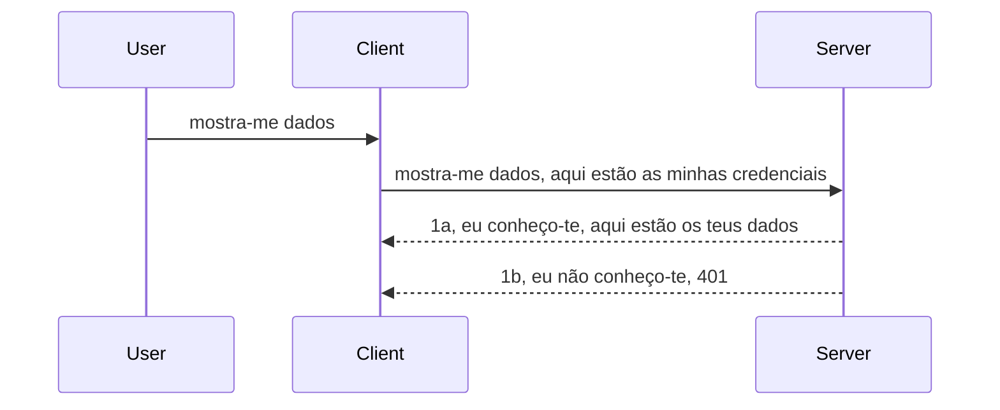

# Autenticação simples

Os SDKs MCP suportam o uso de OAuth 2.1 que, para ser justo, é um processo bastante complexo envolvendo conceitos como servidor de autenticação, servidor de recursos, envio de credenciais, obtenção de um código, troca do código por um token bearer até que finalmente se possa obter os dados do recurso. Se não está habituado ao OAuth, que é uma excelente coisa para implementar, é uma boa ideia começar com algum nível básico de autenticação e evoluir para uma segurança cada vez melhor. É por isso que este capítulo existe, para o preparar para autenticação mais avançada.

## Autenticação, o que queremos dizer?

Auth é a abreviação de autenticação e autorização. A ideia é que precisamos fazer duas coisas:

- **Autenticação**, que é o processo de perceber se deixamos uma pessoa entrar em nossa casa, se tem o direito de estar "aqui", ou seja, de ter acesso ao nosso servidor de recursos onde estão as funcionalidades do nosso Servidor MCP.
- **Autorização**, é o processo de descobrir se um utilizador deve ter acesso a estes recursos específicos que está a pedir, por exemplo, estas encomendas ou estes produtos ou se só tem permissão para ler o conteúdo mas não para apagar, como outro exemplo.

## Credenciais: como dizemos ao sistema quem somos

Bem, a maioria dos programadores web começa a pensar em termos de fornecer uma credencial ao servidor, normalmente um segredo que diz se têm ou não permissão para estar aqui ("Autenticação"). Esta credencial é normalmente uma versão codificada em base64 do nome de utilizador e palavra-passe ou uma chave API que identifica unicamente um utilizador específico.

Isto envolve enviá-la através de um cabeçalho chamado "Authorization", assim:

```json
{ "Authorization": "secret123" }
```

Isto é normalmente referido como autenticação básica. O fluxo geral funciona da seguinte forma:


Agora que entendemos como funciona do ponto de vista do fluxo, como o implementamos? Bem, a maioria dos servidores web tem um conceito chamado middleware, uma peça de código que corre como parte do pedido que pode verificar as credenciais e, se forem válidas, pode deixar passar o pedido. Se o pedido não tiver credenciais válidas, então obtém-se um erro de autenticação. Vamos ver como isto pode ser implementado:

**Python**

```python
class AuthMiddleware(BaseHTTPMiddleware):
    async def dispatch(self, request, call_next):

        has_header = request.headers.get("Authorization")
        if not has_header:
            print("-> Missing Authorization header!")
            return Response(status_code=401, content="Unauthorized")

        if not valid_token(has_header):
            print("-> Invalid token!")
            return Response(status_code=403, content="Forbidden")

        print("Valid token, proceeding...")
       
        response = await call_next(request)
        # adicionar quaisquer cabeçalhos ao cliente ou alterar a resposta de alguma forma
        return response


starlette_app.add_middleware(CustomHeaderMiddleware)
```

Aqui temos:

- Criado um middleware chamado `AuthMiddleware` onde o seu método `dispatch` é invocado pelo servidor web.
- Adicionado o middleware ao servidor web:

    ```python
    starlette_app.add_middleware(AuthMiddleware)
    ```

- Escrito a lógica de validação que verifica se o cabeçalho Authorization está presente e se o segredo enviado é válido:

    ```python
    has_header = request.headers.get("Authorization")
    if not has_header:
        print("-> Missing Authorization header!")
        return Response(status_code=401, content="Unauthorized")

    if not valid_token(has_header):
        print("-> Invalid token!")
        return Response(status_code=403, content="Forbidden")
    ```

    se o segredo estiver presente e for válido, então deixamos passar o pedido chamando `call_next` e devolvemos a resposta.

    ```python
    response = await call_next(request)
    # adicionar quaisquer cabeçalhos de cliente ou alterar a resposta de alguma forma
    return response
    ```

O funcionamento é que, se um pedido web for feito ao servidor, o middleware será invocado e, dado o seu código, poderá deixar passar o pedido ou acabar por devolver um erro que indica que o cliente não tem permissão para continuar.

**TypeScript**

Aqui criamos um middleware com o framework popular Express e interceptamos o pedido antes de chegar ao Servidor MCP. Eis o código para isso:

```typescript
function isValid(secret) {
    return secret === "secret123";
}

app.use((req, res, next) => {
    // 1. Cabeçalho de autorização presente?
    if(!req.headers["Authorization"]) {
        res.status(401).send('Unauthorized');
    }
    
    let token = req.headers["Authorization"];

    // 2. Verificar a validade.
    if(!isValid(token)) {
        res.status(403).send('Forbidden');
    }

   
    console.log('Middleware executed');
    // 3. Passa a requisição para o próximo passo na cadeia de processamento.
    next();
});
```

Neste código:

1. Verificamos se o cabeçalho Authorization está presente, caso contrário enviamos um erro 401.
2. Garantimos que o token/credencial é válido, caso contrário enviamos um erro 403.
3. Finalmente, passa o pedido na pipeline e devolve o recurso pedido.

## Exercício: Implementar autenticação

Vamos pegar no nosso conhecimento e tentar implementar. Eis o plano:

Servidor

- Criar um servidor web e instância MCP.
- Implementar um middleware para o servidor.

Cliente 

- Enviar pedido web, com credencial, via cabeçalho.

### -1- Criar um servidor web e instância MCP

No primeiro passo, precisamos criar a instância do servidor web e o Servidor MCP.

**Python**

Criamos aqui uma instância do servidor MCP, uma app starlette web e hospedamos com uvicorn.

```python
# a criar servidor MCP

app = FastMCP(
    name="MCP Resource Server",
    instructions="Resource Server that validates tokens via Authorization Server introspection",
    host=settings["host"],
    port=settings["port"],
    debug=True
)

# a criar aplicação web starlette
starlette_app = app.streamable_http_app()

# a servir aplicação via uvicorn
async def run(starlette_app):
    import uvicorn
    config = uvicorn.Config(
            starlette_app,
            host=app.settings.host,
            port=app.settings.port,
            log_level=app.settings.log_level.lower(),
        )
    server = uvicorn.Server(config)
    await server.serve()

run(starlette_app)
```

Neste código:

- Criamos o Servidor MCP.
- Construímos a app starlette web a partir do Servidor MCP, `app.streamable_http_app()`.
- Hospedamos e servimos a app web usando uvicorn `server.serve()`.

**TypeScript**

Aqui criamos uma instância do Servidor MCP.

```typescript
const server = new McpServer({
      name: "example-server",
      version: "1.0.0"
    });

    // ... configurar recursos do servidor, ferramentas e prompts ...
```

Esta criação do Servidor MCP precisa acontecer dentro da definição da rota POST /mcp, então vamos pegar o código acima e colocá-lo assim:

```typescript
import express from "express";
import { randomUUID } from "node:crypto";
import { McpServer } from "@modelcontextprotocol/sdk/server/mcp.js";
import { StreamableHTTPServerTransport } from "@modelcontextprotocol/sdk/server/streamableHttp.js";
import { isInitializeRequest } from "@modelcontextprotocol/sdk/types.js"

const app = express();
app.use(express.json());

// Mapa para armazenar transportes por ID de sessão
const transports: { [sessionId: string]: StreamableHTTPServerTransport } = {};

// Tratar pedidos POST para comunicação cliente-servidor
app.post('/mcp', async (req, res) => {
  // Verificar se existe ID de sessão
  const sessionId = req.headers['mcp-session-id'] as string | undefined;
  let transport: StreamableHTTPServerTransport;

  if (sessionId && transports[sessionId]) {
    // Reutilizar transporte existente
    transport = transports[sessionId];
  } else if (!sessionId && isInitializeRequest(req.body)) {
    // Novo pedido de inicialização
    transport = new StreamableHTTPServerTransport({
      sessionIdGenerator: () => randomUUID(),
      onsessioninitialized: (sessionId) => {
        // Armazenar o transporte pelo ID da sessão
        transports[sessionId] = transport;
      },
      // A proteção contra DNS rebinding está desativada por predefinição para compatibilidade retroativa. Se estiver a executar este servidor
      // localmente, certifique-se de definir:
      // enableDnsRebindingProtection: true,
      // allowedHosts: ['127.0.0.1'],
    });

    // Limpar transporte quando fechado
    transport.onclose = () => {
      if (transport.sessionId) {
        delete transports[transport.sessionId];
      }
    };
    const server = new McpServer({
      name: "example-server",
      version: "1.0.0"
    });

    // ... configurar recursos do servidor, ferramentas e prompts ...

    // Ligar ao servidor MCP
    await server.connect(transport);
  } else {
    // Pedido inválido
    res.status(400).json({
      jsonrpc: '2.0',
      error: {
        code: -32000,
        message: 'Bad Request: No valid session ID provided',
      },
      id: null,
    });
    return;
  }

  // Tratar o pedido
  await transport.handleRequest(req, res, req.body);
});

// Manipulador reutilizável para pedidos GET e DELETE
const handleSessionRequest = async (req: express.Request, res: express.Response) => {
  const sessionId = req.headers['mcp-session-id'] as string | undefined;
  if (!sessionId || !transports[sessionId]) {
    res.status(400).send('Invalid or missing session ID');
    return;
  }
  
  const transport = transports[sessionId];
  await transport.handleRequest(req, res);
};

// Tratar pedidos GET para notificações do servidor para o cliente via SSE
app.get('/mcp', handleSessionRequest);

// Tratar pedidos DELETE para terminação de sessão
app.delete('/mcp', handleSessionRequest);

app.listen(3000);
```

Agora vê como a criação do Servidor MCP foi movida para dentro de `app.post("/mcp")`.

Vamos passar ao próximo passo de criar o middleware para validar a credencial recebida.

### -2- Implementar um middleware para o servidor

Vamos agora à parte do middleware. Aqui vamos criar um middleware que procura uma credencial no cabeçalho `Authorization` e a valida. Se for aceite, o pedido irá avançar para fazer o que precisa (p.ex. listar ferramentas, ler um recurso ou qualquer funcionalidade MCP que o cliente pediu).

**Python**

Para criar o middleware, precisamos criar uma classe que herda de `BaseHTTPMiddleware`. Existem duas partes importantes:

- O pedido `request`, de onde vamos ler o cabeçalho.
- `call_next` a função callback que temos de invocar se o cliente trouxe uma credencial que aceitamos.

Primeiro, lidamos com o caso em que o cabeçalho `Authorization` está em falta:

```python
has_header = request.headers.get("Authorization")

# sem cabeçalho presente, falhar com 401, caso contrário continuar.
if not has_header:
    print("-> Missing Authorization header!")
    return Response(status_code=401, content="Unauthorized")
```

Aqui enviamos uma mensagem 401 não autorizado pois o cliente falhou na autenticação.

Depois, se uma credencial foi enviada, precisamos verificar a sua validade assim:

```python
 if not valid_token(has_header):
    print("-> Invalid token!")
    return Response(status_code=403, content="Forbidden")
```

Repare que enviamos uma mensagem 403 proibido acima. Vamos ver o middleware completo que implementa tudo isto que mencionámos:

```python
class AuthMiddleware(BaseHTTPMiddleware):
    async def dispatch(self, request, call_next):

        has_header = request.headers.get("Authorization")
        if not has_header:
            print("-> Missing Authorization header!")
            return Response(status_code=401, content="Unauthorized")

        if not valid_token(has_header):
            print("-> Invalid token!")
            return Response(status_code=403, content="Forbidden")

        print("Valid token, proceeding...")
        print(f"-> Received {request.method} {request.url}")
        response = await call_next(request)
        response.headers['Custom'] = 'Example'
        return response

```

Ótimo, mas e a função `valid_token`? Aqui está abaixo:

```python
# NÃO usar em produção - melhorar isto !!
def valid_token(token: str) -> bool:
    # remover o prefixo "Bearer "
    if token.startswith("Bearer "):
        token = token[7:]
        return token == "secret-token"
    return False
```

Isto obviamente pode melhorar.

IMPORTANTE: Nunca deve ter segredos assim diretamente no código. Idealmente, deve obter o valor para comparar a partir de uma fonte de dados ou de um IDP (serviço de identidade) ou melhor ainda, deixar que o IDP faça a validação.

**TypeScript**

Para implementar isto com Express, precisamos chamar o método `use` que aceita funções middleware.

Precisamos de:

- Interagir com a variável do pedido para verificar a credencial passada na propriedade `Authorization`.
- Validar a credencial, e se válida, deixar o pedido avançar para que o pedido MCP do cliente faça o que deve (p.ex. listar ferramentas, ler recurso ou outras funcionalidades MCP).

Aqui estamos a verificar se o cabeçalho `Authorization` está presente e, caso não esteja, paramos o pedido:

```typescript
if(!req.headers["authorization"]) {
    res.status(401).send('Unauthorized');
    return;
}
```

Se o cabeçalho não for enviado, recebe um 401.

Depois, verificamos se a credencial é válida, caso não seja paramos o pedido mas com uma mensagem ligeiramente diferente:

```typescript
if(!isValid(token)) {
    res.status(403).send('Forbidden');
    return;
} 
```

Repare como agora recebe um erro 403.

Aqui está o código completo:

```typescript
app.use((req, res, next) => {
    console.log('Request received:', req.method, req.url, req.headers);
    console.log('Headers:', req.headers["authorization"]);
    if(!req.headers["authorization"]) {
        res.status(401).send('Unauthorized');
        return;
    }
    
    let token = req.headers["authorization"];

    if(!isValid(token)) {
        res.status(403).send('Forbidden');
        return;
    }  

    console.log('Middleware executed');
    next();
});
```

Configurámos o servidor web para aceitar um middleware para verificar a credencial que o cliente espera enviar-nos. E o cliente?

### -3- Enviar pedido web com credencial via cabeçalho

Temos de garantir que o cliente passa a credencial através do cabeçalho. Como vamos usar um cliente MCP para isso, precisamos de perceber como se faz.

**Python**

Para o cliente, precisamos passar um cabeçalho com a nossa credencial assim:

```python
# NÃO codifique o valor directamente, tenha-o pelo menos numa variável de ambiente ou num armazenamento mais seguro
token = "secret-token"

async with streamablehttp_client(
        url = f"http://localhost:{port}/mcp",
        headers = {"Authorization": f"Bearer {token}"}
    ) as (
        read_stream,
        write_stream,
        session_callback,
    ):
        async with ClientSession(
            read_stream,
            write_stream
        ) as session:
            await session.initialize()
      
            # TODO, o que quer que seja feito no cliente, por exemplo listar ferramentas, chamar ferramentas etc.
```

Note como preenchémos a propriedade `headers` assim ` headers = {"Authorization": f"Bearer {token}"}`.

**TypeScript**

Podemos resolver isto em dois passos:

1. Preencher um objeto de configuração com a nossa credencial.
2. Passar o objeto de configuração para o transporte.

```typescript

// NÃO codifique o valor diretamente como mostrado aqui. Pelo menos tenha-o como uma variável de ambiente e use algo como dotenv (em modo de desenvolvimento).
let token = "secret123"

// definir um objeto de opção de transporte do cliente
let options: StreamableHTTPClientTransportOptions = {
  sessionId: sessionId,
  requestInit: {
    headers: {
      "Authorization": "secret123"
    }
  }
};

// passar o objeto de opções para o transporte
async function main() {
   const transport = new StreamableHTTPClientTransport(
      new URL(serverUrl),
      options
   );
```

Aqui vê como tivemos de criar um objeto `options` e colocar os headers na propriedade `requestInit`.

IMPORTANTE: Como melhorar a partir daqui? Bem, a implementação atual tem alguns problemas. Passar uma credencial assim é bastante arriscado a menos que tenha HTTPS. Mesmo assim, a credencial pode ser roubada, então precisa de um sistema onde consiga revogar facilmente o token e adicionar verificações extras como onde no mundo está a ser usado, se o pedido é feito demasiado frequentemente (comportamento de bot), em suma, há toda uma série de preocupações.

Deve dizer-se, porém, que para APIs muito simples onde não quer que ninguém chame a sua API sem estar autenticado, o que temos aqui é um bom começo.

Dito isto, vamos tentar fortalecer a segurança um pouco usando um formato standard como JSON Web Token, também conhecidos como tokens JWT ou "JOT".

## JSON Web Tokens, JWT

Estamos a tentar melhorar as coisas a partir do envio de credenciais muito simples. Quais as melhorias imediatas que temos ao adotar JWT?

- **Melhorias de segurança**. Na autenticação básica, envia-se o nome de utilizador e palavra-passe como um token codificado base64 (ou envia-se uma chave API) repetidamente, o que aumenta o risco. Com JWT, envia-se o nome de utilizador e palavra-passe e recebe um token em troca que também tem validade limitada no tempo. JWT permite usar facilmente controlo de acesso detalhado usando roles, scopes e permissões.
- **Stateless e escalabilidade**. JWTs são auto-contidos, transportam toda a informação do utilizador e eliminam a necessidade de armazenar sessão no servidor. O token pode ser validado localmente.
- **Interoperabilidade e federação**. JWT é central no Open ID Connect e usado com conhecidos providers de identidade como Entra ID, Google Identity e Auth0. Permite também single sign on e muito mais, tornando-o de nível empresarial.
- **Modularidade e flexibilidade**. JWTs podem ser usados com API Gateways como Azure API Management, NGINX, entre outros. Suporta cenários de autenticação e comunicação entre serviços, incluindo impersonação e delegação.
- **Desempenho e caching**. JWTs podem ser cacheados após a decodificação, o que reduz a necessidade de parsing. Isto ajuda especialmente em apps com muito tráfego pois melhora a capacidade e reduz a carga na infraestrutura escolhida.
- **Funcionalidades avançadas**. Também suporta introspeção (verificar validade no servidor) e revogação (tornar um token inválido).

Com todos estes benefícios, vejamos como podemos levar a nossa implementação para o próximo nível.

## Tornando autenticação básica em JWT

Assim, as mudanças que precisamos fazer a alto nível são:

- **Aprender a construir um token JWT** e prepará-lo para ser enviado do cliente para o servidor.
- **Validar um token JWT** e, se válido, deixar o cliente aceder aos nossos recursos.
- **Armazenamento seguro de token**. Como armazenar este token.
- **Proteger as rotas**. Precisamos de proteger as rotas, no nosso caso, proteger rotas e funcionalidades específicas MCP.
- **Adicionar tokens de refresh**. Garantir que criamos tokens com curta validade mas tokens de refresh com longa validade que podem ser usados para adquirir novos tokens se expirarem. Também garantir que há um endpoint de refresh e uma estratégia de rotação.

### -1- Construir um token JWT

Em primeiro lugar, um token JWT tem as seguintes partes:

- **header**, algoritmo usado e tipo do token.
- **payload**, claims, como sub (o utilizador ou entidade representado pelo token. Num cenário de autenticação é normalmente o userid), exp (quando expira), role (o papel).
- **signature**, assinada com um segredo ou chave privada.

Para isto, precisamos construir o header, payload e o token codificado.

**Python**

```python

import jwt
import jwt
from jwt.exceptions import ExpiredSignatureError, InvalidTokenError
import datetime

# Chave secreta usada para assinar o JWT
secret_key = 'your-secret-key'

header = {
    "alg": "HS256",
    "typ": "JWT"
}

# as informações do utilizador e as suas declarações e tempo de validade
payload = {
    "sub": "1234567890",               # Sujeito (ID do utilizador)
    "name": "User Userson",                # Declaração personalizada
    "admin": True,                     # Declaração personalizada
    "iat": datetime.datetime.utcnow(),# Emitido em
    "exp": datetime.datetime.utcnow() + datetime.timedelta(hours=1)  # Expiração
}

# codificá-lo
encoded_jwt = jwt.encode(payload, secret_key, algorithm="HS256", headers=header)
```

No código acima:

- Definimos um header usando HS256 como algoritmo e tipo JWT.
- Construímos um payload que contém um sujeito ou id do utilizador, um nome de utilizador, um papel (role), quando foi emitido e quando vai expirar, implementando assim o aspeto de validade temporal que mencionámos antes.

**TypeScript**

Aqui vamos precisar de algumas dependências que nos ajudam a construir o token JWT.

Dependências

```sh

npm install jsonwebtoken
npm install --save-dev @types/jsonwebtoken
```

Agora que temos isso, vamos criar o header, payload e, por aí, criar o token codificado.

```typescript
import jwt from 'jsonwebtoken';

const secretKey = 'your-secret-key'; // Usar variáveis de ambiente em produção

// Definir o payload
const payload = {
  sub: '1234567890',
  name: 'User usersson',
  admin: true,
  iat: Math.floor(Date.now() / 1000), // Emitido em
  exp: Math.floor(Date.now() / 1000) + 60 * 60 // Expira em 1 hora
};

// Definir o cabeçalho (opcional, o jsonwebtoken define padrões)
const header = {
  alg: 'HS256',
  typ: 'JWT'
};

// Criar o token
const token = jwt.sign(payload, secretKey, {
  algorithm: 'HS256',
  header: header
});

console.log('JWT:', token);
```

Este token é:

Assinado usando HS256
Válido por 1 hora
Inclui claims como sub, name, admin, iat e exp.

### -2- Validar um token

Também precisamos de validar um token, isto é algo que devemos fazer no servidor para garantir que o que o cliente está a enviar é de facto válido. Há muitas verificações que devemos fazer aqui, desde validar a sua estrutura até à sua validade. É recomendado também adicionar outras verificações para ver se o utilizador está no nosso sistema e mais.

Para validar um token, precisamos de o decodificar para poder lê-lo e depois começar a verificar a sua validade:

**Python**

```python

# Decodificar e verificar o JWT
try:
    decoded = jwt.decode(token, secret_key, algorithms=["HS256"])
    print("✅ Token is valid.")
    print("Decoded claims:")
    for key, value in decoded.items():
        print(f"  {key}: {value}")
except ExpiredSignatureError:
    print("❌ Token has expired.")
except InvalidTokenError as e:
    print(f"❌ Invalid token: {e}")

```

Neste código, chamamos `jwt.decode` usando o token, a chave secreta e o algoritmo escolhido como entrada. Note que usamos um bloco try-catch pois uma validação falhada leva a um erro.

**TypeScript**

Aqui precisamos chamar `jwt.verify` para obter uma versão decodificada do token que possamos analisar. Se esta chamada falhar, significa que a estrutura do token está incorreta ou que deixou de ser válido.

```typescript

try {
  const decoded = jwt.verify(token, secretKey);
  console.log('Decoded Payload:', decoded);
} catch (err) {
  console.error('Token verification failed:', err);
}
```

NOTA: como mencionado anteriormente, devemos realizar verificações adicionais para garantir que este token aponta para um utilizador no nosso sistema e garantir que o utilizador tem os direitos que alega ter.

De seguida, vamos ver o controlo de acesso baseado em roles, também conhecido como RBAC.
## Adicionar controlo de acesso baseado em funções

A ideia é que queremos expressar que diferentes funções têm permissões diferentes. Por exemplo, assumimos que um administrador pode fazer tudo, um utilizador normal pode ler/escrever e que um convidado só pode ler. Portanto, aqui estão alguns níveis de permissão possíveis:

- Admin.Write
- User.Read
- Guest.Read

Vamos ver como podemos implementar esse controlo com middleware. Os middlewares podem ser adicionados por rota assim como para todas as rotas.

**Python**

```python
from starlette.middleware.base import BaseHTTPMiddleware
from starlette.responses import JSONResponse
import jwt

# NÃO deve ter o segredo no código, isto é apenas para fins de demonstração. Leia-o de um local seguro.
SECRET_KEY = "your-secret-key" # coloque isto numa variável de ambiente
REQUIRED_PERMISSION = "User.Read"

class JWTPermissionMiddleware(BaseHTTPMiddleware):
    async def dispatch(self, request, call_next):
        auth_header = request.headers.get("Authorization")
        if not auth_header or not auth_header.startswith("Bearer "):
            return JSONResponse({"error": "Missing or invalid Authorization header"}, status_code=401)

        token = auth_header.split(" ")[1]
        try:
            decoded = jwt.decode(token, SECRET_KEY, algorithms=["HS256"])
        except jwt.ExpiredSignatureError:
            return JSONResponse({"error": "Token expired"}, status_code=401)
        except jwt.InvalidTokenError:
            return JSONResponse({"error": "Invalid token"}, status_code=401)

        permissions = decoded.get("permissions", [])
        if REQUIRED_PERMISSION not in permissions:
            return JSONResponse({"error": "Permission denied"}, status_code=403)

        request.state.user = decoded
        return await call_next(request)


```

Existem algumas formas diferentes de adicionar o middleware como abaixo:

```python

# Alt 1: adicionar middleware durante a construção da app starlette
middleware = [
    Middleware(JWTPermissionMiddleware)
]

app = Starlette(routes=routes, middleware=middleware)

# Alt 2: adicionar middleware depois da app starlette estar já construída
starlette_app.add_middleware(JWTPermissionMiddleware)

# Alt 3: adicionar middleware por rota
routes = [
    Route(
        "/mcp",
        endpoint=..., # manipulador
        middleware=[Middleware(JWTPermissionMiddleware)]
    )
]
```

**TypeScript**

Podemos usar `app.use` e um middleware que será executado para todas as requisições.

```typescript
app.use((req, res, next) => {
    console.log('Request received:', req.method, req.url, req.headers);
    console.log('Headers:', req.headers["authorization"]);

    // 1. Verificar se o cabeçalho de autorização foi enviado

    if(!req.headers["authorization"]) {
        res.status(401).send('Unauthorized');
        return;
    }
    
    let token = req.headers["authorization"];

    // 2. Verificar se o token é válido
    if(!isValid(token)) {
        res.status(403).send('Forbidden');
        return;
    }  

    // 3. Verificar se o utilizador do token existe no nosso sistema
    if(!isExistingUser(token)) {
        res.status(403).send('Forbidden');
        console.log("User does not exist");
        return;
    }
    console.log("User exists");

    // 4. Verificar se o token tem as permissões corretas
    if(!hasScopes(token, ["User.Read"])){
        res.status(403).send('Forbidden - insufficient scopes');
    }

    console.log("User has required scopes");

    console.log('Middleware executed');
    next();
});

```

Há várias coisas que podemos deixar que o nosso middleware faça e que o middleware DEVERIA fazer, nomeadamente:

1. Verificar se o cabeçalho de autorização está presente
2. Verificar se o token é válido, chamamos `isValid` que é um método que escrevemos que verifica a integridade e validade do token JWT.
3. Verificar se o utilizador existe no nosso sistema, devemos fazer esta verificação.

   ```typescript
    // utilizadores na BD
   const users = [
     "user1",
     "User usersson",
   ]

   function isExistingUser(token) {
     let decodedToken = verifyToken(token);

     // TODO, verificar se o utilizador existe na BD
     return users.includes(decodedToken?.name || "");
   }
   ```

   Acima, criámos uma lista muito simples de `users`, que obviamente deveria estar numa base de dados.

4. Adicionalmente, também devemos verificar se o token tem as permissões corretas.

   ```typescript
   if(!hasScopes(token, ["User.Read"])){
        res.status(403).send('Forbidden - insufficient scopes');
   }
   ```

   No código acima do middleware, verificamos que o token contém a permissão User.Read, caso contrário enviamos um erro 403. Abaixo está o método auxiliar `hasScopes`.

   ```typescript
   function hasScopes(scope: string, requiredScopes: string[]) {
     let decodedToken = verifyToken(scope);
    return requiredScopes.every(scope => decodedToken?.scopes.includes(scope));
  }
   ```

Have a think which additional checks you should be doing, but these are the absolute minimum of checks you should be doing.

Using Express as a web framework is a common choice. There are helpers library when you use JWT so you can write less code.

- `express-jwt`, helper library that provides a middleware that helps decode your token.
- `express-jwt-permissions`, this provides a middleware `guard` that helps check if a certain permission is on the token.

Here's what these libraries can look like when used:

```typescript
const express = require('express');
const jwt = require('express-jwt');
const guard = require('express-jwt-permissions')();

const app = express();
const secretKey = 'your-secret-key'; // put this in env variable

// Decode JWT and attach to req.user
app.use(jwt({ secret: secretKey, algorithms: ['HS256'] }));

// Check for User.Read permission
app.use(guard.check('User.Read'));

// multiple permissions
// app.use(guard.check(['User.Read', 'Admin.Access']));

app.get('/protected', (req, res) => {
  res.json({ message: `Welcome ${req.user.name}` });
});

// Error handler
app.use((err, req, res, next) => {
  if (err.code === 'permission_denied') {
    return res.status(403).send('Forbidden');
  }
  next(err);
});

```

Agora que viu como middleware pode ser usado tanto para autenticação como para autorização, e quanto ao MCP, muda a forma como fazemos autenticação? Vamos descobrir na próxima secção.

### -3- Adicionar RBAC ao MCP

Até agora viu como pode adicionar RBAC via middleware, no entanto, para MCP não há uma forma fácil de adicionar RBAC por funcionalidade MCP, então o que fazemos? Bem, só temos de adicionar código assim que verifica neste caso se o cliente tem direitos para chamar uma ferramenta específica:

Tem algumas escolhas diferentes sobre como realizar RBAC por funcionalidade, aqui estão algumas:

- Adicionar uma verificação para cada ferramenta, recurso, prompt onde precisa verificar o nível de permissão.

   **python**

   ```python
   @tool()
   def delete_product(id: int):
      try:
          check_permissions(role="Admin.Write", request)
      catch:
        pass # cliente falhou na autorização, gerar erro de autorização
   ```

   **typescript**

   ```typescript
   server.registerTool(
    "delete-product",
    {
      title: Delete a product",
      description: "Deletes a product",
      inputSchema: { id: z.number() }
    },
    async ({ id }) => {
      
      try {
        checkPermissions("Admin.Write", request);
        // fazer, enviar id para productService e entrada remota
      } catch(Exception e) {
        console.log("Authorization error, you're not allowed");  
      }

      return {
        content: [{ type: "text", text: `Deletected product with id ${id}` }]
      };
    }
   );
   ```


- Usar uma abordagem avançada de servidor e os handlers das requisições para minimizar os locais onde precisa fazer a verificação.

   **Python**

   ```python
   
   tool_permission = {
      "create_product": ["User.Write", "Admin.Write"],
      "delete_product": ["Admin.Write"]
   }

   def has_permission(user_permissions, required_permissions) -> bool:
      # user_permissions: lista de permissões que o utilizador tem
      # required_permissions: lista de permissões necessárias para a ferramenta
      return any(perm in user_permissions for perm in required_permissions)

   @server.call_tool()
   async def handle_call_tool(
     name: str, arguments: dict[str, str] | None
   ) -> list[types.TextContent]:
    # Assumir que request.user.permissions é uma lista de permissões do utilizador
     user_permissions = request.user.permissions
     required_permissions = tool_permission.get(name, [])
     if not has_permission(user_permissions, required_permissions):
        # Lançar erro "Não tem permissão para usar a ferramenta {name}"
        raise Exception(f"You don't have permission to call tool {name}")
     # continuar e chamar a ferramenta
     # ...
   ```   
   

   **TypeScript**

   ```typescript
   function hasPermission(userPermissions: string[], requiredPermissions: string[]): boolean {
       if (!Array.isArray(userPermissions) || !Array.isArray(requiredPermissions)) return false;
       // Retornar verdadeiro se o utilizador tiver pelo menos uma permissão necessária
       
       return requiredPermissions.some(perm => userPermissions.includes(perm));
   }
  
   server.setRequestHandler(CallToolRequestSchema, async (request) => {
      const { params: { name } } = request;
  
      let permissions = request.user.permissions;
  
      if (!hasPermission(permissions, toolPermissions[name])) {
         return new Error(`You don't have permission to call ${name}`);
      }
  
      // continuar..
   });
   ```

   Nota, terá de garantir que o seu middleware atribui um token decodificado à propriedade user da requisição para que o código acima seja simples.

### Resumo

Agora que discutimos como adicionar suporte para RBAC em geral e para MCP em particular, é tempo de tentar implementar a segurança por conta própria para garantir que compreendeu os conceitos apresentados.

## Tarefa 1: Construir um servidor mcp e cliente mcp usando autenticação básica

Aqui irá aplicar o que aprendeu sobre envio de credenciais nos cabeçalhos.

## Solução 1

[Solution 1](./code/basic/README.md)

## Tarefa 2: Atualizar a solução da Tarefa 1 para usar JWT

Pegue na primeira solução, mas desta vez vamos melhorar.

Em vez de usar Basic Auth, vamos usar JWT.

## Solução 2

[Solution 2](./solution/jwt-solution/README.md)

## Desafio

Adicione o RBAC por ferramenta que descrevemos na secção "Add RBAC to MCP".

## Sumário

Esperamos que tenha aprendido muito neste capítulo, desde nenhuma segurança, a segurança básica, até JWT e como pode ser adicionado ao MCP.

Construímos uma base sólida com JWTs personalizados, mas à medida que escalamos, estamos a avançar para um modelo de identidade baseado em standards. Adotar um IdP como Entra ou Keycloak permite-nos delegar a emissão, validação e gestão do ciclo de vida dos tokens a uma plataforma fiável — libertando-nos para concentrar na lógica da aplicação e experiência do utilizador.

Para isso, temos um capítulo mais [avançado sobre Entra](../../05-AdvancedTopics/mcp-security-entra/README.md)

## O que vem a seguir

- Seguinte: [Configurar Hosts MCP](../12-mcp-hosts/README.md)

---

<!-- CO-OP TRANSLATOR DISCLAIMER START -->
**Aviso Legal**:  
Este documento foi traduzido utilizando o serviço de tradução automática [Co-op Translator](https://github.com/Azure/co-op-translator). Embora nos esforcemos pela precisão, esteja ciente de que traduções automáticas podem conter erros ou imprecisões. O documento original na sua língua nativa deve ser considerado a fonte oficial. Para informação crítica, recomenda-se tradução profissional humana. Não nos responsabilizamos por quaisquer mal-entendidos ou interpretações incorretas resultantes da utilização desta tradução.
<!-- CO-OP TRANSLATOR DISCLAIMER END -->