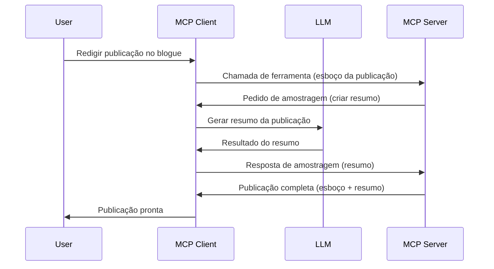

# Sampling - delegar funcionalidades ao Cliente

Por vezes, é necessário que o MCP Client e o MCP Server colaborem para alcançar um objetivo comum. Pode haver um caso em que o Servidor precise da ajuda de um LLM que está no cliente. Para esta situação, o sampling é o que deve usar.

Vamos explorar alguns casos de uso e como construir uma solução envolvendo sampling.

## Visão Geral

Nesta lição, focamo-nos em explicar quando e onde usar Sampling e como configurá-lo.

## Objetivos de Aprendizagem

Neste capítulo, iremos:

- Explicar o que é Sampling e quando usá-lo.
- Mostrar como configurar Sampling no MCP.
- Fornecer exemplos de Sampling em ação.

## O que é Sampling e porquê usá-lo?

Sampling é uma funcionalidade avançada que funciona da seguinte forma:


### Pedido de Sampling

Ok, agora que temos uma visão geral credível do cenário, vamos falar sobre o pedido de sampling que o servidor envia de volta ao cliente. Eis como esse pedido pode parecer no formato JSON-RPC:

```json
{
  "jsonrpc": "2.0",
  "id": 1,
  "method": "sampling/createMessage",
  "params": {
    "messages": [
      {
        "role": "user",
        "content": {
          "type": "text",
          "text": "Create a blog post summary of the following blog post: <BLOG POST>"
        }
      }
    ],
    "modelPreferences": {
      "hints": [
        {
          "name": "claude-3-sonnet"
        }
      ],
      "intelligencePriority": 0.8,
      "speedPriority": 0.5
    },
    "systemPrompt": "You are a helpful assistant.",
    "maxTokens": 100
  }
}
```

Há alguns pontos aqui que vale a pena destacar:

- Prompt, em content -> text, é o nosso prompt que é uma instrução para o LLM resumir o conteúdo do post do blog.

- **modelPreferences**. Esta secção é simplesmente isso, uma preferência, uma recomendação da configuração a usar com o LLM. O utilizador pode escolher aceitar estas recomendações ou alterá-las. Neste caso, há recomendações sobre o modelo a usar e prioridade entre velocidade e inteligência.
- **systemPrompt**, este é o seu prompt normal de sistema que dá personalidade ao seu LLM e contém instruções orientadoras.
- **maxTokens**, esta é outra propriedade usada para indicar quantos tokens são recomendados para esta tarefa.

### Resposta de Sampling

Esta resposta é o que o MCP Client acaba por enviar de volta ao MCP Server e é o resultado do cliente chamar o LLM, esperar por essa resposta e depois construir esta mensagem. Eis como pode parecer no formato JSON-RPC:

```json
{
  "jsonrpc": "2.0",
  "id": 1,
  "result": {
    "role": "assistant",
    "content": {
      "type": "text",
      "text": "Here's your abstract <ABSTRACT>"
    },
    "model": "gpt-5",
    "stopReason": "endTurn"
  }
}
```

Note como a resposta é um resumo do post do blog tal como pedimos. Note também que o `model` usado não é o que pedimos mas sim "gpt-5" em vez de "claude-3-sonnet". Isto serve para ilustrar que o utilizador pode mudar de ideias sobre o que usar e que o seu pedido de sampling é uma recomendação.

Ok, agora que entendemos o fluxo principal, e o útil caso de uso "criação de post de blog + resumo", vamos ver o que precisamos fazer para que funcione.

### Tipos de mensagens

As mensagens de Sampling não se limitam a texto, mas também podem enviar imagens e áudio. Eis como o JSON-RPC fica diferente:

**Texto**

```json
{
  "type": "text",
  "text": "The message content"
}
```

**Conteúdo de imagem**

```json
{
  "type": "image",
  "data": "base64-encoded-image-data",
  "mimeType": "image/jpeg"
}
```

**Conteúdo de áudio**

```json
{
  "type": "audio",
  "data": "base64-encoded-audio-data",
  "mimeType": "audio/wav"
}
```

> NOTE: para mais informações detalhadas sobre Sampling, consulte a [documentação oficial](https://modelcontextprotocol.io/specification/2025-06-18/client/sampling)

## Como Configurar Sampling no Cliente

> Nota: se estiver apenas a construir um servidor, não precisa de fazer muito aqui.

Num cliente, precisa de especificar a seguinte funcionalidade assim:

```json
{
  "capabilities": {
    "sampling": {}
  }
}
```

Isto será então detetado quando o seu cliente escolhido inicializar com o servidor.

## Exemplo de Sampling em Ação - Criar um Post de Blog

Vamos codificar um servidor de sampling juntos, precisaremos fazer o seguinte:

1. Criar uma ferramenta no Servidor.
1. Essa ferramenta deve criar um pedido de sampling.
1. A ferramenta deve esperar pela resposta ao pedido de sampling do cliente.
1. Depois deve produzir o resultado da ferramenta.

Vamos ver o código passo a passo:

### -1- Criar a ferramenta

**python**

```python
@mcp.tool()
async def create_blog(title: str, content: str, ctx: Context[ServerSession, None]) -> str:
    """Create a blog post and generate a summary"""

```

### -2- Criar um pedido de sampling

Estenda a sua ferramenta com o seguinte código:

**python**

```python
post = BlogPost(
        id=len(posts) + 1,
        title=title,
        content=content,
        abstract=""
    )

prompt = f"Create an abstract of the following blog post: title: {title} and draft: {content} "

result = await ctx.session.create_message(
        messages=[
            SamplingMessage(
                role="user",
                content=TextContent(type="text", text=prompt),
            )
        ],
        max_tokens=100,
)

```

### -3- Esperar pela resposta e devolver a resposta

**python**

```python
post.abstract = result.content.text

posts.append(post)

# devolver o produto completo
return json.dumps({
    "id": post.title,
    "abstract": post.abstract
})
```

### -4- Código completo

**python**

```python
from starlette.applications import Starlette
from starlette.routing import Mount, Host

from mcp.server.fastmcp import Context, FastMCP

from mcp.server.session import ServerSession
from mcp.types import SamplingMessage, TextContent

import json


from uuid import uuid4
from typing import List
from pydantic import BaseModel


mcp = FastMCP("Blog post generator")

# app = FastAPI()

posts = []

class BlogPost(BaseModel):
    id: int
    title: str
    content: str
    abstract: str

posts: List[BlogPost] = []

@mcp.tool()
async def create_blog(title: str, content: str, ctx: Context[ServerSession, None]) -> str:
    """Create a blog post and generate a summary"""

    post = BlogPost(
        id=len(posts) + 1,
        title=title,
        content=content,
        abstract=""
    )

    prompt = f"Create an abstract of the following blog post: title: {title} and draft: {content} "

    result = await ctx.session.create_message(
        messages=[
            SamplingMessage(
                role="user",
                content=TextContent(type="text", text=prompt),
            )
        ],
        max_tokens=100,
    )

    post.abstract = result.content.text

    posts.append(post)

    # retorna o post completo do blog
    return json.dumps({
        "id": post.title,
        "abstract": post.abstract
    })

if __name__ == "__main__":
    print("Starting server...")
    # mcp.run()
    mcp.run(transport="streamable-http")

# executar app com: python server.py
```

### -5- Testar no Visual Studio Code

Para testar isto no Visual Studio Code, faça o seguinte:

1. Inicie o servidor no terminal
1. Adicione-o ao *mcp.json* (e assegure-se que está iniciado), algo assim:

   ```json
   "servers": {
      "blog-server": {
        "type": "http",
        "url": "http://localhost:8000/mcp"
      }
   }
   ```

1. Escreva um prompt:

   ```text
   create a blog post named "Where Python comes from", the content is "Python is actually named after Monty Python Flying Circus"
   ```

1. Permita que o sampling aconteça. Na primeira vez que testar isto, será apresentado um diálogo adicional que precisa de aceitar, depois verá o diálogo normal para o pedido de execução de uma ferramenta.

1. Inspecione os resultados. Verá os resultados apresentados de forma agradável no GitHub Copilot Chat, mas também pode inspecionar a resposta JSON bruta.

**Bónus**. As ferramentas do Visual Studio Code têm ótimo suporte para sampling. Pode configurar o acesso a Sampling no seu servidor instalado navegando da seguinte forma:

1. Navegue para a secção de extensões.
1. Selecione o ícone de engrenagem para o seu servidor instalado na secção "MCP SERVERS - INSTALLED".
1. Selecione "Configure Model Access", aqui pode selecionar quais Modelos o GitHub Copilot pode usar ao executar sampling. Também pode ver todos os pedidos de sampling recentes selecionando "Show Sampling requests".

## Exercício

Neste exercício, irá construir um Sampling ligeiramente diferente, a saber uma integração de sampling que suporta a geração de uma descrição de produto. Eis o seu cenário:

**Cenário**: O colaborador do back office numa loja online precisa de ajuda, demora demasiado tempo a gerar descrições de produtos. Assim, você deve construir uma solução onde pode chamar uma ferramenta "create_product" com "title" e "keywords" como argumentos e esta deve produzir um produto completo incluindo um campo "description" que deverá ser preenchido pelo LLM do cliente.

DICA: use o que aprendeu anteriormente para construir este servidor e a sua ferramenta usando um pedido de sampling.

## Solução

[Solução](./solution/README.md)

## Conclusões Principais

Sampling é uma funcionalidade poderosa que permite ao servidor delegar tarefas ao cliente quando precisa da ajuda de um LLM.

## O que vem a seguir

- [Capítulo 4 - Implementação Prática](../../04-PracticalImplementation/README.md)

---

<!-- CO-OP TRANSLATOR DISCLAIMER START -->
**Aviso Legal**:  
Este documento foi traduzido utilizando o serviço de tradução automática [Co-op Translator](https://github.com/Azure/co-op-translator). Embora nos esforcemos pela precisão, esteja ciente de que traduções automáticas podem conter erros ou imprecisões. O documento original na sua língua nativa deve ser considerado a fonte autorizada. Para informações críticas, recomenda-se tradução profissional humana. Não nos responsabilizamos por quaisquer mal-entendidos ou interpretações incorretas decorrentes da utilização desta tradução.
<!-- CO-OP TRANSLATOR DISCLAIMER END -->