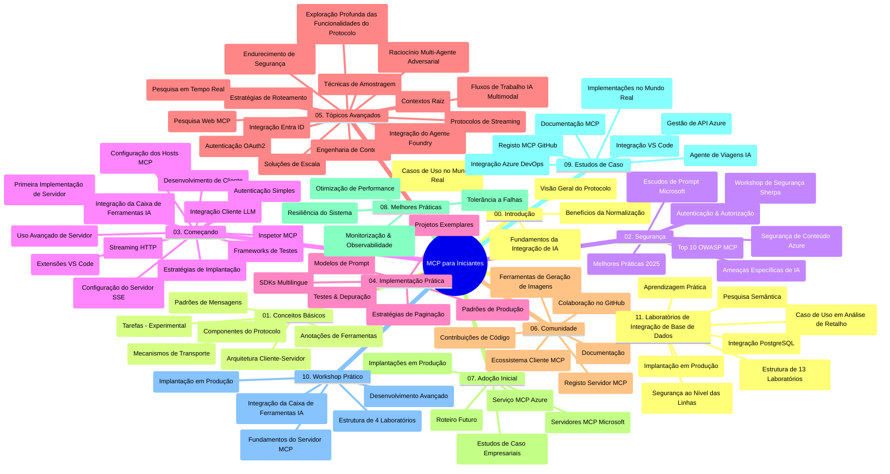

# Model Context Protocol (MCP) para Iniciantes - Guia de Estudo

Este guia de estudo fornece uma visão geral da estrutura e conteúdo do repositório para o currículo "Model Context Protocol (MCP) para Iniciantes". Utilize este guia para navegar no repositório de forma eficiente e aproveitar ao máximo os recursos disponíveis.

## Visão Geral do Repositório

O Model Context Protocol (MCP) é um framework standardizado para interações entre modelos de IA e aplicações cliente. Inicialmente criado pela Anthropic, o MCP é agora mantido pela comunidade mais ampla do MCP através da organização oficial no GitHub. Este repositório oferece um currículo abrangente com exemplos práticos de código em C#, Java, JavaScript, Python e TypeScript, destinado a desenvolvedores de IA, arquitetos de sistemas e engenheiros de software.

## Mapa Visual do Currículo

## Estrutura do Repositório

O repositório está organizado em onze secções principais, cada uma focando em diferentes aspetos do MCP:

1. **Introdução (00-Introduction/)**
   - Visão geral do Model Context Protocol
   - Por que a standardização é importante em pipelines de IA
   - Casos práticos de uso e benefícios

2. **Conceitos Fundamentais (01-CoreConcepts/)**
   - Arquitetura cliente-servidor
   - Componentes chave do protocolo
   - Padrões de mensagem no MCP

3. **Segurança (02-Security/)**
   - Ameaças de segurança em sistemas baseados no MCP
   - Boas práticas para implementar segurança
   - Estratégias de autenticação e autorização
   - **Documentação Completa de Segurança**:
     - Boas Práticas de Segurança MCP 2025
     - Guia de Implementação Azure Content Safety
     - Controlo e Técnicas de Segurança MCP
     - Referência Rápida de Boas Práticas MCP
   - **Tópicos Principais de Segurança**:
     - Ataques de injeção de prompt e envenenamento de ferramentas
     - Sequestro de sessão e problemas de agente confuso
     - Vulnerabilidades de passagem de token
     - Permissões excessivas e controlo de acesso
     - Segurança da cadeia de fornecimento para componentes de IA
     - Integração Microsoft Prompt Shields

4. **Início Rápido (03-GettingStarted/)**
   - Configuração e ambiente
   - Criação de servidores e clientes MCP básicos
   - Integração com aplicações existentes
   - Inclui secções para:
     - Primeira implementação de servidor
     - Desenvolvimento de cliente
     - Integração com cliente LLM
     - Integração VS Code
     - Servidor Server-Sent Events (SSE)
     - Uso avançado de servidor
     - Streaming HTTP
     - Integração AI Toolkit
     - Estratégias de teste
     - Diretrizes de deployment

5. **Implementação Prática (04-PracticalImplementation/)**
   - Uso dos SDKs em várias linguagens de programação
   - Técnicas de debugging, testes e validação
   - Criação de templates reutilizáveis de prompt e workflows
   - Projetos exemplares com exemplos de implementação

6. **Tópicos Avançados (05-AdvancedTopics/)**
   - Técnicas de engenharia de contexto
   - Integração de agentes Foundry
   - Workflows multimodais de IA
   - Demonstrações de autenticação OAuth2
   - Capacidades de pesquisa em tempo real
   - Streaming em tempo real
   - Implementação de root contexts
   - Estratégias de routing
   - Técnicas de sampling
   - Abordagens para escalabilidade
   - Considerações de segurança
   - Integração de segurança Entra ID
   - Integração de pesquisa web
   - Raciocínio multi-agente adversarial (padrões de debate)

7. **Contribuições da Comunidade (06-CommunityContributions/)**
   - Como contribuir com código e documentação
   - Colaboração via GitHub
   - Melhorias e feedback impulsionados pela comunidade
   - Uso de vários clientes MCP (Claude Desktop, Cline, VSCode)
   - Trabalho com servidores MCP populares incluindo geração de imagens

8. **Lições da Adoção Precoce (07-LessonsfromEarlyAdoption/)**
   - Implementações do mundo real e histórias de sucesso
   - Construção e deployment de soluções baseadas em MCP
   - Tendências e roadmap futuro
   - **Guia de Servidores Microsoft MCP**: Guia abrangente de 10 servidores Microsoft MCP prontos para produção incluindo:
     - Microsoft Learn Docs MCP Server
     - Azure MCP Server (15+ conectores especializados)
     - GitHub MCP Server
     - Azure DevOps MCP Server
     - MarkItDown MCP Server
     - SQL Server MCP Server
     - Playwright MCP Server
     - Dev Box MCP Server
     - Azure AI Foundry MCP Server
     - Microsoft 365 Agents Toolkit MCP Server

9. **Boas Práticas (08-BestPractices/)**
   - Otimização e tuning de performance
   - Conceção de sistemas MCP tolerantes a falhas
   - Estratégias para testes e resiliência

10. **Estudos de Caso (09-CaseStudy/)**
    - **Sete estudos de caso compreensivos** demonstrando a versatilidade do MCP em diversos cenários:
    - **Azure AI Travel Agents**: Orquestração multi-agente com Azure OpenAI e AI Search
    - **Integração Azure DevOps**: Automatização de processos de workflow com atualizações de dados YouTube
    - **Recuperação de Documentação em Tempo Real**: Cliente consola Python com streaming HTTP
    - **Gerador Interativo de Planos de Estudo**: App web Chainlit com IA conversacional
    - **Documentação no Editor**: Integração VS Code com workflows GitHub Copilot
    - **Gestão de API Azure**: Integração API empresarial com criação de servidor MCP
    - **Registro MCP GitHub**: Desenvolvimento de ecossistema e plataforma de integração agentic
    - Exemplos de implementação abrangendo integração empresarial, produtividade de desenvolvimento e desenvolvimento de ecossistema

11. **Workshop Prático (10-StreamliningAIWorkflowsBuildingAnMCPServerWithAIToolkit/)**
    - Workshop prático abrangente combinando MCP com AI Toolkit
    - Construção de aplicações inteligentes que ligam modelos de IA a ferramentas do mundo real
    - Módulos práticos cobrindo fundamentos, desenvolvimento de servidor personalizado e estratégias de deployment em produção
    - **Estrutura do Laboratório**:
      - Laboratório 1: Fundamentos do Servidor MCP
      - Laboratório 2: Desenvolvimento Avançado de Servidor MCP
      - Laboratório 3: Integração AI Toolkit
      - Laboratório 4: Deployment e Escalabilidade em Produção
    - Abordagem de aprendizagem baseada em laboratórios com instruções passo a passo

12. **Laboratórios de Integração de Bases de Dados MCP Server (11-MCPServerHandsOnLabs/)**
    - **Caminho de aprendizagem com 13 laboratórios** para construir servidores MCP prontos para produção com integração PostgreSQL
    - **Implementação de análise de retalho do mundo real** usando o caso de uso Zava Retail
    - **Padrões nível empresarial** incluindo Row Level Security (RLS), pesquisa semântica e acesso a dados multi-inquilino
    - **Estrutura Completa dos Laboratórios**:
      - **Laboratórios 00-03: Fundamentos** - Introdução, Arquitetura, Segurança, Configuração de Ambiente
      - **Laboratórios 04-06: Construção do Servidor MCP** - Design de Base de Dados, Implementação do Servidor MCP, Desenvolvimento de Ferramentas
      - **Laboratórios 07-09: Funcionalidades Avançadas** - Pesquisa Semântica, Testes & Debugging, Integração VS Code
      - **Laboratórios 10-12: Produção & Boas Práticas** - Deployment, Monitorização, Otimização
    - **Tecnologias Abrangidas**: Framework FastMCP, PostgreSQL, Azure OpenAI, Azure Container Apps, Application Insights
    - **Resultados de Aprendizagem**: Servidores MCP prontos para produção, padrões de integração de base de dados, análise potenciada por IA, segurança empresarial

## Recursos Adicionais

O repositório inclui recursos complementares:

- **Pasta de Imagens**: Contém diagramas e ilustrações usados ao longo do currículo
- **Traduções**: Suporte multi-idioma com traduções automáticas da documentação
- **Recursos Oficiais MCP**:
  - [Documentação MCP](https://modelcontextprotocol.io/)
  - [Especificação MCP](https://spec.modelcontextprotocol.io/)
  - [Repositório GitHub MCP](https://github.com/modelcontextprotocol)

## Como Usar Este Repositório

1. **Aprendizagem Sequencial**: Siga os capítulos pela ordem (00 até 11) para uma experiência de aprendizagem estruturada.
2. **Foco Específico em Linguagem**: Se tiver interesse numa linguagem específica, explore as diretórias de exemplos para implementações na sua linguagem preferida.
3. **Implementação Prática**: Comece pela secção "Início Rápido" para configurar o seu ambiente e criar o seu primeiro servidor e cliente MCP.
4. **Exploração Avançada**: Depois de familiarizado com o básico, aprofunde-se nos tópicos avançados para expandir o seu conhecimento.
5. **Envolvimento Comunitário**: Junte-se à comunidade MCP através das discussões no GitHub e canais Discord para conectar-se com especialistas e outros desenvolvedores.

## Clientes e Ferramentas MCP

O currículo cobre vários clientes e ferramentas MCP:

1. **Clientes Oficiais**:
   - Visual Studio Code
   - MCP no Visual Studio Code
   - Claude Desktop
   - Claude no VSCode
   - Claude API

2. **Clientes da Comunidade**:
   - Cline (terminal)
   - Cursor (editor de código)
   - ChatMCP
   - Windsurf

3. **Ferramentas de Gestão MCP**:
   - MCP CLI
   - MCP Manager
   - MCP Linker
   - MCP Router

## Servidores MCP Populares

O repositório apresenta vários servidores MCP, incluindo:

1. **Servidores Microsoft MCP Oficiais**:
   - Microsoft Learn Docs MCP Server
   - Azure MCP Server (15+ conectores especializados)
   - GitHub MCP Server
   - Azure DevOps MCP Server
   - MarkItDown MCP Server
   - SQL Server MCP Server
   - Playwright MCP Server
   - Dev Box MCP Server
   - Azure AI Foundry MCP Server
   - Microsoft 365 Agents Toolkit MCP Server

2. **Servidores de Referência Oficiais**:
   - Filesystem
   - Fetch
   - Memory
   - Sequential Thinking

3. **Geração de Imagens**:
   - Azure OpenAI DALL-E 3
   - Stable Diffusion WebUI
   - Replicate

4. **Ferramentas de Desenvolvimento**:
   - Git MCP
   - Terminal Control
   - Code Assistant

5. **Servidores Especializados**:
   - Salesforce
   - Microsoft Teams
   - Jira & Confluence

## Contribuir

Este repositório recebe de bom grado contribuições da comunidade. Consulte a secção Contribuições da Comunidade para orientações sobre como contribuir de forma eficaz para o ecossistema MCP.

----

*Este guia de estudo foi atualizado pela última vez a 5 de fevereiro de 2026, refletindo a última Especificação MCP 2025-11-25 e fornece uma visão geral do repositório até essa data. O conteúdo do repositório pode ser atualizado após essa data.*

---

<!-- CO-OP TRANSLATOR DISCLAIMER START -->
**Aviso Legal**:  
Este documento foi traduzido utilizando o serviço de tradução automática [Co-op Translator](https://github.com/Azure/co-op-translator). Embora nos esforcemos pela precisão, por favor tenha em atenção que traduções automáticas podem conter erros ou imprecisões. O documento original na sua língua nativa deve ser considerado a fonte autorizada. Para informações críticas, recomenda-se tradução profissional por humanos. Não nos responsabilizamos por quaisquer mal-entendidos ou interpretações incorretas decorrentes da utilização desta tradução.
<!-- CO-OP TRANSLATOR DISCLAIMER END -->