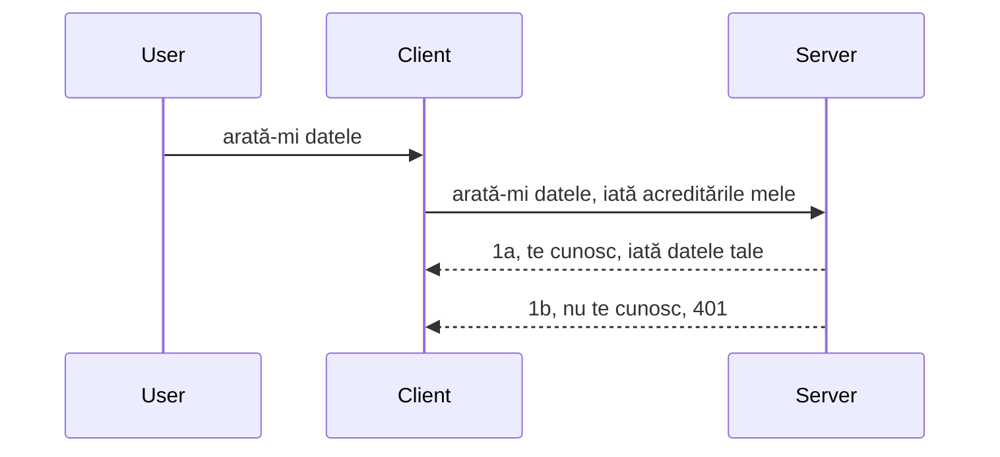

# Autentificare simplă

SDK-urile MCP suportă utilizarea OAuth 2.1, care, să fim sinceri, este un proces destul de complex ce implică concepte precum server de autentificare, server de resurse, trimiterea acreditărilor, obținerea unui cod, schimbarea codului pentru un token bearer până când în final se pot obține datele resursei. Dacă nu ești obișnuit cu OAuth, care este o metodă excelentă de implementat, este o idee bună să începi cu un nivel de bază de autentificare și să construiești până la o securitate tot mai bună. De aceea există acest capitol, pentru a te ajuta să ajungi la o autentificare mai avansată.

## Autentificare, ce înțelegem prin asta?

Auth este prescurtarea pentru autentificare și autorizare. Ideea este că trebuie să facem două lucruri:

- **Autentificarea**, care este procesul de a determina dacă lăsăm o persoană să intre în casa noastră, că are dreptul de a fi „aici”, adică să aibă acces la serverul nostru de resurse unde funcționalitățile MCP Server-ului nostru trăiesc.
- **Autorizarea**, este procesul de a afla dacă un utilizator ar trebui să aibă acces la aceste resurse specifice pe care le solicită, de exemplu aceste comenzi sau aceste produse, sau dacă este permis să citească conținutul dar nu să șteargă, ca alt exemplu.

## Acreditări: cum spunem sistemului cine suntem

Ei bine, cei mai mulți dezvoltatori web încep să gândească în termeni de oferire a unei acreditări serverului, de obicei un secret care spune dacă pot fi aici „autentificare”. Această acreditare este de obicei o versiune encodificată base64 a unui nume de utilizator și a unei parole sau o cheie API care identifică în mod unic un utilizator specific.

Aceasta implică trimiterea ei printr-un header numit „Authorization” astfel:

```json
{ "Authorization": "secret123" }
```

Aceasta este de obicei denumită autentificare de bază. Cum funcționează întregul flux este în felul următor:


Acum că înțelegem cum funcționează din punct de vedere al fluxului, cum îl implementăm? Ei bine, majoritatea serverelor web au un concept numit middleware, un fragment de cod care rulează ca parte a cererii și poate verifica acreditările, iar dacă acestea sunt valide, poate lăsa cererea să treacă. Dacă cererea nu are acreditări valide, atunci primești o eroare de autentificare. Să vedem cum se poate implementa asta:

**Python**

```python
class AuthMiddleware(BaseHTTPMiddleware):
    async def dispatch(self, request, call_next):

        has_header = request.headers.get("Authorization")
        if not has_header:
            print("-> Missing Authorization header!")
            return Response(status_code=401, content="Unauthorized")

        if not valid_token(has_header):
            print("-> Invalid token!")
            return Response(status_code=403, content="Forbidden")

        print("Valid token, proceeding...")
       
        response = await call_next(request)
        # adaugă orice anteturi ale clientului sau modifică răspunsul într-un anumit fel
        return response


starlette_app.add_middleware(CustomHeaderMiddleware)
```

Aici avem:

- Creat un middleware numit `AuthMiddleware` unde metoda sa `dispatch` este invocată de serverul web.
- Adăugat middleware-ul la serverul web:

    ```python
    starlette_app.add_middleware(AuthMiddleware)
    ```

- Scris logica de validare care verifică dacă headerul Authorization este prezent și dacă secretul trimis este valid:

    ```python
    has_header = request.headers.get("Authorization")
    if not has_header:
        print("-> Missing Authorization header!")
        return Response(status_code=401, content="Unauthorized")

    if not valid_token(has_header):
        print("-> Invalid token!")
        return Response(status_code=403, content="Forbidden")
    ```

    dacă secretul este prezent și valid atunci lăsăm cererea să treacă apelând `call_next` și returnăm răspunsul.

    ```python
    response = await call_next(request)
    # adaugă orice anteturi pentru client sau modifică răspunsul într-un fel
    return response
    ```

Cum funcționează este că dacă o cerere web este făcută către server, middleware-ul va fi invocat și, dat fiind implementarea, va lăsa cererea să treacă sau va returna o eroare care indică faptul că clientul nu are voie să înainteze.

**TypeScript**

Aici creăm un middleware cu popularul framework Express și interceptăm cererea înainte să ajungă la MCP Server. Iată codul pentru asta:

```typescript
function isValid(secret) {
    return secret === "secret123";
}

app.use((req, res, next) => {
    // 1. Antetul de autorizare este prezent?
    if(!req.headers["Authorization"]) {
        res.status(401).send('Unauthorized');
    }
    
    let token = req.headers["Authorization"];

    // 2. Verifică validitatea.
    if(!isValid(token)) {
        res.status(403).send('Forbidden');
    }

   
    console.log('Middleware executed');
    // 3. Transmite cererea la următorul pas din fluxul de procesare.
    next();
});
```

În acest cod:

1. Verificăm dacă headerul Authorization este prezent, altfel trimitem eroare 401.
2. Ne asigurăm că acreditarea/tokenul este valid, dacă nu trimitem eroare 403.
3. În final, trecem mai departe cererea în pipeline și returnăm resursa solicitată.

## Exercițiu: Implementarea autentificării

Să luăm cunoștințele noastre și să încercăm să o implementăm. Iată planul:

Server

- Creăm un server web și o instanță MCP.
- Implementăm un middleware pentru server.

Client

- Trimite o cerere web, cu acreditare, prin header.

### -1- Crearea unui server web și a unei instanțe MCP

La primul pas, trebuie să creăm instanța serverului web și MCP Server-ul.

**Python**

Aici creăm o instanță MCP Server, creăm o aplicație starlette web și o găzduim cu uvicorn.

```python
# crearea serverului MCP

app = FastMCP(
    name="MCP Resource Server",
    instructions="Resource Server that validates tokens via Authorization Server introspection",
    host=settings["host"],
    port=settings["port"],
    debug=True
)

# crearea aplicației web starlette
starlette_app = app.streamable_http_app()

# servirea aplicației prin uvicorn
async def run(starlette_app):
    import uvicorn
    config = uvicorn.Config(
            starlette_app,
            host=app.settings.host,
            port=app.settings.port,
            log_level=app.settings.log_level.lower(),
        )
    server = uvicorn.Server(config)
    await server.serve()

run(starlette_app)
```

În acest cod:

- Cream MCP Server.
- Construim aplicația starlette web din MCP Server, `app.streamable_http_app()`.
- Găzduim și servim aplicația web folosind uvicorn `server.serve()`.

**TypeScript**

Aici creăm o instanță MCP Server.

```typescript
const server = new McpServer({
      name: "example-server",
      version: "1.0.0"
    });

    // ... configurează resursele serverului, uneltele și instrucțiunile ...
```

Această creare a MCP Server-ului trebuie să aibă loc în definiția noastră de rută POST /mcp, așa că hai să luăm codul de mai sus și să-l mutăm astfel:

```typescript
import express from "express";
import { randomUUID } from "node:crypto";
import { McpServer } from "@modelcontextprotocol/sdk/server/mcp.js";
import { StreamableHTTPServerTransport } from "@modelcontextprotocol/sdk/server/streamableHttp.js";
import { isInitializeRequest } from "@modelcontextprotocol/sdk/types.js"

const app = express();
app.use(express.json());

// Hartă pentru stocarea transporturilor după ID-ul sesiunii
const transports: { [sessionId: string]: StreamableHTTPServerTransport } = {};

// Gestionați cererile POST pentru comunicarea client-server
app.post('/mcp', async (req, res) => {
  // Verificați dacă există ID-ul sesiunii
  const sessionId = req.headers['mcp-session-id'] as string | undefined;
  let transport: StreamableHTTPServerTransport;

  if (sessionId && transports[sessionId]) {
    // Reutilizați transportul existent
    transport = transports[sessionId];
  } else if (!sessionId && isInitializeRequest(req.body)) {
    // Cerere nouă de inițializare
    transport = new StreamableHTTPServerTransport({
      sessionIdGenerator: () => randomUUID(),
      onsessioninitialized: (sessionId) => {
        // Stocați transportul după ID-ul sesiunii
        transports[sessionId] = transport;
      },
      // Protecția împotriva reasignării DNS este dezactivată implicit pentru compatibilitate inversă. Dacă rulați acest server
      // local, asigurați-vă că setați:
      // enableDnsRebindingProtection: true,
      // allowedHosts: ['127.0.0.1'],
    });

    // Eliminați transportul când este închis
    transport.onclose = () => {
      if (transport.sessionId) {
        delete transports[transport.sessionId];
      }
    };
    const server = new McpServer({
      name: "example-server",
      version: "1.0.0"
    });

    // ... configurați resursele, uneltele și mesajele serverului ...

    // Conectați-vă la serverul MCP
    await server.connect(transport);
  } else {
    // Cerere invalidă
    res.status(400).json({
      jsonrpc: '2.0',
      error: {
        code: -32000,
        message: 'Bad Request: No valid session ID provided',
      },
      id: null,
    });
    return;
  }

  // Gestionați cererea
  await transport.handleRequest(req, res, req.body);
});

// Handler reutilizabil pentru cererile GET și DELETE
const handleSessionRequest = async (req: express.Request, res: express.Response) => {
  const sessionId = req.headers['mcp-session-id'] as string | undefined;
  if (!sessionId || !transports[sessionId]) {
    res.status(400).send('Invalid or missing session ID');
    return;
  }
  
  const transport = transports[sessionId];
  await transport.handleRequest(req, res);
};

// Gestionați cererile GET pentru notificările server-to-client prin SSE
app.get('/mcp', handleSessionRequest);

// Gestionați cererile DELETE pentru terminarea sesiunii
app.delete('/mcp', handleSessionRequest);

app.listen(3000);
```

Acum vezi cum crearea MCP Server-ului a fost mutată în interiorul `app.post("/mcp")`.

Să trecem la pasul următor de a crea middleware-ul pentru a valida acreditarea primită.

### -2- Implementarea unui middleware pentru server

Să trecem la partea de middleware. Aici vom crea un middleware care caută o acreditare în headerul `Authorization` și o validează. Dacă este acceptabilă, cererea va continua să facă ce trebuie (ex. listarea uneltelor, citirea unei resurse sau funcționalitatea MCP solicitată de client).

**Python**

Pentru a crea middleware-ul, trebuie să creăm o clasă care moștenește `BaseHTTPMiddleware`. Sunt două părți interesante:

- Cererea `request`, din care citim informațiile din header.
- `call_next` callback-ul pe care trebuie să-l chemăm dacă clientul a adus o acreditare pe care o acceptăm.

În primul rând, trebuie să gestionăm cazul în care headerul `Authorization` lipsește:

```python
has_header = request.headers.get("Authorization")

# niciun antet prezent, eșuează cu 401, altfel continuă.
if not has_header:
    print("-> Missing Authorization header!")
    return Response(status_code=401, content="Unauthorized")
```

Aici trimitem mesaj 401 unauthorized deoarece clientul eșuează la autentificare.

Apoi, dacă a fost trimisă o acreditare, trebuie să-i verificăm validitatea astfel:

```python
 if not valid_token(has_header):
    print("-> Invalid token!")
    return Response(status_code=403, content="Forbidden")
```

Observă cum trimitem un mesaj 403 forbidden mai sus. Să vedem middleware-ul complet mai jos care implementează tot ce am menționat:

```python
class AuthMiddleware(BaseHTTPMiddleware):
    async def dispatch(self, request, call_next):

        has_header = request.headers.get("Authorization")
        if not has_header:
            print("-> Missing Authorization header!")
            return Response(status_code=401, content="Unauthorized")

        if not valid_token(has_header):
            print("-> Invalid token!")
            return Response(status_code=403, content="Forbidden")

        print("Valid token, proceeding...")
        print(f"-> Received {request.method} {request.url}")
        response = await call_next(request)
        response.headers['Custom'] = 'Example'
        return response

```

Foarte bine, dar ce face funcția `valid_token`? Iată-o mai jos:

```python
# NU utilizați pentru producție - îmbunătățiți-l !!
def valid_token(token: str) -> bool:
    # eliminați prefixul "Bearer "
    if token.startswith("Bearer "):
        token = token[7:]
        return token == "secret-token"
    return False
```

Evident că asta ar trebui îmbunătățită.

IMPORTANT: NU ar trebui NICIODATĂ să ai secrete de genul acesta în cod. Ar trebui ideal să preiei valoarea cu care compari dintr-o sursă de date sau de la un IDP (furnizor de identitate) sau, mai bine, să lași IDP-ul să facă validarea.

**TypeScript**

Pentru a implementa asta cu Express, trebuie să folosim metoda `use` care preia funcții middleware.

Trebuie să:

- Interacționăm cu variabila cerere pentru a verifica acreditarea transmisă în proprietatea `Authorization`.
- Validăm acreditarea și, dacă este validă, lăsăm cererea să continue ca solicitarea MCP a clientului să facă ce trebuie (ex. listare unelte, citire resurse sau orice altceva legat de MCP).

Aici verificăm dacă headerul `Authorization` este prezent, dacă nu, oprim cererea să continue:

```typescript
if(!req.headers["authorization"]) {
    res.status(401).send('Unauthorized');
    return;
}
```

Dacă headerul nu este trimis deloc, primești 401.

Apoi verificăm dacă acreditarea este validă, dacă nu oprim iar cererea cu un mesaj puțin diferit:

```typescript
if(!isValid(token)) {
    res.status(403).send('Forbidden');
    return;
} 
```

Observă cum acum primești eroarea 403.

Iată codul complet:

```typescript
app.use((req, res, next) => {
    console.log('Request received:', req.method, req.url, req.headers);
    console.log('Headers:', req.headers["authorization"]);
    if(!req.headers["authorization"]) {
        res.status(401).send('Unauthorized');
        return;
    }
    
    let token = req.headers["authorization"];

    if(!isValid(token)) {
        res.status(403).send('Forbidden');
        return;
    }  

    console.log('Middleware executed');
    next();
});
```

Am configurat serverul web să accepte un middleware care verifică acreditarea pe care clientul ni-o trimite. Dar clientul?

### -3- Trimiterea cererii web cu acreditare prin header

Trebuie să ne asigurăm că clientul transmite acreditarea prin header. Deoarece vom folosi un client MCP pentru asta, trebuie să vedem cum se face.

**Python**

Pentru client, trebuie să transmitem un header cu acreditarea noastră astfel:

```python
# NU codifica valoarea direct, păstreaz-o cel puțin într-o variabilă de mediu sau un spațiu de stocare mai sigur
token = "secret-token"

async with streamablehttp_client(
        url = f"http://localhost:{port}/mcp",
        headers = {"Authorization": f"Bearer {token}"}
    ) as (
        read_stream,
        write_stream,
        session_callback,
    ):
        async with ClientSession(
            read_stream,
            write_stream
        ) as session:
            await session.initialize()
      
            # TODO, ce vrei să faci în client, de ex. listarea uneltelor, apelarea uneltelor etc.
```

Observă cum populăm proprietatea `headers` astfel ` headers = {"Authorization": f"Bearer {token}"}`.

**TypeScript**

Putem rezolva asta în doi pași:

1. Populăm un obiect de configurație cu acreditarea noastră.
2. Transmitem obiectul de configurație transportului.

```typescript

// NU codifica valoarea fixă așa cum este prezentat aici. Cel puțin păstreaz-o ca o variabilă de mediu și folosește ceva de genul dotenv (în modul de dezvoltare).
let token = "secret123"

// definește un obiect pentru opțiunea de transport a clientului
let options: StreamableHTTPClientTransportOptions = {
  sessionId: sessionId,
  requestInit: {
    headers: {
      "Authorization": "secret123"
    }
  }
};

// transmite obiectul de opțiuni către transport
async function main() {
   const transport = new StreamableHTTPClientTransport(
      new URL(serverUrl),
      options
   );
```

Aici vezi cum am creat obiectul `options` și am plasat headerele sub proprietatea `requestInit`.

IMPORTANT: Cum îmbunătățim asta de aici? Ei bine, implementarea curentă are câteva probleme. În primul rând, trimiterea unei acreditări astfel este destul de riscantă, decât dacă ai cel puțin HTTPS. Chiar și atunci, acreditarea poate fi furată, așa că ai nevoie de un sistem unde poți revoca cu ușurință tokenul și să adaugi verificări suplimentare precum de unde vine în lume, dacă cererea se face prea des (comportament asemănător botului), pe scurt, sunt o mulțime de aspecte. 

Trebuie spus însă, că pentru API-uri foarte simple unde nu vrei ca nimeni să apeleze API-ul fără autentificare, ce avem aici este un început bun.

Cu toate acestea, să încercăm să întărim securitatea puțin folosind un format standardizat precum JSON Web Token, cunoscut și ca JWT sau „JOT”.

## JSON Web Tokens, JWT

Deci, încercăm să îmbunătățim lucrurile față de simpla trimitere a acreditărilor. Care sunt îmbunătățirile imediate pe care le obținem adoptând JWT?

- **Îmbunătățiri de securitate**. În autentificarea de bază, trimiți numele de utilizator și parola ca token encodificat base64 (sau o cheie API) iar și iar, ceea ce crește riscul. Cu JWT, trimiți numele de utilizator și parola și primești un token în schimb, care este și limitat în timp, adică expiră. JWT îți permite să folosești control fin al accesului folosind roluri, scope-uri și permisiuni.
- **Fără stare și scalabilitate**. JWT-urile sunt auto-conținute, poartă toate informațiile utilizatorului și elimină necesitatea de stocare server-side a sesiunii. Tokenul se poate valida și local.
- **Interoperabilitate și federație**. JWT-ul este central pentru Open ID Connect și este folosit cu furnizori cunoscuți de identitate ca Entra ID, Google Identity și Auth0. De asemenea, permite folosirea single sign on și multe altele, făcându-l de nivel enterprise.
- **Modularitate și flexibilitate**. JWT-urile pot fi folosite și cu API Gateway-uri precum Azure API Management, NGINX și altele. Suportă și scenarii de autentificare și comunicare server-la-server, incluzând scenarii de impersonare și delegare.
- **Performanță și caching**. JWT-urile pot fi puse în cache după decodare, ceea ce reduce nevoia de parsing. Acest lucru ajută în aplicațiile cu trafic mare, îmbunătățind debitul și reducând încărcarea infrastructurii.
- **Funcționalități avansate**. Suportă introspecția (verificarea validității pe server) și revocarea (facerea token-ului invalid).

Cu toate aceste beneficii, să vedem cum putem duce implementarea noastră la nivelul următor.

## Transformarea autentificării de bază în JWT

Așadar, schimbările la nivel înalt sunt:

- **Învățăm să construim un token JWT** și să-l pregătim pentru a fi trimis de client către server.
- **Validăm un token JWT**, și dacă e valid, lăsăm clientul să acceseze resursele.
- **Stocare sigură a tokenului**. Cum păstrăm acest token.
- **Protejarea rutelor**. Trebuie să protejăm rutele, în cazul nostru, rutele și funcționalitățile MCP specifice.
- **Adăugarea tokenurilor de refresh**. Ne asigurăm că creăm tokenuri cu durată scurtă de viață, dar și tokenuri de refresh cu durată lungă, care pot fi folosite pentru a obține tokenuri noi dacă cele vechi expiră. De asemenea, să existe un endpoint de refresh și o strategie de rotație.

### -1- Construirea unui token JWT

Mai întâi, un token JWT are următoarele părți:

- **header**, algoritmul folosit și tipul tokenului.
- **payload**, revendicările (claims), ca subiect (sub - utilizatorul sau entitatea reprezentată de token, de obicei userid în scenariul de autentificare), exp (data expirării) rolul (role)
- **semnătura**, semnată cu un secret sau o cheie privată.

Pentru asta, trebuie să construim header-ul, payload-ul și tokenul encodat.

**Python**

```python

import jwt
import jwt
from jwt.exceptions import ExpiredSignatureError, InvalidTokenError
import datetime

# Cheia secretă utilizată pentru a semna JWT-ul
secret_key = 'your-secret-key'

header = {
    "alg": "HS256",
    "typ": "JWT"
}

# informațiile utilizatorului și revendicările sale și timpul de expirare
payload = {
    "sub": "1234567890",               # Subiect (ID-ul utilizatorului)
    "name": "User Userson",                # Revendicare personalizată
    "admin": True,                     # Revendicare personalizată
    "iat": datetime.datetime.utcnow(),# Emiterea la
    "exp": datetime.datetime.utcnow() + datetime.timedelta(hours=1)  # Expirare
}

# criptare
encoded_jwt = jwt.encode(payload, secret_key, algorithm="HS256", headers=header)
```

În codul de mai sus am:

- Definit un header folosind HS256 ca algoritm și tipul ca JWT.
- Construim un payload care conține subiectul sau id-ul utilizatorului, un nume de utilizator, un rol, când a fost emis și când expiră, implementând astfel aspectul limitat în timp pe care l-am menționat mai devreme.

**TypeScript**

Aici vom avea nevoie de câteva dependențe care ne vor ajuta să construim tokenul JWT.

Dependențe

```sh

npm install jsonwebtoken
npm install --save-dev @types/jsonwebtoken
```

Acum că avem asta, să creăm headerul, payloadul și astfel să creăm tokenul encodat.

```typescript
import jwt from 'jsonwebtoken';

const secretKey = 'your-secret-key'; // Folosește variabile de mediu în producție

// Definirea sarcinii utile
const payload = {
  sub: '1234567890',
  name: 'User usersson',
  admin: true,
  iat: Math.floor(Date.now() / 1000), // Emis la
  exp: Math.floor(Date.now() / 1000) + 60 * 60 // Expiră în 1 oră
};

// Definirea antetului (opțional, jsonwebtoken setează implicit)
const header = {
  alg: 'HS256',
  typ: 'JWT'
};

// Creare token
const token = jwt.sign(payload, secretKey, {
  algorithm: 'HS256',
  header: header
});

console.log('JWT:', token);
```

Acest token este:

Semnat folosind HS256
Valabil 1 oră
Include revendicări ca sub, name, admin, iat și exp.

### -2- Validarea unui token

Trebuie să validăm un token; asta ar trebui făcut pe server pentru a ne asigura că ce trimite clientul este valid. Trebuie să facem multe verificări aici, de la validarea structurii tokenului până la validitatea lui. E încurajat să adaugi și alte verificări pentru a vedea dacă utilizatorul este în sistemul tău și altele.

Pentru a valida un token, trebuie să îl decodăm ca să-l putem citi și apoi să începem verificările de validitate:

**Python**

```python

# Decodează și verifică JWT-ul
try:
    decoded = jwt.decode(token, secret_key, algorithms=["HS256"])
    print("✅ Token is valid.")
    print("Decoded claims:")
    for key, value in decoded.items():
        print(f"  {key}: {value}")
except ExpiredSignatureError:
    print("❌ Token has expired.")
except InvalidTokenError as e:
    print(f"❌ Invalid token: {e}")

```

În acest cod, apelăm `jwt.decode` folosind tokenul, cheia secretă și algoritmul ales ca input. Observă folosirea unui bloc try-catch pentru că o validare eșuată declanșează o excepție.

**TypeScript**

Aici trebuie să apelăm `jwt.verify` pentru a obține o versiune decodată a tokenului pe care o putem analiza mai departe. Dacă acest apel eșuează, înseamnă că structura tokenului este incorectă sau nu mai este valid.

```typescript

try {
  const decoded = jwt.verify(token, secretKey);
  console.log('Decoded Payload:', decoded);
} catch (err) {
  console.error('Token verification failed:', err);
}
```

NOTĂ: cum am menționat anterior, ar trebui să efectuăm verificări suplimentare pentru a confirma că acest token identifică un utilizator din sistemul nostru și pentru a asigura că utilizatorul are drepturile pe care le revendică.

Următorul pas: să aruncăm o privire la controlul accesului bazat pe roluri, cunoscut și ca RBAC.
## Adăugarea controlului accesului bazat pe roluri

Ideea este că vrem să exprimăm că diferite roluri au permisiuni diferite. De exemplu, presupunem că un administrator poate face totul, un utilizator normal poate citi/scrie, iar un invitat poate doar să citească. Prin urmare, iată câteva niveluri posibile de permisiuni:

- Admin.Write  
- User.Read  
- Guest.Read  

Să vedem cum putem implementa un astfel de control cu middleware. Middleware-urile pot fi adăugate pe rute specifice, precum și pentru toate rutele.

**Python**

```python
from starlette.middleware.base import BaseHTTPMiddleware
from starlette.responses import JSONResponse
import jwt

# NU pune secretul în cod, acesta este doar pentru scopuri demonstrative. Citește-l dintr-un loc sigur.
SECRET_KEY = "your-secret-key" # pune asta într-o variabilă de mediu
REQUIRED_PERMISSION = "User.Read"

class JWTPermissionMiddleware(BaseHTTPMiddleware):
    async def dispatch(self, request, call_next):
        auth_header = request.headers.get("Authorization")
        if not auth_header or not auth_header.startswith("Bearer "):
            return JSONResponse({"error": "Missing or invalid Authorization header"}, status_code=401)

        token = auth_header.split(" ")[1]
        try:
            decoded = jwt.decode(token, SECRET_KEY, algorithms=["HS256"])
        except jwt.ExpiredSignatureError:
            return JSONResponse({"error": "Token expired"}, status_code=401)
        except jwt.InvalidTokenError:
            return JSONResponse({"error": "Invalid token"}, status_code=401)

        permissions = decoded.get("permissions", [])
        if REQUIRED_PERMISSION not in permissions:
            return JSONResponse({"error": "Permission denied"}, status_code=403)

        request.state.user = decoded
        return await call_next(request)


```
  
Există câteva moduri diferite de a adăuga middleware-ul, cum este mai jos:

```python

# Alt 1: adaugă middleware în timp ce construiești aplicația starlette
middleware = [
    Middleware(JWTPermissionMiddleware)
]

app = Starlette(routes=routes, middleware=middleware)

# Alt 2: adaugă middleware după ce aplicația starlette este deja construită
starlette_app.add_middleware(JWTPermissionMiddleware)

# Alt 3: adaugă middleware pentru fiecare rută
routes = [
    Route(
        "/mcp",
        endpoint=..., # handler
        middleware=[Middleware(JWTPermissionMiddleware)]
    )
]
```
  
**TypeScript**

Putem folosi `app.use` și un middleware care va rula pentru toate cererile.

```typescript
app.use((req, res, next) => {
    console.log('Request received:', req.method, req.url, req.headers);
    console.log('Headers:', req.headers["authorization"]);

    // 1. Verifică dacă antetul de autorizare a fost trimis

    if(!req.headers["authorization"]) {
        res.status(401).send('Unauthorized');
        return;
    }
    
    let token = req.headers["authorization"];

    // 2. Verifică dacă tokenul este valid
    if(!isValid(token)) {
        res.status(403).send('Forbidden');
        return;
    }  

    // 3. Verifică dacă utilizatorul tokenului există în sistemul nostru
    if(!isExistingUser(token)) {
        res.status(403).send('Forbidden');
        console.log("User does not exist");
        return;
    }
    console.log("User exists");

    // 4. Verifică dacă tokenul are permisiunile corecte
    if(!hasScopes(token, ["User.Read"])){
        res.status(403).send('Forbidden - insufficient scopes');
    }

    console.log("User has required scopes");

    console.log('Middleware executed');
    next();
});

```
  
Există destul de multe lucruri pe care le putem lăsa middleware-ului nostru să le facă și pe care middleware-ul NOSTRU TREBUIE să le facă, și anume:

1. Verifică dacă header-ul de autorizare este prezent  
2. Verifică dacă tokenul este valid, apelăm `isValid` care este o metodă pe care am scris-o și care verifică integritatea și valabilitatea tokenului JWT.  
3. Verifică dacă utilizatorul există în sistemul nostru, acest lucru trebuie verificat.

   ```typescript
    // utilizatori în baza de date
   const users = [
     "user1",
     "User usersson",
   ]

   function isExistingUser(token) {
     let decodedToken = verifyToken(token);

     // TODO, verifică dacă utilizatorul există în baza de date
     return users.includes(decodedToken?.name || "");
   }
   ```
  
De mai sus, am creat o listă foarte simplă `users`, care ar trebui să fie evident într-o bază de date.

4. Suplimentar, ar trebui să verificăm și dacă tokenul are permisiunile corecte.

   ```typescript
   if(!hasScopes(token, ["User.Read"])){
        res.status(403).send('Forbidden - insufficient scopes');
   }
   ```
  
În codul de mai sus din middleware, verificăm că tokenul conține permisiunea User.Read, dacă nu, trimitem un error 403. Mai jos este metoda helper `hasScopes`.

   ```typescript
   function hasScopes(scope: string, requiredScopes: string[]) {
     let decodedToken = verifyToken(scope);
    return requiredScopes.every(scope => decodedToken?.scopes.includes(scope));
  }  
   ```

Have a think which additional checks you should be doing, but these are the absolute minimum of checks you should be doing.

Using Express as a web framework is a common choice. There are helpers library when you use JWT so you can write less code.

- `express-jwt`, helper library that provides a middleware that helps decode your token.
- `express-jwt-permissions`, this provides a middleware `guard` that helps check if a certain permission is on the token.

Here's what these libraries can look like when used:

```typescript
const express = require('express');
const jwt = require('express-jwt');
const guard = require('express-jwt-permissions')();

const app = express();
const secretKey = 'your-secret-key'; // put this in env variable

// Decode JWT and attach to req.user
app.use(jwt({ secret: secretKey, algorithms: ['HS256'] }));

// Check for User.Read permission
app.use(guard.check('User.Read'));

// multiple permissions
// app.use(guard.check(['User.Read', 'Admin.Access']));

app.get('/protected', (req, res) => {
  res.json({ message: `Welcome ${req.user.name}` });
});

// Error handler
app.use((err, req, res, next) => {
  if (err.code === 'permission_denied') {
    return res.status(403).send('Forbidden');
  }
  next(err);
});

```
  
Acum că ai văzut cum middleware-ul poate fi folosit atât pentru autentificare, cât și pentru autorizare, cum rămâne cu MCP, schimbă modul în care facem autentificarea? Să aflăm în următoarea secțiune.

### -3- Adăugarea RBAC la MCP

Ai văzut până acum cum poți adăuga RBAC prin middleware, dar pentru MCP nu există o metodă ușoară de a adăuga RBAC per funcționalitate MCP, așa că ce facem? Ei bine, trebuie doar să adăugăm cod ca acesta care verifică, în acest caz, dacă clientul are drepturile să apeleze un anumit instrument:

Ai câteva variante diferite despre cum să realizezi RBAC per funcționalitate, iată câteva:

- Adaugă o verificare pentru fiecare instrument, resursă, prompt unde trebuie să verifici nivelul de permisiune.

   **python**

   ```python
   @tool()
   def delete_product(id: int):
      try:
          check_permissions(role="Admin.Write", request)
      catch:
        pass # clientul a eșuat la autorizare, ridică eroarea de autorizare
   ```
  
   **typescript**

   ```typescript
   server.registerTool(
    "delete-product",
    {
      title: Delete a product",
      description: "Deletes a product",
      inputSchema: { id: z.number() }
    },
    async ({ id }) => {
      
      try {
        checkPermissions("Admin.Write", request);
        // de făcut, trimite id la productService și intrarea la distanță
      } catch(Exception e) {
        console.log("Authorization error, you're not allowed");  
      }

      return {
        content: [{ type: "text", text: `Deletected product with id ${id}` }]
      };
    }
   );
   ```


- Folosește o abordare avansată pe server și handler-ele cererilor ca să minimizezi câte locuri trebuie să faci această verificare.

   **Python**

   ```python
   
   tool_permission = {
      "create_product": ["User.Write", "Admin.Write"],
      "delete_product": ["Admin.Write"]
   }

   def has_permission(user_permissions, required_permissions) -> bool:
      # user_permissions: listă de permisiuni pe care le are utilizatorul
      # required_permissions: listă de permisiuni necesare pentru instrument
      return any(perm in user_permissions for perm in required_permissions)

   @server.call_tool()
   async def handle_call_tool(
     name: str, arguments: dict[str, str] | None
   ) -> list[types.TextContent]:
    # Presupune că request.user.permissions este o listă de permisiuni pentru utilizator
     user_permissions = request.user.permissions
     required_permissions = tool_permission.get(name, [])
     if not has_permission(user_permissions, required_permissions):
        # Ridică eroarea "Nu ai permisiunea de a apela instrumentul {name}"
        raise Exception(f"You don't have permission to call tool {name}")
     # continuă și apelează instrumentul
     # ...
   ```   
   

   **TypeScript**

   ```typescript
   function hasPermission(userPermissions: string[], requiredPermissions: string[]): boolean {
       if (!Array.isArray(userPermissions) || !Array.isArray(requiredPermissions)) return false;
       // Returnează true dacă utilizatorul are cel puțin o permisiune necesară
       
       return requiredPermissions.some(perm => userPermissions.includes(perm));
   }
  
   server.setRequestHandler(CallToolRequestSchema, async (request) => {
      const { params: { name } } = request;
  
      let permissions = request.user.permissions;
  
      if (!hasPermission(permissions, toolPermissions[name])) {
         return new Error(`You don't have permission to call ${name}`);
      }
  
      // continuă..
   });
   ```
  
   Notă, va trebui să te asiguri că middleware-ul tău atribuie un token decodat proprietății user a cererii pentru ca codul de mai sus să fie simplu.

### Sumarizând

Acum că am discutat cum să adăugăm suport pentru RBAC în general și pentru MCP în particular, e timpul să încerci să implementezi securitatea pe cont propriu pentru a te asigura că ai înțeles conceptele prezentate.

## Temă 1: Construiește un server mcp și un client mcp folosind autentificare basic

Aici vei utiliza ceea ce ai învățat în termeni de trimitere a credentialelor prin headere.

## Soluția 1

[Solution 1](./code/basic/README.md)

## Temă 2: Actualizează soluția din Tema 1 să folosească JWT

Ia prima soluție, dar de data aceasta, să o îmbunătățim.

În loc să folosim Basic Auth, să folosim JWT.

## Soluția 2

[Solution 2](./solution/jwt-solution/README.md)

## Provocare

Adaugă RBAC per instrument așa cum am descris în secțiunea „Adăugarea RBAC la MCP”.

## Rezumat

Sperăm că ai învățat multe în acest capitol, de la securitate inexistentă, la securitate de bază, la JWT și cum poate fi adăugat la MCP.

Am construit o bază solidă cu JWT-uri personalizate, dar pe măsură ce ne extindem, ne îndreptăm spre un model de identitate bazat pe standarde. Adoptarea unui IdP precum Entra sau Keycloak ne permite să externalizăm emiterea, validarea și managementul ciclului de viață al tokenurilor către o platformă de încredere — ceea ce ne eliberează să ne concentrăm pe logica aplicației și pe experiența utilizatorului.

Pentru asta, avem un capitol mai [avansat despre Entra](../../05-AdvancedTopics/mcp-security-entra/README.md)

## Ce urmează

- Următorul: [Configurarea gazdelor MCP](../12-mcp-hosts/README.md)

---

<!-- CO-OP TRANSLATOR DISCLAIMER START -->
**Declinare a responsabilității**:  
Acest document a fost tradus folosind serviciul de traducere AI [Co-op Translator](https://github.com/Azure/co-op-translator). Deși ne străduim pentru acuratețe, vă rugăm să fiți conștienți că traducerile automate pot conține erori sau inexactități. Documentul original în limba sa nativă trebuie considerat sursa autorizată. Pentru informații critice, se recomandă traducerea profesională realizată de un specialist uman. Nu ne asumăm responsabilitatea pentru eventualele neînțelegeri sau interpretări greșite rezultate din utilizarea acestei traduceri.
<!-- CO-OP TRANSLATOR DISCLAIMER END -->