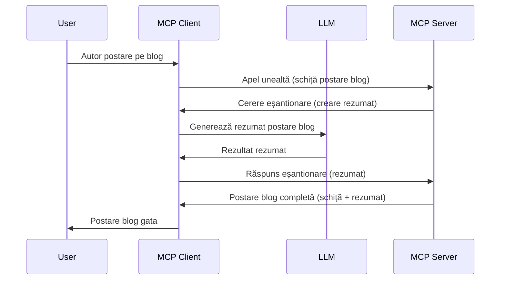

# Sampling - delegarea funcționalităților către Client

Uneori, este nevoie ca MCP Client și MCP Server să colaboreze pentru a atinge un scop comun. S-ar putea să ai un caz în care Serverul are nevoie de ajutorul unui LLM care rulează pe client. Pentru această situație, sampling este ceea ce ar trebui să folosești.

Să explorăm câteva cazuri de utilizare și cum să construim o soluție care implică sampling.

## Prezentare generală

În această lecție, ne concentrăm pe explicarea când și unde să folosești Sampling și cum să-l configurezi.

## Obiectivele de învățare

În acest capitol, vom:

- Explica ce este Sampling și când să-l folosești.
- Arăta cum să configurezi Sampling în MCP.
- Oferi exemple de Sampling în acțiune.

## Ce este Sampling și de ce să-l folosești?

Sampling este o funcționalitate avansată care funcționează în următorul mod:


### Cerere de Sampling

Ok, acum că avem o vedere de ansamblu asupra unui scenariu credibil, să vorbim despre cererea de sampling pe care serverul o trimite clientului. Iată cum poate arăta o astfel de cerere în format JSON-RPC:

```json
{
  "jsonrpc": "2.0",
  "id": 1,
  "method": "sampling/createMessage",
  "params": {
    "messages": [
      {
        "role": "user",
        "content": {
          "type": "text",
          "text": "Create a blog post summary of the following blog post: <BLOG POST>"
        }
      }
    ],
    "modelPreferences": {
      "hints": [
        {
          "name": "claude-3-sonnet"
        }
      ],
      "intelligencePriority": 0.8,
      "speedPriority": 0.5
    },
    "systemPrompt": "You are a helpful assistant.",
    "maxTokens": 100
  }
}
```

Există câteva aspecte demne de remarcat aici:

- Prompt, sub content -> text, este promptul nostru care este o instrucțiune pentru LLM să rezume conținutul unui articol de blog.

- **modelPreferences**. Această secțiune este exact asta, o preferință, o recomandare despre ce configurare să se folosească cu LLM-ul. Utilizatorul poate alege dacă să urmeze aceste recomandări sau să le schimbe. În acest caz există recomandări privind modelul de utilizat și prioritățile pentru viteză și inteligență.
- **systemPrompt**, acesta este promptul tău normal de sistem care oferă personalitate LLM-ului și conține instrucțiuni de ghidare.
- **maxTokens**, aceasta este o altă proprietate folosită pentru a stabili câți tokens se recomandă a fi folosiți pentru această sarcină.

### Răspuns de Sampling

Acest răspuns este ceea ce MCP Client ajunge să trimită înapoi către MCP Server și este rezultatul apelului clientului către LLM, așteptarea răspunsului și apoi construirea acestui mesaj. Iată cum ar putea arăta în JSON-RPC:

```json
{
  "jsonrpc": "2.0",
  "id": 1,
  "result": {
    "role": "assistant",
    "content": {
      "type": "text",
      "text": "Here's your abstract <ABSTRACT>"
    },
    "model": "gpt-5",
    "stopReason": "endTurn"
  }
}
```

Observă cum răspunsul este un rezumat al articolului de blog exact așa cum am cerut. De asemenea, observă cum modelul folosit nu este cel pe care l-am cerut, ci "gpt-5" în loc de "claude-3-sonnet". Acest lucru ilustrează faptul că utilizatorul își poate schimba părerea despre ce să folosească și că cererea ta de sampling este doar o recomandare.

Ok, acum că înțelegem fluxul principal și o sarcină utilă pentru a-l folosi, „crearea + rezumatul unui articol de blog”, să vedem ce trebuie să facem pentru a-l pune în funcțiune.

### Tipuri de mesaje

Mesajele de Sampling nu sunt limitate doar la text, ci poți trimite și imagini și audio. Iată cum diferă JSON-RPC:

**Text**

```json
{
  "type": "text",
  "text": "The message content"
}
```

**Conținut imagine**

```json
{
  "type": "image",
  "data": "base64-encoded-image-data",
  "mimeType": "image/jpeg"
}
```

**Conținut audio**

```json
{
  "type": "audio",
  "data": "base64-encoded-audio-data",
  "mimeType": "audio/wav"
}
```

> NOTĂ: pentru mai multe informații detaliate despre Sampling, verifică [documentația oficială](https://modelcontextprotocol.io/specification/2025-06-18/client/sampling)

## Cum să configurezi Sampling în Client

> Notă: dacă construiești doar un server, nu trebuie să faci mare lucru aici.

Într-un client, trebuie să specifici următoarea funcționalitate astfel:

```json
{
  "capabilities": {
    "sampling": {}
  }
}
```

Aceasta va fi preluată atunci când clientul ales se inițializează cu serverul.

## Exemplu de Sampling în acțiune - Crearea unui articol de blog

Să codăm împreună un server de sampling, va trebui să facem următoarele:

1. Creează un tool pe Server.
1. Tool-ul respectiv trebuie să creeze o cerere de sampling.
1. Tool-ul trebuie să aștepte răspunsul la cererea de sampling a clientului.
1. Apoi trebuie produs rezultatul tool-ului.

Să vedem codul pas cu pas:

### -1- Creează tool-ul

**python**

```python
@mcp.tool()
async def create_blog(title: str, content: str, ctx: Context[ServerSession, None]) -> str:
    """Create a blog post and generate a summary"""

```

### -2- Creează o cerere de sampling

Extinde tool-ul tău cu următorul cod:

**python**

```python
post = BlogPost(
        id=len(posts) + 1,
        title=title,
        content=content,
        abstract=""
    )

prompt = f"Create an abstract of the following blog post: title: {title} and draft: {content} "

result = await ctx.session.create_message(
        messages=[
            SamplingMessage(
                role="user",
                content=TextContent(type="text", text=prompt),
            )
        ],
        max_tokens=100,
)

```

### -3- Așteaptă răspunsul și returnează răspunsul

**python**

```python
post.abstract = result.content.text

posts.append(post)

# returnează produsul complet
return json.dumps({
    "id": post.title,
    "abstract": post.abstract
})
```

### -4- Cod complet

**python**

```python
from starlette.applications import Starlette
from starlette.routing import Mount, Host

from mcp.server.fastmcp import Context, FastMCP

from mcp.server.session import ServerSession
from mcp.types import SamplingMessage, TextContent

import json


from uuid import uuid4
from typing import List
from pydantic import BaseModel


mcp = FastMCP("Blog post generator")

# app = FastAPI()

posts = []

class BlogPost(BaseModel):
    id: int
    title: str
    content: str
    abstract: str

posts: List[BlogPost] = []

@mcp.tool()
async def create_blog(title: str, content: str, ctx: Context[ServerSession, None]) -> str:
    """Create a blog post and generate a summary"""

    post = BlogPost(
        id=len(posts) + 1,
        title=title,
        content=content,
        abstract=""
    )

    prompt = f"Create an abstract of the following blog post: title: {title} and draft: {content} "

    result = await ctx.session.create_message(
        messages=[
            SamplingMessage(
                role="user",
                content=TextContent(type="text", text=prompt),
            )
        ],
        max_tokens=100,
    )

    post.abstract = result.content.text

    posts.append(post)

    # returnează postarea completă de pe blog
    return json.dumps({
        "id": post.title,
        "abstract": post.abstract
    })

if __name__ == "__main__":
    print("Starting server...")
    # mcp.run()
    mcp.run(transport="streamable-http")

# rulează aplicația cu: python server.py
```

### -5- Testarea în Visual Studio Code

Pentru a testa asta în Visual Studio Code, fă următoarele:

1. Pornește serverul în terminal.
1. Adaugă-l în *mcp.json* (și asigură-te că este pornit), ceva de genul:

   ```json
   "servers": {
      "blog-server": {
        "type": "http",
        "url": "http://localhost:8000/mcp"
      }
   }
   ```

1. Scrie un prompt:

   ```text
   create a blog post named "Where Python comes from", the content is "Python is actually named after Monty Python Flying Circus"
   ```

1. Permite desfășurarea sampling-ului. Prima dată când testezi acest lucru, vei vedea un dialog suplimentar pe care trebuie să îl accepți, după care vei vedea dialogul normal care te întreabă dacă vrei să rulezi un tool.

1. Inspectează rezultatele. Vei vedea rezultatele atât redat frumos în GitHub Copilot Chat, cât și poți inspecta răspunsul JSON brut.

**Bonus**. Instrumentele Visual Studio Code au un suport excelent pentru sampling. Poți configura accesul la Sampling pe serverul tău instalat navigând astfel:

1. Navighează la secțiunea de extensii.
1. Selectează pictograma de setări (cog) pentru serverul instalat în secțiunea „MCP SERVERS - INSTALLED”.
1. Selectează „Configure Model Access”, aici poți selecta ce modele GitHub Copilot are voie să folosească când realizează sampling. De asemenea, poți vedea toate cererile de sampling efectuate recent selectând „Show Sampling requests”.

## Sarcină

În această sarcină, vei construi un Sampling ușor diferit, și anume o integrare de sampling care susține generarea unei descrieri de produs. Iată scenariul tău:

**Scenariu**: Lucrătorul din back office al unui e-commerce are nevoie de ajutor, deoarece îi ia prea mult timp să genereze descrieri pentru produse. Prin urmare, trebuie să construiești o soluție unde poți apela un tool numit "create_product" cu argumentele "title" și "keywords" și acesta să genereze un produs complet inclusiv un câmp "description" care să fie populat de un LLM al clientului.

SUGESTIE: folosește ceea ce ai învățat mai devreme pentru a construi acest server și tool-ul său folosind o cerere de sampling.

## Soluție

[Soluție](./solution/README.md)

## Concluzii cheie

Sampling este o funcționalitate puternică care permite serverului să delege sarcini către client când are nevoie de ajutorul unui LLM.

## Ce urmează

- [Capitolul 4 - Implementare practică](../../04-PracticalImplementation/README.md)

---

<!-- CO-OP TRANSLATOR DISCLAIMER START -->
**Declinare a responsabilității**:  
Acest document a fost tradus folosind serviciul de traducere AI [Co-op Translator](https://github.com/Azure/co-op-translator). Deși ne străduim pentru acuratețe, vă rugăm să rețineți că traducerile automate pot conține erori sau inexactități. Documentul original în limba sa nativă trebuie considerat sursa autoritară. Pentru informații critice, se recomandă traducerea profesională realizată de un specialist uman. Nu ne asumăm responsabilitatea pentru orice neînțelegeri sau interpretări greșite rezultate din utilizarea acestei traduceri.
<!-- CO-OP TRANSLATOR DISCLAIMER END -->