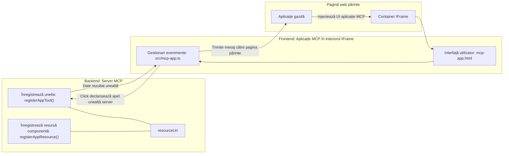

# Aplicații MCP

Aplicațiile MCP reprezintă un nou paradigma în MCP. Ideea este că nu doar răspunzi cu date de la un apel al unui instrument, ci oferi și informații despre cum ar trebui să se interacționeze cu aceste informații. Asta înseamnă că rezultatele instrumentelor pot conține acum informații de interfață cu utilizatorul (UI). De ce am dori asta? Ei bine, ia în considerare cum faci lucrurile astăzi. Cel mai probabil consumi rezultatele unui MCP Server prin punerea în fața lui a unui tip de interfață frontend, acel cod trebuie scris și întreținut. Uneori acesta este scopul, dar alteori ar fi grozav dacă ai putea aduce doar un fragment de informații care este autonom, care are totul, de la date la interfața cu utilizatorul.

## Prezentare generală

Această lecție oferă îndrumări practice despre Aplicațiile MCP, cum să începi cu ele și cum să le integrezi în Aplicațiile web existente. Aplicațiile MCP sunt o adiție foarte nouă la Standardul MCP.

## Obiective de învățare

La finalul acestei lecții, vei putea:

- Explica ce sunt Aplicațiile MCP.
- Când să folosești Aplicațiile MCP.
- Să construiești și integrezi propriile Aplicații MCP.

## Aplicațiile MCP - cum funcționează

Ideea cu Aplicațiile MCP este să oferi un răspuns care este practic un component ce urmează să fie redat. Un astfel de component poate avea atât elemente vizuale, cât și interactivitate, de exemplu, clicuri pe butoane, input de la utilizator și altele. Să începem cu partea de server și MCP Serverul nostru. Pentru a crea un component MCP App trebuie să creezi un tool dar și resursa aplicației. Aceste două părți sunt conectate printr-un resourceUri.

Iată un exemplu. Să încercăm să vizualizăm ce este implicat și ce părți ce fac:

```text
server.ts -- responsible for registering tools and the component as a UI component
src/
  mcp-app.ts -- wiring up event handlers
mcp-app.html -- the user interface
```
  
Această reprezentare vizuală descrie arhitectura pentru crearea unui component și logica sa.


Să încercăm să descriem responsabilitățile backend-ului și frontend-ului respective.

### Backend-ul

Sunt două lucruri pe care trebuie să le realizăm aici:

- Înregistrarea instrumentelor cu care dorim să interacționăm.
- Definirea componentului.

**Înregistrarea instrumentului**

```typescript
registerAppTool(
    server,
    "get-time",
    {
      title: "Get Time",
      description: "Returns the current server time.",
      inputSchema: {},
      _meta: { ui: { resourceUri } }, // Leagă acest instrument de resursa sa UI
    },
    async () => {
      const time = new Date().toISOString();
      return { content: [{ type: "text", text: time }] };
    },
  );

```
  
Codul de mai sus descrie comportamentul, unde expune un tool numit `get-time`. Nu primește intrări, dar returnează timpul curent. Avem posibilitatea să definim un `inputSchema` pentru instrumente când avem nevoie să acceptăm input de la utilizator.

**Înregistrarea componentului**

În același fișier, trebuie să înregistrăm și componentul:

```typescript
const resourceUri = "ui://get-time/mcp-app.html";

// Înregistrează resursa, care returnează HTML/JavaScript-ul împachetat pentru interfața utilizator.
registerAppResource(
  server,
  resourceUri,
  resourceUri,
  { mimeType: RESOURCE_MIME_TYPE },
  async () => {
    const html = await fs.readFile(path.join(DIST_DIR, "mcp-app.html"), "utf-8");

    return {
    contents: [
        { uri: resourceUri, mimeType: RESOURCE_MIME_TYPE, text: html },
    ],
    };
  },
);
```
  
Observă cum menționăm `resourceUri` pentru a conecta componentul cu instrumentele sale. De interes este și callback-ul unde încărcăm fișierul UI și returnăm componentul.

### Frontend-ul componentului

La fel ca backend-ul, sunt două părți aici:

- Un frontend scris în HTML pur.
- Cod care gestionează evenimentele și ce să facă, de exemplu, apelarea unor instrumente sau trimiterea de mesaje către fereastra părinte.

**Interfața cu utilizatorul**

Să aruncăm o privire la interfața cu utilizatorul.

```html
<!-- mcp-app.html -->
<!DOCTYPE html>
<html lang="en">
  <head>
    <meta charset="UTF-8" />
    <title>Get Time App</title>
  </head>
  <body>
    <p>
      <strong>Server Time:</strong> <code id="server-time">Loading...</code>
    </p>
    <button id="get-time-btn">Get Server Time</button>
    <script type="module" src="/src/mcp-app.ts"></script>
  </body>
</html>
```
  
**Asocierea evenimentelor**

Ultima parte este asocierea evenimentelor. Aceasta înseamnă că identificăm ce parte din UI-ul nostru are nevoie de handler-e de evenimente și ce să facem când evenimentele sunt declanșate:

```typescript
// mcp-app.ts

import { App } from "@modelcontextprotocol/ext-apps";

// Obține referințe la elemente
const serverTimeEl = document.getElementById("server-time")!;
const getTimeBtn = document.getElementById("get-time-btn")!;

// Creează o instanță a aplicației
const app = new App({ name: "Get Time App", version: "1.0.0" });

// Procesează rezultatele uneltei de la server. Setează înainte de `app.connect()` pentru a evita
// pierderea rezultatului inițial al uneltei.
app.ontoolresult = (result) => {
  const time = result.content?.find((c) => c.type === "text")?.text;
  serverTimeEl.textContent = time ?? "[ERROR]";
};

// Leagă evenimentul de click al butonului
getTimeBtn.addEventListener("click", async () => {
  // `app.callServerTool()` permite UI-ului să solicite date noi de la server
  const result = await app.callServerTool({ name: "get-time", arguments: {} });
  const time = result.content?.find((c) => c.type === "text")?.text;
  serverTimeEl.textContent = time ?? "[ERROR]";
});

// Conectează-te la gazdă
app.connect();
```
  
După cum poți vedea mai sus, acesta este cod normal pentru legarea elementelor DOM la evenimente. Merită menționat apelul la `callServerTool` care apelează un instrument pe backend.

## Gestionarea inputului de la utilizator

Până acum, am văzut un component cu un buton care atunci când este apăsat apelează un instrument. Să vedem dacă putem adăuga mai multe elemente UI, cum ar fi un câmp de input și să vedem dacă putem trimite argumente către un instrument. Să implementăm o funcționalitate FAQ. Iată cum ar trebui să funcționeze:

- Ar trebui să existe un buton și un element input unde utilizatorul introduce un cuvânt cheie pentru căutare, de exemplu „Shipping”. Acesta ar trebui să apeleze un instrument pe backend care să efectueze o căutare în datele FAQ.
- Un instrument care să suporte căutarea FAQ descrisă.

Să adăugăm mai întâi suportul necesar pe backend:

```typescript
const faq: { [key: string]: string } = {
    "shipping": "Our standard shipping time is 3-5 business days.",
    "return policy": "You can return any item within 30 days of purchase.",
    "warranty": "All products come with a 1-year warranty covering manufacturing defects.",
  }

registerAppTool(
    server,
    "get-faq",
    {
      title: "Search FAQ",
      description: "Searches the FAQ for relevant answers.",
      inputSchema: zod.object({
        query: zod.string().default("shipping"),
      }),
      _meta: { ui: { resourceUri: faqResourceUri } }, // Leagă acest instrument de resursa sa UI
    },
    async ({ query }) => {
      const answer: string = faq[query.toLowerCase()] || "Sorry, I don't have an answer for that.";
      return { content: [{ type: "text", text: answer }] };
    },
  );
```
  
Ce vedem aici este cum populăm `inputSchema` și îi oferim un schema `zod` astfel:

```typescript
inputSchema: zod.object({
  query: zod.string().default("shipping"),
})
```
  
În schema de mai sus declarăm că avem un parametru de input numit `query` și că este opțional cu o valoare implicită „shipping”.

Ok, să trecem la *mcp-app.html* ca să vedem ce UI trebuie să creăm pentru asta:

```html
<div class="faq">
    <h1>FAQ response</h1>
    <p>FAQ Response: <code id="faq-response">Loading...</code></p>
    <input type="text" id="faq-query" placeholder="Enter FAQ query" />
    <button id="get-faq-btn">Get FAQ Response</button>
  </div>
```
  
Super, acum avem un element input și un buton. Să mergem la *mcp-app.ts* pentru a conecta aceste evenimente:

```typescript
const getFaqBtn = document.getElementById("get-faq-btn")!;
const faqQueryInput = document.getElementById("faq-query") as HTMLInputElement;

getFaqBtn.addEventListener("click", async () => {
  const query = faqQueryInput.value;
  const result = await app.callServerTool({ name: "get-faq", arguments: { query } });
  const faq = result.content?.find((c) => c.type === "text")?.text;
  faqResponseEl.textContent = faq ?? "[ERROR]";
});
```
  
În codul de mai sus am:

- Creat referințe la elementele interactive din UI.
- Gestionat un click pe buton pentru a extrage valoarea din input și am apelat `app.callServerTool()` cu `name` și `arguments`, unde argumentele conțin `query` ca valoare.

Ce se întâmplă practic când apelezi `callServerTool` este că trimite un mesaj către fereastra părinte și acea fereastră apelează MCP Serverul.

### Încearcă singur

Testând asta, ar trebui să vedem următoarele:


și aici încercăm cu input de exemplu „warranty”


Pentru a rula acest cod, mergi la [Secțiunea Cod](./code/README.md)

## Testarea în Visual Studio Code

Visual Studio Code are un suport excelent pentru Aplicațiile MCP și probabil este una dintre cele mai ușoare modalități de a testa Aplicațiile MCP. Pentru a folosi Visual Studio Code, adaugă o intrare de server în *mcp.json* astfel:

```json
"my-mcp-server-7178eca7": {
    "url": "http://localhost:3001/mcp",
    "type": "http"
  }
```
  
Apoi pornește serverul, ar trebui să poți comunica cu Aplicația MCP prin Fereastra de Chat dacă ai instalat GitHub Copilot.

Poți declanșa asta printr-un prompt, de exemplu "#get-faq":


și la fel ca atunci când ai rulat printr-un browser web, este redat în același mod astfel:


## Tema

Creează un joc piatră-hârtie-foarfece. Ar trebui să constea în următoarele:

UI:

- o listă drop-down cu opțiuni
- un buton pentru a trimite o alegere
- o etichetă care arată cine a ales ce și cine a câștigat

Server:

- ar trebui să aibă un instrument piatră-hârtie-foarfece care primește „choice” ca input. Ar trebui să genereze și o alegere a calculatorului și să determine câștigătorul

## Soluție

[Soluție](./assignment/README.md)

## Rezumat

Am învățat despre acest nou paradigma Aplicații MCP. Este un nou paradigma care permite MCP Serverelor să aibă o opinie nu doar asupra datelor, ci și asupra modului în care aceste date ar trebui prezentate.

De asemenea, am aflat că aceste Aplicații MCP sunt găzduite într-un IFrame și pentru a comunica cu MCP Serverele trebuie să trimită mesaje către aplicația web părinte. Există mai multe librării disponibile atât pentru JavaScript simplu, cât și pentru React și altele, care fac această comunicare mai ușoară.

## Puncte cheie

Iată ce ai învățat:

- Aplicațiile MCP sunt un nou standard care poate fi util când vrei să transmiți atât date cât și caracteristici UI.
- Acest tip de aplicații rulează într-un IFrame din motive de securitate.

## Ce urmează

- [Capitolul 4](../../04-PracticalImplementation/README.md)

---

<!-- CO-OP TRANSLATOR DISCLAIMER START -->
**Declinare de responsabilitate**:
Acest document a fost tradus utilizând serviciul automat de traducere AI [Co-op Translator](https://github.com/Azure/co-op-translator). Deși ne străduim pentru acuratețe, vă rugăm să rețineți că traducerile automate pot conține erori sau inexactități. Documentul original în limba sa nativă trebuie considerat sursa autoritară. Pentru informații critice, se recomandă traducerea profesională realizată de un specialist uman. Nu ne asumăm răspunderea pentru eventualele neînțelegeri sau interpretări greșite rezultate din utilizarea acestei traduceri.
<!-- CO-OP TRANSLATOR DISCLAIMER END -->