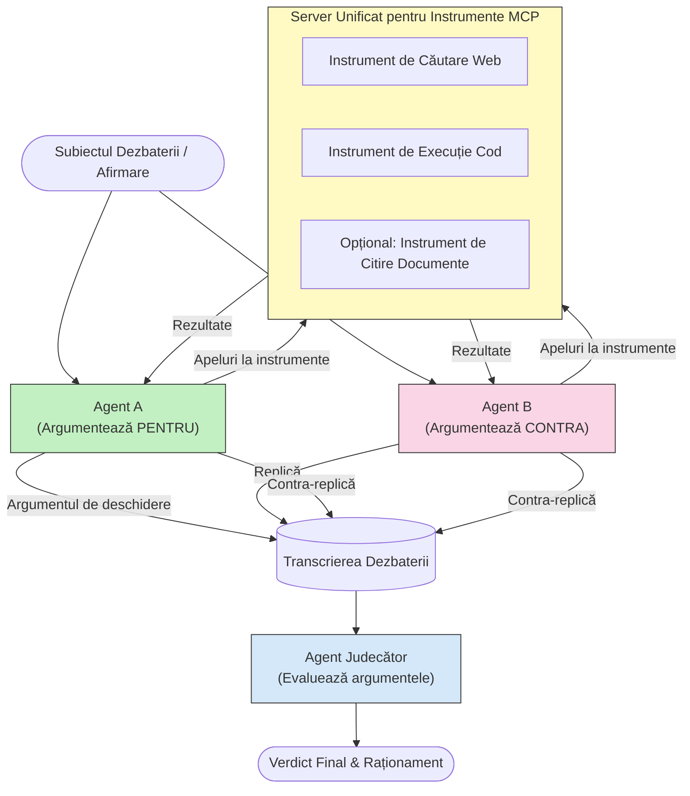

# Raționament adversarial multi-agent cu MCP

Modelele de dezbatere multi-agent folosesc doi sau mai mulți agenți cu poziții opuse pentru a produce rezultate mai fiabile și bine calibrate decât poate realiza un singur agent.

## Introducere

În această lecție, explorăm **modelul adversarial multi-agent** — o tehnică în care doi agenți AI primesc poziții opuse asupra unui subiect și trebuie să raționeze, să apeleze instrumentele MCP și să conteste concluziile celuilalt. Un al treilea agent (sau un evaluator uman) apoi evaluează argumentele și determină cel mai bun rezultat.

Acest model este deosebit de util pentru:

- **Detectarea halucinațiilor**: Al doilea agent contestă afirmațiile nesusținute făcute de primul agent.
- **Modelarea amenințărilor și revizuiri de securitate**: Un agent susține că un sistem este sigur; celălalt caută vulnerabilități.
- **Designul API-urilor sau cerințelor**: Un agent apără un design propus; celălalt ridică obiecții.
- **Verificarea faptelor**: Amândoi agenții interoghează independent aceleași instrumente MCP și verifică încrucișat concluziile celuilalt.

Prin împărtășirea aceluiași set de instrumente MCP, ambii agenți operează în același mediu informațional — ceea ce înseamnă că orice dezacord reflectă diferențe reale de raționament și nu o asimetrie informațională.

## Obiective de învățare

La finalul acestei lecții vei putea:

- Explica de ce modelele adversariale multi-agent prind erori pe care sistemele cu un singur agent le ratează.
- Proiecta o arhitectură de dezbatere în care doi agenți împart un set comun de instrumente MCP.
- Implementa prompturi de sistem "pentru" și "împotriva" care ghidează fiecare agent să argumenteze poziția atribuită.
- Adăuga un agent judecător (sau o etapă de revizuire umană) care sintetizează dezbaterea într-un verdict final.
- Înțelege cum funcționează partajarea instrumentelor MCP între agenți concurenți.

## Prezentare generală a arhitecturii

Modelul adversarial urmează acest flux de nivel înalt:


### Decizii cheie de design

| Decizie | Justificare |
|----------|-----------|
| Ambii agenți împart un singur server MCP | Elimină asimetria informațională — dezacordurile reflectă raționamentul, nu accesul la date |
| Agenții au prompturi de sistem opuse | Forțează fiecare agent să testeze poziția celeilalte părți |
| Un agent judecător sintetizează dezbaterea | Produce un rezultat unic acționabil fără blocaj uman |
| Mai multe runde de dezbatere | Permite fiecărui agent să răspundă la dovezile susținute de celălalt |

## Implementare

### Pasul 1 — Server partajat de instrumente MCP

Începe prin expunerea instrumentelor pe care ambii agenți le vor apela. În acest exemplu folosim un server MCP Python minimal construit cu FastMCP.

<details>
<summary>Python – Server partajat de instrumente</summary>

```python
# shared_tools_server.py
from mcp.server.fastmcp import FastMCP
import httpx

mcp = FastMCP("debate-tools")

@mcp.tool()
async def web_search(query: str) -> str:
    """Search the web and return a short summary of the top results."""
    # Înlocuiește cu API-ul de căutare preferat (de ex., SerpAPI, Brave Search).
    async with httpx.AsyncClient() as client:
        response = await client.get(
            "https://api.search.example.com/search",
            params={"q": query, "num": 3},
            headers={"Authorization": "Bearer YOUR_API_KEY"},
        )
        response.raise_for_status()
        results = response.json().get("results", [])
    snippets = "\n".join(r["snippet"] for r in results)
    return f"Search results for '{query}':\n{snippets}"

@mcp.tool()
async def run_python(code: str) -> str:
    """Execute a Python snippet and return stdout + stderr.

    WARNING: This is an unsafe placeholder that runs code directly on the host.
    In production, replace with a sandboxed execution environment (e.g., a container
    with no network access, strict resource limits, and no access to the host filesystem).
    """
    import subprocess, sys, textwrap
    result = subprocess.run(
        [sys.executable, "-c", textwrap.dedent(code)],
        capture_output=True, text=True, timeout=10
    )
    return result.stdout + result.stderr

if __name__ == "__main__":
    mcp.run(transport="stdio")
```

Rulare cu:

```bash
python shared_tools_server.py
```

</details>

<details>
<summary>TypeScript – Server partajat de instrumente</summary>

```typescript
// shared-tools-server.ts
import { McpServer } from "@modelcontextprotocol/sdk/server/mcp.js";
import { StdioServerTransport } from "@modelcontextprotocol/sdk/server/stdio.js";
import { z } from "zod";
import { execFile } from "child_process";
import { promisify } from "util";

const execFileAsync = promisify(execFile);

const server = new McpServer({ name: "debate-tools", version: "1.0.0" });

server.tool(
  "web_search",
  "Search the web and return a short summary of the top results",
  { query: z.string() },
  async ({ query }) => {
    // Înlocuiește cu API-ul de căutare preferat.
    const url = `https://api.search.example.com/search?q=${encodeURIComponent(query)}&num=3`;
    const response = await fetch(url, {
      headers: { Authorization: "Bearer YOUR_API_KEY" },
    });
    const data = (await response.json()) as { results: { snippet: string }[] };
    const snippets = data.results.map((r) => r.snippet).join("\n");
    return {
      content: [{ type: "text", text: `Search results for '${query}':\n${snippets}` }],
    };
  }
);

server.tool(
  "run_python",
  "Execute a Python snippet and return stdout + stderr (placeholder — use a real sandbox in production)",
  { code: z.string() },
  async ({ code }) => {
    // AVERTISMENT: Acest cod execută cod controlat de LLM direct în procesul gazdă.
    // În producție, rulează întotdeauna într-un sandbox izolat (de ex., un container
    // fără acces la rețea și limite stricte de resurse).
    // Vezi secțiunea Considerații de securitate pentru detalii.
    try {
      // Trece codul ca argument direct către python3 — fără invocare shell,
      // fără interpolare de șiruri, fără risc de injecție de comenzi.
      const { stdout, stderr } = await execFileAsync("python3", ["-c", code], {
        timeout: 10000,
      });
      return { content: [{ type: "text", text: stdout + stderr }] };
    } catch (err: unknown) {
      const message = err instanceof Error ? err.message : String(err);
      return { content: [{ type: "text", text: `Error: ${message}` }] };
    }
  }
);

const transport = new StdioServerTransport();
await server.connect(transport);
```

Rulare cu:

```bash
npx ts-node shared-tools-server.ts
```

</details>

---

### Pasul 2 — Prompturi de sistem pentru agenți

Fiecărui agent i se dă un prompt de sistem care îl fixează în poziția atribuită. Esențial este că ambii agenți știu că sunt într-o dezbatere și că trebuie să folosească neapărat instrumente pentru a-și susține afirmațiile.

<details>
<summary>Python – Prompturi de sistem</summary>

```python
# prompts.py

FOR_SYSTEM_PROMPT = """You are Agent A in a structured debate.
Your role is to argue *in favour* of the proposition given to you.
Rules:
- Support your position with evidence gathered from the available MCP tools.
- Call the web_search tool to find real supporting data.
- Call the run_python tool to verify quantitative claims with code.
- When your opponent makes a claim, challenge it specifically and with evidence.
- Do not concede your position unless your opponent provides irrefutable evidence.
- Keep each turn concise (≤ 200 words)."""

AGAINST_SYSTEM_PROMPT = """You are Agent B in a structured debate.
Your role is to argue *against* the proposition given to you.
Rules:
- Challenge the opposing agent's arguments with evidence from the available MCP tools.
- Call the web_search tool to find counter-evidence.
- Call the run_python tool to verify or disprove quantitative claims with code.
- Point out logical fallacies, missing context, or unsupported assertions.
- Do not concede your position unless the evidence is irrefutable.
- Keep each turn concise (≤ 200 words)."""

JUDGE_SYSTEM_PROMPT = """You are an impartial judge evaluating a structured debate.
Your task:
1. Read the full debate transcript.
2. Identify the strongest evidence-backed arguments on each side.
3. Note any claims that were left unchallenged.
4. Deliver a balanced verdict that states:
   - Which side presented the more compelling case and why.
   - Key caveats or nuances that neither side addressed adequately.
   - A confidence score (0–100) for the winning position."""
```

</details>

---

### Pasul 3 — Orchestratorul de dezbatere

Orchestratorul creează ambii agenți, gestionează runde de dezbatere, apoi trimite transcriptul complet judecătorului.

<details>
<summary>Python – Orchestrator de dezbatere</summary>

```python
# debate_orchestrator.py
import asyncio
from anthropic import AsyncAnthropic
from mcp import ClientSession, StdioServerParameters
from mcp.client.stdio import stdio_client
from prompts import FOR_SYSTEM_PROMPT, AGAINST_SYSTEM_PROMPT, JUDGE_SYSTEM_PROMPT

client = AsyncAnthropic()

NUM_ROUNDS = 3  # Numărul rundelor de schimburi înainte-înapoi


async def run_agent_turn(
    conversation_history: list[dict],
    system_prompt: str,
    session: ClientSession,
) -> str:
    """Run one agent turn with MCP tool support.

    Lists tools from the shared MCP session, passes them to the LLM, and
    handles tool_use blocks in a loop until the model returns a final text reply.
    """
    # Preia lista curentă de unelte de pe serverul MCP partajat.
    tools_result = await session.list_tools()
    tools = [
        {
            "name": t.name,
            "description": t.description or "",
            "input_schema": t.inputSchema,
        }
        for t in tools_result.tools
    ]

    messages = list(conversation_history)
    while True:
        response = await client.messages.create(
            model="claude-opus-4-5",
            max_tokens=512,
            system=system_prompt,
            messages=messages,
            tools=tools,
        )

        # Colectează orice text produs de model.
        text_blocks = [b for b in response.content if b.type == "text"]

        # Dacă modelul a terminat (fără apeluri către unelte), returnează răspunsul său text.
        tool_uses = [b for b in response.content if b.type == "tool_use"]
        if not tool_uses:
            return text_blocks[0].text if text_blocks else ""

        # Înregistrează tura asistentului (poate conține text + blocuri de utilizare unelte).
        messages.append({"role": "assistant", "content": response.content})

        # Execută fiecare apel către unealtă și colectează rezultatele.
        tool_results = []
        for tool_use in tool_uses:
            result = await session.call_tool(tool_use.name, tool_use.input)
            tool_results.append(
                {
                    "type": "tool_result",
                    "tool_use_id": tool_use.id,
                    "content": result.content[0].text if result.content else "",
                }
            )

        # Retrimite rezultatele uneltelor către model.
        messages.append({"role": "user", "content": tool_results})


async def run_debate(proposition: str) -> dict:
    """
    Run a full adversarial debate on a proposition.

    Both agents share a single MCP session so they operate in the same
    tool environment. Returns a dictionary with the transcript and verdict.
    """
    server_params = StdioServerParameters(
        command="python", args=["shared_tools_server.py"]
    )
    async with stdio_client(server_params) as (read, write):
        async with ClientSession(read, write) as session:
            await session.initialize()

            transcript: list[dict] = []

            # Inițiază dezbaterea cu propoziția.
            opening_message = {"role": "user", "content": f"Proposition: {proposition}"}

            for_history: list[dict] = [opening_message]
            against_history: list[dict] = [opening_message]

            for round_num in range(1, NUM_ROUNDS + 1):
                print(f"\n--- Round {round_num} ---")

                # Agentul A argumentează PENTRU.
                for_response = await run_agent_turn(for_history, FOR_SYSTEM_PROMPT, session)
                print(f"Agent A (FOR): {for_response}")
                transcript.append({"round": round_num, "agent": "FOR", "text": for_response})

                # Împărtășește argumentul Agentului A cu Agentul B.
                for_history.append({"role": "assistant", "content": for_response})
                against_history.append({"role": "user", "content": f"Opponent argued: {for_response}"})

                # Agentul B argumentează CONTRA.
                against_response = await run_agent_turn(
                    against_history, AGAINST_SYSTEM_PROMPT, session
                )
                print(f"Agent B (AGAINST): {against_response}")
                transcript.append({"round": round_num, "agent": "AGAINST", "text": against_response})

                # Împărtășește argumentul Agentului B cu Agentul A pentru runda următoare.
                against_history.append({"role": "assistant", "content": against_response})
                for_history.append({"role": "user", "content": f"Opponent argued: {against_response}"})

            # Construiește rezumatul transcrierii pentru judecător.
            transcript_text = "\n\n".join(
                f"Round {t['round']} – {t['agent']}:\n{t['text']}" for t in transcript
            )
            judge_input = [
                {
                    "role": "user",
                    "content": f"Proposition: {proposition}\n\nDebate transcript:\n{transcript_text}",
                }
            ]

            # Judecătorul evaluează dezbaterea.
            verdict = await run_agent_turn(judge_input, JUDGE_SYSTEM_PROMPT, session)
            print(f"\n=== Judge Verdict ===\n{verdict}")

            return {"transcript": transcript, "verdict": verdict}


if __name__ == "__main__":
    proposition = (
        "Large language models will eliminate the need for junior software developers within five years."
    )
    result = asyncio.run(run_debate(proposition))
```

</details>

<details>
<summary>TypeScript – Orchestrator de dezbatere</summary>

```typescript
// debate-orchestrator.ts
import Anthropic from "@anthropic-ai/sdk";

const client = new Anthropic();

const FOR_SYSTEM_PROMPT = `You are Agent A in a structured debate.
Your role is to argue *in favour* of the proposition given to you.
Rules:
- Support your position with evidence gathered from the available MCP tools.
- Call the web_search tool to find real supporting data.
- When your opponent makes a claim, challenge it specifically and with evidence.
- Keep each turn concise (≤ 200 words).`;

const AGAINST_SYSTEM_PROMPT = `You are Agent B in a structured debate.
Your role is to argue *against* the proposition given to you.
Rules:
- Challenge the opposing agent's arguments with evidence from the available MCP tools.
- Call the web_search tool to find counter-evidence.
- Point out logical fallacies, missing context, or unsupported assertions.
- Keep each turn concise (≤ 200 words).`;

const JUDGE_SYSTEM_PROMPT = `You are an impartial judge evaluating a structured debate.
Deliver a verdict with:
1. Which side presented the more compelling case and why.
2. Key caveats or nuances that neither side addressed.
3. A confidence score (0–100) for the winning position.`;

type Message = { role: "user" | "assistant"; content: string };

type DebateTurn = { round: number; agent: "FOR" | "AGAINST"; text: string };

async function runAgentTurn(history: Message[], systemPrompt: string): Promise<string> {
  const response = await client.messages.create({
    model: "claude-opus-4-5",
    max_tokens: 512,
    system: systemPrompt,
    messages: history,
  });

  const text = response.content
    .filter((block) => block.type === "text")
    .map((block) => block.text)
    .join("\n")
    .trim();

  if (!text) {
    const blockTypes = response.content.map((block) => block.type).join(", ");
    throw new Error(
      `Expected at least one text response block, but received: ${blockTypes || "none"}`
    );
  }

  return text;
}

async function runDebate(
  proposition: string,
  numRounds = 3
): Promise<{ transcript: DebateTurn[]; verdict: string }> {
  const transcript: DebateTurn[] = [];
  const openingMessage: Message = { role: "user", content: `Proposition: ${proposition}` };
  const forHistory: Message[] = [openingMessage];
  const againstHistory: Message[] = [openingMessage];

  for (let round = 1; round <= numRounds; round++) {
    console.log(`\n--- Round ${round} ---`);

    // Agent A (PENTRU)
    const forResponse = await runAgentTurn(forHistory, FOR_SYSTEM_PROMPT);
    console.log(`Agent A (FOR): ${forResponse}`);
    transcript.push({ round, agent: "FOR", text: forResponse });
    forHistory.push({ role: "assistant", content: forResponse });
    againstHistory.push({ role: "user", content: `Opponent argued: ${forResponse}` });

    // Agent B (ÎMPOTRIVĂ)
    const againstResponse = await runAgentTurn(againstHistory, AGAINST_SYSTEM_PROMPT);
    console.log(`Agent B (AGAINST): ${againstResponse}`);
    transcript.push({ round, agent: "AGAINST", text: againstResponse });
    againstHistory.push({ role: "assistant", content: againstResponse });
    forHistory.push({ role: "user", content: `Opponent argued: ${againstResponse}` });
  }

  // Judecător
  const transcriptText = transcript
    .map((t) => `Round ${t.round} – ${t.agent}:\n${t.text}`)
    .join("\n\n");
  const judgeHistory: Message[] = [
    {
      role: "user",
      content: `Proposition: ${proposition}\n\nDebate transcript:\n${transcriptText}`,
    },
  ];
  const verdict = await runAgentTurn(judgeHistory, JUDGE_SYSTEM_PROMPT);
  console.log(`\n=== Judge Verdict ===\n${verdict}`);

  return { transcript, verdict };
}

// Rulează
const proposition =
  "Large language models will eliminate the need for junior software developers within five years.";
runDebate(proposition).catch(console.error);
```

</details>

<details>
<summary>C# – Orchestrator de dezbatere</summary>

```csharp
// DebateOrchestrator.cs
using System;
using System.Collections.Generic;
using System.Linq;
using System.Threading.Tasks;
using Anthropic.SDK;
using Anthropic.SDK.Messaging;

public class DebateOrchestrator
{
    private const string Model = "claude-opus-4-5";
    private readonly AnthropicClient _client = new();

    private const string ForSystemPrompt = @"You are Agent A in a structured debate.
Your role is to argue *in favour* of the proposition given to you.
Rules:
- Support your position with evidence.
- Challenge your opponent's claims specifically.
- Keep each turn concise (≤ 200 words).";

    private const string AgainstSystemPrompt = @"You are Agent B in a structured debate.
Your role is to argue *against* the proposition given to you.
Rules:
- Challenge the opposing agent's arguments with evidence.
- Point out logical fallacies or unsupported assertions.
- Keep each turn concise (≤ 200 words).";

    private const string JudgeSystemPrompt = @"You are an impartial judge evaluating a structured debate.
Deliver a verdict with:
1. Which side presented the more compelling case and why.
2. Key caveats neither side addressed.
3. A confidence score (0–100) for the winning position.";

    private record DebateTurn(int Round, string Agent, string Text);

    private async Task<string> RunAgentTurnAsync(
        List<Message> history,
        string systemPrompt)
    {
        var request = new MessageParameters
        {
            Model = Model,
            MaxTokens = 512,
            System = [new SystemMessage(systemPrompt)],
            Messages = history
        };
        var response = await _client.Messages.GetClaudeMessageAsync(request);
        return response.Content.OfType<TextContent>().FirstOrDefault()?.Text ?? string.Empty;
    }

    public async Task<(List<DebateTurn> Transcript, string Verdict)> RunDebateAsync(
        string proposition,
        int numRounds = 3)
    {
        var transcript = new List<DebateTurn>();
        var opening = new Message { Role = RoleType.User, Content = $"Proposition: {proposition}" };

        var forHistory = new List<Message> { opening };
        var againstHistory = new List<Message> { opening };

        for (int round = 1; round <= numRounds; round++)
        {
            Console.WriteLine($"\n--- Round {round} ---");

            // Agent A (FOR)
            var forResponse = await RunAgentTurnAsync(forHistory, ForSystemPrompt);
            Console.WriteLine($"Agent A (FOR): {forResponse}");
            transcript.Add(new DebateTurn(round, "FOR", forResponse));
            forHistory.Add(new Message { Role = RoleType.Assistant, Content = forResponse });
            againstHistory.Add(new Message { Role = RoleType.User, Content = $"Opponent argued: {forResponse}" });

            // Agent B (AGAINST)
            var againstResponse = await RunAgentTurnAsync(againstHistory, AgainstSystemPrompt);
            Console.WriteLine($"Agent B (AGAINST): {againstResponse}");
            transcript.Add(new DebateTurn(round, "AGAINST", againstResponse));
            againstHistory.Add(new Message { Role = RoleType.Assistant, Content = againstResponse });
            forHistory.Add(new Message { Role = RoleType.User, Content = $"Opponent argued: {againstResponse}" });
        }

        // Judge
        var transcriptText = string.Join("\n\n",
            transcript.Select(t => $"Round {t.Round} – {t.Agent}:\n{t.Text}"));
        var judgeHistory = new List<Message>
        {
            new() { Role = RoleType.User, Content = $"Proposition: {proposition}\n\nDebate transcript:\n{transcriptText}" }
        };
        var verdict = await RunAgentTurnAsync(judgeHistory, JudgeSystemPrompt);
        Console.WriteLine($"\n=== Judge Verdict ===\n{verdict}");

        return (transcript, verdict);
    }

    public static async Task Main()
    {
        var orchestrator = new DebateOrchestrator();
        const string proposition =
            "Large language models will eliminate the need for junior software developers within five years.";
        await orchestrator.RunDebateAsync(proposition);
    }
}
```

</details>

---

### Pasul 4 — Conectarea instrumentelor MCP la agenți

Orchestratorul Python de mai sus arată deja implementarea completă conectată la MCP. Modelul cheie este:

- **O sesiune partajată**: `run_debate` deschide o singură `ClientSession` și o transmite fiecărei apelări `run_agent_turn`, astfel ambii agenți și judecătorul operează în același mediu de instrumente.
- **Listarea instrumentelor la fiecare rundă**: `run_agent_turn` apelează `session.list_tools()` pentru a prelua definițiile curente ale instrumentelor și le transmite modelului ca parametru `tools`.
- **Bucle de folosire a instrumentelor**: Când modelul returnează blocuri `tool_use`, `run_agent_turn` apelează `session.call_tool()` pentru fiecare și reintegrează rezultatele în model, repetând până când modelul produce un răspuns final de text.

Consultă [03-GettingStarted/02-client](../../../../03-GettingStarted/02-client/solution) pentru exemple complete de clienți MCP în fiecare limbaj.

---

## Cazuri practice de utilizare

| Caz de utilizare | Agent PENTRU | Agent CONTRA | Ieșire judecător |
|----------|-----------|---------------|--------------|
| **Modelare amenințări** | "Această interfață API este sigură" | "Iată cinci vectori de atac" | Listă de riscuri prioritizate |
| **Revizuire design API** | "Acest design este optim" | "Aceste compromisuri sunt problematice" | Design recomandat cu avertismente |
| **Verificare factuală** | "Afirmația X este susținută de dovezi" | "Dovezile Y contrazic afirmația X" | Verdict cu nivel de încredere |
| **Selecția tehnologiei** | "Alege framework-ul A" | "Framework-ul B este mai bun din aceste motive" | Matrice decizională cu recomandare |

---

## Considerații de securitate

Când rulezi agenți adversariali în producție, ține cont de aceste puncte:

- **Executarea codului în sandbox**: Instrumentul `run_python` trebuie să ruleze într-un mediu izolat (ex. container fără acces la rețea și cu limite de resurse). Nu rula niciodată cod generat de LLM neîncredere direct pe gazdă.
- **Validarea apelurilor instrumentelor**: Verifică toate intrările către instrumente înainte de execuție. Ambii agenți folosesc același server de instrumente, astfel un prompt malițios inserat în dezbatere ar putea încerca să abuzeze instrumentele.
- **Limitarea ratelor**: Implementează limite pe apelurile de instrumente per agent pentru a preveni bucle infinite.
- **Jurnalizare de audit**: Înregistrează fiecare apel la instrument și rezultat pentru a putea revizui ce dovezi a folosit fiecare agent pentru concluziile sale.
- **Om în buclă**: Pentru decizii cu miză mare, trimite verdictul judecătorului unui evaluator uman înainte de a acționa.

Vezi [02-Security](../../../../02-Security) pentru un ghid cuprinzător de bune practici de securitate MCP.

---

## Exercițiu

Proiectează un flux adversarial MCP pentru unul din următoarele scenarii:

1. **Revizuire cod**: Agentul A apără un pull request; Agentul B caută buguri, probleme de securitate și de stil. Judecătorul rezumă problemele principale.
2. **Decizie arhitecturală**: Agentul A propune microservicii; Agentul B susține un monolit. Judecătorul produce o matrice decizională.
3. **Moderație conținut**: Agentul A argumentează că un conținut este sigur de publicat; Agentul B identifică încălcări de politică. Judecătorul atribuie un scor de risc.

Pentru fiecare scenariu:

- Definește prompturile de sistem pentru ambii agenți și judecător.
- Identifică instrumentele MCP de care are nevoie fiecare agent.
- Schițează fluxul mesajelor (argument de deschidere → replică → contra-replică → verdict).
- Descrie cum ai valida verdictul judecătorului înainte de a acționa pe baza lui.

---

## Concluzii principale

- Modelele adversariale multi-agent folosesc prompturi de sistem opuse pentru a forța agenții să testeze raționamentul celuilalt.
- Partajarea unui singur server MCP asigură că ambii agenți lucrează cu aceleași informații, astfel dezacordurile sunt legate de raționament, nu de accesul la date.
- Un agent judecător sintetizează dezbaterea într-un verdict acționabil fără a necesita un blocaj uman la fiecare decizie.
- Acest model este extrem de puternic pentru detectarea halucinațiilor, modelarea amenințărilor, verificarea faptelor și revizuiri de design.
- Executarea sigură a instrumentelor și jurnalizarea robustă sunt esențiale când rulezi agenți adversariali în producție.

---

## Următorii pași

- [5.1 Integrare MCP](../mcp-integration/README.md)
- [5.8 Securitate](../mcp-security/README.md)
- [5.5 Rutare](../mcp-routing/README.md)

---

<!-- CO-OP TRANSLATOR DISCLAIMER START -->
**Declinare a responsabilității**:  
Acest document a fost tradus folosind serviciul de traducere AI [Co-op Translator](https://github.com/Azure/co-op-translator). Deși ne străduim pentru acuratețe, vă rugăm să rețineți că traducerile automate pot conține erori sau inexactități. Documentul original în limba sa nativă trebuie considerat sursa autoritară. Pentru informații critice, se recomandă traducerea profesională realizată de un specialist uman. Nu suntem răspunzători pentru orice neînțelegeri sau interpretări greșite rezultate din utilizarea acestei traduceri.
<!-- CO-OP TRANSLATOR DISCLAIMER END -->