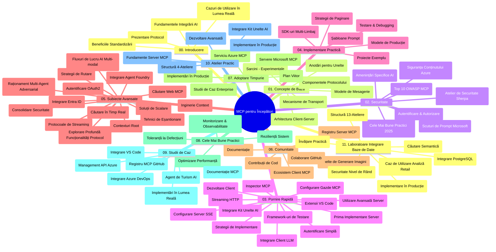

# Protocolul Contextului Modelului (MCP) pentru Începători - Ghid de Studiu

Acest ghid de studiu oferă o prezentare generală a structurii și conținutului depozitului pentru curriculumul „Protocolul Contextului Modelului (MCP) pentru Începători”. Folosiți acest ghid pentru a naviga eficient în depozit și pentru a profita la maximum de resursele disponibile.

## Prezentare generală a depozitului

Protocolul Contextului Modelului (MCP) este un cadru standardizat pentru interacțiunile între modelele AI și aplicațiile client. Inițial creat de Anthropic, MCP este acum întreținut de comunitatea mai largă MCP prin organizația oficială GitHub. Acest depozit oferă un curriculum cuprinzător cu exemple practice de cod în C#, Java, JavaScript, Python și TypeScript, proiectat pentru dezvoltatori AI, arhitecți de sisteme și ingineri software.

## Harta vizuală a curriculumului

## Structura depozitului

Depozitul este organizat în unsprezece secțiuni principale, fiecare concentrându-se pe diferite aspecte ale MCP:

1. **Introducere (00-Introduction/)**
   - Prezentare generală a Protocolului Contextului Modelului
   - De ce contează standardizarea în pipeline-urile AI
   - Cazuri practice de utilizare și beneficii

2. **Concepte de bază (01-CoreConcepts/)**
   - Arhitectura client-server
   - Componente cheie ale protocolului
   - Modele de mesagerie în MCP

3. **Securitate (02-Security/)**
   - Amenințări de securitate în sistemele bazate pe MCP
   - Cele mai bune practici pentru asigurarea implementărilor
   - Strategii de autentificare și autorizare
   - **Documentație completă privind securitatea**:
     - Cele mai bune practici MCP Security 2025
     - Ghid de implementare Azure Content Safety
     - Controale și tehnici MCP Security
     - Referință rapidă a celor mai bune practici MCP
   - **Subiecte cheie de securitate**:
     - Atacuri prin injecția de prompturi și otrăvirea instrumentelor
     - Preluarea sesiunii și problemele de tip deputy confuz
     - Vulnerabilități de tip token passthrough
     - Permisiuni excesive și controlul accesului
     - Securitatea lanțului de aprovizionare pentru componente AI
     - Integrarea Microsoft Prompt Shields

4. **Începerea lucrului (03-GettingStarted/)**
   - Configurarea și configurarea mediului
   - Crearea serverelor și clienților MCP de bază
   - Integrarea cu aplicații existente
   - Include secțiuni pentru:
     - Prima implementare a serverului
     - Dezvoltare client
     - Integrare client LLM
     - Integrare VS Code
     - Server Server-Sent Events (SSE)
     - Utilizare avansată a serverului
     - Streaming HTTP
     - Integrare AI Toolkit
     - Strategii de testare
     - Linii directoare de implementare

5. **Implementare practică (04-PracticalImplementation/)**
   - Utilizarea SDK-urilor în diferite limbaje de programare
   - Tehnici de depanare, testare și validare
   - Crearea de template-uri și fluxuri de lucru reutilizabile pentru prompturi
   - Proiecte exemplu cu exemple de implementare

6. **Subiecte avansate (05-AdvancedTopics/)**
   - Tehnici de inginerie a contextului
   - Integrare agent Foundry
   - Fluxuri de lucru AI multimodale
   - Demo-uri de autentificare OAuth2
   - Capacități de căutare în timp real
   - Streaming în timp real
   - Implementarea contextelor root
   - Strategii de rutare
   - Tehnici de eșantionare
   - Abordări de scalare
   - Considerații privind securitatea
   - Integrare securitate Entra ID
   - Integrare căutare web
   - Raționament multi-agent adversarial (tipare de dezbatere)

7. **Contribuții din comunitate (06-CommunityContributions/)**
   - Cum să contribuiți cu cod și documentație
   - Colaborare prin GitHub
   - Îmbunătățiri și feedback conduse de comunitate
   - Utilizarea diverselor clienți MCP (Claude Desktop, Cline, VSCode)
   - Lucrul cu servere MCP populare, inclusiv generare imagini

8. **Lecții din adoptarea timpurie (07-LessonsfromEarlyAdoption/)**
   - Implementări reale și povești de succes
   - Construirea și implementarea soluțiilor bazate pe MCP
   - Tendințe și foaie de parcurs viitoare
   - **Ghid servere MCP Microsoft**: Ghid complet pentru 10 servere MCP Microsoft gata pentru producție, inclusiv:
     - Microsoft Learn Docs MCP Server
     - Azure MCP Server (peste 15 conectori specializați)
     - GitHub MCP Server
     - Azure DevOps MCP Server
     - MarkItDown MCP Server
     - SQL Server MCP Server
     - Playwright MCP Server
     - Dev Box MCP Server
     - Azure AI Foundry MCP Server
     - Microsoft 365 Agents Toolkit MCP Server

9. **Cele mai bune practici (08-BestPractices/)**
   - Optimizarea performanței și ajustare
   - Proiectarea sistemelor MCP rezistente la erori
   - Strategii de testare și reziliență

10. **Studii de caz (09-CaseStudy/)**
    - **Șapte studii de caz cuprinzătoare** demonstrând versatilitatea MCP în diverse scenarii:
    - **Azure AI Travel Agents**: Orchestrație multi-agent cu Azure OpenAI și AI Search
    - **Integrare Azure DevOps**: Automatizarea proceselor de lucru folosind actualizări de date YouTube
    - **Recuperare documentație în timp real**: Client consolă Python cu streaming HTTP
    - **Generator interactiv de planuri de studiu**: Aplicație web Chainlit cu AI conversațional
    - **Documentație în editor**: Integrare VS Code cu fluxuri GitHub Copilot
    - **Azure API Management**: Integrare API enterprise și creare server MCP
    - **Registru GitHub MCP**: Dezvoltare ecosistem și platformă de integrare agentică
    - Exemple de implementare acoperind integrare enterprise, productivitate dezvoltatori și dezvoltare ecosistem

11. **Atelier practic (10-StreamliningAIWorkflowsBuildingAnMCPServerWithAIToolkit/)**
    - Atelier practic cuprinzător combinând MCP cu AI Toolkit
    - Construirea aplicațiilor inteligente care leagă modelele AI de instrumente reale
    - Module practice ce acoperă fundamente, dezvoltare server personalizat și strategii de implementare în producție
    - **Structura laboratorului**:
      - Laborator 1: Fundamente server MCP
      - Laborator 2: Dezvoltare avansată server MCP
      - Laborator 3: Integrare AI Toolkit
      - Laborator 4: Implementare și scalare în producție
    - Abordare de învățare bazată pe laborator cu instrucțiuni pas cu pas

12. **Lab-uri de integrare a bazei de date pentru server MCP (11-MCPServerHandsOnLabs/)**
    - **Curs complet format din 13 laboratoare** pentru construirea serverelor MCP gata pentru producție cu integrare PostgreSQL
    - **Implementare reală de analiză retail** folosind cazul de utilizare Zava Retail
    - **Modele enterprise** incluzând Row Level Security (RLS), căutare semantică și acces multi-tenant la date
    - **Structura completă a laboratorului**:
      - **Laboratoarele 00-03: Fundamente** - Introducere, Arhitectură, Securitate, Configurare mediu
      - **Laboratoarele 04-06: Construirea serverului MCP** - Design bază de date, Implementare server MCP, Dezvoltare instrumente
      - **Laboratoarele 07-09: Caracteristici Avansate** - Căutare semantică, Testare & depanare, Integrare VS Code
      - **Laboratoarele 10-12: Producție & Cele mai bune practici** - Implementare, Monitorizare, Optimizare
    - **Tehnologii acoperite**: FastMCP framework, PostgreSQL, Azure OpenAI, Azure Container Apps, Application Insights
    - **Rezultate de învățare**: Servere MCP gata pentru producție, modele de integrare bază de date, analiză AI, securitate enterprise

## Resurse suplimentare

Depozitul include resurse suport:

- **Folder imagini**: Conține diagrame și ilustrații folosite în întregul curriculum
- **Traduceri**: Suport multilingv cu traduceri automate ale documentației
- **Resurse oficiale MCP**:
  - [Documentație MCP](https://modelcontextprotocol.io/)
  - [Specificație MCP](https://spec.modelcontextprotocol.io/)
  - [Depozit MCP GitHub](https://github.com/modelcontextprotocol)

## Cum să folosești acest depozit

1. **Învățare secvențială**: Urmați capitolele în ordine (00 până la 11) pentru o experiență de învățare structurată.
2. **Concentrare pe limbaj specific**: Dacă sunteți interesat de un anumit limbaj de programare, explorați directoarele cu exemple pentru implementări în limbajul preferat.
3. **Implementare practică**: Începeți cu secțiunea „Începerea lucrului” pentru a vă configura mediul și a crea primul server și client MCP.
4. **Explorare avansată**: După ce stăpâniți elementele de bază, adânciți-vă în subiectele avansate pentru a vă extinde cunoștințele.
5. **Implicare în comunitate**: Alăturați-vă comunității MCP prin discuții GitHub și canale Discord pentru a interacționa cu experți și alți dezvoltatori.

## Clienți și instrumente MCP

Curriculumul acoperă diferiți clienți și instrumente MCP:

1. **Clienți oficiali**:
   - Visual Studio Code 
   - MCP în Visual Studio Code
   - Claude Desktop
   - Claude în VSCode 
   - Claude API

2. **Clienți din comunitate**:
   - Cline (bazat pe terminal)
   - Cursor (editor de cod)
   - ChatMCP
   - Windsurf

3. **Instrumente de management MCP**:
   - MCP CLI
   - MCP Manager
   - MCP Linker
   - MCP Router

## Servere MCP populare

Depozitul introduce diverse servere MCP, inclusiv:

1. **Servere MCP oficiale Microsoft**:
   - Microsoft Learn Docs MCP Server
   - Azure MCP Server (peste 15 conectori specializați)
   - GitHub MCP Server
   - Azure DevOps MCP Server
   - MarkItDown MCP Server
   - SQL Server MCP Server
   - Playwright MCP Server
   - Dev Box MCP Server
   - Azure AI Foundry MCP Server
   - Microsoft 365 Agents Toolkit MCP Server

2. **Servere oficiale de referință**:
   - Filesystem
   - Fetch
   - Memory
   - Sequential Thinking

3. **Generare imagini**:
   - Azure OpenAI DALL-E 3
   - Stable Diffusion WebUI
   - Replicate

4. **Instrumente de dezvoltare**:
   - Git MCP
   - Terminal Control
   - Code Assistant

5. **Servere specializate**:
   - Salesforce
   - Microsoft Teams
   - Jira & Confluence

## Contribuții

Acest depozit acceptă contribuții din partea comunității. Consultați secțiunea Contribuții din comunitate pentru îndrumări privind cum să contribuiți eficient la ecosistemul MCP.

----

*Acest ghid de studiu a fost actualizat ultima dată pe 5 februarie 2026, reflectând cea mai recentă Specificație MCP 2025-11-25 și oferă o prezentare generală a depozitului la acea dată. Conținutul depozitului poate fi actualizat după această dată.*

---

<!-- CO-OP TRANSLATOR DISCLAIMER START -->
**Declinare a responsabilității**:
Acest document a fost tradus folosind serviciul de traducere AI [Co-op Translator](https://github.com/Azure/co-op-translator). Deși ne străduim pentru acuratețe, vă rugăm să rețineți că traducerile automate pot conține erori sau inexactități. Documentul original în limba sa nativă ar trebui considerat sursa autoritară. Pentru informații critice, se recomandă traducerea profesională realizată de un om. Nu ne asumăm răspunderea pentru orice neînțelegeri sau interpretări greșite rezultate din utilizarea acestei traduceri.
<!-- CO-OP TRANSLATOR DISCLAIMER END -->