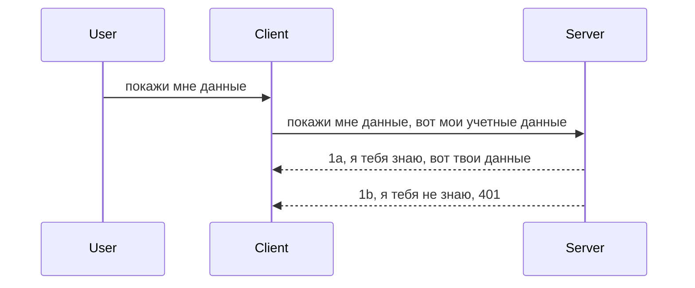

# Простая аутентификация

MCP SDK поддерживают использование OAuth 2.1, что, если честно, довольно сложный процесс, включающий такие понятия, как сервер аутентификации, сервер ресурсов, отправка учетных данных, получение кода, обмен кода на токен доступа, и только после этого вы можете получить данные ресурса. Если вы не знакомы с OAuth, который, кстати, замечательно реализовывать, то лучше начать с базового уровня аутентификации и постепенно переходить к более безопасным способам. Именно для этого существует эта глава — чтобы подготовить вас к более совершенной аутентификации.

## Аутентификация, что мы имеем в виду?

Аутентификация — это сокращение от authentication и authorization. Идея в том, что нам нужно сделать две вещи:

- **Authentication (аутентификация)** — процесс определения, можно ли человеку войти в наш дом, то есть есть ли у него право быть "здесь", то есть доступ к нашему серверу ресурсов, где живут функции MCP Server.
- **Authorization (авторизация)** — процесс выяснения, должен ли пользователь иметь доступ именно к тем ресурсам, к которым он обращается, например, к этим заказам или этим продуктам, или разрешено ли ему только читать содержимое, но не удалять, как еще один пример.

## Учетные данные: как мы говорим системе, кто мы

Большинство веб-разработчиков привыкли передавать серверу учетные данные, обычно секрет, который говорит, разрешено ли им быть "здесь" — аутентификация. Этот секрет обычно представляет собой base64-кодированную комбинацию имени пользователя и пароля или API-ключ, который уникально идентифицирует конкретного пользователя. 

Эти данные отправляются в заголовке с названием "Authorization" следующим образом:

```json
{ "Authorization": "secret123" }
```

Это обычно называют базовой аутентификацией. Общий поток работы затем выглядит так:


Теперь, когда мы понимаем, как это работает с точки зрения процесса, как это реализовать? Большинство веб-серверов имеют понятие middleware (промежуточного программного обеспечения), кусочка кода, который запускается в рамках запроса, может проверить учетные данные, и если они валидны, пропускает запрос. Если же учетные данные невалидны, возникает ошибка аутентификации. Посмотрим, как это реализовать:

**Python**

```python
class AuthMiddleware(BaseHTTPMiddleware):
    async def dispatch(self, request, call_next):

        has_header = request.headers.get("Authorization")
        if not has_header:
            print("-> Missing Authorization header!")
            return Response(status_code=401, content="Unauthorized")

        if not valid_token(has_header):
            print("-> Invalid token!")
            return Response(status_code=403, content="Forbidden")

        print("Valid token, proceeding...")
       
        response = await call_next(request)
        # добавить любые пользовательские заголовки или изменить ответ каким-либо образом
        return response


starlette_app.add_middleware(CustomHeaderMiddleware)
```

Здесь мы:

- Создали middleware под названием `AuthMiddleware`, метод `dispatch` которого вызывается сервером.
- Добавили это middleware в веб-сервер:

    ```python
    starlette_app.add_middleware(AuthMiddleware)
    ```

- Написали логику валидации, которая проверяет, есть ли заголовок Authorization и валиден ли переданный секрет:

    ```python
    has_header = request.headers.get("Authorization")
    if not has_header:
        print("-> Missing Authorization header!")
        return Response(status_code=401, content="Unauthorized")

    if not valid_token(has_header):
        print("-> Invalid token!")
        return Response(status_code=403, content="Forbidden")
    ```

    если секрет присутствует и валиден, мы пропускаем запрос, вызывая `call_next`, и возвращаем ответ.

    ```python
    response = await call_next(request)
    # добавить любые пользовательские заголовки или изменить ответ каким-либо образом
    return response
    ```

Как это работает: при поступлении веб-запроса сервер вызывает middleware, и в соответствии с его реализацией либо пропускает запрос дальше, либо возвращает ошибку, указывающую, что клиенту запрещено продолжать.

**TypeScript**

Здесь мы создаем middleware с помощью популярного фреймворка Express и перехватываем запрос до того, как он достигнет MCP Server. Вот код:

```typescript
function isValid(secret) {
    return secret === "secret123";
}

app.use((req, res, next) => {
    // 1. Заголовок авторизации присутствует?
    if(!req.headers["Authorization"]) {
        res.status(401).send('Unauthorized');
    }
    
    let token = req.headers["Authorization"];

    // 2. Проверить действительность.
    if(!isValid(token)) {
        res.status(403).send('Forbidden');
    }

   
    console.log('Middleware executed');
    // 3. Передать запрос на следующий этап обработки.
    next();
});
```

В этом коде мы:

1. Проверяем наличие заголовка Authorization, если его нет — отправляем ошибку 401.
2. Удостоверяемся в валидности учетных данных/токена, если они неверны — отправляем ошибку 403.
3. В конце пропускаем запрос дальше по цепочке и возвращаем запрашиваемый ресурс.

## Упражнение: реализуйте аутентификацию

Давайте применим наши знания и попробуем реализовать это на практике. План:

Сервер

- Создать веб-сервер и экземпляр MCP.
- Реализовать middleware для сервера.

Клиент

- Отправить веб-запрос с учетными данными в заголовке.

### -1- Создание веб-сервера и экземпляра MCP

На первом шаге нам нужно создать экземпляр веб-сервера и MCP Server.

**Python**

Здесь мы создаем экземпляр MCP Server, создаем starlette web app и запускаем сервер с помощью uvicorn.

```python
# создание MCP сервера

app = FastMCP(
    name="MCP Resource Server",
    instructions="Resource Server that validates tokens via Authorization Server introspection",
    host=settings["host"],
    port=settings["port"],
    debug=True
)

# создание веб-приложения starlette
starlette_app = app.streamable_http_app()

# запуск приложения через uvicorn
async def run(starlette_app):
    import uvicorn
    config = uvicorn.Config(
            starlette_app,
            host=app.settings.host,
            port=app.settings.port,
            log_level=app.settings.log_level.lower(),
        )
    server = uvicorn.Server(config)
    await server.serve()

run(starlette_app)
```

В этом коде мы:

- Создаем MCP Server.
- Конструируем starlette web app из MCP Server через `app.streamable_http_app()`.
- Запускаем и обслуживаем веб-приложение через uvicorn `server.serve()`.

**TypeScript**

Здесь мы создаем экземпляр MCP Server.

```typescript
const server = new McpServer({
      name: "example-server",
      version: "1.0.0"
    });

    // ... настройка ресурсов сервера, инструментов и подсказок ...
```

Создание MCP Server нужно делать внутри определения маршрута POST /mcp, поэтому перенесем код так:

```typescript
import express from "express";
import { randomUUID } from "node:crypto";
import { McpServer } from "@modelcontextprotocol/sdk/server/mcp.js";
import { StreamableHTTPServerTransport } from "@modelcontextprotocol/sdk/server/streamableHttp.js";
import { isInitializeRequest } from "@modelcontextprotocol/sdk/types.js"

const app = express();
app.use(express.json());

// Карта для хранения транспортов по идентификатору сессии
const transports: { [sessionId: string]: StreamableHTTPServerTransport } = {};

// Обработка POST-запросов для коммуникации клиент-сервер
app.post('/mcp', async (req, res) => {
  // Проверка существующего идентификатора сессии
  const sessionId = req.headers['mcp-session-id'] as string | undefined;
  let transport: StreamableHTTPServerTransport;

  if (sessionId && transports[sessionId]) {
    // Повторное использование существующего транспорта
    transport = transports[sessionId];
  } else if (!sessionId && isInitializeRequest(req.body)) {
    // Новый запрос инициализации
    transport = new StreamableHTTPServerTransport({
      sessionIdGenerator: () => randomUUID(),
      onsessioninitialized: (sessionId) => {
        // Сохранить транспорт по идентификатору сессии
        transports[sessionId] = transport;
      },
      // Защита от DNS-перепривязки по умолчанию отключена для обратной совместимости. Если вы запускаете этот сервер
      // локально, убедитесь, что установили:
      // enableDnsRebindingProtection: true,
      // allowedHosts: ['127.0.0.1'],
    });

    // Очистить транспорт при закрытии
    transport.onclose = () => {
      if (transport.sessionId) {
        delete transports[transport.sessionId];
      }
    };
    const server = new McpServer({
      name: "example-server",
      version: "1.0.0"
    });

    // ... настроить ресурсы сервера, инструменты и подсказки ...

    // Подключиться к серверу MCP
    await server.connect(transport);
  } else {
    // Недопустимый запрос
    res.status(400).json({
      jsonrpc: '2.0',
      error: {
        code: -32000,
        message: 'Bad Request: No valid session ID provided',
      },
      id: null,
    });
    return;
  }

  // Обработать запрос
  await transport.handleRequest(req, res, req.body);
});

// Многоразовый обработчик для GET и DELETE запросов
const handleSessionRequest = async (req: express.Request, res: express.Response) => {
  const sessionId = req.headers['mcp-session-id'] as string | undefined;
  if (!sessionId || !transports[sessionId]) {
    res.status(400).send('Invalid or missing session ID');
    return;
  }
  
  const transport = transports[sessionId];
  await transport.handleRequest(req, res);
};

// Обработка GET-запросов для уведомлений от сервера клиенту через SSE
app.get('/mcp', handleSessionRequest);

// Обработка DELETE-запросов для завершения сессии
app.delete('/mcp', handleSessionRequest);

app.listen(3000);
```

Теперь видно, что создание MCP Server перенесено внутрь `app.post("/mcp")`.

Переходим к следующему шагу — созданию middleware для проверки входящих учетных данных.

### -2- Реализация middleware для сервера

Переходим к созданию middleware. Мы напишем middleware, который ищет учетные данные в заголовке `Authorization` и проверяет их. Если они подходят, запрос продвигается дальше (например, список инструментов, чтение ресурса или любые MCP-функции, запрошенные клиентом).

**Python**

Для создания middleware нужно создать класс, наследующий `BaseHTTPMiddleware`. Интересны две части:

- Запрос `request`, из которого мы читаем заголовки.
- `call_next` — callback, который вызывается, если клиент предоставил валидные учетные данные.

Сначала нужно обработать случай отсутствия заголовка `Authorization`:

```python
has_header = request.headers.get("Authorization")

# заголовок отсутствует, вернуть ошибку 401, иначе продолжить.
if not has_header:
    print("-> Missing Authorization header!")
    return Response(status_code=401, content="Unauthorized")
```

Отправляем сообщение 401 Unauthorized, так как клиент не прошел аутентификацию.

Далее, если учетные данные были переданы, надо проверить их валидность:

```python
 if not valid_token(has_header):
    print("-> Invalid token!")
    return Response(status_code=403, content="Forbidden")
```

Обратите внимание, что здесь отправляется сообщение 403 Forbidden. Вот полный код middleware, реализующий всё вышеописанное:

```python
class AuthMiddleware(BaseHTTPMiddleware):
    async def dispatch(self, request, call_next):

        has_header = request.headers.get("Authorization")
        if not has_header:
            print("-> Missing Authorization header!")
            return Response(status_code=401, content="Unauthorized")

        if not valid_token(has_header):
            print("-> Invalid token!")
            return Response(status_code=403, content="Forbidden")

        print("Valid token, proceeding...")
        print(f"-> Received {request.method} {request.url}")
        response = await call_next(request)
        response.headers['Custom'] = 'Example'
        return response

```

Отлично, а что такое функция `valid_token`? Вот она:

```python
# НЕ используйте для производственной среды - улучшите это !!
def valid_token(token: str) -> bool:
    # удалите префикс "Bearer "
    if token.startswith("Bearer "):
        token = token[7:]
        return token == "secret-token"
    return False
```

Её можно и нужно улучшать. 

ВАЖНО: НИКОГДА не храните секреты в коде. Лучше получать значение для сверки из источника данных или от поставщика удостоверений (IDP), а лучше вообще доверять проверку этому IDP.

**TypeScript**

Для Express используем метод `use`, принимающий функции middleware.

Нужно:

- Просмотреть `Authorization` в запросе.
- Проверить учетные данные, и, если валидны, пропустить запрос дальше, чтобы MCP выполнил работу (например, перечислить инструменты, прочитать ресурс и т.д.).

Здесь мы проверяем наличие заголовка `Authorization` и, если его нет, останавливаем запрос:

```typescript
if(!req.headers["authorization"]) {
    res.status(401).send('Unauthorized');
    return;
}
```

Если заголовок не отправлен, получаем 401.

Далее проверяем валидность учетных данных, если нет — снова останавливаем запрос с другой ошибкой:

```typescript
if(!isValid(token)) {
    res.status(403).send('Forbidden');
    return;
} 
```

Теперь код ошибки — 403.

Полный код:

```typescript
app.use((req, res, next) => {
    console.log('Request received:', req.method, req.url, req.headers);
    console.log('Headers:', req.headers["authorization"]);
    if(!req.headers["authorization"]) {
        res.status(401).send('Unauthorized');
        return;
    }
    
    let token = req.headers["authorization"];

    if(!isValid(token)) {
        res.status(403).send('Forbidden');
        return;
    }  

    console.log('Middleware executed');
    next();
});
```

Мы настроили веб-сервер на использование middleware для проверки учетных данных клиента. А что с самим клиентом?

### -3- Отправка веб-запроса с учетными данными через заголовок

Нужно убедиться, что клиент передает учетные данные в заголовке. Поскольку мы используем MCP клиент, посмотрим, как это сделать.

**Python**

Для клиента нужно передать заголовок с учетными данными так:

```python
# НЕ записывайте значение в коде напрямую, храните его хотя бы в переменной окружения или в более безопасном хранилище
token = "secret-token"

async with streamablehttp_client(
        url = f"http://localhost:{port}/mcp",
        headers = {"Authorization": f"Bearer {token}"}
    ) as (
        read_stream,
        write_stream,
        session_callback,
    ):
        async with ClientSession(
            read_stream,
            write_stream
        ) as session:
            await session.initialize()
      
            # TODO, что вы хотите сделать на клиенте, например, перечислить инструменты, вызвать инструменты и т.д.
```

Обратите внимание, как мы заполняем свойство `headers`: `headers = {"Authorization": f"Bearer {token}"}`.

**TypeScript**

Решение — в два шага:

1. Заполнить конфигурационный объект с учетными данными.
2. Передать этот объект транспорту.

```typescript

// НЕ жестко кодируйте значение, как показано здесь. Минимум - используйте переменные окружения и что-то вроде dotenv (в режиме разработки).
let token = "secret123"

// определить объект опций транспорта клиента
let options: StreamableHTTPClientTransportOptions = {
  sessionId: sessionId,
  requestInit: {
    headers: {
      "Authorization": "secret123"
    }
  }
};

// передать объект опций в транспорт
async function main() {
   const transport = new StreamableHTTPClientTransport(
      new URL(serverUrl),
      options
   );
```

Здесь видно, что мы создали объект `options` и поместили заголовки внутрь `requestInit`.

ВАЖНО: Как улучшить это дальше? Текущая реализация небезопасна без HTTPS как минимума. Даже с HTTPS учетные данные могут быть украдены, поэтому нужна система для легкой отзыва токена, дополнителные проверки, например, геолокация запроса, частота запросов (бот-подобное поведение) и много других факторов. 

Однако для очень простых API, где просто нужно запретить неаутентифицированный вызов, это хороший старт. 

При этом давайте поднимем уровень безопасности, используя стандартизированный формат — JSON Web Token (JWT).

## JSON Web Tokens, JWT

Итак, мы пытаемся улучшить ситуацию по сравнению с простыми учетными данными. Какие сразу преимущества даёт переход на JWT?

- **Улучшение безопасности**. При Basic Auth вы отправляете имя пользователя и пароль или API-ключ base64-кодированными повторно, что повышает риск. С JWT вы отправляете имя пользователя и пароль всего один раз и получаете на него токен, который также имеет срок действия — он устаревает. JWT позволяет легко применять тонкую гранулярность контроля доступа с помощью ролей, областей и разрешений.
- **Отсутствие состояния и масштабируемость**. JWT автономны, содержат всю информацию о пользователе, устраняя необходимость хранить сессии на сервере. Токен можно валидировать локально.
- **Взаимодействие и федерация**. JWT лежит в основе Open ID Connect и используется с известными IDP, такими как Entra ID, Google Identity и Auth0. Это позволяет использовать единый вход и многое другое, делая решение корпоративным.
- **Модульность и гибкость**. JWT также работают с API Gateway, такими как Azure API Management, NGINX и др. Поддерживают сценарии аутентификации и сервер-сервер взаимодействия с имперсонацией и делегацией.
- **Производительность и кэширование**. JWT можно кэшировать после декодирования, что уменьшает необходимость повторного разбора. Это помогает справиться с высокой нагрузкой, повышая пропускную способность и снижая нагрузку на инфраструктуру.
- **Продвинутые возможности**. Поддерживают интроспекцию (проверку действительности на сервере) и отзыв (аннулирование токена).

С такими преимуществами давайте посмотрим, как шагнуть на следующий уровень.

## Превращаем базовую аутентификацию в JWT

Основные шаги:

- **Научиться формировать JWT токен** и готовить его для передачи от клиента к серверу.
- **Валидировать JWT токен** и, если валиден, разрешать клиенту доступ к ресурсам.
- **Безопасно хранить токен**.
- **Защищать маршруты** — в нашем случае нужно защита для маршрутов и конкретных функций MCP.
- **Добавить refresh токены** — создавать короткоживущие токены и долгоживущие refresh токены для получения новых, когда первые истекут. Также организовать endpoint обновления и стратегию ротации.

### -1- Формируем JWT токен

JWT токен состоит из:

- **Header (заголовок)** с указанием алгоритма и типа токена.
- **Payload (полезная нагрузка)** с утверждениями, например sub (пользователь, который представлен токеном, в аутентификации обычно userid), exp (время истечения), role (роль).
- **Signature (подпись)**, подписанная секретом или приватным ключом.

Нужно сформировать header, payload и закодированный токен.

**Python**

```python

import jwt
import jwt
from jwt.exceptions import ExpiredSignatureError, InvalidTokenError
import datetime

# Секретный ключ, используемый для подписи JWT
secret_key = 'your-secret-key'

header = {
    "alg": "HS256",
    "typ": "JWT"
}

# информация о пользователе с его претензиями и временем истечения
payload = {
    "sub": "1234567890",               # Субъект (ID пользователя)
    "name": "User Userson",                # Пользовательское утверждение
    "admin": True,                     # Пользовательское утверждение
    "iat": datetime.datetime.utcnow(),# Время выдачи
    "exp": datetime.datetime.utcnow() + datetime.timedelta(hours=1)  # Время истечения
}

# закодировать это
encoded_jwt = jwt.encode(payload, secret_key, algorithm="HS256", headers=header)
```

Здесь мы:

- Определили header с алгоритмом HS256 и типом JWT.
- Создали payload с subject (пользователь), username, role, временем выдачи и истечения, реализуя аспект срока действия.

**TypeScript**

Нам понадобятся зависимости для создания JWT токена.

Зависимости

```sh

npm install jsonwebtoken
npm install --save-dev @types/jsonwebtoken
```

Теперь создадим header, payload и сформируем закодированный токен.

```typescript
import jwt from 'jsonwebtoken';

const secretKey = 'your-secret-key'; // Используйте переменные окружения в продакшене

// Определите полезную нагрузку
const payload = {
  sub: '1234567890',
  name: 'User usersson',
  admin: true,
  iat: Math.floor(Date.now() / 1000), // Время выпуска
  exp: Math.floor(Date.now() / 1000) + 60 * 60 // Истекает через 1 час
};

// Определите заголовок (необязательно, jsonwebtoken устанавливает значения по умолчанию)
const header = {
  alg: 'HS256',
  typ: 'JWT'
};

// Создайте токен
const token = jwt.sign(payload, secretKey, {
  algorithm: 'HS256',
  header: header
});

console.log('JWT:', token);
```

Токен:

Подписан с HS256
Действует 1 час
Включает claims: sub, name, admin, iat, exp.

### -2- Валидируем токен

На сервере нужно валидировать токен, чтобы убедиться, что клиент прислал корректный токен. Необходимо проверять структуру, корректность и выполнять дополнительные проверки, например, проверять, есть ли пользователь в системе и права, которые он заявляет.

Для валидации надо декодировать токен и проверить его:

**Python**

```python

# Раскодировать и проверить JWT
try:
    decoded = jwt.decode(token, secret_key, algorithms=["HS256"])
    print("✅ Token is valid.")
    print("Decoded claims:")
    for key, value in decoded.items():
        print(f"  {key}: {value}")
except ExpiredSignatureError:
    print("❌ Token has expired.")
except InvalidTokenError as e:
    print(f"❌ Invalid token: {e}")

```

Вызываем `jwt.decode` с токеном, секретным ключом и алгоритмом. Обратите внимание на структуру try-except, так как неуспешная валидация вызовет ошибку.

**TypeScript**

Вызываем `jwt.verify`, чтобы получить декодированный токен. Если вызов завершается ошибкой — токен либо поврежден, либо истек.

```typescript

try {
  const decoded = jwt.verify(token, secretKey);
  console.log('Decoded Payload:', decoded);
} catch (err) {
  console.error('Token verification failed:', err);
}
```

ПРИМЕЧАНИЕ: как уже говорилось, следует также удостовериться, что token соответствует пользователю в вашей системе и проверить права пользователя.

Далее посмотрим на контроль доступа на основе ролей (RBAC).
## Добавление контроля доступа на основе ролей

Идея в том, что мы хотим выразить, что разные роли имеют разные разрешения. Например, мы предполагаем, что администратор может делать всё, обычный пользователь может читать/писать, а гость может только читать. Следовательно, вот несколько возможных уровней разрешений:

- Admin.Write 
- User.Read
- Guest.Read

Давайте посмотрим, как мы можем реализовать такой контроль с помощью middleware. Middleware можно добавлять для каждого маршрута, а также для всех маршрутов.

**Python**

```python
from starlette.middleware.base import BaseHTTPMiddleware
from starlette.responses import JSONResponse
import jwt

# НЕ храните секрет в коде, это только для демонстрационных целей. Читайте его из безопасного места.
SECRET_KEY = "your-secret-key" # поместите это в переменную окружения
REQUIRED_PERMISSION = "User.Read"

class JWTPermissionMiddleware(BaseHTTPMiddleware):
    async def dispatch(self, request, call_next):
        auth_header = request.headers.get("Authorization")
        if not auth_header or not auth_header.startswith("Bearer "):
            return JSONResponse({"error": "Missing or invalid Authorization header"}, status_code=401)

        token = auth_header.split(" ")[1]
        try:
            decoded = jwt.decode(token, SECRET_KEY, algorithms=["HS256"])
        except jwt.ExpiredSignatureError:
            return JSONResponse({"error": "Token expired"}, status_code=401)
        except jwt.InvalidTokenError:
            return JSONResponse({"error": "Invalid token"}, status_code=401)

        permissions = decoded.get("permissions", [])
        if REQUIRED_PERMISSION not in permissions:
            return JSONResponse({"error": "Permission denied"}, status_code=403)

        request.state.user = decoded
        return await call_next(request)


```

Есть несколько разных способов добавить middleware, как показано ниже:

```python

# Вариант 1: добавить middleware при создании Starlette приложения
middleware = [
    Middleware(JWTPermissionMiddleware)
]

app = Starlette(routes=routes, middleware=middleware)

# Вариант 2: добавить middleware после создания Starlette приложения
starlette_app.add_middleware(JWTPermissionMiddleware)

# Вариант 3: добавить middleware для каждого маршрута
routes = [
    Route(
        "/mcp",
        endpoint=..., # обработчик
        middleware=[Middleware(JWTPermissionMiddleware)]
    )
]
```

**TypeScript**

Мы можем использовать `app.use` и middleware, который будет выполняться для всех запросов. 

```typescript
app.use((req, res, next) => {
    console.log('Request received:', req.method, req.url, req.headers);
    console.log('Headers:', req.headers["authorization"]);

    // 1. Проверьте, был ли отправлен заголовок авторизации

    if(!req.headers["authorization"]) {
        res.status(401).send('Unauthorized');
        return;
    }
    
    let token = req.headers["authorization"];

    // 2. Проверьте, действителен ли токен
    if(!isValid(token)) {
        res.status(403).send('Forbidden');
        return;
    }  

    // 3. Проверьте, существует ли пользователь токена в нашей системе
    if(!isExistingUser(token)) {
        res.status(403).send('Forbidden');
        console.log("User does not exist");
        return;
    }
    console.log("User exists");

    // 4. Проверьте, имеет ли токен необходимые разрешения
    if(!hasScopes(token, ["User.Read"])){
        res.status(403).send('Forbidden - insufficient scopes');
    }

    console.log("User has required scopes");

    console.log('Middleware executed');
    next();
});

```

Есть несколько вещей, которые мы можем позволить нашему middleware делать и которые он ДОЛЖЕН делать, а именно:

1. Проверить, присутствует ли заголовок авторизации
2. Проверить, действителен ли токен, мы вызываем `isValid` — метод, который мы написали для проверки целостности и действительности JWT токена.
3. Проверить, существует ли пользователь в нашей системе, это нужно проверить.

   ```typescript
    // пользователи в базе данных
   const users = [
     "user1",
     "User usersson",
   ]

   function isExistingUser(token) {
     let decodedToken = verifyToken(token);

     // TODO, проверить, существует ли пользователь в базе данных
     return users.includes(decodedToken?.name || "");
   }
   ```

   Выше мы создали очень простой список `users`, который, очевидно, должен быть в базе данных.

4. Также нужно проверить, что у токена есть правильные разрешения.

   ```typescript
   if(!hasScopes(token, ["User.Read"])){
        res.status(403).send('Forbidden - insufficient scopes');
   }
   ```

   В этом коде в middleware мы проверяем, что токен содержит разрешение User.Read, если нет — отправляем ошибку 403. Ниже метод-помощник `hasScopes`.

   ```typescript
   function hasScopes(scope: string, requiredScopes: string[]) {
     let decodedToken = verifyToken(scope);
    return requiredScopes.every(scope => decodedToken?.scopes.includes(scope));
  }
   ```

Have a think which additional checks you should be doing, but these are the absolute minimum of checks you should be doing.

Using Express as a web framework is a common choice. There are helpers library when you use JWT so you can write less code.

- `express-jwt`, helper library that provides a middleware that helps decode your token.
- `express-jwt-permissions`, this provides a middleware `guard` that helps check if a certain permission is on the token.

Here's what these libraries can look like when used:

```typescript
const express = require('express');
const jwt = require('express-jwt');
const guard = require('express-jwt-permissions')();

const app = express();
const secretKey = 'your-secret-key'; // put this in env variable

// Decode JWT and attach to req.user
app.use(jwt({ secret: secretKey, algorithms: ['HS256'] }));

// Check for User.Read permission
app.use(guard.check('User.Read'));

// multiple permissions
// app.use(guard.check(['User.Read', 'Admin.Access']));

app.get('/protected', (req, res) => {
  res.json({ message: `Welcome ${req.user.name}` });
});

// Error handler
app.use((err, req, res, next) => {
  if (err.code === 'permission_denied') {
    return res.status(403).send('Forbidden');
  }
  next(err);
});

```

Теперь вы увидели, как middleware может использоваться как для аутентификации, так и для авторизации, но как насчёт MCP, меняет ли он способ аутентификации? Давайте узнаем в следующем разделе.

### -3- Добавление RBAC в MCP

Вы уже видели, как можно добавить RBAC через middleware, однако для MCP нет простого способа добавить RBAC на уровне каждой функции MCP, так что же делать? Мы просто добавляем код, который проверяет, есть ли у клиента права вызывать конкретный инструмент:

У вас есть несколько вариантов, как реализовать RBAC на уровне каждой функции, вот некоторые из них:

- Добавить проверку для каждого инструмента, ресурса, запроса, где нужно проверить уровень разрешений.

   **python**

   ```python
   @tool()
   def delete_product(id: int):
      try:
          check_permissions(role="Admin.Write", request)
      catch:
        pass # клиент не прошёл авторизацию, вызовите ошибку авторизации
   ```

   **typescript**

   ```typescript
   server.registerTool(
    "delete-product",
    {
      title: Delete a product",
      description: "Deletes a product",
      inputSchema: { id: z.number() }
    },
    async ({ id }) => {
      
      try {
        checkPermissions("Admin.Write", request);
        // сделать, отправить id в productService и remote entry
      } catch(Exception e) {
        console.log("Authorization error, you're not allowed");  
      }

      return {
        content: [{ type: "text", text: `Deletected product with id ${id}` }]
      };
    }
   );
   ```


- Использовать продвинутый серверный подход и обработчики запросов, чтобы минимизировать количество мест, где нужно делать проверку.

   **Python**

   ```python
   
   tool_permission = {
      "create_product": ["User.Write", "Admin.Write"],
      "delete_product": ["Admin.Write"]
   }

   def has_permission(user_permissions, required_permissions) -> bool:
      # user_permissions: список разрешений, которые есть у пользователя
      # required_permissions: список разрешений, необходимых для инструмента
      return any(perm in user_permissions for perm in required_permissions)

   @server.call_tool()
   async def handle_call_tool(
     name: str, arguments: dict[str, str] | None
   ) -> list[types.TextContent]:
    # Предполагается, что request.user.permissions - это список разрешений пользователя
     user_permissions = request.user.permissions
     required_permissions = tool_permission.get(name, [])
     if not has_permission(user_permissions, required_permissions):
        # Выдать ошибку "У вас нет разрешения для вызова инструмента {name}"
        raise Exception(f"You don't have permission to call tool {name}")
     # продолжить и вызвать инструмент
     # ...
   ```   
   

   **TypeScript**

   ```typescript
   function hasPermission(userPermissions: string[], requiredPermissions: string[]): boolean {
       if (!Array.isArray(userPermissions) || !Array.isArray(requiredPermissions)) return false;
       // Вернуть true, если у пользователя есть хотя бы одно из необходимых разрешений
       
       return requiredPermissions.some(perm => userPermissions.includes(perm));
   }
  
   server.setRequestHandler(CallToolRequestSchema, async (request) => {
      const { params: { name } } = request;
  
      let permissions = request.user.permissions;
  
      if (!hasPermission(permissions, toolPermissions[name])) {
         return new Error(`You don't have permission to call ${name}`);
      }
  
      // продолжать..
   });
   ```

   Обратите внимание, что вам нужно убедиться, что ваше middleware присваивает декодированный токен в свойство user объекта запроса, чтобы код выше был простым.

### Подведение итогов

Теперь, когда мы обсудили, как добавить поддержку RBAC в общем и для MCP в частности, пора попробовать реализовать безопасность самостоятельно, чтобы убедиться, что вы поняли представленные концепции.

## Задание 1: Создайте сервер mcp и клиента mcp с использованием базовой аутентификации

Здесь вы примените то, что узнали о передаче учетных данных через заголовки.

## Решение 1

[Решение 1](./code/basic/README.md)

## Задание 2: Улучшите решение из Задания 1, используя JWT

Возьмите первое решение, но на этот раз улучшите его.

Вместо Basic Auth используйте JWT.

## Решение 2

[Решение 2](./solution/jwt-solution/README.md)

## Задача

Добавьте RBAC для каждого инструмента, как описано в разделе "Добавление RBAC в MCP".

## Итог

Надеюсь, вы многому научились в этой главе, начиная с отсутствия безопасности, переходя к базовой безопасности и JWT, а также тому, как его можно добавить в MCP.

Мы построили прочный фундамент с пользовательскими JWT, но по мере роста мы движемся к модели идентификации, основанной на стандартах. Использование IdP, такого как Entra или Keycloak, позволяет нам переложить выпуск, проверку и управление жизненным циклом токенов на доверенную платформу — освобождая нас для фокусировки на логике приложения и опыте пользователя.

Для этого у нас есть более [продвинутая глава про Entra](../../05-AdvancedTopics/mcp-security-entra/README.md)

## Что дальше

- Далее: [Настройка MCP хостов](../12-mcp-hosts/README.md)

---

<!-- CO-OP TRANSLATOR DISCLAIMER START -->
**Отказ от ответственности**:
Этот документ был переведен с использованием сервиса AI-перевода [Co-op Translator](https://github.com/Azure/co-op-translator). Хотя мы стремимся к точности, имейте в виду, что автоматические переводы могут содержать ошибки или неточности. Оригинальный документ на его родном языке следует считать авторитетным источником. Для критически важной информации рекомендуется профессиональный человеческий перевод. Мы не несем ответственность за любые недоразумения или неверные толкования, возникшие в результате использования этого перевода.
<!-- CO-OP TRANSLATOR DISCLAIMER END -->