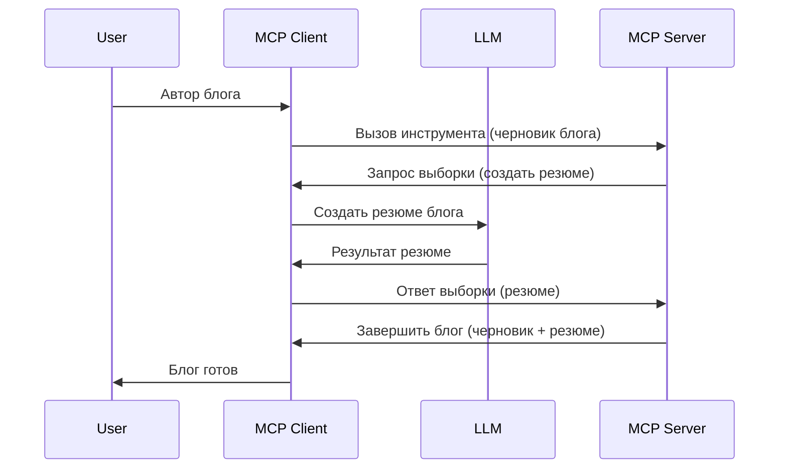

# Семплирование - делегирование функций клиенту

Иногда требуется, чтобы MCP Клиент и MCP Сервер совместно работали для достижения общей цели. Может возникнуть ситуация, когда серверу нужна помощь LLM, находящегося на клиенте. Для такой ситуации следует использовать семплирование.

Давайте рассмотрим несколько сценариев и как построить решение с использованием семплирования.

## Обзор

В этом уроке мы сосредоточимся на объяснении, когда и где использовать семплирование, а также как его настроить.

## Цели обучения

В этой главе мы:

- Объясним, что такое семплирование и когда его использовать.
- Покажем, как настроить семплирование в MCP.
- Приведём примеры работы семплирования на практике.

## Что такое семплирование и зачем его использовать?

Семплирование — это продвинутая функция, работающая следующим образом:


### Запрос семплирования

Итак, теперь, когда у нас есть общее представление о правдоподобном сценарии, давайте поговорим о запросе семплирования, который сервер отправляет клиенту. Вот как может выглядеть такой запрос в формате JSON-RPC:

```json
{
  "jsonrpc": "2.0",
  "id": 1,
  "method": "sampling/createMessage",
  "params": {
    "messages": [
      {
        "role": "user",
        "content": {
          "type": "text",
          "text": "Create a blog post summary of the following blog post: <BLOG POST>"
        }
      }
    ],
    "modelPreferences": {
      "hints": [
        {
          "name": "claude-3-sonnet"
        }
      ],
      "intelligencePriority": 0.8,
      "speedPriority": 0.5
    },
    "systemPrompt": "You are a helpful assistant.",
    "maxTokens": 100
  }
}
```

Здесь стоит обратить внимание на несколько моментов:

- Prompt, в разделе content -> text, — это наш промпт, инструкция для LLM резюмировать содержимое блога.

- **modelPreferences**. Этот раздел — именно рекомендации, пожелания по конфигурации, которую следует использовать для LLM. Пользователь может принять эти рекомендации или изменить их. В данном случае есть рекомендации по используемой модели, приоритету скорости и умности.
- **systemPrompt** — это ваш обычный системный промпт, который задаёт характер LLM и содержит инструкции для руководства.
- **maxTokens** — ещё одно свойство, в котором указывается рекомендуемое количество токенов для выполнения задачи.

### Ответ на семплирование

Этот ответ — результат того, что MCP Клиент отправляет обратно MCP Серверу после вызова LLM, ожидания ответа и формирования этого сообщения. Вот как он может выглядеть в формате JSON-RPC:

```json
{
  "jsonrpc": "2.0",
  "id": 1,
  "result": {
    "role": "assistant",
    "content": {
      "type": "text",
      "text": "Here's your abstract <ABSTRACT>"
    },
    "model": "gpt-5",
    "stopReason": "endTurn"
  }
}
```

Обратите внимание, что ответ является кратким изложением блога, как именно мы и просили. Также обратите внимание, что в ответе используется модель "gpt-5", а не запрашиваемая "claude-3-sonnet". Это показывает, что пользователь может изменить своё мнение по поводу используемой модели, а запрос семплирования — это всего лишь рекомендация.

Хорошо, теперь, когда мы понимаем основной поток и полезное применение задачи "создание блога + краткое изложение", давайте рассмотрим, что необходимо сделать, чтобы это заработало.

### Типы сообщений

Сообщения семплирования не ограничиваются только текстом, вы также можете отправлять изображения и аудио. Вот как выглядит JSON-RPC для разных типов:

**Текст**

```json
{
  "type": "text",
  "text": "The message content"
}
```

**Изображение**

```json
{
  "type": "image",
  "data": "base64-encoded-image-data",
  "mimeType": "image/jpeg"
}
```

**Аудио**

```json
{
  "type": "audio",
  "data": "base64-encoded-audio-data",
  "mimeType": "audio/wav"
}
```

> NOTE: для более подробной информации по семплированию смотрите [официальную документацию](https://modelcontextprotocol.io/specification/2025-06-18/client/sampling)

## Как настроить семплирование на клиенте

> Примечание: если вы реализуете только сервер, здесь особо ничего делать не нужно.

На клиенте необходимо указать следующую функцию следующим образом:

```json
{
  "capabilities": {
    "sampling": {}
  }
}
```

Это будет учтено при инициализации выбранного клиента с сервером.

## Пример работы семплирования — создание блога

Давайте вместе напишем сервер семплирования, нам нужно сделать следующее:

1. Создать утилиту на сервере.
2. Эта утилита должна создать запрос семплирования.
3. Утилита должна ждать ответа на запрос семплирования от клиента.
4. Затем должен быть сформирован результат работы утилиты.

Рассмотрим код шаг за шагом:

### -1- Создаём утилиту

**python**

```python
@mcp.tool()
async def create_blog(title: str, content: str, ctx: Context[ServerSession, None]) -> str:
    """Create a blog post and generate a summary"""

```

### -2- Создаём запрос семплирования

Расширьте утилиту следующим кодом:

**python**

```python
post = BlogPost(
        id=len(posts) + 1,
        title=title,
        content=content,
        abstract=""
    )

prompt = f"Create an abstract of the following blog post: title: {title} and draft: {content} "

result = await ctx.session.create_message(
        messages=[
            SamplingMessage(
                role="user",
                content=TextContent(type="text", text=prompt),
            )
        ],
        max_tokens=100,
)

```

### -3- Ждём ответ и возвращаем его

**python**

```python
post.abstract = result.content.text

posts.append(post)

# вернуть полный продукт
return json.dumps({
    "id": post.title,
    "abstract": post.abstract
})
```

### -4- Полный код

**python**

```python
from starlette.applications import Starlette
from starlette.routing import Mount, Host

from mcp.server.fastmcp import Context, FastMCP

from mcp.server.session import ServerSession
from mcp.types import SamplingMessage, TextContent

import json


from uuid import uuid4
from typing import List
from pydantic import BaseModel


mcp = FastMCP("Blog post generator")

# app = FastAPI()

posts = []

class BlogPost(BaseModel):
    id: int
    title: str
    content: str
    abstract: str

posts: List[BlogPost] = []

@mcp.tool()
async def create_blog(title: str, content: str, ctx: Context[ServerSession, None]) -> str:
    """Create a blog post and generate a summary"""

    post = BlogPost(
        id=len(posts) + 1,
        title=title,
        content=content,
        abstract=""
    )

    prompt = f"Create an abstract of the following blog post: title: {title} and draft: {content} "

    result = await ctx.session.create_message(
        messages=[
            SamplingMessage(
                role="user",
                content=TextContent(type="text", text=prompt),
            )
        ],
        max_tokens=100,
    )

    post.abstract = result.content.text

    posts.append(post)

    # вернуть полный блог пост
    return json.dumps({
        "id": post.title,
        "abstract": post.abstract
    })

if __name__ == "__main__":
    print("Starting server...")
    # mcp.run()
    mcp.run(transport="streamable-http")

# запустить приложение командой: python server.py
```

### -5- Тестирование в Visual Studio Code

Чтобы протестировать это в Visual Studio Code, сделайте следующее:

1. Запустите сервер в терминале
2. Добавьте его в *mcp.json* (и убедитесь, что он запущен), например так:

   ```json
   "servers": {
      "blog-server": {
        "type": "http",
        "url": "http://localhost:8000/mcp"
      }
   }
   ```

3. Введите промпт:

   ```text
   create a blog post named "Where Python comes from", the content is "Python is actually named after Monty Python Flying Circus"
   ```

4. Разрешите выполнение семплирования. При первом тестировании будет показан дополнительный диалог согласия, после чего появится стандартный диалог с запросом разрешения на запуск утилиты.

5. Просмотрите результаты. Вы увидите результаты, красиво отображённые в GitHub Copilot Chat, а также сможете изучить исходный JSON-ответ.

**Бонус**. В Visual Studio Code отличная поддержка семплирования. Можно настроить доступ к семплированию для установленного сервера следующим образом:

1. Перейдите в раздел расширений.
2. Выберите значок шестерёнки для вашего установленного сервера в разделе "MCP SERVERS - INSTALLED".
3. Выберите "Configure Model Access", здесь вы можете выбрать, какие модели GitHub Copilot может использовать при выполнении семплирования. Также здесь можно просмотреть все недавние запросы семплирования, выбрав "Show Sampling requests".

## Задание

В этом задании вам необходимо создать немного иное семплирование — интеграцию для генерации описания продукта. Вот ваша ситуация:

**Сценарий**: сотрудник бэк-офиса e-commerce тратит слишком много времени на создание описаний товаров. Поэтому необходимо создать решение, в котором можно вызвать утилиту "create_product" с аргументами "title" и "keywords", которая должна сгенерировать полный продукт с полем "description", заполняемым LLM клиента.

TIP: используйте приобретённые знания, чтобы построить сервер и его утилиту с использованием запроса семплирования.

## Решение

[Решение](./solution/README.md)

## Основные выводы

Семплирование — мощная функция, позволяющая серверу делегировать задачи клиенту, когда требуется помощь LLM.

## Что дальше

- [Глава 4 - Практическая реализация](../../04-PracticalImplementation/README.md)

---

<!-- CO-OP TRANSLATOR DISCLAIMER START -->
**Отказ от ответственности**:  
Этот документ был переведен с помощью сервиса автоматического перевода [Co-op Translator](https://github.com/Azure/co-op-translator). Хотя мы стремимся к точности, имейте в виду, что автоматический перевод может содержать ошибки или неточности. Оригинальный документ на исходном языке следует считать авторитетным источником. Для получения критически важной информации рекомендуется профессиональный человеческий перевод. Мы не несем ответственности за любые недоразумения или неправильные толкования, возникшие в результате использования этого перевода.
<!-- CO-OP TRANSLATOR DISCLAIMER END -->