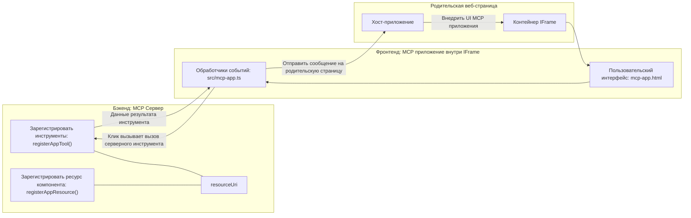

# MCP Apps

MCP Apps — это новая парадигма в MCP. Идея заключается в том, что вы не только отвечаете данными в ответ на вызов инструмента, но и предоставляете информацию о том, как с этой информацией следует взаимодействовать. Это означает, что результаты инструментов теперь могут содержать информацию о пользовательском интерфейсе. Зачем нам это нужно? Подумайте о том, как вы делаете дела сегодня. Скорее всего, вы обрабатываете результаты MCP Server, создавая какой-то фронтенд, — это код, который нужно писать и поддерживать. Иногда это то, что вам нужно, но иногда было бы здорово просто добавить фрагмент информации, который является самодостаточным и содержит всё — от данных до пользовательского интерфейса.

## Обзор

Этот урок предоставляет практические рекомендации по MCP Apps, как начать работу с ними и как интегрировать их в ваши существующие веб-приложения. MCP Apps — очень новое дополнение к стандарту MCP.

## Цели обучения

К концу этого урока вы сможете:

- Объяснить, что такое MCP Apps.
- Понять, когда использовать MCP Apps.
- Создавать и интегрировать собственные MCP Apps.

## MCP Apps — как это работает

Идея MCP Apps — предоставлять ответ, который по сути является компонентом для рендеринга. Такой компонент может иметь визуальные элементы и интерактивность, например, нажатия кнопок, ввод пользователя и многое другое. Начнем с серверной части и нашего MCP Server. Чтобы создать компонент MCP App, нужно создать инструмент и ресурс приложения. Эти две части связаны с помощью resourceUri.

Вот пример. Попробуем визуализировать, что вовлечено и какая часть за что отвечает:

```text
server.ts -- responsible for registering tools and the component as a UI component
src/
  mcp-app.ts -- wiring up event handlers
mcp-app.html -- the user interface
```

На этой схеме показана архитектура создания компонента и его логики.


Давайте теперь опишем обязанности backend и frontend соответственно.

### Бэкенд

Нужно выполнить две задачи:

- Зарегистрировать инструменты, с которыми мы хотим взаимодействовать.
- Определить компонент.

**Регистрация инструмента**

```typescript
registerAppTool(
    server,
    "get-time",
    {
      title: "Get Time",
      description: "Returns the current server time.",
      inputSchema: {},
      _meta: { ui: { resourceUri } }, // Связывает этот инструмент с его ресурсом интерфейса пользователя
    },
    async () => {
      const time = new Date().toISOString();
      return { content: [{ type: "text", text: time }] };
    },
  );

```

В приведённом выше коде описывается поведение, где создаётся инструмент с именем `get-time`. Он не принимает входных данных, но возвращает текущее время. У нас есть возможность определить `inputSchema` для инструментов, где нужно принимать пользовательский ввод.

**Регистрация компонента**

В том же файле нужно также зарегистрировать компонент:

```typescript
const resourceUri = "ui://get-time/mcp-app.html";

// Зарегистрируйте ресурс, который возвращает объединённые HTML/JavaScript для пользовательского интерфейса.
registerAppResource(
  server,
  resourceUri,
  resourceUri,
  { mimeType: RESOURCE_MIME_TYPE },
  async () => {
    const html = await fs.readFile(path.join(DIST_DIR, "mcp-app.html"), "utf-8");

    return {
    contents: [
        { uri: resourceUri, mimeType: RESOURCE_MIME_TYPE, text: html },
    ],
    };
  },
);
```

Обратите внимание, что мы указываем `resourceUri` для связи компонента с его инструментами. Также интересен callback, где мы загружаем UI-файл и возвращаем компонент.

### Фронтенд компонента

Как и для бэкенда, здесь две части:

- Фронтенд, написанный на чистом HTML.
- Код, который обрабатывает события и определяет действия, например вызов инструментов или отправка сообщений в родительское окно.

**Пользовательский интерфейс**

Посмотрим на пользовательский интерфейс.

```html
<!-- mcp-app.html -->
<!DOCTYPE html>
<html lang="en">
  <head>
    <meta charset="UTF-8" />
    <title>Get Time App</title>
  </head>
  <body>
    <p>
      <strong>Server Time:</strong> <code id="server-time">Loading...</code>
    </p>
    <button id="get-time-btn">Get Server Time</button>
    <script type="module" src="/src/mcp-app.ts"></script>
  </body>
</html>
```

**Подключение событий**

Последний этап — подключение обработчиков событий. Это значит, что мы определяем, какие части UI нуждаются в обработчиках событий и что делать при возникновении событий:

```typescript
// mcp-app.ts

import { App } from "@modelcontextprotocol/ext-apps";

// Получить ссылки на элементы
const serverTimeEl = document.getElementById("server-time")!;
const getTimeBtn = document.getElementById("get-time-btn")!;

// Создать экземпляр приложения
const app = new App({ name: "Get Time App", version: "1.0.0" });

// Обработать результаты инструмента от сервера. Установить до `app.connect()`, чтобы избежать
// пропуска начального результата инструмента.
app.ontoolresult = (result) => {
  const time = result.content?.find((c) => c.type === "text")?.text;
  serverTimeEl.textContent = time ?? "[ERROR]";
};

// Подключить обработчик клика кнопки
getTimeBtn.addEventListener("click", async () => {
  // `app.callServerTool()` позволяет интерфейсу запрсить свежие данные с сервера
  const result = await app.callServerTool({ name: "get-time", arguments: {} });
  const time = result.content?.find((c) => c.type === "text")?.text;
  serverTimeEl.textContent = time ?? "[ERROR]";
});

// Подключение к хосту
app.connect();
```

Как вы видите, это обычный код для привязки элементов DOM к событиям. Особое внимание стоит уделить вызову `callServerTool`, который в итоге вызывает инструмент на бэкенде.

## Работа с пользовательским вводом

До сих пор мы видели компонент с кнопкой, которая при нажатии вызывает инструмент. Давайте добавим больше элементов интерфейса, например поле ввода, и посмотрим, как отправлять аргументы инструменту. Реализуем функциональность FAQ. Вот как это должно работать:

- Должна быть кнопка и поле ввода, где пользователь вводит ключевое слово для поиска, например "Shipping". Это вызовет инструмент на бэкенде, который выполнит поиск по данным FAQ.
- Инструмент, который поддерживает поиск в FAQ.

Сначала добавим необходимую поддержку на бэкенде:

```typescript
const faq: { [key: string]: string } = {
    "shipping": "Our standard shipping time is 3-5 business days.",
    "return policy": "You can return any item within 30 days of purchase.",
    "warranty": "All products come with a 1-year warranty covering manufacturing defects.",
  }

registerAppTool(
    server,
    "get-faq",
    {
      title: "Search FAQ",
      description: "Searches the FAQ for relevant answers.",
      inputSchema: zod.object({
        query: zod.string().default("shipping"),
      }),
      _meta: { ui: { resourceUri: faqResourceUri } }, // Связывает этот инструмент с его ресурсом пользовательского интерфейса
    },
    async ({ query }) => {
      const answer: string = faq[query.toLowerCase()] || "Sorry, I don't have an answer for that.";
      return { content: [{ type: "text", text: answer }] };
    },
  );
```

Здесь показано, как мы заполняем `inputSchema` и задаём для него схему `zod` следующим образом:

```typescript
inputSchema: zod.object({
  query: zod.string().default("shipping"),
})
```

В приведённой схеме объявляется входной параметр `query`, который необязателен и имеет значение по умолчанию "shipping".

Хорошо, давайте перейдем к *mcp-app.html*, чтобы посмотреть, какой UI нам нужно создать для этого:

```html
<div class="faq">
    <h1>FAQ response</h1>
    <p>FAQ Response: <code id="faq-response">Loading...</code></p>
    <input type="text" id="faq-query" placeholder="Enter FAQ query" />
    <button id="get-faq-btn">Get FAQ Response</button>
  </div>
```

Отлично, теперь у нас есть поле ввода и кнопка. Давайте перейдем к *mcp-app.ts*, чтобы подключить эти события:

```typescript
const getFaqBtn = document.getElementById("get-faq-btn")!;
const faqQueryInput = document.getElementById("faq-query") as HTMLInputElement;

getFaqBtn.addEventListener("click", async () => {
  const query = faqQueryInput.value;
  const result = await app.callServerTool({ name: "get-faq", arguments: { query } });
  const faq = result.content?.find((c) => c.type === "text")?.text;
  faqResponseEl.textContent = faq ?? "[ERROR]";
});
```

В приведённом коде мы:

- Создаем ссылки на интерактивные элементы UI.
- Обрабатываем нажатие кнопки, чтобы распарсить значение из поля ввода, а также вызываем `app.callServerTool()` с параметрами `name` и `arguments`, где последний передает `query` как значение.

Фактически, при вызове `callServerTool` отправляется сообщение в родительское окно, которое затем вызывает MCP Server.

### Попробуйте сами

При запуске вы должны увидеть следующее:


а вот так выглядит ввод, например, по запросу "warranty"


Чтобы запустить этот код, перейдите в [раздел с кодом](./code/README.md)

## Тестирование в Visual Studio Code

Visual Studio Code отлично поддерживает MCP Apps и, вероятно, является одним из самых простых способов тестирования ваших MCP Apps. Чтобы использовать Visual Studio Code, добавьте запись сервера в *mcp.json* следующим образом:

```json
"my-mcp-server-7178eca7": {
    "url": "http://localhost:3001/mcp",
    "type": "http"
  }
```

Затем запустите сервер, вы сможете взаимодействовать с вашим MCP App через окно чата при условии, что у вас установлен GitHub Copilot.

Вы можете вызвать его через команду, например "#get-faq":


И, как при запуске в веб-браузере, интерфейс отрисуется так же:


## Задание

Создайте игру "камень, ножницы, бумага". В ней должны быть:

UI:

- выпадающий список с вариантами
- кнопка для отправки выбора
- метка, которая показывает, кто что выбрал и кто победил

Сервер:

- инструмент rock paper scissor, который принимает "choice" на вход. Он также должен сгенерировать выбор компьютера и определить победителя.

## Решение

[Решение](./assignment/README.md)

## Итоги

Мы познакомились с новой парадигмой MCP Apps. Это новая парадигма, которая позволяет MCP Server не только контролировать данные, но и то, как эти данные должны отображаться.

Кроме того, мы узнали, что эти MCP Apps размещаются в фрейме IFrame, и чтобы взаимодействовать с MCP Server, необходимо отправлять сообщения в родительское веб-приложение. Существует несколько библиотек как для обычного JavaScript, так и для React и других фреймворков, которые упрощают такую коммуникацию.

## Основные выводы

Вот что вы узнали:

- MCP Apps — новый стандарт, полезный, когда нужно поставлять одновременно данные и функции пользовательского интерфейса.
- Эти приложения запускаются в IFrame по соображениям безопасности.

## Что дальше

- [Глава 4](../../04-PracticalImplementation/README.md)

---

<!-- CO-OP TRANSLATOR DISCLAIMER START -->
**Отказ от ответственности**:  
Этот документ был переведен с помощью сервиса автоматического перевода [Co-op Translator](https://github.com/Azure/co-op-translator). Несмотря на наши усилия обеспечить точность, пожалуйста, имейте в виду, что автоматический перевод может содержать ошибки или неточности. Оригинальный документ на его исходном языке следует считать авторитетным источником. Для критически важной информации рекомендуется профессиональный перевод человеком. Мы не несем ответственности за любые недоразумения или неправильные толкования, возникающие в результате использования данного перевода.
<!-- CO-OP TRANSLATOR DISCLAIMER END -->