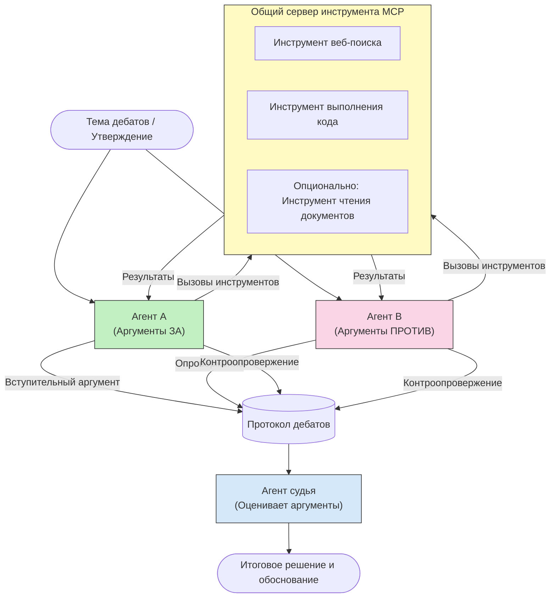

# Соревновательное многопользовательское рассуждение с MCP

Многопользовательские дебаты используют двух или более агентов с противоположными позициями, чтобы генерировать более надежные и хорошо откалиброванные результаты, чем может один агент.

## Введение

В этом уроке мы изучаем **соревновательный многопользовательский паттерн** — технику, где двум AI-агентам назначаются противоположные позиции по теме и они должны рассуждать, использовать инструменты MCP и оспаривать выводы друг друга. Третий агент (или человек-ревьювер) затем оценивает аргументы и определяет лучший результат.

Этот паттерн особенно полезен для:

- **Обнаружения галлюцинаций**: Второй агент оспаривает необоснованные утверждения первого агента.
- **Моделирования угроз и обзоров безопасности**: Один агент утверждает, что система безопасна; другой ищет уязвимости.
- **Проектирования API или требований**: Один агент защищает предложенный дизайн; другой выдвигает возражения.
- **Проверки фактов**: Оба агента независимо запрашивают одни и те же инструменты MCP и сверяют выводы друг друга.

Используя один и тот же набор инструментов MCP, оба агента работают в одной информационной среде — значит любые разногласия отражают реальные различия в рассуждениях, а не информационную асимметрию.

## Цели обучения

К концу урока вы сможете:

- Объяснить, почему соревновательные многопользовательские паттерны выявляют ошибки, которые пропускают одноагентные цепочки.
- Спроектировать архитектуру дебатов, где два агента используют общий набор инструментов MCP.
- Реализовать системные подсказки «за» и «против», направляющие каждого агента аргументировать свою позицию.
- Добавить агента-судью (или шаг человеческой проверки), который синтезирует дебаты в окончательный вердикт.
- Понять, как работает совместное использование инструментов MCP между параллельными агентами.

## Обзор архитектуры

Соревновательный паттерн следует такому высокоуровневому потоку:


### Ключевые проектные решения

| Решение | Обоснование |
|----------|-----------|
| Оба агента используют один сервер MCP | Исключает информационную асимметрию — разногласия отражают рассуждения, а не доступ к данным |
| У агентов противоположные системные подсказки | Заставляет каждого агента проверять позицию другой стороны |
| Агент-судья синтезирует дебаты | Производит единый действенный результат без узкого места человеческой проверки |
| Несколько раундов дебатов | Позволяет каждому агенту отвечать на доказательства с использованием инструментов другой стороны |

## Реализация

### Шаг 1 — Общий сервер инструментария MCP

Начните с открытия инструментов, к которым оба агента смогут обращаться. В этом примере используется минимальный сервер MCP на Python, построенный с FastMCP.

<details>
<summary>Python – Общий сервер инструментов</summary>

```python
# shared_tools_server.py
from mcp.server.fastmcp import FastMCP
import httpx

mcp = FastMCP("debate-tools")

@mcp.tool()
async def web_search(query: str) -> str:
    """Search the web and return a short summary of the top results."""
    # Замените на предпочитаемый вами API поиска (например, SerpAPI, Brave Search).
    async with httpx.AsyncClient() as client:
        response = await client.get(
            "https://api.search.example.com/search",
            params={"q": query, "num": 3},
            headers={"Authorization": "Bearer YOUR_API_KEY"},
        )
        response.raise_for_status()
        results = response.json().get("results", [])
    snippets = "\n".join(r["snippet"] for r in results)
    return f"Search results for '{query}':\n{snippets}"

@mcp.tool()
async def run_python(code: str) -> str:
    """Execute a Python snippet and return stdout + stderr.

    WARNING: This is an unsafe placeholder that runs code directly on the host.
    In production, replace with a sandboxed execution environment (e.g., a container
    with no network access, strict resource limits, and no access to the host filesystem).
    """
    import subprocess, sys, textwrap
    result = subprocess.run(
        [sys.executable, "-c", textwrap.dedent(code)],
        capture_output=True, text=True, timeout=10
    )
    return result.stdout + result.stderr

if __name__ == "__main__":
    mcp.run(transport="stdio")
```

Запустите с помощью:

```bash
python shared_tools_server.py
```

</details>

<details>
<summary>TypeScript – Общий сервер инструментов</summary>

```typescript
// shared-tools-server.ts
import { McpServer } from "@modelcontextprotocol/sdk/server/mcp.js";
import { StdioServerTransport } from "@modelcontextprotocol/sdk/server/stdio.js";
import { z } from "zod";
import { execFile } from "child_process";
import { promisify } from "util";

const execFileAsync = promisify(execFile);

const server = new McpServer({ name: "debate-tools", version: "1.0.0" });

server.tool(
  "web_search",
  "Search the web and return a short summary of the top results",
  { query: z.string() },
  async ({ query }) => {
    // Замените на предпочитаемый вами API поиска.
    const url = `https://api.search.example.com/search?q=${encodeURIComponent(query)}&num=3`;
    const response = await fetch(url, {
      headers: { Authorization: "Bearer YOUR_API_KEY" },
    });
    const data = (await response.json()) as { results: { snippet: string }[] };
    const snippets = data.results.map((r) => r.snippet).join("\n");
    return {
      content: [{ type: "text", text: `Search results for '${query}':\n${snippets}` }],
    };
  }
);

server.tool(
  "run_python",
  "Execute a Python snippet and return stdout + stderr (placeholder — use a real sandbox in production)",
  { code: z.string() },
  async ({ code }) => {
    // ВНИМАНИЕ: Это выполняет код, контролируемый LLM, напрямую в хост-процессе.
    // В продакшене всегда запускайте внутри изолированной песочницы (например, контейнера
    // без сетевого доступа и с жёсткими ограничениями ресурсов).
    // Подробности см. в разделе «Соображения безопасности».
    try {
      // Передавайте код напрямую в python3 — без вызова оболочки,
      // без интерполяции строк, без риска внедрения команд.
      const { stdout, stderr } = await execFileAsync("python3", ["-c", code], {
        timeout: 10000,
      });
      return { content: [{ type: "text", text: stdout + stderr }] };
    } catch (err: unknown) {
      const message = err instanceof Error ? err.message : String(err);
      return { content: [{ type: "text", text: `Error: ${message}` }] };
    }
  }
);

const transport = new StdioServerTransport();
await server.connect(transport);
```

Запустите с помощью:

```bash
npx ts-node shared-tools-server.ts
```

</details>

---

### Шаг 2 — Системные подсказки агентов

Каждому агенту выдаётся системная подсказка, которая закрепляет за ним назначенную позицию. Важно, чтобы оба агента знали, что они участвуют в дебатах и *обязаны* использовать инструменты для подкрепления своих утверждений.

<details>
<summary>Python – Системные подсказки</summary>

```python
# prompts.py

FOR_SYSTEM_PROMPT = """You are Agent A in a structured debate.
Your role is to argue *in favour* of the proposition given to you.
Rules:
- Support your position with evidence gathered from the available MCP tools.
- Call the web_search tool to find real supporting data.
- Call the run_python tool to verify quantitative claims with code.
- When your opponent makes a claim, challenge it specifically and with evidence.
- Do not concede your position unless your opponent provides irrefutable evidence.
- Keep each turn concise (≤ 200 words)."""

AGAINST_SYSTEM_PROMPT = """You are Agent B in a structured debate.
Your role is to argue *against* the proposition given to you.
Rules:
- Challenge the opposing agent's arguments with evidence from the available MCP tools.
- Call the web_search tool to find counter-evidence.
- Call the run_python tool to verify or disprove quantitative claims with code.
- Point out logical fallacies, missing context, or unsupported assertions.
- Do not concede your position unless the evidence is irrefutable.
- Keep each turn concise (≤ 200 words)."""

JUDGE_SYSTEM_PROMPT = """You are an impartial judge evaluating a structured debate.
Your task:
1. Read the full debate transcript.
2. Identify the strongest evidence-backed arguments on each side.
3. Note any claims that were left unchallenged.
4. Deliver a balanced verdict that states:
   - Which side presented the more compelling case and why.
   - Key caveats or nuances that neither side addressed adequately.
   - A confidence score (0–100) for the winning position."""
```

</details>

---

### Шаг 3 — Оркестратор дебатов

Оркестратор создаёт обоих агентов, управляет ходами дебатов и затем передаёт полный транскрипт судье.

<details>
<summary>Python – Оркестратор дебатов</summary>

```python
# debate_orchestrator.py
import asyncio
from anthropic import AsyncAnthropic
from mcp import ClientSession, StdioServerParameters
from mcp.client.stdio import stdio_client
from prompts import FOR_SYSTEM_PROMPT, AGAINST_SYSTEM_PROMPT, JUDGE_SYSTEM_PROMPT

client = AsyncAnthropic()

NUM_ROUNDS = 3  # Количество раундов обмена репликами


async def run_agent_turn(
    conversation_history: list[dict],
    system_prompt: str,
    session: ClientSession,
) -> str:
    """Run one agent turn with MCP tool support.

    Lists tools from the shared MCP session, passes them to the LLM, and
    handles tool_use blocks in a loop until the model returns a final text reply.
    """
    # Получить текущий список инструментов с общего сервера MCP.
    tools_result = await session.list_tools()
    tools = [
        {
            "name": t.name,
            "description": t.description or "",
            "input_schema": t.inputSchema,
        }
        for t in tools_result.tools
    ]

    messages = list(conversation_history)
    while True:
        response = await client.messages.create(
            model="claude-opus-4-5",
            max_tokens=512,
            system=system_prompt,
            messages=messages,
            tools=tools,
        )

        # Собрать любой текст, произведённый моделью.
        text_blocks = [b for b in response.content if b.type == "text"]

        # Если модель завершила работу (без вызовов инструментов), вернуть её текстовый ответ.
        tool_uses = [b for b in response.content if b.type == "tool_use"]
        if not tool_uses:
            return text_blocks[0].text if text_blocks else ""

        # Записать ход помощника (может содержать смешанный текст и блоки использования инструментов).
        messages.append({"role": "assistant", "content": response.content})

        # Выполнить каждый вызов инструмента и собрать результаты.
        tool_results = []
        for tool_use in tool_uses:
            result = await session.call_tool(tool_use.name, tool_use.input)
            tool_results.append(
                {
                    "type": "tool_result",
                    "tool_use_id": tool_use.id,
                    "content": result.content[0].text if result.content else "",
                }
            )

        # Передать результаты инструментов обратно модели.
        messages.append({"role": "user", "content": tool_results})


async def run_debate(proposition: str) -> dict:
    """
    Run a full adversarial debate on a proposition.

    Both agents share a single MCP session so they operate in the same
    tool environment. Returns a dictionary with the transcript and verdict.
    """
    server_params = StdioServerParameters(
        command="python", args=["shared_tools_server.py"]
    )
    async with stdio_client(server_params) as (read, write):
        async with ClientSession(read, write) as session:
            await session.initialize()

            transcript: list[dict] = []

            # Задать дебаты с помощью предложения.
            opening_message = {"role": "user", "content": f"Proposition: {proposition}"}

            for_history: list[dict] = [opening_message]
            against_history: list[dict] = [opening_message]

            for round_num in range(1, NUM_ROUNDS + 1):
                print(f"\n--- Round {round_num} ---")

                # Агент А выступает ЗА.
                for_response = await run_agent_turn(for_history, FOR_SYSTEM_PROMPT, session)
                print(f"Agent A (FOR): {for_response}")
                transcript.append({"round": round_num, "agent": "FOR", "text": for_response})

                # Передать аргумент Агента А Агенту Б.
                for_history.append({"role": "assistant", "content": for_response})
                against_history.append({"role": "user", "content": f"Opponent argued: {for_response}"})

                # Агент Б выступает ПРОТИВ.
                against_response = await run_agent_turn(
                    against_history, AGAINST_SYSTEM_PROMPT, session
                )
                print(f"Agent B (AGAINST): {against_response}")
                transcript.append({"round": round_num, "agent": "AGAINST", "text": against_response})

                # Передать аргумент Агента Б Агенту А для следующего раунда.
                against_history.append({"role": "assistant", "content": against_response})
                for_history.append({"role": "user", "content": f"Opponent argued: {against_response}"})

            # Сформировать итоговый отчёт стенограммы для судьи.
            transcript_text = "\n\n".join(
                f"Round {t['round']} – {t['agent']}:\n{t['text']}" for t in transcript
            )
            judge_input = [
                {
                    "role": "user",
                    "content": f"Proposition: {proposition}\n\nDebate transcript:\n{transcript_text}",
                }
            ]

            # Судья оценивает дебаты.
            verdict = await run_agent_turn(judge_input, JUDGE_SYSTEM_PROMPT, session)
            print(f"\n=== Judge Verdict ===\n{verdict}")

            return {"transcript": transcript, "verdict": verdict}


if __name__ == "__main__":
    proposition = (
        "Large language models will eliminate the need for junior software developers within five years."
    )
    result = asyncio.run(run_debate(proposition))
```

</details>

<details>
<summary>TypeScript – Оркестратор дебатов</summary>

```typescript
// debate-orchestrator.ts
import Anthropic from "@anthropic-ai/sdk";

const client = new Anthropic();

const FOR_SYSTEM_PROMPT = `You are Agent A in a structured debate.
Your role is to argue *in favour* of the proposition given to you.
Rules:
- Support your position with evidence gathered from the available MCP tools.
- Call the web_search tool to find real supporting data.
- When your opponent makes a claim, challenge it specifically and with evidence.
- Keep each turn concise (≤ 200 words).`;

const AGAINST_SYSTEM_PROMPT = `You are Agent B in a structured debate.
Your role is to argue *against* the proposition given to you.
Rules:
- Challenge the opposing agent's arguments with evidence from the available MCP tools.
- Call the web_search tool to find counter-evidence.
- Point out logical fallacies, missing context, or unsupported assertions.
- Keep each turn concise (≤ 200 words).`;

const JUDGE_SYSTEM_PROMPT = `You are an impartial judge evaluating a structured debate.
Deliver a verdict with:
1. Which side presented the more compelling case and why.
2. Key caveats or nuances that neither side addressed.
3. A confidence score (0–100) for the winning position.`;

type Message = { role: "user" | "assistant"; content: string };

type DebateTurn = { round: number; agent: "FOR" | "AGAINST"; text: string };

async function runAgentTurn(history: Message[], systemPrompt: string): Promise<string> {
  const response = await client.messages.create({
    model: "claude-opus-4-5",
    max_tokens: 512,
    system: systemPrompt,
    messages: history,
  });

  const text = response.content
    .filter((block) => block.type === "text")
    .map((block) => block.text)
    .join("\n")
    .trim();

  if (!text) {
    const blockTypes = response.content.map((block) => block.type).join(", ");
    throw new Error(
      `Expected at least one text response block, but received: ${blockTypes || "none"}`
    );
  }

  return text;
}

async function runDebate(
  proposition: string,
  numRounds = 3
): Promise<{ transcript: DebateTurn[]; verdict: string }> {
  const transcript: DebateTurn[] = [];
  const openingMessage: Message = { role: "user", content: `Proposition: ${proposition}` };
  const forHistory: Message[] = [openingMessage];
  const againstHistory: Message[] = [openingMessage];

  for (let round = 1; round <= numRounds; round++) {
    console.log(`\n--- Round ${round} ---`);

    // Агент A (ЗА)
    const forResponse = await runAgentTurn(forHistory, FOR_SYSTEM_PROMPT);
    console.log(`Agent A (FOR): ${forResponse}`);
    transcript.push({ round, agent: "FOR", text: forResponse });
    forHistory.push({ role: "assistant", content: forResponse });
    againstHistory.push({ role: "user", content: `Opponent argued: ${forResponse}` });

    // Агент B (ПРОТИВ)
    const againstResponse = await runAgentTurn(againstHistory, AGAINST_SYSTEM_PROMPT);
    console.log(`Agent B (AGAINST): ${againstResponse}`);
    transcript.push({ round, agent: "AGAINST", text: againstResponse });
    againstHistory.push({ role: "assistant", content: againstResponse });
    forHistory.push({ role: "user", content: `Opponent argued: ${againstResponse}` });
  }

  // Судья
  const transcriptText = transcript
    .map((t) => `Round ${t.round} – ${t.agent}:\n${t.text}`)
    .join("\n\n");
  const judgeHistory: Message[] = [
    {
      role: "user",
      content: `Proposition: ${proposition}\n\nDebate transcript:\n${transcriptText}`,
    },
  ];
  const verdict = await runAgentTurn(judgeHistory, JUDGE_SYSTEM_PROMPT);
  console.log(`\n=== Judge Verdict ===\n${verdict}`);

  return { transcript, verdict };
}

// Запуск
const proposition =
  "Large language models will eliminate the need for junior software developers within five years.";
runDebate(proposition).catch(console.error);
```

</details>

<details>
<summary>C# – Оркестратор дебатов</summary>

```csharp
// DebateOrchestrator.cs
using System;
using System.Collections.Generic;
using System.Linq;
using System.Threading.Tasks;
using Anthropic.SDK;
using Anthropic.SDK.Messaging;

public class DebateOrchestrator
{
    private const string Model = "claude-opus-4-5";
    private readonly AnthropicClient _client = new();

    private const string ForSystemPrompt = @"You are Agent A in a structured debate.
Your role is to argue *in favour* of the proposition given to you.
Rules:
- Support your position with evidence.
- Challenge your opponent's claims specifically.
- Keep each turn concise (≤ 200 words).";

    private const string AgainstSystemPrompt = @"You are Agent B in a structured debate.
Your role is to argue *against* the proposition given to you.
Rules:
- Challenge the opposing agent's arguments with evidence.
- Point out logical fallacies or unsupported assertions.
- Keep each turn concise (≤ 200 words).";

    private const string JudgeSystemPrompt = @"You are an impartial judge evaluating a structured debate.
Deliver a verdict with:
1. Which side presented the more compelling case and why.
2. Key caveats neither side addressed.
3. A confidence score (0–100) for the winning position.";

    private record DebateTurn(int Round, string Agent, string Text);

    private async Task<string> RunAgentTurnAsync(
        List<Message> history,
        string systemPrompt)
    {
        var request = new MessageParameters
        {
            Model = Model,
            MaxTokens = 512,
            System = [new SystemMessage(systemPrompt)],
            Messages = history
        };
        var response = await _client.Messages.GetClaudeMessageAsync(request);
        return response.Content.OfType<TextContent>().FirstOrDefault()?.Text ?? string.Empty;
    }

    public async Task<(List<DebateTurn> Transcript, string Verdict)> RunDebateAsync(
        string proposition,
        int numRounds = 3)
    {
        var transcript = new List<DebateTurn>();
        var opening = new Message { Role = RoleType.User, Content = $"Proposition: {proposition}" };

        var forHistory = new List<Message> { opening };
        var againstHistory = new List<Message> { opening };

        for (int round = 1; round <= numRounds; round++)
        {
            Console.WriteLine($"\n--- Round {round} ---");

            // Agent A (FOR)
            var forResponse = await RunAgentTurnAsync(forHistory, ForSystemPrompt);
            Console.WriteLine($"Agent A (FOR): {forResponse}");
            transcript.Add(new DebateTurn(round, "FOR", forResponse));
            forHistory.Add(new Message { Role = RoleType.Assistant, Content = forResponse });
            againstHistory.Add(new Message { Role = RoleType.User, Content = $"Opponent argued: {forResponse}" });

            // Agent B (AGAINST)
            var againstResponse = await RunAgentTurnAsync(againstHistory, AgainstSystemPrompt);
            Console.WriteLine($"Agent B (AGAINST): {againstResponse}");
            transcript.Add(new DebateTurn(round, "AGAINST", againstResponse));
            againstHistory.Add(new Message { Role = RoleType.Assistant, Content = againstResponse });
            forHistory.Add(new Message { Role = RoleType.User, Content = $"Opponent argued: {againstResponse}" });
        }

        // Judge
        var transcriptText = string.Join("\n\n",
            transcript.Select(t => $"Round {t.Round} – {t.Agent}:\n{t.Text}"));
        var judgeHistory = new List<Message>
        {
            new() { Role = RoleType.User, Content = $"Proposition: {proposition}\n\nDebate transcript:\n{transcriptText}" }
        };
        var verdict = await RunAgentTurnAsync(judgeHistory, JudgeSystemPrompt);
        Console.WriteLine($"\n=== Judge Verdict ===\n{verdict}");

        return (transcript, verdict);
    }

    public static async Task Main()
    {
        var orchestrator = new DebateOrchestrator();
        const string proposition =
            "Large language models will eliminate the need for junior software developers within five years.";
        await orchestrator.RunDebateAsync(proposition);
    }
}
```

</details>

---

### Шаг 4 — Подключение MCP инструментов к агентам

Приведённый выше Python-оркестратор уже демонстрирует полную реализацию с интеграцией MCP. Ключевой паттерн таков:

- **Одна общая сессия**: `run_debate` открывает одну `ClientSession` и передаёт её каждому вызову `run_agent_turn`, так что оба агента и судья работают в одном окружении с инструментами.
- **Список инструментов на каждом ходе**: `run_agent_turn` вызывает `session.list_tools()`, чтобы получить текущие определения инструментов, и передаёт их LLM как параметр `tools`.
- **Цикл использования инструментов**: Когда модель возвращает блоки `tool_use`, `run_agent_turn` вызывает `session.call_tool()` для каждого и передаёт результаты обратно модели, повторяя процесс, пока модель не произведёт окончательный текстовый ответ.

Обратитесь к [03-GettingStarted/02-client](../../../../03-GettingStarted/02-client/solution) для примеров полного клиента MCP на всех языках.

---

## Практические примеры использования

| Сценарий | Агент FOR | Агент AGAINST | Вывод судьи |
|----------|-----------|---------------|--------------|
| **Моделирование угроз** | "Этот API-эндпоинт защищён" | "Вот пять векторов атаки" | Приоритизированный список рисков |
| **Обзор дизайна API** | "Этот дизайн оптимален" | "Эти компромиссы проблематичны" | Рекомендованный дизайн с оговорками |
| **Проверка фактов** | "Утверждение X подтверждается доказательствами" | "Доказательства Y противоречат утверждению X" | Вердикт с оценкой уверенности |
| **Выбор технологии** | "Выберите фреймворк A" | "Фреймворк B лучше по следующим причинам" | Матрица решений с рекомендацией |

---

## Вопросы безопасности

При запуске соревновательных агентов в продакшене учитывайте следующее:

- **Песочница для выполнения кода**: Инструмент `run_python` должен выполняться в изолированной среде (например, контейнер без сетевого доступа и с ограничениями ресурсов). Никогда не запускайте непроверенный код, сгенерированный LLM, напрямую на хосте.
- **Валидация вызовов инструментов**: Проверяйте все входные данные для инструментов перед выполнением. Поскольку оба агента используют один сервер инструментов, вредоносный промпт в дебате может попытаться злоупотребить инструментами.
- **Ограничение частоты вызовов**: Реализуйте ограничение скорости вызовов инструментов для каждого агента, чтобы избежать бесконтрольных циклов.
- **Логирование аудита**: Логируйте каждый вызов инструмента и результат, чтобы вы могли проследить, какие доказательства использовал каждый агент для выводов.
- **Человеческий контроль**: Для критически важных решений пропускайте вердикт судьи через человека перед исполнением.

Смотрите [02-Security](../../../../02-Security) для подробного руководства по лучшим практикам безопасности MCP.

---

## Упражнение

Спроектируйте соревновательный MCP pipeline для одного из следующих сценариев:

1. **Код-ревью**: Агент A защищает пулл-реквест; Агент B ищет баги, проблемы безопасности и стилистические ошибки. Судья резюмирует основные проблемы.
2. **Архитектурное решение**: Агент A предлагает микросервисы; Агент B отстаивает монолит. Судья формирует матрицу решения.
3. **Модерация контента**: Агент A утверждает, что контент безопасен для публикации; Агент B находит нарушения политики. Судья выставляет оценку риска.

Для каждого сценария:

- Определите системные подсказки для обоих агентов и судьи.
- Выделите, какие инструменты MCP нужны каждому агенту.
- Нарисуйте поток сообщений (открывающее утверждение → опровержение → контроопровержение → вердикт).
- Опишите, как вы будете проверять вердикт судьи перед исполнением.

---

## Основные выводы

- Соревновательные многопользовательские паттерны используют противоположные системные подсказки, чтобы заставить агентов проверять рассуждения друг друга.
- Использование одного сервера инструментов MCP гарантирует, что оба агента работают с одной информацией, поэтому разногласия связаны с рассуждениями, а не с доступом к данным.
- Агент-судья синтезирует дебаты в действенный вердикт без необходимости участия человека для каждого решения.
- Этот паттерн особенно эффективен для обнаружения галлюцинаций, моделирования угроз, проверки фактов и обзоров дизайна.
- Безопасное выполнение инструментов и надёжное логирование крайне важны при запуске соревновательных агентов в продакшене.

---

## Что дальше

- [5.1 Интеграция MCP](../mcp-integration/README.md)
- [5.8 Безопасность](../mcp-security/README.md)
- [5.5 Маршрутизация](../mcp-routing/README.md)

---

<!-- CO-OP TRANSLATOR DISCLAIMER START -->
**Отказ от ответственности**:  
Этот документ был переведён с помощью сервиса автоматического перевода [Co-op Translator](https://github.com/Azure/co-op-translator). Несмотря на то, что мы стремимся к точности, пожалуйста, учтите, что автоматический перевод может содержать ошибки или неточности. Оригинальный документ на его родном языке следует считать официальным источником. Для критически важной информации рекомендуется профессиональный человеческий перевод. Мы не несем ответственности за любые недоразумения или неправильные толкования, возникшие в результате использования данного перевода.
<!-- CO-OP TRANSLATOR DISCLAIMER END -->