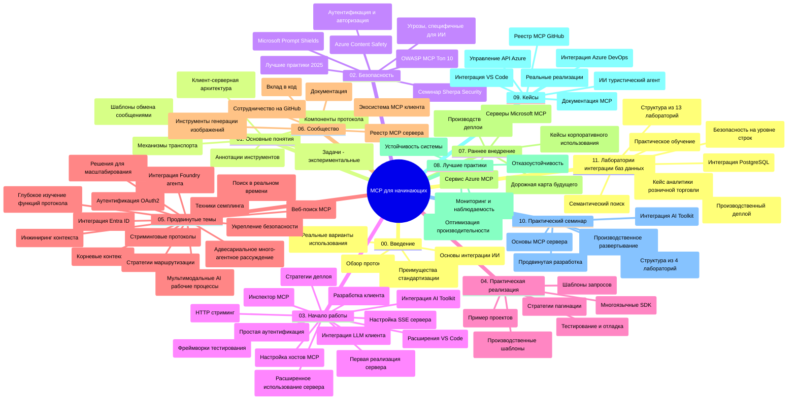

# Протокол Модельного Контекста (MCP) для начинающих — Руководство по изучению

Это руководство по изучению предлагает обзор структуры и содержания репозитория для учебного курса «Протокол Модельного Контекста (MCP) для начинающих». Используйте это руководство для эффективной навигации по репозиторию и максимального использования доступных ресурсов.

## Обзор репозитория

Протокол Модельного Контекста (MCP) — это стандартизированная платформа для взаимодействия между AI-моделями и клиентскими приложениями. Изначально созданный Anthropic, MCP теперь поддерживается более широкой MCP-сообществом через официальную организацию GitHub. Этот репозиторий предоставляет комплексный учебный курс с практическими примерами кода на C#, Java, JavaScript, Python и TypeScript, разработанный для AI-разработчиков, системных архитекторов и программистов.

## Визуальная карта учебного курса

## Структура репозитория

Репозиторий организован в одиннадцать основных разделов, каждый из которых сосредоточен на различных аспектах MCP:

1. **Введение (00-Introduction/)**
   - Обзор Протокола Модельного Контекста
   - Почему стандартизация важна в AI-пайплайнах
   - Практические случаи использования и преимущества

2. **Основные концепции (01-CoreConcepts/)**
   - Клиент-серверная архитектура
   - Ключевые компоненты протокола
   - Паттерны обмена сообщениями в MCP

3. **Безопасность (02-Security/)**
   - Угрозы безопасности в системах на базе MCP
   - Лучшие практики для обеспечения безопасности реализаций
   - Стратегии аутентификации и авторизации
   - **Комплексная документация по безопасности**:
     - Лучшие практики безопасности MCP 2025
     - Руководство по реализации Azure Content Safety
     - Контроль и техники безопасности MCP
     - Быстрая справка по лучшим практикам MCP
   - **Ключевые темы безопасности**:
     - Атаки с использованием внедрения запросов и отравления инструментов
     - Захват сессий и проблемы «смущённого заместителя»
     - Уязвимости при передаче токенов
     - Чрезмерные разрешения и контроль доступа
     - Безопасность цепочек поставок AI-компонентов
     - Интеграция Microsoft Prompt Shields

4. **Начало работы (03-GettingStarted/)**
   - Настройка и конфигурация среды
   - Создание базовых MCP-серверов и клиентов
   - Интеграция с существующими приложениями
   - Включает разделы для:
     - Первой реализации сервера
     - Разработки клиентов
     - Интеграции LLM-клиентов
     - Интеграции VS Code
     - Сервер событий с Server-Sent Events (SSE)
     - Расширенного использования сервера
     - HTTP-стриминга
     - Интеграции AI Toolkit
     - Стратегий тестирования
     - Руководства по развертыванию

5. **Практическая реализация (04-PracticalImplementation/)**
   - Использование SDK на разных языках программирования
   - Техники отладки, тестирования и проверки
   - Создание переиспользуемых шаблонов запросов и рабочих процессов
   - Примеры проектов с иллюстрациями реализации

6. **Продвинутые темы (05-AdvancedTopics/)**
   - Техники инженерии контекста
   - Интеграция агента Foundry
   - Мульти-модальные AI-воркфлоу
   - Демонстрации аутентификации OAuth2
   - Возможности поиска в реальном времени
   - Потоковая передача в реальном времени
   - Реализация корневых контекстов
   - Стратегии маршрутизации
   - Техники сэмплинга
   - Подходы к масштабированию
   - Вопросы безопасности
   - Интеграция безопасности Entra ID
   - Интеграция веб-поиска
   - Паттерны состязательного многократного агентного рассуждения (дебаты)

7. **Вклад сообщества (06-CommunityContributions/)**
   - Как создавать вклад в код и документацию
   - Совместная работа через GitHub
   - Улучшения и обратная связь от сообщества
   - Использование различных MCP-клиентов (Claude Desktop, Cline, VSCode)
   - Работа с популярными MCP-серверами, включая генерацию изображений

8. **Уроки раннего внедрения (07-LessonsfromEarlyAdoption/)**
   - Реальные реализации и истории успеха
   - Создание и развертывание решений на базе MCP
   - Тенденции и дорожная карта развития
   - **Руководство по Microsoft MCP серверам**: Комплексное руководство по 10 готовым к продакшн Microsoft MCP серверам, включая:
     - MCP Server Microsoft Learn Docs
     - Azure MCP Server (более 15 специализированных коннекторов)
     - GitHub MCP Server
     - Azure DevOps MCP Server
     - MarkItDown MCP Server
     - SQL Server MCP Server
     - Playwright MCP Server
     - Dev Box MCP Server
     - Azure AI Foundry MCP Server
     - Microsoft 365 Agents Toolkit MCP Server

9. **Лучшие практики (08-BestPractices/)**
   - Настройка и оптимизация производительности
   - Проектирование отказоустойчивых MCP-систем
   - Стратегии тестирования и устойчивости

10. **Кейсы (09-CaseStudy/)**
    - **Семь комплексных кейсов**, демонстрирующих универсальность MCP в различных сценариях:
    - **Azure AI Travel Agents**: оркестровка мультиагентной системы с Azure OpenAI и AI Search
    - **Интеграция Azure DevOps**: автоматизация рабочих процессов с обновлением данных YouTube
    - **Получение документации в реальном времени**: консольный клиент на Python с потоковым HTTP
    - **Интерактивный генератор учебного плана**: веб-приложение Chainlit с разговорным AI
    - **Документация в редакторе**: интеграция VS Code с рабочими процессами GitHub Copilot
    - **Azure API Management**: интеграция корпоративных API с созданием MCP сервера
    - **GitHub MCP Registry**: развитие экосистемы и платформа агентной интеграции
    - Примеры реализации охватывают корпоративную интеграцию, производительность разработчиков и развитие экосистемы

11. **Практический воркшоп (10-StreamliningAIWorkflowsBuildingAnMCPServerWithAIToolkit/)**
    - Комплексный практический воркшоп, объединяющий MCP с AI Toolkit
    - Создание интеллектуальных приложений, связывающих AI-модели с реальными инструментами
    - Практические модули, охватывающие основы, разработку кастомных серверов и стратегии продакшн-развертывания
    - **Структура лабораторий**:
      - Лаборатория 1: Основы MCP сервера
      - Лаборатория 2: Продвинутая разработка MCP сервера
      - Лаборатория 3: Интеграция AI Toolkit
      - Лаборатория 4: Продакшн-развертывание и масштабирование
    - Обучение на базе лабораторий с пошаговыми инструкциями

12. **Лаборатории по интеграции MCP сервера с базами данных (11-MCPServerHandsOnLabs/)**
    - **Комплексная учебная программа из 13 лабораторий** по построению MCP серверов, готовых для продакшна, с интеграцией PostgreSQL
    - **Практическая реализация для розничной аналитики** на примере кейса Zava Retail
    - **Корпоративные паттерны** включая безопасность на уровне строк (RLS), семантический поиск и многопользовательский доступ к данным
    - **Полная структура лабораторий**:
      - **Лаборатории 00-03: Основы** — Введение, Архитектура, Безопасность, Настройка среды
      - **Лаборатории 04-06: Создание MCP сервера** — Проектирование базы данных, Реализация MCP сервера, Разработка инструментов
      - **Лаборатории 07-09: Продвинутые функции** — Семантический поиск, Тестирование и отладка, Интеграция с VS Code
      - **Лаборатории 10-12: Продакшн и лучшие практики** — Развертывание, Мониторинг, Оптимизация
    - **Используемые технологии**: FastMCP framework, PostgreSQL, Azure OpenAI, Azure Container Apps, Application Insights
    - **Итоги обучения**: готовые к продакшн MCP серверы, паттерны интеграции с базами данных, AI-аналитика, корпоративная безопасность

## Дополнительные ресурсы

Репозиторий включает вспомогательные ресурсы:

- **Папка с изображениями**: содержит диаграммы и иллюстрации, используемые в учебном курсе
- **Переводы**: мультиязычная поддержка с автоматическими переводами документации
- **Официальные ресурсы MCP**:
  - [Документация MCP](https://modelcontextprotocol.io/)
  - [Спецификация MCP](https://spec.modelcontextprotocol.io/)
  - [GitHub репозиторий MCP](https://github.com/modelcontextprotocol)

## Как использовать этот репозиторий

1. **Последовательное обучение**: Следуйте главам по порядку (с 00 по 11) для структурированного изучения.
2. **Фокус на язык программирования**: Если вас интересует конкретный язык программирования, исследуйте каталоги с примерами для реализации на вашем предпочтительном языке.
3. **Практическая реализация**: Начните с раздела «Начало работы», чтобы настроить среду и создать ваш первый MCP сервер и клиент.
4. **Продвинутое изучение**: Освоившись с основами, приступайте к продвинутым темам для углубления знаний.
5. **Вовлечение сообщества**: Присоединяйтесь к сообществу MCP через обсуждения на GitHub и каналы Discord, чтобы общаться с экспертами и коллегами-разработчиками.

## MCP клиенты и инструменты

Учебный курс охватывает различные MCP клиенты и инструменты:

1. **Официальные клиенты**:
   - Visual Studio Code
   - MCP в Visual Studio Code
   - Claude Desktop
   - Claude в VSCode
   - Claude API

2. **Клиенты сообщества**:
   - Cline (терминальный клиент)
   - Cursor (редактор кода)
   - ChatMCP
   - Windsurf

3. **Инструменты управления MCP**:
   - MCP CLI
   - MCP Manager
   - MCP Linker
   - MCP Router

## Популярные MCP серверы

Репозиторий представляет различные MCP серверы, включая:

1. **Официальные Microsoft MCP серверы**:
   - MCP Server Microsoft Learn Docs
   - Azure MCP Server (более 15 специализированных коннекторов)
   - GitHub MCP Server
   - Azure DevOps MCP Server
   - MarkItDown MCP Server
   - SQL Server MCP Server
   - Playwright MCP Server
   - Dev Box MCP Server
   - Azure AI Foundry MCP Server
   - Microsoft 365 Agents Toolkit MCP Server

2. **Официальные серверы-примеры**:
   - Файловая система
   - Fetch
   - Память (Memory)
   - Пошаговое мышление (Sequential Thinking)

3. **Генерация изображений**:
   - Azure OpenAI DALL-E 3
   - Stable Diffusion WebUI
   - Replicate

4. **Инструменты разработки**:
   - Git MCP
   - Terminal Control
   - Code Assistant

5. **Специализированные серверы**:
   - Salesforce
   - Microsoft Teams
   - Jira & Confluence

## Вклад в проект

Этот репозиторий приветствует вклады от сообщества. См. раздел «Вклад сообщества» для получения рекомендаций о том, как эффективно вносить вклад в экосистему MCP.

----

*Это руководство по изучению было обновлено 5 февраля 2026 года в соответствии с последней спецификацией MCP 2025-11-25 и отражает текущее состояние репозитория на эту дату. Содержание репозитория может быть обновлено после этой даты.*

---

<!-- CO-OP TRANSLATOR DISCLAIMER START -->
**Отказ от ответственности**:  
Этот документ был переведен с помощью сервиса автоматического перевода [Co-op Translator](https://github.com/Azure/co-op-translator). Несмотря на наши усилия по обеспечению точности, имейте в виду, что автоматические переводы могут содержать ошибки или неточности. Исходный документ на оригинальном языке следует считать авторитетным источником. Для получения критически важной информации рекомендуется профессиональный перевод человеком. Мы не несем ответственности за любые недоразумения или неправильные толкования, возникшие в результате использования данного перевода.
<!-- CO-OP TRANSLATOR DISCLAIMER END -->